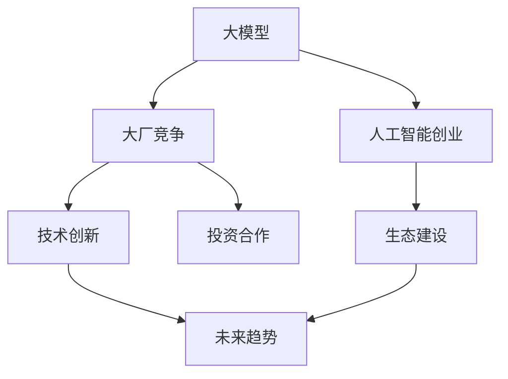

                 

# 中国大厂与大模型创业公司的竞争

> 关键词：
    - 大模型
    - 大厂竞争
    - 人工智能创业
    - 技术创新
    - 生态建设
    - 未来趋势
    - 投资合作

## 1. 背景介绍

### 1.1 问题由来
近年来，人工智能领域进入了一个快速发展的新纪元，尤其是在大语言模型（Large Language Models, LLMs）和大模型应用方面，国内外涌现了大量突破性成果。中国科技巨头如阿里巴巴、腾讯、字节跳动等公司，以及众多创业公司，纷纷投入巨资研发大模型，试图在这些前沿技术上占据领先地位。大模型的广泛应用不仅涉及搜索引擎、推荐系统、对话系统、自然语言处理等领域，还在金融、医疗、教育、智慧城市等垂直行业展现出了巨大潜力。大模型的开发与部署不仅需要庞大的数据集和强大的计算能力，还需要构建完善的生态系统和商业化运营，因此大模型的竞争已经成为未来科技领域的重要竞争点。

### 1.2 问题核心关键点
大模型的竞争主要集中在以下几个方面：

1. **数据获取与处理能力**：数据是训练大模型的基石。如何高效获取、处理和标注大规模数据，直接影响到模型的质量和效果。
2. **计算资源投入**：大模型的训练和推理需要大量的计算资源，包括高性能GPU/TPU，高效的数据存储与处理系统，以及优化算法等。
3. **算法与模型创新**：大模型的核心竞争力在于其算法和模型架构，如何通过技术创新实现更高效的模型训练和推理，是竞争的关键。
4. **生态系统建设**：包括开发工具、应用场景、行业标准、商业化平台等多方面的系统性建设。
5. **市场与投资竞争**：从融资、人才、合作、收购等多角度展开的市场竞争。

这些关键点决定了大模型领域的竞争格局，同时也揭示了企业间竞争的本质和未来趋势。

### 1.3 问题研究意义
研究中国大厂与大模型创业公司的竞争，对于理解大模型的未来发展方向、投资机会、市场趋势具有重要意义：

1. **技术领先**：了解大厂和创业公司在技术上的优势与不足，有助于制定技术发展战略。
2. **市场布局**：分析不同公司在应用场景和行业布局上的策略，有助于识别潜在的商业机会。
3. **投资动态**：掌握大模型领域的重要投资动态和资本流动，有助于投资决策。
4. **生态合作**：研究各方之间的合作模式和利益关系，有助于构建良好的商业生态。
5. **风险规避**：识别潜在的法律、伦理和安全风险，制定应对策略。

## 2. 核心概念与联系

### 2.1 核心概念概述

在大模型的竞争中，涉及多个关键概念，包括：

- **大模型（Large Models）**：指预训练和微调后的深度学习模型，具有大规模参数量和丰富的语言知识。
- **大厂竞争（Big Factory Competition）**：指中国科技巨头之间的技术、市场和资本竞争。
- **人工智能创业（AI Startups）**：指专注于大模型技术研发和应用的公司，多以创业形式进入市场。
- **技术创新（Technological Innovation）**：指在模型架构、算法优化、应用拓展等方面的突破性进展。
- **生态建设（Ecosystem Development）**：指构建完整的大模型开发、部署、使用和维护生态系统。
- **未来趋势（Future Trends）**：指大模型技术未来的发展方向和应用场景。
- **投资合作（Investment and Collaboration）**：指资本市场对大模型的关注和投资，以及大厂之间的技术合作。

这些概念之间存在着紧密的联系，形成了大模型竞争的完整生态系统。通过理解这些核心概念，可以更好地把握大模型竞争的脉络。

### 2.2 概念间的关系

这些概念之间的关系可以用以下Mermaid流程图表示：



这个流程图展示了从大模型本身，到中国大厂、创业公司、技术创新、生态系统建设，再到未来趋势和投资合作之间的内在联系。

## 3. 核心算法原理 & 具体操作步骤
### 3.1 算法原理概述

大模型竞争的核心在于算法的技术创新和生态系统的完善。大模型算法和技术创新的原理主要包括以下几个方面：

- **自监督学习**：通过大规模无标签数据进行预训练，学习语言表示。
- **迁移学习**：利用预训练模型在特定任务上的微调，提升模型效果。
- **参数高效微调（PEFT）**：仅调整模型的一部分参数，减小过拟合风险。
- **对抗训练**：加入对抗样本，提高模型的鲁棒性和泛化能力。
- **序列建模与预训练**：利用语言序列的顺序关系，提升模型的理解能力。
- **多模态学习**：融合视觉、音频等多模态数据，增强模型的泛化能力。

### 3.2 算法步骤详解

大模型的竞争主要通过以下几个关键步骤进行：

1. **数据收集与处理**：获取和标注大规模数据集，构建预训练和微调所需数据。
2. **模型训练与微调**：利用自监督或监督学习任务进行模型预训练，然后在特定任务上进行微调。
3. **算法优化与创新**：通过算法优化、参数高效微调、对抗训练等技术，提升模型效果和性能。
4. **生态系统建设**：构建开发工具、API接口、行业标准等，支持模型的开发和应用。
5. **市场与投资竞争**：通过融资、合作、并购等方式，获取更多资源和市场份额。

### 3.3 算法优缺点

大模型竞争的优缺点如下：

**优点**：

1. **技术领先**：大模型在处理复杂任务、提升用户体验等方面具有明显优势。
2. **数据驱动**：通过大规模数据训练，模型能够学习丰富的语言知识和常识。
3. **多模态融合**：融合视觉、音频等多模态数据，增强模型的泛化能力。
4. **应用广泛**：涉及搜索引擎、推荐系统、对话系统等多个领域，市场潜力巨大。

**缺点**：

1. **资源消耗大**：需要大量计算资源和标注数据，对硬件和人员投入高。
2. **技术门槛高**：涉及多学科知识，开发和维护难度大。
3. **风险和伦理问题**：模型可能存在偏见和有害信息，需要严格监管。
4. **商业化挑战**：需要构建完善的应用生态，市场转化难度大。

### 3.4 算法应用领域

大模型在多个领域都有广泛的应用，包括：

- **搜索引擎**：利用大模型进行自然语言理解和信息检索，提升查询结果的相关性和多样性。
- **推荐系统**：通过大模型学习用户兴趣和行为，推荐个性化的内容和服务。
- **对话系统**：利用大模型进行自然语言理解和生成，实现智能对话和客服。
- **自然语言处理**：包括命名实体识别、情感分析、文本分类、机器翻译等任务。
- **智能医疗**：利用大模型进行医学文献分析、疾病诊断和药物发现。
- **金融科技**：利用大模型进行舆情分析、风险评估和智能投顾。
- **智慧城市**：利用大模型进行城市管理、交通调度和安防监控。

## 4. 数学模型和公式 & 详细讲解 & 举例说明

### 4.1 数学模型构建

大模型的数学模型构建涉及预训练和微调两个阶段：

1. **预训练模型**：使用大规模无标签数据，通过自监督学习任务进行训练。
2. **微调模型**：利用下游任务的标注数据，通过有监督学习任务进行微调。

数学公式如下：

$$
\theta = \arg\min_{\theta} \mathcal{L}(M_{\theta}, D)
$$

其中 $\theta$ 表示模型参数，$M_{\theta}$ 表示模型，$D$ 表示数据集，$\mathcal{L}$ 表示损失函数。

### 4.2 公式推导过程

以语言模型为例，预训练模型的目标是最小化预测概率与实际概率的差距。数学公式如下：

$$
\min_{\theta} \sum_{i=1}^N -\log p(x_i)
$$

其中 $x_i$ 表示输入序列，$p(x_i)$ 表示模型预测的概率分布。

微调模型的目标是在特定任务上进行优化。假设微调任务为分类任务，则损失函数可以表示为：

$$
\mathcal{L}(\theta) = -\frac{1}{N}\sum_{i=1}^N [y_i\log M_{\theta}(x_i)+(1-y_i)\log(1-M_{\theta}(x_i))]
$$

其中 $y_i$ 表示真实标签，$M_{\theta}(x_i)$ 表示模型预测的输出。

### 4.3 案例分析与讲解

假设某创业公司利用大模型进行自然语言处理，以下是微调过程的案例分析：

1. **数据准备**：收集特定领域的文本数据，进行清洗和标注，构建训练集、验证集和测试集。
2. **模型选择**：选择预训练模型BERT，作为微调的初始参数。
3. **任务适配**：设计适当的任务适配层，包括输出层和损失函数，以适应分类任务。
4. **微调训练**：使用AdamW优化算法，设置合适的学习率，训练若干轮次，并在验证集上评估性能。
5. **测试评估**：在测试集上评估模型性能，与未微调前进行对比，评估微调效果。

## 5. 项目实践：代码实例和详细解释说明

### 5.1 开发环境搭建

大模型开发通常需要在高性能计算环境下进行，以下是在Python环境下使用TensorFlow进行大模型微调的开发环境搭建流程：

1. 安装Anaconda：从官网下载并安装Anaconda，用于创建独立的Python环境。

2. 创建并激活虚拟环境：
```bash
conda create -n tensorflow-env python=3.8 
conda activate tensorflow-env
```

3. 安装TensorFlow：根据CUDA版本，从官网获取对应的安装命令。例如：
```bash
conda install tensorflow=2.9.0 -c tf
```

4. 安装TensorBoard：用于可视化模型训练过程，方便调试。
```bash
pip install tensorboard
```

5. 安装相关库：
```bash
pip install numpy pandas scikit-learn
```

完成上述步骤后，即可在`tensorflow-env`环境中开始微调实践。

### 5.2 源代码详细实现

以下以BERT模型为例，进行自然语言处理任务的微调代码实现。

首先，准备数据集：

```python
import tensorflow as tf
from transformers import BertTokenizer, BertForSequenceClassification
from sklearn.model_selection import train_test_split
import pandas as pd

# 读取数据集
data = pd.read_csv('data.csv')

# 数据预处理
tokenizer = BertTokenizer.from_pretrained('bert-base-cased')
encoded_data = tokenizer.batch_encode_plus(data['text'], truncation=True, padding='max_length', max_length=512, return_tensors='tf')
labels = tf.convert_to_tensor(data['label'])

# 划分训练集和测试集
train_data, test_data, train_labels, test_labels = train_test_split(encoded_data['input_ids'], labels, test_size=0.2)
```

然后，定义模型和优化器：

```python
# 定义模型
model = BertForSequenceClassification.from_pretrained('bert-base-cased', num_labels=2)

# 定义优化器
optimizer = tf.keras.optimizers.AdamW(learning_rate=2e-5)
```

接着，定义训练和评估函数：

```python
# 定义训练函数
@tf.function
def train_step(data, labels):
    with tf.GradientTape() as tape:
        outputs = model(data, labels=labels)
        loss = outputs.loss
    gradients = tape.gradient(loss, model.trainable_variables)
    optimizer.apply_gradients(zip(gradients, model.trainable_variables))
    return loss

# 定义评估函数
def evaluate_step(data, labels):
    with tf.GradientTape() as tape:
        outputs = model(data, labels=labels)
        loss = outputs.loss
    return loss
```

最后，启动训练流程并在测试集上评估：

```python
# 训练模型
num_epochs = 3
batch_size = 16

for epoch in range(num_epochs):
    for train_batch, train_labels in zip(train_data, train_labels):
        loss = train_step(train_batch, train_labels)
    print(f'Epoch {epoch+1}, Loss: {loss.numpy():.3f}')

# 评估模型
for test_batch, test_labels in zip(test_data, test_labels):
    loss = evaluate_step(test_batch, test_labels)
print(f'Test Loss: {loss.numpy():.3f}')
```

以上就是使用TensorFlow进行BERT模型微调的完整代码实现。可以看到，TensorFlow提供了强大的计算图和分布式训练支持，适合大规模模型的训练和微调。

### 5.3 代码解读与分析

让我们再详细解读一下关键代码的实现细节：

**BERT模型微调**：
- `BertForSequenceClassification`：从预训练BERT模型中加载序列分类模型。
- `optimizer`：使用AdamW优化器，设置学习率。
- `train_step`：定义训练步骤，使用梯度下降更新模型参数。
- `evaluate_step`：定义评估步骤，计算模型在测试集上的损失。

**数据处理**：
- `tokenizer`：使用BertTokenizer对文本数据进行分词和编码。
- `encoded_data`：将文本数据编码成TensorFlow格式，方便模型处理。
- `train_data, test_data, train_labels, test_labels`：将数据集划分训练集和测试集，并转换为TensorFlow格式。

**训练与评估**：
- `for`循环：在每个epoch内，对训练集和测试集进行迭代训练和评估。
- `batch_size`：控制训练和评估的批次大小。
- `train_labels`：控制模型在训练集上的标签。
- `test_labels`：控制模型在测试集上的标签。

**模型评估**：
- `loss`：计算模型在测试集上的损失，评估模型效果。

可以看出，TensorFlow提供了一个简洁、高效的大模型微调开发框架，可以显著降低模型开发的复杂度，加速模型的训练和评估过程。

## 6. 实际应用场景

### 6.1 智能客服系统

智能客服系统是大模型应用的重要场景之一。利用大模型进行自然语言处理，可以实现智能客服的自动回答和情感分析，提升客户咨询体验和满意度。例如，阿里巴巴的智能客服系统“阿里小蜜”，就使用了BERT模型进行微调，能够在处理客户咨询时提供高效、准确的回复。

### 6.2 金融舆情监测

金融舆情监测是大模型在金融领域的重要应用。利用大模型进行文本分类和情感分析，可以实时监测市场舆情，辅助金融决策。例如，腾讯的金融舆情监测系统，使用BERT模型进行微调，能够准确识别和分类金融新闻，帮助分析师及时发现市场变化。

### 6.3 个性化推荐系统

个性化推荐系统是大模型在电商领域的重要应用。利用大模型进行用户兴趣分析，可以推荐个性化的商品和服务，提升用户体验和转化率。例如，京东的个性化推荐系统，使用BERT模型进行微调，能够根据用户浏览和购买行为，生成个性化的商品推荐列表。

### 6.4 未来应用展望

未来，大模型的应用将更加广泛，涉及到更多行业和场景。例如：

1. **智慧医疗**：利用大模型进行医学文献分析和疾病诊断，提升医疗服务效率和准确性。
2. **智能制造**：利用大模型进行生产流程优化和设备维护，提高制造业智能化水平。
3. **智慧城市**：利用大模型进行城市管理和交通调度，提升城市管理效率和智能化水平。
4. **智能家居**：利用大模型进行语音识别和场景理解，提升家居智能化水平。

## 7. 工具和资源推荐

### 7.1 学习资源推荐

为了帮助开发者系统掌握大模型微调的理论基础和实践技巧，这里推荐一些优质的学习资源：

1. **《深度学习理论与实践》系列书籍**：由深度学习领域专家撰写，涵盖深度学习的基本原理和应用案例。
2. **CS231n《深度学习视觉与图像识别》课程**：斯坦福大学开设的视觉领域明星课程，提供丰富的深度学习实践资源。
3. **《Transformer模型及其应用》论文**：Transformer模型的原创论文和后续应用研究，介绍了Transformer架构和应用案例。
4. **《自然语言处理综述》论文**：自然语言处理领域的综述性论文，介绍了NLP领域的最新进展和研究趋势。
5. **GitHub开源项目**：优秀的自然语言处理开源项目，提供丰富的代码实现和应用案例。

### 7.2 开发工具推荐

高效的开发离不开优秀的工具支持。以下是几款用于大模型微调开发的常用工具：

1. **TensorFlow**：由Google主导开发的开源深度学习框架，适合大规模工程应用。
2. **PyTorch**：基于Python的开源深度学习框架，灵活动态的计算图，适合快速迭代研究。
3. **Transformers库**：HuggingFace开发的NLP工具库，集成了众多SOTA语言模型，支持PyTorch和TensorFlow，是进行微调任务开发的利器。
4. **Weights & Biases**：模型训练的实验跟踪工具，可以记录和可视化模型训练过程中的各项指标，方便对比和调优。
5. **Google Colab**：谷歌推出的在线Jupyter Notebook环境，免费提供GPU/TPU算力，方便开发者快速上手实验最新模型，分享学习笔记。

### 7.3 相关论文推荐

大模型和微调技术的发展源于学界的持续研究。以下是几篇奠基性的相关论文，推荐阅读：

1. **Attention is All You Need**：Transformer模型的原创论文，提出了Transformer结构，开启了NLP领域的预训练大模型时代。
2. **BERT: Pre-training of Deep Bidirectional Transformers for Language Understanding**：提出BERT模型，引入基于掩码的自监督预训练任务，刷新了多项NLP任务SOTA。
3. **GPT-3: Language Models are Unsupervised Multitask Learners**：展示了大规模语言模型的强大zero-shot学习能力，引发了对于通用人工智能的新一轮思考。
4. **Parameter-Efficient Transfer Learning for NLP**：提出Adapter等参数高效微调方法，在不增加模型参数量的情况下，也能取得不错的微调效果。
5. **Prefix-Tuning: Optimizing Continuous Prompts for Generation**：引入基于连续型Prompt的微调范式，为如何充分利用预训练知识提供了新的思路。

## 8. 总结：未来发展趋势与挑战

### 8.1 总结

本文对大模型和大厂竞争进行了全面系统的介绍。首先阐述了大模型和大厂竞争的研究背景和意义，明确了两者在大模型领域的核心竞争点。其次，从原理到实践，详细讲解了监督微调的数学原理和关键步骤，给出了微调任务开发的完整代码实例。同时，本文还广泛探讨了微调方法在智能客服、金融舆情、个性化推荐等多个行业领域的应用前景，展示了微调范式的巨大潜力。最后，本文精选了微调技术的各类学习资源，力求为读者提供全方位的技术指引。

通过本文的系统梳理，可以看到，大模型和大厂竞争在技术、市场、资本等多个维度展开，竞争激烈且复杂。这些核心概念和大厂之间的竞争格局，为我们理解大模型领域的未来发展提供了重要视角。

### 8.2 未来发展趋势

展望未来，大模型和大厂竞争将呈现以下几个发展趋势：

1. **技术创新加速**：大模型领域的技术创新层出不穷，预训练模型和微调方法将不断优化，提升模型性能和泛化能力。
2. **跨行业应用拓展**：大模型将逐步应用于更多行业，提升各行业的智能化水平。
3. **生态系统完善**：大厂和创业公司将进一步完善生态系统，包括开发工具、应用场景、行业标准等。
4. **投资合作深化**：大厂和创业公司将进一步深化合作，共享资源和技术，构建共赢的商业生态。
5. **应用落地加速**：大模型将在更多垂直行业实现落地，提升各行各业的数字化转型效率。
6. **伦理和安全提升**：大模型将注重伦理和安全性问题，确保模型行为符合人类价值观和社会规范。

这些趋势凸显了大模型和大厂竞争的广阔前景，也为我们提供了诸多发展机会。

### 8.3 面临的挑战

尽管大模型和大厂竞争带来了巨大的发展潜力，但在迈向更加智能化、普适化应用的过程中，也面临诸多挑战：

1. **数据质量和数量瓶颈**：大模型需要大量高质量数据进行预训练和微调，数据获取和标注成本高，数据质量难以保证。
2. **资源投入大**：大模型的训练和推理需要大量的计算资源和人力资源，成本高。
3. **技术门槛高**：大模型开发和维护难度大，需要跨学科知识和技术支持。
4. **伦理和法律问题**：大模型可能存在偏见和有害信息，需严格监管，确保模型行为符合法律法规。
5. **市场转化难度大**：大模型需要构建完善的生态系统，才能实现大规模应用，市场转化难度大。

### 8.4 研究展望

面对大模型和大厂竞争的挑战，未来的研究需要在以下几个方面寻求新的突破：

1. **无监督学习研究**：探索更多无监督和半监督学习范式，降低对大规模标注数据的依赖。
2. **参数高效微调技术**：开发更多参数高效微调方法，提升微调效率和效果。
3. **多模态融合技术**：融合视觉、音频等多模态数据，增强模型的泛化能力和智能化水平。
4. **小样本学习和自适应学习**：提升模型在少量样本上的学习和推理能力，增强模型的鲁棒性和适应性。
5. **模型压缩与优化技术**：研究高效的模型压缩与优化方法，提升模型推理速度和资源利用率。
6. **伦理与安全技术**：开发模型伦理和安全评估工具，确保模型行为符合人类价值观和法律法规。

总之，大模型和大厂竞争需要从技术、市场、伦理等多个维度进行全面提升，方能实现大模型的广泛应用和商业化成功。只有在技术创新和市场应用的相互促进下，才能让大模型真正成为推动人类认知智能进化的重要力量。

## 9. 附录：常见问题与解答

**Q1：大模型和大厂竞争的优劣势是什么？**

A: 大模型的优势在于其强大的语言理解和生成能力，可以应用于多种复杂任务，但劣势在于需要大量计算资源和数据标注。大厂竞争的优势在于其强大的资源和资本支持，可以快速推出高质量的大模型，但劣势在于市场反应速度和灵活性可能不如创业公司。

**Q2：大模型和大厂竞争如何影响未来的技术发展？**

A: 大模型和大厂竞争将推动技术的不断创新和优化，促进更多技术突破和应用落地。同时，竞争也将加速行业标准的制定和生态系统的完善，提升技术应用的规范性和安全性。

**Q3：如何确保大模型和大厂竞争的公平性？**

A: 公平性是大模型和大厂竞争中的重要问题，需要各方共同努力。可以采用公平竞争机制，如公开数据集、开放API接口、共享技术资源等，确保各方的公平参与和竞争。同时，政府和监管机构也需要出台相应的政策和法规，规范市场竞争，保护消费者权益。

**Q4：未来大模型的应用前景如何？**

A: 未来大模型将在更多行业和场景中得到应用，如智慧医疗、智能制造、智慧城市等。大模型将进一步提升各行业的智能化水平，推动数字化转型和创新发展。

**Q5：大模型和大厂竞争面临的主要挑战是什么？**

A: 大模型和大厂竞争面临的主要挑战包括数据质量和数量瓶颈、资源投入大、技术门槛高、伦理和法律问题、市场转化难度大等。解决这些挑战需要多方共同努力，推动技术创新和生态系统完善。

通过这些问题的回答，可以更好地理解大模型和大厂竞争的复杂性和多样性，为未来的技术研究和市场应用提供重要的参考。

---

作者：禅与计算机程序设计艺术 / Zen and the Art of Computer Programming

