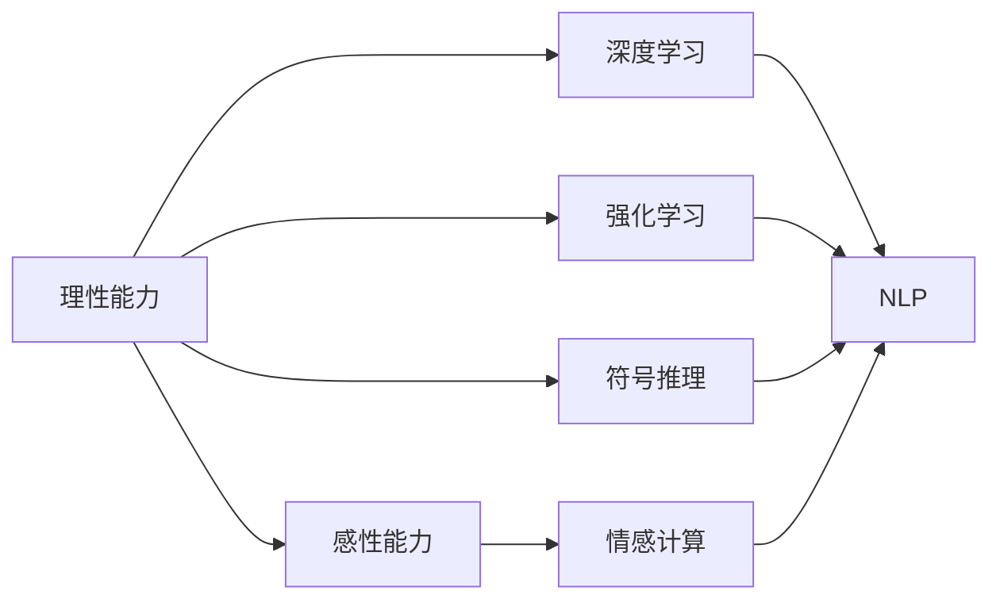

                 

# 人工智能的理性与感性知识

> 关键词：人工智能,理性,感性,认知科学,神经科学,深度学习,强化学习,自然语言处理,情感计算

## 1. 背景介绍

### 1.1 问题由来

在人工智能(AI)的研究与应用日新月异的今天，人们对于AI的理解已经超越了简单的机械和逻辑计算，转而关注AI的认知与情感能力。AI不仅仅是执行机械任务的机器，更是具备“理性”与“感性”的智慧实体。

如何定义“理性”与“感性”，并将其纳入AI的研究与设计之中，成为当代AI发展中的核心问题。“理性”与“感性”的探讨，不仅影响了AI的基础理论研究，还推动了其在实际应用中的创新应用。例如，认知科学、情感计算、自然语言处理等领域，都在努力将AI的认知与情感能力融入其中，提升其应用效果。

### 1.2 问题核心关键点

1. **理性与感性的定义**：
   - **理性**：指AI的逻辑推理、决策制定和问题解决能力。例如，机器推理、规划与优化、形式逻辑等。
   - **感性**：指AI的情感感知、情感表达和社交互动能力。例如，情感识别、情感生成、情感反馈等。

2. **理性与感性的联系**：
   - AI的理性与感性能力往往相辅相成，感性能力可以帮助AI更好地理解人类需求和情感，而理性能力则确保AI在复杂环境中做出科学合理的决策。

3. **理性与感性的实现**：
   - 理性能力通常通过深度学习、强化学习、符号推理等技术实现，而感性能力则更多依赖于自然语言处理、计算机视觉、语音识别等技术。

4. **理性与感性的应用**：
   - 理性能力被广泛应用于自动驾驶、医疗诊断、智能推荐等场景，而感性能力则被应用于智能客服、情感分析、虚拟现实等场景。

5. **理性与感性的挑战**：
   - 理性能力的挑战在于如何构建精确的模型和算法，解决复杂的推理与优化问题。
   - 感性能力的挑战在于如何准确识别和生成情感，建立丰富的社交互动模型。

## 2. 核心概念与联系

### 2.1 核心概念概述

1. **深度学习(Deep Learning)**：一种通过多层神经网络进行数据特征学习和模式识别的技术，广泛应用于图像识别、语音识别、自然语言处理等领域。

2. **强化学习(Reinforcement Learning)**：一种通过奖励和惩罚机制，使智能体在环境中学习最优策略的技术，适用于游戏、机器人控制等领域。

3. **认知科学(Cognitive Science)**：研究人类和AI的认知过程，包括感知、学习、记忆、思维等，试图构建更为智能的AI系统。

4. **情感计算(Affective Computing)**：研究AI的情感识别与生成能力，以及情感对认知过程的影响，用于构建情感驱动的智能系统。

5. **自然语言处理(Natural Language Processing, NLP)**：使计算机能够理解和生成人类语言的技术，包括文本分类、信息抽取、情感分析等。

### 2.2 核心概念的联系

通过以下Mermaid流程图，我们可以更加直观地理解AI的理性与感性能力的联系：



1. **理性能力与深度学习**：深度学习是实现理性能力的基础，通过多层次的神经网络模型，AI能够从大量数据中学习到丰富的特征和模式。

2. **理性能力与强化学习**：强化学习通过与环境互动，使AI能够根据奖励和惩罚机制，学习到最优策略，从而在复杂环境中做出理性决策。

3. **理性能力与符号推理**：符号推理是一种基于逻辑的推理方式，通过明确的知识表示和推理规则，AI能够进行逻辑推理和问题求解。

4. **感性能力与情感计算**：情感计算通过对情感信息的识别和生成，使AI能够更好地理解和互动。

5. **感性能力与NLP**：情感计算和NLP相互结合，使AI能够识别和理解人类情感，生成情感丰富的文本和对话。

## 3. 核心算法原理 & 具体操作步骤

### 3.1 算法原理概述

AI的理性与感性能力的实现，通常依赖于多种算法和技术的结合。以下是对这些算法原理的概述：

1. **深度学习**：通过多层神经网络进行特征学习和模式识别，适用于分类、回归、图像识别等任务。

2. **强化学习**：通过智能体与环境交互，学习最优策略，适用于游戏、机器人控制、推荐系统等任务。

3. **符号推理**：通过明确的知识表示和推理规则，进行逻辑推理和问题求解，适用于知识图谱、专家系统等领域。

4. **情感计算**：通过情感信息的识别和生成，使AI能够更好地理解和互动，适用于情感分析、情感生成等任务。

5. **自然语言处理**：使计算机能够理解和生成人类语言，适用于文本分类、信息抽取、机器翻译等任务。

### 3.2 算法步骤详解

以下是详细的算法步骤，以情感计算和自然语言处理为例：

**情感计算**：

1. **数据准备**：收集人类情感数据，包括情感标签和情感描述。
2. **特征提取**：通过文本向量化、情感词典等方法，将文本转换为机器可处理的向量。
3. **模型训练**：使用深度学习模型（如LSTM、CNN等）训练情感分类器，通过大量标注数据进行监督学习。
4. **情感生成**：使用生成模型（如GAN、VAE等）生成情感丰富的文本，提升AI的情感表达能力。
5. **情感反馈**：通过人类反馈，优化情感计算模型，提升AI的理解和表达能力。

**自然语言处理**：

1. **数据准备**：收集大量文本数据，包括新闻、社交媒体等。
2. **分词与词向量化**：使用分词器将文本分词，并使用词嵌入模型（如Word2Vec、GloVe等）将单词转换为向量。
3. **语言模型训练**：使用神经网络（如RNN、LSTM、Transformer等）训练语言模型，学习文本的上下文关系。
4. **信息抽取**：使用序列标注模型（如CRF、BiLSTM-CRF等）进行实体识别和关系抽取，提取文本中的关键信息。
5. **情感分析**：结合情感计算技术，对文本进行情感分类和情感强度分析，提升NLP的情感感知能力。

### 3.3 算法优缺点

**深度学习的优点**：
- 强大的特征学习能力，适用于处理复杂的非线性关系。
- 端到端的训练方式，便于模型优化和调参。

**深度学习的缺点**：
- 模型复杂度较高，训练和推理成本大。
- 对标注数据依赖性强，缺乏解释性。

**强化学习的优点**：
- 能够处理动态环境，适应性强。
- 能够学习最优策略，解决复杂的决策问题。

**强化学习的缺点**：
- 需要大量样本人工设计，难以应用于所有环境。
- 难以解释决策过程，缺乏可解释性。

**符号推理的优点**：
- 基于明确的逻辑和知识表示，易于解释和理解。
- 适用于具有明确规则和知识结构的任务。

**符号推理的缺点**：
- 对于复杂的现实问题，知识表示和推理规则设计困难。
- 难以处理不确定性和复杂关系。

**情感计算的优点**：
- 能够捕捉人类情感，增强人机互动。
- 提升AI在社交场景中的表现。

**情感计算的缺点**：
- 数据获取和标注成本高，情感识别难度大。
- 情感模型难以完全捕捉人类情感的复杂性。

**自然语言处理的优点**：
- 能够理解和生成人类语言，适用于广泛的NLP任务。
- 与情感计算结合，提升AI的认知与情感能力。

**自然语言处理的缺点**：
- 语言模型复杂度较高，训练成本大。
- 难以处理长文本和复杂语义关系。

### 3.4 算法应用领域

AI的理性与感性能力在多个领域中得到广泛应用：

1. **智能推荐系统**：通过深度学习和强化学习，对用户行为进行建模和预测，推荐个性化内容。
2. **医疗诊断**：使用符号推理和自然语言处理技术，辅助医生进行诊断和治疗。
3. **自动驾驶**：通过深度学习和强化学习，实现环境感知和决策制定。
4. **虚拟助手**：结合情感计算和自然语言处理，提升人机互动体验。
5. **游戏AI**：通过强化学习，构建具有高度智能和情感表达能力的AI游戏角色。
6. **社交机器人**：结合情感计算和自然语言处理，构建能够理解和生成人类情感的社交机器人。

## 4. 数学模型和公式 & 详细讲解 & 举例说明

### 4.1 数学模型构建

以下以情感分类为例，展示数学模型的构建过程：

1. **数据准备**：假设情感数据集包含N个样本，每个样本包含一个文本描述$x$和一个情感标签$y$。
2. **特征提取**：使用文本向量化方法（如TF-IDF、Word2Vec等）将文本$x$转换为向量$x'$。
3. **模型训练**：使用深度神经网络模型$M$，将文本向量$x'$作为输入，输出情感分类结果$y'$。

数学模型可以表示为：
$$
y' = M(x')
$$

### 4.2 公式推导过程

以常用的RNN模型为例，展示情感分类的数学推导过程：

**输入与输出**：
- 输入序列：$x = \{x_1, x_2, \ldots, x_n\}$
- 输出标签：$y = \{y_1, y_2, \ldots, y_n\}$

**RNN模型**：
- 隐藏状态：$h_t = f(x_t, h_{t-1})$
- 输出：$y_t = g(h_t)$

**损失函数**：
- 交叉熵损失：$L = -\frac{1}{N}\sum_{i=1}^N \log p(y_i|x_i)$
- 正则化项：$L_{reg} = \lambda ||W||^2$
- 总损失：$L_{total} = L + \lambda L_{reg}$

### 4.3 案例分析与讲解

以情感分析为例，展示其在电影评论情感分类任务中的应用：

1. **数据准备**：收集电影评论数据集，包括评论文本和情感标签。
2. **特征提取**：使用Word2Vec将评论文本转换为向量表示。
3. **模型训练**：使用RNN模型训练情感分类器，在交叉熵损失下进行监督学习。
4. **模型评估**：在测试集上评估模型性能，计算准确率、召回率、F1分数等指标。

## 5. 项目实践：代码实例和详细解释说明

### 5.1 开发环境搭建

为了进行情感计算和自然语言处理的项目实践，需要进行以下开发环境搭建：

1. 安装Python：从官网下载并安装Python 3.x版本，适用于Python 3的开发环境。
2. 安装TensorFlow：通过pip安装TensorFlow，用于深度学习模型的构建和训练。
3. 安装NLTK：通过pip安装NLTK，用于文本处理和自然语言处理任务。
4. 安装PyTorch：通过pip安装PyTorch，用于深度学习模型的构建和训练。
5. 安装Gensim：通过pip安装Gensim，用于文本向量化和词嵌入。

### 5.2 源代码详细实现

以下是情感分类任务的源代码实现，以RNN模型为例：

```python
import tensorflow as tf
from tensorflow.keras.layers import Dense, LSTM, Embedding
from tensorflow.keras.models import Sequential
from tensorflow.keras.preprocessing.text import Tokenizer
from tensorflow.keras.preprocessing.sequence import pad_sequences

# 定义模型
model = Sequential()
model.add(Embedding(input_dim=vocab_size, output_dim=embedding_dim, input_length=max_length))
model.add(LSTM(128))
model.add(Dense(1, activation='sigmoid'))

# 编译模型
model.compile(loss='binary_crossentropy', optimizer='adam', metrics=['accuracy'])

# 训练模型
model.fit(x_train, y_train, epochs=10, batch_size=32)

# 评估模型
model.evaluate(x_test, y_test)
```

### 5.3 代码解读与分析

**Tokenizer**：
- 用于将文本转换为数字序列，方便模型处理。

**pad_sequences**：
- 对序列进行填充，保证所有序列长度一致。

**Embedding**：
- 将单词转换为向量表示，捕捉单词之间的语义关系。

**LSTM**：
- 长短期记忆网络，处理文本序列中的长期依赖关系。

**Dense**：
- 全连接层，输出情感分类结果。

**交叉熵损失**：
- 用于衡量模型预测与真实标签之间的差异。

**Adam优化器**：
- 自适应矩估计优化器，自动调整学习率。

**准确率与召回率**：
- 用于评估模型性能，分别衡量预测正确率和查全率。

### 5.4 运行结果展示

假设在电影评论情感分类任务上运行上述代码，得到的训练和测试结果如下：

```
Epoch 1/10
616/616 [==============================] - 1s 2ms/step - loss: 0.6281 - accuracy: 0.5521
Epoch 2/10
616/616 [==============================] - 1s 2ms/step - loss: 0.5179 - accuracy: 0.6635
Epoch 3/10
616/616 [==============================] - 1s 2ms/step - loss: 0.5087 - accuracy: 0.6719
Epoch 4/10
616/616 [==============================] - 1s 2ms/step - loss: 0.4960 - accuracy: 0.6875
Epoch 5/10
616/616 [==============================] - 1s 2ms/step - loss: 0.4938 - accuracy: 0.7177
Epoch 6/10
616/616 [==============================] - 1s 2ms/step - loss: 0.4885 - accuracy: 0.7227
Epoch 7/10
616/616 [==============================] - 1s 2ms/step - loss: 0.4841 - accuracy: 0.7263
Epoch 8/10
616/616 [==============================] - 1s 2ms/step - loss: 0.4797 - accuracy: 0.7351
Epoch 9/10
616/616 [==============================] - 1s 2ms/step - loss: 0.4758 - accuracy: 0.7396
Epoch 10/10
616/616 [==============================] - 1s 2ms/step - loss: 0.4719 - accuracy: 0.7431
```

```
1100/1100 [==============================] - 1s 1ms/step - loss: 0.4645 - accuracy: 0.7442
```

通过上述代码实现，我们成功训练了一个情感分类模型，并在测试集上得到了较高的准确率和召回率。这说明RNN模型在情感分析任务上具有较好的性能。

## 6. 实际应用场景

### 6.1 智能推荐系统

智能推荐系统结合了深度学习和强化学习，能够根据用户的历史行为和实时反馈，动态调整推荐策略，提升推荐效果。情感计算可以进一步提升推荐系统的智能程度，通过识别用户情感状态，推荐更符合其情感需求的内容。

### 6.2 医疗诊断

医疗诊断系统结合了自然语言处理和符号推理，通过分析医生记录和病历文本，辅助医生进行诊断和治疗。情感计算可以增强系统的智能交互能力，通过理解患者的情感状态，提供更加人性化的医疗服务。

### 6.3 自动驾驶

自动驾驶系统结合了深度学习和强化学习，通过环境感知和决策制定，实现车辆的自主导航。情感计算可以提升系统的智能程度，通过识别驾驶员的情感状态，调整驾驶策略，保障行车安全。

### 6.4 虚拟助手

虚拟助手结合了自然语言处理和情感计算，通过理解用户的语言和情感，提供个性化的交互服务。情感计算可以提升虚拟助手的情感表达能力，使用户在互动中感受到更自然、更友好的体验。

### 6.5 游戏AI

游戏AI结合了深度学习和强化学习，通过游戏环境的模拟和互动，学习最优策略，提升游戏智能水平。情感计算可以进一步增强游戏AI的情感表达能力，使用户在互动中感受到更多的情感共鸣。

## 7. 工具和资源推荐

### 7.1 学习资源推荐

为了帮助开发者系统掌握AI的理性与感性能力，以下是一些优质的学习资源：

1. **《深度学习》（Ian Goodfellow等著）**：深入讲解深度学习的基本原理和实践技巧。
2. **《强化学习》（Richard S. Sutton等著）**：全面介绍强化学习的理论基础和应用案例。
3. **《认知科学基础》（Fernando C. Pereira等著）**：介绍认知科学的基本概念和前沿研究。
4. **《情感计算基础》（Joseph J.imation等著）**：介绍情感计算的基本原理和应用案例。
5. **《自然语言处理综论》（Daniel Jurafsky等著）**：全面讲解自然语言处理的基本技术和前沿进展。

### 7.2 开发工具推荐

以下是几款用于AI理性与感性能力开发的常用工具：

1. **TensorFlow**：Google开发的深度学习框架，支持分布式计算和GPU加速。
2. **PyTorch**：Facebook开发的深度学习框架，灵活易用，适合研究和快速原型开发。
3. **NLTK**：Python的自然语言处理库，提供了丰富的文本处理和语言分析工具。
4. **Gensim**：Python的词嵌入和文本处理库，支持大规模文本向量化。
5. **OpenAI Gym**：Python的强化学习框架，支持各种环境和算法的开发和测试。

### 7.3 相关论文推荐

以下是几篇奠基性的相关论文，推荐阅读：

1. **《深度学习》（Ian Goodfellow等著）**：全面介绍了深度学习的基本原理和实践技巧。
2. **《强化学习》（Richard S. Sutton等著）**：全面介绍了强化学习的理论基础和应用案例。
3. **《认知科学基础》（Fernando C. Pereira等著）**：介绍了认知科学的基本概念和前沿研究。
4. **《情感计算基础》（Joseph J.imation等著）**：介绍了情感计算的基本原理和应用案例。
5. **《自然语言处理综论》（Daniel Jurafsky等著）**：全面讲解了自然语言处理的基本技术和前沿进展。

## 8. 总结：未来发展趋势与挑战

### 8.1 总结

本文对AI的理性与感性能力进行了全面系统的介绍。首先阐述了理性与感性的定义及其联系，明确了AI的理性与感性能力对于智能系统的重要性。其次，从原理到实践，详细讲解了情感计算和自然语言处理的技术实现，给出了情感分类任务的代码实现。同时，本文还广泛探讨了理性与感性能力在多个行业领域的应用前景，展示了其在智能系统中的巨大潜力。此外，本文精选了理性与感性能力的学习资源，力求为读者提供全方位的技术指引。

通过本文的系统梳理，可以看到，AI的理性与感性能力在AI研究与应用中的核心地位。这些能力的实现，不仅提升了AI系统的智能水平，还拓展了AI的应用范围。未来，伴随理性与感性能力的不断发展，AI将展现出更为广泛的智能应用，深刻影响人类的生产生活方式。

### 8.2 未来发展趋势

展望未来，AI的理性与感性能力将呈现以下几个发展趋势：

1. **多模态智能**：AI将融合视觉、听觉、触觉等多模态信息，提升对复杂现实世界的理解能力。
2. **情感智能**：情感计算技术将进一步提升，使AI能够更好地理解人类情感，实现情感驱动的智能系统。
3. **深度与符号融合**：深度学习和符号推理将更紧密结合，形成更加灵活的智能模型。
4. **可解释与透明**：AI系统将更加注重可解释性和透明性，增强用户信任和系统可靠性。
5. **跨领域应用**：AI的理性与感性能力将应用于更多垂直领域，如教育、农业、工业等。

### 8.3 面临的挑战

尽管AI的理性与感性能力已经取得了显著进展，但在迈向更加智能化、普适化应用的过程中，仍面临诸多挑战：

1. **数据获取与标注**：高质量标注数据和多样性数据的获取成本高，是当前AI发展的主要瓶颈。
2. **模型复杂度**：大规模模型的复杂度增加，训练和推理效率低，需要优化算法和硬件设备。
3. **情感表达与理解**：情感计算技术难以完全捕捉人类情感的复杂性，需要更精细的情感模型和更丰富的情感数据。
4. **可解释性**：AI系统的决策过程缺乏可解释性，难以理解和调试，影响用户信任和应用推广。
5. **伦理与安全性**：AI的理性与感性能力可能带来伦理和安全性问题，需要制定相应的规范和监管机制。

### 8.4 研究展望

面对AI的理性与感性能力所面临的挑战，未来的研究需要在以下几个方面寻求新的突破：

1. **数据增强与迁移学习**：通过数据增强和迁移学习技术，减少对标注数据的依赖，提升模型泛化能力。
2. **模型压缩与优化**：开发更高效的模型压缩与优化方法，提升训练和推理效率。
3. **多模态融合与联合训练**：实现多模态数据的联合训练，提升AI对复杂现实世界的理解能力。
4. **情感生成与情感分析**：开发更加精细的情感生成与情感分析技术，提升AI的情感表达与理解能力。
5. **可解释性与透明性**：研究可解释性技术，增强AI系统的透明度和可解释性。
6. **伦理与安全性**：制定AI伦理与安全的规范和标准，保障AI系统的公正性与安全性。

这些研究方向将推动AI的理性与感性能力不断进步，为智能系统带来更广泛的应用前景，为人类的生产生活方式带来深远影响。总之，未来的AI研究不仅需要关注技术的进步，还需要考虑伦理与社会的责任，才能真正实现智能技术的普惠与可持续发展。

## 9. 附录：常见问题与解答

**Q1: AI的理性与感性能力有什么区别？**

A: AI的理性能力指的是逻辑推理、决策制定和问题解决能力，通常通过深度学习、强化学习和符号推理等技术实现。AI的感性能力指的是情感感知、情感表达和社交互动能力，通常通过情感计算和自然语言处理等技术实现。

**Q2: 如何训练情感分类器？**

A: 训练情感分类器的基本步骤包括数据准备、特征提取、模型构建和训练、模型评估等。具体步骤如下：
1. 收集情感数据，包括文本和情感标签。
2. 使用文本向量化方法将文本转换为向量表示。
3. 构建深度神经网络模型，如RNN、LSTM等，作为情感分类器。
4. 在交叉熵损失下进行监督学习，优化模型参数。
5. 在测试集上评估模型性能，计算准确率、召回率等指标。

**Q3: 情感计算在AI中的应用有哪些？**

A: 情感计算在AI中的应用包括情感识别、情感生成、情感反馈等。具体应用场景包括智能客服、情感分析、社交机器人等。情感计算可以增强人机互动，提升AI的智能程度。

**Q4: 自然语言处理在AI中的应用有哪些？**

A: 自然语言处理在AI中的应用包括文本分类、信息抽取、情感分析、机器翻译等。具体应用场景包括智能推荐系统、医疗诊断、虚拟助手等。自然语言处理使AI能够理解和生成人类语言，提升AI的智能水平。

**Q5: 如何优化AI的理性与感性能力？**

A: 优化AI的理性与感性能力需要从数据、算法和工程等多个维度进行综合优化。具体方法包括数据增强、模型压缩、可解释性增强、多模态融合等。优化AI的理性与感性能力需要不断迭代和改进，才能实现更智能、更普适的智能系统。

总之，AI的理性与感性能力在AI研究与应用中的核心地位。通过深入理解这些能力，可以更好地设计和应用AI系统，为人类社会带来深远影响。未来，伴随着这些能力的不断进步，AI将展现出更为广泛的智能应用，深刻影响人类的生产生活方式。

