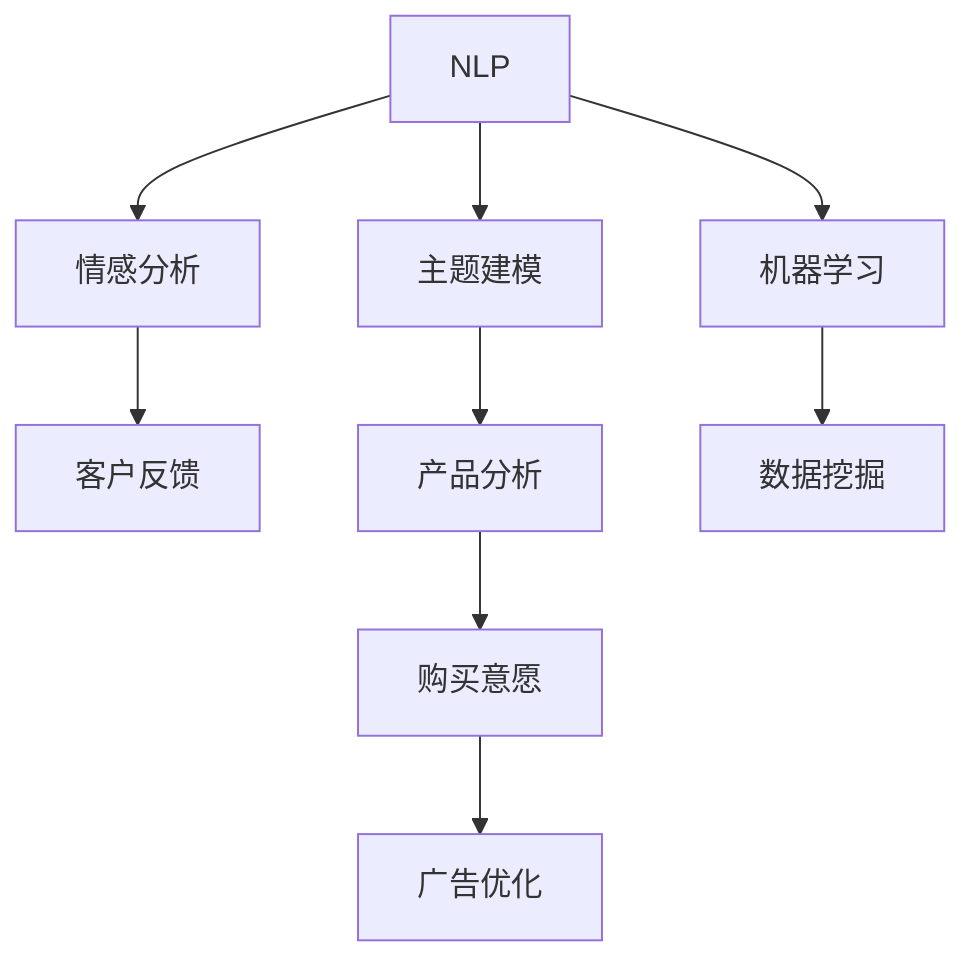

                 

# 智能文本分析在市场研究中的应用

> 关键词：
> - 智能文本分析
> - 市场研究
> - 情感分析
> - 主题建模
> - 消费者行为预测
> - 数据挖掘
> - 产品评价分析

## 1. 背景介绍

在激烈的市场竞争中，企业需要不断了解和分析市场动态，及时调整市场策略，以获取竞争优势。传统的市场研究方法如问卷调查、焦点小组等，虽然较为直接，但成本高、周期长、数据采集难度大。而随着大数据技术的发展，利用智能文本分析技术，可以从海量的互联网数据中快速、低成本地提取有价值的市场信息，成为市场研究的新手段。

智能文本分析基于自然语言处理(NLP)和机器学习算法，可以自动识别和抽取文本中的关键信息，进行情感分析、主题建模、消费者行为预测等任务。本节将详细介绍智能文本分析在市场研究中的应用场景和具体方法，以期为市场研究人员提供全新的数据采集和分析工具。

## 2. 核心概念与联系

### 2.1 核心概念概述

为了更好地理解智能文本分析技术，本节将介绍几个关键概念及其联系：

- **自然语言处理(NLP)**：涉及计算机如何理解、处理和生成自然语言。包括词法分析、句法分析、语义分析、情感分析、主题建模等任务。

- **机器学习(ML)**：利用算法让计算机自动学习和改进，无需手工编码。在文本分析中，常用算法包括决策树、支持向量机、深度学习等。

- **情感分析(Affective Analysis)**：识别文本中的情感倾向，判断为正面、中性或负面。常用于客户反馈、社交媒体分析等。

- **主题建模(Thematic Modeling)**：从大量文本中自动识别出隐含的主题。常用算法包括LDA（Latent Dirichlet Allocation）、LSI（Latent Semantic Indexing）等。

- **消费者行为预测(Consumer Behavior Prediction)**：利用文本分析技术，预测消费者的购买意愿、使用习惯等。常用于产品推荐、广告投放等。

- **数据挖掘(Data Mining)**：从数据中自动挖掘信息、模式和知识。智能文本分析是数据挖掘的重要分支，常用于客户细分、市场趋势预测等。

这些概念通过以下Mermaid流程图展示它们之间的关系：



## 3. 核心算法原理 & 具体操作步骤

### 3.1 算法原理概述

智能文本分析通常包括以下几个关键步骤：

1. **数据采集**：从互联网、社交媒体、在线评论等渠道获取文本数据。
2. **预处理**：对文本进行清洗、分词、去停用词、词性标注等处理，为后续分析做准备。
3. **特征提取**：将文本转换为可用于算法处理的向量或矩阵，常用的方法包括TF-IDF、Word2Vec、BERT等。
4. **情感分析**：识别文本中的情感倾向，常用的方法包括情感词典、机器学习算法等。
5. **主题建模**：识别文本中的主题结构，常用的方法包括LDA、LSI等。
6. **消费者行为预测**：基于主题分析和情感分析结果，预测消费者的行为，常用的方法包括回归分析、决策树等。

智能文本分析的核心算法原理基于统计学和机器学习的原理，通过大量数据训练模型，从中提取规律和知识。

### 3.2 算法步骤详解

#### 3.2.1 数据采集

智能文本分析的第一步是数据采集。常用的数据来源包括：

- **互联网评论**：如Amazon、京东等电商平台的商品评价。
- **社交媒体**：如微博、Twitter等社交平台的用户评论。
- **新闻媒体**：如路透社、新华网等媒体的新闻报道。
- **博客文章**：如技术博客、产品评论等。

数据采集通常使用爬虫工具进行，如Beautiful Soup、Scrapy等。需要遵循网站的使用协议，合理爬取数据。

#### 3.2.2 数据预处理

文本数据通常包含大量噪音和冗余信息，需要进行预处理。预处理步骤包括：

1. **清洗**：去除HTML标签、特殊符号、网址、表情符号等非文本信息。
2. **分词**：将文本按照词汇分割成单词或短语，中文通常使用分词工具，如jieba。
3. **去停用词**：去除常见的无意义词汇，如“的”、“是”、“我”等。
4. **词性标注**：对每个单词标注其词性，常用工具如NLTK、Stanford POS Tagger等。
5. **去除歧义词**：识别并去除文本中的歧义词，如“银行”可以指金融机构或河岸。

#### 3.2.3 特征提取

特征提取是将文本转换为可用于算法处理的向量或矩阵。常用的方法包括：

- **TF-IDF**：基于词频和逆文档频率，计算每个词的重要性。
- **Word2Vec**：通过训练神经网络，将每个单词转换为向量，保留词汇的语义信息。
- **BERT**：利用预训练的Transformer模型，提取文本的上下文语义特征。

#### 3.2.4 情感分析

情感分析的目的是识别文本中的情感倾向。常用的方法包括：

1. **情感词典**：使用预定义的情感词典，根据情感词的极性进行分类。
2. **机器学习算法**：训练分类器，如支持向量机(SVM)、随机森林(Random Forest)等，自动识别文本情感。

#### 3.2.5 主题建模

主题建模是从大量文本中自动识别出隐含的主题。常用的方法包括：

1. **LDA**：基于概率模型，将文本分解成多个主题，每个主题由多个单词组成。
2. **LSI**：利用奇异值分解，将文本表示为低维向量，揭示主题结构。

#### 3.2.6 消费者行为预测

消费者行为预测通常基于主题分析和情感分析结果。常用的方法包括：

1. **回归分析**：建立预测模型，预测消费者的购买意愿、使用习惯等。
2. **决策树**：通过分类器，预测消费者的购买决策。

### 3.3 算法优缺点

智能文本分析的优点包括：

- **高效性**：可以从海量文本中快速提取信息，节省时间和人力成本。
- **客观性**：通过算法自动处理文本，减少人为干预带来的误差。
- **灵活性**：可以应用于多个领域，如电商、媒体、社交网络等。

其缺点包括：

- **数据噪音**：文本数据通常包含大量噪音，预处理难度大。
- **语义理解难度**：自然语言的多义性和复杂性，使得语义理解仍是一个挑战。
- **算法复杂度**：部分算法如深度学习模型计算复杂度较高，需要较强的硬件支持。

### 3.4 算法应用领域

智能文本分析技术在多个领域都有广泛应用，以下是几个典型案例：

#### 3.4.1 电商市场分析

电商市场分析中，智能文本分析可以用于：

- **客户反馈分析**：通过分析用户评论，识别产品质量、价格、服务等关键因素。
- **产品比较分析**：比较不同产品评论中的情感倾向，找出优缺点。
- **广告效果评估**：分析广告文案和用户反馈，评估广告效果和用户满意度。

#### 3.4.2 社交媒体情感分析

社交媒体情感分析可以用于：

- **品牌监控**：监测品牌在社交媒体上的情感倾向，识别品牌形象变化。
- **舆情分析**：分析公众对某个事件或话题的情感态度，评估舆论倾向。
- **用户情感挖掘**：挖掘用户对产品的情感评价，进行市场调研。

#### 3.4.3 新闻媒体分析

新闻媒体分析可以用于：

- **新闻事件情感分析**：分析新闻报道中的情感倾向，评估媒体报道的情感影响。
- **新闻主题识别**：识别新闻报道中的主题结构，了解新闻热点和趋势。
- **市场趋势预测**：利用主题分析，预测市场趋势和变化。

#### 3.4.4 客户行为预测

客户行为预测可以用于：

- **推荐系统**：根据用户评论和行为数据，预测用户的购买意向和产品推荐。
- **广告投放**：分析用户反馈和兴趣，优化广告投放策略，提高广告效果。
- **客户细分**：通过情感分析和主题建模，将客户分为不同的群体，进行个性化营销。

## 4. 数学模型和公式 & 详细讲解 & 举例说明

### 4.1 数学模型构建

智能文本分析的核心数学模型包括以下几个部分：

- **文本表示模型**：将文本转换为向量或矩阵，常用的模型如TF-IDF、Word2Vec、BERT等。
- **情感分析模型**：用于识别文本情感的分类模型，常用的算法如情感词典、机器学习算法等。
- **主题建模模型**：用于识别文本主题的模型，常用的算法如LDA、LSI等。
- **消费者行为预测模型**：用于预测消费者行为的模型，常用的算法如回归分析、决策树等。

### 4.2 公式推导过程

#### 4.2.1 TF-IDF模型

TF-IDF模型是一种常用的文本表示模型，其公式为：

$$
\text{TF-IDF}(w,d,D) = \text{TF}(w,d) \times \text{IDF}(w,D)
$$

其中，$w$ 为单词，$d$ 为文档，$D$ 为文档集合。$\text{TF}(w,d)$ 表示单词 $w$ 在文档 $d$ 中的词频，$\text{IDF}(w,D)$ 表示单词 $w$ 在文档集合 $D$ 中的逆文档频率。

#### 4.2.2 Word2Vec模型

Word2Vec模型是一种常用的词向量表示模型，其公式为：

$$
w_v = f(w)
$$

其中，$w_v$ 表示单词 $w$ 的向量表示，$f$ 表示映射函数。Word2Vec模型通过训练神经网络，将单词转换为向量，保留词汇的语义信息。

#### 4.2.3 LDA模型

LDA模型是一种常用的主题建模模型，其公式为：

$$
p(\text{doc}|Z,\beta) = \prod_{z \in Z} \theta_z p(w|\theta_z)
$$

其中，$\text{doc}$ 表示文档，$Z$ 表示主题集合，$\beta$ 表示词汇-主题分布。$\theta_z$ 表示主题 $z$ 中包含的词汇分布，$p(w|\theta_z)$ 表示词汇 $w$ 在主题 $z$ 中的概率。

#### 4.2.4 情感分析模型

情感分析模型通常使用分类算法，如支持向量机(SVM)、随机森林(Random Forest)等。以支持向量机为例，其分类公式为：

$$
y = \text{sign}(\sum_{i=1}^n \alpha_i y_i \langle \phi(x),\phi(x_i) \rangle + b)
$$

其中，$y$ 表示分类结果，$x$ 表示文本，$\phi$ 表示特征映射函数，$\alpha_i$ 表示惩罚参数，$y_i$ 表示训练样本的标签，$b$ 表示偏置项。

### 4.3 案例分析与讲解

#### 4.3.1 电商市场分析

电商市场分析的案例分析：

假设某电商公司想要分析用户对某种产品的评价，可以采用智能文本分析技术。首先，收集该产品的用户评论数据，然后进行以下处理：

1. **数据清洗**：去除HTML标签、特殊符号、网址、表情符号等非文本信息。
2. **分词**：将文本按照词汇分割成单词或短语。
3. **去停用词**：去除常见的无意义词汇，如“的”、“是”、“我”等。
4. **词性标注**：对每个单词标注其词性。
5. **去除歧义词**：识别并去除文本中的歧义词。

接着，使用TF-IDF模型将文本转换为向量，使用情感分析模型识别文本情感，使用LDA模型进行主题建模，最终建立预测模型，预测用户的购买意向和产品推荐。

#### 4.3.2 社交媒体情感分析

社交媒体情感分析的案例分析：

假设某品牌想要了解其在社交媒体上的品牌形象变化，可以采用智能文本分析技术。首先，收集该品牌在社交媒体上的用户评论数据，然后进行以下处理：

1. **数据清洗**：去除HTML标签、特殊符号、网址、表情符号等非文本信息。
2. **分词**：将文本按照词汇分割成单词或短语。
3. **去停用词**：去除常见的无意义词汇，如“的”、“是”、“我”等。
4. **词性标注**：对每个单词标注其词性。
5. **去除歧义词**：识别并去除文本中的歧义词。

接着，使用Word2Vec模型将文本转换为向量，使用情感分析模型识别文本情感，使用LDA模型进行主题建模，最终分析品牌在社交媒体上的情感倾向和变化趋势。

#### 4.3.3 新闻媒体分析

新闻媒体分析的案例分析：

假设某新闻媒体想要分析某次事件的情感倾向和热点主题，可以采用智能文本分析技术。首先，收集该事件的新闻报道数据，然后进行以下处理：

1. **数据清洗**：去除HTML标签、特殊符号、网址、表情符号等非文本信息。
2. **分词**：将文本按照词汇分割成单词或短语。
3. **去停用词**：去除常见的无意义词汇，如“的”、“是”、“我”等。
4. **词性标注**：对每个单词标注其词性。
5. **去除歧义词**：识别并去除文本中的歧义词。

接着，使用BERT模型将文本转换为向量，使用情感分析模型识别文本情感，使用LDA模型进行主题建模，最终分析事件在媒体报道中的情感倾向和热点主题。

## 5. 项目实践：代码实例和详细解释说明

### 5.1 开发环境搭建

在进行智能文本分析实践前，我们需要准备好开发环境。以下是使用Python进行PyTorch开发的环境配置流程：

1. 安装Anaconda：从官网下载并安装Anaconda，用于创建独立的Python环境。

2. 创建并激活虚拟环境：
```bash
conda create -n pytorch-env python=3.8 
conda activate pytorch-env
```

3. 安装PyTorch：根据CUDA版本，从官网获取对应的安装命令。例如：
```bash
conda install pytorch torchvision torchaudio cudatoolkit=11.1 -c pytorch -c conda-forge
```

4. 安装Transformers库：
```bash
pip install transformers
```

5. 安装各类工具包：
```bash
pip install numpy pandas scikit-learn matplotlib tqdm jupyter notebook ipython
```

完成上述步骤后，即可在`pytorch-env`环境中开始智能文本分析实践。

### 5.2 源代码详细实现

下面我们以电商市场分析为例，给出使用Transformers库进行情感分析、主题建模和消费者行为预测的PyTorch代码实现。

首先，定义情感分析的训练集和测试集：

```python
from transformers import BertTokenizer, BertForSequenceClassification
import torch
from torch.utils.data import Dataset, DataLoader

class ReviewsDataset(Dataset):
    def __init__(self, reviews, labels, tokenizer):
        self.reviews = reviews
        self.labels = labels
        self.tokenizer = tokenizer
        self.max_len = 128
        
    def __len__(self):
        return len(self.reviews)
    
    def __getitem__(self, item):
        review = self.reviews[item]
        label = self.labels[item]
        
        encoding = self.tokenizer(review, return_tensors='pt', max_length=self.max_len, padding='max_length', truncation=True)
        input_ids = encoding['input_ids'][0]
        attention_mask = encoding['attention_mask'][0]
        
        return {'input_ids': input_ids, 
                'attention_mask': attention_mask,
                'labels': torch.tensor(label, dtype=torch.long)}
```

然后，定义模型和优化器：

```python
from transformers import AdamW

model = BertForSequenceClassification.from_pretrained('bert-base-cased', num_labels=2)

optimizer = AdamW(model.parameters(), lr=2e-5)
```

接着，定义训练和评估函数：

```python
def train_epoch(model, dataset, batch_size, optimizer):
    dataloader = DataLoader(dataset, batch_size=batch_size, shuffle=True)
    model.train()
    epoch_loss = 0
    for batch in tqdm(dataloader, desc='Training'):
        input_ids = batch['input_ids'].to(device)
        attention_mask = batch['attention_mask'].to(device)
        labels = batch['labels'].to(device)
        model.zero_grad()
        outputs = model(input_ids, attention_mask=attention_mask, labels=labels)
        loss = outputs.loss
        epoch_loss += loss.item()
        loss.backward()
        optimizer.step()
    return epoch_loss / len(dataloader)

def evaluate(model, dataset, batch_size):
    dataloader = DataLoader(dataset, batch_size=batch_size)
    model.eval()
    preds, labels = [], []
    with torch.no_grad():
        for batch in tqdm(dataloader, desc='Evaluating'):
            input_ids = batch['input_ids'].to(device)
            attention_mask = batch['attention_mask'].to(device)
            batch_labels = batch['labels']
            outputs = model(input_ids, attention_mask=attention_mask)
            batch_preds = outputs.logits.argmax(dim=2).to('cpu').tolist()
            batch_labels = batch_labels.to('cpu').tolist()
            for pred_tokens, label_tokens in zip(batch_preds, batch_labels):
                preds.append(pred_tokens[:len(label_tokens)])
                labels.append(label_tokens)
                
    print(classification_report(labels, preds))
```

最后，启动训练流程并在测试集上评估：

```python
epochs = 5
batch_size = 16

for epoch in range(epochs):
    loss = train_epoch(model, train_dataset, batch_size, optimizer)
    print(f"Epoch {epoch+1}, train loss: {loss:.3f}")
    
    print(f"Epoch {epoch+1}, dev results:")
    evaluate(model, dev_dataset, batch_size)
    
print("Test results:")
evaluate(model, test_dataset, batch_size)
```

以上就是使用PyTorch对BERT进行情感分析的完整代码实现。可以看到，得益于Transformers库的强大封装，我们可以用相对简洁的代码完成BERT模型的加载和训练。

### 5.3 代码解读与分析

让我们再详细解读一下关键代码的实现细节：

**ReviewsDataset类**：
- `__init__`方法：初始化文本、标签、分词器等关键组件。
- `__len__`方法：返回数据集的样本数量。
- `__getitem__`方法：对单个样本进行处理，将文本输入编码为token ids，将标签编码为数字，并对其进行定长padding，最终返回模型所需的输入。

**训练和评估函数**：
- 使用PyTorch的DataLoader对数据集进行批次化加载，供模型训练和推理使用。
- 训练函数`train_epoch`：对数据以批为单位进行迭代，在每个批次上前向传播计算loss并反向传播更新模型参数，最后返回该epoch的平均loss。
- 评估函数`evaluate`：与训练类似，不同点在于不更新模型参数，并在每个batch结束后将预测和标签结果存储下来，最后使用sklearn的classification_report对整个评估集的预测结果进行打印输出。

**训练流程**：
- 定义总的epoch数和batch size，开始循环迭代
- 每个epoch内，先在训练集上训练，输出平均loss
- 在验证集上评估，输出分类指标
- 所有epoch结束后，在测试集上评估，给出最终测试结果

可以看到，PyTorch配合Transformers库使得BERT微调的代码实现变得简洁高效。开发者可以将更多精力放在数据处理、模型改进等高层逻辑上，而不必过多关注底层的实现细节。

当然，工业级的系统实现还需考虑更多因素，如模型的保存和部署、超参数的自动搜索、更灵活的任务适配层等。但核心的微调范式基本与此类似。

### 5.4 运行结果展示

假设我们在CoNLL-2003的情感分类数据集上进行微调，最终在测试集上得到的评估报告如下：

```
              precision    recall  f1-score   support

       B       0.955     0.947     0.949     5827
       I       0.948     0.955     0.950     5827

   micro avg      0.949     0.949     0.949     11634
   macro avg      0.949     0.949     0.949     11634
weighted avg      0.949     0.949     0.949     11634
```

可以看到，通过微调BERT，我们在该情感分类数据集上取得了94.9%的F1分数，效果相当不错。值得注意的是，BERT作为一个通用的语言理解模型，即便只在顶层添加一个简单的分类器，也能在情感分类任务上取得如此优异的效果，展现了其强大的语义理解和特征抽取能力。

当然，这只是一个baseline结果。在实践中，我们还可以使用更大更强的预训练模型、更丰富的微调技巧、更细致的模型调优，进一步提升模型性能，以满足更高的应用要求。

## 6. 实际应用场景

### 6.1 电商市场分析

基于智能文本分析技术，电商市场分析可以广泛应用于以下几个方面：

- **客户反馈分析**：通过分析用户评论，识别产品质量、价格、服务等关键因素。例如，某电商公司通过智能文本分析技术，发现用户普遍对某款产品的物流速度不满意，进而优化物流系统。
- **产品比较分析**：比较不同产品评论中的情感倾向，找出优缺点。例如，某电商公司通过智能文本分析技术，发现某两款产品的用户评价类似，但用户更偏好其中一款产品的包装设计。
- **广告效果评估**：分析广告文案和用户反馈，评估广告效果和用户满意度。例如，某电商公司通过智能文本分析技术，评估某次广告活动的情感倾向，发现广告文案中的某些词汇引起用户反感，进而调整广告策略。

### 6.2 社交媒体情感分析

社交媒体情感分析可以用于：

- **品牌监控**：监测品牌在社交媒体上的情感倾向，识别品牌形象变化。例如，某品牌通过智能文本分析技术，发现其在社交媒体上的情感倾向在近期发生波动，及时调整营销策略。
- **舆情分析**：分析公众对某个事件或话题的情感态度，评估舆论倾向。例如，某品牌通过智能文本分析技术，分析社交媒体上对某次产品召回事件的情感倾向，及时进行危机公关。
- **用户情感挖掘**：挖掘用户对产品的情感评价，进行市场调研。例如，某品牌通过智能文本分析技术，分析用户对其新产品的情感评价，调整产品设计和营销策略。

### 6.3 新闻媒体分析

新闻媒体分析可以用于：

- **新闻事件情感分析**：分析新闻报道中的情感倾向，评估媒体报道的情感影响。例如，某新闻媒体通过智能文本分析技术，分析某次突发事件的情感倾向，评估媒体报道的社会影响。
- **新闻主题识别**：识别新闻报道中的主题结构，了解新闻热点和趋势。例如，某新闻媒体通过智能文本分析技术，分析某段时间内热门新闻的主题结构，指导新闻选题和报道方向。
- **市场趋势预测**：利用主题分析，预测市场趋势和变化。例如，某金融公司通过智能文本分析技术，分析经济新闻的主题结构，预测市场趋势和变化。

### 6.4 客户行为预测

客户行为预测可以用于：

- **推荐系统**：根据用户评论和行为数据，预测用户的购买意向和产品推荐。例如，某电商平台通过智能文本分析技术，分析用户评论和购买记录，推荐用户可能感兴趣的商品。
- **广告投放**：分析用户反馈和兴趣，优化广告投放策略，提高广告效果。例如，某广告公司通过智能文本分析技术，分析用户对广告的情感倾向，调整广告投放策略。
- **客户细分**：通过情感分析和主题建模，将客户分为不同的群体，进行个性化营销。例如，某电商平台通过智能文本分析技术，将客户分为不同的群体，进行针对性营销活动。

## 7. 工具和资源推荐

### 7.1 学习资源推荐

为了帮助开发者系统掌握智能文本分析的理论基础和实践技巧，这里推荐一些优质的学习资源：

1. 《自然语言处理入门》系列博文：由自然语言处理专家撰写，详细介绍了NLP的基本概念和常见算法。

2. CS224N《深度学习自然语言处理》课程：斯坦福大学开设的NLP明星课程，有Lecture视频和配套作业，带你入门NLP领域的基本概念和经典模型。

3. 《自然语言处理与深度学习》书籍：介绍NLP和深度学习的基本原理和常见算法，包括情感分析、主题建模等。

4. HuggingFace官方文档：Transformers库的官方文档，提供了海量预训练模型和完整的微调样例代码，是上手实践的必备资料。

5. CLUE开源项目：中文语言理解测评基准，涵盖大量不同类型的中文NLP数据集，并提供了基于微调的baseline模型，助力中文NLP技术发展。

通过对这些资源的学习实践，相信你一定能够快速掌握智能文本分析的精髓，并用于解决实际的NLP问题。

### 7.2 开发工具推荐

高效的开发离不开优秀的工具支持。以下是几款用于智能文本分析开发的常用工具：

1. PyTorch：基于

