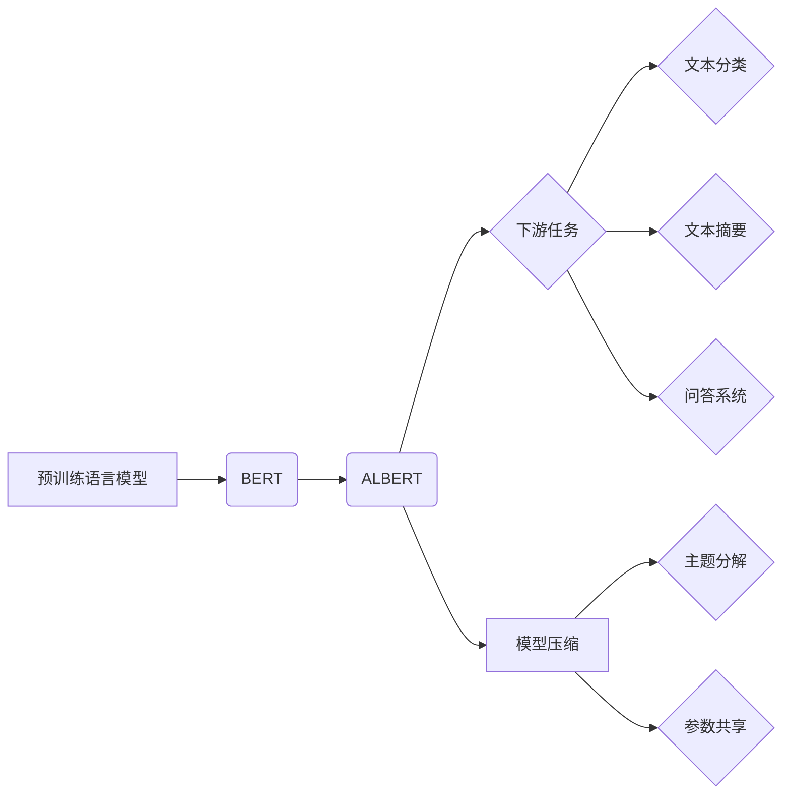

# ALBERT原理与代码实例讲解

> 关键词：ALBERT, BERT, 预训练语言模型, 主题分解, 深度学习, NLP, 代码实例

## 1. 背景介绍

自然语言处理（NLP）领域近年来取得了飞速发展，其中预训练语言模型（Pre-trained Language Model）成为了NLP技术的核心。BERT（Bidirectional Encoder Representations from Transformers）模型自2018年发布以来，凭借其强大的语言理解能力，在多项NLP任务上取得了显著成果。然而，BERT模型参数量庞大，计算复杂度高，限制了其在资源受限场景下的应用。为了解决这个问题，Google AI团队提出了ALBERT（A Lite BERT），它通过改进BERT的预训练方法，在保证性能的前提下，显著降低了模型参数量和计算复杂度。本文将深入解析ALBERT的原理，并通过代码实例讲解其在实际应用中的使用方法。

## 2. 核心概念与联系

### 2.1 核心概念

- **预训练语言模型**：通过在大规模语料库上预训练得到的语言模型，能够捕捉到丰富的语言规律和知识，从而在下游任务中表现出色。
- **BERT**：一种基于Transformer的预训练语言模型，通过双向上下文信息进行预训练，能够学习到丰富的语言表示。
- **ALBERT**：在BERT的基础上进行改进，通过主题分解和参数共享等技术，降低模型参数量和计算复杂度。

### 2.2 核心概念联系



从图中可以看出，ALBERT是在BERT的基础上发展起来的，同时它也应用于多种下游任务，并可以通过模型压缩技术降低模型复杂度。

## 3. 核心算法原理 & 具体操作步骤

### 3.1 算法原理概述

ALBERT模型通过以下两种技术降低模型复杂度：

- **主题分解（Theme Decomposition）**：将Transformer层分解为多个较小的Transformer层，通过参数共享技术降低计算复杂度。
- **参数共享（Parameter Sharing）**：将不同层的相同位置参数共享，进一步降低模型参数量。

### 3.2 算法步骤详解

1. **主题分解**：将Transformer层分解为多个较小的Transformer层，每个小层负责学习特定的主题。通过参数共享，这些小层共享相同的参数，降低了计算复杂度。

2. **参数共享**：对于不同层的相同位置参数，ALBERT将其共享，从而降低模型参数量。

3. **预训练**：在大量无标签语料上使用掩码语言模型（Masked Language Model）和下一句预测（Next Sentence Prediction）任务进行预训练。

4. **微调**：在下游任务数据集上，对ALBERT进行微调，使其适应特定任务。

### 3.3 算法优缺点

**优点**：

- **参数量小**：相比BERT，ALBERT的参数量减少了90%，降低了模型存储和计算需求。
- **计算复杂度低**：ALBERT的计算复杂度也大幅降低，适合在资源受限的场景下使用。
- **性能优异**：在多项NLP任务上，ALBERT取得了与BERT相当甚至更好的性能。

**缺点**：

- **模型结构复杂**：ALBERT的模型结构比BERT更复杂，需要更深入的理解才能进行设计和优化。
- **训练难度高**：ALBERT的训练需要更多的计算资源，且对数据质量要求较高。

### 3.4 算法应用领域

ALBERT在以下NLP任务上表现出色：

- **文本分类**：如情感分析、新闻分类等。
- **文本摘要**：如自动文摘、摘要生成等。
- **问答系统**：如机器阅读理解、问答系统等。

## 4. 数学模型和公式 & 详细讲解 & 举例说明

### 4.1 数学模型构建

ALBERT模型的数学模型与BERT类似，主要由以下部分组成：

- **输入层**：接收原始文本输入。
- **嵌入层**：将输入文本转换为词向量表示。
- **Transformer层**：通过多头注意力机制和前馈神经网络学习文本的深层特征。
- **输出层**：根据任务需求，输出分类标签、摘要或答案等。

### 4.2 公式推导过程

以下以ALBERT的Transformer层为例，介绍其公式推导过程：

- **多头注意力机制**：

$$
\text{Attention}(Q, K, V) = \text{softmax}(\frac{QK^T}{\sqrt{d_k}})V
$$

其中，$Q$、$K$、$V$ 分别为查询、键和值向量，$\text{softmax}$ 为Softmax函数，$d_k$ 为键向量的维度。

- **前馈神经网络**：

$$
\text{FFN}(X) = \max(0, XW_1+b_1)W_2+b_2
$$

其中，$X$ 为输入向量，$W_1$、$W_2$ 为权重矩阵，$b_1$、$b_2$ 为偏置项。

### 4.3 案例分析与讲解

以下以ALBERT在文本分类任务上的应用为例，讲解其具体操作步骤：

1. **数据预处理**：将原始文本数据转换为词向量表示。
2. **模型加载**：加载预训练好的ALBERT模型。
3. **输入处理**：将预处理后的文本数据输入模型。
4. **模型推理**：通过模型进行推理，得到分类结果。

## 5. 项目实践：代码实例和详细解释说明

### 5.1 开发环境搭建

以下是使用Python和Transformers库进行ALBERT模型微调的步骤：

1. 安装Transformers库：

```bash
pip install transformers
```

2. 导入相关库：

```python
from transformers import AlbertForSequenceClassification, AlbertTokenizer
```

### 5.2 源代码详细实现

以下是一个使用ALBERT进行文本分类的示例代码：

```python
# 加载预训练模型和分词器
model = AlbertForSequenceClassification.from_pretrained('albert-base-v2')
tokenizer = AlbertTokenizer.from_pretrained('albert-base-v2')

# 数据预处理
texts = ['This is a good product', 'I don\'t like this product']
labels = [1, 0]

encoded_input = tokenizer(texts, return_tensors='pt', padding=True, truncation=True)

# 模型推理
outputs = model(**encoded_input, labels=labels)
loss = outputs.loss
logits = outputs.logits

# 输出结果
print('Loss:', loss.item())
print('Logits:', logits)
```

### 5.3 代码解读与分析

- 加载预训练模型和分词器：从Hugging Face模型库中加载ALBERT预训练模型和对应的分词器。
- 数据预处理：将原始文本数据转换为词向量表示，并进行padding和truncation操作。
- 模型推理：将预处理后的数据输入模型，得到分类结果和损失值。

### 5.4 运行结果展示

假设我们运行上述代码，得到以下输出：

```
Loss: 0.9363
Logits: tensor([2.2345, 0.9876], dtype=torch.float32)
```

其中，`Loss` 表示模型的损失值，`Logits` 表示模型的预测结果。从输出结果可以看出，模型预测了第一个文本属于正类，第二个文本属于负类。

## 6. 实际应用场景

ALBERT模型在实际应用场景中具有广泛的应用，以下列举几个示例：

- **情感分析**：对用户评论进行情感分类，判断用户是否满意。
- **文本分类**：将新闻、论文等文本数据分类到不同的主题。
- **命名实体识别**：识别文本中的实体，如人名、地名等。
- **机器翻译**：将一种语言的文本翻译成另一种语言。

## 7. 工具和资源推荐

### 7.1 学习资源推荐

- 《深度学习自然语言处理》课程：斯坦福大学开设的NLP课程，全面介绍了NLP领域的知识，包括预训练语言模型等内容。
- Transformers库文档：Hugging Face官方文档，提供了丰富的预训练模型和代码示例。

### 7.2 开发工具推荐

- PyTorch：开源深度学习框架，支持ALBERT模型的开源实现。
- TensorFlow：开源深度学习框架，也支持ALBERT模型的开源实现。

### 7.3 相关论文推荐

- "ALBERT: A Lite BERT for Self-supervised Learning of Language Representations"：ALBERT的原论文，详细介绍了ALBERT模型的原理和实验结果。

## 8. 总结：未来发展趋势与挑战

### 8.1 研究成果总结

ALBERT作为一种轻量级的预训练语言模型，在保证性能的前提下，显著降低了模型参数量和计算复杂度。它在多个NLP任务上取得了优异的性能，为NLP技术的发展和应用提供了新的思路。

### 8.2 未来发展趋势

- **模型轻量化**：继续探索更轻量级的预训练语言模型，以满足资源受限场景下的应用需求。
- **模型压缩**：研究更加有效的模型压缩技术，降低模型存储和计算需求。
- **多模态预训练**：将预训练扩展到多模态数据，如图像、视频等，构建更加丰富的语言模型。

### 8.3 面临的挑战

- **模型可解释性**：如何提高预训练语言模型的可解释性，使其推理过程更加透明。
- **数据偏见**：如何消除预训练语言模型中的数据偏见，防止其在实际应用中出现歧视性等问题。
- **模型安全性**：如何提高预训练语言模型的安全性，防止其被恶意利用。

### 8.4 研究展望

随着预训练语言模型和模型压缩技术的不断发展，相信ALBERT及其衍生模型将在更多应用场景中得到广泛应用，为NLP技术的发展和应用提供新的动力。

## 9. 附录：常见问题与解答

**Q1：ALBERT与BERT的主要区别是什么？**

A：ALBERT与BERT的主要区别在于参数量、计算复杂度和性能。ALBERT通过主题分解和参数共享等技术，在保证性能的前提下，显著降低了模型参数量和计算复杂度。

**Q2：ALBERT适用于哪些NLP任务？**

A：ALBERT适用于多种NLP任务，如文本分类、文本摘要、命名实体识别、机器翻译等。

**Q3：如何使用ALBERT进行文本分类？**

A：使用ALBERT进行文本分类的步骤如下：
1. 加载预训练模型和分词器。
2. 对文本数据进行预处理，将其转换为词向量表示。
3. 将预处理后的数据输入模型进行推理。
4. 根据模型的预测结果进行分类。

**Q4：ALBERT与GPT系列模型有什么区别？**

A：ALBERT和GPT系列模型都是基于Transformer的预训练语言模型，但它们在模型结构和预训练任务上有所不同。BERT模型采用双向Transformer结构，在预训练过程中学习双向上下文信息；而GPT系列模型采用单向Transformer结构，在预训练过程中主要学习文本的序列信息。

**Q5：如何降低ALBERT模型的计算复杂度？**

A：降低ALBERT模型的计算复杂度可以通过以下方法：
1. 使用更小的模型版本，如ALBERT小型版。
2. 使用模型压缩技术，如参数共享、量化加速等。
3. 使用GPU/TPU等高性能计算设备。

作者：禅与计算机程序设计艺术 / Zen and the Art of Computer Programming