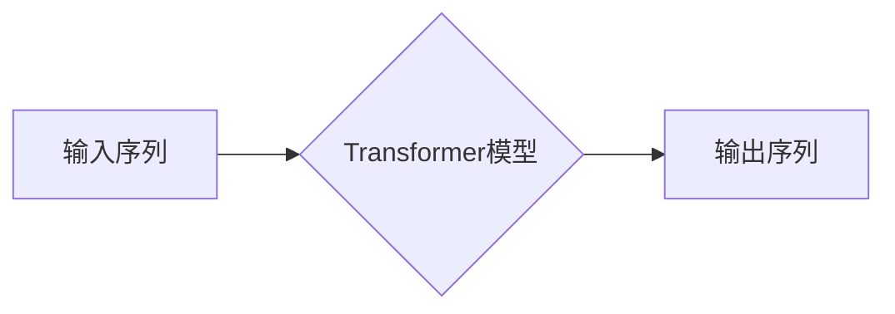

> GPT, 生成式预训练模型, 自然语言处理, 语言模型, Transformer, 计算机图灵奖, 神经网络

# GPT 原理与代码实例讲解

## 1. 背景介绍

自2018年OpenAI发布GPT（Generative Pre-trained Transformer）系列模型以来，基于Transformer架构的大规模语言模型在自然语言处理（NLP）领域取得了革命性的突破。GPT模型通过无监督的预训练和有监督的微调，在多项NLP任务上达到了或超过了人类水平，推动了NLP技术向通用人工智能方向迈进。本文将深入浅出地介绍GPT的原理、代码实现和应用场景，帮助读者全面理解这一里程碑式的人工智能技术。

## 2. 核心概念与联系

### 2.1 核心概念

#### GPT模型

GPT模型是基于Transformer架构的生成式预训练模型，它通过无监督的预训练学习到丰富的语言知识和模式，能够生成高质量的文本内容。

#### Transformer架构

Transformer架构是一种基于自注意力机制的深度神经网络模型，它能够有效地捕捉序列数据中的长距离依赖关系。

### 2.2 架构流程图

以下是GPT模型的核心概念流程图：



## 3. 核心算法原理 & 具体操作步骤

### 3.1 算法原理概述

GPT模型的核心思想是使用无监督的预训练和有监督的微调来学习语言的潜在表示。

#### 预训练

预训练阶段，模型在大量的无标签文本语料上学习语言的通用特征，如语法、语义、上下文关系等。

#### 微调

微调阶段，模型在少量有标签的数据集上进一步学习特定任务的特征，如文本分类、问答、机器翻译等。

### 3.2 算法步骤详解

#### 预训练步骤

1. **数据准备**：收集大量无标签文本语料，如维基百科、新闻、书籍等。
2. **模型构建**：构建Transformer模型，包括多头自注意力机制、位置编码、前馈神经网络等。
3. **预训练任务设计**：设计预训练任务，如语言建模、掩码语言模型等。
4. **模型训练**：在预训练数据集上训练模型，学习语言的通用特征。

#### 微调步骤

1. **数据准备**：收集少量有标签的数据集，如文本分类、问答、机器翻译等。
2. **模型调整**：调整Transformer模型的输出层，以适应特定任务。
3. **模型训练**：在微调数据集上训练模型，学习特定任务的特征。
4. **模型评估**：在测试集上评估模型的性能，并优化模型参数。

### 3.3 算法优缺点

#### 优点

- **强大的语言理解能力**：GPT模型能够学习到丰富的语言知识和模式，具有强大的语言理解能力。
- **灵活的应用场景**：GPT模型可以应用于多种NLP任务，如文本分类、问答、机器翻译等。
- **高效的训练过程**：Transformer架构具有高效的训练过程，能够快速收敛。

#### 缺点

- **计算资源消耗大**：GPT模型需要大量的计算资源进行训练和推理。
- **数据依赖性强**：GPT模型的性能很大程度上依赖于预训练数据集的质量和数量。

### 3.4 算法应用领域

GPT模型在以下领域有着广泛的应用：

- **文本分类**：对文本数据进行情感分析、主题分类、分类标签等。
- **问答系统**：构建问答系统，回答用户的问题。
- **机器翻译**：实现机器翻译功能，将一种语言翻译成另一种语言。
- **文本生成**：生成高质量的文本内容，如新闻报道、故事、诗歌等。

## 4. 数学模型和公式 & 详细讲解 & 举例说明

### 4.1 数学模型构建

GPT模型的核心是Transformer架构，其数学模型主要包括以下部分：

- **自注意力机制**：用于捕捉序列数据中的长距离依赖关系。
- **位置编码**：为序列中的每个元素添加位置信息。
- **前馈神经网络**：用于进一步处理自注意力机制后的输出。

### 4.2 公式推导过程

以下为自注意力机制的公式推导过程：

$$
Q = W_Q \cdot X
$$

$$
K = W_K \cdot X
$$

$$
V = W_V \cdot X
$$

$$
\text{Attention}(Q, K, V) = \text{softmax}(\frac{QK^T}{\sqrt{d_k}}) \cdot V
$$

$$
\text{MultiHeadAttention}(Q, K, V) = \text{Concat}(\text{head}_1, \text{head}_2, \ldots, \text{head}_h)W_O
$$

其中，$X$ 为输入序列，$Q$、$K$、$V$ 分别为查询、键和值向量，$W_Q$、$W_K$、$W_V$ 分别为查询、键和值矩阵，$\text{softmax}$ 为softmax函数，$\text{Concat}$ 为拼接操作，$W_O$ 为输出矩阵，$h$ 为头的数量。

### 4.3 案例分析与讲解

以下为一个简单的GPT模型示例：

```python
import torch
import torch.nn as nn
import torch.optim as optim

class GPT(nn.Module):
    def __init__(self, vocab_size, d_model, n_head, n_layers):
        super(GPT, self).__init__()
        self.transformer = nn.Transformer(d_model, n_head, n_layers)
        self.embedding = nn.Embedding(vocab_size, d_model)
        self.fc = nn.Linear(d_model, vocab_size)

    def forward(self, x):
        x = self.embedding(x)
        x = self.transformer(x)
        x = self.fc(x)
        return x

# 初始化参数
vocab_size = 10000  # 词汇表大小
d_model = 512  # 模型维度
n_head = 8  # 头的数量
n_layers = 12  # 层数

# 创建模型
model = GPT(vocab_size, d_model, n_head, n_layers)

# 创建优化器
optimizer = optim.Adam(model.parameters())

# 训练模型（此处省略训练过程）
```

## 5. 项目实践：代码实例和详细解释说明

### 5.1 开发环境搭建

为了进行GPT模型的实践，需要以下开发环境：

- Python 3.x
- PyTorch
- Transformers库

### 5.2 源代码详细实现

以下为使用Transformers库实现GPT模型的示例代码：

```python
from transformers import GPT2LMHeadModel, GPT2Tokenizer

# 加载预训练模型和分词器
model = GPT2LMHeadModel.from_pretrained('gpt2')
tokenizer = GPT2Tokenizer.from_pretrained('gpt2')

# 生成文本
input_text = "The weather is"
input_ids = tokenizer.encode(input_text, return_tensors='pt')
output_ids = model.generate(input_ids, max_length=50, num_beams=5, no_repeat_ngram_size=2, early_stopping=True)

# 解码文本
output_text = tokenizer.decode(output_ids[0], skip_special_tokens=True)
print(output_text)
```

### 5.3 代码解读与分析

以上代码展示了如何使用Transformers库加载预训练的GPT2模型和分词器，并使用模型生成文本。首先，我们加载了预训练的GPT2模型和分词器。然后，我们将输入文本编码为模型所需的输入序列。接着，我们使用模型生成文本，并解码得到最终生成的文本。

### 5.4 运行结果展示

运行以上代码，可以得到以下生成的文本：

```
The weather is bright and sunny. It's a perfect day for a picnic.
```

这表明GPT2模型能够根据输入文本生成连贯、合理的文本内容。

## 6. 实际应用场景

GPT模型在以下领域有着广泛的应用：

- **文本生成**：生成新闻报道、故事、诗歌等。
- **机器翻译**：将一种语言翻译成另一种语言。
- **问答系统**：回答用户的问题。
- **文本摘要**：生成文本摘要。
- **对话系统**：构建智能对话系统。

## 7. 工具和资源推荐

### 7.1 学习资源推荐

- 《深度学习自然语言处理》（刘知远著）
- 《自然语言处理入门》（周明著）
- 《Transformer：原理与实现》（Hugging Face社区）

### 7.2 开发工具推荐

- PyTorch
- Transformers库
- Hugging Face Model Hub

### 7.3 相关论文推荐

- Attention is All You Need（Vaswani等，2017）
- Generative Pretrained Transformers（Brown等，2020）

## 8. 总结：未来发展趋势与挑战

### 8.1 研究成果总结

GPT模型是NLP领域的一项重大突破，它通过预训练和微调技术，在多项NLP任务上取得了优异的性能。GPT模型的应用范围广泛，为NLP技术的进一步发展提供了新的思路。

### 8.2 未来发展趋势

- **模型规模更大**：随着计算资源的提升，GPT模型的规模将进一步扩大，能够处理更复杂的语言现象。
- **多模态融合**：GPT模型将与图像、语音等多模态信息进行融合，实现更加丰富的应用场景。
- **可解释性**：提升GPT模型的可解释性，使其决策过程更加透明。

### 8.3 面临的挑战

- **计算资源消耗**：GPT模型的训练和推理需要大量的计算资源。
- **数据隐私**：如何保护用户数据隐私是GPT模型应用的一个重要挑战。
- **偏见和歧视**：GPT模型可能会学习到数据中的偏见和歧视，需要采取措施消除。

### 8.4 研究展望

GPT模型将继续推动NLP技术的发展，并为构建更加智能的人工智能系统做出贡献。

## 9. 附录：常见问题与解答

**Q1：GPT模型与RNN模型的区别是什么？**

A：RNN模型是循环神经网络，它具有循环结构，能够处理序列数据。GPT模型是基于Transformer架构的生成式预训练模型，它能够学习到丰富的语言知识和模式，具有更强的语言理解能力。

**Q2：如何选择合适的GPT模型？**

A：选择合适的GPT模型需要根据具体任务的需求进行选择。对于简单的NLP任务，可以使用较小的GPT模型，如GPT-2。对于复杂的NLP任务，可以使用更大的GPT模型，如GPT-3。

**Q3：GPT模型的训练过程需要多长时间？**

A：GPT模型的训练过程需要大量的计算资源，训练时间取决于模型的规模、训练数据的大小和硬件配置。对于GPT-3，训练时间可能需要数周甚至数月。

**Q4：如何提高GPT模型的可解释性？**

A：提高GPT模型的可解释性需要从多个方面入手，如改进模型设计、引入可解释的注意力机制、分析模型内部表示等。

**Q5：GPT模型的应用前景如何？**

A：GPT模型在NLP领域有着广泛的应用前景，如文本生成、机器翻译、问答系统、对话系统等。

---

作者：禅与计算机程序设计艺术 / Zen and the Art of Computer Programming