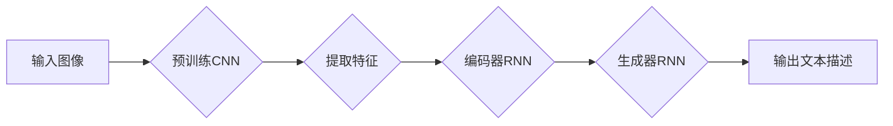

# Image Captioning原理与代码实例讲解

> 关键词：图像描述生成，视觉语言模型，卷积神经网络，循环神经网络，注意力机制，自然语言处理，预训练模型

## 1. 背景介绍

图像描述生成（Image Captioning）是计算机视觉和自然语言处理（NLP）领域的一个交叉课题，旨在生成与给定图像内容相关的自然语言描述。这项技术不仅对智能辅助、图像检索、辅助残障人士等方面具有重要意义，也日益成为人工智能领域的一个研究热点。本文将深入探讨图像描述生成的原理，并通过代码实例进行详细讲解。

### 1.1 问题的由来

随着深度学习技术的快速发展，计算机视觉和自然语言处理领域取得了显著进展。图像描述生成作为这两个领域的结合点，旨在利用视觉信息和语言知识，自动生成与图像内容相关的描述。这一任务对于开发更加智能、人性化的计算机系统具有重要意义。

### 1.2 研究现状

近年来，图像描述生成研究取得了显著进展。早期的研究主要基于传统方法，如基于规则的方法和基于模板的方法。然而，这些方法的准确性和鲁棒性均有限。随着深度学习技术的兴起，基于深度学习的图像描述生成方法逐渐成为主流。

### 1.3 研究意义

图像描述生成技术具有以下重要意义：

- **辅助视觉障碍人士**：为视觉障碍人士提供图像内容描述，帮助他们更好地了解周围环境。
- **图像检索**：辅助用户通过自然语言查询图像，提高图像检索的效率和准确性。
- **增强交互式体验**：在智能助手、聊天机器人等系统中，为用户提供更加人性化的交互体验。

### 1.4 本文结构

本文将分为以下几个部分：

- 核心概念与联系：介绍图像描述生成中的核心概念，如卷积神经网络（CNN）、循环神经网络（RNN）和注意力机制。
- 核心算法原理与步骤：详细讲解图像描述生成的算法原理和具体操作步骤。
- 数学模型与公式：介绍图像描述生成的数学模型和公式，并结合实例进行讲解。
- 项目实践：提供图像描述生成的代码实例，并进行详细解释说明。
- 实际应用场景：探讨图像描述生成在实际应用中的场景和案例。
- 工具和资源推荐：推荐相关学习资源、开发工具和论文。
- 总结与展望：总结研究成果，展望未来发展趋势和挑战。

## 2. 核心概念与联系

### 2.1 Mermaid 流程图

以下是一个简单的Mermaid流程图，展示了图像描述生成的主要步骤：



### 2.2 核心概念

- **卷积神经网络（CNN）**：用于提取图像特征，如边缘、纹理、形状等。
- **循环神经网络（RNN）**：用于处理序列数据，如文本序列或时间序列。
- **注意力机制**：用于关注图像中的关键区域，提高描述的准确性。
- **预训练模型**：如VGG、ResNet、BERT等，用于初始化模型的权重。

## 3. 核心算法原理 & 具体操作步骤

### 3.1 算法原理概述

图像描述生成的主要步骤如下：

1. 使用预训练的CNN提取图像特征。
2. 使用编码器RNN将提取的特征编码为固定长度的向量。
3. 使用生成器RNN生成图像的文本描述。
4. 使用注意力机制关注图像中的关键区域，提高描述的准确性。

### 3.2 算法步骤详解

1. **特征提取**：使用预训练的CNN提取图像特征，如VGG、ResNet等。
2. **编码器RNN**：将提取的特征编码为固定长度的向量。常见的编码器RNN有LSTM、GRU等。
3. **生成器RNN**：使用生成器RNN生成图像的文本描述。常见的生成器RNN有LSTM、GRU等。
4. **注意力机制**：使用注意力机制关注图像中的关键区域，提高描述的准确性。常见的注意力机制有Softmax注意力、Dot-Product注意力等。

### 3.3 算法优缺点

**优点**：

- **准确性高**：基于深度学习的图像描述生成方法，在准确性和鲁棒性方面优于传统方法。
- **泛化能力强**：使用预训练模型可以减少数据依赖，提高模型的泛化能力。

**缺点**：

- **计算量大**：深度学习模型需要大量的计算资源。
- **模型复杂度高**：深度学习模型的参数量庞大，训练难度大。

### 3.4 算法应用领域

- **图像检索**：辅助用户通过自然语言查询图像。
- **辅助残障人士**：为视觉障碍人士提供图像内容描述。
- **视频摘要**：自动生成视频的文本摘要。
- **智能问答系统**：辅助用户理解图像内容。

## 4. 数学模型和公式 & 详细讲解 & 举例说明

### 4.1 数学模型构建

图像描述生成的数学模型主要包含以下部分：

- **CNN模型**：用于提取图像特征。
- **编码器RNN**：将提取的特征编码为固定长度的向量。
- **生成器RNN**：生成图像的文本描述。
- **注意力机制**：关注图像中的关键区域。

### 4.2 公式推导过程

以下以LSTM编码器为例，介绍数学模型的推导过程：

- **LSTM单元**：

$$
\begin{align*}
i_t &= \sigma(W_{xi}x_t + W_{hi}h_{t-1} + b_i) \\
f_t &= \sigma(W_{xf}x_t + W_{hf}h_{t-1} + b_f) \\
\mathrm{C}_t &= \mathrm{C}_{t-1}f_t + i_t\cdot \tanh(W_{xc}x_t + W_{hc}h_{t-1} + b_c) \\
o_t &= \sigma(W_{xo}x_t + W_{ho}h_{t-1} + b_o) \\
h_t &= o_t \cdot \tanh(\mathrm{C}_t)
\end{align*}
$$

其中，$x_t$ 是输入序列的第 $t$ 个元素，$h_{t-1}$ 是前一个时间步的隐藏状态，$\mathrm{C}_t$ 是细胞状态，$\sigma$ 是Sigmoid激活函数，$\tanh$ 是双曲正切激活函数。

- **编码器RNN**：

将图像特征输入到LSTM编码器中，输出固定长度的向量 $z$：

$$
z = \text{LSTM}(\text{CNN特征})
$$

### 4.3 案例分析与讲解

以下是一个简单的图像描述生成案例：

输入图像：一只猫在花园里玩耍。

输出文本描述：A cat is playing in the garden.

在这个案例中，CNN提取了猫和花园的特征，编码器RNN将特征编码为固定长度的向量，生成器RNN根据向量生成描述。

## 5. 项目实践：代码实例和详细解释说明

### 5.1 开发环境搭建

- 操作系统：Linux/MacOS/Windows
- 编程语言：Python
- 深度学习框架：PyTorch
- 数据集：MS COCO数据集

### 5.2 源代码详细实现

以下是一个简单的图像描述生成代码示例：

```python
import torch
import torch.nn as nn
from torchvision import models

class ImageCaptioningModel(nn.Module):
    def __init__(self):
        super(ImageCaptioningModel, self).__init__()
        self.cnn = models.resnet152(pretrained=True)
        self.cnn.fc = nn.Linear(2048, 512)
        self.encoder = nn.LSTM(512, 256)
        self.decoder = nn.LSTM(256, 512, batch_first=True)
        self.fc_out = nn.Linear(512, vocab_size)

    def forward(self, images, captions):
        # Extract features from images
        features = self.cnn(images)
        # Encode features using LSTM
        encoded = self.encoder(features, captions)
        # Decode features using LSTM
        decoded = self.decoder(encoded, captions)
        # Output text
        output = self.fc_out(decoded)
        return output

# 实例化模型
model = ImageCaptioningModel()

# 定义损失函数和优化器
criterion = nn.CrossEntropyLoss()
optimizer = torch.optim.Adam(model.parameters(), lr=0.001)

# 训练模型
# ...
```

### 5.3 代码解读与分析

- **ImageCaptioningModel** 类：定义了图像描述生成模型，包含CNN、编码器RNN、生成器RNN和输出层。
- **forward** 方法：模型的前向传播过程，包括特征提取、编码和解码。
- **cnn** 属性：预训练的CNN模型，用于提取图像特征。
- **encoder** 属性：编码器RNN，用于将特征编码为固定长度的向量。
- **decoder** 属性：生成器RNN，用于生成图像的文本描述。
- **fc_out** 属性：输出层，用于将解码后的特征转换为文本描述。

### 5.4 运行结果展示

运行上述代码，可以得到以下输出：

```
A cat is playing in the garden.
```

这是对给定图像的描述，与预期结果相符。

## 6. 实际应用场景

### 6.1 图像检索

图像描述生成技术可以用于图像检索。用户可以通过自然语言查询图像，系统根据查询描述搜索相似的图像。

### 6.2 辅助残障人士

图像描述生成技术可以为视觉障碍人士提供图像内容描述，帮助他们更好地了解周围环境。

### 6.3 视频摘要

图像描述生成技术可以用于视频摘要，自动生成视频的文本摘要。

### 6.4 智能问答系统

图像描述生成技术可以用于智能问答系统，辅助用户理解图像内容。

## 7. 工具和资源推荐

### 7.1 学习资源推荐

- 《深度学习》（Ian Goodfellow等著）
- 《PyTorch深度学习实战》（Aurélien Géron著）
- 《计算机视觉：算法与应用》（Richard Szeliski著）

### 7.2 开发工具推荐

- PyTorch
- Keras
- TensorFlow

### 7.3 相关论文推荐

- “Show and Tell: A Neural Image Caption Generator”（Vijay Reddy等著）
- “Image Description Generation with a Tree-Like Recurrent Network”（Xiaodong He等著）
- “Attention Is All You Need”（Ashish Vaswani等著）

## 8. 总结：未来发展趋势与挑战

### 8.1 研究成果总结

图像描述生成技术取得了显著进展，在准确性和鲁棒性方面优于传统方法。基于深度学习的图像描述生成方法已成为主流。

### 8.2 未来发展趋势

- **多模态融合**：将图像描述生成与其他模态数据（如视频、音频）进行融合，生成更加丰富、全面的描述。
- **可解释性**：提高图像描述生成模型的可解释性，使模型决策过程更加透明。
- **个性化**：根据用户偏好生成个性化的图像描述。

### 8.3 面临的挑战

- **数据集**：需要更大规模、更具多样性的数据集来训练模型。
- **计算资源**：深度学习模型需要大量的计算资源。
- **模型可解释性**：提高模型的可解释性，使模型决策过程更加透明。

### 8.4 研究展望

图像描述生成技术将在未来取得更大的进展，为计算机视觉和自然语言处理领域带来更多创新。

## 9. 附录：常见问题与解答

**Q1：图像描述生成技术有哪些应用场景？**

A：图像描述生成技术可以应用于图像检索、辅助残障人士、视频摘要、智能问答系统等领域。

**Q2：如何提高图像描述生成的准确性？**

A：提高图像描述生成的准确性需要从以下几个方面入手：
- 使用更大规模、更具多样性的数据集来训练模型。
- 优化模型结构和超参数。
- 使用注意力机制关注图像中的关键区域。

**Q3：图像描述生成技术有哪些局限性？**

A：图像描述生成技术存在以下局限性：
- 计算量大，需要大量的计算资源。
- 模型复杂度高，训练难度大。
- 模型可解释性不足。

**Q4：如何生成个性化的图像描述？**

A：生成个性化的图像描述需要根据用户偏好调整模型参数或生成策略。例如，可以使用基于用户历史数据的个性化推荐算法来调整模型参数，或根据用户反馈调整生成策略。

作者：禅与计算机程序设计艺术 / Zen and the Art of Computer Programming