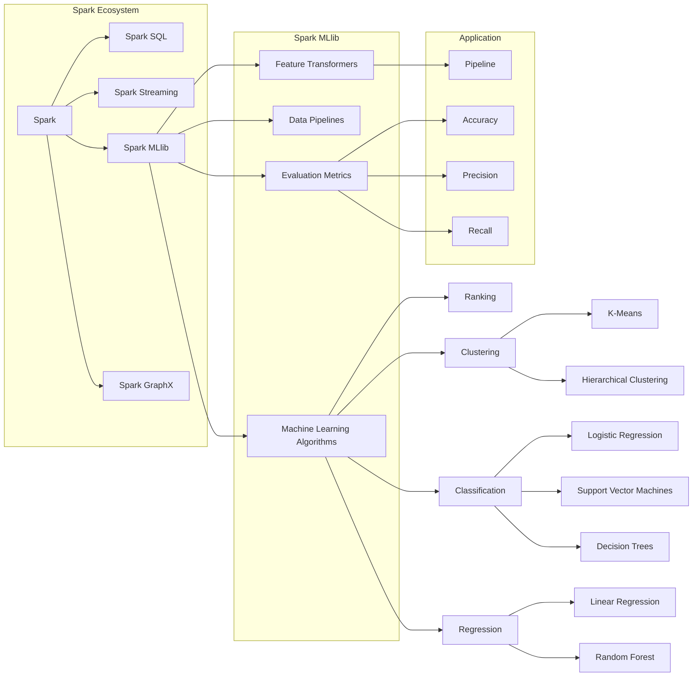

# Spark MLlib原理与代码实例讲解

> 关键词：Spark, MLlib, 机器学习库, 分布式计算, 大数据处理, 代码实例, 算法原理

## 1. 背景介绍

随着大数据时代的到来，处理海量数据成为数据分析领域的重要挑战。Apache Spark作为一种快速、通用、可扩展的分布式计算系统，在处理大规模数据集时展现出卓越的性能。Spark MLlib是Spark生态系统中的一个关键组件，它提供了丰富的机器学习算法和工具，旨在简化机器学习在Spark上的应用。

本文将深入探讨Spark MLlib的原理，并通过实例代码展示如何使用MLlib进行机器学习任务。读者将了解到MLlib的核心概念、算法原理以及如何在实际项目中应用。

## 2. 核心概念与联系

### 2.1 核心概念

- **Spark**: Apache Spark是一个开源的分布式计算系统，它允许用户快速地在大量数据上运行复杂的应用程序。
- **MLlib**: Spark MLlib是Spark的机器学习库，提供了多种机器学习算法和工具。
- **分布式计算**: 分布式计算是指将计算任务分散到多台计算机上执行，以实现更高的计算效率和处理能力。
- **大数据处理**: 指处理超过传统数据库软件处理能力的数据集。

### 2.2 Mermaid 流程图



## 3. 核心算法原理 & 具体操作步骤

### 3.1 算法原理概述

Spark MLlib提供了多种机器学习算法，包括分类、回归、聚类和降维等。这些算法的核心原理如下：

- **分类**: 通过学习数据中的特征和标签之间的关系，将数据点分类到不同的类别中。
- **回归**: 预测连续值输出，通常用于预测数值型变量的值。
- **聚类**: 将数据点分组，使得组内数据点之间相似度高，组间数据点之间相似度低。
- **降维**: 减少数据维度，同时保留数据的重要信息。

### 3.2 算法步骤详解

1. **数据预处理**: 使用Spark DataFrame对数据进行清洗、转换和整合。
2. **特征工程**: 创建新的特征或转换现有特征，以提高模型的性能。
3. **模型训练**: 使用MLlib的算法训练模型。
4. **模型评估**: 使用评估指标（如准确率、精确率、召回率等）评估模型性能。
5. **模型部署**: 将训练好的模型部署到生产环境中。

### 3.3 算法优缺点

- **优点**: 
  - 分布式计算能力，适用于处理大规模数据集。
  - 高效的数据处理能力，能够快速进行数据预处理和模型训练。
  - 丰富的算法库，覆盖多种机器学习任务。
- **缺点**:
  - 学习曲线较陡峭，需要一定的Spark和机器学习知识。
  - 代码编写相对复杂，需要熟悉Spark DataFrame和MLlib API。

### 3.4 算法应用领域

Spark MLlib的应用领域包括：

- 数据挖掘
- 信用评分
- 文本分析
- 搜索引擎推荐
- 等等

## 4. 数学模型和公式 & 详细讲解 & 举例说明

### 4.1 数学模型构建

以逻辑回归为例，其数学模型可以表示为：

$$
P(y=1|x, \theta) = \sigma(\theta^T x)
$$

其中，$\theta$ 是模型参数，$x$ 是特征向量，$\sigma$ 是 sigmoid 函数。

### 4.2 公式推导过程

逻辑回归的损失函数是负对数似然：

$$
L(\theta) = -\frac{1}{N} \sum_{i=1}^N [y_i \log(\sigma(\theta^T x_i)) + (1-y_i) \log(1-\sigma(\theta^T x_i))]
$$

其中，$N$ 是样本数量。

### 4.3 案例分析与讲解

以下是一个使用Spark MLlib进行逻辑回归的Python代码实例：

```python
from pyspark.sql import SparkSession
from pyspark.ml.classification import LogisticRegression

# 创建Spark会话
spark = SparkSession.builder.appName("LogisticRegressionExample").getOrCreate()

# 读取数据
data = spark.read.format("libsvm").load("data/mllib/sample_libsvm_data.txt")

# 创建逻辑回归模型
lr = LogisticRegression(maxIter=10, regParam=0.01)

# 训练模型
model = lr.fit(data)

# 评估模型
train_predictions = model.transform(data)
train_accuracy = train_predictions.filter(train_predictions.label == model.predictions).count() / float(data.count())
print(f"Training Accuracy: {train_accuracy}")

# 部署模型
# model.save("/path/to/model")
```

## 5. 项目实践：代码实例和详细解释说明

### 5.1 开发环境搭建

1. 安装Apache Spark：从Apache Spark官网下载并安装Spark。
2. 配置环境变量：将Spark安装目录添加到环境变量中。
3. 安装PySpark：使用pip安装PySpark。

### 5.2 源代码详细实现

以下是一个使用Spark MLlib进行K-Means聚类的Python代码实例：

```python
from pyspark.sql import SparkSession
from pyspark.ml.clustering import KMeans

# 创建Spark会话
spark = SparkSession.builder.appName("KMeansExample").getOrCreate()

# 读取数据
data = spark.read.format("libsvm").load("data/mllib/sample_kmeans_data.txt")

# 创建K-Means模型
kmeans = KMeans().setK(2).setFeaturesCol("features")

# 训练模型
model = kmeans.fit(data)

# 聚类
clustering_model = model.transform(data)

# 输出聚类结果
clustering_model.select("features", "prediction").show()

# 关闭Spark会话
spark.stop()
```

### 5.3 代码解读与分析

- 首先，创建Spark会话。
- 然后，读取数据，这里使用libsvm格式读取。
- 接着，创建K-Means模型，设置聚类数量为2。
- 使用`fit`方法训练模型。
- 使用`transform`方法对数据进行聚类。
- 最后，输出聚类结果并关闭Spark会话。

## 6. 实际应用场景

Spark MLlib在实际应用场景中非常广泛，以下是一些典型的应用：

- **电子商务**: 使用MLlib进行用户行为分析，预测用户购买意向。
- **金融行业**: 使用MLlib进行欺诈检测、信用评分等。
- **医疗保健**: 使用MLlib进行疾病预测、患者分类等。
- **社交网络**: 使用MLlib进行用户画像、推荐系统等。

## 7. 工具和资源推荐

### 7.1 学习资源推荐

- Spark官方文档：[https://spark.apache.org/docs/latest/]
- PySpark官方文档：[https://spark.apache.org/docs/latest/api/python/pyspark/ml/index.html]
- 《Spark快速大数据处理》：一本全面介绍Spark的书籍。

### 7.2 开发工具推荐

- PyCharm：一款流行的Python开发工具，支持Spark开发。
- IntelliJ IDEA：一款功能强大的Java开发工具，支持Spark开发。

### 7.3 相关论文推荐

- Spark: Spark: A Unified Engine for Large-Scale Data Processing
- MLlib: MLlib: Machine Learning Library for Apache Spark

## 8. 总结：未来发展趋势与挑战

### 8.1 研究成果总结

Spark MLlib作为Apache Spark生态系统的重要组成部分，为机器学习在Spark上的应用提供了强大的支持。它提供了丰富的算法库和工具，简化了机器学习在Spark上的应用，并取得了显著的成果。

### 8.2 未来发展趋势

- **算法多样化**: 未来MLlib将提供更多先进的机器学习算法，以满足不同领域的需求。
- **易用性提升**: 简化MLlib的使用方式，降低学习门槛。
- **性能优化**: 进一步优化算法性能，提高处理大规模数据的能力。

### 8.3 面临的挑战

- **算法复杂性**: 随着算法的增多，如何选择合适的算法成为挑战。
- **数据处理效率**: 提高数据处理效率，以满足大规模数据集的需求。
- **算法解释性**: 提高机器学习算法的可解释性，增强用户对算法的信任。

### 8.4 研究展望

未来，MLlib将继续扩展其算法库，提高易用性和性能，并与其他人工智能技术相结合，为解决实际问题提供更加有效的解决方案。

## 9. 附录：常见问题与解答

**Q1：Spark MLlib支持哪些机器学习算法**？

A：Spark MLlib支持多种机器学习算法，包括分类、回归、聚类、降维等。

**Q2：如何使用Spark MLlib进行模型评估**？

A：可以使用MLlib提供的评估指标，如准确率、精确率、召回率等，对模型进行评估。

**Q3：Spark MLlib与Hadoop相比有什么优势**？

A：Spark MLlib提供了更丰富的机器学习算法和工具，并且性能更高，更适合处理大规模数据集。

**Q4：如何将训练好的模型部署到生产环境中**？

A：可以使用MLlib提供的`save`方法将训练好的模型保存到本地或分布式文件系统中，然后在生产环境中加载和使用。

作者：禅与计算机程序设计艺术 / Zen and the Art of Computer Programming