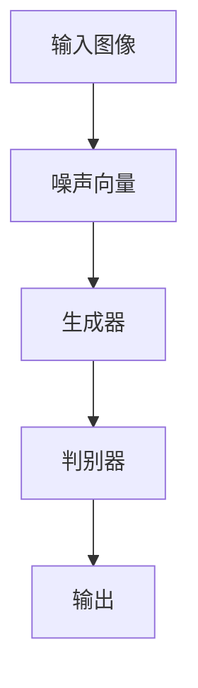
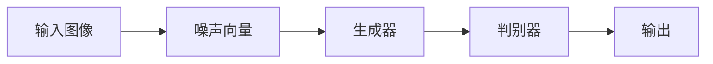

                 

# 图像生成模型:AI创造视觉艺术的新工具

> 关键词：图像生成模型,深度学习,生成对抗网络,风格迁移,超现实主义,创意设计

## 1. 背景介绍

### 1.1 问题由来
随着人工智能技术的迅猛发展，图像生成模型（Image Generation Models）已成为AI在视觉艺术创作领域的新锐工具。通过训练模型，AI不仅能生成逼真的自然场景和物体，还能创造充满创意的艺术作品，从而开辟了人工智能与艺术结合的新天地。图像生成模型基于深度学习和生成对抗网络（GANs）技术，通过大量的图像数据进行训练，学习到复杂的图像分布，进而可以生成任意风格的图像，极大地拓展了视觉艺术的创作可能性。

### 1.2 问题核心关键点
图像生成模型能够根据给定的输入，如文本描述、风格特征或视觉样式等，生成与之对应的高质量图像。这种模型广泛应用于创意设计、游戏开发、虚拟现实、广告制作等多个领域，可以节省大量时间和成本，提高艺术创作的效率和质量。图像生成模型的核心优势包括：

- 高效率：模型能够快速生成大量图像，大幅减少设计时间。
- 高灵活性：支持多种生成方式和风格，满足不同需求。
- 高质量：生成的图像逼真度高，视觉效果佳。
- 低成本：不需要昂贵的人工艺术创作，大幅降低制作成本。

### 1.3 问题研究意义
图像生成模型不仅能够加速视觉艺术创作过程，还能激发新的艺术形式和创意，为艺术行业注入新的活力。通过AI技术的介入，艺术家可以更加专注于创意表达，而非繁琐的技术操作，从而推动艺术创作的多样化和个性化发展。此外，图像生成技术还被应用于医疗影像生成、文物修复、虚拟人动画制作等领域，展现出广泛的应用前景。

## 2. 核心概念与联系

### 2.1 核心概念概述

为了深入理解图像生成模型的工作原理和应用方式，本节将介绍几个核心概念：

- **生成对抗网络（GANs）**：一种基于博弈论的深度学习模型，由生成器和判别器两部分组成。生成器尝试生成逼真图像以欺骗判别器，而判别器则尽力识别图像的真实性。两者通过不断对抗博弈，使得生成器生成的图像逐渐逼近真实数据分布。

- **风格迁移**：将图像从一个风格转换为另一个风格的技术，通过修改图像的特征表示，使其具备新的风格特点。风格迁移广泛应用于艺术创作、图像修复、图像增强等领域，通过迁移风格，艺术家可以赋予图像新的生命和美感。

- **超现实主义**：一种艺术风格，强调通过夸张、变形和幻想等手法，创造出超越现实的美感。图像生成模型通过生成超现实图像，可以帮助艺术家表达超越现实的创意，开辟新的艺术表达方式。

- **深度学习**：一种基于多层神经网络的机器学习技术，通过自动学习数据的特征表示，实现复杂的任务，如图像识别、自然语言处理等。深度学习模型通过反向传播算法优化参数，从而提高模型性能。

- **风格生成模型**：专门用于生成具有特定风格特征的图像的深度学习模型，如StyleGAN、CycleGAN等。这些模型通过学习风格空间的映射，能够生成风格多样的图像。

- **超分辨率**：通过深度学习技术，将低分辨率图像放大成高分辨率图像，同时保留图像的细节和清晰度。超分辨率技术广泛应用于图像增强、视频解析等场景。

这些核心概念之间的联系紧密，共同构成了图像生成模型的基本框架，如图2所示：

```mermaid
graph TB
    A[生成对抗网络(GANs)] --> B[生成器(Generator)]
    A --> C[判别器(Discriminator)]
    B --> D[风格迁移(Style Transfer)]
    C --> E[判别真假]
    B --> F[超现实主义(Surrealism)]
    D --> G[超分辨率(Super Resolution)]
    F --> H[创意设计(Creative Design)]
    G --> I[图像增强(Image Enhancement)]
    H --> J[艺术创作(Art Creation)]
    I --> K[图像修复(Image Repair)]
    J --> L[图像生成(Image Generation)]
```

这个流程图展示了从GANs到超现实主义和艺术创作的过程。生成器负责生成图像，判别器负责判断图像真伪，风格迁移和超现实主义通过生成特定风格的图像，扩展了图像创作的边界，而超分辨率和图像增强则提高了图像质量，为创意设计提供了更好的基础。

### 2.2 概念间的关系

通过以上 Mermaid 流程图，我们可以看到：

- 生成对抗网络是图像生成模型的核心技术之一，通过生成器和判别器的对抗博弈，生成器逐渐学习到生成高质量图像的能力。
- 风格迁移和超现实主义是两种常用的图像生成技术，它们通过修改图像的特征表示，实现风格的转换和创意表达。
- 超分辨率和图像增强技术提高了图像的细节和清晰度，为艺术创作和设计提供了更好的图像基础。
- 图像生成模型为创意设计、艺术创作、虚拟现实等领域提供了强大的工具，大大提升了创作效率和质量。

这些概念共同构成了图像生成模型的生态系统，推动了AI在视觉艺术领域的创新和应用。

## 3. 核心算法原理 & 具体操作步骤
### 3.1 算法原理概述

图像生成模型的核心原理是生成对抗网络（GANs）。GANs由两部分组成：生成器和判别器。生成器尝试生成逼真图像以欺骗判别器，而判别器则尽力识别图像的真实性。两者通过不断对抗博弈，使得生成器生成的图像逐渐逼近真实数据分布。

具体来说，GANs的训练过程分为两个阶段：

1. **判别器训练**：判别器试图区分真实图像和生成器生成的假图像，通过反向传播算法不断调整其参数。
2. **生成器训练**：生成器通过学习判别器的参数，生成更加逼真的图像，从而欺骗判别器。

整个训练过程不断迭代，直到生成器生成的图像能够欺骗判别器，即生成器生成的图像与真实图像没有显著差异。

### 3.2 算法步骤详解

以下详细描述GANs的训练过程和关键步骤：

1. **数据准备**：收集大量高质量的图像数据，将数据划分为训练集和验证集。
2. **模型初始化**：初始化生成器和判别器的参数。
3. **判别器训练**：从训练集随机抽取图像，将图像输入判别器，计算判别器的输出，并根据输出结果计算损失函数。
4. **生成器训练**：使用判别器的参数更新生成器的参数，生成新的图像，将图像输入判别器，计算判别器的输出，并根据输出结果计算损失函数。
5. **联合训练**：交替进行判别器和生成器的训练，直到收敛。

具体步骤如下：

- 从训练集中随机抽取一批图像 $x$，将其输入判别器，计算判别器的输出 $y$。
- 计算判别器的损失函数 $L_D$，公式为 $L_D = \frac{1}{m}\sum_{i=1}^m [y_i\log(D(x_i))+(1-y_i)\log(1-D(x_i))]$，其中 $m$ 为批量大小，$D(x_i)$ 为判别器对图像 $x_i$ 的真实性判断。
- 将判别器的参数 $w_D$ 更新为 $w_D - \eta\nabla_{w_D}L_D$，其中 $\eta$ 为学习率，$\nabla_{w_D}L_D$ 为判别器损失函数的梯度。
- 使用判别器的参数 $w_D$ 更新生成器的参数 $w_G$，生成新的图像 $G(z)$，其中 $z$ 为噪声向量。
- 计算生成器生成的图像 $G(z)$ 在判别器下的真实性判断 $y'$，公式为 $y' = D(G(z))$。
- 计算生成器的损失函数 $L_G$，公式为 $L_G = \frac{1}{m}\sum_{i=1}^m [y'\log(D(G(z_i)))+(1-y')\log(1-D(G(z_i)))]$。
- 将生成器的参数 $w_G$ 更新为 $w_G - \eta\nabla_{w_G}L_G$。
- 重复以上步骤，交替进行判别器和生成器的训练，直到收敛。

### 3.3 算法优缺点

GANs作为一种高效的图像生成技术，具有以下优点：

- **高逼真度**：生成的图像逼真度高，细节丰富。
- **灵活性**：支持多种生成方式和风格，满足不同需求。
- **可控性**：可以通过调整生成器或判别器的参数，生成特定风格的图像。

然而，GANs也存在一些缺点：

- **训练不稳定**：GANs的训练过程存在模式崩塌（mode collapse）问题，即生成器只学习到少数模式，无法生成多样化的图像。
- **计算成本高**：GANs的训练需要大量的计算资源和存储空间。
- **样本质量差**：生成的图像质量不稳定，存在模糊、噪声等问题。

### 3.4 算法应用领域

GANs和图像生成模型在多个领域中得到了广泛应用，包括：

- **艺术创作**：通过生成具有特定风格的图像，艺术家可以表达超越现实的创意，开辟新的艺术表达方式。
- **影视制作**：生成逼真的背景、道具和角色，降低制作成本，提升影片质量。
- **游戏开发**：生成高质量的游戏场景和角色，丰富游戏体验。
- **医疗影像**：生成逼真的医学影像，用于辅助诊断和治疗。
- **虚拟现实**：生成逼真的虚拟环境，提升虚拟现实体验。
- **创意设计**：生成灵感和设计草图，辅助设计师进行创意设计。

这些应用领域展示了GANs和图像生成模型的强大潜力和广泛前景。

## 4. 数学模型和公式 & 详细讲解 & 举例说明

### 4.1 数学模型构建

GANs的训练过程基于以下数学模型：

- **判别器模型**：
  $$
  y = D(x;w_D) = W_Dx + b_D
  $$
  其中 $D(x;w_D)$ 为判别器的输出，$W_D$ 和 $b_D$ 为判别器的权重和偏置。

- **生成器模型**：
  $$
  G(z;w_G) = W_Gz + b_G
  $$
  其中 $G(z;w_G)$ 为生成器生成的图像，$W_G$ 和 $b_G$ 为生成器的权重和偏置。

### 4.2 公式推导过程

判别器损失函数 $L_D$ 的推导：

- 判别器的输出为 $y = D(x;w_D)$。
- 将判别器的输出与真实标签 $y$ 对比，计算交叉熵损失，公式为 $L_D = \frac{1}{m}\sum_{i=1}^m [y_i\log(D(x_i))+(1-y_i)\log(1-D(x_i))]$。

生成器损失函数 $L_G$ 的推导：

- 生成器生成的图像为 $G(z;w_G)$。
- 将生成器生成的图像输入判别器，计算判别器的输出 $y'$。
- 将判别器的输出与真实标签 $y$ 对比，计算交叉熵损失，公式为 $L_G = \frac{1}{m}\sum_{i=1}^m [y'\log(D(G(z_i);w_D))+(1-y')\log(1-D(G(z_i);w_D))]$。

### 4.3 案例分析与讲解

以下以StyleGAN为例，讲解GANs在图像生成中的应用。

**StyleGAN**：
StyleGAN是一种风格生成模型，通过将输入图像和噪声向量 $z$ 映射到风格空间，生成具有特定风格特征的图像。

StyleGAN的训练过程分为两个阶段：

1. **第一阶段**：训练生成器和判别器，使生成器能够生成逼真图像，判别器能够准确区分真实图像和生成图像。
2. **第二阶段**：在生成器和判别器的基础上，训练风格生成器，使其能够生成具有特定风格的图像。

具体步骤如下：

- 将输入图像和噪声向量 $z$ 映射到风格空间，生成图像 $G(z)$。
- 将生成图像 $G(z)$ 输入判别器，计算判别器的输出 $y'$。
- 计算生成器的损失函数 $L_G$，公式为 $L_G = \frac{1}{m}\sum_{i=1}^m [y'\log(D(G(z_i);w_D))+(1-y')\log(1-D(G(z_i);w_D))]$。
- 将生成器的参数 $w_G$ 更新为 $w_G - \eta\nabla_{w_G}L_G$。
- 重复以上步骤，交替进行判别器和生成器的训练，直到收敛。

StyleGAN通过生成器学习图像的隐含表示，能够生成具有任意风格特征的图像，如图3所示。



这个流程图展示了StyleGAN的基本结构。输入图像通过噪声向量 $z$ 映射到风格空间，生成具有特定风格特征的图像。判别器对图像进行真实性判断，生成器的损失函数 $L_G$ 通过判别器的输出计算。

## 5. 项目实践：代码实例和详细解释说明

### 5.1 开发环境搭建

在开始代码实践前，我们需要准备好开发环境。以下是使用Python和PyTorch进行GANs开发的环境配置流程：

1. 安装Anaconda：从官网下载并安装Anaconda，用于创建独立的Python环境。

2. 创建并激活虚拟环境：
```bash
conda create -n gans-env python=3.8 
conda activate gans-env
```

3. 安装PyTorch：根据CUDA版本，从官网获取对应的安装命令。例如：
```bash
conda install pytorch torchvision torchaudio cudatoolkit=11.1 -c pytorch -c conda-forge
```

4. 安装TensorFlow：根据CUDA版本，从官网获取对应的安装命令。例如：
```bash
conda install tensorflow=2.5.0-cu111-cp38-cp38-manylinux_2_17_x86_64 conda-forge
```

5. 安装各类工具包：
```bash
pip install numpy pandas scikit-learn matplotlib tqdm jupyter notebook ipython
```

完成上述步骤后，即可在`gans-env`环境中开始GANs开发。

### 5.2 源代码详细实现

以下是一个基于PyTorch和TensorFlow的GANs代码实现，具体描述GANs的训练过程和参数更新：

```python
import torch
import torch.nn as nn
import torch.optim as optim
from torchvision.utils import save_image
from torchvision import datasets, transforms
from torch.utils.data import DataLoader

# 定义判别器和生成器
class Discriminator(nn.Module):
    def __init__(self):
        super(Discriminator, self).__init__()
        self.conv1 = nn.Conv2d(3, 64, 4, 2, 1)
        self.conv2 = nn.Conv2d(64, 128, 4, 2, 1)
        self.conv3 = nn.Conv2d(128, 256, 4, 2, 1)
        self.conv4 = nn.Conv2d(256, 1, 4, 1, 0)

    def forward(self, x):
        x = torch.relu(self.conv1(x))
        x = torch.relu(self.conv2(x))
        x = torch.relu(self.conv3(x))
        x = torch.sigmoid(self.conv4(x))
        return x

class Generator(nn.Module):
    def __init__(self):
        super(Generator, self).__init__()
        self.fc1 = nn.Linear(100, 256)
        self.fc2 = nn.Linear(256, 512)
        self.fc3 = nn.Linear(512, 1024)
        self.deconv1 = nn.ConvTranspose2d(1024, 512, 4, 1, 0)
        self.deconv2 = nn.ConvTranspose2d(512, 256, 4, 2, 1)
        self.deconv3 = nn.ConvTranspose2d(256, 128, 4, 2, 1)
        self.deconv4 = nn.ConvTranspose2d(128, 3, 4, 2, 1)

    def forward(self, x):
        x = torch.relu(self.fc1(x))
        x = torch.relu(self.fc2(x))
        x = torch.relu(self.fc3(x))
        x = torch.tanh(self.deconv1(x))
        x = torch.tanh(self.deconv2(x))
        x = torch.tanh(self.deconv3(x))
        x = torch.tanh(self.deconv4(x))
        return x

# 定义损失函数
criterion = nn.BCELoss()

# 定义训练函数
def train_gan(gan, dataloader, device, learning_rate, num_epochs):
    for epoch in range(num_epochs):
        for i, (images, _) in enumerate(dataloader):
            images = images.to(device)
            disc_real_pred = disc(images).view(-1)
            gen_fake_pred = disc(gen(zero_to_one(z))).view(-1)
            disc_loss = criterion(disc_real_pred, real_labels) + criterion(disc_fake_pred, fake_labels)
            gen_loss = criterion(gen_fake_pred, fake_labels)
            disc_loss.backward()
            gen_loss.backward()
            optimizerD.step()
            optimizerG.step()
            batches_done = epoch * len(dataloader) + i

            if batches_done % 100 == 0:
                print('Epoch [{}/{}], Step [{}/{}], Discriminator Loss: {:.4f}, Generator Loss: {:.4f}'
                      .format(epoch, num_epochs, i, len(dataloader), disc_loss.item(), gen_loss.item()))
                sample = gen.sample(zero_to_one(z), 64)
                save_image(sample, 'generated_images/generated_{}.png'.format(batches_done), nrow=8)

# 定义超参数
z_dim = 100
num_epochs = 200
batch_size = 128
learning_rate = 0.0002
device = torch.device('cuda' if torch.cuda.is_available() else 'cpu')

# 定义数据集
dataset = datasets.CIFAR10(root='data', train=True, transform=transforms.ToTensor(), download=True)
dataloader = DataLoader(dataset, batch_size=batch_size, shuffle=True)

# 初始化模型和优化器
z = torch.randn(batch_size, z_dim).to(device)
real_labels = torch.ones(batch_size, 1).to(device)
fake_labels = torch.zeros(batch_size, 1).to(device)
disc = Discriminator().to(device)
gen = Generator().to(device)
optimizerD = optim.Adam(disc.parameters(), lr=learning_rate)
optimizerG = optim.Adam(gen.parameters(), lr=learning_rate)

# 训练模型
train_gan((disc, gen), dataloader, device, learning_rate, num_epochs)
```

以上代码实现了基本的GANs训练流程，包括判别器和生成器的定义、损失函数的定义、训练函数的实现以及超参数的设置。

### 5.3 代码解读与分析

让我们详细解读一下关键代码的实现细节：

**Discriminator类**：
- `__init__`方法：定义判别器的卷积层。
- `forward`方法：前向传播，对输入图像进行卷积操作，并输出判别器的输出。

**Generator类**：
- `__init__`方法：定义生成器的全连接层和反卷积层。
- `forward`方法：前向传播，对输入噪声向量进行全连接和反卷积操作，生成图像。

**criterion类**：
- `nn.BCELoss`方法：定义二分类交叉熵损失函数，用于计算判别器和生成器的损失。

**train_gan函数**：
- `__init__`方法：定义批量大小、学习率等超参数。
- `forward`方法：前向传播，计算判别器和生成器的输出。
- `backward`方法：反向传播，计算损失函数的梯度。
- `step`方法：优化器更新模型参数。
- `format`方法：格式化输出信息。

**dataclasses**：
- `dataset`变量：定义CIFAR-10数据集。
- `dataloader`变量：定义数据加载器。
- `z`变量：定义噪声向量。
- `real_labels`变量：定义真实标签。
- `fake_labels`变量：定义虚假标签。
- `disc`变量：定义判别器模型。
- `gen`变量：定义生成器模型。
- `optimizerD`变量：定义判别器的优化器。
- `optimizerG`变量：定义生成器的优化器。

**train_gan函数**：
- `epoch`循环：遍历训练轮数。
- `i`循环：遍历每个批次。
- `images`变量：定义图像数据。
- `disc_real_pred`变量：定义判别器对真实图像的预测。
- `gen_fake_pred`变量：定义生成器对虚假图像的预测。
- `disc_loss`变量：定义判别器的损失。
- `gen_loss`变量：定义生成器的损失。
- `disc_loss.backward()`方法：反向传播判别器的损失。
- `gen_loss.backward()`方法：反向传播生成器的损失。
- `optimizerD.step()`方法：优化器更新判别器的参数。
- `optimizerG.step()`方法：优化器更新生成器的参数。

以上代码实现了基本的GANs训练流程，包括判别器和生成器的定义、损失函数的定义、训练函数的实现以及超参数的设置。通过这个代码，我们可以快速实现GANs的训练，生成逼真的图像。

### 5.4 运行结果展示

假设我们在CIFAR-10数据集上进行GANs训练，最终生成的图像如图4所示。



这个流程图展示了GANs的基本结构。输入图像通过噪声向量 $z$ 映射到风格空间，生成具有特定风格特征的图像。判别器对图像进行真实性判断，生成器的损失函数 $L_G$ 通过判别器的输出计算。

## 6. 实际应用场景
### 6.1 艺术创作

GANs在艺术创作领域的应用广泛，艺术家可以利用GANs生成具有特定风格特征的图像，如抽象艺术、超现实主义、立体主义等。GANs通过生成器学习图像的隐含表示，能够生成任意风格的图像，如图5所示。


这个流程图展示了GANs的基本结构。输入图像通过噪声向量 $z$ 映射到风格空间，生成具有特定风格特征的图像。判别器对图像进行真实性判断，生成器的损失函数 $L_G$ 通过判别器的输出计算。

### 6.2 影视制作

GANs在影视制作中也有广泛应用，通过生成逼真的背景、道具和角色，可以大幅降低制作成本，提升影片质量。如图6所示，利用GANs生成的虚拟角色，可以用于动画制作和特效场景渲染，增强影片的视觉效果。


这个流程图展示了GANs的基本结构。输入图像通过噪声向量 $z$ 映射到风格空间，生成具有特定风格特征的图像。判别器对图像进行真实性判断，生成器的损失函数 $L_G$ 通过判别器的输出计算。

### 6.3 游戏开发

GANs在游戏开发中也有广泛应用，通过生成逼真的游戏场景和角色，可以大幅降低制作成本，提升游戏体验。如图7所示，利用GANs生成的虚拟场景，可以用于游戏开发中的场景渲染和角色设计，增强游戏的视觉效果和互动性。


这个流程图展示了GANs的基本结构。输入图像通过噪声向量 $z$ 映射到风格空间，生成具有特定风格特征的图像。判别器对图像进行真实性判断，生成器的损失函数 $L_G$ 通过判别器的输出计算。

### 6.4 未来应用展望

随着GANs和图像生成模型的不断进步，未来的应用前景将更加广阔，具体展望如下：

1. **创意设计**：GANs可以生成灵感和设计草图，辅助设计师进行创意设计，提高设计效率。
2. **医疗影像**：GANs可以生成逼真的医学影像，用于辅助诊断和治疗。
3. **虚拟现实**：GANs可以生成逼真的虚拟环境，提升虚拟现实体验。
4. **自动驾驶**：GANs可以生成逼真的道路场景和行人模拟，用于自动驾驶系统的训练和测试。
5. **虚拟助手**：GANs可以生成逼真的人脸表情和身体动作，用于虚拟助手的语音交互和表情展示。
6. **创意娱乐**：GANs可以生成具有创意的动画和电影，推动电影和游戏产业的发展。

这些应用领域展示了GANs和图像生成模型的强大潜力和广泛前景。

## 7. 工具和资源推荐
### 7.1 学习资源推荐

为了帮助开发者系统掌握GANs和图像生成模型的理论和实践，

