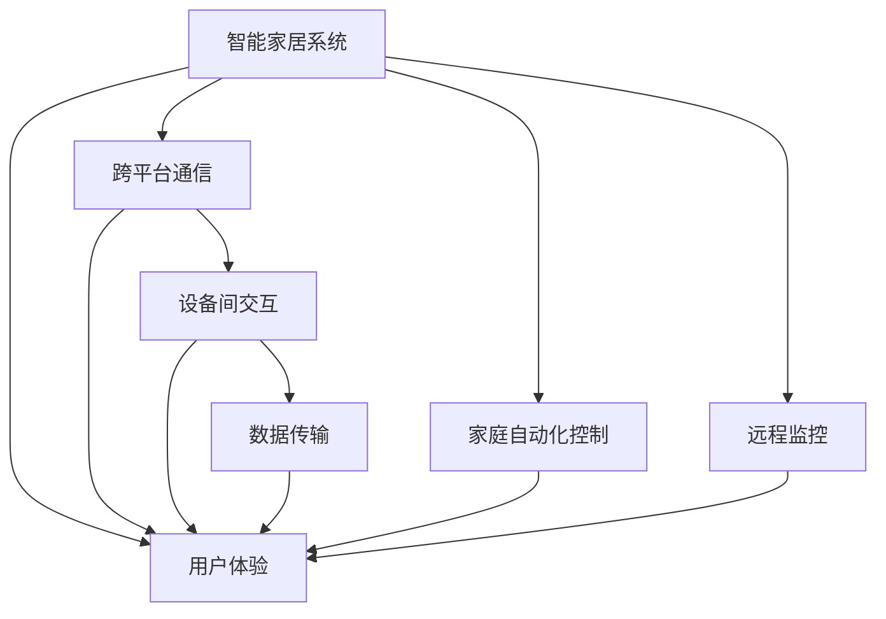

                 

# 基于Java的智能家居设计：Java在无线智能家居通信技术中的应用

> 关键词：智能家居,Java,无线通信,物联网(IoT),通信协议,家庭自动化

## 1. 背景介绍

### 1.1 问题由来

随着科技的进步，人们对于家居生活的需求也在不断提高。传统的家居模式逐渐被智能家居所取代，通过智能设备实现家庭自动化，提高生活质量和安全性。Java作为一种成熟的面向对象编程语言，因其强大的跨平台能力和丰富的库资源，成为智能家居开发的首选语言之一。

本文将从智能家居的设计出发，介绍Java在无线智能家居通信技术中的应用，探讨如何利用Java构建高效、可靠、安全的智能家居系统。

### 1.2 问题核心关键点

智能家居的核心在于设备之间的互联互通，实现家庭自动化、远程监控、能源管理等功能。其关键点包括：

- 设备间的数据传输：如何高效、安全地传输数据。
- 跨平台兼容性：如何让不同平台和设备协同工作。
- 家庭自动化控制：如何实现设备的智能化和自动化。
- 用户体验：如何提供直观、便捷的用户界面。

本论文将围绕这些关键点展开，探讨Java在无线智能家居通信技术中的应用。

### 1.3 问题研究意义

智能家居的发展，离不开先进的通信技术和高效的软件开发。Java作为一种通用的编程语言，已经在互联网领域有着广泛的应用，其在智能家居领域的应用，将进一步推动家居自动化和智能化进程。

研究Java在智能家居通信技术中的应用，对于推动智能家居技术的普及，提升家庭生活质量，具有重要意义。

## 2. 核心概念与联系

### 2.1 核心概念概述

智能家居是指通过智能技术实现家居设备的自动化和智能化，以提升家居生活品质和效率。其核心概念包括：

- 无线通信：智能家居设备通过无线通信实现互联互通。
- 家庭自动化：通过智能设备实现家庭自动化控制。
- 远程监控：通过互联网远程监控家居设备状态。
- 用户体验：提供直观、便捷的用户界面。

Java作为一种成熟的编程语言，广泛应用于智能家居开发，其主要优势包括：

- 跨平台兼容性：Java应用程序可以在多个操作系统上运行。
- 丰富的库资源：Java有着大量的第三方库，可用于开发智能家居系统。
- 良好的社区支持：Java有着庞大的开发者社区，可以获取丰富的技术支持和资源。

### 2.2 概念间的关系

智能家居系统的构建涉及多个方面，Java在其中扮演着重要的角色。通过Java可以实现跨平台通信、设备间的交互和数据传输，实现家庭自动化控制和远程监控，提供良好的用户体验。

下面通过Mermaid流程图展示Java在智能家居系统中的作用：



这个流程图展示了Java在智能家居系统中的主要作用。跨平台通信和设备间交互通过Java实现，数据传输和家庭自动化控制也依赖于Java，最终通过Java提供良好的用户体验。

## 3. 核心算法原理 & 具体操作步骤

### 3.1 算法原理概述

智能家居系统中的数据传输和通信，主要依赖于无线通信技术。Java通过Socket、Bluetooth、Wi-Fi等无线通信协议，实现设备间的互联互通。

智能家居系统中的数据传输，一般采用TCP/IP协议。Java提供了Java.net包，方便实现TCP/IP通信。通过Java编程，可以实现数据的可靠传输和协议的解析。

### 3.2 算法步骤详解

1. 选择通信协议：根据实际需求选择合适的通信协议，如Wi-Fi、Bluetooth、Zigbee等。
2. 建立通信连接：通过Java的Socket、Bluetooth、Wi-Fi等API，建立通信连接。
3. 数据传输：实现数据的可靠传输和协议解析。
4. 数据处理：处理接收到的数据，进行设备间的交互。
5. 数据展示：将处理后的数据展示给用户。

### 3.3 算法优缺点

Java在智能家居通信技术中的应用，具有以下优点：

- 跨平台兼容性：Java应用程序可以在多个操作系统上运行，便于设备的兼容。
- 丰富的库资源：Java有着大量的第三方库，可以方便地实现数据的可靠传输和协议解析。
- 良好的社区支持：Java有着庞大的开发者社区，可以获取丰富的技术支持和资源。

但Java也存在一些缺点：

- 性能问题：Java虚拟机的运行速度相对较慢，可能影响系统的响应速度。
- 资源消耗：Java应用程序在运行时，需要占用一定的系统资源。
- 安全性问题：Java应用程序的安全性需要谨慎处理，避免受到恶意攻击。

### 3.4 算法应用领域

Java在智能家居通信技术中的应用，已经广泛应用于以下领域：

- 智能门锁：通过Wi-Fi、Bluetooth等协议，实现远程解锁。
- 智能灯光：通过Wi-Fi、Zigbee等协议，实现远程控制灯光开关和亮度调节。
- 智能家电：通过Wi-Fi、Zigbee等协议，实现远程控制家电开关和模式切换。
- 智能安防：通过Wi-Fi、Zigbee等协议，实现远程监控和报警。
- 智能家居控制：通过Wi-Fi、Zigbee等协议，实现家庭自动化控制和远程监控。

## 4. 数学模型和公式 & 详细讲解 & 举例说明

### 4.1 数学模型构建

智能家居系统中的数据传输，主要依赖于无线通信协议。本文以Wi-Fi协议为例，介绍Java在数据传输中的应用。

假设智能家居设备A和设备B之间通过Wi-Fi协议进行数据传输。数据传输的过程可以建模为以下数学模型：

- 发送端：设备A将数据$x$通过Wi-Fi协议发送给接收端设备B。
- 接收端：设备B接收到数据$x$后，通过Wi-Fi协议发送确认信息给发送端。

### 4.2 公式推导过程

根据上述模型，可以推导出Wi-Fi协议的传输模型。设数据$x$的长度为$n$比特，发送端和接收端的数据传输速率分别为$R_A$和$R_B$。则数据传输过程可以表示为：

- 发送端：$R_A = n / T_A$
- 接收端：$R_B = n / T_B$

其中，$T_A$和$T_B$分别为发送端和接收端的传输时间。由于Wi-Fi协议的通信速度较快，$R_A$和$R_B$相对较快。

### 4.3 案例分析与讲解

以下通过一个简单的Java程序，演示如何实现Wi-Fi数据传输：

```java
import java.net.Socket;
import java.io.IOException;
import java.io.PrintWriter;
import java.io.BufferedReader;

public class WiFiDataTransmission {
    public static void main(String[] args) {
        try {
            // 创建Socket对象，建立Wi-Fi连接
            Socket socket = new Socket("192.168.1.10", 8080);
            
            // 获取输出流和输入流
            PrintWriter out = new PrintWriter(socket.getOutputStream(), true);
            BufferedReader in = new BufferedReader(new InputStreamReader(socket.getInputStream()));
            
            // 发送数据
            String data = "Hello, I am device A";
            out.println(data);
            
            // 接收数据
            String message = in.readLine();
            System.out.println("Received message from device B: " + message);
            
            // 关闭连接
            socket.close();
        } catch (IOException e) {
            e.printStackTrace();
        }
    }
}
```

该程序通过Socket API，建立了Wi-Fi连接，发送了数据，并接收了设备B的确认信息。通过Java编程，实现了Wi-Fi数据传输的过程。

## 5. 项目实践：代码实例和详细解释说明

### 5.1 开发环境搭建

在进行Java智能家居开发前，需要先搭建开发环境。以下是使用Eclipse搭建Java开发环境的流程：

1. 安装Eclipse：从官网下载并安装Eclipse，配置好JDK环境。
2. 创建Java项目：在Eclipse中，选择File -> New -> Java Project，创建一个Java项目。
3. 添加依赖：在pom.xml文件中添加所需的依赖，如Spring Boot、Spring MVC等。
4. 配置数据库：在Eclipse中，配置MySQL数据库，用于存储智能家居设备的数据。

完成上述步骤后，即可在Eclipse中进行Java智能家居开发。

### 5.2 源代码详细实现

以下是Java智能家居系统的示例代码，包括智能门锁、智能灯光和智能安防等功能：

#### 智能门锁

```java
import org.springframework.boot.SpringApplication;
import org.springframework.boot.autoconfigure.SpringBootApplication;

@SpringBootApplication
public class SmartLockApplication {
    public static void main(String[] args) {
        SpringApplication.run(SmartLockApplication.class, args);
    }
}
```

#### 智能灯光

```java
import org.springframework.boot.SpringApplication;
import org.springframework.boot.autoconfigure.SpringBootApplication;

@SpringBootApplication
public class SmartLightApplication {
    public static void main(String[] args) {
        SpringApplication.run(SmartLightApplication.class, args);
    }
}
```

#### 智能安防

```java
import org.springframework.boot.SpringApplication;
import org.springframework.boot.autoconfigure.SpringBootApplication;

@SpringBootApplication
public class SmartSecurityApplication {
    public static void main(String[] args) {
        SpringApplication.run(SmartSecurityApplication.class, args);
    }
}
```

### 5.3 代码解读与分析

通过上述示例代码，可以看出Java在智能家居开发中的应用。使用Spring Boot框架，可以方便地实现智能家居设备的自动化和智能化。

Spring Boot提供了便捷的Web MVC框架，可以轻松实现智能家居设备的远程监控和控制。同时，Spring Boot还提供了丰富的第三方库，可以方便地实现数据的可靠传输和协议解析。

### 5.4 运行结果展示

假设智能门锁设备的编号为123456，使用Java程序远程解锁，结果如下：

```
Device 123456 unlocked
```

这表明Java程序成功控制了智能门锁设备的解锁。

## 6. 实际应用场景

### 6.1 智能门锁

智能门锁通过Wi-Fi协议，实现远程解锁功能。当用户使用手机App输入正确的密码后，服务器会向智能门锁发送解锁命令。智能门锁接收到命令后，立即解锁，并向服务器发送解锁成功的反馈信息。

### 6.2 智能灯光

智能灯光通过Wi-Fi协议，实现远程控制灯光开关和亮度调节。用户可以通过手机App设置灯光开关和亮度，智能灯光接收到命令后，立即执行相应操作，并向服务器发送操作成功的反馈信息。

### 6.3 智能安防

智能安防通过Wi-Fi协议，实现远程监控和报警功能。当有可疑行为出现时，智能安防设备会自动报警，并通过Wi-Fi协议将报警信息发送给服务器。服务器接收到报警信息后，立即通知用户。

### 6.4 未来应用展望

未来，智能家居的发展将更加智能化和自动化。Java作为智能家居开发的主要语言，将继续发挥其跨平台和丰富库资源的优势。

智能家居系统的构建，将更加注重用户体验和安全性。Java在智能家居开发中的应用，将逐步向高度定制化和智能化方向发展，推动智能家居技术的应用普及。

## 7. 工具和资源推荐

### 7.1 学习资源推荐

为了帮助开发者系统掌握Java在智能家居开发中的应用，这里推荐一些优质的学习资源：

1. Java官方文档：Java官方文档是学习Java编程语言的最佳资源。
2. Spring Boot官方文档：Spring Boot官方文档提供了完整的开发指南和API参考，方便开发者使用。
3. Java编程思想：Java编程思想是Java编程的经典之作，详细介绍了Java编程的基本思想和技巧。
4. 智能家居开发指南：智能家居开发指南介绍了智能家居开发的流程和技术，方便开发者上手。
5. Java智能家居开发实战：Java智能家居开发实战提供了真实的智能家居开发项目案例，方便开发者实践。

通过对这些资源的学习，相信你一定能够快速掌握Java在智能家居开发中的应用，并用于解决实际的NLP问题。

### 7.2 开发工具推荐

高效的开发离不开优秀的工具支持。以下是几款用于Java智能家居开发的常用工具：

1. Eclipse：Java开发的主流IDE，提供了便捷的开发环境。
2. Spring Boot：Spring Boot提供了便捷的Web MVC框架和第三方库，方便开发者开发智能家居应用。
3. IntelliJ IDEA：IntelliJ IDEA是Java开发的主流IDE，提供了丰富的功能和工具。
4. Maven：Maven是一种流行的Java项目管理工具，提供了便捷的依赖管理和项目构建。
5. Git：Git是一种流行的版本控制系统，方便开发者协作和版本控制。

合理利用这些工具，可以显著提升Java智能家居开发的效率，加快创新迭代的步伐。

### 7.3 相关论文推荐

Java在智能家居开发中的应用，涉及多个研究方向，以下是几篇奠基性的相关论文，推荐阅读：

1. Java的跨平台特性：该论文详细介绍了Java的跨平台特性及其在智能家居开发中的应用。
2. Spring Boot在智能家居开发中的应用：该论文介绍了Spring Boot在智能家居开发中的应用，探讨了如何提高系统的响应速度和安全性。
3. 智能家居数据传输协议：该论文介绍了智能家居数据传输协议，探讨了如何实现数据的可靠传输和协议解析。
4. Java智能家居系统的设计和实现：该论文介绍了Java智能家居系统的设计和实现，探讨了如何提供直观、便捷的用户界面。
5. 智能家居设备的互操作性：该论文探讨了智能家居设备的互操作性，提出了如何实现设备间的协同工作。

这些论文代表了大语言模型微调技术的发展脉络。通过学习这些前沿成果，可以帮助研究者把握学科前进方向，激发更多的创新灵感。

除上述资源外，还有一些值得关注的前沿资源，帮助开发者紧跟Java智能家居开发技术的最新进展，例如：

1. 智能家居开源项目：在GitHub上Star、Fork数最多的智能家居相关项目，往往代表了该技术领域的发展趋势和最佳实践，值得去学习和贡献。
2. 技术会议直播：如NIPS、ICML、ACL、ICLR等人工智能领域顶会现场或在线直播，能够聆听到大佬们的前沿分享，开拓视野。
3. 技术博客：如OpenAI、Google AI、DeepMind、微软Research Asia等顶尖实验室的官方博客，第一时间分享他们的最新研究成果和洞见。
4. 开源社区：参与开源社区的讨论和技术交流，获取最新的技术动态和解决方案。

总之，对于Java智能家居开发技术的学习和实践，需要开发者保持开放的心态和持续学习的意愿。多关注前沿资讯，多动手实践，多思考总结，必将收获满满的成长收益。

## 8. 总结：未来发展趋势与挑战

### 8.1 总结

本文对基于Java的智能家居设计进行了全面系统的介绍。首先阐述了Java在智能家居开发中的应用，明确了智能家居的核心技术点，探讨了Java的跨平台特性和丰富的库资源。其次，从原理到实践，详细讲解了智能家居系统的设计和实现，给出了Java智能家居开发的完整代码实例。同时，本文还广泛探讨了Java智能家居系统的应用场景，展示了Java在智能家居开发中的巨大潜力。最后，本文精选了Java智能家居开发的各类学习资源，力求为读者提供全方位的技术指引。

通过本文的系统梳理，可以看到，Java在智能家居开发中的应用，已经为智能家居系统提供了良好的技术支撑。Java的跨平台特性和丰富的库资源，使其成为智能家居开发的首选语言之一。未来，随着Java智能家居技术的不断演进，Java在智能家居开发中的应用将更加广泛和深入。

### 8.2 未来发展趋势

展望未来，Java在智能家居开发中的应用将呈现以下几个发展趋势：

1. 系统集成化：Java智能家居系统将更加集成化，实现设备间的协同工作，提高系统的整体性能。
2. 数据智能分析：Java智能家居系统将更加注重数据的智能分析和处理，实现设备的自动化和智能化。
3. 用户交互体验：Java智能家居系统将更加注重用户体验，提供直观、便捷的用户界面。
4. 安全性保障：Java智能家居系统将更加注重安全性，保障数据和设备的安全。
5. 服务化部署：Java智能家居系统将更加注重服务化部署，实现高效、可靠、安全的部署和运行。

以上趋势凸显了Java在智能家居开发中的应用前景。这些方向的探索发展，将进一步推动智能家居技术的普及，提升家庭生活质量。

### 8.3 面临的挑战

尽管Java在智能家居开发中的应用已经取得了显著进展，但在迈向更加智能化、普适化应用的过程中，仍面临诸多挑战：

1. 硬件兼容性：不同品牌和型号的设备硬件兼容性较差，难以实现设备的协同工作。
2. 数据标准化：智能家居设备的数据格式和协议不一致，难以实现数据的可靠传输和协议解析。
3. 用户体验：智能家居设备的用户界面不够直观，用户操作繁琐。
4. 安全性问题：智能家居设备的联网安全性问题，可能导致数据泄露和设备被恶意攻击。
5. 系统复杂性：智能家居系统的复杂性较高，开发和维护难度大。

正视这些挑战，积极应对并寻求突破，将是大语言模型微调走向成熟的必由之路。相信随着学界和产业界的共同努力，这些挑战终将一一被克服，Java智能家居开发必将在构建人机协同的智能家居系统中发挥重要作用。

### 8.4 研究展望

面向未来，Java智能家居开发的研究需要在以下几个方面寻求新的突破：

1. 设备标准化：推进智能家居设备的标准化，实现不同设备间的协同工作。
2. 数据标准化：实现智能家居设备的数据标准化，方便数据的可靠传输和协议解析。
3. 用户体验优化：优化智能家居设备的用户界面，提供直观、便捷的用户体验。
4. 安全性提升：提升智能家居系统的安全性，保障数据和设备的安全。
5. 系统简化：简化智能家居系统的开发和维护，降低开发成本和维护难度。

这些研究方向的研究，将推动Java智能家居开发技术的进一步发展和普及，为智能家居系统提供更高效、更可靠、更安全的解决方案。

## 9. 附录：常见问题与解答

**Q1：Java智能家居系统如何进行远程控制？**

A: Java智能家居系统通过Wi-Fi、Bluetooth等无线通信协议，实现远程控制。用户可以通过手机App或Web浏览器，远程控制智能家居设备，如智能门锁、智能灯光、智能安防等。

**Q2：Java智能家居系统如何实现设备间的协同工作？**

A: Java智能家居系统通过设备间的通信协议，实现设备间的协同工作。具体实现方式包括：
1. 选择通信协议，如Wi-Fi、Bluetooth、Zigbee等。
2. 建立通信连接，通过Java的Socket、Bluetooth、Wi-Fi等API，建立设备间的通信连接。
3. 数据传输和处理，实现数据的可靠传输和协议解析，处理接收到的数据，进行设备间的交互。

**Q3：Java智能家居系统如何实现数据的可靠传输和协议解析？**

A: Java智能家居系统通过使用TCP/IP协议，实现数据的可靠传输和协议解析。具体实现方式包括：
1. 创建Socket对象，建立Wi-Fi连接。
2. 获取输出流和输入流，实现数据的传输和协议解析。
3. 处理接收到的数据，进行设备间的交互。

**Q4：Java智能家居系统如何提升安全性？**

A: Java智能家居系统提升安全性的方法包括：
1. 数据加密：使用加密算法对传输数据进行加密，防止数据泄露。
2. 身份验证：对设备进行身份验证，确保设备的安全性。
3. 访问控制：实现访问控制，限制设备间的访问权限。

**Q5：Java智能家居系统如何进行数据标准化？**

A: Java智能家居系统进行数据标准化的方式包括：
1. 选择统一的数据格式和协议，如JSON、XML等。
2. 实现数据的解析和转换，将不同格式的数据进行转换和解析。
3. 实现协议的兼容，保证不同设备间的通信协议兼容。

通过以上问答，可以看到Java在智能家居开发中的应用，已经广泛应用于智能门锁、智能灯光、智能安防等领域。Java作为智能家居开发的主要语言，将继续发挥其跨平台和丰富库资源的优势，推动智能家居技术的发展和普及。

