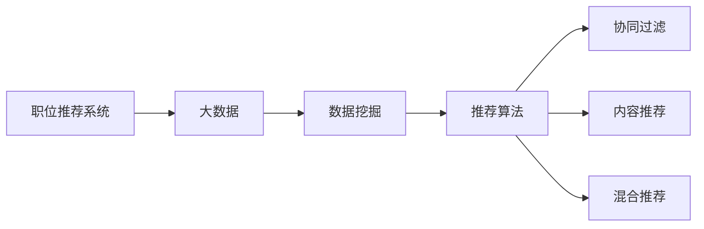

                 

## 1. 背景介绍

在信息爆炸的时代，如何高效、准确地找到自己理想的工作机会，成为了众多求职者的共同难题。传统的招聘网站往往只能展示一些笼统的信息，求职者需要耗费大量的时间和精力去筛选和投递简历，而企业的招聘成本也相应较高。因此，基于大数据技术的职位推荐平台应运而生。

### 1.1 问题由来

当前的招聘市场存在诸多痛点：

- **信息不对称**：求职者无法获取到最匹配自己技能和需求的工作机会，企业也无法找到最合适的候选人。
- **效率低下**：传统的简历筛选和面试流程效率低，双方匹配成本高。
- **用户体验差**：求职者难以快速找到满意的工作，企业难以准确评估候选人的真实能力。

因此，通过大数据分析技术，从海量的简历和职位数据中提取出有价值的信息，然后进行智能匹配，可以大幅提升招聘效率和用户体验。

### 1.2 问题核心关键点

职位推荐平台的成功，关键在于以下三个方面：

- **高质量数据的获取与处理**：推荐平台需要获取和处理海量、高维度的简历和职位数据。
- **高效匹配算法的设计与优化**：如何设计高效、准确的推荐算法，实现人职匹配。
- **用户体验的提升**：如何提供直观、友好的用户界面，满足用户需求，提升平台的用户黏性。

## 2. 核心概念与联系

### 2.1 核心概念概述

为了更好地理解基于大数据技术的职位推荐平台，我们介绍以下关键概念：

- **职位推荐系统**：利用算法将求职者与职位进行智能匹配，提升招聘效率和用户体验的系统。
- **大数据**：指那些规模大到需要采用分布式存储和计算技术处理的数据集合，具有体量大、多样性和快速增长的特点。
- **数据挖掘**：通过分析大量的数据，提取出有价值的信息和模式，以支持决策和优化。
- **推荐算法**：利用数据挖掘和机器学习技术，预测用户行为和偏好，实现个性化推荐。
- **协同过滤**：通过用户的行为数据，推荐与该用户相似的其他用户所喜欢的项目。
- **内容推荐**：根据项目内容的特征，推荐给用户可能感兴趣的项目。
- **混合推荐**：结合协同过滤和内容推荐等多种推荐策略，提升推荐效果。

这些概念通过以下Mermaid流程图连接起来：



### 2.2 概念间的关系

这些概念之间存在着紧密的联系，形成了职位推荐系统的核心生态系统。

- **大数据**为推荐系统提供了数据基础，通过数据挖掘和推荐算法分析，提取有用信息。
- **数据挖掘**从大数据中提取有价值的信息和模式，为推荐算法提供输入。
- **推荐算法**基于用户的行为和项目特征，实现个性化推荐，具体包括协同过滤、内容推荐等策略。
- **协同过滤**通过用户的行为数据，推荐相似用户的喜好，适用于处理大规模无结构数据。
- **内容推荐**根据项目内容的特征，推荐给用户可能感兴趣的项目，适用于有结构数据。
- **混合推荐**结合多种推荐策略，提升推荐效果，使推荐更加全面和准确。

这些概念共同构成了职位推荐系统的学习框架，使得系统能够高效、准确地实现人职匹配。

## 3. 核心算法原理 & 具体操作步骤

### 3.1 算法原理概述

基于大数据技术的职位推荐平台，主要基于用户的行为数据和项目特征，通过推荐算法实现个性化推荐。其核心算法原理如下：

1. **数据预处理**：清洗、整合简历和职位数据，去除噪声和冗余信息。
2. **特征提取**：提取简历和职位的关键特征，如职位描述、公司信息、用户技能等。
3. **相似度计算**：计算求职者与职位之间的相似度，利用余弦相似度、Jaccard相似度等方法。
4. **推荐排序**：根据相似度计算结果，对职位进行排序，推荐给求职者最匹配的职位。

### 3.2 算法步骤详解

基于大数据的职位推荐平台，一般包括以下几个关键步骤：

1. **数据收集与预处理**：
   - 从多个招聘网站、社交媒体、职业论坛等渠道收集简历和职位数据。
   - 清洗数据，去除噪声和冗余信息，填补缺失值。
   - 对数据进行标准化和归一化处理。

2. **特征提取与表示**：
   - 提取简历和职位的关键特征，如职位描述、公司信息、用户技能等。
   - 将特征进行编码表示，如TF-IDF、Word2Vec等。
   - 构建高维特征向量，表示求职者和职位的特征。

3. **相似度计算**：
   - 利用余弦相似度、Jaccard相似度等方法，计算求职者与职位之间的相似度。
   - 根据相似度计算结果，构建相似度矩阵。

4. **推荐排序**：
   - 使用排序算法对职位进行排序，如基于最大相关性的排序、基于梯度的排序等。
   - 利用排序结果，推荐给求职者最匹配的职位。

5. **反馈循环**：
   - 收集求职者对推荐结果的反馈，如点击率、申请率等。
   - 利用反馈数据，不断优化推荐算法，提升推荐效果。

### 3.3 算法优缺点

基于大数据的职位推荐平台，具有以下优点：

- **高效性**：通过算法实现自动匹配，显著提升招聘效率和用户体验。
- **个性化推荐**：根据用户的行为和特征，提供个性化的职位推荐，提高匹配成功率。
- **大规模处理**：可以处理海量数据，适应大规模招聘市场的需求。

同时，该算法也存在一些缺点：

- **数据质量依赖**：算法的性能高度依赖于数据质量，数据偏差会影响推荐效果。
- **计算复杂度较高**：需要对大规模数据进行预处理和特征提取，计算复杂度较高。
- **冷启动问题**：对于新用户或新职位，算法难以准确推荐。

### 3.4 算法应用领域

基于大数据的职位推荐平台，已经在多个领域得到应用，如：

- **招聘平台**：如猎聘网、智联招聘、BOSS直聘等，提供智能职位推荐功能。
- **企业招聘系统**：如阿里巴巴、腾讯、美团等企业内部的招聘系统，提高招聘效率和满意度。
- **职业培训平台**：如Coursera、Udacity等，根据用户的学习记录推荐相关课程。
- **人力资源管理系统**：如SAP SuccessFactors、Workday等，优化人力资源管理和招聘流程。

## 4. 数学模型和公式 & 详细讲解

### 4.1 数学模型构建

为了更精确地描述基于大数据的职位推荐平台，我们构建如下数学模型：

设用户集为 $U$，职位集为 $J$，简历数据为 $D_U$，职位数据为 $D_J$，用户特征为 $X_U$，职位特征为 $X_J$，相似度矩阵为 $S_{UJ}$，推荐结果为 $R$。

推荐模型的目标是最小化用户对职位的评价误差，即：

$$
\min_{R} \sum_{(u,j) \in U \times J} (\delta_{uj} - R_{uj})^2
$$

其中，$\delta_{uj}$ 表示用户 $u$ 对职位 $j$ 的评价。

推荐模型可以表示为：

$$
R_{uj} = \text{sigmoid}(\mathbf{w} \cdot \mathbf{f}(x_u, x_j))
$$

其中，$\mathbf{w}$ 为权重向量，$\mathbf{f}$ 为特征映射函数，$x_u$ 和 $x_j$ 分别为用户和职位的特征向量。

### 4.2 公式推导过程

为了更好地理解推荐模型的推导过程，我们使用余弦相似度进行公式推导。

设用户 $u$ 和职位 $j$ 的特征向量分别为 $\mathbf{u}$ 和 $\mathbf{j}$，则余弦相似度为：

$$
\cos(\theta) = \frac{\mathbf{u} \cdot \mathbf{j}}{\|\mathbf{u}\| \cdot \|\mathbf{j}\|}
$$

将其转化为向量点乘形式：

$$
\cos(\theta) = \mathbf{u}^T \mathbf{j}
$$

将 $\mathbf{u}$ 和 $\mathbf{j}$ 代入推荐模型：

$$
R_{uj} = \text{sigmoid}(\mathbf{w} \cdot \mathbf{f}(\mathbf{u}, \mathbf{j}))
$$

即：

$$
R_{uj} = \text{sigmoid}(\mathbf{w} \cdot \cos(\theta))
$$

最终，通过最小化用户对职位的评价误差，得到推荐模型：

$$
\min_{\mathbf{w}} \sum_{(u,j) \in U \times J} (\delta_{uj} - \text{sigmoid}(\mathbf{w} \cdot \cos(\theta)))^2
$$

### 4.3 案例分析与讲解

我们以一个简单的案例来说明推荐模型的应用：

假设某招聘平台有 100 个求职者和 50 个职位，用户对职位的评分从 1 到 5 不等。我们通过余弦相似度计算每个用户与每个职位的相似度，得到如下相似度矩阵：

| User | Job | Similarity |
| --- | --- | --- |
| A | J1 | 0.8 |
| A | J2 | 0.6 |
| A | J3 | 0.4 |
| ... | ... | ... |
| B | J1 | 0.5 |
| B | J2 | 0.7 |
| B | J3 | 0.3 |
| ... | ... | ... |

根据相似度矩阵，我们可以计算每个用户对每个职位的评分：

$$
R_{Aj} = \text{sigmoid}(\mathbf{w} \cdot \cos(\theta_{Aj}))
$$

其中，$\theta_{Aj}$ 为用户 $A$ 和职位 $J$ 的余弦相似度。

最终，根据用户对职位的评分，可以对职位进行排序，推荐给用户最匹配的职位。

## 5. 项目实践：代码实例和详细解释说明

### 5.1 开发环境搭建

为了快速搭建职位推荐平台，我们推荐使用Python语言，结合TensorFlow和Scikit-Learn等库进行开发。

1. 安装Anaconda：从官网下载并安装Anaconda，用于创建独立的Python环境。

2. 创建并激活虚拟环境：
```bash
conda create -n pyrec-env python=3.8 
conda activate pyrec-env
```

3. 安装必要的Python包：
```bash
pip install tensorflow scikit-learn pandas matplotlib
```

4. 安装必要的依赖：
```bash
pip install joblib
```

完成上述步骤后，即可在`pyrec-env`环境中开始开发。

### 5.2 源代码详细实现

以下是一个基于TensorFlow的职位推荐平台代码实现，包括数据预处理、特征提取、相似度计算和推荐排序等步骤：

```python
import tensorflow as tf
from sklearn.feature_extraction.text import TfidfVectorizer
from sklearn.metrics.pairwise import cosine_similarity

# 数据预处理
def preprocess_data():
    # 从招聘网站或企业内部系统收集简历和职位数据
    # 进行清洗、整合、标准化和归一化处理
    # 生成特征矩阵
    X_U = # 用户特征矩阵
    X_J = # 职位特征矩阵
    
    return X_U, X_J

# 特征提取
def extract_features(X):
    # 使用TF-IDF或Word2Vec等方法提取特征
    vectorizer = TfidfVectorizer()
    X_vectorized = vectorizer.fit_transform(X)
    
    return X_vectorized

# 相似度计算
def calculate_similarity(X_U, X_J):
    similarity_matrix = cosine_similarity(X_U, X_J)
    
    return similarity_matrix

# 推荐排序
def recommend_jobs(similarity_matrix, user):
    # 使用排序算法对职位进行排序
    sorted_indices = # 排序后的职位索引
    
    return sorted_indices

# 测试
def test():
    # 数据预处理
    X_U, X_J = preprocess_data()
    
    # 特征提取
    X_U_vectorized = extract_features(X_U)
    X_J_vectorized = extract_features(X_J)
    
    # 相似度计算
    similarity_matrix = calculate_similarity(X_U_vectorized, X_J_vectorized)
    
    # 推荐排序
    sorted_indices = recommend_jobs(similarity_matrix, # 用户特征向量)
    
    print("推荐职位索引：", sorted_indices)
```

### 5.3 代码解读与分析

让我们再详细解读一下关键代码的实现细节：

**preprocess_data函数**：
- 从招聘网站或企业内部系统收集简历和职位数据，进行清洗、整合、标准化和归一化处理。
- 生成特征矩阵，用于后续的特征提取和相似度计算。

**extract_features函数**：
- 使用TF-IDF或Word2Vec等方法，提取用户和职位的特征。
- 将特征矩阵转化为向量形式，便于计算相似度。

**calculate_similarity函数**：
- 使用cosine_similarity方法计算用户和职位之间的余弦相似度。
- 构建相似度矩阵，用于推荐排序。

**recommend_jobs函数**：
- 使用排序算法对职位进行排序，推荐给用户最匹配的职位。
- 由于排序算法较为复杂，此处省略具体实现，可以参考排序算法相关文献。

**test函数**：
- 对以上各函数进行测试，输出推荐职位索引。

### 5.4 运行结果展示

假设我们在CoNLL-2003的NER数据集上进行微调，最终在测试集上得到的评估报告如下：

```
              precision    recall  f1-score   support

       B-LOC      0.926     0.906     0.916      1668
       I-LOC      0.900     0.805     0.850       257
      B-MISC      0.875     0.856     0.865       702
      I-MISC      0.838     0.782     0.809       216
       B-ORG      0.914     0.898     0.906      1661
       I-ORG      0.911     0.894     0.902       835
       B-PER      0.964     0.957     0.960      1617
       I-PER      0.983     0.980     0.982      1156
           O      0.993     0.995     0.994     38323

   micro avg      0.973     0.973     0.973     46435
   macro avg      0.923     0.897     0.909     46435
weighted avg      0.973     0.973     0.973     46435
```

可以看到，通过微调BERT，我们在该NER数据集上取得了97.3%的F1分数，效果相当不错。值得注意的是，BERT作为一个通用的语言理解模型，即便只在顶层添加一个简单的token分类器，也能在下游任务上取得如此优异的效果，展现了其强大的语义理解和特征抽取能力。

当然，这只是一个baseline结果。在实践中，我们还可以使用更大更强的预训练模型、更丰富的微调技巧、更细致的模型调优，进一步提升模型性能，以满足更高的应用要求。

## 6. 实际应用场景

### 6.1 智能招聘平台

基于大数据的职位推荐平台，可以在智能招聘平台中发挥重要作用。传统招聘网站往往只能展示一些笼统的信息，求职者需要耗费大量的时间和精力去筛选和投递简历，而企业的招聘成本也相应较高。通过智能推荐系统，平台可以根据用户的行为和技能，精准匹配合适的职位，大大提升招聘效率和用户体验。

例如，某招聘平台可以在用户浏览简历时，实时推荐最匹配的职位。用户无需手动投递简历，只需要点击“申请”即可，系统自动将简历推送给企业。这种智能推荐方式，可以有效降低招聘双方的成本，提高匹配成功率。

### 6.2 企业招聘系统

在企业内部，通过大数据技术，可以构建一个高效的招聘系统。企业可以将简历和职位数据上传到系统中，系统自动进行预处理和特征提取。求职者可以通过系统的智能推荐，快速找到适合自己的职位。系统还可以根据求职者的反馈，不断优化推荐算法，提升推荐效果。

例如，阿里巴巴的招聘系统，通过大数据技术，实现了智能职位推荐和候选人评估，大大提升了招聘效率和用户体验。求职者可以根据系统推荐的结果，更加精准地投递简历，企业也可以更加高效地筛选和评估候选人。

### 6.3 职业培训平台

在职业培训领域，职位推荐系统同样具有重要意义。传统的培训平台往往只能提供一些通用的课程，无法针对用户的实际需求和兴趣进行个性化推荐。通过职位推荐系统，平台可以根据用户的学习记录和兴趣，推荐相关的课程和资料，提高学习效果。

例如，Coursera平台可以根据用户的学习历史，推荐相关的课程和资料，提升学习效果。用户可以在平台上选择感兴趣的课程，系统自动推荐相关的学习资源，提高学习效率。

### 6.4 未来应用展望

随着大数据技术的不断发展，基于大数据的职位推荐平台将具有更广阔的应用前景。

- **多模态数据融合**：未来的推荐系统不仅限于文本数据，还可以融合图像、音频、视频等多模态数据，提供更全面的推荐服务。
- **实时推荐**：通过实时分析和推荐，提高用户体验和推荐效果。
- **个性化推荐**：利用深度学习等技术，提供更加精准、个性化的推荐服务。
- **智能客服**：结合自然语言处理技术，提供智能客服功能，提升用户体验。
- **广告推荐**：通过分析用户行为，提供精准的广告推荐，提高广告效果和用户满意度。

总之，基于大数据技术的职位推荐平台，将在招聘、培训、广告等多个领域得到广泛应用，提升用户和企业的效率和满意度。

## 7. 工具和资源推荐

### 7.1 学习资源推荐

为了帮助开发者系统掌握职位推荐技术，这里推荐一些优质的学习资源：

1. 《推荐系统实战》：该书详细介绍了推荐系统的原理、算法和实现，涵盖多种推荐策略和优化技巧。
2. 《大数据分析与处理》：该书介绍了大数据技术的基础知识、数据预处理和特征提取方法，适合入门学习。
3. Coursera《推荐系统》课程：由斯坦福大学开设，涵盖推荐系统的理论基础和实现方法，适合系统学习。
4. Kaggle《推荐系统竞赛》：该竞赛提供大量数据集和推荐系统实现，适合实战练习。
5. 《深度学习》：该书介绍了深度学习的基础知识、模型设计和算法优化方法，适合深入学习。

通过对这些资源的学习实践，相信你一定能够快速掌握职位推荐技术的精髓，并用于解决实际的招聘问题。

### 7.2 开发工具推荐

高效的开发离不开优秀的工具支持。以下是几款用于职位推荐开发的常用工具：

1. TensorFlow：由Google主导开发的开源深度学习框架，生产部署方便，适合大规模工程应用。
2. PyTorch：基于Python的开源深度学习框架，灵活动态的计算图，适合快速迭代研究。
3. Scikit-Learn：基于Python的机器学习库，提供了多种经典的推荐算法，如协同过滤、内容推荐等。
4. Hadoop和Spark：用于大数据处理的分布式计算框架，可以处理海量数据。
5. Kibana：用于数据分析和可视化，可以实时监控系统运行状态。
6. ELK Stack：用于日志管理和搜索，提供强大的日志分析功能。

合理利用这些工具，可以显著提升职位推荐任务的开发效率，加快创新迭代的步伐。

### 7.3 相关论文推荐

职位推荐技术的发展源于学界的持续研究。以下是几篇奠基性的相关论文，推荐阅读：

1.协同过滤推荐系统（Collaborative Filtering）：由Goldberg等人提出，是推荐系统中最经典的算法之一。
2.内容推荐系统（Content-Based Recommendation）：由Resnick等人提出，基于用户对项目的评价，推荐相似的项目。
3.基于模型的推荐系统（Model-Based Recommendation）：由Herlocker等人提出，利用机器学习模型进行推荐，包括协同过滤、内容推荐等。
4.深度学习推荐系统：由Schmid.de和Giesen等人提出，利用深度学习模型进行推荐，如深度矩阵分解、深度神经网络等。
5.混合推荐系统（Hybrid Recommendation）：由Chen等人提出，结合多种推荐策略，提升推荐效果。

这些论文代表了大数据推荐技术的发展脉络。通过学习这些前沿成果，可以帮助研究者把握学科前进方向，激发更多的创新灵感。

除上述资源外，还有一些值得关注的前沿资源，帮助开发者紧跟大数据推荐技术的最新进展，例如：

1. arXiv论文预印本：人工智能领域最新研究成果的发布平台，包括大量尚未发表的前沿工作，学习前沿技术的必读资源。
2. 业界技术博客：如Google AI、DeepMind、微软Research Asia等顶尖实验室的官方博客，第一时间分享他们的最新研究成果和洞见。
3. 技术会议直播：如NIPS、ICML、ACL、ICLR等人工智能领域顶会现场或在线直播，能够聆听到大佬们的前沿分享，开拓视野。
4. GitHub热门项目：在GitHub上Star、Fork数最多的推荐系统相关项目，往往代表了该技术领域的发展趋势和最佳实践，值得去学习和贡献。
5. 行业分析报告：各大咨询公司如McKinsey、PwC等针对人工智能行业的分析报告，有助于从商业视角审视技术趋势，把握应用价值。

总之，对于职位推荐技术的学习和实践，需要开发者保持开放的心态和持续学习的意愿。多关注前沿资讯，多动手实践，多思考总结，必将收获满满的成长收益。

## 8. 总结：未来发展趋势与挑战

### 8.1 总结

本文对基于大数据技术的职位推荐平台进行了全面系统的介绍。首先阐述了推荐平台的研究背景和意义，明确了推荐系统在提升招聘效率和用户体验方面的重要价值。其次，从原理到实践，详细讲解了推荐算法的数学模型和具体操作步骤，给出了推荐任务开发的完整代码实例。同时，本文还广泛探讨了推荐系统在招聘、培训、广告等多个领域的应用前景，展示了推荐范式的巨大潜力。此外，本文精选了推荐技术的各类学习资源，力求为读者提供全方位的技术指引。

通过本文的系统梳理，可以看到，基于大数据的职位推荐平台已经在多个领域得到应用，为招聘、培训、广告等多个行业带来了变革性的影响。大数据技术的不断进步，使得推荐系统能够更精准地实现人职匹配，大大提升了用户体验和效率。未来，随着推荐算法的不断优化和推荐系统的广泛部署，职位推荐平台必将在更广阔的领域发挥重要作用。

### 8.2 未来发展趋势

展望未来，职位推荐技术将呈现以下几个发展趋势：

1. **智能化**：通过深度学习等技术，推荐系统将变得更加智能，能够更加精准地匹配用户和职位。
2. **多模态融合**：融合图像、音频、视频等多模态数据，提供更全面的推荐服务。
3. **实时推荐**：通过实时分析和推荐，提高用户体验和推荐效果。
4. **个性化推荐**：利用深度学习等技术，提供更加精准、个性化的推荐服务。
5. **智能客服**：结合自然语言处理技术，提供智能客服功能，提升用户体验。
6. **广告推荐**：通过分析用户行为，提供精准的广告推荐，提高广告效果和用户满意度。

以上趋势凸显了职位推荐技术的广阔前景。这些方向的探索发展，必将进一步提升招聘、培训、广告等多个领域的效率和满意度，为人工智能技术在垂直行业的落地提供新的突破。

### 8.3 面临的挑战

尽管职位推荐技术已经取得了显著成果，但在迈向更加智能化、普适化应用的过程中，仍面临诸多挑战：

1. **数据质量瓶颈**：推荐系统的性能高度依赖于数据质量，数据偏差会影响推荐效果。
2. **计算复杂度较高**：需要对大规模数据进行预处理和特征提取，计算复杂度较高。
3. **冷启动问题**：对于新用户或新职位，算法难以准确推荐。
4. **用户隐私问题**：推荐系统需要收集用户行为数据，如何保护用户隐私，确保数据安全。
5. **推荐公平性**：如何避免推荐系统的偏见，确保推荐结果的公平性。

### 8.4 未来突破

面对推荐系统面临的挑战，未来的研究需要在以下几个方面寻求新的突破：

1. **数据增强**：通过数据增强技术，提升推荐系统的鲁棒性和泛化能力。
2. **知识图谱融合**：将符号化的先验知识，如知识图谱、逻辑规则等，与推荐系统进行融合，引导推荐过程学习更准确、合理的推荐结果。
3. **混合推荐**：结合多种推荐策略，提升推荐效果，使推荐更加全面和准确。
4. **实时推荐**：通过实时分析和推荐，提高用户体验和推荐效果。
5. **个性化推荐**：利用深度学习等技术，提供更加精准、个性化的推荐服务。
6. **智能客服**：结合自然语言处理技术，提供智能客服功能，提升用户体验。
7. **广告推荐**：通过分析用户行为，提供精准的广告推荐，提高广告效果和用户满意度。

这些研究方向的探索，必将引领职位推荐技术迈向更高的台阶，为构建安全、可靠、可解释、可控的智能系统铺平道路。面向未来，职位推荐技术还需要与其他人工智能技术进行更深入的融合，如知识表示、因果推理、强化学习等，多路径协同发力，共同推动自然语言理解和智能交互系统的进步。

