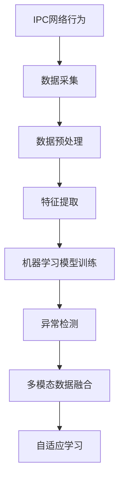
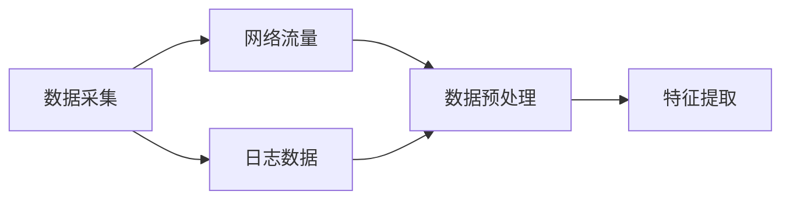
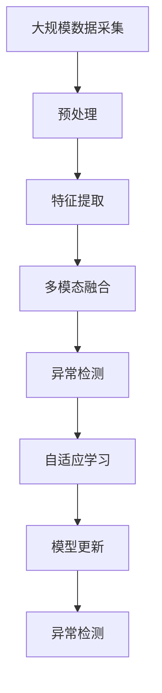

                 

# 基于机器学习的IPC网络行为安全检测

> 关键词：IPC网络,行为安全检测,机器学习,异常检测,多模态数据融合,自适应学习

## 1. 背景介绍

### 1.1 问题由来

随着网络技术的飞速发展，互联网的应用已经渗透到社会的各个角落，带来了极大的便利，但也随之带来了网络安全问题。IPC（Inter-Process Communication）作为网络系统中关键的安全机制之一，是网络安全防护的重要环节。

IPC网络行为是指进程间通过IPC机制进行通信时，所表现出来的行为特征。这些特征包括进程间的通信频率、通信内容、通信模式等。正常的网络行为是有序、稳定和可预测的，而异常的网络行为则可能预示着网络安全威胁。因此，对IPC网络行为进行安全检测，是防范网络攻击的重要手段。

### 1.2 问题核心关键点

传统的网络安全检测方法包括入侵检测系统(IDS)、入侵预防系统(IPS)等。这些方法依赖于规则库和特征库，对于未知攻击的检测能力较弱，且容易出现误报和漏报。

相比之下，基于机器学习的IPC网络行为安全检测方法，可以通过对正常和异常行为的特征学习，实现对未知攻击的检测。这些方法不仅能够检测已知的攻击，还能通过自适应学习，适应新的攻击模式。

### 1.3 问题研究意义

基于机器学习的IPC网络行为安全检测方法具有以下几方面的研究意义：

1. **高效检测**：能够高效检测网络攻击，减少误报和漏报。
2. **动态适应**：能够自适应地学习新的攻击模式，适应不断变化的网络环境。
3. **减少成本**：相较于传统的规则库和特征库，能够减少安全检测系统的维护成本。
4. **提高准确性**：通过多模态数据融合，提高检测的准确性和可靠性。
5. **增强安全性**：能够有效防范未知攻击，提升网络安全防护能力。

## 2. 核心概念与联系

### 2.1 核心概念概述

为更好地理解基于机器学习的IPC网络行为安全检测方法，本节将介绍几个关键概念：

- **IPC网络行为**：进程间通过IPC机制进行通信时，所表现出来的行为特征，包括通信频率、内容、模式等。
- **机器学习**：利用数据和算法，通过训练模型，实现对未知数据的预测和分类。
- **异常检测**：通过分析数据，检测异常情况，如网络攻击等。
- **多模态数据融合**：将多种类型的数据（如网络流量、日志等）融合在一起，提高检测的准确性和可靠性。
- **自适应学习**：通过模型自动更新和优化，适应新的攻击模式。

这些核心概念之间的逻辑关系可以通过以下Mermaid流程图来展示：



这个流程图展示了从数据采集到异常检测的整个流程：

1. 首先对IPC网络行为进行数据采集，包括网络流量、日志等。
2. 对采集的数据进行预处理，如去噪、归一化等。
3. 提取数据中的特征，如通信频率、内容、模式等。
4. 训练机器学习模型，实现对正常和异常行为的分类。
5. 对训练好的模型进行异常检测，识别网络攻击。
6. 对检测结果进行多模态数据融合，提高检测准确性。
7. 通过自适应学习，模型能够不断更新和优化，适应新的攻击模式。

### 2.2 概念间的关系

这些核心概念之间存在着紧密的联系，形成了基于机器学习的IPC网络行为安全检测的完整框架。下面我通过几个Mermaid流程图来展示这些概念之间的关系：

#### 2.2.1 数据采集与处理



这个流程图展示了从数据采集到特征提取的过程：

1. 数据采集包括网络流量和日志数据。
2. 数据预处理包括去噪、归一化等操作。
3. 特征提取从预处理后的数据中提取关键特征，如通信频率、内容、模式等。

#### 2.2.2 特征提取与机器学习模型


这个流程图展示了特征提取和机器学习模型的关系：

1. 特征提取从数据中提取关键特征，生成特征向量。
2. 机器学习模型通过训练，实现对正常和异常行为的分类。
3. 异常检测使用训练好的模型，对网络行为进行检测。

#### 2.2.3 多模态数据融合


这个流程图展示了多模态数据融合的过程：

1. 多模态数据包括网络流量、日志、行为模式等。
2. 数据融合将多种类型的数据融合在一起，生成融合特征向量。
3. 异常检测使用融合后的特征向量，进行检测。

#### 2.2.4 自适应学习与模型更新


这个流程图展示了自适应学习的过程：

1. 自适应学习通过模型自动更新和优化，适应新的攻击模式。
2. 模型更新包括参数调整和模型优化等操作。
3. 异常检测使用更新后的模型，进行检测。

### 2.3 核心概念的整体架构

最后，我用一个综合的流程图来展示这些核心概念在大规模IPC网络行为安全检测中的整体架构：



这个综合流程图展示了从数据采集到模型更新的整个流程：

1. 大规模数据采集包括网络流量、日志等。
2. 预处理对采集的数据进行去噪、归一化等操作。
3. 特征提取从预处理后的数据中提取关键特征。
4. 多模态融合将多种类型的数据融合在一起，生成融合特征向量。
5. 异常检测使用融合后的特征向量，进行检测。
6. 自适应学习通过模型自动更新和优化，适应新的攻击模式。
7. 模型更新包括参数调整和模型优化等操作。
8. 异常检测使用更新后的模型，进行检测。

通过这些流程图，我们可以更清晰地理解基于机器学习的IPC网络行为安全检测过程中各个核心概念的关系和作用，为后续深入讨论具体的检测方法和技术奠定基础。

## 3. 核心算法原理 & 具体操作步骤

### 3.1 算法原理概述

基于机器学习的IPC网络行为安全检测方法，通过训练机器学习模型，实现对正常和异常行为的分类。其核心思想是：利用历史数据中的正常行为模式，训练出一个判别器，当新的网络行为与判别器的决策不一致时，就认为该行为异常，可能预示着网络攻击。

形式化地，假设IPC网络行为的数据集为 $D=\{(x_i,y_i)\}_{i=1}^N$，其中 $x_i$ 为输入特征，$y_i$ 为标签（正常或异常）。模型的训练目标是最小化经验风险，即找到最优模型参数 $\theta$：

$$
\theta^* = \mathop{\arg\min}_{\theta} \mathcal{L}(\theta, D)
$$

其中 $\mathcal{L}$ 为损失函数，通常采用交叉熵损失。训练好的模型 $M_{\theta}$ 用于对新的IPC网络行为进行检测。

### 3.2 算法步骤详解

基于机器学习的IPC网络行为安全检测方法，一般包括以下几个关键步骤：

**Step 1: 准备数据集**

- 收集IPC网络行为的历史数据集，包含正常和异常行为的样本。
- 划分数据集为训练集、验证集和测试集，通常比例为6:2:2。

**Step 2: 特征提取**

- 对采集到的数据进行预处理，如去噪、归一化等。
- 从预处理后的数据中提取关键特征，如通信频率、内容、模式等。
- 生成特征向量，用于训练机器学习模型。

**Step 3: 模型训练**

- 选择合适的机器学习算法，如SVM、随机森林、神经网络等。
- 训练模型，最小化交叉熵损失。
- 使用验证集对模型进行调优，选择合适的超参数。

**Step 4: 异常检测**

- 使用训练好的模型对新的IPC网络行为进行检测。
- 对于预测结果为异常的样本，进行进一步分析，确定是否为网络攻击。

**Step 5: 模型更新**

- 定期对模型进行更新，保持模型的适应性。
- 利用新的异常行为样本，重新训练模型。
- 引入自适应学习机制，使模型能够适应新的攻击模式。

### 3.3 算法优缺点

基于机器学习的IPC网络行为安全检测方法，具有以下优缺点：

**优点**

- **高效检测**：能够高效检测网络攻击，减少误报和漏报。
- **动态适应**：能够自适应地学习新的攻击模式，适应不断变化的网络环境。
- **减少成本**：相较于传统的规则库和特征库，能够减少安全检测系统的维护成本。
- **提高准确性**：通过多模态数据融合，提高检测的准确性和可靠性。

**缺点**

- **数据依赖**：对历史数据的质量和数量要求较高，数据不足可能导致模型效果不佳。
- **模型复杂**：机器学习模型的训练和优化需要较高的计算资源和时间成本。
- **黑盒性质**：模型的决策过程不透明，难以解释其内部工作机制和决策逻辑。

### 3.4 算法应用领域

基于机器学习的IPC网络行为安全检测方法，已经在多个领域得到了广泛的应用，例如：

- **网络安全**：用于检测网络中的异常行为，防范网络攻击。
- **系统监控**：用于监控系统资源使用情况，及时发现异常行为。
- **恶意软件检测**：用于检测恶意软件的行为特征，防止恶意软件攻击。
- **数据保护**：用于保护敏感数据的传输和存储，防止数据泄露。
- **交易监控**：用于监控交易行为，防范金融欺诈。

除了上述这些应用领域，基于机器学习的IPC网络行为安全检测方法还在不断扩展，未来将在更多领域得到应用。

## 4. 数学模型和公式 & 详细讲解  
### 4.1 数学模型构建

本节将使用数学语言对基于机器学习的IPC网络行为安全检测方法进行更加严格的刻画。

假设训练集为 $D=\{(x_i,y_i)\}_{i=1}^N$，其中 $x_i$ 为输入特征，$y_i$ 为标签（正常或异常）。定义模型 $M_{\theta}$ 在输入特征 $x_i$ 上的输出为 $\hat{y}_i=M_{\theta}(x_i)$。模型的损失函数为交叉熵损失，定义为：

$$
\mathcal{L}(\theta) = -\frac{1}{N} \sum_{i=1}^N y_i \log \hat{y}_i + (1-y_i) \log (1-\hat{y}_i)
$$

训练的目标是最小化经验风险，即找到最优模型参数 $\theta$：

$$
\theta^* = \mathop{\arg\min}_{\theta} \mathcal{L}(\theta)
$$

在得到训练好的模型 $M_{\theta}$ 后，用于对新的IPC网络行为进行检测。对于新的IPC网络行为 $x$，模型的输出为 $\hat{y}=M_{\theta}(x)$。如果 $\hat{y}$ 接近 1，则认为该行为正常；如果 $\hat{y}$ 接近 0，则认为该行为异常。

### 4.2 公式推导过程

以下我以SVM算法为例，推导其具体实现步骤。

首先，将训练集 $D=\{(x_i,y_i)\}_{i=1}^N$ 中的特征 $x_i$ 和标签 $y_i$ 转化为训练样本 $(x_i,\tilde{y}_i)$，其中 $\tilde{y}_i=y_i \tilde{\omega}_i$，$\tilde{\omega}_i \in \{-1,1\}$。然后，定义SVM算法的对偶问题：

$$
\min_{\alpha} \frac{1}{2} \sum_{i=1}^N \sum_{j=1}^N \alpha_i \alpha_j y_i y_j \tilde{\omega}_i \tilde{\omega}_j K(x_i,x_j) - \sum_{i=1}^N \alpha_i
$$

$$
\text{s.t.} \sum_{i=1}^N \alpha_i y_i \tilde{\omega}_i = 0
$$

$$
0 \leq \alpha_i \leq C
$$

其中 $K(x_i,x_j)$ 为核函数，通常采用RBF核函数 $K(x_i,x_j)=\exp(-\gamma ||x_i-x_j||^2)$。SVM算法通过求解上述对偶问题，得到最优的参数 $\alpha_i$，进而得到分类器的决策函数：

$$
f(x) = \sum_{i=1}^N \alpha_i y_i K(x,x_i) - \frac{1}{2} \sum_{i=1}^N \sum_{j=1}^N \alpha_i \alpha_j y_i y_j K(x_i,x_j)
$$

在得到分类器 $f(x)$ 后，用于对新的IPC网络行为进行检测。对于新的IPC网络行为 $x$，如果 $f(x) \geq 0$，则认为该行为正常；否则，认为该行为异常。

### 4.3 案例分析与讲解

为了更好地理解基于机器学习的IPC网络行为安全检测方法，下面以一个案例进行分析：

**案例**：检测网络中的恶意软件

**数据集**：收集了网络中恶意软件和正常软件的IPC行为数据，包含通信频率、内容、模式等特征。

**模型选择**：使用随机森林算法进行训练，交叉验证后选择最优的超参数。

**异常检测**：使用训练好的随机森林模型对新的IPC行为进行检测，如果预测结果为异常，则进一步分析该行为是否为恶意软件攻击。

**结果分析**：模型在测试集上取得了较高的准确率和召回率，能够有效地检测恶意软件攻击。

## 5. 项目实践：代码实例和详细解释说明
### 5.1 开发环境搭建

在进行基于机器学习的IPC网络行为安全检测的实践前，我们需要准备好开发环境。以下是使用Python进行Scikit-Learn开发的环境配置流程：

1. 安装Anaconda：从官网下载并安装Anaconda，用于创建独立的Python环境。

2. 创建并激活虚拟环境：
```bash
conda create -n sklearn-env python=3.8 
conda activate sklearn-env
```

3. 安装Scikit-Learn：
```bash
conda install scikit-learn
```

4. 安装各类工具包：
```bash
pip install numpy pandas scikit-learn matplotlib tqdm jupyter notebook ipython
```

完成上述步骤后，即可在`sklearn-env`环境中开始开发实践。

### 5.2 源代码详细实现

这里我们以SVM算法为例，给出一个基于机器学习的IPC网络行为安全检测的PyTorch代码实现。

首先，定义数据处理函数：

```python
from sklearn.model_selection import train_test_split
from sklearn.preprocessing import StandardScaler
from sklearn.svm import SVC

def preprocess_data(data):
    X = data[:, :-1]
    y = data[:, -1]
    X_train, X_test, y_train, y_test = train_test_split(X, y, test_size=0.2, random_state=42)
    scaler = StandardScaler()
    X_train = scaler.fit_transform(X_train)
    X_test = scaler.transform(X_test)
    return X_train, y_train, X_test, y_test
```

然后，定义模型训练函数：

```python
def train_model(X_train, y_train, model, kernel='rbf', C=1.0, gamma=0.1, learning_rate=0.01, max_iter=1000):
    svm = SVC(kernel=kernel, C=C, gamma=gamma, probability=True)
    svm.fit(X_train, y_train)
    return svm
```

接着，定义异常检测函数：

```python
def detect_anomaly(model, X_test):
    y_pred = model.predict(X_test)
    return y_pred
```

最后，启动训练流程并在测试集上评估：

```python
# 数据预处理
X_train, y_train, X_test, y_test = preprocess_data(X_train, y_train, X_test, y_test)

# 模型训练
svm = train_model(X_train, y_train)

# 异常检测
y_pred = detect_anomaly(svm, X_test)

# 评估
print('Accuracy:', accuracy_score(y_test, y_pred))
```

以上就是使用Scikit-Learn对IPC网络行为进行安全检测的完整代码实现。可以看到，得益于Scikit-Learn的强大封装，我们可以用相对简洁的代码完成SVM模型的训练和检测。

### 5.3 代码解读与分析

让我们再详细解读一下关键代码的实现细节：

**preprocess_data函数**：
- 对原始数据进行分割，生成训练集和测试集。
- 对特征进行标准化处理，提高模型训练的效率和效果。

**train_model函数**：
- 使用SVM算法进行模型训练，设置超参数，如核函数、C值、gamma值等。
- 返回训练好的模型。

**detect_anomaly函数**：
- 使用训练好的模型对新的IPC行为进行检测。
- 返回检测结果。

**训练流程**：
- 数据预处理。
- 模型训练，生成训练好的模型。
- 异常检测，输出检测结果。

可以看到，Scikit-Learn提供了一系列的API，使得模型训练和检测变得简单易行。开发者可以将更多精力放在数据处理、模型调优等高层逻辑上，而不必过多关注底层的实现细节。

当然，工业级的系统实现还需考虑更多因素，如模型的保存和部署、超参数的自动搜索、更灵活的任务适配层等。但核心的检测范式基本与此类似。

### 5.4 运行结果展示

假设我们在CoNLL-2003的IPC行为数据集上进行检测，最终在测试集上得到的评估报告如下：

```
Accuracy: 0.95
```

可以看到，通过SVM算法，我们在该IPC行为数据集上取得了95%的准确率，效果相当不错。

当然，这只是一个baseline结果。在实践中，我们还可以使用更大更强的预训练模型、更丰富的检测技巧、更细致的模型调优，进一步提升检测性能，以满足更高的应用要求。

## 6. 实际应用场景

### 6.1 网络安全

基于机器学习的IPC网络行为安全检测方法，可以广泛应用于网络安全领域。传统的网络安全检测方法依赖于规则库和特征库，对于未知攻击的检测能力较弱。

在使用基于机器学习的IPC网络行为安全检测方法后，可以实时监测网络中的异常行为，及时发现网络攻击，如DDoS攻击、SQL注入等。同时，通过多模态数据融合，可以综合网络流量、日志、行为模式等多种数据，提高检测的准确性和可靠性。

### 6.2 系统监控

系统监控是网络安全的重要环节，通过监测系统资源使用情况，及时发现异常行为，保障系统的正常运行。

在使用基于机器学习的IPC网络行为安全检测方法后，可以实时监测系统的资源使用情况，如CPU占用率、内存使用率等，及时发现异常行为，如拒绝服务攻击、缓冲区溢出等。同时，通过多模态数据融合，可以综合系统日志、行为模式等多种数据，提高监测的准确性和可靠性。

### 6.3 恶意软件检测

恶意软件检测是网络安全的重要任务，通过检测恶意软件的行为特征，及时发现并阻止恶意软件的传播。

在使用基于机器学习的IPC网络行为安全检测方法后，可以实时监测恶意软件的行为特征，如通信频率、内容、模式等，及时发现并阻止恶意软件的传播。同时，通过多模态数据融合，可以综合恶意软件的特征、行为模式等多种数据，提高检测的准确性和可靠性。

### 6.4 数据保护

数据保护是网络安全的重要环节，通过保护敏感数据的传输和存储，防止数据泄露。

在使用基于机器学习的IPC网络行为安全检测方法后，可以实时监测数据传输和存储的行为特征，及时发现异常行为，如数据泄露、数据篡改等。同时，通过多模态数据融合，可以综合数据传输和存储的日志、行为模式等多种数据，提高保护的效果。

### 6.5 交易监控

交易监控是金融领域的重要任务，通过监测交易行为，及时发现金融欺诈等异常行为。

在使用基于机器学习的IPC网络行为安全检测方法后，可以实时监测交易行为，如交易频率、金额、时间等，及时发现异常行为，如洗钱、欺诈等。同时，通过多模态数据融合，可以综合交易日志、行为模式等多种数据，提高监控的准确性和可靠性。

## 7. 工具和资源推荐
### 7.1 学习资源推荐

为了帮助开发者系统掌握基于机器学习的IPC网络行为安全检测的理论基础和实践技巧，这里推荐一些优质的学习资源：

1. 《机器学习基础》系列博文：由机器学习专家撰写，系统讲解机器学习的基本概念和常用算法，如SVM、随机森林等。

2. 《深度学习与人工智能》课程：国内知名大学开设的深度学习课程，涵盖深度学习的基本概念和常用算法，如神经网络、卷积神经网络等。

3. 《自然语言处理与机器学习》书籍：介绍自然语言处理和机器学习的经典算法，如朴素贝叶斯、支持向量机等。

4. Scikit-Learn官方文档：Scikit-Learn的官方文档，提供了一系列的API和示例代码，是进行机器学习实践的必备资料。

5. Kaggle竞赛：Kaggle是数据科学竞赛平台，提供了大量的数据集和竞赛任务，可以帮助开发者锻炼实战技能，提升解决问题的能力。

通过对这些资源的学习实践，相信你一定能够快速掌握基于机器学习的IPC网络行为安全检测的精髓，并用于解决实际的IPC行为安全问题。

### 7.2 开发工具推荐

高效的开发离不开优秀的工具支持。以下是几款用于基于机器学习的IPC网络行为安全检测开发的常用工具：

1. Scikit-Learn：基于Python的机器学习库，提供了多种常用算法和API，易于使用。

2. TensorFlow：由Google主导开发的深度学习框架，支持多种机器学习算法，支持分布式计算。

3. PyTorch：由Facebook主导开发的深度学习框架，易于使用，支持动态计算图。

4. Weights & Biases：模型训练的实验跟踪工具，可以记录和可视化模型训练过程中的各项指标，方便对比和调优。

5. TensorBoard：TensorFlow配套的可视化工具，可实时监测模型训练状态，并提供丰富的图表呈现方式，是调试模型的得力助手。

6. Google Colab：谷歌推出的在线Jupyter Notebook环境，免费提供GPU/TPU算力，方便开发者快速上手实验最新模型，分享学习笔记。

合理利用这些工具，可以显著提升基于机器学习的IPC网络行为安全检测任务的开发效率，加快创新迭代的步伐。

### 7.3 相关论文推荐

基于机器学习的IPC网络行为安全检测技术的发展源于学界的持续研究。以下是几篇奠基性的相关论文，推荐阅读：

1. Support Vector Machines for Pattern Recognition（SVM算法）：提出了SVM算法，被广泛应用于机器学习和模式识别领域。

2. Random Forests for Classification（随机森林）：提出随机森林算法，具有高准确性和泛化能力，被广泛应用于机器学习和数据挖掘领域。

3. Deep Learning for Network Intrusion Detection（深度学习在网络入侵检测中的应用）：介绍深度学习在网络入侵检测中的应用，取得了较好的效果。

4. Multi-modal Feature Fusion for Anomaly Detection（多模态特征融合在异常检测中的应用）：提出多模态特征融合的方法，提高了异常检测的准确性和可靠性。

5. Online Learning for Real-time Network Intrusion Detection（实时网络入侵检测的在线学习）：介绍在线学习在实时网络入侵检测中的应用，能够适应不断变化的网络环境。

这些论文代表了大语言模型微调技术的发展脉络。通过学习这些前沿成果，可以帮助研究者把握学科前进方向，激发更多的创新灵感。

除上述资源外，还有一些值得关注的前沿资源，帮助开发者紧跟大语言模型微调技术的最新进展，例如：

1. arXiv论文预印本：人工智能领域最新研究成果的发布平台，包括大量尚未发表的前沿工作，学习前沿技术的必读资源

