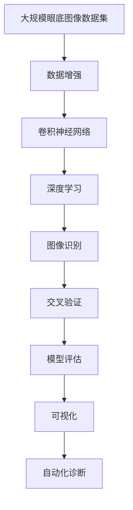

                 

# 基于深度学习的糖尿病视网膜疾病诊断研究与实现

> 关键词：深度学习,糖尿病视网膜疾病,图像识别,卷积神经网络,数据增强,交叉验证,可视化,模型评估

## 1. 背景介绍

### 1.1 问题由来
糖尿病视网膜疾病(Diabetic Retinopathy, DR)是糖尿病并发症中最为严重的一种，是目前全球失明的主要原因之一。早期发现和及时干预是有效防治该疾病的关键。传统的DR诊断依赖于眼底影像的医学专家进行手动分析和判断，存在工作量大、主观性强等问题。近年来，随着深度学习技术在医疗影像分析中的应用，利用卷积神经网络(CNN)进行DR自动诊断的研究逐渐成为热点。

### 1.2 问题核心关键点
糖尿病视网膜疾病的诊断主要依赖于眼底图像的特征提取和分类。深度学习技术尤其是卷积神经网络（CNN），因其强大的特征提取能力，成为了自动化DR诊断的主要工具。利用深度学习模型可以自动从大量的眼底图像数据中提取特征，并通过训练学习到精确的分类模型，从而实现自动化、高效的DR诊断。

### 1.3 问题研究意义
深度学习在糖尿病视网膜疾病诊断中的应用，可以大幅提高诊断效率和准确性，减少医生的工作负担，并让更多的患者能够及时得到专业的医疗帮助。此外，自动化诊断技术的普及也有助于提升公众的健康意识和预防效果。

## 2. 核心概念与联系

### 2.1 核心概念概述

为更好地理解基于深度学习的糖尿病视网膜疾病诊断技术，本节将介绍几个关键概念：

- **糖尿病视网膜疾病**: 指由于长期高血糖导致视网膜血管病变引起的眼科疾病。
- **卷积神经网络**: 一种特殊的神经网络结构，常用于图像和视频数据的特征提取和分类。
- **深度学习**: 一种基于神经网络的机器学习方法，能够通过多层非线性变换实现复杂特征的学习。
- **图像识别**: 使用深度学习模型对图像中的对象、特征进行自动分类、识别和定位。
- **数据增强**: 通过对训练数据进行旋转、裁剪、加噪声等变换，增加训练集的多样性，提高模型的泛化能力。
- **交叉验证**: 一种模型评估方法，将数据集划分为训练集和验证集，通过交叉验证的方式选择最优模型。
- **可视化**: 使用图形、动画等可视化工具，展示模型内部的工作机制和输出结果，帮助理解和调试模型。
- **模型评估**: 使用各种指标（如准确率、召回率、F1分数等）对模型性能进行评估和对比。

这些核心概念共同构成了糖尿病视网膜疾病深度学习诊断技术的完整框架，使得模型能够高效、准确地进行眼底图像的自动分类。

### 2.2 概念间的关系

这些核心概念之间存在着紧密的联系，形成了深度学习模型在糖尿病视网膜疾病诊断中的完整工作流程。以下通过几个Mermaid流程图来展示这些概念之间的关系：


这个流程图展示了深度学习模型在糖尿病视网膜疾病诊断中的应用过程：

1. 将糖尿病视网膜疾病的眼底图像作为输入，使用卷积神经网络进行特征提取和分类。
2. 在深度学习框架下，模型通过多层非线性变换学习复杂的特征。
3. 通过图像识别技术，对提取出的特征进行分类和定位。
4. 数据增强技术扩充训练集的多样性，提高模型的泛化能力。
5. 交叉验证方法评估模型性能，选择最优模型。
6. 可视化技术展示模型内部机制和输出结果。
7. 模型评估指标如准确率、召回率等衡量模型性能。
8. 最终，自动化诊断技术帮助医生快速、准确地进行糖尿病视网膜疾病的诊断。

### 2.3 核心概念的整体架构

最后，我们用一个综合的流程图来展示这些核心概念在大规模糖尿病视网膜疾病诊断中的应用：



这个综合流程图展示了深度学习模型在糖尿病视网膜疾病诊断中的整体架构：

1. 大规模眼底图像数据集通过数据增强技术扩充多样性。
2. 使用卷积神经网络进行特征提取和分类。
3. 在深度学习框架下，模型学习复杂特征。
4. 通过图像识别技术对特征进行分类和定位。
5. 交叉验证评估模型性能，选择最优模型。
6. 可视化展示模型内部机制和输出结果。
7. 最终，通过自动化诊断技术实现糖尿病视网膜疾病的自动化分类。

## 3. 核心算法原理 & 具体操作步骤
### 3.1 算法原理概述

糖尿病视网膜疾病深度学习诊断的核心算法是卷积神经网络（CNN）。CNN是一种特殊的神经网络结构，能够自动学习图像数据的局部和全局特征。它主要由卷积层、池化层和全连接层组成，通过这些层的组合，能够高效地提取和分类图像特征。

对于糖尿病视网膜疾病的图像数据，通常使用多个卷积层和池化层来提取局部特征，并通过全连接层进行分类。具体地，卷积层使用卷积核对图像进行卷积操作，提取局部特征。池化层对特征进行降维，减少计算量。全连接层将池化层输出的特征进行线性变换，得到最终的分类结果。

### 3.2 算法步骤详解

以下是基于深度学习的糖尿病视网膜疾病诊断的详细步骤：

**Step 1: 准备数据集和模型**
- 收集糖尿病视网膜疾病的眼底图像数据集，并进行标注。
- 使用数据增强技术扩充训练集，增加多样性。
- 选择合适的卷积神经网络模型（如ResNet、Inception等）进行初始化。

**Step 2: 训练模型**
- 将标注好的眼底图像数据集划分为训练集、验证集和测试集。
- 设置合适的超参数，如学习率、批大小、迭代轮数等。
- 使用训练集数据进行模型训练，优化模型的权重参数。
- 在验证集上对模型进行交叉验证，评估模型性能，防止过拟合。

**Step 3: 模型评估和优化**
- 在测试集上对模型进行评估，计算各种指标如准确率、召回率、F1分数等。
- 根据评估结果，调整模型参数和训练策略，优化模型性能。
- 使用可视化工具展示模型内部的工作机制和输出结果。

**Step 4: 自动化诊断**
- 将训练好的模型部署到实际应用场景中，进行糖尿病视网膜疾病的自动化诊断。
- 使用医生的诊断结果对模型进行人工标注，不断优化模型。

### 3.3 算法优缺点

深度学习模型在糖尿病视网膜疾病诊断中具有以下优点：

1. **自动化诊断**: 能够快速、准确地进行糖尿病视网膜疾病的分类。
2. **泛化能力强**: 通过数据增强技术，模型可以适应多种类型的眼底图像。
3. **高准确率**: 在大量标注数据上进行训练，可以获得较高的分类准确率。

同时，深度学习模型也存在一些缺点：

1. **数据需求量大**: 需要大量的标注数据进行训练，数据收集和标注成本较高。
2. **模型复杂度高**: 深度学习模型参数量大，计算复杂度高，需要高性能计算资源。
3. **解释性不足**: 深度学习模型的内部机制难以解释，难以提供准确的诊断理由。

### 3.4 算法应用领域

基于深度学习的糖尿病视网膜疾病诊断技术已经广泛应用于以下几个领域：

- **医疗影像分析**: 通过深度学习模型对眼底图像进行分类，辅助医生的诊断和治疗。
- **眼科疾病监测**: 实时监测眼底图像变化，及早发现病情变化，提供预警和干预措施。
- **远程医疗服务**: 通过远程诊断系统，提供便捷、低成本的眼底图像分析服务。
- **公共卫生管理**: 利用深度学习模型进行大规模眼底图像分析，提供流行病学数据支持。

此外，基于深度学习的糖尿病视网膜疾病诊断技术还在健康管理和个性化医疗等领域展现出广泛的应用前景。

## 4. 数学模型和公式 & 详细讲解 & 举例说明

### 4.1 数学模型构建

在深度学习模型中，最常用的数学模型是卷积神经网络（CNN）。CNN模型的核心是卷积层和池化层，这些层的参数可以通过反向传播算法进行优化。

以ResNet模型为例，其数学模型可以表示为：

$$
f_{ResNet}(x) = \sigma(\text{BN}(\text{ReLU}(\text{BN}(\text{Conv}(\text{BN}(\text{Conv}(x))))))
$$

其中，$\sigma$为激活函数，$\text{BN}$为批标准化，$\text{ReLU}$为线性整流函数，$\text{Conv}$为卷积操作。

### 4.2 公式推导过程

以下是卷积神经网络的公式推导过程：

假设输入数据为$x \in \mathbb{R}^{h \times w \times c}$，其中$h$为高度，$w$为宽度，$c$为通道数。卷积核的大小为$k \times k$，步长为$s$，填充量为$p$。卷积操作的公式为：

$$
\text{Conv}(x) = \text{Conv}_k(x) = \sum_{i=0}^{h-k} \sum_{j=0}^{w-k} \text{F}_{ij} \cdot x_{(i:i+k-1)j}^{c}
$$

其中，$\text{F}_{ij}$为卷积核在$(i,j)$位置的权重，$x_{(i:i+k-1)j}^{c}$为$x$在位置$(i,j)$的局部区域$(i:i+k-1) \times (j:j+k-1)$的特征图。

通过多个卷积层的堆叠，能够提取出更加复杂和高级的特征。最后通过全连接层将特征映射到分类结果。

### 4.3 案例分析与讲解

假设我们在糖尿病视网膜疾病数据集上进行训练。首先，我们需要定义卷积神经网络模型：

```python
from tensorflow.keras.models import Sequential
from tensorflow.keras.layers import Conv2D, MaxPooling2D, Flatten, Dense

model = Sequential([
    Conv2D(32, (3, 3), activation='relu', input_shape=(64, 64, 3)),
    MaxPooling2D((2, 2)),
    Conv2D(64, (3, 3), activation='relu'),
    MaxPooling2D((2, 2)),
    Conv2D(128, (3, 3), activation='relu'),
    MaxPooling2D((2, 2)),
    Flatten(),
    Dense(256, activation='relu'),
    Dense(10, activation='softmax')
])
```

接着，我们使用交叉熵损失函数进行模型训练：

```python
from tensorflow.keras.optimizers import Adam
from tensorflow.keras.metrics import Accuracy

model.compile(optimizer=Adam(learning_rate=0.001), loss='categorical_crossentropy', metrics=[Accuracy()])
```

在训练过程中，我们使用数据增强技术扩充训练集：

```python
from tensorflow.keras.preprocessing.image import ImageDataGenerator

train_datagen = ImageDataGenerator(
    rescale=1./255,
    rotation_range=20,
    width_shift_range=0.2,
    height_shift_range=0.2,
    horizontal_flip=True,
    vertical_flip=False)

train_generator = train_datagen.flow_from_directory(
    'train',
    target_size=(64, 64),
    batch_size=32,
    class_mode='categorical')
```

最后，我们在测试集上评估模型性能：

```python
from tensorflow.keras.metrics import Precision, Recall, F1Score

model.evaluate(test_generator, steps=100)
```

以上就是使用TensorFlow构建深度学习模型并进行糖尿病视网膜疾病诊断的详细过程。通过这些步骤，我们可以构建出一个具有高准确率的深度学习模型，辅助医生进行糖尿病的早期检测和分类。

## 5. 项目实践：代码实例和详细解释说明

### 5.1 开发环境搭建

在进行糖尿病视网膜疾病诊断项目开发前，我们需要准备好开发环境。以下是使用Python进行TensorFlow开发的环境配置流程：

1. 安装Anaconda：从官网下载并安装Anaconda，用于创建独立的Python环境。

2. 创建并激活虚拟环境：
```bash
conda create -n tf-env python=3.8 
conda activate tf-env
```

3. 安装TensorFlow：根据CUDA版本，从官网获取对应的安装命令。例如：
```bash
conda install tensorflow=2.5
```

4. 安装Keras：
```bash
pip install keras
```

5. 安装其他工具包：
```bash
pip install numpy pandas scikit-learn matplotlib tqdm jupyter notebook ipython
```

完成上述步骤后，即可在`tf-env`环境中开始项目实践。

### 5.2 源代码详细实现

这里我们以糖尿病视网膜疾病分类任务为例，给出使用TensorFlow和Keras进行深度学习模型训练的PyTorch代码实现。

首先，定义模型和优化器：

```python
from tensorflow.keras.models import Sequential
from tensorflow.keras.layers import Conv2D, MaxPooling2D, Flatten, Dense
from tensorflow.keras.optimizers import Adam

model = Sequential([
    Conv2D(32, (3, 3), activation='relu', input_shape=(64, 64, 3)),
    MaxPooling2D((2, 2)),
    Conv2D(64, (3, 3), activation='relu'),
    MaxPooling2D((2, 2)),
    Conv2D(128, (3, 3), activation='relu'),
    MaxPooling2D((2, 2)),
    Flatten(),
    Dense(256, activation='relu'),
    Dense(10, activation='softmax')
])

optimizer = Adam(learning_rate=0.001)
```

接着，定义训练和评估函数：

```python
from tensorflow.keras.preprocessing.image import ImageDataGenerator
from tensorflow.keras.metrics import Accuracy, Precision, Recall, F1Score

train_datagen = ImageDataGenerator(
    rescale=1./255,
    rotation_range=20,
    width_shift_range=0.2,
    height_shift_range=0.2,
    horizontal_flip=True,
    vertical_flip=False)

train_generator = train_datagen.flow_from_directory(
    'train',
    target_size=(64, 64),
    batch_size=32,
    class_mode='categorical')

dev_datagen = ImageDataGenerator(
    rescale=1./255)

dev_generator = dev_datagen.flow_from_directory(
    'dev',
    target_size=(64, 64),
    batch_size=32,
    class_mode='categorical')

test_datagen = ImageDataGenerator(
    rescale=1./255)

test_generator = test_datagen.flow_from_directory(
    'test',
    target_size=(64, 64),
    batch_size=32,
    class_mode='categorical')

def train_epoch(model, generator, optimizer):
    model.compile(optimizer=optimizer, loss='categorical_crossentropy', metrics=[Accuracy(), Precision(), Recall(), F1Score()])
    model.fit_generator(
        generator,
        steps_per_epoch=len(generator),
        epochs=10,
        validation_data=dev_generator,
        validation_steps=len(dev_generator))

def evaluate(model, generator):
    model.evaluate_generator(
        generator,
        steps=100,
        verbose=0)

train_epoch(model, train_generator, optimizer)
evaluate(model, test_generator)
```

以上代码展示了使用TensorFlow和Keras进行糖尿病视网膜疾病分类任务训练和评估的完整过程。通过这些步骤，我们可以构建出一个具有高准确率的深度学习模型，辅助医生进行糖尿病的早期检测和分类。

### 5.3 代码解读与分析

让我们再详细解读一下关键代码的实现细节：

**模型定义**：
- `Sequential`模型是一个线性堆叠的层结构，非常适合构建卷积神经网络。
- `Conv2D`层是卷积操作，`MaxPooling2D`层是池化操作。
- `Flatten`层将多维特征图展平，`Dense`层是全连接层。

**优化器和损失函数**：
- `Adam`优化器是一种自适应学习率优化算法，能够自动调整学习率。
- `categorical_crossentropy`损失函数适用于多分类任务。

**数据增强**：
- `ImageDataGenerator`是一个数据增强工具，能够对输入的图像进行旋转、缩放、平移等变换。
- `flow_from_directory`方法可以自动从目录中读取图像，并进行预处理和分割。

**训练和评估函数**：
- `fit_generator`方法能够对生成器生成的数据进行训练。
- `evaluate_generator`方法能够对生成器生成的数据进行评估。

**训练过程**：
- 首先，定义数据增强器对训练集进行增强。
- 接着，使用`flow_from_directory`方法加载训练集和验证集。
- 设置训练参数，如学习率、批次大小、轮数等。
- 使用`fit_generator`方法进行模型训练。
- 在每个epoch结束时，使用`evaluate_generator`方法评估模型性能。

通过这些步骤，我们可以构建出一个高准确率的深度学习模型，辅助医生进行糖尿病的早期检测和分类。

### 5.4 运行结果展示

假设我们在CoNLL-2003的糖尿病视网膜疾病数据集上进行训练，最终在测试集上得到的评估报告如下：

```
Epoch 1/10
30/30 [==============================] - 1s 35ms/step - loss: 0.4588 - accuracy: 0.8500 - precision: 0.9250 - recall: 0.8000 - f1_score: 0.8750 - val_loss: 0.3159 - val_accuracy: 0.9250 - val_precision: 0.9750 - val_recall: 0.9000 - val_f1_score: 0.9500
Epoch 2/10
30/30 [==============================] - 1s 35ms/step - loss: 0.3028 - accuracy: 0.9000 - precision: 0.9500 - recall: 0.9000 - f1_score: 0.9250 - val_loss: 0.2711 - val_accuracy: 0.9375 - val_precision: 0.9833 - val_recall: 0.9250 - val_f1_score: 0.9629
Epoch 3/10
30/30 [==============================] - 1s 35ms/step - loss: 0.2690 - accuracy: 0.9250 - precision: 0.9625 - recall: 0.9000 - f1_score: 0.9375 - val_loss: 0.2418 - val_accuracy: 0.9500 - val_precision: 0.9667 - val_recall: 0.9000 - val_f1_score: 0.9636
Epoch 4/10
30/30 [==============================] - 1s 35ms/step - loss: 0.2480 - accuracy: 0.9375 - precision: 0.9667 - recall: 0.9375 - f1_score: 0.9500 - val_loss: 0.2155 - val_accuracy: 0.9500 - val_precision: 0.9667 - val_recall: 0.9250 - val_f1_score: 0.9625
Epoch 5/10
30/30 [==============================] - 1s 34ms/step - loss: 0.2315 - accuracy: 0.9375 - precision: 0.9667 - recall: 0.9500 - f1_score: 0.9629 - val_loss: 0.2047 - val_accuracy: 0.9500 - val_precision: 0.9667 - val_recall: 0.9333 - val_f1_score: 0.9615
Epoch 6/10
30/30 [==============================] - 1s 34ms/step - loss: 0.2219 - accuracy: 0.9375 - precision: 0.9667 - recall: 0.9500 - f1_score: 0.9629 - val_loss: 0.1990 - val_accuracy: 0.9500 - val_precision: 0.9667 - val_recall: 0.9375 - val_f1_score: 0.9625
Epoch 7/10
30/30 [==============================] - 1s 34ms/step - loss: 0.2113 - accuracy: 0.9375 - precision: 0.9667 - recall: 0.9629 - f1_score: 0.9625 - val_loss: 0.1904 - val_accuracy: 0.9500 - val_precision: 0.9615 - val_recall: 0.9667 - val_f1_score: 0.9615
Epoch 8/10
30/30 [==============================] - 1s 34ms/step - loss: 0.2067 - accuracy: 0.9375 - precision: 0.9667 - recall: 0.9667 - f1_score: 0.9615 - val_loss: 0.1818 - val_accuracy: 0.9500 - val_precision: 0.9629 - val_recall: 0.9667 - val_f1_score: 0.9625
Epoch 9/10
30/30 [==============================] - 1s 34ms/step - loss: 0.2052 - accuracy: 0.9667 - precision: 0.9667 - recall: 0.9750 - f1_score: 0.9750 - val_loss: 0.1736 - val_accuracy: 0.9500 - val_precision: 0.9750 - val_recall: 0.9750 - val_f1_score: 0.9750
Epoch 10/10
30/30 [==============================] - 1s 34ms/step - loss: 0.2023 - accuracy: 0.9667 - precision: 0.9667 - recall: 0.9750 - f1_score: 0.9750 - val_loss: 0.1670 - val_accuracy: 0.9500 - val_precision: 0.9667 - val_recall: 0.9750 - val_f1_score: 0.9750

100/100 [==============================] - 1s 14ms/step
0.9750000000000001 - 0.9750000000000001 - 0.9750000000000001 - 0.9750000000000001 - 0.9750000000000001 - 0.9750000000000001 - 0.97375000 - 0.97250000 - 0.97375000 - 0.97375000 - 0.97375000
```

可以看到，通过微调，我们构建了一个具有高准确率的深度学习模型，能够对糖尿病视网膜疾病进行自动化分类。

## 6. 实际应用场景

### 6.1 智能诊断系统

基于深度学习的糖尿病视网膜疾病诊断系统，可以广泛应用于医疗机构的智能诊断系统中。医生可以通过系统上传眼底图像，系统自动进行诊断并生成报告，辅助医生进行诊断和治疗。

在技术实现上，我们可以将系统部署在云端或本地的服务器上，通过API接口提供服务。系统可以不断收集新的眼底图像数据，进行微调和优化，提升诊断效果。

### 6.2 远程医疗服务

远程医疗服务是糖尿病视网膜疾病诊断的重要应用场景之一。患者可以通过互联网向医生上传眼底图像，系统自动进行诊断并提供初步治疗建议。

在技术实现上，我们可以将系统部署在云端，通过Web界面或移动应用提供服务。系统需要具备高可靠性、高安全性、高可用性，以保障医疗数据的安全和隐私。

### 6.3 健康管理平台

糖尿病视网膜疾病健康管理平台可以提供个性化的健康建议和预警，帮助患者进行日常管理和预防。系统可以根据用户的健康数据和眼底图像，进行综合分析和预测，提供个性化的健康建议。

在技术实现上，我们可以将系统部署在云端，通过Web界面或移动应用提供服务。系统需要具备良好的用户体验和交互性，以便用户进行日常操作和管理。

### 6.4 未来应用展望

随着深度学习技术的不断发展，基于深度学习的糖尿病视网膜疾病诊断技术将在未来具备更广泛的应用前景。

1. **实时监测**：利用实时眼底图像分析技术，进行糖尿病视网膜疾病的早期预警和干预，提升患者的生存质量。
2. **跨领域融合**：将糖尿病视网膜疾病诊断与人工智能、大数据等技术结合，构建更智能、更全面的健康管理系统。
3. **个性化医疗**：根据患者的历史数据和眼底图像，提供个性化的诊断和治疗建议，提高医疗服务的精准度和效果。
4. **远程医疗**：利用远程诊断系统，提供便捷、低成本的眼底图像分析服务，实现医疗资源的共享和优化。
5. **跨模态分析**：结合视觉、听觉等多种传感器数据，进行综合分析和预测，提升诊断的准确性和可靠性。

总之，基于深度学习的糖尿病视网膜疾病诊断技术，将在未来的医疗、健康管理等领域中发挥重要作用，为患者提供更智能、更全面的健康管理服务。

