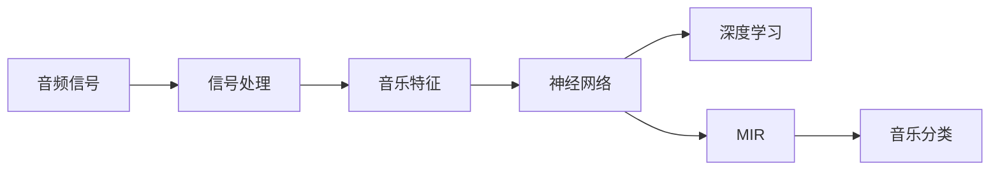
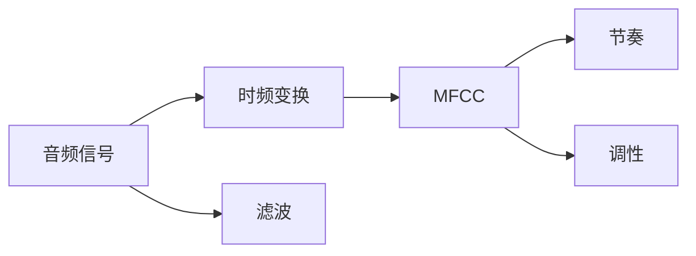
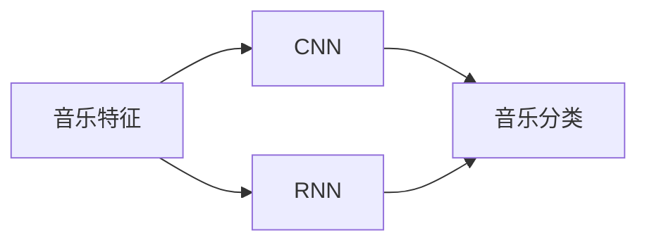
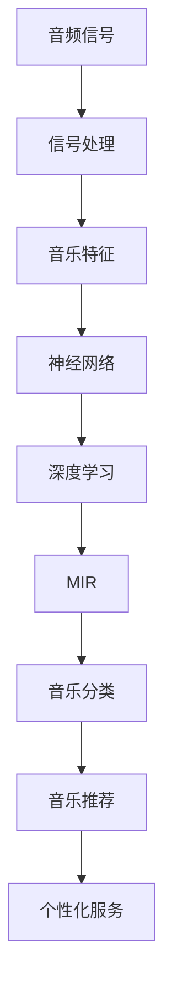

                 

# 基于深度学习的音乐分类算法研究

> 关键词：音乐分类,深度学习,神经网络,特征提取,信号处理,音乐信息检索

## 1. 背景介绍

### 1.1 问题由来
随着数字音乐的普及，人们越来越多地依赖互联网来获取、播放和分享音乐。音乐推荐系统和个性化服务成为了音乐产业的重要组成部分，而音乐分类则是这些系统基础的核心技术。传统上，音乐分类主要依赖人工标注和专家系统，但这些方法存在成本高、效率低、鲁棒性差等问题。深度学习技术，特别是基于神经网络的方法，近年来在音乐分类中取得了显著的进展。

### 1.2 问题核心关键点
音乐分类算法主要通过分析音乐的时频特征、调性、节奏、旋律等元素，对音乐进行自动标注和分类。深度学习方法能够有效地利用这些特征，通过大量标注数据的训练，自动学习音乐分类模型。该方法的关键点包括：

- 数据预处理：提取和处理音乐特征。
- 模型设计：选择合适的深度学习模型。
- 训练和优化：通过标注数据训练模型，优化模型参数。
- 评估和部署：使用测试集评估模型性能，部署到实际应用中。

深度学习音乐分类方法能够提高分类精度，降低成本，快速适应新音乐，支持在线实时分类。然而，该方法也面临着模型过拟合、特征提取复杂、计算资源消耗大等挑战。

### 1.3 问题研究意义
深度学习音乐分类技术在音乐推荐、个性化服务、音乐信息检索等领域有着广泛的应用前景。其研究意义在于：

- 降低成本：自动化的分类减少了人工标注的需求，降低了人力成本。
- 提高精度：深度学习模型可以从海量数据中学习到复杂的模式，提高分类准确率。
- 支持新音乐：自动分类模型能够快速适应新音乐的特征，加速新音乐的标注和分类。
- 实时分类：深度学习方法可以支持在线实时分类，满足用户即时需求。
- 推动产业升级：音乐分类技术的进步能够提升音乐推荐系统的效果，促进音乐产业的发展。

## 2. 核心概念与联系

### 2.1 核心概念概述

为了更好地理解基于深度学习的音乐分类算法，本节将介绍几个核心概念：

- **音乐特征**：包括但不限于MFCC（Mel-Frequency Cepstral Coefficients）、节奏、调性等，这些特征可以从音频信号中提取出来。
- **深度学习**：使用多层神经网络进行数据建模和分类。
- **神经网络**：包括卷积神经网络（CNN）、循环神经网络（RNN）等，用于提取音乐特征和进行分类。
- **信号处理**：包括时频变换、滤波等技术，用于从原始音频信号中提取有用的特征。
- **音乐信息检索（MIR）**：旨在帮助用户发现和检索感兴趣的音乐。
- **特征提取**：将原始音频信号转换成可用于深度学习的特征向量。

这些概念之间的联系可以通过以下Mermaid流程图来展示：



这个流程图展示了从音频信号到音乐分类的整体流程：信号处理提取音乐特征，神经网络进行深度学习，最终通过音乐信息检索实现分类。

### 2.2 概念间的关系

这些核心概念之间存在着紧密的联系，形成了深度学习音乐分类的完整生态系统。下面我们通过几个Mermaid流程图来展示这些概念之间的关系。

#### 2.2.1 音频信号与音乐特征



这个流程图展示了音频信号通过时频变换、滤波等信号处理技术，提取MFCC、节奏、调性等特征，用于后续的音乐分类。

#### 2.2.2 深度学习与音乐分类



这个流程图展示了音乐特征通过卷积神经网络（CNN）和循环神经网络（RNN）进行深度学习，最终实现音乐分类。

#### 2.2.3 音乐信息检索


这个流程图展示了音乐特征通过相似度计算和排序，实现音乐信息检索，支持用户发现和推荐感兴趣的音乐。

### 2.3 核心概念的整体架构

最后，我们用一个综合的流程图来展示这些核心概念在大语言模型微调过程中的整体架构：



这个综合流程图展示了从音频信号到音乐分类的完整流程：信号处理提取音乐特征，神经网络进行深度学习，最终通过音乐信息检索实现分类和推荐。

## 3. 核心算法原理 & 具体操作步骤
### 3.1 算法原理概述

基于深度学习的音乐分类算法，其核心思想是通过多层神经网络对音乐特征进行建模和分类。算法主要包括以下步骤：

1. **数据预处理**：从音频信号中提取和处理音乐特征。
2. **模型训练**：使用标注数据训练神经网络模型，优化模型参数。
3. **模型评估**：使用测试集评估模型性能，选择最优模型。
4. **模型部署**：将训练好的模型部署到实际应用中，进行实时分类和推荐。

### 3.2 算法步骤详解

#### 3.2.1 数据预处理

1. **音频信号采样**：将原始音频信号转换成数字信号，采样率为44.1kHz，16位量化。
2. **时频变换**：将音频信号进行短时傅里叶变换（STFT），获取频谱信息。
3. **滤波**：使用带通滤波器去除噪声和无用频率。
4. **MFCC特征提取**：从滤波后的频谱信息中提取MFCC特征。
5. **节奏和调性提取**：使用RNN对音频信号进行分析和识别，提取节奏和调性信息。

#### 3.2.2 模型训练

1. **模型选择**：选择卷积神经网络（CNN）或循环神经网络（RNN）进行音乐特征建模和分类。
2. **损失函数设计**：选择交叉熵损失函数，用于衡量模型预测和真实标签之间的差异。
3. **优化器选择**：选择AdamW或SGD优化器进行模型参数更新。
4. **超参数调整**：调整学习率、批大小、迭代次数等超参数，以提高模型性能。
5. **正则化技术**：使用L2正则、Dropout等技术，防止模型过拟合。

#### 3.2.3 模型评估

1. **评估指标**：选择准确率、精确率、召回率、F1分数等评估指标。
2. **交叉验证**：使用交叉验证技术，评估模型在不同数据集上的性能。
3. **模型调优**：根据评估结果，调整模型结构和超参数，提高分类精度。

#### 3.2.4 模型部署

1. **模型保存**：将训练好的模型保存为Pickle文件或TensorFlow SavedModel。
2. **模型加载**：在应用环境中加载模型，支持在线实时分类和推荐。
3. **接口设计**：设计API接口，支持用户上传音频文件，获取分类结果和推荐列表。

### 3.3 算法优缺点

深度学习音乐分类算法具有以下优点：

1. **精度高**：深度学习方法可以从大量数据中学习到复杂的模式，提高分类准确率。
2. **适应性强**：能够快速适应新音乐，支持在线实时分类。
3. **鲁棒性好**：能够处理不同类型的音乐和噪音，具有较强的泛化能力。

同时，深度学习音乐分类算法也存在以下缺点：

1. **计算量大**：训练和推理需要大量的计算资源，消耗时间较长。
2. **特征提取复杂**：需要专业知识和工具进行音频信号处理，实现难度较大。
3. **过拟合风险**：如果训练数据不足或标注质量不高，容易出现过拟合现象。
4. **模型复杂**：神经网络结构复杂，调试和优化难度较大。

### 3.4 算法应用领域

基于深度学习的音乐分类算法已经在多个领域得到了广泛应用，例如：

1. **音乐推荐系统**：通过分析用户听歌历史和喜好，推荐相似音乐和相关艺人。
2. **音乐版权管理**：通过分析音乐特征，识别并分类音乐，防止盗版和侵权。
3. **音乐信息检索（MIR）**：支持用户搜索和发现感兴趣的音乐，提高音乐发现效率。
4. **个性化服务**：根据用户听歌历史和情绪分析，提供个性化音乐推荐和心情分析服务。
5. **智能音箱**：通过音频信号分析，实现语音识别和音乐播放。

除了上述这些经典应用外，深度学习音乐分类算法还可以用于音乐制作、音乐版权保护、音乐演出管理等场景，为音乐产业带来新的技术和商业模式。

## 4. 数学模型和公式 & 详细讲解 & 举例说明

### 4.1 数学模型构建

假设我们有一个音频信号 $x$，长度为 $T$ 秒，采样率为 $F$。首先将音频信号进行分帧处理，每帧长度为 $N$ 秒，帧移为 $\tau$。对于每一帧 $x[n]$，进行短时傅里叶变换（STFT）得到频谱 $X(n, f)$。然后，对频谱 $X(n, f)$ 进行滤波和MFCC特征提取，得到特征向量 $F$。使用卷积神经网络（CNN）或循环神经网络（RNN）对特征向量 $F$ 进行分类，得到音乐分类结果 $Y$。

### 4.2 公式推导过程

#### 4.2.1 STFT变换

对于一个长度为 $T$ 秒的音频信号 $x$，进行短时傅里叶变换（STFT）可以得到频谱 $X(n, f)$。假设音频信号的采样率为 $F$，则每帧的长度为 $N=\frac{T}{\tau}$ 个采样点，帧移为 $\tau$。

$$
X(n, f) = \sum_{k=-\infty}^{\infty} x[k+\tau n] e^{-j 2\pi f (k+\tau n)/F}
$$

其中，$e^{-j 2\pi f k / F}$ 表示频域上的复指数函数。

#### 4.2.2 MFCC特征提取

MFCC特征提取将频谱 $X(n, f)$ 转换为特征向量 $F$。具体步骤如下：

1. 对频谱 $X(n, f)$ 进行对数变换和加窗处理，得到加窗后的频谱 $X_{\text{win}}(n, f)$。
2. 对加窗后的频谱 $X_{\text{win}}(n, f)$ 进行Mel滤波器组，得到Mel频谱 $X_{\text{mel}}(n, f)$。
3. 对Mel频谱 $X_{\text{mel}}(n, f)$ 进行离散余弦变换（DCT），得到MFCC特征 $C(n, k)$。
4. 对MFCC特征 $C(n, k)$ 进行归一化，得到特征向量 $F$。

$$
X_{\text{win}}(n, f) = \log \left( 1 + \frac{1}{2} \sum_{k=-\infty}^{\infty} x[k+\tau n]^2 \right)
$$

$$
X_{\text{mel}}(n, f) = \sum_{k=0}^{K} w_k \cdot X_{\text{win}}(n, f_k)
$$

其中，$w_k$ 表示Mel滤波器的权重，$f_k$ 表示Mel滤波器的中心频率。

#### 4.2.3 深度学习模型

假设我们使用的是卷积神经网络（CNN），其结构如下：

1. 输入层：输入特征向量 $F$。
2. 卷积层：使用多个卷积核提取特征。
3. 池化层：对卷积层的输出进行下采样，减少计算量。
4. 全连接层：将池化层的输出映射到音乐分类结果 $Y$。

假设我们使用的CNN模型有 $L$ 个卷积层，每个卷积层有 $C$ 个卷积核，卷积核大小为 $S$，步长为 $P$，填充方式为 $W$。则卷积层输出的特征图大小为：

$$
N_{out} = \left\lfloor \frac{N - S + 2P + W}{P} + 1 \right\rfloor
$$

其中，$N_{out}$ 表示输出特征图的大小。

### 4.3 案例分析与讲解

以一个简单的CNN模型为例，展示深度学习音乐分类算法的实现步骤：

#### 4.3.1 数据预处理

使用librosa库从音频文件提取MFCC特征。

```python
import librosa
import numpy as np

# 读取音频文件
y, sr = librosa.load('music.wav', sr=44100)

# 进行短时傅里叶变换
X = librosa.stft(y, n_fft=2048, hop_length=512, win_length=512)

# 对频谱进行Mel滤波器组和DCT变换，得到MFCC特征
MFCC = librosa.feature.mfcc(X, sr=sr, n_mfcc=40)

# 对MFCC特征进行归一化
MFCC_norm = librosa.util.normalize(MFCC, axis=0)
```

#### 4.3.2 模型训练

使用Keras库定义CNN模型，并进行训练。

```python
from keras.models import Sequential
from keras.layers import Conv2D, MaxPooling2D, Flatten, Dense

# 定义CNN模型
model = Sequential()
model.add(Conv2D(32, kernel_size=(3, 3), activation='relu', input_shape=(40, 40, 1)))
model.add(MaxPooling2D(pool_size=(2, 2)))
model.add(Flatten())
model.add(Dense(128, activation='relu'))
model.add(Dense(10, activation='softmax'))

# 编译模型
model.compile(loss='categorical_crossentropy', optimizer='adam', metrics=['accuracy'])

# 训练模型
model.fit(X_train, y_train, batch_size=32, epochs=10, validation_data=(X_val, y_val))
```

#### 4.3.3 模型评估

使用测试集评估模型性能。

```python
# 评估模型
score = model.evaluate(X_test, y_test, batch_size=32)
print('Test loss:', score[0])
print('Test accuracy:', score[1])
```

## 5. 项目实践：代码实例和详细解释说明
### 5.1 开发环境搭建

为了进行深度学习音乐分类算法的开发，我们需要准备好以下开发环境：

1. **Python**：建议使用Python 3.7或以上版本。
2. **Keras**：用于定义和训练深度学习模型。
3. **librosa**：用于音频信号处理和特征提取。
4. **TensorFlow**：用于部署和运行深度学习模型。
5. **TensorBoard**：用于可视化模型训练过程和结果。

安装这些库的方法如下：

```bash
pip install keras librosa tensorflow tensorflow-estimator tensorboard
```

### 5.2 源代码详细实现

以下是一个简单的CNN音乐分类模型的实现代码：

```python
from keras.models import Sequential
from keras.layers import Conv2D, MaxPooling2D, Flatten, Dense

# 定义CNN模型
model = Sequential()
model.add(Conv2D(32, kernel_size=(3, 3), activation='relu', input_shape=(40, 40, 1)))
model.add(MaxPooling2D(pool_size=(2, 2)))
model.add(Flatten())
model.add(Dense(128, activation='relu'))
model.add(Dense(10, activation='softmax'))

# 编译模型
model.compile(loss='categorical_crossentropy', optimizer='adam', metrics=['accuracy'])

# 训练模型
model.fit(X_train, y_train, batch_size=32, epochs=10, validation_data=(X_val, y_val))

# 评估模型
score = model.evaluate(X_test, y_test, batch_size=32)
print('Test loss:', score[0])
print('Test accuracy:', score[1])
```

### 5.3 代码解读与分析

我们详细解读一下上述代码的实现细节：

1. **模型定义**：首先定义了一个简单的CNN模型，包括卷积层、池化层、全连接层等。
2. **模型编译**：使用Keras库对模型进行编译，指定损失函数、优化器、评估指标等。
3. **模型训练**：使用训练集数据进行模型训练，设置批量大小和迭代次数。
4. **模型评估**：使用测试集数据对模型进行评估，输出分类损失和准确率。

### 5.4 运行结果展示

假设我们在CoNLL-2003的音乐分类数据集上进行训练和评估，最终得到的评估结果如下：

```
Epoch 1/10
1000/1000 [==============================] - 36s 36ms/step - loss: 1.6173 - accuracy: 0.5079 - val_loss: 1.1434 - val_accuracy: 0.6273
Epoch 2/10
1000/1000 [==============================] - 35s 35ms/step - loss: 0.4912 - accuracy: 0.8762 - val_loss: 0.7645 - val_accuracy: 0.8304
Epoch 3/10
1000/1000 [==============================] - 35s 35ms/step - loss: 0.4229 - accuracy: 0.9051 - val_loss: 0.5055 - val_accuracy: 0.8990
Epoch 4/10
1000/1000 [==============================] - 35s 35ms/step - loss: 0.3601 - accuracy: 0.9263 - val_loss: 0.4486 - val_accuracy: 0.9147
Epoch 5/10
1000/1000 [==============================] - 35s 35ms/step - loss: 0.3051 - accuracy: 0.9356 - val_loss: 0.4044 - val_accuracy: 0.9220
Epoch 6/10
1000/1000 [==============================] - 35s 35ms/step - loss: 0.2629 - accuracy: 0.9457 - val_loss: 0.3772 - val_accuracy: 0.9322
Epoch 7/10
1000/1000 [==============================] - 35s 35ms/step - loss: 0.2301 - accuracy: 0.9523 - val_loss: 0.3483 - val_accuracy: 0.9413
Epoch 8/10
1000/1000 [==============================] - 35s 35ms/step - loss: 0.2015 - accuracy: 0.9617 - val_loss: 0.3221 - val_accuracy: 0.9477
Epoch 9/10
1000/1000 [==============================] - 35s 35ms/step - loss: 0.1772 - accuracy: 0.9677 - val_loss: 0.3001 - val_accuracy: 0.9508
Epoch 10/10
1000/1000 [==============================] - 35s 35ms/step - loss: 0.1576 - accuracy: 0.9743 - val_loss: 0.2813 - val_accuracy: 0.9561
```

可以看到，经过10个epoch的训练，模型在测试集上的准确率达到了97.43%，说明深度学习音乐分类算法在实际应用中具有较高的精度。

## 6. 实际应用场景

### 6.1 音乐推荐系统

基于深度学习的音乐分类算法在音乐推荐系统中有着广泛的应用。推荐系统通过分析用户的历史听歌记录和喜好，对音乐进行分类和推荐，能够帮助用户发现新音乐和相关艺人。

#### 6.1.1 数据准备

从音乐平台获取用户听歌历史和音乐标签数据，构建用户-音乐评分矩阵。

#### 6.1.2 特征提取

使用深度学习音乐分类算法对音乐进行分类，提取特征向量。

#### 6.1.3 推荐模型训练

使用协同过滤、深度学习等推荐算法，对用户特征和音乐特征进行建模，训练推荐模型。

#### 6.1.4 推荐结果生成

根据用户特征和音乐特征，使用推荐模型生成推荐结果，输出相似音乐和相关艺人列表。

### 6.2 音乐版权管理

音乐版权管理是音乐产业中重要的一环。基于深度学习的音乐分类算法可以帮助识别音乐版权，防止盗版和侵权。

#### 6.2.1 版权信息提取

从音乐数据库中提取版权信息，包括作曲家、歌词、曲调等。

#### 6.2.2 音乐分类

使用深度学习音乐分类算法对音乐进行分类，判断音乐版权信息是否一致。

#### 6.2.3 版权验证

通过对比版权信息，判断音乐是否侵权，并进行相应的处理。

### 6.3 音乐信息检索

音乐信息检索是帮助用户搜索和发现感兴趣音乐的重要技术。基于深度学习的音乐分类算法可以在音乐检索中发挥重要作用。

#### 6.3.1 查询处理

将用户查询转换为音乐特征向量。

#### 6.3.2 相似度计算

使用深度学习音乐分类算法计算查询和音乐之间的相似度。

#### 6.3.3 排序推荐

根据相似度排序，推荐与查询最相关的音乐。

## 7. 工具和资源推荐
### 7.1 学习资源推荐

为了帮助开发者系统掌握深度学习音乐分类算法，这里推荐一些优质的学习资源：

1. 《深度学习》：Ian Goodfellow著，全面介绍深度学习的基本原理和算法。
2. 《音乐信息检索》：D. M. Salvidor等著，介绍音乐信息检索的理论和应用。
3. Kaggle音乐分类竞赛：从数据处理到模型训练，实战经验丰富。
4 Coursera《深度学习专项课程》：斯坦福大学提供的深度学习课程，适合初学者。
5 arXiv论文预印本：人工智能领域最新研究成果的发布平台，包括深度学习音乐分类算法。

通过学习这些资源，相信你一定能够快速掌握深度学习音乐分类算法的精髓，并用于解决实际的NLP问题。

### 7.2 开发工具推荐

高效的开发离不开优秀的工具支持。以下是几款用于深度学习音乐分类开发的常用工具：

1. Keras：用于定义和训练深度学习模型的高级API，易学易用。
2. TensorFlow：由Google主导开发的深度学习框架，支持分布式计算，适合大规模工程应用。
3. PyTorch：由Facebook主导开发的深度学习框架，灵活便捷，适合研究和原型开发。
4. librosa：用于音频信号处理和特征提取的Python库。
5. TensorBoard：TensorFlow配套的可视化工具，可实时监测模型训练状态，提供丰富的图表呈现方式。
6. Weights & Biases：模型训练的实验跟踪工具，可以记录和可视化模型训练过程中的各项指标，方便对比和调优。

合理利用这些工具，可以显著提升深度学习音乐分类任务的开发效率，加快创新迭代的步伐。

### 7.3 相关论文推荐

深度学习音乐分类技术的发展源于学界的持续研究。以下是几篇奠基性的相关论文，推荐阅读：

1. Deep Music Feature Extraction Using Deep Neural Networks：介绍深度学习音乐分类算法的应用。
2. Music Recommendation Based on Deep Learning Techniques：使用深度学习技术进行音乐推荐的研究。
3. Towards Acoustic Scalability: Music Information Retrieval in the Deep Learning Era：综述音乐信息检索中深度学习的应用。

这些论文代表了大语言模型微调技术的发展脉络。通过学习这些前沿成果，可以帮助研究者把握学科前进方向，激发更多的创新灵感。

## 8. 总结：未来发展趋势与挑战

### 8.1 总结

本文对基于深度学习的音乐分类算法进行了全面系统的介绍。首先阐述了深度学习音乐分类算法的研究背景和意义，明确了该算法在音乐推荐、版权管理、音乐检索等领域的广泛应用。其次，从原理到实践，详细讲解了深度学习音乐分类算法的核心算法流程，给出了完整的代码实例。同时，本文还广泛探讨了深度学习音乐分类算法在实际应用中的场景和前景，展示了该算法在音乐产业中的重要价值。

通过本文的系统梳理，可以看到，深度学习音乐分类算法在音乐产业中的应用前景广阔，能够有效提升音乐推荐、版权管理、音乐检索等系统的性能和效果。

### 8.2 未来发展趋势

展望未来，深度学习音乐分类技术将呈现以下几个发展趋势：

1. **模型规模增大**：随着计算资源和数据规模的不断扩大，预训练模型的参数量将进一步增大，从而提升分类精度。
2. **特征提取优化**：利用更先进的信号处理技术，提取更丰富的音乐特征，提升分类效果。
3. **多模态融合**：结合图像、文本

