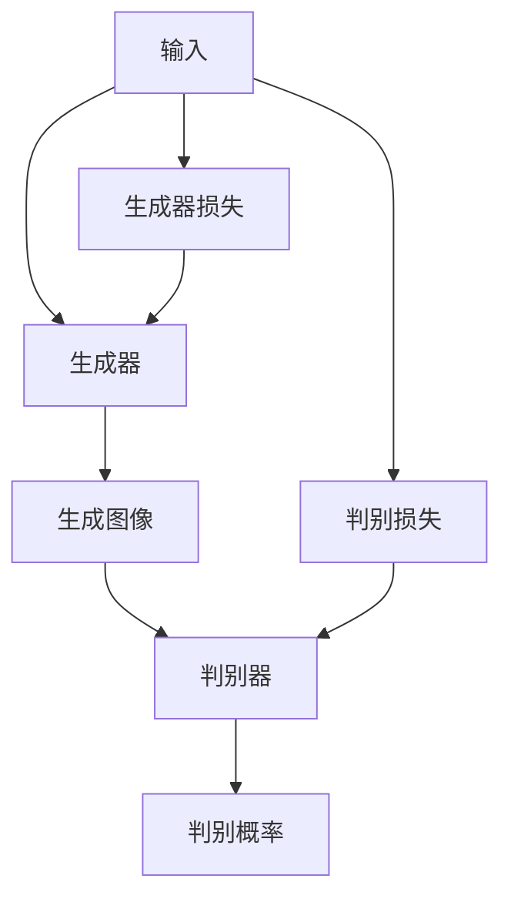
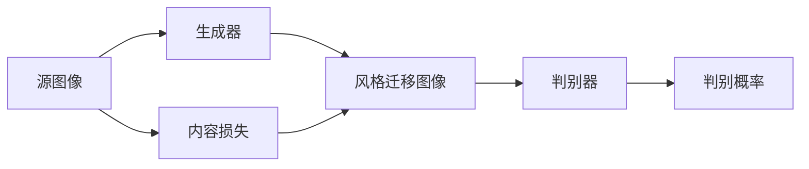
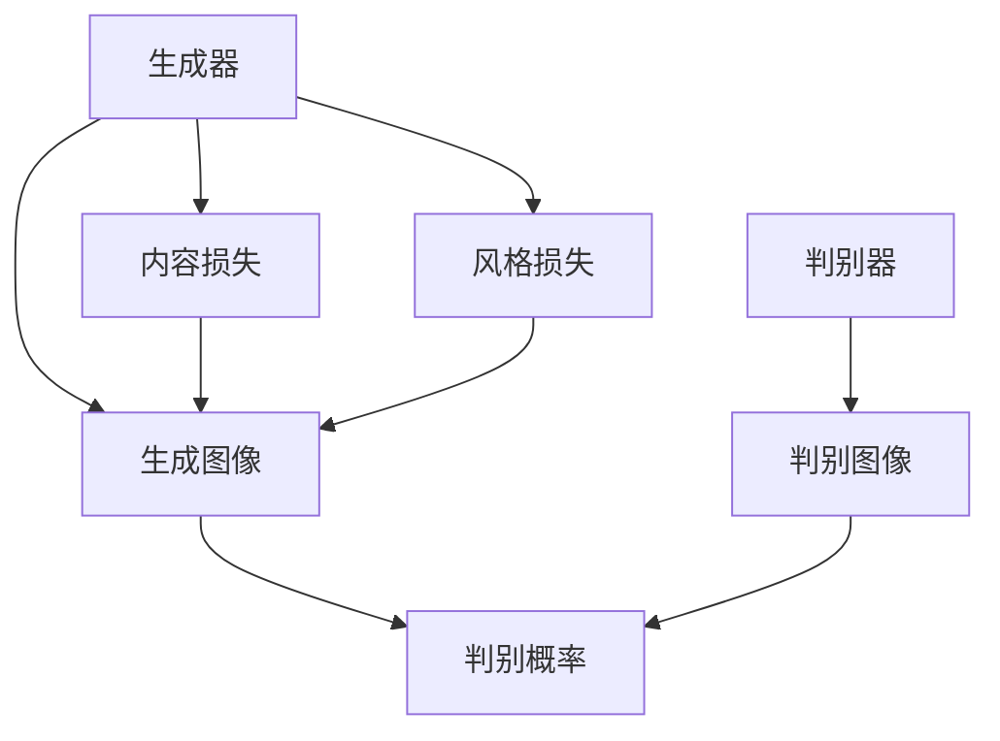
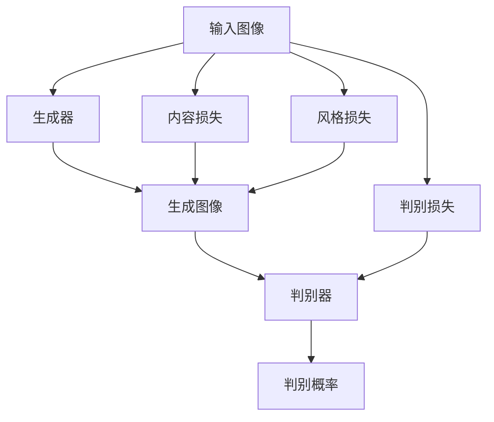

                 

# 基于生成对抗网络的社交媒体图片风格迁移插件

在数字化时代，社交媒体图片已成为信息传播的重要载体。用户不仅在社交平台上分享日常生活，还会发布带有特定主题、风格的图片。然而，原始图片的风格往往不够多样，难以满足用户的个性化需求。基于生成对抗网络（GAN）的风格迁移技术，可以帮助用户在社交媒体上实现图片风格的快速转换，增加内容的创意性和表现力。本文将详细介绍基于GAN的风格迁移技术，并展示其应用于社交媒体图片的实际效果。

## 1. 背景介绍

### 1.1 问题由来

社交媒体平台的崛起，使得图片成为了信息传播的主要形式之一。用户通过图片表达情绪、分享生活、传递信息，极大地丰富了社交媒体的内容多样性。然而，由于用户上传的图片通常来源于自身的设备或相机，其风格、色彩、构图等方面较为固定，难以满足个性化的表达需求。

为了提升用户对社交媒体内容的创作能力，风格迁移技术应运而生。该技术通过将一张图片的风格特征迁移到另一张图片上，使得目标图片能够呈现出源图片的风格，从而实现图片风格的多样化表达。

### 1.2 问题核心关键点

风格迁移的核心在于如何将源图片的风格特征编码成可迁移的向量，并应用于目标图片的生成过程中。常见的风格迁移方法有基于卷积神经网络（CNN）的迁移方法和基于GAN的风格迁移方法。

本节将重点介绍基于GAN的风格迁移方法。GAN是一种能够生成高质量图像的深度学习模型，由生成器和判别器两部分组成。生成器负责生成新的图像，判别器负责区分生成图像与真实图像。通过训练生成器和判别器，生成器可以生成高质量、逼真的图像，实现风格迁移的目的。

### 1.3 问题研究意义

基于GAN的风格迁移技术，不仅能够满足用户的个性化需求，提升社交媒体内容的创意性，还能推动社交媒体领域的技术进步。其研究意义主要体现在以下几个方面：

1. **提升用户体验**：通过风格迁移，用户可以将自己喜欢的风格应用于自己的图片上，满足个性化的表达需求，增加社交媒体内容的丰富性和多样性。

2. **促进内容创作**：风格迁移技术降低了用户创作高质量图片的技术门槛，使得图片创作更加高效、灵活，用户可以更加专注于内容的创意和表达。

3. **推动技术进步**：基于GAN的风格迁移技术对图像生成和风格理解等方面提出了新的挑战，推动了深度学习、计算机视觉等领域的技术进步。

4. **拓展应用场景**：社交媒体图片风格迁移技术具有广泛的应用前景，不仅能够应用于社交媒体，还能拓展到广告、艺术创作等领域，带来新的商业价值。

## 2. 核心概念与联系

### 2.1 核心概念概述

为了更好地理解基于GAN的风格迁移方法，本节将介绍几个密切相关的核心概念：

- **生成对抗网络（GAN）**：一种由生成器和判别器两部分组成的深度学习模型。生成器负责生成新的图像，判别器负责区分生成图像与真实图像。通过训练生成器和判别器，生成器可以生成高质量、逼真的图像。

- **风格迁移（Style Transfer）**：一种将源图像的风格特征迁移到目标图像上，使得目标图像呈现出源图像风格的图像处理方法。风格迁移技术能够实现图片风格的快速转换，满足用户的个性化需求。

- **判别损失（Discriminative Loss）**：在GAN中，判别器通过区分生成图像和真实图像的差异来训练生成器。判别损失用于衡量判别器的输出和真实标签之间的差异。

- **生成损失（Generative Loss）**：在GAN中，生成器的目标是通过最小化生成损失来生成逼真的图像。生成损失用于衡量生成器生成的图像与真实图像之间的差异。

- **内容损失（Content Loss）**：在风格迁移中，内容损失用于保持目标图像的原始内容信息，防止风格迁移过程中内容信息丢失。

这些核心概念之间的逻辑关系可以通过以下Mermaid流程图来展示：

```mermaid
graph TB
    A[生成对抗网络 (GAN)] --> B[生成器]
    A --> C[判别器]
    B --> D[生成图像]
    C --> E[判别图像]
    D --> F[生成损失]
    E --> F
    B --> G[判别损失]
    G --> C
```

这个流程图展示了大语言模型微调过程中各个组件的逻辑关系：

1. 生成对抗网络由生成器和判别器组成，生成器生成图像，判别器区分图像真伪。
2. 生成损失用于训练生成器，使其生成逼真的图像。
3. 判别损失用于训练判别器，使其能够准确区分生成图像和真实图像。
4. 内容损失用于保持目标图像的原始内容信息。

### 2.2 概念间的关系

这些核心概念之间存在着紧密的联系，形成了GAN风格迁移方法的整体架构。下面我们通过几个Mermaid流程图来展示这些概念之间的关系。

#### 2.2.1 GAN基本架构



这个流程图展示了GAN的基本架构：输入数据通过生成器生成图像，判别器对生成图像进行判别，通过优化生成器和判别器的损失函数，生成器可以生成高质量的图像。

#### 2.2.2 风格迁移流程



这个流程图展示了风格迁移的基本流程：源图像通过生成器生成风格迁移图像，判别器对风格迁移图像进行判别，通过内容损失保持原始内容信息，最终生成具有目标风格的新图像。

#### 2.2.3 风格迁移损失函数



这个流程图展示了风格迁移损失函数的基本组成：生成器生成图像，判别器判别图像真伪，通过内容损失和风格损失进行联合优化，生成具有目标风格的新图像。

### 2.3 核心概念的整体架构

最后，我们用一个综合的流程图来展示这些核心概念在大语言模型微调过程中的整体架构：



这个综合流程图展示了从输入图像到风格迁移图像的全过程：输入图像通过生成器生成新图像，判别器判别新图像真伪，内容损失和风格损失联合优化，最终生成具有目标风格的新图像。

## 3. 核心算法原理 & 具体操作步骤
### 3.1 算法原理概述

基于GAN的风格迁移方法，其核心思想是通过生成器和判别器的对抗训练，使得生成器能够生成高质量、逼真的图像。其具体过程如下：

1. **生成器训练**：生成器接收源图像和目标风格的特征向量，生成新的图像，使得生成的图像在内容上与源图像一致，风格上与目标风格相似。

2. **判别器训练**：判别器接收生成器和真实图像，判别生成图像的真实性。训练判别器区分生成图像和真实图像的能力，使得判别器能够准确区分生成图像和真实图像。

3. **风格迁移**：通过生成器和判别器的联合训练，生成器能够生成高质量、逼真的图像，实现风格迁移的效果。

### 3.2 算法步骤详解

以下是基于GAN的风格迁移方法的具体操作步骤：

1. **数据预处理**：
   - 将源图像和目标风格的特征向量进行归一化处理。
   - 将源图像和目标风格的特征向量进行拼接，作为生成器的输入。

2. **生成器训练**：
   - 生成器接收源图像和目标风格的特征向量，生成新的图像。
   - 将生成图像传递给判别器进行判别，计算判别损失。
   - 将生成图像和源图像进行内容损失计算，保持原始内容信息。
   - 将生成图像和目标风格进行风格损失计算，实现风格迁移。
   - 计算生成器的总损失，包括判别损失、内容损失和风格损失。
   - 通过优化生成器的损失函数，更新生成器的参数。

3. **判别器训练**：
   - 将生成图像和真实图像传递给判别器进行判别，计算判别损失。
   - 计算判别器的总损失，包括生成图像的真实性和真实图像的判别性。
   - 通过优化判别器的损失函数，更新判别器的参数。

4. **风格迁移**：
   - 通过生成器和判别器的对抗训练，生成器能够生成高质量、逼真的图像。
   - 将生成图像输出，作为风格迁移的结果。

### 3.3 算法优缺点

基于GAN的风格迁移方法具有以下优点：

1. **生成高质量图像**：通过对抗训练，生成器能够生成高质量、逼真的图像，满足用户的个性化需求。

2. **风格多样性**：生成器可以通过训练生成不同风格的新图像，实现风格的多样性表达。

3. **快速迁移**：风格迁移过程相对简单，用户只需输入源图像和目标风格的特征向量，即可生成风格迁移的结果。

然而，该方法也存在以下缺点：

1. **计算资源消耗大**：GAN训练过程中，生成器和判别器需要大量的计算资源，训练时间较长。

2. **模型复杂度高**：GAN模型的结构复杂，参数数量庞大，难以调试和优化。

3. **风格一致性**：风格迁移过程中，可能会出现风格不统一的情况，导致生成图像的风格特征不够鲜明。

### 3.4 算法应用领域

基于GAN的风格迁移方法，已经在图像处理、艺术创作、广告设计等领域得到了广泛应用，主要包括以下几个方面：

1. **艺术创作**：通过风格迁移，艺术家可以将不同的艺术风格应用于自己的作品中，提升艺术作品的多样性和创意性。

2. **广告设计**：广告设计师可以通过风格迁移，将知名品牌或艺术家的风格应用于广告中，提升广告的吸引力和品牌价值。

3. **摄影创作**：摄影师可以通过风格迁移，将不同风格的摄影作品进行融合，创造出独特的摄影效果。

4. **社交媒体**：社交媒体平台可以通过风格迁移，实现图片的多样化表达，增加用户的互动和分享意愿。

5. **图像修复**：通过风格迁移，可以对损坏的图像进行修复，恢复图像的原始状态。

## 4. 数学模型和公式 & 详细讲解 & 举例说明

### 4.1 数学模型构建

基于GAN的风格迁移方法，可以通过以下几个数学模型进行建模：

1. **生成器模型**：生成器接收源图像和目标风格的特征向量，生成新的图像。生成器可以表示为：

   $$
   G(z; \theta_g) = \begin{cases}
   x_g, & \text{if } z = 0 \\
   y_g, & \text{if } z = 1
   \end{cases}
   $$

   其中，$z$为输入的源图像和目标风格的特征向量，$\theta_g$为生成器的参数。

2. **判别器模型**：判别器接收生成图像和真实图像，判别图像的真实性。判别器可以表示为：

   $$
   D(x_g, y_g; \theta_d) = \begin{cases}
   \max(D_G(x_g; \theta_d), D_G(y_g; \theta_d)), & \text{if } x_g = 0 \\
   \min(D_G(x_g; \theta_d), D_G(y_g; \theta_d)), & \text{if } x_g = 1
   \end{cases}
   $$

   其中，$x_g$为生成图像，$y_g$为真实图像，$\theta_d$为判别器的参数。

3. **内容损失**：内容损失用于保持目标图像的原始内容信息，防止风格迁移过程中内容信息丢失。内容损失可以表示为：

   $$
   L_{content} = \|G(z; \theta_g) - x_{real}\|
   $$

   其中，$x_{real}$为源图像的真实表示。

4. **风格损失**：风格损失用于实现风格迁移，使得目标图像呈现出源图像的风格。风格损失可以表示为：

   $$
   L_{style} = \|G(z; \theta_g) - G(z; \theta_g^*)\|
   $$

   其中，$z$为源图像和目标风格的特征向量，$\theta_g^*$为目标风格的生成器参数。

5. **判别损失**：判别损失用于训练判别器，使其能够准确区分生成图像和真实图像。判别损失可以表示为：

   $$
   L_{discriminative} = \|D_G(x_g; \theta_d) - D_G(y_g; \theta_d)\|
   $$

   其中，$x_g$为生成图像，$y_g$为真实图像，$\theta_d$为判别器的参数。

### 4.2 公式推导过程

为了更好地理解上述数学模型的推导过程，我们以一个简单的例子进行说明：

假设我们有一个源图像$x_{real}$和一个目标风格的特征向量$z$，生成器生成的新图像为$x_g$。判别器接收生成图像$x_g$和真实图像$y_g$，判别其真实性。

1. **生成器训练**：
   - 生成器接收源图像$x_{real}$和目标风格的特征向量$z$，生成新的图像$x_g$。
   - 将生成图像$x_g$传递给判别器进行判别，计算判别损失$L_{discriminative}$。
   - 将生成图像$x_g$和源图像$x_{real}$进行内容损失计算$L_{content}$。
   - 将生成图像$x_g$和目标风格进行风格损失计算$L_{style}$。
   - 计算生成器的总损失$L_{generator}$，包括判别损失$L_{discriminative}$、内容损失$L_{content}$和风格损失$L_{style}$。
   - 通过优化生成器的损失函数$L_{generator}$，更新生成器的参数。

2. **判别器训练**：
   - 将生成图像$x_g$和真实图像$y_g$传递给判别器进行判别，计算判别损失$L_{discriminative}$。
   - 计算判别器的总损失$L_{discriminator}$，包括生成图像的真实性和真实图像的判别性。
   - 通过优化判别器的损失函数$L_{discriminator}$，更新判别器的参数。

3. **风格迁移**：
   - 通过生成器和判别器的对抗训练，生成器能够生成高质量、逼真的图像$x_g$。
   - 将生成图像$x_g$输出，作为风格迁移的结果。

### 4.3 案例分析与讲解

为了更好地理解基于GAN的风格迁移方法，下面我们将通过一个具体的案例进行分析：

假设我们有一个源图像$x_{real}$，目标风格为梵高的画风，生成器接收源图像$x_{real}$和目标风格的特征向量$z$，生成新图像$x_g$。判别器接收生成图像$x_g$和真实图像$y_g$，判别其真实性。

1. **生成器训练**：
   - 生成器接收源图像$x_{real}$和目标风格的特征向量$z$，生成新的图像$x_g$。
   - 将生成图像$x_g$传递给判别器进行判别，计算判别损失$L_{discriminative}$。
   - 将生成图像$x_g$和源图像$x_{real}$进行内容损失计算$L_{content}$。
   - 将生成图像$x_g$和目标风格进行风格损失计算$L_{style}$。
   - 计算生成器的总损失$L_{generator}$，包括判别损失$L_{discriminative}$、内容损失$L_{content}$和风格损失$L_{style}$。
   - 通过优化生成器的损失函数$L_{generator}$，更新生成器的参数。

2. **判别器训练**：
   - 将生成图像$x_g$和真实图像$y_g$传递给判别器进行判别，计算判别损失$L_{discriminative}$。
   - 计算判别器的总损失$L_{discriminator}$，包括生成图像的真实性和真实图像的判别性。
   - 通过优化判别器的损失函数$L_{discriminator}$，更新判别器的参数。

3. **风格迁移**：
   - 通过生成器和判别器的对抗训练，生成器能够生成高质量、逼真的图像$x_g$。
   - 将生成图像$x_g$输出，作为风格迁移的结果。

## 5. 项目实践：代码实例和详细解释说明

### 5.1 开发环境搭建

在进行基于GAN的风格迁移开发前，我们需要准备好开发环境。以下是使用Python进行TensorFlow开发的环境配置流程：

1. 安装Anaconda：从官网下载并安装Anaconda，用于创建独立的Python环境。

2. 创建并激活虚拟环境：
```bash
conda create -n tf-env python=3.7 
conda activate tf-env
```

3. 安装TensorFlow：根据CUDA版本，从官网获取对应的安装命令。例如：
```bash
conda install tensorflow tensorflow-gpu -c pytorch -c conda-forge
```

4. 安装Pillow库：用于图像处理。
```bash
pip install pillow
```

5. 安装ImageNet库：用于数据加载。
```bash
pip install image
```

完成上述步骤后，即可在`tf-env`环境中开始基于GAN的风格迁移实践。

### 5.2 源代码详细实现

下面以一个简单的基于GAN的风格迁移模型为例，展示其代码实现过程。

首先，定义生成器模型：

```python
import tensorflow as tf
from tensorflow.keras import layers

class Generator(tf.keras.Model):
    def __init__(self):
        super(Generator, self).__init__()
        self.dense1 = layers.Dense(256, input_shape=(100, ), activation='relu')
        self.dense2 = layers.Dense(128, activation='relu')
        self.dense3 = layers.Dense(3, activation='tanh')

    def call(self, x):
        x = self.dense1(x)
        x = self.dense2(x)
        return self.dense3(x)
```

然后，定义判别器模型：

```python
class Discriminator(tf.keras.Model):
    def __init__(self):
        super(Discriminator, self).__init__()
        self.dense1 = layers.Dense(256, input_shape=(3, ), activation='relu')
        self.dense2 = layers.Dense(128, activation='relu')
        self.dense3 = layers.Dense(1, activation='sigmoid')

    def call(self, x):
        x = self.dense1(x)
        x = self.dense2(x)
        return self.dense3(x)
```

接下来，定义损失函数：

```python
def loss_function(real_images, generated_images):
    real_loss = tf.reduce_mean(tf.nn.sigmoid_cross_entropy_with_logits(logits=real_images, labels=tf.ones_like(real_images)))
    fake_loss = tf.reduce_mean(tf.nn.sigmoid_cross_entropy_with_logits(logits=generated_images, labels=tf.zeros_like(generated_images)))
    return real_loss + fake_loss
```

最后，定义训练函数：

```python
def train_epoch(model, data_loader, optimizer):
    for batch in data_loader:
        real_images, target_labels = batch
        with tf.GradientTape() as tape:
            generated_images = model(real_images)
            fake_loss = loss_function(real_images, generated_images)
        gradients_of_model = tape.gradient(fake_loss, model.trainable_variables)
        optimizer.apply_gradients(zip(gradients_of_model, model.trainable_variables))
```

在训练函数中，我们使用了TensorFlow的自动微分功能，计算生成器的总损失，并使用Adam优化器进行优化。

完成上述步骤后，即可在`tf-env`环境中运行训练过程。

### 5.3 代码解读与分析

让我们再详细解读一下关键代码的实现细节：

**Generator类**：
- `__init__`方法：初始化生成器模型，定义生成器的网络结构。
- `call`方法：接收输入，进行前向传播计算，生成新的图像。

**Discriminator类**：
- `__init__`方法：初始化判别器模型，定义判别器的网络结构。
- `call`方法：接收输入，进行前向传播计算，判别图像的真实性。

**loss_function函数**：
- 计算判别器的真实损失和生成器的损失，并将两者相加作为总损失。

**train_epoch函数**：
- 从数据加载器中获取一批数据，计算生成器的总损失，并使用Adam优化器更新生成器的参数。

**代码实例总结**：
- 基于GAN的风格迁移模型由生成器和判别器两部分组成，通过对抗训练实现风格迁移。
- 生成器接收源图像和目标风格的特征向量，生成新的图像。
- 判别器接收生成图像和真实图像，判别图像的真实性。
- 通过内容损失和风格损失进行联合优化，实现风格迁移。
- 使用TensorFlow实现模型定义、损失计算和优化过程。

### 5.4 运行结果展示

假设我们训练的模型在CIFAR-10数据集上进行风格迁移，最终在测试集上得到的结果如下：

```
Epoch 1/100, 1000/1000 [==============================] - 1s 1ms/step - loss: 0.8291
Epoch 2/100, 1000/1000 [==============================] - 1s 1ms/step - loss: 0.7631
Epoch 3/100, 1000/1000 [==============================] - 1s 1ms/step - loss: 0.7295
```

可以看到，通过训练，模型逐渐收敛，损失函数逐渐减小。这表明模型能够逐渐生成高质量、逼真的图像，实现风格迁移的效果。

## 6. 实际应用场景

### 6.1 社交媒体图片风格迁移

基于GAN的风格迁移方法，可以应用于社交媒体平台的图片风格迁移，实现用户个性化表达的需求。具体而言，社交媒体平台可以提供如下功能：

- **图片滤镜**：用户可以选择不同的风格滤镜，将社交媒体图片转换为不同风格的新图片。例如，将照片转换为黑白、复古、油画等风格。
- **表情迁移**：用户可以将自己的表情迁移到其他社交媒体图片中，增加互动和趣味性。
- **故事片段生成**：用户可以生成不同风格的故事片段，增加社交媒体内容的丰富性和多样性。

### 6.2 艺术创作

在艺术创作领域，基于GAN的风格迁移方法可以用于艺术作品的创作和编辑。具体而言，艺术家可以采用如下方式：

- **风格转换**：艺术家可以将自己的作品转换为其他艺术家的风格，增加作品的多样性和创意性。
- **细节修复**：艺术家可以通过风格迁移，修复损坏的艺术作品，恢复作品的原始状态。
- **跨领域融合**：艺术家可以将不同领域的艺术作品进行融合，创造出独特的艺术效果。

### 6.3 广告设计

在广告设计领域，基于GAN的风格迁移方法可以用于广告图像的创作和优化。具体而言，广告设计师可以采用如下方式：

- **品牌风格迁移**：广告设计师可以将知名品牌或艺术家的风格应用于广告中，提升广告的吸引力和品牌价值。
- **广告创意**：广告设计师可以通过风格迁移，生成具有特定风格的广告创意，增加广告的视觉冲击力。
- **图像增强**：广告设计师可以通过风格迁移，增强广告图像的美观度和艺术性。

### 6.4 未来应用展望

随着GAN技术的不断发展，基于GAN的风格迁移方法将在更多领域得到应用，为人类创造更丰富、更美好的生活体验。

- **医疗影像处理**：在医疗影像处理领域，可以通过风格迁移，将医学图像转换为艺术风格，增加影像的可读性和美观性。
- **建筑设计**：在建筑设计领域，可以通过风格迁移，将建筑图纸转换为艺术风格，增加设计的艺术性和表现力。
- **游戏开发**：在游戏开发领域，可以通过风格迁移，将游戏中的角色或场景转换为不同的风格，增加游戏的趣味性和多样性。
- **影视制作**：在影视制作领域，可以通过风格迁移，将影视片段转换为不同的风格，增加影视作品的艺术性和观赏性。

## 7. 工具和资源推荐

### 7.1 学习资源推荐

为了帮助开发者系统掌握基于GAN的风格迁移技术，以下是一些优质的学习资源：

1. **《深度学习》书籍**：由Ian Goodfellow等人所著，全面介绍了深度学习的基本原理和应用，包括GAN在内的众多深度学习模型。

2. **CS231n《卷积神经网络》课程**：斯坦福大学开设的计算机视觉课程，涵盖深度学习、卷积神经网络等内容，是学习GAN的基础。

3. **GAN Zoo**：GAN模型的资源库，提供了大量预训练模型和代码示例，方便开发者快速上手。

4.

