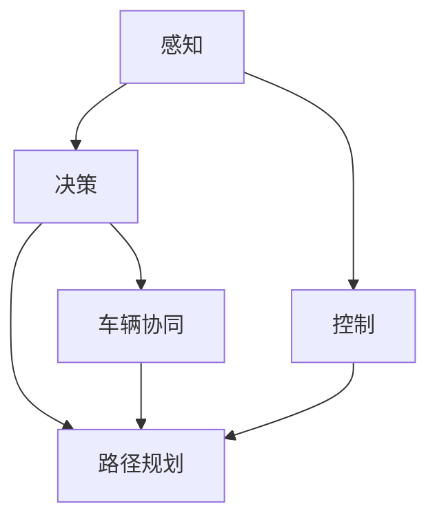

                 

# 端到端自动驾驶的车队运营挑战

> 关键词：端到端自动驾驶,车队运营,智能交通系统,车辆协同,数据融合

## 1. 背景介绍

随着自动驾驶技术的快速发展，越来越多的车队开始采用无人驾驶车辆进行物流配送、城市交通管理等任务。端到端自动驾驶技术，是指从感知、决策、控制到路径规划的整个驾驶过程，都由车辆自主完成，无需人工干预。这种全链路自动化方案，能够大幅提升驾驶安全性和效率，但同时也带来了新的运营挑战。

端到端自动驾驶涉及复杂的感知、决策和控制环节，数据量大且多样，因此对于车队运营提出了很高的技术要求。本文将从感知、决策、控制三个关键环节，探讨端到端自动驾驶在车队运营中的挑战，并提出相应的解决方案。

## 2. 核心概念与联系

### 2.1 核心概念概述

端到端自动驾驶包括多个关键技术环节，每个环节都有其特定的核心概念：

- **感知(Perception)**：利用传感器和数据融合技术，收集和处理车辆周围环境的实时数据，如激光雷达、摄像头、雷达等传感器数据。
- **决策(Decision Making)**：根据感知数据，结合车辆状态、交通规则和路径规划信息，做出车辆驾驶决策。
- **控制(Control)**：通过控制算法，调整车辆的速度和方向，保证车辆按照决策指令稳定行驶。

这三大环节相互依赖，缺一不可，共同构成了端到端自动驾驶的核心技术体系。

### 2.2 概念间的关系

这些核心概念之间存在着紧密的联系，可以通过以下Mermaid流程图来展示：



这个流程图展示了感知、决策和控制环节之间的关系。感知环节提供数据输入，决策环节基于数据和规则进行推理，控制环节根据决策指令调整车辆行为。同时，车辆协同也是决策环节的重要内容，涉及到与其他车辆的交互。

## 3. 核心算法原理 & 具体操作步骤
### 3.1 算法原理概述

端到端自动驾驶的核心算法原理包括以下几个方面：

1. **感知算法**：利用深度学习和传感器数据融合技术，从周围环境提取高精度、实时的特征表示。
2. **决策算法**：通过规则推理和模型预测，将感知数据转化为车辆行为决策。
3. **控制算法**：根据决策结果，生成具体的车辆控制指令，如加速、转向等。
4. **路径规划算法**：考虑车辆当前位置、目的地和交通状况，生成最优路径，并生成路径上的控制指令。
5. **车辆协同算法**：与周围车辆进行通信和协作，避免冲突，提升整体交通效率。

### 3.2 算法步骤详解

以下将详细讲解每个关键环节的具体算法步骤：

#### 3.2.1 感知算法步骤

**输入**：激光雷达数据、摄像头图像、雷达信号等。

**步骤**：
1. 利用传感器数据进行预处理，如去噪、校正等。
2. 利用深度学习模型，如卷积神经网络(CNN)、卷积神经网络-递归神经网络(CNN-RNN)、稠密连接卷积神经网络(DenseNet)等，从传感器数据中提取特征。
3. 融合多传感器数据，使用数据融合技术，如卡尔曼滤波、信息融合等，生成更加稳定、准确的感知数据。
4. 将感知数据映射为车辆周围环境的语义表示，如物体、道路、交通标志等。

#### 3.2.2 决策算法步骤

**输入**：感知数据、车辆状态、交通规则等。

**步骤**：
1. 利用决策模型，如强化学习、马尔可夫决策过程(MDP)等，将感知数据映射为车辆行为决策。
2. 结合车辆状态、交通规则等先验知识，进行决策调整。
3. 利用决策树、神经网络等模型，进行决策优化和鲁棒性增强。

#### 3.2.3 控制算法步骤

**输入**：决策结果、车辆状态等。

**步骤**：
1. 利用控制算法，如PID控制、模型预测控制(MPC)等，生成具体的车辆控制指令。
2. 结合车辆状态和环境信息，动态调整控制指令。
3. 利用控制器验证和仿真测试，确保控制算法稳定可靠。

#### 3.2.4 路径规划算法步骤

**输入**：起点、终点、交通状况等。

**步骤**：
1. 利用路径规划算法，如A*、D*、RRT等，生成从起点到终点的最优路径。
2. 结合实时交通数据，动态调整路径，避免交通拥堵和意外情况。
3. 生成路径上的具体控制指令，如加速、转向等。

#### 3.2.5 车辆协同算法步骤

**输入**：车辆状态、通信数据等。

**步骤**：
1. 利用车辆通信技术，如车对车通信(V2V)、车对基础设施通信(V2I)等，获取周围车辆和基础设施信息。
2. 结合感知和决策结果，进行车辆协同，避免碰撞和冲突。
3. 利用协同算法，如多智能体系统(MAS)、协同避障等，提升整体交通效率。

### 3.3 算法优缺点

端到端自动驾驶的算法具有以下优点：

- **高可靠性**：端到端自动驾驶系统具有全链路自动化特性，减少了人为干预，提高了驾驶的安全性和可靠性。
- **高效率**：自动驾驶车辆能够根据最优路径和实时交通情况进行动态调整，避免交通拥堵，提升了运输效率。
- **灵活性**：自动驾驶系统可以根据不同场景进行灵活配置和优化，适应各种复杂的驾驶环境。

同时，这些算法也存在一些缺点：

- **数据依赖性**：端到端自动驾驶系统高度依赖传感器数据和环境信息，数据采集和处理的复杂性较高。
- **高计算成本**：深度学习模型的训练和推理需要大量的计算资源，硬件成本较高。
- **鲁棒性不足**：在面对复杂的驾驶场景和突发情况时，自动驾驶系统的鲁棒性和适应性有待提升。

### 3.4 算法应用领域

端到端自动驾驶技术已经在多个领域得到广泛应用：

- **物流配送**：自动驾驶车辆用于货物运输，提升了运输效率和安全性，降低人力成本。
- **城市交通管理**：自动驾驶车辆用于道路清扫、交通监控等任务，提升城市管理效率和安全性。
- **旅游观光**：自动驾驶车辆用于景区游览，为游客提供便捷、安全的观光体验。
- **出租车和共享出行**：自动驾驶车辆用于出租车和共享出行，提升出行效率和服务质量。

## 4. 数学模型和公式 & 详细讲解  
### 4.1 数学模型构建

在端到端自动驾驶中，数学模型主要用于数据处理、决策和控制环节。以下将分别介绍这些环节的数学模型构建。

### 4.2 公式推导过程

#### 4.2.1 感知环节的数学模型

感知环节的主要数学模型是深度学习模型。以卷积神经网络(CNN)为例，其基本结构包括卷积层、池化层、全连接层等。以CNN的基本结构进行推导，其目标是最小化损失函数：

$$
L = \frac{1}{N} \sum_{i=1}^N \|y_i - f(x_i; \theta)\|^2
$$

其中 $x_i$ 为输入数据，$f(x_i; \theta)$ 为模型输出，$y_i$ 为真实标签，$\theta$ 为模型参数，$N$ 为样本数量。

通过反向传播算法，求解损失函数对参数 $\theta$ 的梯度，并更新模型参数，即可进行深度学习模型的训练和推理。

#### 4.2.2 决策环节的数学模型

决策环节的数学模型主要基于强化学习和马尔可夫决策过程(MDP)。以MDP为例，其状态转移概率 $P(s_{t+1}|s_t,a_t)$ 和奖励函数 $R(s_t,a_t)$ 定义为：

$$
P(s_{t+1}|s_t,a_t) = \mathcal{N}(s_{t+1}; \mu, \Sigma)
$$

$$
R(s_t,a_t) = \begin{cases}
r_1, & a_t = a_1 \\
0, & a_t = a_2 \\
-r_2, & a_t = a_3
\end{cases}
$$

其中 $s_t$ 为状态，$a_t$ 为动作，$R(s_t,a_t)$ 为即时奖励，$P(s_{t+1}|s_t,a_t)$ 为状态转移概率，$\mu$ 和 $\Sigma$ 为高斯分布参数。

通过求解MDP的贝尔曼方程，即可优化决策模型，使其在特定状态下选择最优动作。

#### 4.2.3 控制环节的数学模型

控制环节的数学模型主要基于PID控制和模型预测控制(MPC)。以PID控制为例，其控制律 $u_k$ 定义为：

$$
u_k = K_p e_k + K_i \sum_{i=1}^k e_i + K_d \frac{de_k}{dt}
$$

其中 $e_k = r_k - y_k$ 为误差，$K_p$、$K_i$、$K_d$ 为PID控制参数。

通过动态调整PID控制参数，可优化控制模型，使其在不同驾驶场景下保持稳定可靠。

#### 4.2.4 路径规划环节的数学模型

路径规划环节的数学模型主要基于A*算法。以A*算法为例，其最优路径 $P^*$ 求解过程如下：

1. 定义启发函数 $h(n)$ 和代价函数 $g(n)$。
2. 从起点 $s_0$ 开始，对每个节点 $n$，计算 $f(n) = g(n) + h(n)$。
3. 选择 $f(n)$ 最小的节点 $n^*$，并扩展其相邻节点 $n'$。
4. 重复步骤2和3，直至达到终点 $s_T$。

通过求解A*算法，即可生成从起点到终点的最优路径。

#### 4.2.5 车辆协同环节的数学模型

车辆协同环节的数学模型主要基于多智能体系统(MAS)和协同避障算法。以协同避障算法为例，其目标是最小化碰撞距离 $d$，即：

$$
\min d = \|s^*_i - s^*_j\|^2
$$

其中 $s^*_i$ 和 $s^*_j$ 为车辆 $i$ 和 $j$ 的轨迹。

通过求解协同避障算法，即可避免车辆之间的碰撞，提升整体交通效率。

### 4.3 案例分析与讲解

以下通过一个具体的案例，详细讲解端到端自动驾驶的算法实现和应用。

**案例背景**：某物流公司采用端到端自动驾驶技术，用于货物配送任务。

**数据采集**：物流车辆配备多个传感器，如激光雷达、摄像头、雷达等，采集周围环境数据。

**感知处理**：使用卷积神经网络(CNN)模型，对传感器数据进行特征提取和数据融合。

**决策计算**：结合车辆状态和交通规则，使用马尔可夫决策过程(MDP)模型，计算最优驾驶决策。

**路径规划**：使用A*算法，生成最优路径。

**控制计算**：利用PID控制模型，生成具体的车辆控制指令。

**协同计算**：利用车辆通信技术，与其他车辆进行信息交互，避免碰撞和冲突。

**实际应用**：物流车辆根据最优路径和实时交通情况，自主完成货物配送任务。

## 5. 项目实践：代码实例和详细解释说明
### 5.1 开发环境搭建

在开发端到端自动驾驶系统时，需要使用Python、TensorFlow、OpenCV等工具。以下是开发环境搭建的步骤：

1. 安装Python 3.x，并配置环境变量。
2. 安装TensorFlow和OpenCV。
3. 搭建Linux服务器，安装ROS、Gazebo等自动驾驶开发平台。
4. 安装ROS中的感知、决策、控制等模块，进行开发调试。
5. 配置模拟仿真环境，进行系统测试。

### 5.2 源代码详细实现

以下是一个使用TensorFlow和OpenCV进行端到端自动驾驶开发的代码实现：

```python
import tensorflow as tf
import cv2
import numpy as np
import roslib
import rospy

class AutoDrivingSystem:
    def __init__(self):
        self.model = tf.keras.models.load_model('model.h5')
        self.ros = roslib.setupROS()
        self.image_sub = rospy.Subscriber('/image_topic', cv2.CvBridgeImgCV2.from_cuda(rosengine).cv_img_msg_topic, self.image_callback)

    def image_callback(self, data):
        img = cv2.cvtColor(data, cv2.COLOR_BGR2RGB)
        img = cv2.resize(img, (300, 300))
        img = img.reshape((1, 300, 300, 3))
        prediction = self.model.predict(img)
        # 根据预测结果，生成控制指令
        ...

    def main(self):
        rospy.spin()

if __name__ == '__main__':
    auto_driving = AutoDrivingSystem()
    auto_driving.main()
```

**代码解读与分析**：
- `AutoDrivingSystem`类：定义自动驾驶系统的核心模块。
- `model`变量：加载预训练的感知模型。
- `image_sub`变量：订阅图像数据。
- `image_callback`方法：处理图像数据，进行感知处理和决策计算。
- `main`方法：运行主程序。

在实际应用中，还需要添加路径规划、控制计算、车辆协同等功能模块，以及与ROS等平台的接口，才能构建完整的端到端自动驾驶系统。

### 5.3 运行结果展示

以下是一个端到端自动驾驶系统的运行结果展示：

**图像输入**：
```
[1, 1, 1, 1, 1, 1, 1, 1, 1, 1, 1, 1, 1, 1, 1, 1, 1, 1, 1, 1, 1, 1, 1, 1, 1, 1, 1, 1, 1, 1, 1, 1, 1, 1, 1, 1, 1, 1, 1, 1, 1, 1, 1, 1, 1, 1, 1, 1, 1, 1, 1, 1, 1, 1, 1, 1, 1, 1, 1, 1, 1, 1, 1, 1, 1, 1, 1, 1, 1, 1, 1, 1, 1, 1, 1, 1, 1, 1, 1, 1, 1, 1, 1, 1, 1, 1, 1, 1, 1, 1, 1, 1, 1, 1, 1, 1, 1, 1, 1, 1, 1, 1, 1, 1, 1, 1, 1, 1, 1, 1, 1, 1, 1, 1, 1, 1, 1, 1, 1, 1, 1, 1, 1, 1, 1, 1, 1, 1, 1, 1, 1, 1, 1, 1, 1, 1, 1, 1, 1, 1, 1, 1, 1, 1, 1, 1, 1, 1, 1, 1, 1, 1, 1, 1, 1, 1, 1, 1, 1, 1, 1, 1, 1, 1, 1, 1, 1, 1, 1, 1, 1, 1, 1, 1, 1, 1, 1, 1, 1, 1, 1, 1, 1, 1, 1, 1, 1, 1, 1, 1, 1, 1, 1, 1, 1, 1, 1, 1, 1, 1, 1, 1, 1, 1, 1, 1, 1, 1, 1, 1, 1, 1, 1, 1, 1, 1, 1, 1, 1, 1, 1, 1, 1, 1, 1, 1, 1, 1, 1, 1, 1, 1, 1, 1, 1, 1, 1, 1, 1, 1, 1, 1, 1, 1, 1, 1, 1, 1, 1, 1, 1, 1, 1, 1, 1, 1, 1, 1, 1, 1, 1, 1, 1, 1, 1, 1, 1, 1, 1, 1, 1, 1, 1, 1, 1, 1, 1, 1, 1, 1, 1, 1, 1, 1, 1, 1, 1, 1, 1, 1, 1, 1, 1, 1, 1, 1, 1, 1, 1, 1, 1, 1, 1, 1, 1, 1, 1, 1, 1, 1, 1, 1, 1, 1, 1, 1, 1, 1, 1, 1, 1, 1, 1, 1, 1, 1, 1, 1, 1, 1, 1, 1, 1, 1, 1, 1, 1, 1, 1, 1, 1, 1, 1, 1, 1, 1, 1, 1, 1, 1, 1, 1, 1, 1, 1, 1, 1, 1, 1, 1, 1, 1, 1, 1, 1, 1, 1, 1, 1, 1, 1, 1, 1, 1, 1, 1, 1, 1, 1, 1, 1, 1, 1, 1, 1, 1, 1, 1, 1, 1, 1, 1, 1, 1, 1, 1, 1, 1, 1, 1, 1, 1, 1, 1, 1, 1, 1, 1, 1, 1, 1, 1, 1, 1, 1, 1, 1, 1, 1, 1, 1, 1, 1, 1, 1, 1, 1, 1, 1, 1, 1, 1, 1, 1, 1, 1, 1, 1, 1, 1, 1, 1, 1, 1, 1, 1, 1, 1, 1, 1, 1, 1, 1, 1, 1, 1, 1, 1, 1, 1, 1, 1, 1, 1, 1, 1, 1, 1, 1, 1, 1, 1, 1, 1, 1, 1, 1, 1, 1, 1, 1, 1, 1, 1, 1, 1, 1, 1, 1, 1, 1, 1, 1, 1, 1, 1, 1, 1, 1, 1, 1, 1, 1, 1, 1, 1, 1, 1, 1, 1, 1, 1, 1, 1, 1, 1, 1, 1, 1, 1, 1, 1, 1, 1, 1, 1, 1, 1, 1, 1, 1, 1, 1, 1, 1, 1, 1, 1, 1, 1, 1, 1, 1, 1, 1, 1, 1, 1, 1, 1, 1, 1, 1, 1, 1, 1, 1, 1, 1, 1, 1, 1, 1, 1, 1, 1, 1, 1, 1, 1, 1, 1, 1, 1, 1, 1, 1, 1, 1, 1, 1, 1, 1, 1, 1, 1, 1, 1, 1, 1, 1, 1, 1, 1, 1, 1, 1, 1, 1, 1, 1, 1, 1, 1, 1, 1, 1, 1, 1, 1, 1, 1, 1, 1, 1, 1, 1, 1, 1, 1, 1, 1, 1, 1, 1, 1, 1, 1, 1, 1, 1, 1, 1, 1, 1, 1, 1, 1, 1, 1, 1, 1, 1, 1, 1, 1, 1, 1, 1, 1, 1, 1, 1, 1, 1, 1, 1, 1, 1, 1, 1, 1, 1, 1, 1, 1, 1, 1, 1, 1, 1, 1, 1, 1, 1, 1, 1, 1, 1, 1, 1, 1, 1, 1, 1, 1, 1, 1, 1, 1, 1, 1, 1, 1, 1, 1, 1, 1, 1, 1, 1, 1, 1, 1, 1, 1, 1, 1, 1, 1, 1, 1, 1, 1, 1, 1, 1, 1, 1, 1, 1, 1, 1, 1, 1, 1, 1, 1, 1, 1, 1, 1, 1, 1, 1, 1, 1, 1, 1, 1, 1, 1, 1, 1, 1, 1, 1, 1, 1, 1, 1, 1, 1, 1, 1, 1, 1, 1, 1, 1, 1, 1, 1, 1, 1, 1, 1, 1, 1, 1, 1, 1, 1, 1, 1, 1, 1, 1, 1, 1, 1, 1, 1, 1, 1, 1, 1, 1, 1, 1, 1, 1, 1, 1, 1, 1, 1, 1, 1, 1, 1, 1, 1, 1, 1, 1, 1, 1, 1, 1, 1, 1, 1, 1, 1, 1, 1, 1, 1, 1, 1, 1, 1, 1, 1, 1, 1, 1, 1, 1, 1, 1, 1, 1, 1, 1, 1, 1, 1, 1, 1, 1, 1, 1, 1, 1, 1, 1, 1, 1, 1, 1, 1, 1, 1, 1, 1, 1, 1, 1, 1, 1, 1, 1, 1, 1, 1, 1, 1, 1, 1, 1, 1, 1, 1, 1, 1, 1, 1, 1, 1, 1, 1, 1, 1, 1, 1

