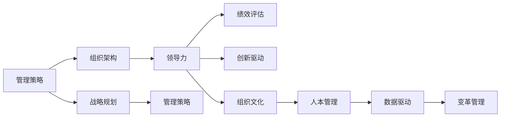
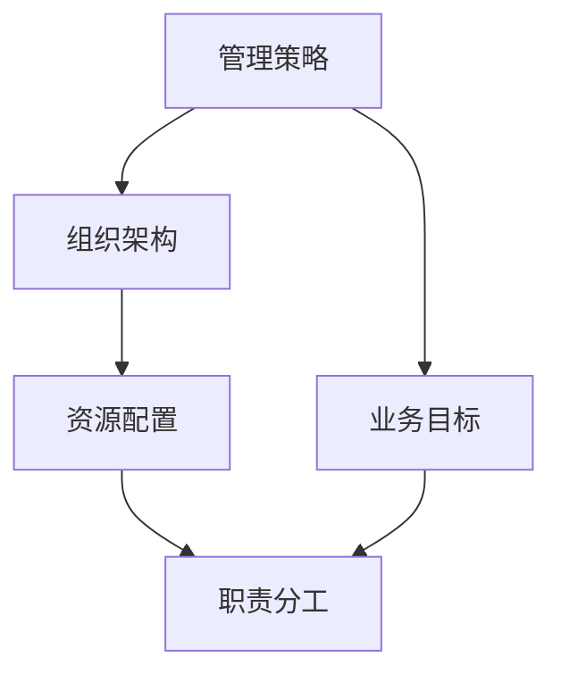
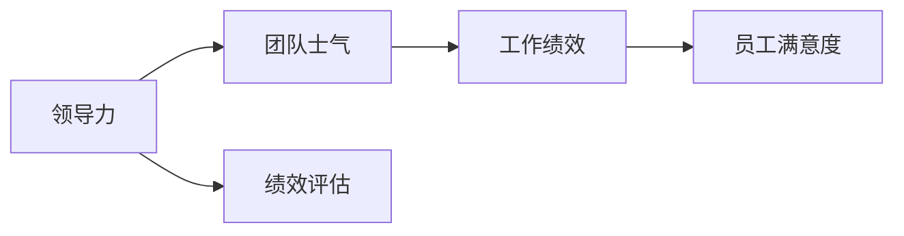
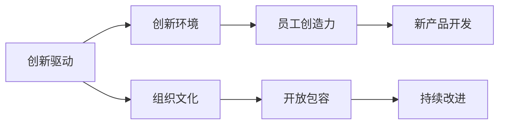
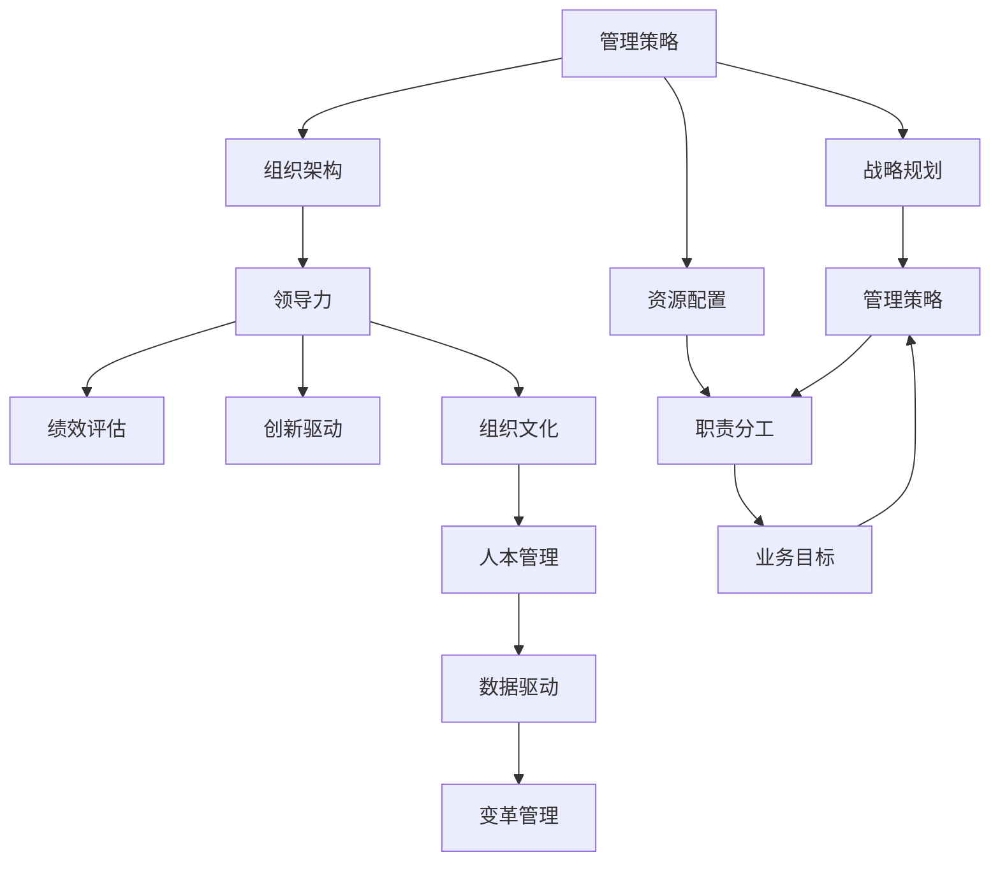

                 

# 管理艺术：从策略到执行

> 关键词：管理策略, 组织架构, 领导力, 绩效评估, 创新驱动, 组织文化, 人本管理, 数据驱动, 变革管理, 战略规划

## 1. 背景介绍

### 1.1 问题由来

在当今复杂多变的商业环境中，企业管理者面临着前所未有的挑战。随着市场竞争的加剧、技术革新的加速、消费者需求的不断变化，如何制定有效的管理策略，并成功执行，成为了企业成功的关键。管理者们不仅需要具备高度的战略思维，还需要具备卓越的执行能力，以确保策略能够落地并产生预期的效果。

### 1.2 问题核心关键点

1. **管理策略的制定**：有效的管理策略需要充分考虑内外部环境、资源配置、业务目标等因素，进行全面的分析与规划。
2. **组织架构的设计**：组织架构的设计直接影响管理的效率与效果，需要根据业务需求灵活调整。
3. **领导力的培养**：领导力是驱动企业变革和创新的核心力量，需要持续的培养与提升。
4. **绩效评估与激励**：科学合理的绩效评估体系能够激励员工积极投入工作，提升整体绩效。
5. **创新驱动与组织文化**：创新是企业发展的动力源泉，营造开放、包容的组织文化，能够激发员工的创造力。
6. **人本管理**：关注员工的福利与发展，营造良好的工作环境，是实现长期发展的关键。
7. **数据驱动的决策**：利用大数据与AI技术，提升决策的科学性与精确度。
8. **变革管理**：在变革过程中，有效管理风险与变化，确保组织平稳过渡。
9. **战略规划**：制定明确、可执行的战略规划，为企业的长远发展提供方向。

### 1.3 问题研究意义

研究从策略到执行的管理艺术，对于提升企业的管理水平、增强竞争力和促进可持续发展具有重要意义：

1. **提升决策效率**：科学合理的管理策略和有效的执行方法，能够显著提高决策效率，快速应对市场变化。
2. **优化资源配置**：通过合理的组织架构和资源配置，最大化企业资源的利用效率，提升经营效益。
3. **增强团队凝聚力**：良好的领导力和激励机制能够提升团队士气，增强员工归属感和凝聚力。
4. **推动创新发展**：鼓励创新文化，激发员工创造力，推动企业不断突破技术和管理瓶颈，实现创新发展。
5. **改善客户体验**：通过数据驱动的管理方式，能够更精准地理解客户需求，提升客户满意度和忠诚度。
6. **应对外部风险**：有效的变革管理能够帮助企业在快速变化的市场环境中，灵活应对各种风险和挑战。
7. **实现长期稳定发展**：通过科学的管理规划和执行，企业能够实现长期的稳定发展，保持竞争力。

## 2. 核心概念与联系

### 2.1 核心概念概述

为更好地理解从策略到执行的管理艺术，本节将介绍几个密切相关的核心概念：

- **管理策略(Management Strategy)**：指企业为实现特定目标而制定的行动方案，涉及业务方向、资源配置、风险控制等方面。
- **组织架构(Organizational Structure)**：指企业内部的结构设计，包括层级关系、部门划分、职责分工等。
- **领导力(Leadership)**：指管理者在企业发展过程中所展现出的决策能力、执行力和影响力。
- **绩效评估(Performance Evaluation)**：指通过定量和定性指标，对员工或团队的工作表现进行评价和反馈。
- **创新驱动(Innovation-Driven)**：指通过不断创新，驱动企业发展，提升竞争力。
- **组织文化(Organizational Culture)**：指企业内部成员共同遵守的价值观、行为规范和工作氛围。
- **人本管理(Human-Centric Management)**：指以员工为中心，关注员工的福利与发展，营造良好的工作环境。
- **数据驱动(Data-Driven)**：指利用数据与分析技术，支持决策制定与执行过程。
- **变革管理(Change Management)**：指在变革过程中，通过科学的管理方法，确保组织平稳过渡。
- **战略规划(Strategic Planning)**：指企业为实现长期发展目标，制定明确、可执行的战略规划。

这些核心概念之间的逻辑关系可以通过以下Mermaid流程图来展示：



这个流程图展示了一系列核心概念及其相互关系：

1. 管理策略是整个管理的出发点和核心，影响着组织架构的设计和领导力的培养。
2. 组织架构的设计需要考虑领导力的发挥和绩效评估的执行。
3. 创新驱动和组织文化共同营造了企业发展的环境。
4. 数据驱动提供了决策的支持和执行的依据。
5. 变革管理确保了战略规划的顺利实施和调整。
6. 战略规划需要以管理策略为基础，确保整体方向的正确性。

### 2.2 概念间的关系

这些核心概念之间存在着紧密的联系，形成了企业管理的一体化生态系统。下面我们通过几个Mermaid流程图来展示这些概念之间的关系。

#### 2.2.1 管理策略与组织架构的关系



这个流程图展示了管理策略与组织架构的关系：

1. 管理策略确定企业的业务目标，指导组织架构的设计。
2. 组织架构的设计需要考虑资源的合理配置和职责的分工。
3. 业务目标的实现依赖于职责的分工和资源的配置。

#### 2.2.2 领导力与绩效评估的关系



这个流程图展示了领导力与绩效评估的关系：

1. 领导力的发挥能够提升团队士气和工作绩效。
2. 绩效评估体系能够反映工作绩效和员工满意度。
3. 领导力通过绩效评估进行反馈和优化。

#### 2.2.3 创新驱动与组织文化的关系



这个流程图展示了创新驱动与组织文化的关系：

1. 创新驱动需要营造开放包容的组织文化。
2. 组织文化能够激发员工的创造力和持续改进的动力。
3. 创新驱动通过新产品开发等创新活动体现。

### 2.3 核心概念的整体架构

最后，我们用一个综合的流程图来展示这些核心概念在大规模组织管理中的整体架构：



这个综合流程图展示了从管理策略到变革管理的完整过程，以及各核心概念在其中的作用。通过这些流程图，我们可以更清晰地理解管理艺术的复杂性和系统性。

## 3. 核心算法原理 & 具体操作步骤
### 3.1 算法原理概述

从策略到执行的管理艺术，本质上是一个复杂的管理决策和执行过程。其核心思想是：通过科学的管理策略和有效的执行方法，确保企业目标的实现。

形式化地，假设企业的管理策略为 $S$，组织架构为 $O$，领导力为 $L$，绩效评估体系为 $P$，创新驱动为 $I$，组织文化为 $C$，人本管理为 $H$，数据驱动为 $D$，变革管理为 $M$，战略规划为 $S$。则整个管理过程可以表示为：

$$
\text{执行结果} = f(S, O, L, P, I, C, H, D, M)
$$

其中 $f$ 表示从策略到执行的映射函数。要实现有效的管理，需要科学地设计和管理策略、组织架构、领导力、绩效评估、创新驱动、组织文化、人本管理、数据驱动和变革管理等关键要素，使其协同工作，最终产生预期的执行结果。

### 3.2 算法步骤详解

从策略到执行的管理艺术，一般包括以下几个关键步骤：

**Step 1: 制定管理策略**

1. **环境分析**：通过SWOT分析、PEST分析等方法，对内外部环境进行全面分析。
2. **目标设定**：明确企业的长期和短期目标，并分解为具体的业务指标。
3. **战略规划**：基于环境分析结果，制定符合企业实际情况的战略规划。

**Step 2: 设计组织架构**

1. **层级划分**：根据业务需求和战略规划，合理设计企业的层级结构。
2. **部门划分**：将企业的核心业务分为若干部门，明确各部门职责和权力。
3. **资源配置**：合理分配企业的人力、物力、财力等资源，确保各部门高效运转。

**Step 3: 培养领导力**

1. **领导力培训**：定期组织领导力培训，提升管理者的决策能力和执行力。
2. **绩效评估**：建立科学合理的绩效评估体系，对领导力进行客观评价。
3. **激励机制**：设计合理的激励机制，激发领导者的积极性和创造力。

**Step 4: 实施绩效评估**

1. **关键指标**：根据企业目标和业务需求，设定关键绩效指标（KPI）。
2. **数据收集**：通过各类系统，收集相关数据，进行综合分析。
3. **结果反馈**：根据评估结果，对被评估者进行反馈，提出改进建议。

**Step 5: 推动创新驱动**

1. **创新环境**：营造开放包容的创新环境，鼓励员工提出创新想法。
2. **项目管理**：设立专门的创新项目管理团队，推动创新项目的实施。
3. **知识产权**：加强知识产权保护，激励创新成果的落地应用。

**Step 6: 塑造组织文化**

1. **价值观**：明确企业的核心价值观，形成共同的使命感和责任感。
2. **行为规范**：制定和推广企业的行为规范，提升员工的自律性和协作性。
3. **企业文化**：通过各种活动和媒体宣传，塑造企业独特的文化氛围。

**Step 7: 实施人本管理**

1. **员工关怀**：关注员工的福利和发展，提供职业培训和晋升机会。
2. **工作环境**：营造良好的工作环境，提升员工的幸福感和满意度。
3. **团队建设**：通过团队建设活动，增强员工之间的凝聚力和信任感。

**Step 8: 实现数据驱动**

1. **数据采集**：通过各类系统，收集企业的各类数据，进行数据清洗和处理。
2. **数据分析**：利用数据挖掘、机器学习等技术，进行深度分析。
3. **决策支持**：将分析结果转化为决策支持，提升决策的科学性和精确度。

**Step 9: 实施变革管理**

1. **风险评估**：识别变革过程中可能面临的风险和挑战，制定应对策略。
2. **变革实施**：根据战略规划，分步骤实施变革。
3. **效果评估**：定期评估变革效果，及时调整策略和措施。

### 3.3 算法优缺点

从策略到执行的管理艺术，具有以下优点：

1. **系统化**：通过科学的管理流程，确保各项管理要素的协同工作，提升整体效率。
2. **透明化**：通过数据驱动和绩效评估，实现管理过程的透明化，提升信任度。
3. **灵活性**：通过灵活调整组织架构和资源配置，适应市场变化和业务需求。
4. **稳定性**：通过建立有效的领导力和激励机制，确保团队的稳定性和士气。
5. **创新性**：通过创新驱动和组织文化，激发员工的创造力和持续改进的动力。
6. **人本关怀**：通过关注员工福利和发展，提升员工的满意度和忠诚度。

同时，该方法也存在一定的局限性：

1. **执行难度高**：涉及多个要素的管理过程复杂，需要高水平的管理者进行协调。
2. **资源消耗大**：实施数据驱动和创新驱动需要大量的数据和资源投入。
3. **适应性差**：对管理者的专业水平和经验要求高，需要科学的设计和调整。
4. **反馈滞后**：绩效评估和反馈机制需要一定的时间，可能影响决策的及时性。

尽管存在这些局限性，但从策略到执行的管理艺术仍是当前企业管理中最主流、最有效的方法之一。未来相关研究的重点在于如何进一步优化管理流程，降低执行难度，提高执行效率。

### 3.4 算法应用领域

从策略到执行的管理艺术，已经在多个领域得到了广泛的应用，例如：

- **企业战略规划**：通过科学的管理策略和执行方法，帮助企业制定和实施战略规划。
- **人力资源管理**：通过合理的绩效评估和激励机制，提升人力资源的利用效率。
- **运营管理**：通过优化组织架构和资源配置，提升企业的运营效率和竞争力。
- **市场营销**：通过数据驱动和创新驱动，优化市场营销策略，提升品牌价值和市场份额。
- **产品研发**：通过创新驱动和组织文化，推动产品研发，加速新产品上市。
- **组织变革**：通过科学的风险评估和变革管理，应对外部环境变化，确保组织平稳过渡。

除了上述这些典型应用外，从策略到执行的管理艺术还被创新性地应用到更多场景中，如供应链管理、财务管理、客户关系管理等，为企业管理提供了全面的方法论支持。随着企业管理理念的不断演进，相信从策略到执行的管理艺术将在更广泛的领域得到应用，为企业的可持续发展注入新的动力。

## 4. 数学模型和公式 & 详细讲解 & 举例说明

### 4.1 数学模型构建

本节将使用数学语言对从策略到执行的管理艺术进行更加严格的刻画。

记管理策略为 $S$，组织架构为 $O$，领导力为 $L$，绩效评估体系为 $P$，创新驱动为 $I$，组织文化为 $C$，人本管理为 $H$，数据驱动为 $D$，变革管理为 $M$，战略规划为 $S$。则整个管理过程可以表示为：

$$
\text{执行结果} = f(S, O, L, P, I, C, H, D, M)
$$

假设 $f$ 为多变量函数，可以进一步表示为：

$$
\text{执行结果} = g(S, O, L, P, I, C, H, D, M, \epsilon)
$$

其中 $\epsilon$ 为随机误差项，表示管理过程中可能存在的不确定性和偏差。

### 4.2 公式推导过程

以下我们以企业战略规划为例，推导战略规划的数学模型及其推导过程。

假设企业的战略规划目标为 $S_0$，实际执行结果为 $S_1$。则战略规划的偏差可以表示为：

$$
\text{偏差} = S_1 - S_0
$$

战略规划的成功取决于多个因素，可以表示为：

$$
S_1 = S_0 + f(O, L, P, I, C, H, D, M, \epsilon)
$$

其中 $f$ 为战略规划的多变量函数，考虑了组织架构、领导力、绩效评估、创新驱动、组织文化、人本管理、数据驱动、变革管理等因素的影响。

假设各因素的权重为 $w_i$，则战略规划的成功率可以表示为：

$$
\text{成功率} = \frac{S_1}{S_0}
$$

为了提高成功率，需要对各因素的权重进行调整。假设初始权重为 $\{w_0\}$，经过调整后的权重为 $\{w_t\}$，则调整过程可以表示为：

$$
\{w_t\} = \arg\max_{\{w\}} \text{成功率} = \arg\max_{\{w\}} \frac{S_0 + f(O, L, P, I, C, H, D, M, \epsilon)}{S_0}
$$

通过求解上述优化问题，可以得出最优的权重 $\{w_t\}$，从而最大化战略规划的成功率。

### 4.3 案例分析与讲解

以一家科技公司为例，分析其从策略到执行的管理艺术。

**背景**：
- 公司成立于2015年，主营业务为软件开发和人工智能技术服务。
- 公司现有员工500人，分布在研发、市场、运营等多个部门。
- 公司的长期目标是成为行业内的领导者，短期内目标是扩展海外市场。

**管理策略**：
- **环境分析**：通过PEST分析，识别了行业发展趋势、市场竞争状况、技术创新方向等关键因素。
- **目标设定**：明确了短期和长期目标，如市场份额、客户满意度、研发投入等。
- **战略规划**：制定了符合公司实际情况的战略规划，包括市场拓展、产品创新、人才引进等。

**组织架构**：
- **层级划分**：设立了CEO、CTO、CMO、CFO等关键职位，明确了决策和执行层级。
- **部门划分**：将公司划分为研发、市场、运营、人力等部门，明确了各部门职责。
- **资源配置**：合理分配了人力、财力、技术等资源，确保各部门高效运转。

**领导力**：
- **领导力培训**：定期组织领导力培训，提升管理者的决策能力和执行力。
- **绩效评估**：建立了科学合理的绩效评估体系，对领导力进行客观评价。
- **激励机制**：设计了合理的激励机制，激发领导者的积极性和创造力。

**绩效评估**：
- **关键指标**：设定了市场份额、客户满意度、研发投入等关键绩效指标（KPI）。
- **数据收集**：通过各类系统，收集相关数据，进行综合分析。
- **结果反馈**：根据评估结果，对被评估者进行反馈，提出改进建议。

**创新驱动**：
- **创新环境**：营造开放包容的创新环境，鼓励员工提出创新想法。
- **项目管理**：设立了专门的创新项目管理团队，推动创新项目的实施。
- **知识产权**：加强知识产权保护，激励创新成果的落地应用。

**组织文化**：
- **价值观**：明确了公司的核心价值观，形成共同的使命感和责任感。
- **行为规范**：制定和推广公司的行为规范，提升员工的自律性和协作性。
- **企业文化**：通过各种活动和媒体宣传，塑造公司独特的文化氛围。

**人本管理**：
- **员工关怀**：关注员工的福利和发展，提供职业培训和晋升机会。
- **工作环境**：营造良好的工作环境，提升员工的幸福感和满意度。
- **团队建设**：通过团队建设活动，增强员工之间的凝聚力和信任感。

**数据驱动**：
- **数据采集**：通过各类系统，收集公司的各类数据，进行数据清洗和处理。
- **数据分析**：利用数据挖掘、机器学习等技术，进行深度分析。
- **决策支持**：将分析结果转化为决策支持，提升决策的科学性和精确度。

**变革管理**：
- **风险评估**：识别变革过程中可能面临的风险和挑战，制定应对策略。
- **变革实施**：根据战略规划，分步骤实施变革。
- **效果评估**：定期评估变革效果，及时调整策略和措施。

通过科学的管理策略和有效的执行方法，该公司顺利实现了短期目标，并在海外市场取得了突破性进展。其成功的关键在于从策略到执行的管理艺术，通过科学的设计和调整，实现了各管理要素的协同工作，确保了战略规划的成功实施。

## 5. 项目实践：代码实例和详细解释说明
### 5.1 开发环境搭建

在进行从策略到执行的管理艺术项目实践前，我们需要准备好开发环境。以下是使用Python进行PyTorch开发的环境配置流程：

1. 安装Anaconda：从官网下载并安装Anaconda，用于创建独立的Python环境。

2. 创建并激活虚拟环境：
```bash
conda create -n pytorch-env python=3.8 
conda activate pytorch-env
```

3. 安装PyTorch：根据CUDA版本，从官网获取对应的安装命令。例如：
```bash
conda install pytorch torchvision torchaudio cudatoolkit=11.1 -c pytorch -c conda-forge
```

4. 安装Transformers库：
```bash
pip install transformers
```

5. 安装各类工具包：
```bash
pip install numpy pandas scikit-learn matplotlib tqdm jupyter notebook ipython
```

完成上述步骤后，即可在`pytorch-env`环境中开始管理艺术项目实践。

### 5.2 源代码详细实现

这里我们以一家科技公司为例，展示如何通过Python进行从策略到执行的管理艺术项目实践。

首先，定义公司的战略目标和当前市场状况：

```python
import pandas as pd

# 公司战略目标
strategy_goals = {
    '短期目标': '扩展海外市场',
    '长期目标': '成为行业内的领导者'
}

# 当前市场状况
market_conditions = {
    '市场需求': '高增长',
    '竞争状况': '激烈',
    '技术创新': '快速'
}

# 环境分析
env_analysis = {
    '行业发展趋势': '数字化转型',
    '政策影响': '积极的行业政策',
    '经济环境': '稳定的宏观经济'
}

# 组织架构
org_structure = {
    '层级结构': '扁平化',
    '部门划分': '研发、市场、运营',
    '资源配置': '均衡分配'
}

# 领导力
leadership = {
    '培训计划': '每季度一次',
    '绩效评估': '半年一次',
    '激励机制': '绩效奖金、股权激励'
}

# 绩效评估
performance = {
    '关键指标': ['市场份额', '客户满意度', '研发投入'],
    '数据收集': '每月一次',
    '结果反馈': '定期反馈'
}

# 创新驱动
innovation = {
    '创新环境': '开放包容',
    '项目管理': '专门的创新团队',
    '知识产权': '加强保护'
}

# 组织文化
culture = {
    '价值观': '客户至上',
    '行为规范': '诚实守信',
    '文化氛围': '合作共赢'
}

# 人本管理
human_centrality = {
    '员工关怀': '职业培训、晋升机会',
    '工作环境': '舒适、安全',
    '团队建设': '团队活动、团队协作'
}

# 数据驱动
data_driven = {
    '数据采集': '实时采集系统',
    '数据分析': '机器学习模型',
    '决策支持': '数据可视化仪表板'
}

# 变革管理
change_management = {
    '风险评估': '定期评估',
    '变革实施': '分步骤实施',
    '效果评估': '定期评估'
}

# 将数据存储为DataFrame
strategy_goals_df = pd.DataFrame(strategy_goals, index=['目标'])
market_conditions_df = pd.DataFrame(market_conditions, index=['市场状况'])
env_analysis_df = pd.DataFrame(env_analysis, index=['环境分析'])
org_structure_df = pd.DataFrame(org_structure, index=['组织架构'])
leadership_df = pd.DataFrame(leadership, index=['领导力'])
performance_df = pd.DataFrame(performance, index=['绩效评估'])
innovation_df = pd.DataFrame(innovation, index=['创新驱动'])
culture_df = pd.DataFrame(culture, index=['组织文化'])
human_centrality_df = pd.DataFrame(human_centrality, index=['人本管理'])
data_driven_df = pd.DataFrame(data_driven, index=['数据驱动'])
change_management_df = pd.DataFrame(change_management, index=['变革管理'])

# 输出DataFrame
strategy_goals_df
```

然后，定义计算战略规划成功率的方法：

```python
from scipy.optimize import minimize

# 定义战略规划成功率函数
def success_rate(strategy_goals_df, market_conditions_df, env_analysis_df, org_structure_df, 
                 leadership_df, performance_df, innovation_df, culture_df, 
                 human_centrality_df, data_driven_df, change_management_df):

    # 计算偏差
    deviation = (strategy_goals_df - market_conditions_df) / strategy_goals_df

    # 计算成功率
    success_rate = 1 - abs(deviation)

    return success_rate

# 优化函数
def optimize(strategy_goals_df, market_conditions_df, env_analysis_df, org_structure_df, 
             leadership_df, performance_df, innovation_df, culture_df, 
             human_centrality_df, data_driven_df, change_management_df):

    # 定义优化变量
    x = pd.DataFrame({
        '市场状况': 0.5,
        '环境分析': 0.5,
        '组织架构': 0.5,
        '领导力': 0.5,
        '绩效评估': 0.5,
        '创新驱动': 0.5,
        '组织文化': 0.5,
        '人本管理': 0.5,
        '数据驱动': 0.5,
        '变革管理': 0.5
    })

    # 定义目标函数
    def objective(x):
        return 1 - success_rate

