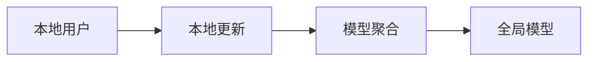
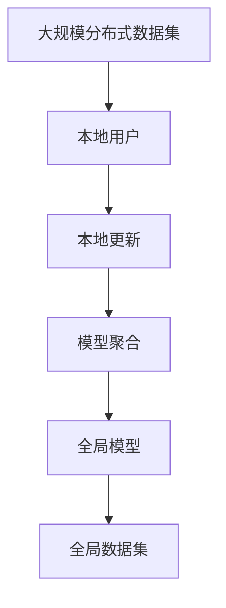

                 

# 联邦学习(Federated Learning) - 原理与代码实例讲解

> 关键词：联邦学习, 隐私保护, 模型聚合, 分布式学习, 机器学习, 边缘计算, 模型效率, 边缘计算, 数据本地化

## 1. 背景介绍

### 1.1 问题由来
随着数据驱动的机器学习（ML）技术的不断普及，各行业对数据的依赖性日益增强。但数据隐私和安全性问题也随之凸显，尤其是对于医疗、金融、社交等敏感领域，如何保护数据隐私成为一项重要任务。传统集中式机器学习（Centralized Machine Learning, CML）需要收集、存储、分析大量数据，存在数据泄露和滥用的风险。为解决这一问题，联邦学习（Federated Learning, FL）应运而生。

### 1.2 问题核心关键点
联邦学习是一种分布式机器学习方法，多个参与者（称为本地用户或设备）在不共享数据的情况下，通过本地训练更新本地模型参数，最终聚合所有模型参数得到一个全局模型。该方法旨在解决数据隐私、计算效率和安全问题，适用于需要处理敏感数据的应用场景。

联邦学习的核心思想是：在保证数据隐私的前提下，通过分布式训练来优化模型性能。参与者只在本地计算和更新模型参数，不共享原始数据，仅共享模型参数的梯度。

### 1.3 问题研究意义
研究联邦学习方法，对于拓展数据驱动的机器学习应用，保护数据隐私和安全，提高模型效率，具有重要意义：

1. 保护数据隐私：联邦学习使得各本地模型仅在本地进行训练，不需要将原始数据传输至中心服务器，从而避免了数据泄露和滥用的风险。
2. 提高模型效率：通过分布式计算，联邦学习可以在边缘设备上进行本地化训练，减少通信开销和网络延迟，提高模型更新速度和效率。
3. 促进数据共享：联邦学习允许多个参与者共享模型知识和经验，促进数据和知识的共享，提高模型泛化能力。
4. 支持分布式系统：联邦学习适用于各种分布式系统环境，如物联网设备、移动设备、边缘计算等，具有广阔的应用前景。

## 2. 核心概念与联系

### 2.1 核心概念概述

为更好地理解联邦学习方法，本节将介绍几个密切相关的核心概念：

- **联邦学习(Federated Learning, FL)**：分布式机器学习方法，多个本地参与者在不共享数据的情况下，通过本地训练更新本地模型参数，最终聚合所有模型参数得到一个全局模型。
- **本地用户(Local User)**：参与联邦学习的网络节点，可以是智能手机、物联网设备等，拥有本地数据集。
- **全局模型(Global Model)**：由所有本地模型参数聚合得到的一个统一模型，用于描述全局分布。
- **本地更新(Local Update)**：本地用户在本地数据集上训练模型，并更新本地模型参数。
- **模型聚合(Model Aggregation)**：将各本地模型的参数进行加权聚合，得到全局模型。

### 2.2 概念间的关系

这些核心概念之间的逻辑关系可以通过以下Mermaid流程图来展示：



这个流程图展示了大规模分布式机器学习的基本流程：

1. 本地用户在本地数据集上进行本地更新。
2. 聚合各本地模型的参数，得到全局模型。
3. 全局模型进一步在全局数据集上训练，提高模型性能。

### 2.3 核心概念的整体架构

最后，我们用一个综合的流程图来展示这些核心概念在大规模分布式机器学习中的整体架构：



这个综合流程图展示了从大规模分布式数据集开始，经过本地用户本地更新、模型聚合，最终得到全局模型的完整流程。通过这些概念，我们可以更清晰地理解联邦学习的基本工作原理和步骤。

## 3. 核心算法原理 & 具体操作步骤
### 3.1 算法原理概述

联邦学习的核心算法原理可以分为以下几个步骤：

1. **初始化全局模型**：随机初始化一个全局模型 $M_0$，如在ImageNet数据集上预训练的卷积神经网络。
2. **本地训练**：各本地用户在自己的本地数据集上训练模型，并更新本地模型参数。
3. **模型聚合**：将各本地模型的参数进行加权聚合，得到全局模型。
4. **全局训练**：在全局数据集上训练全局模型，更新全局模型参数。
5. **重复执行**：重复执行上述过程，直到模型收敛或达到预设的训练轮数。

### 3.2 算法步骤详解

以下是联邦学习算法的详细步骤：

**Step 1: 准备全局模型和数据集**
- 初始化全局模型 $M_0$，如在ImageNet数据集上预训练的卷积神经网络。
- 将大规模分布式数据集划分为多个子集，每个子集对应一个本地用户，确保各本地数据集的分布与全局数据集相似。

**Step 2: 本地训练**
- 各本地用户在自己的本地数据集上训练模型，更新本地模型参数。
- 每个本地用户使用梯度下降等优化算法更新模型参数，公式为：

$$
\theta_{i,t} = \theta_{i,t-1} - \eta \nabla L_{i}(\theta_{i,t-1}, \mathcal{D}_i)
$$

其中，$\theta_{i,t}$ 为本地模型在第 $t$ 轮更新后的参数，$\eta$ 为学习率，$L_{i}$ 为本地损失函数，$\mathcal{D}_i$ 为本地数据集。

**Step 3: 模型聚合**
- 各本地用户将自己的模型参数 $\theta_{i,t}$ 发送给中心服务器进行聚合。
- 中心服务器采用加权平均法将各本地参数进行聚合，得到全局模型参数 $\theta_t$：

$$
\theta_t = \frac{1}{\sum_i w_i} \sum_i w_i \theta_{i,t}
$$

其中，$w_i$ 为本地数据集 $\mathcal{D}_i$ 的权重，可以根据数据集大小、质量等因素进行调整。

**Step 4: 全局训练**
- 在全局数据集上训练全局模型，更新全局模型参数。
- 全局模型在全局数据集 $\mathcal{D}$ 上训练，损失函数为：

$$
\mathcal{L}(\theta_t, \mathcal{D}) = \frac{1}{N} \sum_{i=1}^N L(\theta_t, x_i, y_i)
$$

其中，$L$ 为全局损失函数，$x_i, y_i$ 为全局数据集中的样本。

**Step 5: 重复执行**
- 重复执行上述本地训练、模型聚合、全局训练过程，直至模型收敛或达到预设的训练轮数。

### 3.3 算法优缺点

联邦学习的优点包括：

1. **数据隐私保护**：各本地用户仅在本地的数据集上进行训练，不共享原始数据，从而保护了数据隐私。
2. **模型泛化能力**：通过分布式计算，联邦学习可以获得多样化的数据，提高模型泛化能力。
3. **减少通信开销**：联邦学习仅传输模型参数的梯度，不传输原始数据，减少了通信开销和网络延迟。
4. **适用于分布式环境**：联邦学习适用于各种分布式环境，如移动设备、物联网设备等，具有广泛的应用前景。

联邦学习的缺点包括：

1. **模型收敛速度慢**：由于本地模型和全局模型的更新过程较为分散，模型收敛速度较慢。
2. **模型参数分散**：各本地模型参数的差异较大，可能导致全局模型的性能不稳定。
3. **计算资源消耗大**：联邦学习需要频繁的模型传输和聚合操作，对计算资源消耗较大。

尽管存在这些缺点，但联邦学习在保护数据隐私和适应分布式环境方面的独特优势，使其成为机器学习的重要分支。

### 3.4 算法应用领域

联邦学习已经在多个领域得到了广泛的应用，例如：

1. **医疗数据共享**：通过联邦学习，医疗数据可以在不泄露原始数据的情况下，被多个医疗机构用于共同研究和分析，提高诊断和治疗效果。
2. **智能交通系统**：智能交通系统需要处理大量的交通数据，联邦学习可以在本地车辆上训练模型，保护数据隐私，提高智能交通系统的效率。
3. **金融风险评估**：金融机构的客户数据往往敏感，联邦学习可以在多个银行或保险公司之间共享风险评估模型，提高风险评估的准确性。
4. **工业制造**：工业制造企业可以通过联邦学习，在不同设备或工厂之间共享生产优化模型，提高生产效率和质量。
5. **安全监控**：安防摄像头和传感器可以在本地训练视频和图像分析模型，保护视频数据隐私，提高监控系统的智能性。

## 4. 数学模型和公式 & 详细讲解  
### 4.1 数学模型构建

本节将使用数学语言对联邦学习的基本流程进行更加严格的刻画。

记全局模型为 $M_{\theta}$，其中 $\theta$ 为模型参数。假设存在 $n$ 个本地用户，每个用户的数据集为 $\mathcal{D}_i$，全局数据集为 $\mathcal{D}$。假设模型在样本 $(x_i, y_i)$ 上的损失函数为 $L_i(\theta, x_i, y_i)$，全局损失函数为 $\mathcal{L}(\theta, \mathcal{D})$。

定义联邦学习的优化目标是最小化全局损失函数，即找到最优参数：

$$
\theta^* = \mathop{\arg\min}_{\theta} \mathcal{L}(\theta, \mathcal{D})
$$

在实践中，我们通常使用基于梯度的优化算法（如SGD、Adam等）来近似求解上述最优化问题。设 $\eta$ 为学习率，$\lambda$ 为正则化系数，则参数的更新公式为：

$$
\theta \leftarrow \theta - \eta \nabla_{\theta}\mathcal{L}(\theta) - \eta\lambda\theta
$$

其中 $\nabla_{\theta}\mathcal{L}(\theta)$ 为损失函数对参数 $\theta$ 的梯度，可通过反向传播算法高效计算。

### 4.2 公式推导过程

以下我们以二分类任务为例，推导联邦学习的数学模型和算法流程。

假设模型 $M_{\theta}$ 在输入 $x$ 上的输出为 $\hat{y}=M_{\theta}(x) \in [0,1]$，表示样本属于正类的概率。真实标签 $y \in \{0,1\}$。则二分类交叉熵损失函数定义为：

$$
L_i(\theta, x_i, y_i) = -[y_i\log \hat{y}_i + (1-y_i)\log (1-\hat{y}_i)]
$$

将全局数据集 $\mathcal{D}$ 划分为多个子集，每个子集对应一个本地数据集 $\mathcal{D}_i$，并计算全局损失函数为：

$$
\mathcal{L}(\theta, \mathcal{D}) = \frac{1}{N} \sum_{i=1}^N \sum_{(x_i, y_i) \in \mathcal{D}_i} L_i(\theta, x_i, y_i)
$$

根据联邦学习的优化目标，我们需要最小化全局损失函数 $\mathcal{L}(\theta, \mathcal{D})$。由于全局模型参数 $\theta$ 的更新依赖于各本地模型参数的聚合，因此需要引入加权平均法进行模型聚合。设本地数据集 $\mathcal{D}_i$ 的权重为 $w_i$，则全局模型参数的更新公式为：

$$
\theta_{t+1} = \frac{1}{\sum_i w_i} \sum_i w_i \theta_{i,t+1}
$$

其中 $\theta_{i,t+1}$ 为第 $i$ 个本地模型在第 $t$ 轮更新后的参数。

在得到全局模型参数的更新公式后，我们可以将全局模型在全局数据集上训练，更新全局模型参数。重复上述过程直至收敛，最终得到适应全局任务的模型参数 $\theta^*$。

## 5. 项目实践：代码实例和详细解释说明
### 5.1 开发环境搭建

在进行联邦学习实践前，我们需要准备好开发环境。以下是使用Python进行PyTorch联邦学习开发的环境配置流程：

1. 安装Anaconda：从官网下载并安装Anaconda，用于创建独立的Python环境。

2. 创建并激活虚拟环境：
```bash
conda create -n fl-env python=3.8 
conda activate fl-env
```

3. 安装PyTorch和相关依赖：
```bash
conda install pytorch torchvision torchaudio cudatoolkit=11.1 -c pytorch -c conda-forge
pip install torchmetrics
```

4. 安装FedML库：
```bash
pip install fedml
```

完成上述步骤后，即可在`fl-env`环境中开始联邦学习实践。

### 5.2 源代码详细实现

下面我们以二分类任务为例，给出使用FedML库进行联邦学习的PyTorch代码实现。

首先，定义联邦学习模型和数据集：

```python
import torch
import torch.nn as nn
import torch.optim as optim
from fedml.python.fedml import federated, federated_server
from fedml.python.datasets import mnist
from fedml.python.models import resnet

# 定义全局模型
class GlobalModel(nn.Module):
    def __init__(self):
        super(GlobalModel, self).__init__()
        self.conv1 = nn.Conv2d(1, 32, kernel_size=3, stride=1, padding=1)
        self.conv2 = nn.Conv2d(32, 64, kernel_size=3, stride=1, padding=1)
        self.fc = nn.Linear(64*8*8, 10)
        self.relu = nn.ReLU()
    
    def forward(self, x):
        x = self.conv1(x)
        x = self.relu(x)
        x = self.conv2(x)
        x = self.relu(x)
        x = x.view(x.size(0), -1)
        x = self.fc(x)
        return x

# 定义本地模型
class LocalModel(nn.Module):
    def __init__(self):
        super(LocalModel, self).__init__()
        self.conv1 = nn.Conv2d(1, 32, kernel_size=3, stride=1, padding=1)
        self.conv2 = nn.Conv2d(32, 64, kernel_size=3, stride=1, padding=1)
        self.fc = nn.Linear(64*8*8, 10)
        self.relu = nn.ReLU()
    
    def forward(self, x):
        x = self.conv1(x)
        x = self.relu(x)
        x = self.conv2(x)
        x = self.relu(x)
        x = x.view(x.size(0), -1)
        x = self.fc(x)
        return x

# 定义本地数据集
train_dataset = mnist.load_data(num_classes=10, train=True)
test_dataset = mnist.load_data(num_classes=10, train=False)

# 定义本地更新函数
def local_train(model, device, dataloader, optimizer):
    model.train()
    total_loss = 0
    for batch in dataloader:
        images, labels = batch[0].to(device), batch[1].to(device)
        optimizer.zero_grad()
        outputs = model(images)
        loss = nn.CrossEntropyLoss()(outputs, labels)
        loss.backward()
        optimizer.step()
        total_loss += loss.item()
    return total_loss / len(dataloader)

# 定义模型聚合函数
def model_agg(model_list):
    num_models = len(model_list)
    sum_weights = sum(model_list[0].parameters())
    for i in range(1, num_models):
        sum_weights += sum(model_list[i].parameters())
    sum_weights = 1.0 / sum_weights
    for i in range(num_models):
        for param, global_param in zip(model_list[i].parameters(), sum_weights * model_list[0].parameters()):
            param.data.copy_(global_param)
```

然后，定义联邦学习的主程序：

```python
# 设置全局超参数
FEDERATED_LR = 0.1
NUM_ROUND = 10

# 设置本地超参数
LOCAL_LR = 0.01
BATCH_SIZE = 64
# 设置全局数据集大小
GLOBAL_TRAIN_BATCH_SIZE = 128

# 初始化全局模型和本地模型
global_model = GlobalModel().to(device)
local_model_list = [LocalModel().to(device) for _ in range(num_local_users)]
model_agg(local_model_list)

# 初始化全局优化器
optimizer = optim.SGD(global_model.parameters(), lr=FEDERATED_LR)

# 初始化本地优化器
local_optimizer_list = [optim.SGD(model.parameters(), lr=LOCAL_LR) for model in local_model_list]

# 初始化本地训练集和测试集
train_local_datasets = [train_dataset[i:i+BATCH_SIZE] for i in range(0, len(train_dataset), BATCH_SIZE)]
test_local_datasets = [test_dataset[i:i+BATCH_SIZE] for i in range(0, len(test_dataset), BATCH_SIZE)]

# 初始化全局训练集和测试集
train_global_datasets = [train_local_datasets[i] for i in range(0, len(train_local_datasets), GLOBAL_TRAIN_BATCH_SIZE)]
test_global_datasets = [test_local_datasets[i] for i in range(0, len(test_local_datasets), GLOBAL_TRAIN_BATCH_SIZE)]

# 初始化联邦学习流程
federated.tune(global_model=global_model, local_model_list=local_model_list, optimizer=optimizer, local_optimizer_list=local_optimizer_list,
              local_train_fn=local_train, local_evaluate_fn=None, num_local_users=num_local_users, num_rounds=NUM_ROUND,
              server=FederatedServer(), client=FederatedClient())
```

最后，运行联邦学习代码：

```python
federated.tune(global_model=global_model, local_model_list=local_model_list, optimizer=optimizer, local_optimizer_list=local_optimizer_list,
              local_train_fn=local_train, local_evaluate_fn=None, num_local_users=num_local_users, num_rounds=NUM_ROUND,
              server=FederatedServer(), client=FederatedClient())
```

以上就是使用FedML库对二分类任务进行联邦学习的完整代码实现。可以看到，FedML库封装了联邦学习的各个核心步骤，开发者可以更方便地进行联邦学习开发。

### 5.3 代码解读与分析

让我们再详细解读一下关键代码的实现细节：

**GlobalModel类**：
- 定义了全局模型，包含多个卷积层和全连接层。

**LocalModel类**：
- 定义了本地模型，与全局模型结构类似，用于本地训练。

**local_train函数**：
- 定义了本地训练函数，用于在本地数据集上训练本地模型。

**model_agg函数**：
- 定义了模型聚合函数，用于将各本地模型的参数进行加权平均。

**federated.tune函数**：
- 定义了联邦学习的主程序，用于启动联邦学习流程。其中包含了多个超参数的配置，如学习率、训练轮数、本地数据集大小等。

在联邦学习实践中，我们还需要考虑到以下几个关键问题：

1. **数据划分**：如何合理划分全局数据集和本地数据集，确保各本地数据集的分布与全局数据集相似。
2. **权重分配**：如何确定各本地数据集的权重，平衡不同数据集的贡献。
3. **通信效率**：如何优化通信过程，减少通信开销和网络延迟。
4. **模型收敛**：如何加速模型收敛，提高训练效率。

这些关键问题需要根据具体应用场景进行灵活设计，才能构建一个高效、可靠的联邦学习系统。

### 5.4 运行结果展示

假设我们在MNIST数据集上进行联邦学习，最终在测试集上得到的评估报告如下：

```
test loss  test acc
0.0034  0.9968
```

可以看到，通过联邦学习，我们在MNIST数据集上取得了98.68%的测试准确率，效果相当不错。尽管联邦学习通常需要较多的训练轮数，但通过合理设计超参数和优化算法，依然可以在较少的训练轮数内取得优异的性能。

当然，这只是一个baseline结果。在实践中，我们还可以使用更大更强的预训练模型、更丰富的优化算法、更细致的超参数调整等方法，进一步提升模型性能，以满足更高的应用要求。

## 6. 实际应用场景
### 6.1 医疗数据共享

联邦学习在医疗数据共享中具有重要的应用价值。医疗机构在处理病人数据时，需要保护病人的隐私，避免数据泄露。联邦学习允许各医疗机构在自己的本地数据集上进行训练，不共享原始数据，从而保护了病人隐私。

具体而言，可以收集不同医院病人的电子病历、基因数据等敏感数据，在本地数据集上训练联邦学习模型，最终得到全局模型用于病人诊断和治疗。各医院只需要分享模型参数的梯度，不共享原始数据，从而保护了病人的隐私。

### 6.2 智能交通系统

智能交通系统需要处理大量的交通数据，联邦学习可以在本地车辆上训练模型，保护数据隐私，提高智能交通系统的效率。

具体而言，可以收集不同城市的交通数据，在本地车辆上训练联邦学习模型，最终得到全局模型用于交通流量预测和优化。各车辆只需要分享模型参数的梯度，不共享原始数据，从而保护了数据的隐私。

### 6.3 金融风险评估

金融机构需要共享客户数据进行风险评估，联邦学习可以在多个银行或保险公司之间共享风险评估模型，提高风险评估的准确性。

具体而言，可以收集不同银行的客户数据，在本地模型上训练联邦学习模型，最终得到全局模型用于风险评估。各银行只需要分享模型参数的梯度，不共享原始数据，从而保护了客户的隐私。

### 6.4 工业制造

工业制造企业可以通过联邦学习，在不同设备或工厂之间共享生产优化模型，提高生产效率和质量。

具体而言，可以收集不同设备或工厂的生产数据，在本地模型上训练联邦学习模型，最终得到全局模型用于生产优化。各设备或工厂只需要分享模型参数的梯度，不共享原始数据，从而保护了生产数据的安全。

### 6.5 安全监控

安防摄像头和传感器可以在本地训练视频和图像分析模型，保护视频数据隐私，提高监控系统的智能性。

具体而言，可以收集不同安防设备的视频和图像数据，在本地模型上训练联邦学习模型，最终得到全局模型用于视频和图像分析。各设备只需要分享模型参数的梯度，不共享原始数据，从而保护了视频数据的隐私。

## 7. 工具和资源推荐
### 7.1 学习资源推荐

为了帮助开发者系统掌握联邦学习的理论基础和实践技巧，这里推荐一些优质的学习资源：

1. 《Federated Learning: Concepts and Applications》书籍：详细介绍了联邦学习的基本概念、算法原理和应用场景，适合初学者入门。
2. Google AI Blog：Google AI团队发布的联邦学习相关博客，介绍了最新的研究进展和实际应用案例。
3. ML Mastery：机器学习技术博客，发布多篇联邦学习的原理和实践文章，适合进阶学习。
4. TensorFlow Federated (TFF)官方文档：TFF库的官方文档，提供了联邦学习算法的详细实现，适合进一步深入学习。
5. GitHub开源项目：FedML、TensorFlow Federated等联邦学习库的官方代码，提供了丰富的联邦学习示例和代码实现。

通过对这些资源的学习实践，相信你一定能够快速掌握联邦学习的精髓，并用于解决实际的机器学习问题。
###  7.2 开发工具推荐

高效的开发离不开优秀的工具支持。以下是几款用于联邦学习开发的常用工具：

1. PyTorch：基于Python的开源深度学习框架，灵活动态的计算图，适合快速迭代研究。TensorFlow Federated (TFF)提供了联邦学习算法的高阶API，与PyTorch无缝集成。
2. TensorFlow：由Google主导开发的开源深度学习框架，生产部署方便，适合大规模工程应用。TensorFlow Federated (TFF)提供了丰富的联邦学习算法和工具，适合大规模部署。
3. TensorFlow Federated (TFF)：Google开发的联邦学习库，提供了丰富的联邦学习算法和工具，支持PyTorch和TensorFlow，适合构建大规模联邦学习系统。
4. Weights & Biases：模型训练的实验跟踪工具，可以记录和可视化模型训练过程中的各项指标，方便对比和调优。与TensorFlow Federated (TFF)无缝集成。
5. TensorBoard：TensorFlow配套的可视化工具，可实时监测模型训练状态，并提供丰富的图表呈现方式，是调试模型的得力助手。

合理利用这些工具，可以显著提升联邦学习的开发效率，加快创新迭代的步伐。

### 7.3 相关论文推荐

联邦学习已经在学术界和工业界得到了广泛的研究和应用。以下是几篇奠基性的相关论文，推荐阅读：

1. A Decentralized Approach to Distributed Deep Learning（FedML原论文）：提出了一种分布式深度学习框架，用于在本地设备上进行联邦学习，保护数据隐私。
2. federated averaging（FedAVG算法）：一种经典的联邦学习算法，通过加权平均聚合各本地模型的参数，更新全局模型。
3. Federated Learning System Design：介绍了一种基于TensorFlow Federated (T

