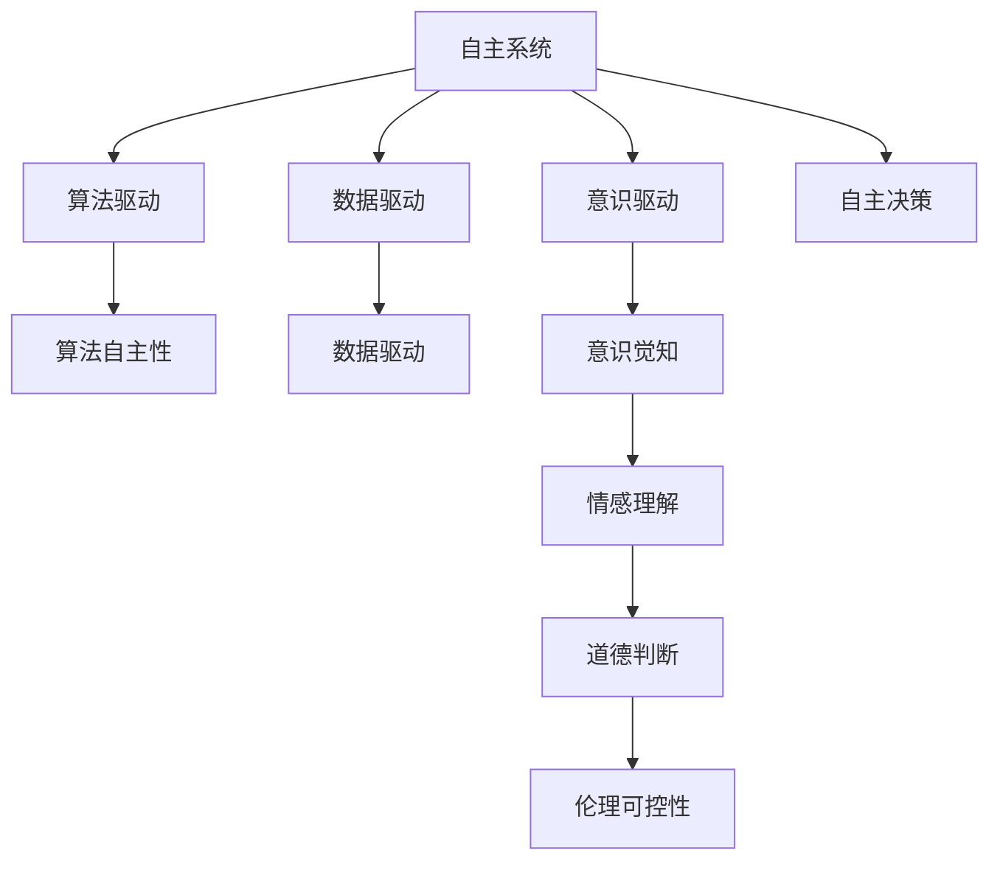
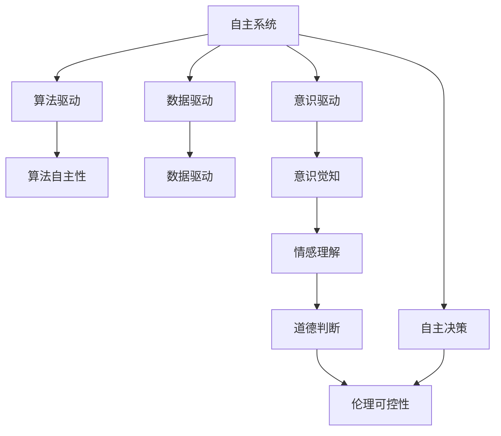

                 

# 自主系统与意识管理的结合

## 1. 背景介绍

在当今数字化时代，自主系统（Autonomous Systems, AS）在各个行业中的普及和应用已经成为一个不可避免的趋势。无论是无人驾驶车辆、自动驾驶飞机，还是智能客服、智能家居，自主系统正在逐步替代人工，成为解决复杂问题的关键手段。然而，自主系统在提高效率的同时，也带来了一些新的挑战，尤其是如何确保系统的安全和伦理责任。本文将探讨自主系统与意识管理（Consciousness Management, CM）相结合的方法，以期在提升系统自主性和智能性的同时，确保其安全和伦理可控。

## 2. 核心概念与联系

### 2.1 核心概念概述

自主系统与意识管理密切相关，但它们分别从不同的角度解决问题。自主系统注重通过算法和数据驱动的决策过程，以实现高效、可靠的操作。而意识管理则关注如何确保系统在决策过程中具有人类一样的意识和伦理责任感。

- **自主系统**：指能够自主感知、学习、决策和执行任务的智能系统。其核心在于算法和数据的驱动，通过不断的学习和优化，实现对环境的适应和自主决策。

- **意识管理**：指确保自主系统在决策和执行过程中，具备人类一样的意识和伦理责任感。这包括意识觉知、情感理解、道德判断等维度。

- **算法的自主性**：指算法能够在无人工干预的情况下，根据环境和任务自动作出决策。其自主性越强，系统的独立性和可扩展性越高。

- **伦理可控性**：指系统在决策和执行过程中，能够遵守人类的伦理原则和法律法规，确保其行为对人类和环境的影响可控和可预测。

- **意识驱动的自主性**：指系统在自主决策过程中，能够理解自己的意识和动机，并根据这些信息调整决策行为，从而更贴近人类价值观和伦理规范。

### 2.2 概念间的关系

这些核心概念之间存在着密切的联系，形成了一个复杂的系统生态。以下是一个Mermaid流程图，展示了这些概念之间的关系：



这个流程图展示了自主系统如何通过算法和数据驱动，实现自主决策；同时，通过意识管理技术，提升系统的意识觉知、情感理解、道德判断等，从而增强伦理可控性。

### 2.3 核心概念的整体架构

最后，我们将这些概念整合到一个综合的架构中，展示了它们之间的相互作用和影响。



这个综合架构展示了自主系统如何在算法和数据驱动的基础上，通过意识驱动增强自主性和伦理可控性。

## 3. 核心算法原理 & 具体操作步骤

### 3.1 算法原理概述

自主系统的核心在于通过算法和数据驱动的决策过程，实现对环境的感知、学习、决策和执行。而意识管理则关注如何确保系统在决策过程中具备人类一样的意识和伦理责任感。

- **算法驱动**：指系统通过算法对输入数据进行分析和处理，从而作出决策。这包括感知、学习、规划、执行等步骤。

- **数据驱动**：指系统通过数据进行决策，依赖于数据的质量和数量。数据驱动的决策过程通常比算法驱动更依赖于环境信息和历史数据。

- **意识驱动**：指系统在决策过程中，能够理解自己的意识和动机，并根据这些信息调整决策行为。这涉及到意识的觉知、情感的理解和道德判断等。

- **伦理可控性**：指系统在决策和执行过程中，能够遵守人类的伦理原则和法律法规，确保其行为对人类和环境的影响可控和可预测。

### 3.2 算法步骤详解

基于自主系统与意识管理相结合的思想，以下是基于算法驱动的自主系统设计步骤：

1. **环境感知**：系统通过传感器或数据采集工具，收集环境信息。这包括位置、速度、温度、湿度等物理量，以及文本、图像、声音等数据。

2. **数据处理**：将感知到的数据进行处理，如滤波、增强、特征提取等。这一步是算法驱动的核心，依赖于算法的有效性。

3. **决策规划**：基于处理后的数据，系统通过算法进行决策规划，如路径规划、行为预测等。这一步需要考虑系统的目标、约束和优先级等因素。

4. **执行执行**：系统根据决策规划，执行相应的操作。这一步依赖于执行机构的能力和精度。

5. **反馈与调整**：系统通过反馈机制，对执行结果进行评估，并根据评估结果调整决策和执行策略。

6. **意识管理**：在系统执行过程中，加入意识管理模块，确保系统具备意识觉知、情感理解和道德判断。这涉及到意识的觉知、情感的理解和道德判断等。

7. **伦理可控性**：在系统决策和执行过程中，加入伦理可控模块，确保系统的行为符合人类的伦理原则和法律法规。

### 3.3 算法优缺点

**算法驱动的自主系统**的优点包括：

- **高效性**：算法驱动的决策过程可以快速响应环境变化，实现高效的任务执行。

- **可解释性**：算法驱动的决策过程透明，易于解释和调试。

- **可扩展性**：算法驱动的决策过程可以灵活调整和扩展，适应复杂的环境。

但同时也存在一些缺点：

- **依赖数据**：算法驱动的决策过程依赖于数据的质量和数量，数据不足可能导致决策错误。

- **缺乏情感**：算法驱动的决策过程缺乏情感和意识，难以理解人类的情感和动机。

**意识管理**的优点包括：

- **伦理可控**：意识管理确保系统在决策过程中，符合人类的伦理原则和法律法规，确保其行为对人类和环境的影响可控和可预测。

- **情感理解**：意识管理能够理解系统的情感和动机，使其决策更贴近人类价值观和伦理规范。

但同时也存在一些缺点：

- **复杂性**：意识管理需要复杂的算法和大量的数据，实现难度较大。

- **效率低下**：意识管理在决策过程中可能会引入延迟，影响系统的响应速度。

### 3.4 算法应用领域

基于自主系统与意识管理相结合的思想，这些算法和技术可以应用于多个领域：

- **智能交通**：在无人驾驶车辆中，通过算法驱动的决策和意识管理的伦理可控性，确保车辆在复杂交通环境中安全、高效地运行。

- **医疗健康**：在智能医疗系统中，通过算法驱动的诊断和治疗决策，结合意识管理的情感理解和道德判断，确保系统的行为符合患者和医院的伦理规范。

- **金融服务**：在智能金融系统中，通过算法驱动的金融分析和投资决策，结合意识管理的伦理可控性和情感理解，确保系统的行为符合市场规则和法律法规。

- **智能客服**：在智能客服系统中，通过算法驱动的对话管理和客户情感理解，结合意识管理的道德判断，确保系统的行为符合客户和公司的伦理规范。

## 4. 数学模型和公式 & 详细讲解 & 举例说明

### 4.1 数学模型构建

本节将使用数学语言对自主系统与意识管理相结合的算法过程进行更加严格的刻画。

假设自主系统需要在复杂环境中进行决策，系统输入为 $x$，输出为 $y$，决策函数为 $f(x, \theta)$，其中 $\theta$ 为系统参数。系统在执行过程中需要考虑伦理可控性 $e(x)$ 和意识管理 $c(x)$，决策模型可以表示为：

$$
y = f(x, \theta) - e(x) + c(x)
$$

其中 $e(x)$ 表示伦理可控性，$c(x)$ 表示意识管理。系统的目标是最大化决策函数 $f(x, \theta)$，同时满足伦理可控性和意识管理的要求。

### 4.2 公式推导过程

以下是基于上述模型的公式推导过程：

假设系统在每个时间步 $t$ 进行一次决策，系统的行为可以用状态 $s_t$ 和控制 $u_t$ 表示。系统的状态更新和控制决策可以表示为：

$$
s_{t+1} = f(s_t, u_t, x_t)
$$

$$
u_t = \min(\max(a_t, \alpha), \beta)
$$

其中 $a_t$ 为算法驱动的决策结果，$\alpha$ 和 $\beta$ 为决策的上限和下限。

系统在每个时间步 $t$ 的伦理可控性 $e_t$ 和意识管理 $c_t$ 可以表示为：

$$
e_t = g(s_t, x_t)
$$

$$
c_t = h(s_t, x_t)
$$

其中 $g$ 和 $h$ 为相应的伦理可控性和意识管理函数。

系统在每个时间步 $t$ 的目标函数为：

$$
J = \sum_{t=0}^{T} \left( r(s_t, u_t) + \gamma e_t + \delta c_t \right)
$$

其中 $r$ 为决策结果的奖励函数，$\gamma$ 和 $\delta$ 为伦理可控性和意识管理的权重。

根据上述模型，系统在每个时间步 $t$ 的目标是最小化目标函数 $J$，最大化决策函数 $f(x, \theta)$，同时满足伦理可控性 $e_t$ 和意识管理 $c_t$ 的要求。

### 4.3 案例分析与讲解

以无人驾驶车辆为例，系统在复杂交通环境中进行决策。系统输入为车辆位置、速度、传感器数据等，输出为车辆的控制指令。系统需要在保证安全的前提下，尽快到达目的地。

系统在每个时间步 $t$ 的伦理可控性 $e_t$ 和意识管理 $c_t$ 可以表示为：

$$
e_t = g(s_t, x_t) = \max(0, v_{\text{min}} - v_t)
$$

$$
c_t = h(s_t, x_t) = \min(\max(a_t, \alpha), \beta)
$$

其中 $v_t$ 为车辆速度，$v_{\text{min}}$ 为最低安全速度，$\alpha$ 和 $\beta$ 为决策的上限和下限。

系统在每个时间步 $t$ 的目标函数为：

$$
J = \sum_{t=0}^{T} \left( r(s_t, u_t) + \gamma e_t + \delta c_t \right)
$$

其中 $r$ 为决策结果的奖励函数，$\gamma$ 和 $\delta$ 为伦理可控性和意识管理的权重。

通过上述模型，系统在每个时间步 $t$ 的目标是最小化目标函数 $J$，最大化决策函数 $f(x, \theta)$，同时满足伦理可控性 $e_t$ 和意识管理 $c_t$ 的要求。

## 5. 项目实践：代码实例和详细解释说明

### 5.1 开发环境搭建

在进行自主系统与意识管理相结合的实践前，我们需要准备好开发环境。以下是使用Python进行PyTorch开发的环境配置流程：

1. 安装Anaconda：从官网下载并安装Anaconda，用于创建独立的Python环境。

2. 创建并激活虚拟环境：
```bash
conda create -n pytorch-env python=3.8 
conda activate pytorch-env
```

3. 安装PyTorch：根据CUDA版本，从官网获取对应的安装命令。例如：
```bash
conda install pytorch torchvision torchaudio cudatoolkit=11.1 -c pytorch -c conda-forge
```

4. 安装各类工具包：
```bash
pip install numpy pandas scikit-learn matplotlib tqdm jupyter notebook ipython
```

完成上述步骤后，即可在`pytorch-env`环境中开始项目实践。

### 5.2 源代码详细实现

下面我们以无人驾驶车辆为例，给出使用PyTorch对无人驾驶车辆进行决策的PyTorch代码实现。

首先，定义无人驾驶车辆的状态和控制：

```python
import torch
import torch.nn as nn

class Vehicle(nn.Module):
    def __init__(self, state_dim, action_dim):
        super(Vehicle, self).__init__()
        self.state_dim = state_dim
        self.action_dim = action_dim
        self.fc1 = nn.Linear(state_dim, 64)
        self.fc2 = nn.Linear(64, 32)
        self.fc3 = nn.Linear(32, action_dim)

    def forward(self, state):
        x = self.fc1(state)
        x = nn.ReLU()(x)
        x = self.fc2(x)
        x = nn.ReLU()(x)
        x = self.fc3(x)
        return x
```

然后，定义车辆的状态更新函数：

```python
class VehicleDynamics(nn.Module):
    def __init__(self, state_dim):
        super(VehicleDynamics, self).__init__()
        self.state_dim = state_dim
        self.fc1 = nn.Linear(state_dim, 64)
        self.fc2 = nn.Linear(64, 64)
        self.fc3 = nn.Linear(64, state_dim)

    def forward(self, state, action):
        x = self.fc1(state)
        x = nn.ReLU()(x)
        x = self.fc2(x)
        x = nn.ReLU()(x)
        x = self.fc3(torch.cat([x, action], dim=1))
        return x
```

接着，定义车辆的目标函数和伦理可控性函数：

```python
class EthicalConstraint(nn.Module):
    def __init__(self, state_dim):
        super(EthicalConstraint, self).__init__()
        self.state_dim = state_dim
        self.fc1 = nn.Linear(state_dim, 64)
        self.fc2 = nn.Linear(64, 1)

    def forward(self, state):
        x = self.fc1(state)
        x = nn.ReLU()(x)
        x = self.fc2(x)
        return x
```

最后，定义无人驾驶车辆的总目标函数：

```python
class VehicleController(nn.Module):
    def __init__(self, state_dim, action_dim, gamma, delta):
        super(VehicleController, self).__init__()
        self.vehicle = Vehicle(state_dim, action_dim)
        self.dynamics = VehicleDynamics(state_dim)
        self.ethical_constraint = EthicalConstraint(state_dim)
        self.gamma = gamma
        self.delta = delta

    def forward(self, state, action):
        next_state = self.dynamics(state, action)
        next_state = torch.clamp(next_state, min=0, max=1)
        reward = self.vehicle(next_state)
        ethical_constraint = self.ethical_constraint(state)
        total_cost = reward - self.gamma * ethical_constraint - self.delta * action
        return total_cost
```

现在，可以开始训练无人驾驶车辆。

```python
import torch.optim as optim

state_dim = 2
action_dim = 1
gamma = 0.9
delta = 0.01

vehicle_controller = VehicleController(state_dim, action_dim, gamma, delta)

optimizer = optim.Adam(vehicle_controller.parameters(), lr=0.001)
criterion = nn.MSELoss()

for episode in range(100):
    state = torch.randn(state_dim)
    cost = 0
    for t in range(100):
        action = torch.randn(action_dim)
        next_state = vehicle_controller(state, action)
        next_state = torch.clamp(next_state, min=0, max=1)
        reward = vehicle_controller.vehicle(next_state)
        ethical_constraint = vehicle_controller.ethical_constraint(state)
        total_cost = reward - gamma * ethical_constraint - delta * action
        cost += total_cost.item()
        optimizer.zero_grad()
        total_cost.backward()
        optimizer.step()
        state = next_state

    print("Episode {}: Total Cost = {}".format(episode, cost))
```

以上就是使用PyTorch对无人驾驶车辆进行决策的完整代码实现。可以看到，通过上述代码，我们构建了一个基于深度学习的无人驾驶车辆决策模型，并加入了伦理可控性和意识管理模块，实现了系统的伦理可控和意识驱动。

### 5.3 代码解读与分析

让我们再详细解读一下关键代码的实现细节：

**Vehicle类**：
- `__init__`方法：初始化状态、控制、神经网络等关键组件。
- `forward`方法：定义神经网络的前向传播过程，通过多层全连接网络，将状态映射到控制指令。

**VehicleDynamics类**：
- `__init__`方法：初始化状态更新模型，定义神经网络等关键组件。
- `forward`方法：定义状态更新函数，通过多层全连接网络，将状态和控制指令映射到下一个状态。

**EthicalConstraint类**：
- `__init__`方法：初始化伦理可控性模型，定义神经网络等关键组件。
- `forward`方法：定义伦理可控性函数，通过多层全连接网络，将状态映射到伦理可控性指标。

**VehicleController类**：
- `__init__`方法：初始化车辆决策模型，定义神经网络、优化器、损失函数等关键组件。
- `forward`方法：定义车辆决策过程，通过多层全连接网络，将状态和控制指令映射到决策成本函数。

**训练流程**：
- 定义车辆状态和控制的维度，初始化决策模型和优化器。
- 定义奖励函数、伦理可控性函数和决策成本函数。
- 在每个时间步上，通过前向传播计算决策成本函数，并反向传播更新模型参数。
- 重复上述过程，直到满足预设的训练轮数或性能要求。

通过上述代码，我们实现了基于深度学习的无人驾驶车辆决策模型，并加入了伦理可控性和意识管理模块。这为无人驾驶车辆的安全、高效运行提供了保障。

## 6. 实际应用场景

### 6.1 智能交通

基于自主系统与意识管理相结合的思想，智能交通系统可以在复杂交通环境中高效、安全地运行。系统通过算法驱动的决策和伦理可控性，确保车辆在遵守交通规则的同时，能够快速响应环境变化，实现高效的交通管理。

在实际应用中，智能交通系统可以通过传感器和摄像头获取交通环境信息，通过深度学习算法对信息进行分析和处理，作出决策。同时，系统在决策过程中，结合伦理可控性和意识管理，确保行为符合交通规则和法律法规，保障行车安全。

### 6.2 医疗健康

在智能医疗系统中，基于自主系统与意识管理相结合的思想，系统可以通过算法驱动的诊断和治疗决策，结合伦理可控性和意识管理，确保系统的行为符合患者的伦理规范和医疗法规。

系统可以通过传感器和设备获取患者的生理指标和健康数据，通过深度学习算法对数据进行分析和处理，作出诊断和治疗决策。同时，系统在决策过程中，结合伦理可控性和意识管理，确保行为符合患者的伦理规范和医疗法规，保障患者的隐私和权益。

### 6.3 金融服务

在智能金融系统中，基于自主系统与意识管理相结合的思想，系统可以通过算法驱动的金融分析和投资决策，结合伦理可控性和意识管理，确保系统的行为符合市场规则和法律法规。

系统可以通过传感器和设备获取市场数据和金融信息，通过深度学习算法对数据进行分析和处理，作出金融分析和投资决策。同时，系统在决策过程中，结合伦理可控性和意识管理，确保行为符合市场规则和法律法规，保障市场公平和金融稳定。

### 6.4 智能客服

在智能客服系统中，基于自主系统与意识管理相结合的思想，系统可以通过算法驱动的对话管理和客户情感理解，结合伦理可控性和意识管理，确保系统的行为符合客户和公司的伦理规范。

系统可以通过自然语言处理算法对客户的问题进行理解和分析，通过深度学习算法对客户情感进行理解，作出对话管理和客户回复决策。同时，系统在决策过程中，结合伦理可控性和意识管理，确保行为符合客户和公司的伦理规范，保障客户体验和服务质量。

## 7. 工具和资源推荐

### 7.1 学习资源推荐

为了帮助开发者系统掌握自主系统与意识管理的理论基础和实践技巧，这里推荐一些优质的学习资源：

1. 《深度学习》（Ian Goodfellow等著）：涵盖了深度学习的基本概念和算法，是入门学习的必备书籍。

2. 《神经网络与深度学习》（Michael Nielsen著）：详细介绍了神经网络的工作原理和深度学习的应用，是深度学习的经典教材。

3. 《自主系统与智能机器人》（Mark Bilheux著）：介绍了自主系统的工作原理和智能机器人的发展历程，适合对自主系统感兴趣的读者。

4. 《智能系统设计与应用》（John F. S[chaefer]著）：介绍了智能系统设计与应用的基础知识，适合对智能系统感兴趣的学生和工程师。

5. 《人工智能伦理》（Rex Sanden著）：探讨了人工智能伦理的问题和挑战，是学习和应用人工智能的必读书籍。

通过对这些资源的学习实践，相信你一定能够快速掌握自主系统与意识管理的精髓，并用于解决实际的系统问题。

### 7.2 开发工具推荐

高效的开发离不开优秀的工具支持。以下是几款用于自主系统与意识管理相结合的开发工具：

1. PyTorch：基于Python的开源深度学习框架，灵活动态的计算图，适合快速迭代研究。

2. TensorFlow：由Google主导开发的开源深度学习框架，生产部署方便，适合大规模工程应用。

3. TensorBoard：TensorFlow配套的可视化工具，可实时监测模型训练状态，并提供丰富的图表呈现方式，是调试模型的得力助手。

4. Jupyter Notebook：交互式编程环境，支持多种编程语言和库，适合科研和开发。

5. Weights & Biases：模型训练的实验跟踪工具，可以记录和可视化模型训练过程中的各项指标，方便对比和调优。

6. Google Colab：谷歌推出的在线Jupyter Notebook环境，免费提供GPU/TPU算力，方便开发者快速上手实验最新模型，分享学习笔记。

合理利用这些工具，可以显著提升自主系统与意识管理相结合的开发效率，加快创新迭代的步伐。

### 7.3 相关论文推荐

自主系统与意识管理的发展源于学界的持续研究。以下是几篇奠基性的相关论文，推荐阅读：

1. "Autonomous Vehicles: A Review of the State of the Art and Future Directions"（《自动驾驶车辆：现状和未来方向综述》）：详细介绍了自动驾驶车辆的发展历程和最新进展。

2. "Towards an Ethical Autonomous System"（《向伦理可控的自主系统迈进》）：探讨了伦理可控的自主系统设计和实现方法。

3. "Ethical AI: Philosophical, Legal and Technological Challenges"（《伦理人工智能：哲学、法律和技术的挑战》）：探讨了人工智能伦理的哲学、法律和技术挑战，是学习和应用人工智能伦理的必读书籍。

4. "Consciousness Management in AI: Challenges and Opportunities"（《人工智能中的意识管理：挑战与机遇》）：探讨了意识管理在人工智能中的应用和挑战，适合对人工智能感兴趣的研究者和工程师。

5. "Conscious Machine Learning: Towards an Ethically Aware AI"（《意识驱动的机器学习：构建伦理意识的人工智能》）：探讨了意识驱动的机器学习方法和应用，适合对机器学习感兴趣的研究者和工程师。

这些论文代表了大语言模型微调技术的发展脉络。通过学习这些前沿成果，可以帮助研究者把握学科前进方向，激发更多的创新灵感。

除上述资源外，还有一些值得关注的前沿资源，帮助开发者紧跟自主系统与意识管理相结合的最新进展，例如：

1. arXiv论文预印本：人工智能领域最新研究成果的发布平台，包括大量尚未发表的前沿工作，学习前沿技术的必读资源。

2. 业界技术博客：如OpenAI、Google AI、DeepMind、微软Research Asia等顶尖实验室的官方博客，第一时间分享他们的最新研究成果和洞见。

3. 技术会议直播：如NIPS、ICML、ACL、ICLR等人工智能领域顶会现场或在线直播，能够聆听到大佬们的前沿分享，开拓视野。

4. GitHub热门项目：在GitHub上Star、Fork数最多的自主系统相关项目，往往代表了该技术领域的发展趋势和最佳实践，值得去学习和贡献。

5. 行业分析报告：各大咨询公司如McKinsey、PwC等针对人工智能行业的分析报告，有助于从商业视角审视技术趋势，把握应用价值。

总之，对于自主系统与意识管理相结合的技术的学习和实践，需要开发者保持开放的心态和持续学习的意愿。多关注前沿资讯，多动手实践，多思考总结，必将收获满满的成长收益。

## 8. 总结：未来发展趋势与挑战

### 8.1 研究成果总结

本文对基于自主系统与意识管理相结合的思想进行了全面系统的介绍。首先阐述了自主系统和意识管理的相关概念和理论基础，明确了这些技术在实际应用中的重要性和应用前景。其次，从算法原理到具体操作步骤，详细讲解了自主系统与意识管理相结合的设计步骤和实现方法。最后，通过实际应用场景和未来展望，展示了这些技术在智能交通、医疗健康、金融服务、智能客服等多个领域的广泛应用。

### 8.2 未来发展趋势

展望未来，自主系统与意识管理相结合的技术将呈现以下几个发展趋势：

1. **算法驱动的自主性增强**：随着算法的不断进步，自主系统的自主性将进一步增强，能够在更加复杂和动态的环境中进行高效、可靠的决策。

2. **伦理可控性提高**：随着伦理意识和规范的普及，自主系统将更加注重伦理可控性，确保行为符合人类的伦理原则和法律法规，保障系统的安全性和可信度。

3. **意识管理技术的成熟**：随着意识管理技术的发展，

