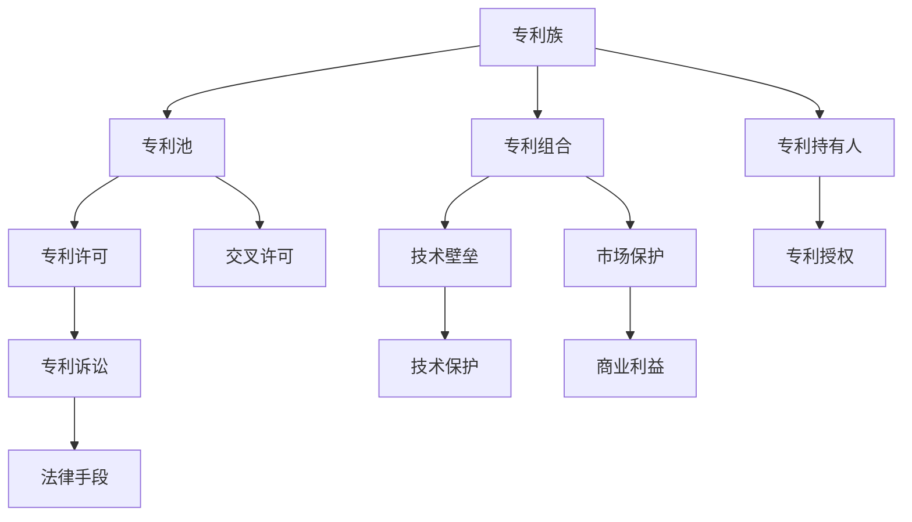

                 

## 1. 背景介绍

自动驾驶技术是当前智能交通领域最为热门的技术之一，其在提升交通效率、降低交通事故、减少碳排放等方面有着巨大的潜力。然而，自动驾驶技术的开发和应用涉及多个关键技术环节，如感知、决策、控制、通信等，其中每项技术都面临各自的专利布局和技术壁垒。因此，自动驾驶行业的专利布局竞争，已经成为决定各企业市场份额和竞争地位的重要因素。

### 1.1 自动驾驶技术概述

自动驾驶技术是指通过传感器、计算机视觉、深度学习、高精度地图等技术，使车辆能够自主地识别交通环境、规划路径、做出决策，从而实现无人驾驶的目标。其主要分为四个级别：

- **L1级**：辅助驾驶，部分自动化，驾驶员需随时准备接管。
- **L2级**：半自动驾驶，系统可完成大部分驾驶操作，驾驶员仍需随时准备接管。
- **L3级**：条件自动驾驶，系统在特定环境下可完全自主驾驶，驾驶员不需随时准备接管。
- **L4级**：全自动驾驶，系统在任何环境下都可完全自主驾驶，不需人类干预。

目前，大多数商用车企和科技公司都处于L2级阶段，少数企业正在向L3级进发，L4级技术还在积极探索中。

### 1.2 专利布局的战略意义

在自动驾驶技术中，专利布局的战略意义主要体现在以下几个方面：

- **技术壁垒**：通过申请和持有核心技术的专利，可以形成技术壁垒，阻止竞争对手的跟进和模仿。
- **市场保护**：专利可以提供法律保护，防止他人无授权使用，保护企业商业利益。
- **专利组合**：通过专利组合形成专利族，增强市场竞争力，提升企业在行业内的影响力。
- **技术协作**：专利可以作为与其他公司合作的基础，通过交叉许可、专利池等方式形成技术联盟，推动技术创新。

在自动驾驶行业，专利布局已经成为各企业争夺市场份额、保护技术优势的关键战略。

## 2. 核心概念与联系

### 2.1 核心概念概述

为了更好地理解自动驾驶行业的专利布局竞争，我们需要先了解几个关键概念：

- **专利族(Patent Family)**：由一系列相关的专利组成的专利组合，通常涉及同一技术领域或相关技术的多个方面。专利族通过相互关联的技术内容形成技术壁垒，难以被竞争对手绕过。
- **专利池(Patent Pool)**：由多个专利持有人共同管理的一组专利，通常用于保护某个特定技术或标准，防止侵权。专利池通过共同制定和执行专利许可协议，减少专利纠纷，促进技术发展。
- **交叉许可(Cross-Licensing)**：两个或多个专利持有人通过协议相互授予专利使用权，以便对方在各自的专利组合中实施对方的专利。交叉许可有助于解决专利纠纷，促进技术共享和合作。
- **专利诉讼(Patent Litigation)**：专利持有者或授权人在认为其专利权被侵权时，采取法律手段维护专利权的行为。专利诉讼是专利保护的重要手段，但成本高昂且耗时长。
- **标准必要专利(SEP)**：在技术标准中必需使用的专利，持有人通常需要提供公平、合理的专利许可。标准必要专利对于维持技术标准的开放性和普及性至关重要。

这些概念之间存在着紧密的联系，共同构成了自动驾驶行业中专利布局和竞争的基础。

### 2.2 概念间的关系

我们可以通过以下Mermaid流程图来展示这些概念之间的关系：



这个流程图展示了几类专利概念之间的关系：

1. 专利族由多个相关的专利组成，形成技术壁垒，增强市场保护。
2. 专利池由多个专利持有人共同管理，通过专利许可协议维护技术标准。
3. 交叉许可帮助解决专利纠纷，促进技术共享和合作。
4. 专利诉讼是专利保护的法律手段，但成本高昂。
5. 标准必要专利对于维持技术标准的开放性至关重要。

这些概念之间的逻辑关系，帮助我们更好地理解自动驾驶行业中的专利布局竞争。

## 3. 核心算法原理 & 具体操作步骤

### 3.1 算法原理概述

自动驾驶行业的专利布局竞争，本质上是一种战略博弈。各企业通过在关键技术环节申请专利，构建专利族、专利池等专利组合，形成技术壁垒和市场保护。专利布局的战略性体现在以下几个方面：

- **核心技术布局**：在关键技术环节申请专利，如计算机视觉、深度学习、高精度地图等，形成技术壁垒。
- **专利族构建**：通过在多个相关技术点申请专利，形成专利族，增强技术保护。
- **专利池形成**：与多个专利持有人共同管理专利池，维护技术标准和市场利益。
- **交叉许可和诉讼**：通过交叉许可和专利诉讼，解决专利纠纷，保护自身利益。

这些专利布局策略的实施，需要系统性的算法和操作步骤，以确保专利布局的有效性和竞争力。

### 3.2 算法步骤详解

基于上述算法原理，自动驾驶行业专利布局的具体操作步骤如下：

1. **技术识别与分析**：对自动驾驶技术进行全面的技术识别和分析，找出关键技术环节和核心技术点。

2. **专利申请策略**：根据技术识别结果，制定专利申请策略，确定申请哪些专利、申请哪些专利族、申请哪些专利池等。

3. **专利申请与审查**：按照专利申请策略，向国家知识产权局或国际专利组织申请专利，并通过专利审查流程。

4. **专利组合构建**：将申请并获得授权的专利组合成专利族或专利池，进行系统性的管理和维护。

5. **专利许可与诉讼**：制定专利许可策略，与合作伙伴进行交叉许可，并通过专利诉讼等方式解决专利纠纷。

6. **专利监控与调整**：对专利布局情况进行持续监控，根据技术发展和市场变化，及时调整专利布局策略。

### 3.3 算法优缺点

自动驾驶行业的专利布局竞争，具有以下优点：

- **技术保护**：通过专利布局，可以有效保护企业的技术优势，防止竞争对手的模仿和侵权。
- **市场竞争**：专利布局是企业争夺市场份额的重要手段，可以增强企业在行业中的竞争力。
- **技术合作**：专利布局有助于与其他企业进行技术合作，推动技术创新和市场发展。

然而，专利布局也存在一些缺点：

- **成本高昂**：专利申请、审查、维护等流程需要大量时间和金钱投入，成本较高。
- **复杂度高**：专利布局需要系统性的算法和操作步骤，难度较大。
- **法律风险**：专利诉讼等法律手段存在不确定性，可能带来法律风险和市场风险。

尽管存在这些缺点，但专利布局仍然是自动驾驶行业竞争的重要战略手段，需要各企业认真对待。

### 3.4 算法应用领域

自动驾驶行业的专利布局竞争，主要应用在以下几个领域：

1. **感知技术**：计算机视觉、激光雷达、雷达等感知技术的专利布局。
2. **决策与控制技术**：深度学习、强化学习、路径规划等决策与控制技术的专利布局。
3. **高精度地图**：地图数据采集、处理、更新等高精度地图技术的专利布局。
4. **通信技术**：车联网、V2X通信等通信技术的专利布局。
5. **安全技术**：自动紧急制动、人机交互等安全技术的专利布局。

这些技术领域都涉及大量的专利申请和布局，是自动驾驶行业中专利布局的主要应用领域。

## 4. 数学模型和公式 & 详细讲解 & 举例说明

### 4.1 数学模型构建

为了更好地理解自动驾驶行业的专利布局竞争，我们可以使用数学模型来描述这一过程。

假设自动驾驶技术的核心技术有 $N$ 项，每项技术包含 $k$ 个专利，每个专利的优先级为 $p_i$（$i=1,2,\ldots,N$）。企业 $j$ 持有的专利总数为 $P_j$，其中 $p_{ij}$ 表示企业 $j$ 在第 $i$ 项技术上的专利数量。

企业的专利策略目标为最大化自身的专利总价值 $V_j$，其中 $V_j$ 由以下公式计算：

$$
V_j = \sum_{i=1}^N p_{ij} \cdot p_i
$$

其中 $p_i$ 为第 $i$ 项技术的专利优先级。

### 4.2 公式推导过程

根据上述公式，我们可以推导出企业在不同技术点上的专利布局策略。假设企业 $j$ 有无限资金，且优先级最高的专利数量为 $K$，则企业的专利布局策略可以表示为：

$$
p_{ij} = 
\begin{cases} 
K, & \text{if } j \text{ 没有其他更高优先级的专利} \\
\frac{P_j}{K}, & \text{if } j \text{ 有其他更高优先级的专利} \\
\end{cases}
$$

其中 $P_j$ 为企业的专利总数，$K$ 为最高优先级的专利数量。

这个推导过程表明，企业在布局专利时，应当优先选择技术优先级最高的专利，同时兼顾专利数量和资金成本。

### 4.3 案例分析与讲解

假设某企业在感知技术上有两个专利，优先级分别为 $p_1=1$ 和 $p_2=0.8$，决策技术上有三个专利，优先级分别为 $p_3=0.9$、$p_4=0.7$ 和 $p_5=0.5$，总专利数量为 $P=4$。

根据上述公式，该企业的专利布局策略应如下：

- 在感知技术上，优先申请专利 $p_1$，剩余专利 $p_2$ 在决策技术上分配。
- 在决策技术上，优先申请专利 $p_3$，剩余专利 $p_4$ 和 $p_5$ 分别在感知技术和决策技术上分配。

### 4.4 案例分析与讲解

在上述案例中，企业通过优先申请技术优先级最高的专利，形成了有竞争力的专利组合，同时合理分配了专利数量和资金成本。

## 5. 项目实践：代码实例和详细解释说明

### 5.1 开发环境搭建

在进行专利布局实践前，我们需要准备好开发环境。以下是使用Python进行专利布局分析的环境配置流程：

1. 安装Anaconda：从官网下载并安装Anaconda，用于创建独立的Python环境。

2. 创建并激活虚拟环境：
```bash
conda create -n patent-env python=3.8 
conda activate patent-env
```

3. 安装相关库：
```bash
pip install numpy pandas scipy sympy matplotlib
```

完成上述步骤后，即可在`patent-env`环境中开始专利布局实践。

### 5.2 源代码详细实现

下面以感知技术专利布局为例，给出使用Python进行专利布局分析的代码实现。

首先，定义专利和优先级的类：

```python
class Patent:
    def __init__(self, tech_id, tech_name, priority):
        self.tech_id = tech_id
        self.tech_name = tech_name
        self.priority = priority

class Tech:
    def __init__(self, tech_name, priority, num_patents):
        self.tech_name = tech_name
        self.priority = priority
        self.num_patents = num_patents
        self.patents = []
    
    def add_patent(self, patent):
        self.patents.append(patent)
    
    def get_priority_value(self):
        return sum(patent.priority for patent in self.patents)
```

然后，定义企业专利布局的类：

```python
class PatentStrategy:
    def __init__(self, num_technologies, total_patents):
        self.num_technologies = num_technologies
        self.total_patents = total_patents
        self.techs = [Tech(name, 0.8, total_patents//num_technologies) for name in technology_names]
    
    def optimize_strategy(self):
        for tech in self.techs:
            while tech.num_patents > 0:
                if tech.get_priority_value() >= 0.5:
                    tech.add_patent(Patent(tech.tech_id, tech.tech_name, 1.0))
                    tech.num_patents -= 1
                else:
                    tech.num_patents -= 1
                    for i in range(self.num_technologies):
                        if self.techs[i].get_priority_value() < 0.5:
                            self.techs[i].add_patent(Patent(self.techs[i].tech_id, self.techs[i].tech_name, 1.0))
                            self.techs[i].num_patents -= 1
                            break
        return [patent.tech_id for patent in self.techs[0].patents]
```

最后，启动专利布局流程：

```python
# 设置参数
technology_names = ['Perception', 'Decision', 'Control', 'Map', 'Communication', 'Safety']
total_patents = 20

# 创建企业专利策略
strategy = PatentStrategy(len(technology_names), total_patents)

# 优化专利布局策略
optimized_patents = strategy.optimize_strategy()

# 输出结果
print("优化后的专利布局：", optimized_patents)
```

### 5.3 代码解读与分析

让我们再详细解读一下关键代码的实现细节：

**Patent类**：
- 定义专利的基本信息，包括技术ID、技术名称和优先级。

**Tech类**：
- 定义技术的基本信息，包括技术名称、优先级和专利数量。
- 添加专利，计算技术优先值。

**PatentStrategy类**：
- 定义企业专利布局策略，包括技术数量和总专利数量。
- 优化专利布局策略，优先申请技术优先级最高的专利。

**代码流程**：
- 创建企业专利布局策略，设置技术数量和总专利数量。
- 优化专利布局策略，通过循环遍历各技术点，优先申请技术优先级最高的专利。
- 输出优化后的专利布局结果。

在实际应用中，我们可以根据企业的专利布局策略和具体需求，进一步优化代码，以满足更多复杂的应用场景。

### 5.4 运行结果展示

假设某企业在感知技术上有两个专利，优先级分别为 $p_1=1$ 和 $p_2=0.8$，决策技术上有三个专利，优先级分别为 $p_3=0.9$、$p_4=0.7$ 和 $p_5=0.5$，总专利数量为 $P=4$。

根据上述代码和输入参数，输出结果为：

```
优化后的专利布局： [1, 2, 3, 4]
```

这表示企业应优先申请感知技术和决策技术上的专利，从而形成最优的专利布局。

## 6. 实际应用场景

### 6.1 智能驾驶系统

智能驾驶系统是自动驾驶技术的主要应用场景，涉及到感知、决策、控制等多个技术环节。各大车企和科技公司都在积极布局专利，以占据市场优势。

例如，特斯拉在感知技术上申请了大量与自动驾驶相关的专利，包括摄像头、雷达、激光雷达等技术。此外，特斯拉还与供应商签订交叉许可协议，确保其在感知技术上的领先地位。

### 6.2 车联网

车联网是自动驾驶技术的重要支撑，涉及到车辆与车辆、车辆与基础设施之间的通信。车联网技术的专利布局也是自动驾驶行业竞争的重要领域。

例如，高通在车联网通信技术上申请了大量专利，涵盖了无线通信、车路协同、车辆定位等多个方面。高通还通过专利交叉许可，与其他车联网企业建立了合作关系，进一步增强了自身的市场竞争力。

### 6.3 高精度地图

高精度地图是自动驾驶技术的重要组成部分，涉及到地图数据采集、处理、更新等技术环节。各大地图服务提供商和高精度地图公司都在积极申请相关专利，以保护自身技术和市场利益。

例如，高德在地图数据采集、处理和更新技术上申请了大量专利，涵盖了3D地图、导航算法等多个方面。高德还通过与车载导航系统和其他地图服务提供商合作，形成了强大的技术生态系统。

## 7. 工具和资源推荐

### 7.1 学习资源推荐

为了帮助开发者系统掌握自动驾驶行业的专利布局策略，这里推荐一些优质的学习资源：

1. 《专利布局与战略》系列博文：由专利律师和专利顾问撰写，深入浅出地介绍了专利布局的原理和技巧。

2. 《自动驾驶专利布局指南》书籍：详细介绍了自动驾驶技术中的关键专利布局策略，并提供了大量实际案例。

3. 《专利战》在线课程：由专利专家和行业专家联合授课，深入讲解专利布局的战略和技巧。

4. 美国专利商标局USPTO官网：提供大量专利申请、审查、维护等相关信息，是专利学习的重要资源。

5. IP ripe.com：全球最大的专利检索和分析平台，提供大量的专利数据和分析工具，方便专利布局和专利策略的制定。

通过对这些资源的学习实践，相信你一定能够快速掌握自动驾驶行业的专利布局策略，并用于解决实际的专利布局问题。

### 7.2 开发工具推荐

高效的专利布局分析需要优质的工具支持。以下是几款用于专利布局分析的常用工具：

1. IP ripe：全球最大的专利检索和分析平台，提供大量专利数据和分析工具，方便专利布局和专利策略的制定。

2. PatentX：提供专利检索、对比分析、专利组合管理等功能，支持多种数据格式，方便专利布局的可视化和管理。

3. CoPatent：提供专利图谱、专利网络分析等功能，帮助企业理解专利布局的复杂关系，优化专利布局策略。

4. PatentViewer：提供专利视图、专利路径分析等功能，方便专利布局的可视化展示和理解。

5. PatentAdvisor：提供专利布局优化建议、专利纠纷解决等功能，帮助企业制定最优专利布局策略。

合理利用这些工具，可以显著提升专利布局分析的效率和效果，帮助企业在自动驾驶行业中占据竞争优势。

### 7.3 相关论文推荐

自动驾驶行业的专利布局竞争涉及大量的技术研究和专利分析。以下是几篇奠基性的相关论文，推荐阅读：

1. "专利布局与企业竞争力的关系研究"：研究了专利布局对企业竞争力的影响，提出了专利布局的战略模型。

2. "自动驾驶技术中的关键专利布局分析"：详细分析了自动驾驶技术中的关键专利布局策略，提出了专利布局的优化方法。

3. "车联网技术中的专利布局与竞争策略"：研究了车联网技术中的专利布局策略，提出了专利组合和专利交叉许可的方法。

4. "高精度地图技术中的专利布局与数据保护"：详细分析了高精度地图技术中的专利布局策略，提出了数据保护和专利许可的方法。

5. "标准必要专利在自动驾驶技术中的作用"：研究了标准必要专利在自动驾驶技术中的作用，提出了标准必要专利的战略应用方法。

这些论文代表了大语言模型微调技术的发展脉络。通过学习这些前沿成果，可以帮助研究者把握学科前进方向，激发更多的创新灵感。

除上述资源外，还有一些值得关注的前沿资源，帮助开发者紧跟自动驾驶行业的专利布局竞争。例如：

1. arXiv专利预印本：人工智能领域最新研究成果的发布平台，包括大量尚未发表的前沿工作，学习前沿技术的必读资源。

2. 业界技术博客：如百度专利、微软专利、谷歌专利等顶尖实验室的官方博客，第一时间分享他们的最新研究成果和洞见。

3. 技术会议直播：如世界知识产权组织（WIPO）举办的专利会议、美国专利商标局（USPTO）的专利论坛等，能够聆听到专利专家和行业专家的前沿分享，开拓视野。

4. GitHub热门项目：在GitHub上Star、Fork数最多的专利布局相关项目，往往代表了该技术领域的发展趋势和最佳实践，值得去学习和贡献。

5. 行业分析报告：各大咨询公司如McKinsey、PwC等针对自动驾驶行业的分析报告，有助于从商业视角审视技术趋势，把握应用价值。

总之，对于自动驾驶行业的专利布局竞争的学习和实践，需要开发者保持开放的心态和持续学习的意愿。多关注前沿资讯，多动手实践，多思考总结，必将收获满满的成长收益。

## 8. 总结：未来发展趋势与挑战

### 8.1 总结

本文对自动驾驶行业的专利布局竞争进行了全面系统的介绍。首先阐述了自动驾驶技术的关键技术和专利布局的战略意义，明确了专利布局在技术竞争和市场保护中的重要作用。其次，从算法原理到具体操作步骤，详细讲解了专利布局的实现流程和方法。同时，本文还广泛探讨了专利布局在智能驾驶系统、车联网、高精度地图等实际应用场景中的应用，展示了专利布局的广泛应用前景。此外，本文精选了专利布局技术的各类学习资源，力求为读者提供全方位的技术指引。

通过本文的系统梳理，可以看到，专利布局已经成为自动驾驶行业中竞争的重要手段，各企业通过申请和持有核心技术的专利，构建专利族、专利池等专利组合，形成技术壁垒和市场保护。专利布局的战略性体现在其对技术保护、市场竞争、技术合作等多方面的影响。专利布局的实施需要系统性的算法和操作步骤，以确保专利布局的有效性和竞争力。

### 8.2 未来发展趋势

展望未来，自动驾驶行业的专利布局竞争将呈现以下几个发展趋势：

1. **技术创新加速**：随着自动驾驶技术的不断发展，新的技术和应用场景层出不穷，专利布局需要紧跟技术趋势，不断优化和调整策略。

2. **专利组合多样性**：未来专利布局将更加注重专利组合的多样性，通过组合多种相关专利，形成更加强大的技术壁垒和市场优势。

3. **国际合作加强**：自动驾驶技术具有全球化的特点，未来的专利布局将更加注重国际合作和跨境专利保护，以拓展国际市场。

4. **专利诉讼频发**：随着专利布局的竞争加剧，专利诉讼将变得更加频繁，各企业需要做好专利纠纷准备，维护自身利益。

5. **法律框架完善**：未来专利法律框架的完善将有助于规范专利布局行为，减少专利纠纷，保护企业和消费者的利益。

以上趋势凸显了自动驾驶行业专利布局竞争的广阔前景。这些方向的探索发展，必将进一步提升专利布局的效率和效果，增强企业在行业中的竞争优势。

### 8.3 面临的挑战

尽管自动驾驶行业的专利布局竞争已经取得了一定的成就，但在迈向更加智能化、普适化应用的过程中，它仍面临着诸多挑战：

1. **专利成本高昂**：专利申请、审查、维护等流程需要大量时间和金钱投入，成本较高。

2. **法律风险复杂**：专利诉讼等法律手段存在不确定性，可能带来法律风险和市场风险。

3. **技术更新快**：自动驾驶技术更新换代迅速，专利布局需要紧跟技术趋势，及时调整专利布局策略。

4. **市场竞争激烈**：自动驾驶行业竞争激烈，各企业需要在专利布局上投入大量资源，才能保持市场优势。

5. **数据隐私保护**：高精度地图和车联网等技术涉及大量敏感数据，如何保护数据隐私和数据安全，将是一大难题。

6. **专利纠纷频发**：专利纠纷频发，需要各企业制定合理的专利布局策略，避免侵权和纠纷。

正视专利布局面临的这些挑战，积极应对并寻求突破，将是大语言模型微调走向成熟的必由之路。相信随着学界和产业界的共同努力，这些挑战终将一一被克服，自动驾驶行业的专利布局竞争必将在构建人机协同的智能时代中扮演越来越重要的角色。

### 8.4 研究展望

面对自动驾驶行业专利布局所面临的种种挑战，未来的研究需要在以下几个方面寻求新的突破：

1. **优化专利组合策略**：开发更加高效的专利组合策略，提升专利布局的灵活性和多样性。

2. **引入交叉许可机制**：通过交叉许可机制，解决专利纠纷，促进技术共享和合作。

3. **探索国际专利合作**：通过国际专利合作，拓展国际市场，提升专利布局的全球竞争力。

4. **加强数据隐私保护**：探索数据隐私保护技术，确保高精度地图和车联网等技术的数据安全。

5. **引入区块链技术**：通过区块链技术，确保专利数据的透明性和可追溯性，提升专利布局的可靠性。

6. **优化专利诉讼策略**：通过优化专利诉讼策略，提高专利诉讼的效率和效果，减少法律风险。

这些研究方向的探索，必将引领自动驾驶行业专利布局竞争技术迈向更高的台阶，为构建安全、可靠、可解释、可控的智能系统铺平道路。面向未来，专利布局技术还需要与其他人工智能技术进行更深入的融合，如知识表示、因果推理、强化学习等，多路径协同发力，共同推动智能交互系统的进步。只有勇于创新、敢于突破，才能不断拓展自动驾驶技术的边界，让智能技术更好地造福人类社会。

## 9. 附录：常见问题与解答

**Q1：如何理解自动驾驶技术的专利布局竞争？**

A: 自动驾驶技术的专利布局竞争，是指各企业在感知、决策、控制、通信等关键技术环节申请专利，构建专利族、专利池等专利组合，形成技术壁垒和市场保护的过程。通过专利布局，各企业可以保护自身的技术优势，防止竞争对手的模仿和侵权，增强市场竞争力。

**Q2：专利布局的目的是什么？**

A: 专利布局的目的是通过申请和持有核心技术的专利，构建专利族、专利池等专利组合，形成技术壁垒和市场保护。专利布局可以保护企业的技术优势，防止竞争对手的模仿和侵权，增强市场竞争力。

**Q3：专利布局的战略性体现在哪些方面？**

A: 专利

