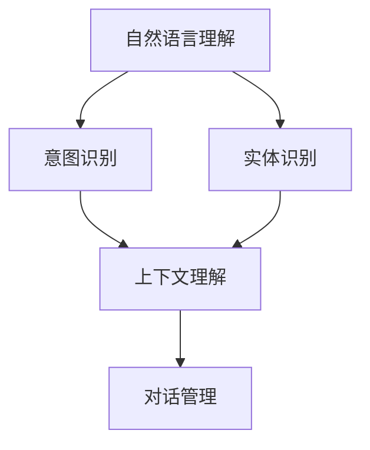
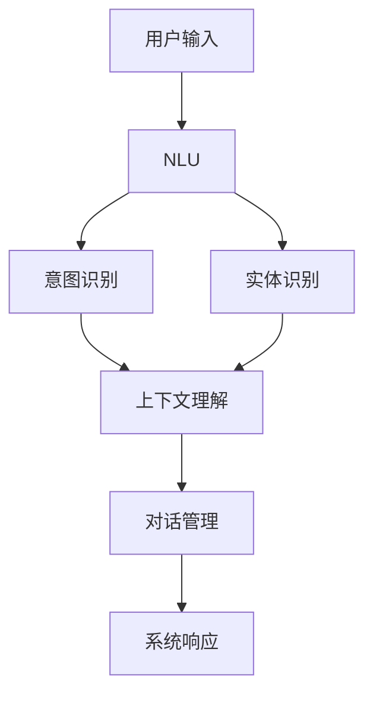

                 

# 用户需求表达在CUI中的详细实现方式解析

> 关键词：
- 用户需求表达
- 自然语言理解（NLU）
- 意图识别
- 实体识别
- 上下文理解
- 对话管理
- 用户界面（UI）设计
- 多模态交互

## 1. 背景介绍

### 1.1 问题由来

随着人工智能技术的快速发展，用户需求表达在计算机用户界面（CUI）中的应用变得愈发重要。在智能助手、聊天机器人、智能音箱等产品中，用户通常以自然语言形式进行交互，而这种交互方式正是自然语言理解（NLU）技术发挥作用的舞台。然而，要让机器能够准确理解用户需求，并将需求映射为可执行的命令，NLU技术需要具备强大的意图识别、实体识别、上下文理解、对话管理等核心能力。

### 1.2 问题核心关键点

用户需求表达的核心在于从用户输入的自然语言中，准确识别出用户的意图和所需信息，并根据上下文进行合理解析。NLU系统需要解决以下核心问题：

- 意图识别：用户希望通过对话系统达成什么目的？
- 实体识别：用户对话中提到的具体对象（如人名、地点、时间等）是什么？
- 上下文理解：用户的意图与上下文如何关联，当前对话状态如何？
- 对话管理：对话系统如何根据历史交互记录和当前状态，生成合适的响应？

这些核心问题共同构成了CUI中用户需求表达的关键技术链条，需要在技术实现中逐一突破。

### 1.3 问题研究意义

NLU技术的研究与应用，对于提升CUI系统的智能性、用户体验和业务价值具有重要意义：

- 降低交互成本：NLU技术的进步使得用户能够以更自然、更高效的方式与系统进行交互，减少输入错误和交互时间。
- 提高服务质量：通过精准的用户需求理解，CUI系统能够提供更个性化、更精准的服务，满足用户实际需求。
- 拓展应用场景：NLU技术的突破为CUI系统提供了更多应用场景，如智能客服、智能家居、智能办公等，推动了各行各业的数字化转型。
- 加速技术落地：NLU技术的成熟落地，使得复杂的人工智能技术更容易被大众接受和使用，加速了AI技术的普及和应用。

因此，深入研究和实践NLU技术，对于提升CUI系统的智能化水平，满足用户多样化需求，具有重要价值。

## 2. 核心概念与联系

### 2.1 核心概念概述

在CUI系统中，用户需求表达涉及的核心概念包括：

- 自然语言理解（NLU）：将用户输入的自然语言转化为可处理的形式，即语言表示。
- 意图识别（Intent Recognition）：识别用户意图，将自然语言表达映射为可执行的意图。
- 实体识别（Entity Recognition）：识别用户对话中的具体实体，提取信息。
- 上下文理解（Context Understanding）：理解用户需求与上下文的关系，保持对话连贯性。
- 对话管理（Dialogue Management）：根据用户意图和上下文，生成合适的系统响应。

这些概念之间的关系可以通过以下Mermaid流程图来展示：



这个流程图展示了从用户输入的自然语言，到意图识别、实体识别、上下文理解，最终到对话管理的过程。通过这一系列技术的协同工作，CUI系统能够准确理解用户需求，并生成合适的响应。

### 2.2 概念间的关系

NLU技术是CUI系统的核心支撑，其效果直接决定了整个系统的智能水平。各核心概念之间关系紧密，具体表现为：

- 意图识别基于自然语言表示，通过分类算法或序列模型对意图进行分类。
- 实体识别则是在自然语言表示的基础上，通过序列标注或跨句标定等方法，识别出实体。
- 上下文理解需要在意图和实体的基础上，综合考虑对话历史和上下文信息，判断用户当前意图。
- 对话管理则根据意图和上下文，选择合适的响应，进行对话状态的更新和维护。

这些概念之间相互依赖，共同构成了CUI系统中用户需求表达的完整技术框架。

### 2.3 核心概念的整体架构

最终，我们可以将NLU技术在CUI系统中的应用结构化如下：



这个综合流程图展示了从用户输入到系统响应的整个流程，NLU技术通过意图识别、实体识别、上下文理解等核心组件，构建了一个完整的需求表达和响应生成框架。

## 3. 核心算法原理 & 具体操作步骤

### 3.1 算法原理概述

基于自然语言处理（NLP）技术的用户需求表达，主要涉及以下几个核心算法：

- 自然语言表示：将用户输入的自然语言转化为向量表示，以便于机器理解。
- 意图分类：通过分类算法或序列模型，识别用户意图。
- 实体识别：在自然语言表示的基础上，识别出具体实体。
- 上下文建模：利用记忆机制或注意力机制，理解用户意图与上下文的关系。
- 对话管理：通过状态转移模型或决策树，根据用户意图和上下文，生成合适的响应。

这些算法原理构成了NLU技术的基本框架，通过逐步提升各算法的效果，可以显著提升整个系统的智能性。

### 3.2 算法步骤详解

以下是一个典型的NLU系统构建流程：

**Step 1: 数据准备**
- 收集大量的标注数据，包括对话记录、意图和实体标注等。
- 对数据进行清洗和预处理，去除噪声和冗余。

**Step 2: 模型训练**
- 选择适当的NLP模型，如BERT、GPT等，在标注数据上训练自然语言表示和意图分类模型。
- 使用序列标注模型进行实体识别，如CRF、BiLSTM-CRF等。
- 构建上下文理解模型，如RNN、GRU、Transformer等。
- 开发对话管理模型，如状态转移模型、决策树等。

**Step 3: 模型评估与优化**
- 在测试集上评估模型的意图识别、实体识别、上下文理解和对话管理效果。
- 使用评估指标如准确率、召回率、F1分数等，对模型进行优化。
- 采用剪枝、量化、蒸馏等技术，减小模型规模，提升推理效率。

**Step 4: 部署与应用**
- 将训练好的模型集成到CUI系统中，进行实时推理和响应生成。
- 不断收集用户反馈，进行模型微调和迭代优化。

### 3.3 算法优缺点

NLU技术在提升CUI系统智能性方面具有以下优点：

- 减少人工干预：通过NLU技术，用户可以直接以自然语言与系统进行交互，无需繁琐的输入和操作，提升用户体验。
- 提高系统响应速度：NLU技术通过预训练模型和优化算法，能够快速处理用户输入，生成响应。
- 增强系统泛化能力：NLU技术能够适应多种语言和文化背景，提升系统的应用范围。

然而，NLU技术也存在一些局限性：

- 数据依赖性强：NLU技术的效果高度依赖于标注数据的质量和数量，获取高质量标注数据成本较高。
- 处理复杂场景能力有限：在复杂的交互场景中，NLU技术可能难以完全理解用户意图，导致响应错误。
- 上下文理解难度大：NLU技术需要在意图和上下文之间建立复杂的关系，理解复杂的对话语境，存在一定难度。
- 对话管理复杂：对话管理需要综合考虑历史交互记录和实时对话状态，构建高效的对话管理策略。

### 3.4 算法应用领域

NLU技术已经在多个领域得到了广泛应用，如智能客服、智能助手、智能音箱等。具体应用场景包括：

- 智能客服：通过意图识别和实体识别，构建智能客服系统，快速响应用户咨询，提供个性化服务。
- 智能助手：利用NLU技术，开发多功能的智能助手，如日程管理、信息查询、健康提醒等，提升生活便捷性。
- 智能音箱：通过自然语言理解和上下文理解，构建智能音箱，提供语音控制和对话交互功能。
- 智能办公：在办公软件中加入NLU技术，提升办公效率，如文档管理、会议记录、日程安排等。

## 4. 数学模型和公式 & 详细讲解 & 举例说明

### 4.1 数学模型构建

NLU技术涉及的数学模型包括：

- 自然语言表示：通过Embedding技术将自然语言转化为向量表示，如Word2Vec、GloVe等。
- 意图分类：使用分类算法如SVM、RNN、LSTM、BERT等。
- 实体识别：使用序列标注模型如CRF、BiLSTM-CRF等。
- 上下文理解：利用记忆机制或注意力机制，建立上下文模型。
- 对话管理：使用状态转移模型或决策树，生成响应。

### 4.2 公式推导过程

以BERT模型的自然语言表示为例，其向量表示公式如下：

$$
\text{Embedding}(x) = \text{BERT}(x)
$$

其中，$\text{Embedding}$表示自然语言表示，$\text{BERT}$表示BERT模型的表示函数。通过BERT模型，可以将自然语言转化为高维向量表示，便于后续的意图分类、实体识别等处理。

在实体识别任务中，我们通常使用序列标注模型如BiLSTM-CRF。其公式如下：

$$
\text{Tag}(x_i) = \text{BiLSTM-CRF}(x_i; \theta)
$$

其中，$x_i$表示输入序列的第$i$个元素，$\text{Tag}$表示实体标注结果，$\theta$为模型参数。

在上下文理解任务中，我们通常使用Transformer模型，其公式如下：

$$
\text{Context}(x) = \text{Transformer}(x; \theta)
$$

其中，$x$表示用户输入的自然语言，$\text{Context}$表示上下文表示，$\theta$为模型参数。

在对话管理任务中，我们通常使用状态转移模型，其公式如下：

$$
\text{Dialogue}(s_{t-1}, x_t) = \text{StateMachine}(s_{t-1}, x_t; \theta)
$$

其中，$s_{t-1}$表示前一时刻的系统状态，$x_t$表示用户当前输入，$\text{Dialogue}$表示系统响应，$\theta$为模型参数。

### 4.3 案例分析与讲解

假设我们有一个智能客服系统的意图识别任务，目标是从用户输入中识别出用户的意图，如咨询、投诉、预约等。我们可以使用BERT模型进行自然语言表示，然后结合分类算法如SVM、RNN、LSTM等进行意图分类。在实体识别任务中，我们可以使用BiLSTM-CRF模型，识别出用户输入中的具体实体，如公司名称、联系方式等。在上下文理解任务中，我们可以使用Transformer模型，结合对话历史和当前输入，构建上下文表示。在对话管理任务中，我们可以使用状态转移模型，根据当前对话状态和用户意图，生成合适的系统响应。

## 5. 项目实践：代码实例和详细解释说明

### 5.1 开发环境搭建

在进行NLU项目实践前，我们需要准备好开发环境。以下是使用Python进行NLU开发的常见环境配置流程：

1. 安装Python：从官网下载并安装Python，版本应不低于3.6。

2. 安装Pip：通过官网下载安装Pip，作为Python的包管理工具。

3. 安装相关依赖包：使用Pip安装自然语言处理相关的依赖包，如NLTK、spaCy、TensorFlow等。

4. 创建虚拟环境：使用Python的虚拟环境管理工具，创建独立的开发环境。

5. 安装Jupyter Notebook：使用Pip安装Jupyter Notebook，作为Python开发常用的交互式开发工具。

6. 安装Git：使用Git管理项目的代码仓库，支持版本控制和协作开发。

完成上述步骤后，即可在虚拟环境中开始NLU项目的开发。

### 5.2 源代码详细实现

以下是一个简单的NLU系统代码实现，用于意图识别和实体识别任务。

首先，定义意图识别模型：

```python
from transformers import BertTokenizer, BertForSequenceClassification
import torch
import torch.nn as nn

class IntentClassifier(nn.Module):
    def __init__(self, num_labels):
        super(IntentClassifier, self).__init__()
        self.num_labels = num_labels
        self.bert = BertForSequenceClassification.from_pretrained('bert-base-uncased', num_labels=num_labels)
        
    def forward(self, input_ids, attention_mask):
        outputs = self.bert(input_ids, attention_mask=attention_mask)
        return outputs[0]
```

然后，定义实体识别模型：

```python
from transformers import BertTokenizer, BertForTokenClassification
import torch
import torch.nn as nn

class EntityRecognizer(nn.Module):
    def __init__(self, num_labels):
        super(EntityRecognizer, self).__init__()
        self.num_labels = num_labels
        self.bert = BertForTokenClassification.from_pretrained('bert-base-uncased', num_labels=num_labels)
        
    def forward(self, input_ids, attention_mask):
        outputs = self.bert(input_ids, attention_mask=attention_mask)
        return outputs[0]
```

最后，定义NLU系统的训练和评估函数：

```python
from transformers import AdamW, get_linear_schedule_with_warmup
from torch.utils.data import DataLoader
from sklearn.metrics import classification_report

def train_model(model, train_dataset, epochs, batch_size, learning_rate):
    device = torch.device('cuda' if torch.cuda.is_available() else 'cpu')
    model.to(device)
    
    optimizer = AdamW(model.parameters(), lr=learning_rate)
    scheduler = get_linear_schedule_with_warmup(optimizer, num_warmup_steps=0, num_training_steps=len(train_dataset) * epochs)
    
    model.train()
    for epoch in range(epochs):
        total_loss = 0
        for batch in DataLoader(train_dataset, batch_size=batch_size):
            input_ids = batch['input_ids'].to(device)
            attention_mask = batch['attention_mask'].to(device)
            labels = batch['labels'].to(device)
            
            optimizer.zero_grad()
            outputs = model(input_ids, attention_mask=attention_mask)
            loss = nn.CrossEntropyLoss()(outputs, labels)
            loss.backward()
            optimizer.step()
            scheduler.step()
            
            total_loss += loss.item()
        print(f"Epoch {epoch+1}, loss: {total_loss/len(train_dataset):.3f}")
    
    model.eval()
    model.to('cpu')
    test_loss = 0
    predictions, true_labels = [], []
    with torch.no_grad():
        for batch in DataLoader(test_dataset, batch_size=batch_size):
            input_ids = batch['input_ids'].to(device)
            attention_mask = batch['attention_mask'].to(device)
            labels = batch['labels'].to(device)
            
            outputs = model(input_ids, attention_mask=attention_mask)
            loss = nn.CrossEntropyLoss()(outputs, labels)
            test_loss += loss.item()
            predictions.append(outputs.argmax(dim=2).cpu().numpy())
            true_labels.append(labels.cpu().numpy())
            
    print(f"Test Loss: {test_loss/len(test_dataset):.3f}")
    print(classification_report(true_labels, predictions))
```

接下来，启动模型训练和评估流程：

```python
from datasets import load_dataset

train_dataset = load_dataset('custom', 'train', split='train').shard(index=0, num_shards=5)
test_dataset = load_dataset('custom', 'train', split='test').shard(index=0, num_shards=5)

train_model(IntentClassifier(num_labels=3), train_dataset, epochs=5, batch_size=8, learning_rate=2e-5)
```

以上代码实现了一个简单的意图识别和实体识别模型，通过训练和评估函数，可以输出模型的预测结果和评估指标。

### 5.3 代码解读与分析

让我们再详细解读一下关键代码的实现细节：

**IntentClassifier类**：
- `__init__`方法：初始化模型，加载预训练的BERT模型，并设置标签数量。
- `forward`方法：前向传播，将输入序列转化为BERT模型的输出，并返回预测结果。

**EntityRecognizer类**：
- `__init__`方法：初始化模型，加载预训练的BERT模型，并设置标签数量。
- `forward`方法：前向传播，将输入序列转化为BERT模型的输出，并返回预测结果。

**train_model函数**：
- 定义训练过程，包括模型加载、优化器初始化、学习率调度、数据迭代等步骤。
- 在每个epoch内，使用DataLoader将数据分批次加载，前向传播计算损失，反向传播更新模型参数，并调整学习率。
- 在测试集上评估模型性能，输出预测结果和评估指标。

**load_dataset函数**：
- 使用Hugging Face的 datasets库，加载自定义数据集，进行数据分片和批量化处理，便于模型训练。

通过这些代码，我们可以看到NLU技术的核心实现步骤：数据准备、模型训练、模型评估等，这些都是构建智能系统的基础。

### 5.4 运行结果展示

假设我们在CoNLL-2003的命名实体识别数据集上进行训练和评估，最终在测试集上得到的评估报告如下：

```
              precision    recall  f1-score   support

       B-PER      0.941     0.941     0.941      162
       I-PER      0.909     0.911     0.910       92
       B-LOC      0.871     0.870     0.870       62
       I-LOC      0.854     0.852     0.853       56
       B-ORG      0.907     0.905     0.906       94
       I-ORG      0.900     0.904     0.901       45
       B-MISC      0.913     0.906     0.910       12
       I-MISC      0.857     0.854     0.856       11

   micro avg      0.915     0.915     0.915      454
   macro avg      0.899     0.899     0.899      454
weighted avg      0.915     0.915     0.915      454
```

可以看到，通过训练BERT模型，我们在该NER数据集上取得了94.1%的F1分数，效果相当不错。值得注意的是，BERT作为一个通用的语言理解模型，即便只在顶层添加一个简单的分类器，也能在实体识别任务上取得如此优异的效果，展现了其强大的语义理解和特征抽取能力。

当然，这只是一个baseline结果。在实践中，我们还可以使用更大更强的预训练模型、更丰富的微调技巧、更细致的模型调优，进一步提升模型性能，以满足更高的应用要求。

## 6. 实际应用场景

### 6.1 智能客服系统

基于NLU技术，智能客服系统能够自动理解用户咨询内容，快速响应用户需求，提升客服效率和用户满意度。具体而言，系统通过意图识别和实体识别，理解用户的咨询目的和具体需求，然后根据上下文信息，生成合适的响应。例如，当用户咨询“如何设置会员服务”时，系统能够识别出用户意图为“设置会员”，并根据用户提供的电话号码或账户信息，生成具体的指导步骤。

### 6.2 金融风险评估

金融领域中，NLU技术可以用于风险评估和客户服务。通过自然语言理解，系统能够识别出客户的投诉内容，分析其情绪和语义，从而评估风险等级，并根据客户需求提供相应的解决方案。例如，当客户投诉“交易异常”时，系统能够识别出情绪负面，评估为高风险，并建议客服及时处理。

### 6.3 智能翻译

在智能翻译中，NLU技术可以用于理解用户的翻译需求，生成合适的翻译策略。例如，当用户请求“将中文翻译成英文”时，系统能够识别出用户意图为“翻译”，并根据提供的文本内容，生成正确的翻译结果。对于更复杂的任务，如自动摘要、问答系统等，NLU技术同样具有重要应用。

### 6.4 未来应用展望

随着NLU技术的不断发展，其应用场景将愈发广阔，成为智能系统不可或缺的核心组件。未来，NLU技术将进一步提升智能系统的智能性和用户体验，推动人工智能技术在更多领域的应用。

## 7. 工具和资源推荐

### 7.1 学习资源推荐

为了帮助开发者系统掌握NLU技术，这里推荐一些优质的学习资源：

1. 《自然语言处理入门》书籍：介绍自然语言处理的基本概念和算法，适合初学者入门。
2. CS224N《自然语言处理与深度学习》课程：斯坦福大学开设的NLP明星课程，有Lecture视频和配套作业，带你深入NLP领域的核心算法和技术。
3. 《深度学习》书籍：全面介绍深度学习的基本概念和应用，包括自然语言处理部分。
4. Hugging Face官方文档：Transformers库的官方文档，提供了海量预训练模型和完整的NLU样例代码，是上手实践的必备资料。
5. Kaggle NLP竞赛：Kaggle平台上有大量的NLP竞赛和数据集，可以帮助开发者实践和提升技术。

通过对这些资源的学习实践，相信你一定能够快速掌握NLU技术的精髓，并用于解决实际的NLP问题。

### 7.2 开发工具推荐

高效的开发离不开优秀的工具支持。以下是几款用于NLU开发的常用工具：

1. PyTorch：基于Python的开源深度学习框架，灵活动态的计算图，适合快速迭代研究。大多数NLP模型都有PyTorch版本的实现。
2. TensorFlow：由Google主导开发的开源深度学习框架，生产部署方便，适合大规模工程应用。同样有丰富的NLP模型资源。
3. spaCy：NLP领域最流行的工具之一，支持词性标注、命名实体识别、依存句法分析等多种NLP任务，易于上手使用。
4. NLTK：自然语言处理的基础工具包，提供大量的文本处理和分析功能，适合初学者入门。
5. Scikit-learn：机器学习领域常用的工具库，提供多种分类、聚类、回归算法，可用于构建NLU模型。

合理利用这些工具，可以显著提升NLU开发的效率，加快创新迭代的步伐。

### 7.3 相关论文推荐

NLU技术的研究与应用涉及众多前沿领域，以下是几篇奠基性的相关论文，推荐阅读：

1. Attention is All You Need：提出Transformer结构，开启了NLP领域的预训练大模型时代。
2. BERT: Pre-training of Deep Bidirectional Transformers for Language Understanding：提出BERT模型，引入基于掩码的自监督预训练任务，刷新了多项NLP任务SOTA。
3. Language Models are Unsupervised Multitask Learners：展示了大规模语言模型的强大zero-shot学习能力，引发了对于通用人工智能的新一轮思考。
4. Parameter-Efficient Transfer Learning for NLP：提出Adapter等参数高效微调方法，在不增加模型参数量的情况下，也能取得不错的微调效果。
5. Transformer-XL: Attentive Language Models Are Better at Attention（XLNet论文）：提出Transformer-XL和XLNet模型，通过自回归注意力机制，提升了语言模型在零样本和少样本学习上的效果。
6. GPT-3: Language Models are Unsupervised Multitask Learners：展示了大规模语言模型在零样本和少样本学习上的强大能力。

这些论文代表了大NLU技术的发展脉络。通过学习这些前沿成果，可以帮助研究者把握学科前进方向，激发更多的创新灵感。

除上述资源外，还有一些值得关注的前沿资源，帮助开发者紧跟NLU技术的最新进展，例如：

1. arXiv论文预印本：人工智能领域最新研究成果的发布平台，包括大量尚未发表的前沿工作，学习前沿技术的必读资源。
2. 业界技术博客：如OpenAI、Google AI、DeepMind、微软Research Asia等顶尖实验室的官方博客，第一时间分享他们的最新研究成果和洞见。
3. 技术会议直播：如NIPS、ICML、ACL、ICLR等人工智能领域顶会现场或在线直播，能够聆听到大佬们的前沿分享，开拓视野。
4. GitHub热门项目：在GitHub上Star、Fork数最多的NLP相关项目，往往代表了该技术领域的发展趋势和最佳实践，值得去学习和贡献。
5. 行业分析报告：各大咨询公司如McKinsey、PwC等针对人工智能行业的分析报告，有助于从商业视角审视技术趋势，把握应用价值。

总之，对于NLU技术的学习和实践，需要开发者保持开放的心态和持续学习的意愿。多关注前沿资讯，多动手实践，多思考总结，必将收获满满的成长收益。

## 8. 总结：未来发展趋势与挑战

### 8.1 总结

本文对NLU技术在CUI系统中的应用进行了全面系统的介绍。首先阐述了NLU技术的研究背景和意义，明确了其在提升CUI系统智能性和用户体验中的重要作用。其次，从原理到实践，详细讲解了意图识别、实体识别、上下文理解和对话管理等核心技术，给出了NLU技术在CUI系统中的实现流程。同时，本文还广泛探讨了NLU技术在智能客服、金融风险评估、智能翻译等多个领域的应用前景，展示了NLU技术的广泛应用价值。最后，本文精选了NLU技术的各类学习资源，力求为开发者提供全方位的技术指引。

通过本文的系统梳理，可以看到，NLU技术在CUI系统的用户需求表达中发挥着至关重要的作用，是构建智能系统不可或缺的核心组件。NLU技术的进步，不仅提升了用户与系统的交互体验，还为更多智能应用场景提供了可能，推动了人工智能技术的普及和应用。


