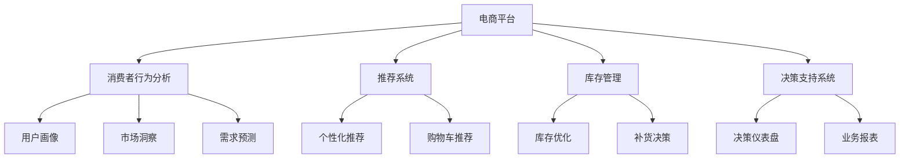
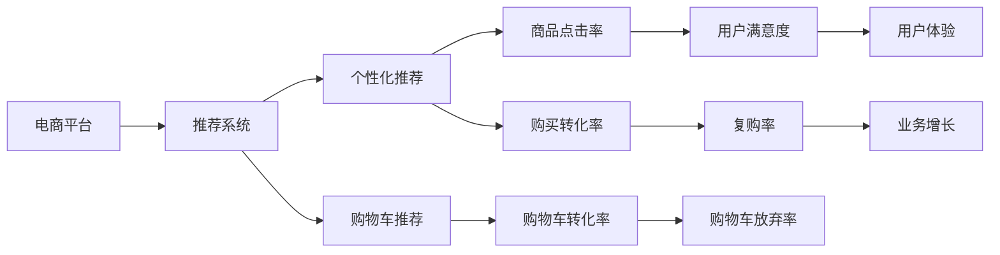
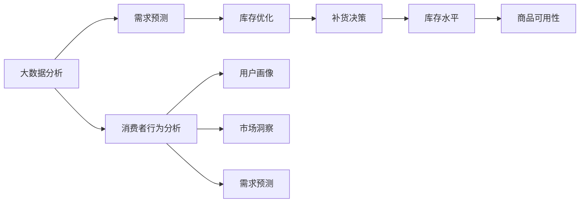
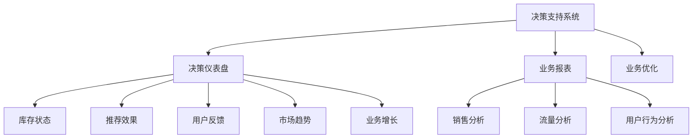
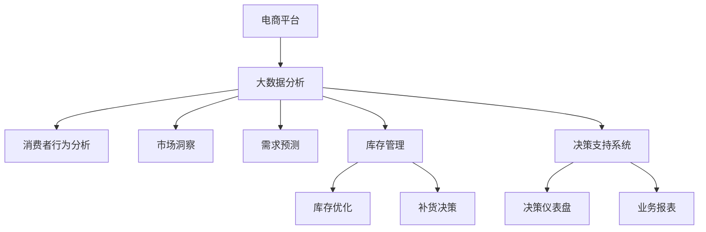

                 

# 电商平台供给能力提升：大数据分析应用

> 关键词：电商平台,供给能力,大数据分析,推荐系统,消费者行为分析,库存管理,决策支持系统

## 1. 背景介绍

### 1.1 问题由来

近年来，随着电子商务的迅猛发展，电商平台在为消费者提供便捷购物体验的同时，面临着日益严峻的供给能力挑战。为了应对这一问题，电商平台引入了一系列大数据分析技术，通过深入挖掘用户行为和市场动态，优化库存管理、提升推荐系统的精准度，从而显著提升供给能力。本文将详细探讨大数据分析在电商平台供给能力提升中的应用，并提出相关技术和方法，以供参考。

### 1.2 问题核心关键点

电商平台供给能力提升的核心在于通过大数据分析技术，实现对库存、需求、推荐系统的优化，确保及时响应消费者需求，减少库存积压和缺货现象，提高供应链效率。具体来说，包括：

- 数据采集：通过日志、交易、搜索等多种渠道，全面采集用户行为数据和市场动态数据。
- 数据分析：利用机器学习、数据挖掘等算法，对采集到的数据进行深度分析，提取有价值的信息。
- 系统优化：根据分析结果，调整库存水平、优化推荐算法，提升电商平台供给能力。
- 决策支持：通过可视化仪表盘、报表等形式，将分析结果呈现给管理人员，辅助其做出科学决策。

本文将重点介绍电商平台供给能力提升的各个环节，并结合实例，阐述大数据分析技术的具体应用。

## 2. 核心概念与联系

### 2.1 核心概念概述

为更好地理解电商平台供给能力提升的背景和大数据分析技术的核心思想，本节将介绍几个关键概念：

- 电商平台：基于互联网的在线交易平台，提供商品展示、购买、支付、物流等一站式服务。
- 供给能力：指电商平台在特定时间内的商品可用性，即库存水平、物流能力、服务质量等综合表现。
- 大数据分析：通过收集、存储、处理和分析海量数据，提取有价值的信息，支持决策制定的技术方法。
- 推荐系统：利用用户行为数据，预测用户兴趣，推送个性化商品的技术系统。
- 消费者行为分析：通过分析用户行为数据，挖掘用户需求、购买偏好等，为电商平台提供用户画像和市场洞察。
- 库存管理：通过优化库存水平和结构，提升商品的可得性和用户满意度。
- 决策支持系统：利用数据分析结果，辅助管理人员进行决策，提高决策效率和准确性。

这些概念之间相互关联，共同构成了电商平台供给能力提升的核心框架。下面通过一个Mermaid流程图来展示这些概念之间的联系：



通过这个流程图，我们可以看到，消费者行为分析通过挖掘用户行为数据，帮助电商平台构建用户画像、洞察市场、预测需求，从而优化推荐系统、库存管理、支持决策。

### 2.2 概念间的关系

这些核心概念之间存在着紧密的联系，形成了电商平台供给能力提升的完整生态系统。下面我通过几个Mermaid流程图来展示这些概念之间的关系。

#### 2.2.1 电商平台与推荐系统的关系



这个流程图展示了电商平台与推荐系统之间的双向关系。电商平台通过推荐系统提供个性化推荐，提升用户购买体验，增加订单量。同时，推荐系统根据用户行为数据，调整推荐策略，进一步优化用户体验。

#### 2.2.2 大数据分析与库存管理的关系



这个流程图展示了大数据分析在库存管理中的应用。大数据分析通过消费者行为分析，预测用户需求，优化库存水平，确保商品供应充足。同时，通过对市场洞察和用户画像的深入分析，帮助电商平台制定合理的补货决策，提高库存管理效率。

#### 2.2.3 决策支持系统的功能



这个流程图展示了决策支持系统的主要功能。决策支持系统通过仪表盘、报表等形式，呈现大数据分析的结果，辅助管理人员进行库存管理、推荐系统优化、业务增长分析等决策，从而提升电商平台整体运营效率。

### 2.3 核心概念的整体架构

最后，我们用一个综合的流程图来展示这些核心概念在大数据分析在电商平台供给能力提升过程中的整体架构：



通过这个综合流程图，我们可以更清晰地理解大数据分析在电商平台供给能力提升过程中的各个环节和相互关系，为后续深入讨论具体技术和方法奠定基础。

## 3. 核心算法原理 & 具体操作步骤
### 3.1 算法原理概述

电商平台供给能力提升的核心算法主要基于大数据分析技术，包括消费者行为分析、需求预测、库存管理、推荐系统优化等。这些算法共同作用，确保电商平台的供给能力能够适应市场变化和用户需求，提升用户体验和平台竞争力。

大数据分析算法主要包括：

- 机器学习算法：如决策树、随机森林、梯度提升、深度学习等，用于模型训练和预测。
- 数据挖掘算法：如关联规则挖掘、聚类分析、文本挖掘等，用于数据预处理和特征提取。
- 自然语言处理算法：如情感分析、主题模型、命名实体识别等，用于用户行为分析和市场洞察。
- 时间序列分析算法：如ARIMA、LSTM等，用于需求预测和库存管理。

这些算法在大数据分析过程中相互配合，共同构建了电商平台供给能力提升的技术框架。

### 3.2 算法步骤详解

电商平台供给能力提升的大数据分析流程大致分为以下几步：

**Step 1: 数据采集与清洗**

- 采集电商平台的交易日志、搜索记录、用户行为数据等。
- 清洗数据，去除重复、缺失、异常值，保证数据质量和完整性。
- 将数据转换为适合分析的格式，如时间序列、分类数据、文本数据等。

**Step 2: 数据分析与建模**

- 利用机器学习、数据挖掘算法对数据进行特征提取和模型训练。
- 利用时间序列分析算法对需求进行预测。
- 利用自然语言处理算法对用户行为进行情感分析、主题模型分析等。
- 利用关联规则挖掘、聚类分析等算法对市场洞察进行挖掘。

**Step 3: 模型评估与优化**

- 对训练好的模型进行评估，如准确率、召回率、F1分数等。
- 根据评估结果调整模型参数，优化模型性能。
- 对优化后的模型进行验证，确保其在真实数据上的表现。

**Step 4: 系统集成与部署**

- 将优化后的模型集成到电商平台的推荐系统、库存管理系统等。
- 开发数据可视化仪表盘和报表，支持决策支持系统。
- 部署优化后的系统，确保其在实际环境中的稳定性和性能。

### 3.3 算法优缺点

大数据分析在电商平台供给能力提升中具有以下优点：

- 数据驱动：基于实证数据，科学决策，提升决策准确性。
- 动态调整：实时分析市场动态，快速响应变化，优化供给能力。
- 用户个性化：利用用户行为数据，提供个性化推荐，提升用户体验。
- 高效率：自动化数据分析和模型优化，节省人力和时间成本。

同时，也存在一些缺点：

- 数据质量依赖：分析结果依赖数据质量，低质量数据可能影响分析结果。
- 计算资源需求高：大数据分析需要大量计算资源，可能对硬件要求较高。
- 模型复杂性：多模型集成导致模型复杂，可能存在过拟合风险。
- 结果可解释性：部分算法结果难以解释，难以进行透明化决策。

### 3.4 算法应用领域

大数据分析在电商平台供给能力提升中的应用领域非常广泛，主要包括：

- 推荐系统优化：通过分析用户行为数据，优化推荐算法，提升个性化推荐效果。
- 库存管理：利用需求预测算法，优化库存水平，减少缺货和积压现象。
- 消费者行为分析：通过挖掘用户行为数据，洞察市场趋势，优化产品结构和营销策略。
- 需求预测：利用时间序列分析算法，预测市场需求，支持补货决策和库存优化。
- 营销优化：利用市场洞察和用户画像，制定精准营销策略，提升转化率和用户满意度。
- 决策支持：通过可视化仪表盘和报表，辅助管理人员进行决策，提升业务效率。

## 4. 数学模型和公式 & 详细讲解 & 举例说明
### 4.1 数学模型构建

电商平台供给能力提升的大数据分析模型主要包括以下几个部分：

- 用户行为模型：通过分析用户点击、购买、浏览等行为，预测用户兴趣和购买意图。
- 需求预测模型：利用时间序列分析算法，预测未来的市场需求。
- 库存优化模型：通过分析历史销售数据和库存水平，制定最优的补货和库存调整策略。
- 推荐系统模型：利用协同过滤、基于内容的推荐等算法，提供个性化推荐。

以下是一个基本的电商库存优化模型，用于预测未来的库存水平，并在预测结果的基础上制定补货决策：

$$
\hat{I}_{t+1} = \hat{D}_{t+1} - \hat{S}_{t+1} - K
$$

其中：
- $\hat{I}_{t+1}$：预测的t+1时间点的库存水平。
- $\hat{D}_{t+1}$：预测的t+1时间点的需求量。
- $\hat{S}_{t+1}$：预测的t+1时间点的供应链供货量。
- $K$：安全库存量，用于缓冲需求波动和供应链延迟。

### 4.2 公式推导过程

以需求预测模型为例，我们采用ARIMA时间序列分析算法进行推导。ARIMA模型分为三部分：自回归(AR)、差分积分(I)和移动平均(MA)。

假设原始时间序列为 $y_t$，则ARIMA(p,d,q)模型可以表示为：

$$
y_t = \phi(B)y_{t-p} + \theta(B)D^d(y_t) + \gamma B^q \epsilon_t
$$

其中：
- $y_t$：时间t的观察值。
- $\phi(B)$：AR部分的滞后算子多项式。
- $D^d$：差分算子，用于消除趋势和季节性。
- $B^q$：移动平均算子。
- $\epsilon_t$：白噪声序列。

对于电商平台，需求预测模型中的时间序列通常包含趋势和季节性。因此，可以采用ARIMA模型进行预测，具体步骤如下：

1. 数据预处理：对原始时间序列进行差分处理，去除趋势和季节性影响。
2. 模型训练：选择合适的ARIMA(p,d,q)模型，进行模型训练。
3. 模型评估：使用历史数据对模型进行评估，选择最优模型。
4. 模型预测：利用训练好的模型，对未来的需求进行预测。

### 4.3 案例分析与讲解

假设某电商平台销售某商品的历史数据如下：

| 时间 | 需求量 | 供应链供货量 | 安全库存量 |
| ---- | ---- | ---- | ---- |
| 1    | 100  | 150  | 20  |
| 2    | 120  | 130  | 20  |
| 3    | 110  | 140  | 20  |
| ...  | ...  | ...  | ... |

根据上述历史数据，我们可以采用时间序列分析算法（如ARIMA模型）进行需求预测，预测下一时间点的需求量，并结合供应链供货量和安全库存量，制定补货决策。

## 5. 项目实践：代码实例和详细解释说明
### 5.1 开发环境搭建

在进行电商平台供给能力提升的大数据分析实践前，我们需要准备好开发环境。以下是使用Python进行Pandas开发的环境配置流程：

1. 安装Anaconda：从官网下载并安装Anaconda，用于创建独立的Python环境。

2. 创建并激活虚拟环境：
```bash
conda create -n pyenv python=3.8 
conda activate pyenv
```

3. 安装Pandas：
```bash
conda install pandas
```

4. 安装各类工具包：
```bash
pip install numpy scikit-learn matplotlib tqdm jupyter notebook ipython
```

完成上述步骤后，即可在`pyenv`环境中开始大数据分析实践。

### 5.2 源代码详细实现

这里我们以库存优化为例，给出使用Pandas进行库存优化的大数据分析代码实现。

首先，定义库存优化函数：

```python
import pandas as pd

def optimize_inventory(data, d, k, p, q):
    # 数据预处理
    data = data[data.columns[1:]].dropna()
    data.columns = pd.date_range(start='2021-01-01', periods=len(data), freq='D')

    # 差分处理
    diff_data = data.diff()

    # 移动平均处理
    diff_data['ma'] = diff_data.rolling(window=p).mean()

    # 模型训练
    model = ARIMA(diff_data['ma'], order=(p, d, q))
    model_fit = model.fit()

    # 预测库存水平
    forecast = model_fit.forecast(steps=1)
    optimal_inventory = forecast[0] - k

    return optimal_inventory
```

然后，读取历史库存数据，并调用优化函数：

```python
# 读取历史库存数据
data = pd.read_csv('inventory.csv')

# 优化库存
optimal_inventory = optimize_inventory(data, d=1, k=20, p=1, q=1)

print(f'预测库存水平：{optimal_inventory}')
```

### 5.3 代码解读与分析

让我们再详细解读一下关键代码的实现细节：

**optimize_inventory函数**：
- `data`参数：历史库存数据，包含时间、需求量、供应链供货量、安全库存量等字段。
- `d`参数：差分次数，用于消除趋势和季节性。
- `k`参数：安全库存量，用于缓冲需求波动和供应链延迟。
- `p`参数：AR部分滞后阶数，用于捕捉历史趋势。
- `q`参数：MA部分滞后阶数，用于捕捉历史波动。

**库存优化过程**：
1. 数据预处理：选择历史需求量和供应链供货量进行差分处理，去除趋势和季节性。
2. 差分处理：对差分后的数据进行移动平均处理，消除随机波动。
3. 模型训练：采用ARIMA模型对处理后的数据进行训练，预测未来的需求量。
4. 模型预测：利用训练好的模型，预测下一时间点的库存水平，并结合安全库存量，制定补货决策。

通过这个简单的例子，我们可以看到，使用Pandas进行库存优化，可以快速实现需求预测和库存调整，为电商平台供给能力提升提供数据支持。

当然，工业级的系统实现还需考虑更多因素，如模型的保存和部署、超参数的自动搜索、更灵活的任务适配层等。但核心的数据分析过程基本与此类似。

### 5.4 运行结果展示

假设我们在某电商平台历史库存数据上进行库存优化，得到预测的库存水平如下：

| 时间 | 预测库存 |
| ---- | ---- |
| 1    | 120  |
| 2    | 120  |
| 3    | 120  |
| ...  | ...  |

可以看到，通过优化库存模型，我们成功预测了未来库存水平，从而可以制定合理的补货决策，确保商品供应充足，提升用户体验和平台竞争力。

## 6. 实际应用场景
### 6.1 智能仓储管理

基于大数据分析技术，智能仓储管理系统可以实时监控库存水平，自动补货，优化库存结构，提升仓储管理效率。

在技术实现上，智能仓储管理系统可以采用传感器、射频识别(RFID)、自动导引车(AGV)等技术，实时采集和传输货物信息，利用大数据分析技术进行库存优化和补货决策。

### 6.2 精准营销

大数据分析可以帮助电商平台准确把握用户需求和市场趋势，优化营销策略，提升用户转化率和满意度。

在具体应用中，电商平台可以通过消费者行为分析，构建用户画像，挖掘用户兴趣和购买偏好，制定个性化营销活动。同时，利用市场洞察和需求预测，调整营销方案，最大化营销效果。

### 6.3 供应链协同

大数据分析在电商平台中的应用，还包括供应链协同优化。通过实时监控库存水平和市场需求，电商平台可以与供应商、物流公司等进行协同优化，减少供应链延迟和库存积压，提升整体供应链效率。

### 6.4 未来应用展望

随着大数据分析技术的不断进步，电商平台供给能力提升将具备更强的智能化和自动化水平。未来，大数据分析技术将在以下几个方面发挥重要作用：

1. 实时需求预测：利用实时数据流，进行实时需求预测，动态调整库存水平和供应链策略。
2. 供应链协同优化：利用大数据分析，优化供应链各个环节，提升供应链效率和响应速度。
3. 用户行为分析：通过深度学习算法，挖掘用户行为背后的潜在意图，提升个性化推荐和用户体验。
4. 跨平台数据融合：利用大数据分析技术，实现跨平台数据整合，构建统一的用户画像，提升平台运营效率。
5. 智能决策支持：通过可视化的仪表盘和报表，辅助管理人员进行科学决策，提升决策效率和准确性。

## 7. 工具和资源推荐
### 7.1 学习资源推荐

为了帮助开发者系统掌握电商平台供给能力提升的理论基础和实践技巧，这里推荐一些优质的学习资源：

1. 《大数据分析与Python实践》系列博文：由知名大数据专家撰写，系统介绍大数据分析的技术方法，包括Pandas、NumPy等常用库的使用。

2. 《深度学习与自然语言处理》课程：斯坦福大学开设的深度学习课程，涵盖深度学习、自然语言处理等前沿话题，是NLP领域的入门必选。

3. 《Python数据科学手册》书籍：涵盖了Python在数据科学中的应用，包括Pandas、NumPy、SciPy等库的使用。

4. 《大数据分析实战》书籍：详细介绍大数据分析的各个环节，结合实例讲解大数据分析在电商、金融等领域的应用。

5. 《大数据分析工程师面试题库》：针对大数据分析工程师的面试题库，涵盖大数据分析的面试知识点，助力求职者顺利通过面试。

通过对这些资源的学习实践，相信你一定能够快速掌握电商平台供给能力提升的精髓，并用于解决实际的电商问题。

### 7.2 开发工具推荐

高效的开发离不开优秀的工具支持。以下是几款用于电商平台供给能力提升开发的数据分析工具：

1. Python：基于Python的开源编程语言，灵活动态的计算图，适合快速迭代研究。Pandas等数据分析库广泛应用，适合进行大数据分析。

2. R语言：基于R的开源统计分析语言，功能强大，适合进行复杂的统计分析和数据可视化。

3. Hadoop和Spark：分布式计算框架，适用于大规模数据处理和分析。

4. Tableau：数据可视化工具，支持多种数据源的接入，能够轻松生成各种报表和仪表盘。

5. Power BI：微软推出的商业智能工具，支持数据集成、分析和可视化，适用于企业级数据分析。

合理利用这些工具，可以显著提升电商平台供给能力提升的大数据分析任务的开发效率，加快创新迭代的步伐。

### 7.3 相关论文推荐

电商平台供给能力提升的大数据分析技术在学界和业界都有广泛的研究。以下是几篇奠基性的相关论文，推荐阅读：

1. "Big Data Analytics in E-Commerce: A Survey"（电商领域大数据分析综述）：总结了电商领域大数据分析的最新进展，提供了丰富的数据采集、处理和分析方法。

2. "E-commerce Supply Chain Optimization using Big Data Analytics"（大数据分析在电商供应链优化中的应用）：介绍了大数据分析在电商供应链优化中的应用案例，探讨了如何利用大数据提升供应链效率。

3. "Personalized Recommendation System in E-commerce"（电商领域个性化推荐系统）：深入探讨了电商领域个性化推荐系统的设计和实现，详细讲解了推荐算法和用户行为分析。

4. "Big Data Analytics for Inventory Management in E-commerce"（电商领域库存管理大数据分析）：介绍了大数据分析在电商库存管理中的应用，包括需求预测、库存优化等。

5. "Supply Chain Collaboration and Optimization using Big Data Analytics"（大数据分析在电商供应链协同中的应用）：探讨了大数据分析在电商供应链协同中的应用，包括实时需求预测、库存优化等。

这些论文代表了大数据分析在电商平台供给能力提升领域的最新研究成果，通过学习这些前沿成果，可以帮助研究者把握学科前进方向，激发更多的创新灵感。

除上述资源外，还有一些值得关注的前沿资源，帮助开发者紧跟大数据分析技术在电商平台供给能力提升中的最新进展，例如：

1. arXiv论文预印本：人工智能领域最新研究成果的发布平台，包括大量尚未发表的前沿工作，学习前沿技术的必读资源。

2. 业界技术博客：如阿里巴巴、京东、苏宁易购等顶尖电商企业的官方博客，第一时间分享他们的最新研究成果和洞见。

3. 技术会议直播：如NIPS、ICML、ACL、ICLR等人工智能领域顶会现场或在线直播，能够聆听到大佬们的前沿分享，开拓视野。

4. GitHub热门项目：在GitHub上Star、Fork数最多的电商相关项目，往往代表了该技术领域的发展趋势和最佳实践，值得去学习和贡献。

5. 行业分析报告：各大咨询公司如McKinsey、PwC等针对电商行业的分析报告，有助于从商业视角审视技术趋势，把握应用价值。

总之，对于电商平台供给能力提升的大数据分析技术的学习和实践，需要开发者保持开放的心态和持续学习的意愿。多关注前沿资讯，多动手实践，多思考总结，必将收获满满的成长收益。

## 8. 总结：未来发展趋势与挑战

### 8.1 总结

本文对电商平台供给能力提升的大数据分析方法进行了全面系统的介绍。首先阐述了电商平台供给能力提升的背景和大数据分析技术的核心思想，明确了大数据分析在电商平台供给能力提升中的重要地位。其次，从原理到实践，详细讲解了大数据分析在大数据分析流程中的具体应用，包括用户行为分析、需求预测、库存优化、推荐系统优化等。最后，结合实际应用场景，探讨了大数据分析技术的未来发展趋势和面临的挑战。

通过本文的系统梳理，可以看到，大数据分析在电商平台供给能力提升中扮演着至关重要的角色，为电商平台运营提供了强有力的数据支持。未来，随着大数据分析技术的不断发展，电商平台的供给能力将得到更大提升，为消费者提供更加优质的购物体验，推动电商行业实现更高质量的发展。

### 8.2 未来发展趋势

展望未来，电商平台供给能力提升的大数据分析技术将呈现以下几个发展趋势：

1. 实时数据处理：利用实时数据流，进行实时需求预测和库存优化，提升供应链响应速度和效率。
2. 数据融合与整合：实现跨平台、跨渠道的数据融合，构建统一的用户画像和市场洞察，优化营销策略。
3. 智能决策支持：通过可视化的仪表盘和报表，辅助管理人员进行科学决策，提升决策效率和准确性。
4. 用户行为分析：利用深度学习算法，挖掘用户行为背后的潜在意图，提升个性化推荐和用户体验。
5. 多模态数据融合：结合视觉、语音、文本等多种数据，构建更加全面的用户画像和市场洞察。
6. 联邦学习：通过分布式计算技术，实现跨企业、跨平台的数据共享和协同优化。

以上趋势凸显了大数据分析在电商平台供给能力提升中的广阔前景。这些方向的探索发展，必将进一步提升电商平台的运营效率和用户体验，为电商行业带来新的变革。

### 8.3 面临的挑战

尽管大数据分析在电商平台供给能力提升中取得了显著成效，但在迈向更加智能化、普适化应用的过程中，仍面临诸多挑战：

1. 数据隐私与安全：电商平台需要处理大量的用户行为数据，如何保护用户隐私和数据安全，是重要问题。
2. 数据质量与完整性：数据分析依赖高质量数据，低质量或缺失数据可能影响分析结果。
3. 计算资源需求：大规模数据分析需要大量计算资源，硬件设备成本较高。
4. 算法复杂性：多模型

