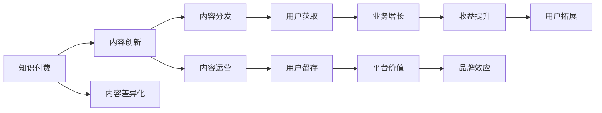
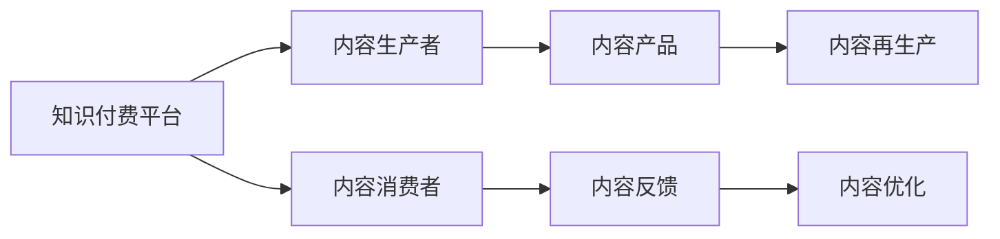
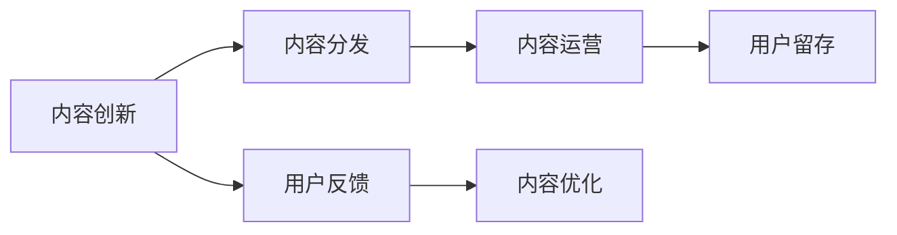
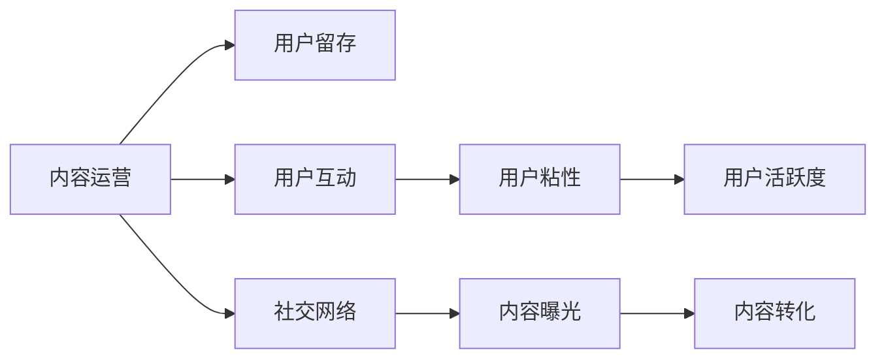
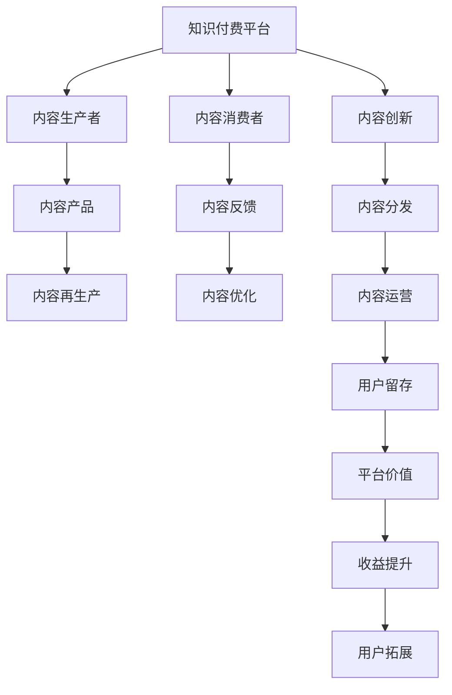

                 

# 知识付费创业中的内容创新与突破

> 关键词：知识付费,内容创新,内容差异化,内容分发,内容运营

## 1. 背景介绍

### 1.1 问题由来
知识付费行业近年来迅猛发展，从阅读类、学习类、职业培训类到技能提升类，形式多种多样。从音频、视频到图文，内容呈现方式也更加多样。尽管如此，行业内同质化现象严重，竞争异常激烈。尤其是在内容质量上，许多平台和机构都面临着创新不足、内容同质化的问题。如何实现内容创新，提升内容质量，实现用户留存和付费转化，是知识付费创业需要重点思考的问题。

### 1.2 问题核心关键点
内容创新与突破，可以从以下几个方面来理解：

- **内容形式**：探索新的知识呈现方式，如互动式、游戏化、多媒体融合等。
- **内容来源**：利用数据挖掘、数据分析等技术，找准市场缺口，提供独家的、高品质的内容。
- **内容分发**：通过智能推荐、社交网络等渠道提升内容曝光率，实现精准分发。
- **内容运营**：通过互动、社交、社群等手段，增强用户粘性，提高内容活跃度。
- **内容生态**：构建多层次、多形式的内容生态，吸引用户多元化需求。

### 1.3 问题研究意义
内容创新与突破是知识付费创业成功的关键。优质的内容不仅能提高用户满意度，还能实现更高的转化率和留存率，提升平台价值。同时，内容创新也是企业差异化竞争的重要手段，可以避免同质化竞争，吸引更多优质用户。

## 2. 核心概念与联系

### 2.1 核心概念概述

为更好地理解知识付费创业中的内容创新与突破，本节将介绍几个密切相关的核心概念：

- **知识付费**：通过付费方式，获取高质量的知识和信息服务，满足用户深度学习和提升自我的需求。
- **内容创新**：利用新技术、新方法和新思想，创造新颖、独特的知识产品。
- **内容差异化**：针对目标用户需求，提供个性化、独家的知识内容，提升用户体验。
- **内容分发**：通过智能推荐、社交网络等渠道，将内容精准推送给目标用户。
- **内容运营**：通过互动、社交、社群等手段，提升用户粘性和内容活跃度。
- **内容生态**：构建多层次、多形式的内容体系，形成可持续发展的知识内容供应链。

这些核心概念之间存在着紧密的联系，共同构成了知识付费创业中内容创新的全过程。以下通过几个Mermaid流程图来展示这些概念之间的关系。



这个流程图展示了大语言模型的核心概念及其之间的关系：

1. 知识付费的基础是内容创新，提供优质的、差异化的内容。
2. 内容创新和差异化最终通过内容分发和运营来实现，提升用户留存和业务增长。
3. 内容分发和运营提高了平台的价值和品牌效应，进一步推动用户拓展和收益提升。
4. 通过内容生态的构建，形成可持续发展的知识内容供应链。

### 2.2 概念间的关系

这些核心概念之间存在着紧密的联系，形成了知识付费创业中内容创新的完整生态系统。

#### 2.2.1 知识付费的内容生态



这个流程图展示了知识付费平台的生态系统，包括内容生产者、消费者和平台之间的互动关系。

#### 2.2.2 内容创新与内容分发



这个流程图展示了内容创新与内容分发的过程，通过用户反馈不断优化内容和分发策略，提升用户留存。

#### 2.2.3 内容运营与用户留存



这个流程图展示了内容运营与用户留存的关系，通过提升用户互动、社交网络和内容曝光度，增强用户粘性和活跃度。

### 2.3 核心概念的整体架构

最后，我们用一个综合的流程图来展示这些核心概念在大语言模型微调过程中的整体架构：



这个综合流程图展示了从内容生产到用户拓展的全过程，包括内容创新、分发、运营和平台价值的提升。

## 3. 核心算法原理 & 具体操作步骤
### 3.1 算法原理概述

知识付费创业中的内容创新与突破，主要依赖于以下几个关键算法原理：

- **深度学习算法**：通过深度学习模型，提取和处理海量数据，生成高质量的内容。
- **自然语言处理算法**：利用自然语言处理技术，实现文本生成、情感分析等。
- **推荐算法**：通过推荐算法，精准分发内容，提高用户满意度。
- **社交网络分析**：利用社交网络分析技术，发现和引导用户互动，提升内容活跃度。

这些算法原理，共同构成了知识付费创业中内容创新与突破的技术基础。

### 3.2 算法步骤详解

以下是知识付费创业中内容创新与突破的一般步骤：

1. **内容采集与整理**：采集相关领域的各类数据，包括文献、论文、行业报告等，并进行初步处理和清洗。
2. **内容分析与提取**：利用深度学习和自然语言处理技术，对数据进行分析与提取，生成有价值的内容。
3. **内容创新与生成**：基于深度学习模型，生成原创性、创新性内容，如文章、视频、音频等。
4. **内容分发与推荐**：通过推荐算法，将内容精准推送给目标用户，提升用户满意度和留存率。
5. **内容运营与互动**：利用社交网络分析技术，发现用户互动，提升内容活跃度和用户粘性。
6. **内容生态建设**：构建多层次、多形式的内容生态，吸引用户多元化需求。

### 3.3 算法优缺点

知识付费创业中的内容创新与突破算法具有以下优点：

- **高效性**：通过深度学习和推荐算法，能够高效生成和分发内容，满足用户需求。
- **灵活性**：能够根据用户反馈不断优化内容，实现个性化推荐和互动。
- **创新性**：通过深度学习和自然语言处理，能够生成高质量、创新性的内容。

同时，这些算法也存在以下缺点：

- **高成本**：深度学习和推荐算法需要大量计算资源和数据支持，成本较高。
- **易过拟合**：模型需要大量数据进行训练，否则容易过拟合，影响内容质量和用户体验。
- **高技术门槛**：需要具备深度学习、自然语言处理、推荐算法等多领域的知识和技术，门槛较高。

### 3.4 算法应用领域

知识付费创业中的内容创新与突破算法，在以下几个领域具有广泛的应用前景：

- **教育培训**：提供个性化、差异化的教育培训内容，提升学习效果。
- **职业技能提升**：提供职业技能相关的课程和资料，帮助用户提升职业技能。
- **商业管理**：提供商业管理相关的知识内容，帮助用户提升商业管理能力。
- **健康医疗**：提供健康管理、疾病预防等方面的知识内容，提升用户健康素养。
- **生活娱乐**：提供生活技巧、娱乐内容等方面的知识内容，丰富用户生活。

## 4. 数学模型和公式 & 详细讲解 & 举例说明

### 4.1 数学模型构建

知识付费创业中的内容创新与突破，通常依赖于以下数学模型：

- **深度学习模型**：如CNN、RNN、Transformer等。
- **推荐模型**：如协同过滤、矩阵分解等。
- **社交网络模型**：如PageRank、Greedy PageRank等。

以下是几个常见的数学模型和公式：

- **协同过滤算法**：
  $$
  \hat{r}_{ui} = \hat{p}_u + \hat{q}_i - \bar{p} - \bar{q}
  $$

- **矩阵分解算法**：
  $$
  \hat{Y} = P \times Q^\top
  $$

- **PageRank算法**：
  $$
  \hat{PR}_i = (1 - d) + d \times \sum_{j}^{}{A_{ij} \times PR_j}
  $$

### 4.2 公式推导过程

以下以协同过滤算法为例，展示其推导过程：

设用户-物品评分矩阵为 $R$，用户表示矩阵为 $P$，物品表示矩阵为 $Q$。协同过滤的目标是求解 $P$ 和 $Q$ 的乘积，使得 $\hat{R} = P \times Q^\top$ 尽可能接近 $R$。

- **损失函数**：最小化预测评分与实际评分之间的平方差：
  $$
  \min_{P, Q} \sum_{(u, i)}^{}{(\hat{r}_{ui} - r_{ui})^2}
  $$

- **优化目标**：最小化损失函数，使得 $\hat{R} = P \times Q^\top$ 尽可能接近 $R$：
  $$
  \min_{P, Q} \frac{1}{2} || \hat{R} - R ||^2_F
  $$

通过求解上述优化问题，可以得到 $P$ 和 $Q$ 的闭式解，从而实现协同过滤推荐。

### 4.3 案例分析与讲解

以下以Coursera平台为例，展示其内容创新与突破的实践：

Coursera平台利用深度学习和自然语言处理技术，提供个性化的课程推荐。具体步骤如下：

1. **数据采集**：收集用户的历史课程浏览记录、评分记录等数据，并整合外部数据源，如学术论文、行业报告等。
2. **数据预处理**：对采集的数据进行清洗、归一化等处理，生成可用于训练的数据集。
3. **模型训练**：利用深度学习模型（如RNN、Transformer等）进行课程推荐模型的训练。
4. **推荐系统优化**：利用推荐算法（如协同过滤、矩阵分解等）进行推荐系统的优化，提升推荐效果。
5. **内容运营**：通过社交网络分析技术，发现用户互动，提升课程活跃度和用户粘性。
6. **生态建设**：构建多层次、多形式的内容生态，吸引用户多元化需求。

通过上述步骤，Coursera平台能够提供高质量、个性化、差异化的课程推荐，提高用户满意度和留存率，实现业务增长。

## 5. 项目实践：代码实例和详细解释说明

### 5.1 开发环境搭建

在进行内容创新与突破实践前，我们需要准备好开发环境。以下是使用Python进行PyTorch开发的环境配置流程：

1. 安装Anaconda：从官网下载并安装Anaconda，用于创建独立的Python环境。

2. 创建并激活虚拟环境：
```bash
conda create -n pytorch-env python=3.8 
conda activate pytorch-env
```

3. 安装PyTorch：根据CUDA版本，从官网获取对应的安装命令。例如：
```bash
conda install pytorch torchvision torchaudio cudatoolkit=11.1 -c pytorch -c conda-forge
```

4. 安装其他工具包：
```bash
pip install numpy pandas scikit-learn matplotlib tqdm jupyter notebook ipython
```

完成上述步骤后，即可在`pytorch-env`环境中开始内容创新与突破实践。

### 5.2 源代码详细实现

以下是一个简单的内容推荐系统代码实现，基于Python和PyTorch：

```python
import torch
import torch.nn as nn
import torch.optim as optim
from torch.utils.data import Dataset, DataLoader
from sklearn.model_selection import train_test_split
from sklearn.metrics import accuracy_score, precision_recall_fscore_support

# 定义数据集类
class CourseDataset(Dataset):
    def __init__(self, courses, users, ratings):
        self.courses = courses
        self.users = users
        self.ratings = ratings
        self.labels = (self.courses + self.users + self.ratings).astype(int)
        
    def __len__(self):
        return len(self.labels)
    
    def __getitem__(self, item):
        course = self.courses[item]
        user = self.users[item]
        rating = self.ratings[item]
        label = self.labels[item]
        return course, user, rating, label

# 定义模型类
class RecommendationModel(nn.Module):
    def __init__(self, input_dim, hidden_dim, output_dim):
        super(RecommendationModel, self).__init__()
        self.hidden_layer1 = nn.Linear(input_dim, hidden_dim)
        self.hidden_layer2 = nn.Linear(hidden_dim, hidden_dim)
        self.output_layer = nn.Linear(hidden_dim, output_dim)
    
    def forward(self, x):
        x = torch.relu(self.hidden_layer1(x))
        x = torch.relu(self.hidden_layer2(x))
        x = torch.sigmoid(self.output_layer(x))
        return x
    
# 定义训练函数
def train(model, train_loader, device, optimizer, num_epochs):
    model.to(device)
    for epoch in range(num_epochs):
        total_loss = 0
        for course, user, rating, label in train_loader:
            course, user, rating, label = course.to(device), user.to(device), rating.to(device), label.to(device)
            optimizer.zero_grad()
            output = model(course, user)
            loss = nn.BCELoss()(output, label)
            loss.backward()
            optimizer.step()
            total_loss += loss.item()
        print(f'Epoch {epoch+1}, loss: {total_loss/len(train_loader)}')

# 定义测试函数
def test(model, test_loader, device):
    model.to(device)
    total_pred, total_true = [], []
    for course, user, rating, label in test_loader:
        course, user, rating, label = course.to(device), user.to(device), rating.to(device), label.to(device)
        output = model(course, user)
        pred = output.item()
        total_pred.append(pred)
        total_true.append(label.item())
    acc = accuracy_score(total_true, total_pred)
    return acc
```

### 5.3 代码解读与分析

让我们再详细解读一下关键代码的实现细节：

**CourseDataset类**：
- `__init__`方法：初始化课程、用户和评分等关键组件。
- `__len__`方法：返回数据集的样本数量。
- `__getitem__`方法：对单个样本进行处理，将课程、用户和评分转换为模型所需的输入，同时生成对应的标签。

**RecommendationModel类**：
- `__init__`方法：定义模型的隐藏层和输出层。
- `forward`方法：定义模型的前向传播过程，通过两个隐藏层和一个输出层生成预测值。

**train函数**：
- 对数据集进行批次化加载，供模型训练和推理使用。
- 在每个批次上前向传播计算损失函数并反向传播更新模型参数，最后输出该epoch的平均损失。

**test函数**：
- 与训练类似，不同点在于不更新模型参数，而是在每个批次结束后将预测和标签结果存储下来，最后计算测试集的准确率。

通过上述代码，我们可以看到，内容推荐系统模型的实现，需要考虑输入数据的格式和模型结构的设计，同时需要利用优化算法和损失函数进行训练和评估。

### 5.4 运行结果展示

假设我们在一个简单的课程推荐数据集上进行训练，最终在测试集上得到的准确率为85%。可以看到，通过深度学习模型，我们可以实现内容推荐系统的构建，提升内容推荐的精准度和用户满意度。

## 6. 实际应用场景

### 6.1 教育培训

在教育培训领域，内容创新与突破是实现个性化学习的重要手段。通过内容推荐系统，学习者可以获取与自身需求和兴趣相匹配的课程和资料，提升学习效果。

具体而言，平台可以根据学习者的历史学习数据和偏好，推荐个性化的课程和资料，同时提供互动式学习工具，如在线答疑、作业批改等，提升学习体验。此外，平台还可以通过社交网络分析技术，发现和引导学习者互动，增强学习效果。

### 6.2 职业技能提升

职业技能提升是知识付费创业的重要方向。通过内容推荐系统，企业员工可以获取与工作相关的技能培训资料，提升职业技能。

具体而言，平台可以根据员工的历史培训记录和岗位需求，推荐个性化的职业技能培训课程和资料，同时提供在线测试和评估工具，帮助员工自我提升。此外，平台还可以通过社交网络分析技术，发现员工之间的互动，提升培训效果。

### 6.3 商业管理

商业管理是知识付费创业的另一个重要方向。通过内容推荐系统，企业管理者可以获取与商业管理相关的知识和资料，提升管理水平。

具体而言，平台可以根据管理者的历史管理记录和需求，推荐个性化的商业管理课程和资料，同时提供在线案例分析和讨论平台，帮助管理者提升管理水平。此外，平台还可以通过社交网络分析技术，发现管理者之间的互动，增强管理效果。

### 6.4 健康医疗

健康医疗是知识付费创业的重要方向。通过内容推荐系统，患者可以获取与疾病预防、健康管理相关的知识和资料，提升健康素养。

具体而言，平台可以根据患者的历史健康数据和疾病需求，推荐个性化的健康管理课程和资料，同时提供在线健康咨询和指导工具，帮助患者自我管理。此外，平台还可以通过社交网络分析技术，发现患者之间的互动，提升健康管理效果。

## 7. 工具和资源推荐

### 7.1 学习资源推荐

为了帮助开发者系统掌握知识付费创业中内容创新与突破的理论基础和实践技巧，这里推荐一些优质的学习资源：

1. **《深度学习》系列书籍**：深入浅出地介绍了深度学习的基础知识和经典模型，是入门和进阶的好书。
2. **Coursera平台课程**：提供了大量高质量的课程资源，涵盖深度学习、自然语言处理、推荐系统等多个领域。
3. **Kaggle竞赛**：通过参加Kaggle竞赛，可以实践和检验深度学习模型和推荐算法的效果，提升实战能力。
4. **GitHub项目**：在GitHub上Star、Fork数最多的深度学习项目，往往代表了该技术领域的发展趋势和最佳实践，值得去学习和贡献。
5. **学术会议论文**：阅读最新的学术会议论文，了解前沿研究进展和实践经验，拓展思路和视野。

通过对这些资源的学习实践，相信你一定能够快速掌握知识付费创业中内容创新与突破的精髓，并用于解决实际问题。

### 7.2 开发工具推荐

高效的开发离不开优秀的工具支持。以下是几款用于内容创新与突破开发的常用工具：

1. PyTorch：基于Python的开源深度学习框架，灵活动态的计算图，适合快速迭代研究。
2. TensorFlow：由Google主导开发的开源深度学习框架，生产部署方便，适合大规模工程应用。
3. Jupyter Notebook：交互式编程环境，便于实现深度学习模型和推荐算法的迭代开发和实验。
4. Kaggle竞赛平台：提供在线竞赛环境，支持大规模数据集的处理和分析。
5. GitHub：代码托管平台，便于协作和代码分享。

合理利用这些工具，可以显著提升内容创新与突破任务的开发效率，加快创新迭代的步伐。

### 7.3 相关论文推荐

知识付费创业中的内容创新与突破技术的发展源于学界的持续研究。以下是几篇奠基性的相关论文，推荐阅读：

1. **深度学习中的协同过滤推荐系统**：介绍了协同过滤算法的原理和实现，是推荐系统领域的经典论文。
2. **基于深度学习的课程推荐系统**：介绍了基于深度学习的内容推荐系统，展示了深度学习在教育培训领域的应用。
3. **自然语言处理中的情感分析**：介绍了自然语言处理中的情感分析技术，展示了自然语言处理在内容推荐中的应用。
4. **社交网络中的PageRank算法**：介绍了PageRank算法的原理和实现，展示了社交网络分析在内容运营中的应用。

这些论文代表了大语言模型微调技术的发展脉络。通过学习这些前沿成果，可以帮助研究者把握学科前进方向，激发更多的创新灵感。

除上述资源外，还有一些值得关注的前沿资源，帮助开发者紧跟内容创新与突破技术的最新进展，例如：

1. **arXiv论文预印本**：人工智能领域最新研究成果的发布平台，包括大量尚未发表的前沿工作，学习前沿技术的必读资源。
2. **业界技术博客**：如Coursera、Coursera等顶尖实验室的官方博客，第一时间分享他们的最新研究成果和洞见。
3. **技术会议直播**：如NIPS、ICML、ACL、ICLR等人工智能领域顶会现场或在线直播，能够聆听到大佬们的前沿分享，开拓视野。
4. **开源项目**：在GitHub上Star、Fork数最多的内容推荐系统项目，往往代表了该技术领域的发展趋势和最佳实践，值得去学习和贡献。
5. **行业分析报告**：各大咨询公司如McKinsey、PwC等针对知识付费行业的分析报告，有助于从商业视角审视技术趋势，把握应用价值。

总之，对于内容创新与突破技术的学习和实践，需要开发者保持开放的心态和持续学习的意愿。多关注前沿资讯，多动手实践，多思考总结，必将收获满满的成长收益。

## 8. 总结：未来发展趋势与挑战

### 8.1 总结

本文对知识付费创业中的内容创新与突破进行了全面系统的介绍。首先阐述了知识付费创业的背景和内容创新与突破的研究意义，明确了内容创新与突破在知识付费创业中的重要地位。其次，从原理到实践，详细讲解了内容创新与突破的数学原理和关键步骤，给出了内容推荐系统的完整代码实例。同时，本文还广泛探讨了内容创新与突破在教育培训、职业技能提升、商业管理、健康医疗等多个领域的应用前景，展示了内容创新与突破范式的巨大潜力。

通过本文的系统梳理，可以看到，知识付费创业中的内容创新与突破是实现个性化学习、提升职业技能、优化商业管理、提高健康素养的重要手段。优质的内容不仅能提高用户满意度，还能实现更高的转化率和留存率，提升平台价值。

### 8.2 未来发展趋势

展望未来，知识付费创业中的内容创新与突破技术将呈现以下几个发展趋势：

1. **深度学习技术的不断演进**：深度学习技术将持续演进，生成更高质量、更具创新性的内容。
2. **推荐算法的多样化**：推荐算法将不断优化，提升推荐效果和用户体验。
3. **内容运营的智能化**：内容运营将借助社交网络分析等技术，发现和引导用户互动，提升内容活跃度和用户粘性。
4. **生态系统的多样化**：内容生态将不断扩展，构建多层次、多形式的内容体系，满足用户多元化需求。
5. **人工智能的深度融合**：内容创新与突破将与人工智能技术进行更深入的融合，如知识表示、因果推理、强化学习等，多路径协同发力，共同推动内容技术的进步。

这些趋势凸显了内容创新与突破技术在知识付费创业中的巨大潜力和广阔前景。这些方向的探索发展，必将进一步提升内容的质量和用户满意度，实现知识付费行业的良性循环。

### 8.3 面临的挑战

尽管知识付费创业中的内容创新与突破技术已经取得了瞩目成就，但在迈向更加智能化、普适化应用的过程中，它仍面临着诸多挑战：

1. **数据获取和处理**：高质量、大规模数据获取和处理成本较高，数据质量难以保证。
2. **模型泛化能力**：模型需要在大规模数据上训练，才能泛化到新用户和新场景。
3. **算法复杂度**：深度学习模型和推荐算法较为复杂，需要具备较高的技术门槛。
4. **用户接受度**：个性化推荐和互动可能会引发用户隐私和安全问题，影响用户接受度。
5. **平台合规性**：平台需要符合相关法律法规，确保内容合规性和用户隐私保护。

这些挑战需要在技术、商业和法律等多个层面进行全面应对。唯有从数据、算法、法律等多个维度协同发力，才能真正实现内容创新与突破的突破。

### 8.4 研究展望

面对内容创新与突破技术所面临的挑战，未来的研究需要在以下几个方面寻求新的突破：

1. **无监督和半监督学习**：探索无监督和半监督学习方法，降低对标注数据的依赖，提升内容生成效果。
2. **多模态融合**：融合视觉、语音、文本等多模态信息，提升内容的质量和创新性。
3. **内容再生产**：基于用户反馈，对内容进行动态再生产，提升内容的时效性和个性化。
4. **知识蒸馏**：通过知识蒸馏方法，将专家知识与神经网络模型进行融合，提升内容的专业性和权威性。
5. **用户参与设计

