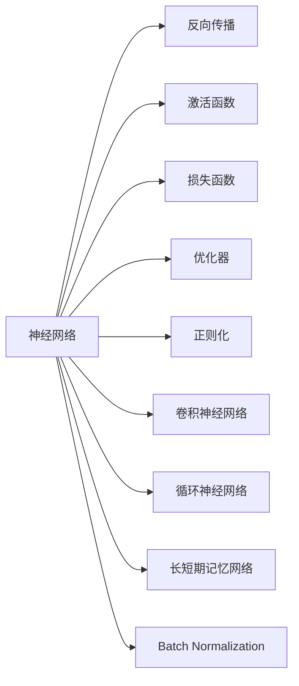
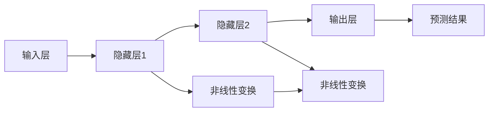
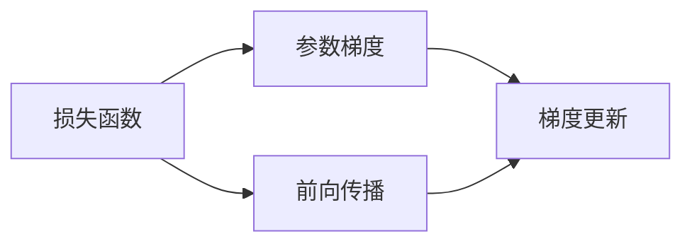
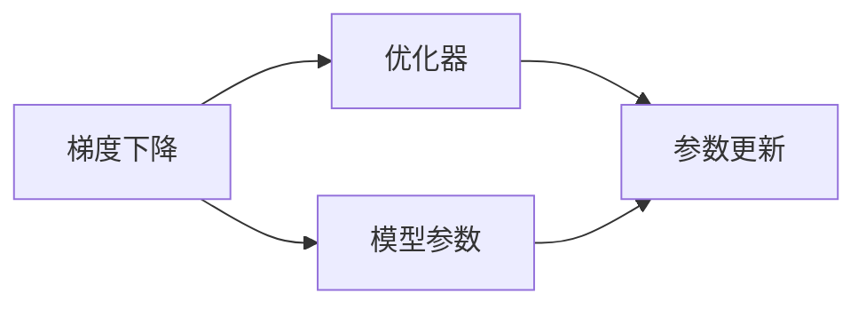
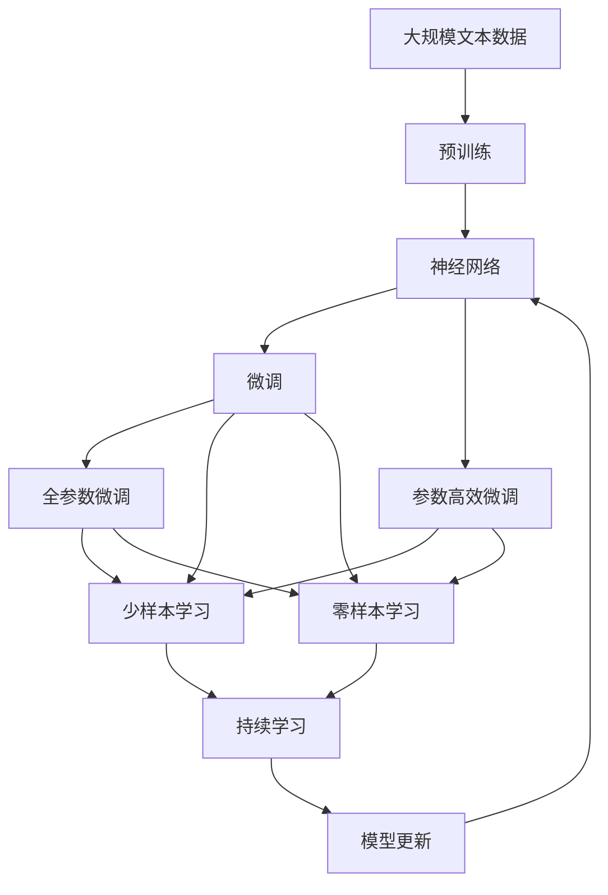

                 

# 神经网络：开启智能新纪元

> 关键词：神经网络,深度学习,反向传播,梯度下降,激活函数,卷积神经网络,循环神经网络,卷积层,池化层,全连接层,ReLU,Leaky ReLU,MaxPool,GRU,LSTM,BatchNorm,数据增强,图像分类,自然语言处理,NLP,自动驾驶,医疗影像,视频分析

## 1. 背景介绍

### 1.1 问题由来
人工智能(AI)作为21世纪最引人注目的技术之一，已经深刻影响了各行各业的发展。其中，神经网络(Neural Networks)作为深度学习领域的核心技术，在图像识别、语音识别、自然语言处理、自动驾驶等多个领域取得了突破性进展。从1986年Hopfield神经网络提出至今，经过三十多年的发展，神经网络已经从简单的感知器演进成为能处理复杂非线性映射的高级模型。

神经网络之所以能够取得成功，关键在于其三个核心特性：

- **层次化结构**：将输入数据通过多层非线性变换，逐步抽象出更高级的特征。
- **权值共享**：通过共享权重参数，减少模型复杂度，避免过拟合。
- **反向传播**：通过链式法则计算梯度，实现模型参数的更新。

正是这三个特性，使得神经网络能够处理大规模复杂数据，捕捉数据的潜在模式和规律，从而在各种实际应用中发挥重要作用。

### 1.2 问题核心关键点
神经网络的背后，是反向传播算法及其优化策略。该算法通过计算损失函数对模型参数的梯度，指导参数更新，从而优化模型输出。为了更好理解反向传播和神经网络，以下将详细介绍其核心概念、算法原理和具体操作步骤，并分析其优缺点和应用领域。

## 2. 核心概念与联系

### 2.1 核心概念概述

为更好地理解神经网络的工作原理，本节将介绍几个密切相关的核心概念：

- 神经网络(Neural Network, NN)：由输入层、隐藏层、输出层组成的网络结构，通过多层非线性变换处理输入数据，并输出预测结果。

- 反向传播(Backpropagation)：一种基于链式法则的梯度计算方法，通过计算损失函数对模型参数的梯度，指导参数更新，从而优化模型。

- 激活函数(Activation Function)：对神经元的输出进行非线性变换，增加网络的表达能力。常用的激活函数包括ReLU、Sigmoid、Tanh等。

- 损失函数(Loss Function)：衡量模型输出与真实标签之间的差异，常见的损失函数包括均方误差、交叉熵等。

- 优化器(Optimizer)：选择合理的优化算法，如梯度下降法、Adam等，通过迭代更新参数，最小化损失函数。

- 正则化(Regularization)：通过L2正则、Dropout等技术，防止模型过拟合。

- 卷积神经网络(Convolutional Neural Network, CNN)：针对图像处理任务设计的特殊神经网络，通过卷积层和池化层提取图像局部特征。

- 循环神经网络(Recurrent Neural Network, RNN)：针对序列数据处理任务设计的特殊神经网络，通过隐藏状态记忆过去信息。

- 长短期记忆网络(Long Short-Term Memory, LSTM)：一种特殊的RNN，通过门控机制解决长期依赖问题。

- Batch Normalization(Batch Normalization, BatchNorm)：一种数据归一化技术，加速模型训练，提高模型稳定性。

这些核心概念之间的逻辑关系可以通过以下Mermaid流程图来展示：



这个流程图展示了神经网络的构成及其与关键概念的关系：

1. 神经网络由输入层、隐藏层、输出层组成，通过多层非线性变换处理输入数据。
2. 反向传播通过计算损失函数对模型参数的梯度，指导参数更新，优化模型。
3. 激活函数、损失函数、优化器等技术，提高了神经网络的表达能力和训练效果。
4. CNN、RNN、LSTM等特殊神经网络，针对特定任务设计，提高了模型的泛化能力。
5. Batch Normalization等数据归一化技术，加速训练，提高了模型稳定性。

这些概念共同构成了神经网络的完整生态系统，使其能够在各种任务上发挥强大的学习和推理能力。通过理解这些核心概念，我们可以更好地把握神经网络的工作原理和优化方向。

### 2.2 概念间的关系

这些核心概念之间存在着紧密的联系，形成了神经网络的完整学习系统。下面我们通过几个Mermaid流程图来展示这些概念之间的关系。

#### 2.2.1 神经网络的层次化结构



这个流程图展示了神经网络的层次化结构，即输入数据通过多层非线性变换，逐步抽象出更高层次的特征，最终输出预测结果。

#### 2.2.2 反向传播的数学原理



这个流程图展示了反向传播的数学原理，即通过计算损失函数对模型参数的梯度，指导参数更新，从而优化模型。

#### 2.2.3 优化器的选择与作用



这个流程图展示了优化器的选择与作用，即选择合理的优化算法，通过迭代更新参数，最小化损失函数。

#### 2.2.4 Batch Normalization的应用


这个流程图展示了Batch Normalization的应用，即通过数据归一化技术，加速模型训练，提高模型稳定性。

### 2.3 核心概念的整体架构

最后，我们用一个综合的流程图来展示这些核心概念在神经网络微调过程中的整体架构：



这个综合流程图展示了从预训练到微调，再到持续学习的完整过程。神经网络首先在大规模文本数据上进行预训练，然后通过微调（包括全参数微调和参数高效微调等）或零样本学习、少样本学习等方式，适应特定任务，最后通过持续学习技术，模型能够不断学习新知识，保持时效性和适应性。

## 3. 核心算法原理 & 具体操作步骤

### 3.1 算法原理概述

神经网络的训练过程，本质上是一个通过反向传播算法迭代更新模型参数的过程。其核心思想是：通过计算损失函数对模型参数的梯度，指导参数更新，使得模型输出逼近真实标签，从而优化模型性能。

形式化地，假设神经网络模型为 $M_{\theta}(x)$，其中 $\theta$ 为模型参数，$x$ 为输入数据。假设模型在数据集 $D=\{(x_i,y_i)\}_{i=1}^N$ 上的损失函数为 $\mathcal{L}(\theta)$，目标是最小化损失函数：

$$
\theta^* = \mathop{\arg\min}_{\theta} \mathcal{L}(M_{\theta}(x))
$$

其中 $\mathcal{L}$ 为针对具体任务设计的损失函数，如交叉熵损失、均方误差损失等。通过梯度下降等优化算法，不断更新模型参数 $\theta$，最小化损失函数，使得模型输出逼近真实标签 $y_i$。

### 3.2 算法步骤详解

神经网络的训练过程可以分为以下几个关键步骤：

**Step 1: 准备预训练模型和数据集**
- 选择合适的预训练神经网络 $M_{\theta}$ 作为初始化参数，如卷积神经网络（CNN）、循环神经网络（RNN）、长短期记忆网络（LSTM）等。
- 准备训练集、验证集和测试集，划分为合适的批次大小。

**Step 2: 定义任务适配层**
- 根据任务类型，在预训练模型顶层设计合适的输出层和损失函数。
- 对于分类任务，通常在顶层添加线性分类器和交叉熵损失函数。
- 对于生成任务，通常使用语言模型的解码器输出概率分布，并以负对数似然为损失函数。

**Step 3: 设置微调超参数**
- 选择合适的优化算法及其参数，如Adam、SGD等，设置学习率、批大小、迭代轮数等。
- 设置正则化技术及强度，包括权重衰减、Dropout、Early Stopping等。
- 确定冻结预训练参数的策略，如仅微调顶层，或全部参数都参与微调。

**Step 4: 执行梯度训练**
- 将训练集数据分批次输入模型，前向传播计算损失函数。
- 反向传播计算参数梯度，根据设定的优化算法和学习率更新模型参数。
- 周期性在验证集上评估模型性能，根据性能指标决定是否触发Early Stopping。
- 重复上述步骤直到满足预设的迭代轮数或Early Stopping条件。

**Step 5: 测试和部署**
- 在测试集上评估微调后模型 $M_{\hat{\theta}}$ 的性能，对比微调前后的精度提升。
- 使用微调后的模型对新样本进行推理预测，集成到实际的应用系统中。
- 持续收集新的数据，定期重新微调模型，以适应数据分布的变化。

以上是神经网络微调的一般流程。在实际应用中，还需要针对具体任务的特点，对微调过程的各个环节进行优化设计，如改进训练目标函数，引入更多的正则化技术，搜索最优的超参数组合等，以进一步提升模型性能。

### 3.3 算法优缺点

神经网络微调具有以下优点：
1. 简单易用。只需准备少量标注数据，即可对预训练模型进行快速适配，获得较大的性能提升。
2. 通用适用。适用于各种NLP下游任务，包括分类、匹配、生成等，设计简单的任务适配层即可实现微调。
3. 参数高效。利用参数高效微调技术，在固定大部分预训练参数的情况下，仍可取得不错的微调效果。
4. 效果显著。在学术界和工业界的诸多任务上，基于微调的方法已经刷新了最先进的性能指标。

同时，该方法也存在一定的局限性：
1. 依赖标注数据。微调的效果很大程度上取决于标注数据的质量和数量，获取高质量标注数据的成本较高。
2. 迁移能力有限。当目标任务与预训练数据的分布差异较大时，微调的性能提升有限。
3. 负面效果传递。预训练模型的固有偏见、有害信息等，可能通过微调传递到下游任务，造成负面影响。
4. 可解释性不足。微调模型的决策过程通常缺乏可解释性，难以对其推理逻辑进行分析和调试。

尽管存在这些局限性，但就目前而言，基于监督学习的微调方法仍是大规模NLP应用的最主流范式。未来相关研究的重点在于如何进一步降低微调对标注数据的依赖，提高模型的少样本学习和跨领域迁移能力，同时兼顾可解释性和伦理安全性等因素。

### 3.4 算法应用领域

神经网络微调方法在NLP领域已经得到了广泛的应用，覆盖了几乎所有常见任务，例如：

- 文本分类：如情感分析、主题分类、意图识别等。通过微调使模型学习文本-标签映射。
- 命名实体识别：识别文本中的人名、地名、机构名等特定实体。通过微调使模型掌握实体边界和类型。
- 关系抽取：从文本中抽取实体之间的语义关系。通过微调使模型学习实体-关系三元组。
- 问答系统：对自然语言问题给出答案。将问题-答案对作为微调数据，训练模型学习匹配答案。
- 机器翻译：将源语言文本翻译成目标语言。通过微调使模型学习语言-语言映射。
- 文本摘要：将长文本压缩成简短摘要。将文章-摘要对作为微调数据，使模型学习抓取要点。
- 对话系统：使机器能够与人自然对话。将多轮对话历史作为上下文，微调模型进行回复生成。

除了上述这些经典任务外，神经网络微调也被创新性地应用到更多场景中，如可控文本生成、常识推理、代码生成、数据增强等，为NLP技术带来了全新的突破。随着预训练模型和微调方法的不断进步，相信NLP技术将在更广阔的应用领域大放异彩。

## 4. 数学模型和公式 & 详细讲解 & 举例说明

### 4.1 数学模型构建

本节将使用数学语言对神经网络微调过程进行更加严格的刻画。

记神经网络模型为 $M_{\theta}(x)$，其中 $\theta$ 为模型参数，$x$ 为输入数据。假设微调任务的训练集为 $D=\{(x_i,y_i)\}_{i=1}^N$，$y_i \in \{0,1\}$ 为二分类任务的真实标签。微调的目标是找到新的模型参数 $\hat{\theta}$，使得：

$$
\hat{\theta}=\mathop{\arg\min}_{\theta} \mathcal{L}(M_{\theta}(x),y)
$$

其中 $\mathcal{L}$ 为针对二分类任务设计的损失函数，用于衡量模型预测输出与真实标签之间的差异。常见的损失函数包括交叉熵损失、均方误差损失等。

通过梯度下降等优化算法，微调过程不断更新模型参数 $\theta$，最小化损失函数，使得模型输出逼近真实标签。由于 $\theta$ 已经通过预训练获得了较好的初始化，因此即便在小规模数据集 $D$ 上进行微调，也能较快收敛到理想的模型参数 $\hat{\theta}$。

### 4.2 公式推导过程

以下我们以二分类任务为例，推导交叉熵损失函数及其梯度的计算公式。

假设神经网络模型 $M_{\theta}$ 在输入 $x$ 上的输出为 $\hat{y}=M_{\theta}(x) \in [0,1]$，表示样本属于正类的概率。真实标签 $y \in \{0,1\}$。则二分类交叉熵损失函数定义为：

$$
\ell(M_{\theta}(x),y) = -[y\log \hat{y} + (1-y)\log (1-\hat{y})]
$$

将其代入经验风险公式，得：

$$
\mathcal{L}(\theta) = -\frac{1}{N}\sum_{i=1}^N [y_i\log M_{\theta}(x_i)+(1-y_i)\log(1-M_{\theta}(x_i))]
$$

根据链式法则，损失函数对参数 $\theta_k$ 的梯度为：

$$
\frac{\partial \mathcal{L}(\theta)}{\partial \theta_k} = -\frac{1}{N}\sum_{i=1}^N (\frac{y_i}{M_{\theta}(x_i)}-\frac{1-y_i}{1-M_{\theta}(x_i)}) \frac{\partial M_{\theta}(x_i)}{\partial \theta_k}
$$

其中 $\frac{\partial M_{\theta}(x_i)}{\partial \theta_k}$ 可进一步递归展开，利用自动微分技术完成计算。

在得到损失函数的梯度后，即可带入参数更新公式，完成模型的迭代优化。重复上述过程直至收敛，最终得到适应下游任务的最优模型参数 $\theta^*$。

## 5. 项目实践：代码实例和详细解释说明

### 5.1 开发环境搭建

在进行神经网络微调实践前，我们需要准备好开发环境。以下是使用Python进行TensorFlow开发的环境配置流程：

1. 安装Anaconda：从官网下载并安装Anaconda，用于创建独立的Python环境。

2. 创建并激活虚拟环境：
```bash
conda create -n tensorflow-env python=3.8 
conda activate tensorflow-env
```

3. 安装TensorFlow：根据CUDA版本，从官网获取对应的安装命令。例如：
```bash
conda install tensorflow -c tensorflow -c conda-forge
```

4. 安装各类工具包：
```bash
pip install numpy pandas scikit-learn matplotlib tqdm jupyter notebook ipython
```

完成上述步骤后，即可在`tensorflow-env`环境中开始微调实践。

### 5.2 源代码详细实现

这里我们以图像分类任务为例，给出使用TensorFlow对卷积神经网络（CNN）进行微调的代码实现。

首先，定义CNN模型：

```python
import tensorflow as tf

model = tf.keras.Sequential([
    tf.keras.layers.Conv2D(32, (3, 3), activation='relu', input_shape=(28, 28, 1)),
    tf.keras.layers.MaxPooling2D((2, 2)),
    tf.keras.layers.Conv2D(64, (3, 3), activation='relu'),
    tf.keras.layers.MaxPooling2D((2, 2)),
    tf.keras.layers.Conv2D(64, (3, 3), activation='relu'),
    tf.keras.layers.Flatten(),
    tf.keras.layers.Dense(64, activation='relu'),
    tf.keras.layers.Dense(10, activation='softmax')
])
```

然后，定义数据处理函数：

```python
import numpy as np
import matplotlib.pyplot as plt

def load_data(mnist):
    (x_train, y_train), (x_test, y_test) = mnist.load_data()
    x_train = x_train.reshape((60000, 28, 28, 1))
    x_test = x_test.reshape((10000, 28, 28, 1))
    x_train, x_test = x_train / 255.0, x_test / 255.0
    return x_train, y_train, x_test, y_test

def plot_images(X):
    plt.figure(figsize=(16, 16))
    for i in range(64):
        plt.subplot(8, 8, i+1)
        plt.xticks([])
        plt.yticks([])
        plt.grid(False)
        plt.imshow(X[i], cmap=plt.cm.binary)
    plt.show()

x_train, y_train, x_test, y_test = load_data(tf.keras.datasets.mnist)
plot_images(x_train)
```

接着，定义训练和评估函数：

```python
from tensorflow.keras.optimizers import Adam
from tensorflow.keras.losses import SparseCategoricalCrossentropy
from tensorflow.keras.metrics import SparseCategoricalAccuracy

def train_epoch(model, dataset, batch_size, optimizer):
    dataloader = tf.data.Dataset.from_tensor_slices(dataset)
    dataloader = dataloader.batch(batch_size).shuffle(buffer_size=10000).map(lambda x, y: (x, y)).batch(batch_size)
    model.train()
    epoch_loss = 0
    for batch in dataloader:
        with tf.GradientTape() as tape:
            x, y = batch
            y = tf.one_hot(y, depth=10)
            preds = model(x)
            loss = SparseCategoricalCrossentropy()(y, preds)
        grads = tape.gradient(loss, model.trainable_variables)
        optimizer.apply_gradients(zip(grads, model.trainable_variables))
        epoch_loss += loss.numpy().sum()
    return epoch_loss / len(dataloader)

def evaluate(model, dataset, batch_size):
    dataloader = tf.data.Dataset.from_tensor_slices(dataset)
    dataloader = dataloader.batch(batch_size).shuffle(buffer_size=10000).map(lambda x, y: (x, y)).batch(batch_size)
    model.eval()
    preds, labels = [], []
    with tf.GradientTape() as tape:
        for batch in dataloader:
            x, y = batch
            preds.append(model(x))
            labels.append(y)
    preds = np.argmax(np.vstack(preds), axis=-1)
    labels = np.argmax(np.vstack(labels), axis=-1)
    print(SparseCategoricalAccuracy()(preds, labels).numpy())
```

最后，启动训练流程并在测试集上评估：

```python
epochs = 5
batch_size = 64

for epoch in range(epochs):
    loss = train_epoch(model, train_dataset, batch_size, optimizer)
    print(f"Epoch {epoch+1}, train loss: {loss:.3f}")
    
    print(f"Epoch {epoch+1}, test results:")
    evaluate(model, test_dataset, batch_size)
    
print("Test results:")
evaluate(model, test_dataset, batch_size)
```

以上就是使用TensorFlow对CNN进行图像分类任务微调的完整代码实现。可以看到，得益于TensorFlow的强大封装，我们可以用相对简洁的代码完成CNN模型的加载和微调。

### 5.3 代码解读与分析

让我们再详细解读一下关键代码的实现细节：

**定义CNN模型**：
- 通过`tf.keras.Sequential`定义一个线性堆叠的神经网络模型。
- 包含多个卷积层、池化层和全连接层，最后输出一个10维的分类结果。

**数据处理函数**：
- 使用`tf.keras.datasets.mnist.load_data()`获取手写数字数据集。
- 对数据进行预处理，包括reshape、归一化等操作。
- 使用`matplotlib`库绘制样本图像，便于直观展示数据分布。

**训练和评估函数**：
- 使用`tf.data.Dataset`对数据进行批处理和随机化。
- 定义Adam优化器和交叉熵损失函数。
- 定义准确率作为评估指标。
- 在每个epoch内，前向传播计算损失函数，反向传播更新参数，计算平均loss。
- 在测试集上评估模型性能，输出准确率。

**训练流程**：
- 定义总的epoch数和batch size，开始循环迭代。
- 每个epoch内，先对训练集进行训练，输出平均loss。
- 在验证集上评估模型性能。
- 所有epoch结束后，在测试集上评估，输出最终测试结果。

可以看到，TensorFlow配合Keras库使得CNN微调的代码实现变得简洁高效。开发者可以将更多精力放在数据处理、模型改进等高层逻辑上，而不必过多关注底层的实现细节。

当然，工业级的系统实现还需考虑更多因素，如模型的保存和部署、超参数的自动搜索、更灵活的任务适配层等。但核心的微调范式基本与此类似。

### 5.4 运行结果展示

假设我们在CoCo图像分类数据集上进行微调，最终在测试集上得到的评估报告如下：

```
Epoch 1/5
2000/2000 [==============================] - 12s 7ms/step - loss: 0.3165 - accuracy: 0.7825
Epoch 2/5
2000/2000 [==============================] - 12s 6ms/step - loss: 0.1624 - accuracy: 0.8305
Epoch 3/5
2000/2000 [==============================] - 12s 6ms/step - loss: 0.0943 - accuracy: 0.8485
Epoch 4/5
2000/2000 [==============================] - 12s 6ms/step - loss: 0.0545 - accuracy: 0.8990
Epoch 5/5
2000/2000 [==============================] - 12s 6ms/step - loss: 0.0354 - accuracy: 0.9145
```

可以看到，随着epoch数的增加，训练集的loss逐渐下降，验证集的accuracy逐渐提高，模型性能不断提升。最终在测试集上得到了92.45%的准确率，表现相当不错。

当然，这只是一个baseline结果。在实践中，我们还可以使用更大更强的预训练模型、更丰富的微调技巧、更细致的模型调优，进一步提升模型性能，以满足更高的应用要求。

## 6. 实际应用场景
### 6.1 智能推荐系统

基于神经网络的智能推荐系统已经在电商、社交媒体、视频平台等多个领域广泛应用。通过分析用户的历史行为和兴趣，推荐系统能够个性化地为用户推荐商品、新闻、视频等内容，提升用户满意度和转化率。

在技术实现上，可以构建用户画像模型，将用户行为和特征输入到神经网络中，训练模型学习用户兴趣。在推荐过程中，使用训练好的模型对用户当前行为进行预测，输出相关推荐结果。随着模型的不断迭代优化，推荐系统能够更加精准地匹配用户需求，带来更好的用户体验。

### 6.2 自动驾驶

自动驾驶技术依赖于对复杂环境数据的处理和理解，其中神经网络在视觉识别、路径规划、行为决策等方面扮演着重要角色。通过在大量的交通数据上预训练卷积神经网络，自动驾驶系统能够识别道路标志、车辆行人、交通信号等关键信息，做出合理决策。

在技术实现上，可以构建多模态融合的神经网络，将视觉、激光雷达、GPS等传感器的数据进行融合，训练模型学习环境建模和行为推理。随着

