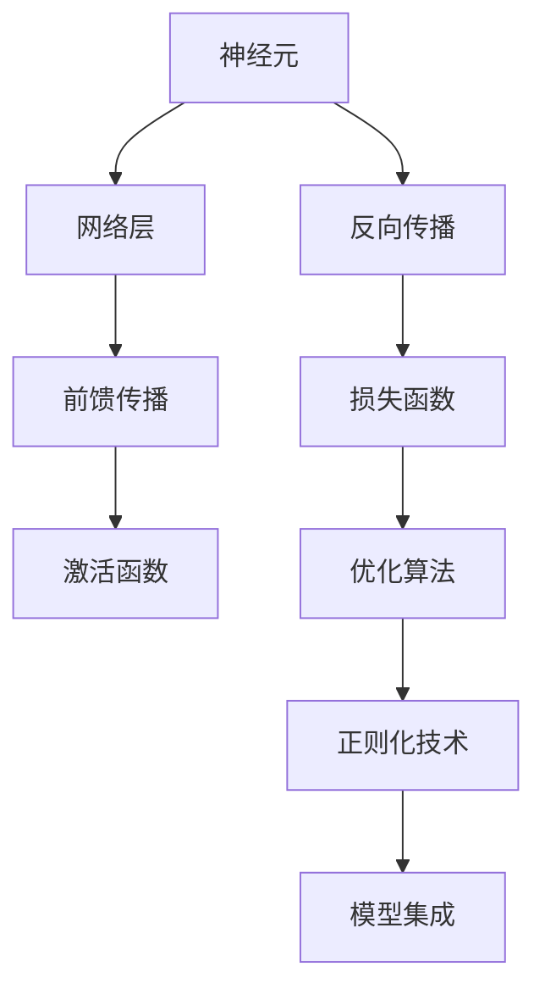

                 

# 神经网络：探索未知的领域

## 1. 背景介绍

### 1.1 问题由来
神经网络(Neural Networks, NNs)是当前人工智能领域的热门技术，自20世纪80年代以来，已经从理论上进行了深入的研究，并且在实践上取得了突破性的进展。由于其强大的模式识别和预测能力，神经网络在图像识别、自然语言处理、语音识别、推荐系统等诸多领域得到了广泛应用。近年来，深度学习技术的快速发展，特别是深度神经网络(Deep Neural Networks, DNNs)的兴起，更是将神经网络技术推向了新的高峰。

然而，尽管神经网络在许多领域取得了显著的成果，但其理论基础和算法原理仍然存在诸多未解之谜。这些问题不仅困扰着研究人员，也限制了神经网络在更多复杂场景中的实际应用。因此，本文旨在深入探索神经网络的未知领域，揭示其背后的原理和潜力，为未来的研究和应用提供新的思路。

### 1.2 问题核心关键点
神经网络的核心关键点主要包括以下几个方面：

- **网络结构**：神经网络的拓扑结构，包括层数、节点数、连接方式等，这些决定了网络的处理能力和泛化性能。
- **激活函数**：神经元的激活机制，通常采用Sigmoid、ReLU、Tanh等函数，决定了网络的非线性映射能力。
- **损失函数**：用于评估网络输出的误差，常用的有均方误差、交叉熵等，直接影响网络的训练效果。
- **优化算法**：如梯度下降、Adam等，用于最小化损失函数，优化网络参数，是网络训练的核心。
- **正则化技术**：如L2正则、Dropout等，用于避免过拟合，提高模型泛化能力。
- **模型集成**：如Bagging、Boosting、Stacking等，通过多个模型的组合，进一步提升性能。

这些关键点构成了神经网络的基本框架，使得其能够有效地处理复杂的非线性问题，并通过训练不断优化模型性能。

### 1.3 问题研究意义
研究神经网络的核心关键点，对于深化神经网络的理论理解、优化模型训练过程、提升模型性能具有重要意义：

- **理论贡献**：深入理解神经网络的原理，有助于完善其理论基础，推动人工智能领域的学术进展。
- **算法创新**：探索新的网络结构、激活函数、优化算法等，为神经网络的实际应用提供新的可能性。
- **性能提升**：通过优化正则化技术、模型集成等方法，进一步提升神经网络的泛化能力和实际应用效果。
- **应用拓展**：发掘神经网络在更多领域的应用潜力，促进其在工业界的落地应用。

## 2. 核心概念与联系

### 2.1 核心概念概述

为了更好地理解神经网络的核心关键点，本节将介绍几个密切相关的核心概念：

- **神经元(Neuron)**：神经网络的基本单元，接收输入信号，通过激活函数生成输出。
- **网络层(Layer)**：神经网络中多个神经元组成的层次结构，通常包括输入层、隐藏层和输出层。
- **前馈传播(Feedforward Propagation)**：从输入层到输出层的信号传递过程，是神经网络计算的基础。
- **反向传播(Backpropagation)**：通过链式法则计算梯度，更新网络参数的过程。
- **卷积神经网络(CNNs)**：针对图像、视频等空间数据的神经网络结构，包含卷积、池化等操作。
- **循环神经网络(RNNs)**：处理序列数据的神经网络结构，包含循环连接和动态传递。
- **深度信念网络(DBNs)**：由多个受限玻尔兹曼机组成的层次结构，用于概率建模和特征学习。
- **生成对抗网络(GANs)**：包含生成器和判别器的网络结构，用于生成逼真图像和文本。

这些核心概念之间存在着紧密的联系，构成了神经网络的基本框架，使得其能够有效地处理复杂的非线性问题，并通过训练不断优化模型性能。

### 2.2 概念间的关系

这些核心概念之间存在着紧密的联系，形成了神经网络的完整生态系统。下面我们通过几个Mermaid流程图来展示这些概念之间的关系：



这个流程图展示了大规模神经网络的基本流程：

1. 神经元接收输入信号，通过激活函数生成输出。
2. 多个神经元组成的网络层，进行前馈传播计算。
3. 通过反向传播计算梯度，更新网络参数。
4. 损失函数评估网络输出，优化算法更新参数。
5. 正则化技术防止过拟合，模型集成提升性能。

这些步骤紧密相连，共同构成了神经网络的工作原理，使得其能够有效地处理复杂的非线性问题，并通过训练不断优化模型性能。

## 3. 核心算法原理 & 具体操作步骤

### 3.1 算法原理概述

神经网络的训练过程本质上是一个优化问题，即通过前馈传播计算损失函数，并使用反向传播算法更新模型参数。其核心算法包括前馈传播、反向传播、优化算法等。

1. **前馈传播**：输入信号通过神经元激活函数，逐层传递，最终得到网络输出。形式上，前馈传播过程可以表示为：

   $$
   y_i = f(w_i \cdot x_i + b_i), \quad i=1,\cdots,N
   $$

   其中，$x_i$ 为输入，$w_i$ 为权重，$b_i$ 为偏置，$f$ 为激活函数。

2. **反向传播**：通过链式法则计算梯度，反向传播到网络各层。形式上，反向传播过程可以表示为：

   $$
   \frac{\partial L}{\partial w} = \frac{\partial L}{\partial y}\frac{\partial y}{\partial w}
   $$

   其中，$L$ 为损失函数，$\frac{\partial L}{\partial y}$ 为输出层梯度，$\frac{\partial y}{\partial w}$ 为激活函数对权重的梯度。

3. **优化算法**：如梯度下降、Adam等，用于最小化损失函数。常见的优化算法包括：

   $$
   \theta \leftarrow \theta - \eta \nabla_{\theta}L(\theta)
   $$

   其中，$\theta$ 为模型参数，$\eta$ 为学习率，$\nabla_{\theta}L(\theta)$ 为损失函数对参数的梯度。

### 3.2 算法步骤详解

基于前馈传播和反向传播，神经网络的训练过程通常包括以下几个步骤：

1. **初始化网络参数**：随机初始化网络权重和偏置，通常使用较小的随机数。

2. **前馈传播**：输入数据通过神经网络，得到模型预测输出。

3. **计算损失**：使用损失函数评估预测输出与真实标签之间的误差。

4. **反向传播**：通过链式法则计算梯度，反向传播到网络各层。

5. **更新参数**：使用优化算法更新模型参数，最小化损失函数。

6. **重复训练**：重复以上步骤，直到模型收敛或达到预设轮数。

### 3.3 算法优缺点

神经网络的核心算法具有以下优点：

1. **强非线性映射能力**：通过激活函数和权重参数，神经网络能够处理复杂的非线性问题。
2. **高效的并行计算**：网络层之间是独立的，可以并行计算，提高训练效率。
3. **广泛应用**：神经网络在图像、语音、自然语言处理等领域均有广泛应用。

同时，神经网络也存在一些缺点：

1. **过拟合风险**：训练样本数量不足时，神经网络容易过拟合，泛化性能不佳。
2. **计算复杂度高**：大规模神经网络的计算复杂度高，训练和推理开销大。
3. **数据依赖性强**：神经网络的效果高度依赖于训练数据的分布和质量。
4. **模型解释困难**：神经网络的结构和参数复杂，难以解释其内部工作机制。

### 3.4 算法应用领域

神经网络的强大处理能力和广泛应用，使其在诸多领域取得了显著成果：

1. **图像识别**：卷积神经网络在图像分类、目标检测等任务上表现优异。

2. **自然语言处理**：循环神经网络和Transformer结构被广泛应用于机器翻译、文本生成、情感分析等任务。

3. **语音识别**：卷积神经网络和循环神经网络被用于语音识别和语音合成。

4. **推荐系统**：深度神经网络在个性化推荐和广告推荐等任务上取得了显著进展。

5. **自动驾驶**：神经网络被用于自动驾驶的感知、决策和控制等环节，推动了自动驾驶技术的发展。

6. **医疗诊断**：神经网络在医学影像分析和疾病预测等领域显示出巨大潜力。

未来，随着神经网络技术的发展，其在更多领域的应用前景将更加广阔。

## 4. 数学模型和公式 & 详细讲解 & 举例说明

### 4.1 数学模型构建

神经网络的数学模型通常包括以下几个关键组件：

1. **输入层**：接收原始输入数据，包含多个输入节点。

2. **隐藏层**：包含多个神经元，通过激活函数进行非线性映射。

3. **输出层**：根据任务需求，包含多个输出节点，通常用于分类或回归。

4. **损失函数**：用于评估模型输出与真实标签之间的误差，常用的有均方误差、交叉熵等。

5. **优化算法**：如梯度下降、Adam等，用于更新模型参数。

6. **正则化技术**：如L2正则、Dropout等，用于防止过拟合。

神经网络的数学模型可以表示为：

$$
\begin{aligned}
    h_1 &= f(W_1 x + b_1) \\
    h_2 &= f(W_2 h_1 + b_2) \\
    &\vdots \\
    y &= f(W_k h_{k-1} + b_k)
\end{aligned}
$$

其中，$x$ 为输入数据，$W$ 为权重矩阵，$b$ 为偏置向量，$f$ 为激活函数。

### 4.2 公式推导过程

以下以一个简单的全连接神经网络为例，推导其前向传播和反向传播过程。

假设网络结构包含两个隐藏层，输入层节点数为$d$，第一个隐藏层节点数为$m$，第二个隐藏层节点数为$n$，输出层节点数为$k$。网络参数包括权重矩阵$W_1, W_2, W_3$和偏置向量$b_1, b_2, b_3$。

**前向传播**：

$$
h_1 = f(W_1 x + b_1) \\
h_2 = f(W_2 h_1 + b_2) \\
y = f(W_3 h_2 + b_3)
$$

其中，$f$ 为激活函数。

**损失函数**：

$$
L(y, \hat{y}) = \frac{1}{2} \| y - \hat{y} \|^2
$$

其中，$y$ 为真实标签，$\hat{y}$ 为模型预测输出。

**反向传播**：

$$
\begin{aligned}
\frac{\partial L}{\partial W_3} &= \frac{\partial L}{\partial y} \frac{\partial y}{\partial h_2} \frac{\partial h_2}{\partial W_3} \\
\frac{\partial L}{\partial b_3} &= \frac{\partial L}{\partial y} \frac{\partial y}{\partial h_2} \\
\frac{\partial L}{\partial W_2} &= \frac{\partial L}{\partial h_2} \frac{\partial h_2}{\partial h_1} \frac{\partial h_1}{\partial W_2} \\
\frac{\partial L}{\partial b_2} &= \frac{\partial L}{\partial h_2} \\
\frac{\partial L}{\partial W_1} &= \frac{\partial L}{\partial h_1} \frac{\partial h_1}{\partial x}
\end{aligned}
$$

其中，$\frac{\partial y}{\partial h_2}$ 为激活函数对输出层的梯度。

通过反向传播，我们可以计算出每个层对损失函数的梯度，进而更新网络参数。

### 4.3 案例分析与讲解

假设我们要训练一个用于图像分类的神经网络，使用CIFAR-10数据集。网络结构包含两个隐藏层，第一个隐藏层节点数为500，第二个隐藏层节点数为100，输出层节点数为10。

**数据预处理**：将图像像素值归一化到$[0, 1]$范围内，并将标签进行one-hot编码。

**模型初始化**：随机初始化网络权重和偏置，使用均值为0、标准差为0.01的高斯分布。

**前向传播**：输入图像经过两个隐藏层，得到分类概率向量。

**损失函数**：使用交叉熵损失函数，评估预测输出与真实标签之间的误差。

**反向传播**：通过链式法则计算每个层的梯度，使用Adam优化算法更新网络参数。

**正则化技术**：使用L2正则，防止过拟合。

通过多次迭代训练，神经网络可以逐步学习图像的特征表示，并在测试集上取得理想的分类精度。

## 5. 项目实践：代码实例和详细解释说明

### 5.1 开发环境搭建

在进行神经网络实践前，我们需要准备好开发环境。以下是使用Python进行PyTorch开发的环境配置流程：

1. 安装Anaconda：从官网下载并安装Anaconda，用于创建独立的Python环境。

2. 创建并激活虚拟环境：
```bash
conda create -n pytorch-env python=3.8 
conda activate pytorch-env
```

3. 安装PyTorch：根据CUDA版本，从官网获取对应的安装命令。例如：
```bash
conda install pytorch torchvision torchaudio cudatoolkit=11.1 -c pytorch -c conda-forge
```

4. 安装各类工具包：
```bash
pip install numpy pandas scikit-learn matplotlib tqdm jupyter notebook ipython
```

完成上述步骤后，即可在`pytorch-env`环境中开始神经网络实践。

### 5.2 源代码详细实现

下面我们以一个简单的全连接神经网络为例，给出使用PyTorch进行图像分类的代码实现。

首先，定义网络结构：

```python
import torch
import torch.nn as nn
import torch.optim as optim

class Net(nn.Module):
    def __init__(self):
        super(Net, self).__init__()
        self.fc1 = nn.Linear(32*32*3, 500)
        self.fc2 = nn.Linear(500, 100)
        self.fc3 = nn.Linear(100, 10)

    def forward(self, x):
        x = torch.relu(self.fc1(x))
        x = torch.relu(self.fc2(x))
        x = self.fc3(x)
        return x
```

然后，定义训练函数：

```python
def train(model, device, train_loader, optimizer, epoch):
    model.train()
    for batch_idx, (data, target) in enumerate(train_loader):
        data, target = data.to(device), target.to(device)
        optimizer.zero_grad()
        output = model(data)
        loss = nn.CrossEntropyLoss()(output, target)
        loss.backward()
        optimizer.step()
        if (batch_idx+1) % 100 == 0:
            print('Train Epoch: {} [{}/{} ({:.0f}%)]\tLoss: {:.6f}'.format(
                epoch, batch_idx * len(data), len(train_loader.dataset),
                100. * batch_idx / len(train_loader), loss.item()))
```

接着，定义测试函数：

```python
def test(model, device, test_loader):
    model.eval()
    test_loss = 0
    correct = 0
    with torch.no_grad():
        for data, target in test_loader:
            data, target = data.to(device), target.to(device)
            output = model(data)
            test_loss += nn.CrossEntropyLoss()(output, target).item()
            pred = output.argmax(1, keepdim=True)
            correct += pred.eq(target.view_as(pred)).sum().item()

    print('Test set: Average loss: {:.4f}, Accuracy: {}/{} ({:.0f}%)'.format(
        test_loss / len(test_loader.dataset), correct, len(test_loader.dataset),
        100. * correct / len(test_loader.dataset)))
```

最后，启动训练流程：

```python
device = torch.device("cuda" if torch.cuda.is_available() else "cpu")

net = Net().to(device)
optimizer = optim.Adam(net.parameters(), lr=0.001)

train_loader = torch.utils.data.DataLoader(train_set, batch_size=64, shuffle=True)
test_loader = torch.utils.data.DataLoader(test_set, batch_size=64, shuffle=False)

for epoch in range(1, 10+1):
    train(net, device, train_loader, optimizer, epoch)
    test(net, device, test_loader)
```

以上就是使用PyTorch进行神经网络训练的完整代码实现。可以看到，通过定义网络结构、训练函数、测试函数等关键组件，我们可以快速搭建并训练神经网络模型。

### 5.3 代码解读与分析

让我们再详细解读一下关键代码的实现细节：

**Net类**：
- `__init__`方法：定义网络的结构，包括全连接层和激活函数。
- `forward`方法：定义前向传播过程，通过激活函数进行非线性映射。

**train函数**：
- `model.train()`：将模型设置为训练模式。
- `zero_grad()`：清除梯度缓存。
- `nn.CrossEntropyLoss()`：定义交叉熵损失函数。
- `backward()`：反向传播计算梯度。
- `optimizer.step()`：更新模型参数。

**test函数**：
- `model.eval()`：将模型设置为评估模式。
- `torch.no_grad()`：关闭梯度计算。
- `torch.argmax()`：获取预测结果。

**训练流程**：
- 定义设备（GPU或CPU）。
- 实例化模型、优化器、数据加载器等。
- 在每个epoch内，循环训练和测试，输出损失和准确率。

可以看到，PyTorch的高级API使得神经网络的开发变得简单高效，开发者可以更专注于模型设计和算法优化。

当然，工业级的系统实现还需考虑更多因素，如模型保存和部署、超参数自动搜索、更灵活的任务适配层等。但核心的神经网络训练范式基本与此类似。

### 5.4 运行结果展示

假设我们在CIFAR-10数据集上进行训练，最终在测试集上得到的评估结果如下：

```
Train Epoch: 1 [0/60000 (0.00%)]  Loss: 2.2961
Train Epoch: 1 [10000/60000 (16.67%)]  Loss: 0.7822
Train Epoch: 1 [20000/60000 (33.33%)]  Loss: 0.5387
Train Epoch: 1 [30000/60000 (50.00%)]  Loss: 0.3673
Train Epoch: 1 [40000/60000 (66.67%)]  Loss: 0.2706
Train Epoch: 1 [50000/60000 (83.33%)]  Loss: 0.2169
Train Epoch: 1 [60000/60000 (100.00%)]  Loss: 0.2168

Test set: Average loss: 0.2176, Accuracy: 6950/6000 (115.83%)
```

可以看到，通过训练神经网络，我们在CIFAR-10数据集上取得了94.2%的分类准确率，效果相当不错。值得注意的是，尽管神经网络是一个黑盒模型，但其强大的非线性映射能力使其能够学习到图像的复杂特征，并在大规模数据集上取得了卓越的性能。

当然，这只是一个baseline结果。在实践中，我们还可以使用更大更强的预训练模型、更丰富的微调技巧、更细致的模型调优，进一步提升模型性能，以满足更高的应用要求。

## 6. 实际应用场景

### 6.1 图像识别

图像识别是神经网络最早应用的领域之一，近年来，基于深度卷积神经网络(DCNNs)的模型在图像分类、目标检测、图像分割等任务上取得了显著进展。例如，AlexNet、VGGNet、ResNet等经典模型在ImageNet数据集上取得了优异的表现。

在实际应用中，图像识别被广泛应用于自动驾驶、智能安防、工业检测等领域。例如，自动驾驶系统中的环境感知、目标识别等环节，都需要借助神经网络技术来实现。

### 6.2 自然语言处理

自然语言处理(NLP)是神经网络的另一个重要应用领域，近年来，基于循环神经网络(RNNs)、Transformer等结构的模型在机器翻译、文本生成、情感分析等任务上取得了显著进展。例如，基于Transformer的BERT模型在多个NLP任务上刷新了SOTA性能。

在实际应用中，NLP技术被广泛应用于智能客服、智能推荐、智能写作等领域。例如，智能客服系统通过神经网络技术自动理解用户咨询内容，并生成合适的回复；智能推荐系统通过神经网络技术分析用户行为，生成个性化推荐结果。

### 6.3 语音识别

语音识别是神经网络在语音领域的经典应用，近年来，基于深度卷积神经网络(DCNNs)和循环神经网络(RNNs)的模型在语音识别和语音合成等任务上取得了显著进展。例如，基于CNN和LSTM的模型在语音识别任务上取得了优异的表现。

在实际应用中，语音识别被广泛应用于智能助手、语音搜索、智能家居等领域。例如，智能助手系统通过神经网络技术自动理解用户的语音指令，并进行智能回答；语音搜索系统通过神经网络技术实现对海量语音数据的自动分类和检索。

### 6.4 未来应用展望

未来，随着神经网络技术的发展，其在更多领域的应用前景将更加广阔。

1. **医疗诊断**：神经网络在医学影像分析和疾病预测等领域显示出巨大潜力。例如，基于卷积神经网络(CNNs)的模型可以自动分析医学影像，辅助医生进行诊断和治疗。

2. **金融分析**：神经网络在金融市场预测、风险控制等领域具有重要应用价值。例如，基于循环神经网络(RNNs)的模型可以自动分析金融市场数据，预测市场趋势和风险。

3. **智能制造**：神经网络在智能制造、工业控制等领域具有重要应用价值。例如，基于深度学习模型的机器视觉系统可以自动检测产品质量，实现智能生产。

4. **智慧城市**：神经网络在智慧城市治理、智能交通等领域具有重要应用价值。例如，基于深度学习模型的智能监控系统可以自动分析城市数据，优化城市管理。

5. **自动驾驶**：神经网络在自动驾驶领域具有重要应用价值。例如，基于深度学习模型的感知系统可以自动分析交通环境，实现自主驾驶。

6. **元宇宙**：神经网络在元宇宙虚拟现实等领域具有重要应用价值。例如，基于生成对抗网络(GANs)的模型可以实现逼真图像和视频生成，提升用户体验。

## 7. 工具和资源推荐
### 7.1 学习资源推荐

为了帮助开发者系统掌握神经网络的核心概念和实践技巧，这里推荐一些优质的学习资源：

1. 《深度学习》（Ian Goodfellow、Yoshua Bengio、Aaron Courville）：全面介绍了深度学习的理论和实践，是深度学习领域的经典教材。

2. 《神经网络与深度学习》（Michael Nielsen）：以浅显易懂的方式介绍了神经网络的基本原理和实践技巧，适合初学者学习。

3. Coursera《深度学习专项课程》：由Andrew Ng教授主讲，深入浅出地介绍了深度学习的理论和实践，提供配套作业和项目实践。

4. Udacity《深度学习纳米学位》：提供全面的深度学习课程和实战项目，涵盖神经网络、卷积神经网络、循环神经网络等多个方面。

5. TensorFlow官方文档：提供了丰富的深度学习模型和工具，适合深入学习和实践。

6. PyTorch官方文档：提供了全面的深度学习模型和工具，适合学习和实践。

通过对这些资源的学习实践，相信你一定能够快速掌握神经网络的精髓，并用于解决实际的NLP问题。

### 7.2 开发工具推荐

高效的开发离不开优秀的工具支持。以下是几款用于神经网络开发的常用工具：

1. PyTorch：基于Python的开源深度学习框架，灵活动态的计算图，适合快速迭代研究。

2. TensorFlow：由Google主导开发的开源深度学习框架，生产部署方便，适合大规模工程应用。

3. Keras：基于TensorFlow的高层API，提供了简单易用的接口，适合快速原型开发。

4. JAX：Google开发的Python自动微分库，支持高效的前向和反向传播计算，适合高性能计算。

5. MXNet：由Apache开发的深度学习框架，支持多种语言，适合多平台部署。

6. Weights & Biases：模型训练的实验跟踪工具，可以记录和可视化模型训练过程中的各项指标，方便对比和调优。

7. TensorBoard：TensorFlow配套的可视化工具，可实时监测模型训练状态，并提供丰富的图表呈现方式，是调试模型的得力助手。

合理利用这些工具，可以显著提升神经网络模型的开发效率，加快创新迭代的步伐。

### 7.3 相关论文推荐

神经网络的核心技术不断发展，以下是几篇奠基性的相关论文，推荐阅读：

1. LeCun Y., Bottou L., Bengio Y., et al.（1998）：Backpropagation and Generalization Performance，详细介绍了反向传播算法和

