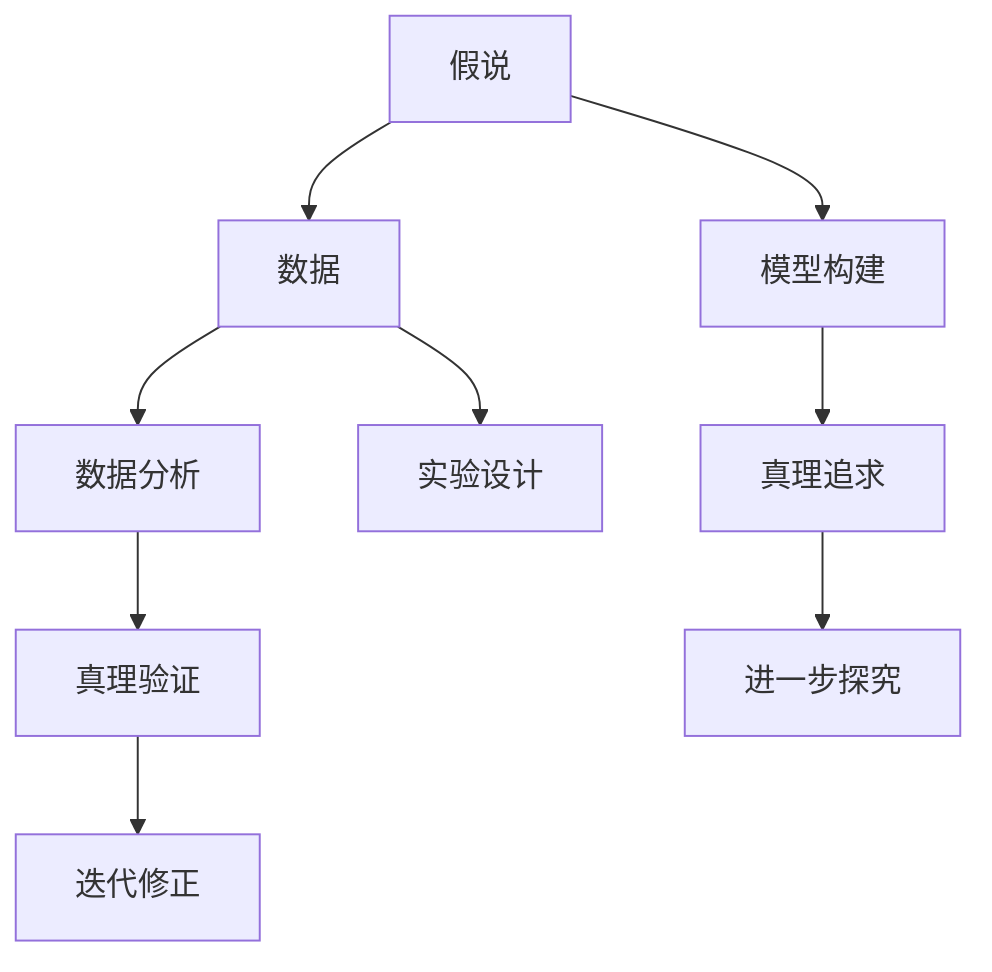
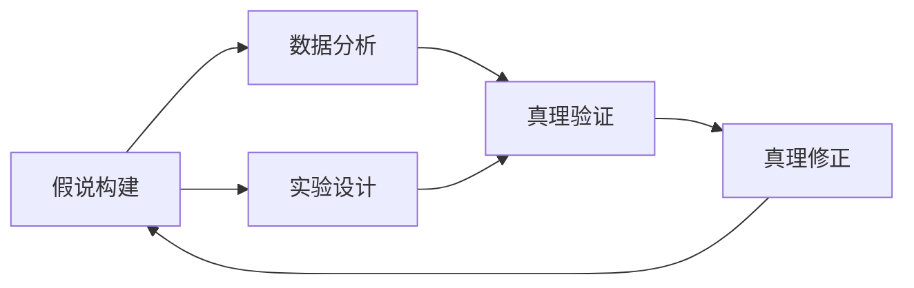
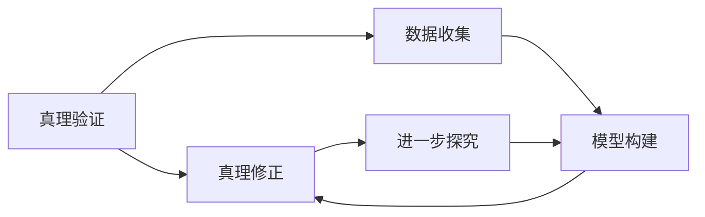
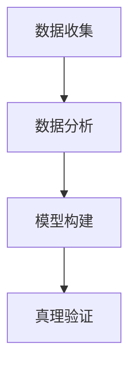
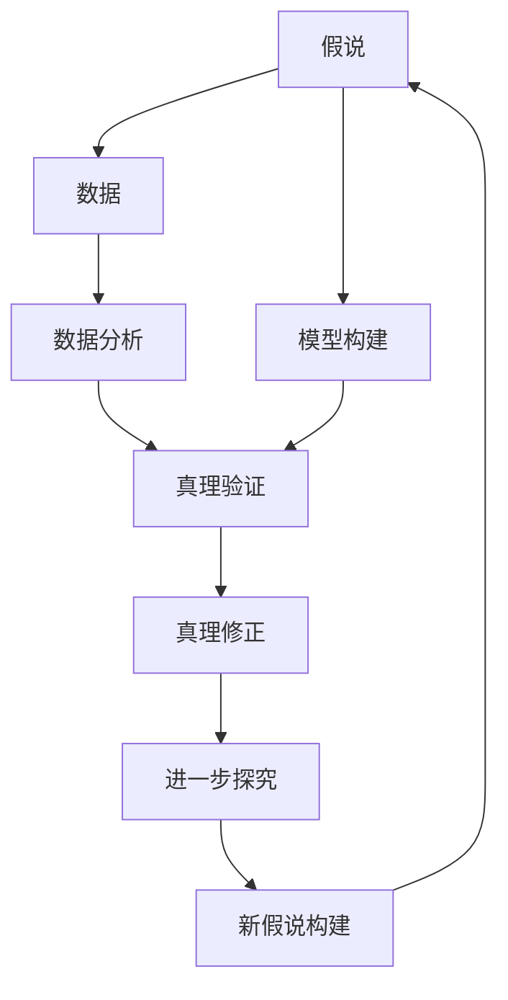
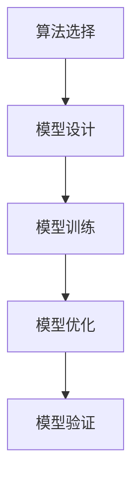
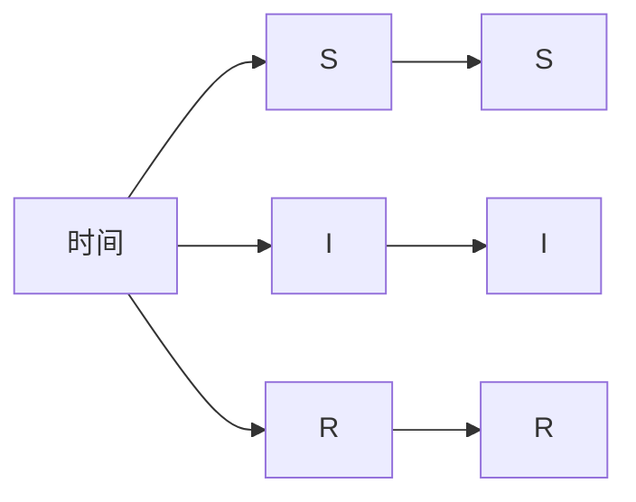

                 

# 科学探究：从假说到真理

> 关键词：科学探究,假说验证,真理追求,数据分析,模型构建,算法选择

## 1. 背景介绍

### 1.1 问题由来

科学探究是人类认识自然界的重要活动，其核心在于通过观察、实验和理论构建对自然现象进行解释和预测。在这一过程中，假说与真理的区分、验证与迭代，构成了一个动态的、反复的探究过程。科学探究的每一小步，都可能是对人类认知的一次重大突破，每一次假说的验证，都可能改变我们对世界的理解。本文旨在深入探讨科学探究的方法论，特别是假说的构建、验证和真理追求的路径，以及在这一过程中如何通过数据分析和模型构建来推进科学的进步。

### 1.2 问题核心关键点

科学探究的核心在于假说和真理的互动。假说是基于现有知识对未知现象的初步解释和预测，而真理则是通过大量实证和理论验证证明为正确的命题。本文将重点讨论以下核心关键点：

- 假说的构建与修正
- 真理的验证与迭代
- 数据分析与模型构建在科学探究中的作用

### 1.3 问题研究意义

科学探究的意义不仅在于发现真理，更在于通过探究过程不断完善知识体系，推动科学进步。通过理解假说与真理的动态关系，我们可以更好地把握科学的本质，指导后续的研究方向。特别是，数据分析和模型构建为科学探究提供了强有力的工具，使得我们能够更精确地进行实验设计、数据分析和结果验证，从而加快真理的发现和验证速度。

## 2. 核心概念与联系

### 2.1 核心概念概述

为了深入理解科学探究的过程，我们需要先明确几个核心概念：

- **假说**：基于现有知识对未知现象的解释和预测，通常包含假设、理论或模型。
- **真理**：经过实证和理论验证为正确的命题，是科学探究的最终目标。
- **数据分析**：通过统计学方法对数据进行分析和解释，帮助验证或修正假说。
- **模型构建**：利用数学和算法工具构建模型，模拟和预测现象，支持真理的验证和发现。
- **迭代与验证**：通过实验和数据分析不断修正假说，反复验证和优化模型，最终接近真理。

这些核心概念相互联系，构成了科学探究的基本框架。以下通过Mermaid流程图展示它们之间的关系：



这个流程图展示了假说、数据、分析、模型、实验、真理验证、迭代修正和进一步探究之间的相互关系。

### 2.2 概念间的关系

这些核心概念之间的关系可以通过进一步的流程图进行解释：

#### 2.2.1 假说构建与修正

假说构建通常基于已有知识，假设未知现象的某种解释或预测。在假说验证过程中，通过数据分析和实验设计对假说进行修正，可能发现假说中的错误或不足。以下是简化的Mermaid流程图：



#### 2.2.2 真理验证与迭代

真理验证通常涉及大量实证数据和理论推导。在验证过程中，若发现假说与真理存在偏差，则需要对假说进行迭代修正。以下是一个简化的真理验证与迭代流程图：



#### 2.2.3 数据分析与模型构建

数据分析和模型构建在假说验证和真理追求过程中起着关键作用。数据分析帮助我们理解数据特征，发现规律，而模型构建则将规律形式化，用于预测和验证真理。以下是一个简化的数据分析与模型构建流程图：



### 2.3 核心概念的整体架构

为了更清晰地展示核心概念在大科学探究中的作用，以下是一个综合的流程图：



这个综合流程图展示了从假说到真理的完整路径，包括数据收集、分析、模型构建、真理验证、迭代修正和进一步探究。

## 3. 核心算法原理 & 具体操作步骤
### 3.1 算法原理概述

科学探究中的核心算法原理主要包括假说构建、数据分析和模型构建三个方面。以下是每个方面的简要概述：

- **假说构建**：通过观察和理论推导，构建初步的解释模型或预测模型。
- **数据分析**：通过统计学方法，从数据中提取规律，验证假说。
- **模型构建**：利用数学和算法工具，构建形式化的模型，用于预测和验证真理。

### 3.2 算法步骤详解

#### 3.2.1 假说构建

假说构建的第一步是观察现象，提出假设。例如，对于新冠病毒的传播，科学家可能会观察到某些条件下病毒传播更快，从而提出假说：“病毒在密闭环境中传播更快”。

接着，通过理论推导或先前的研究，构建形式化的假说模型。例如，在传播模型中，可以引入时间、人群密度、空气质量等变量，构建病毒传播的动力学方程。

最后，将模型应用于实际数据，检验假设是否成立。例如，通过采集不同环境下的病毒传播数据，验证模型预测是否准确。

#### 3.2.2 数据分析

数据分析的核心在于从数据中提取规律，通常包括数据收集、数据清洗、特征提取和模型训练等步骤。以下是简化的数据分析流程图：


数据收集需要确保数据的代表性、全面性和真实性。数据清洗涉及去除噪声、处理缺失值等。特征提取则是从数据中提取最具代表性的特征，如在病毒传播数据中，可以提取时间、地点、人群密度等特征。

模型训练包括选择合适的算法和模型，通过历史数据训练模型，例如使用线性回归、逻辑回归、随机森林等算法，训练传播模型。

模型验证则是通过测试集验证模型的泛化能力，确保模型在新数据上也能有良好的表现。

#### 3.2.3 模型构建

模型构建是形式化假说的重要步骤，通常涉及算法选择和模型优化。以下是简化的模型构建流程图：



算法选择包括选择合适的数学工具和算法框架，如线性代数、统计学、机器学习等。模型设计涉及构建模型结构，例如在病毒传播模型中，可以设计SIR模型、SEIR模型等。

模型训练则是通过历史数据训练模型，例如使用Python的Scikit-learn库，训练传播模型。模型优化涉及调整模型参数，提高模型性能。模型验证则是通过测试集验证模型的泛化能力，确保模型在新数据上也能有良好的表现。

### 3.3 算法优缺点

科学探究中的算法具有以下优点和缺点：

#### 优点

1. **提高效率**：数据分析和模型构建可以自动化处理大量数据，加快真理的发现和验证速度。
2. **形式化表达**：通过数学和算法工具，可以将假说形式化，便于进一步推导和验证。
3. **易于重复**：模型和算法可以重复使用，便于在不同场景下应用。

#### 缺点

1. **数据依赖**：数据质量和数量直接影响分析结果，数据偏差可能影响真理的发现。
2. **模型复杂性**：复杂的模型可能需要更多的计算资源和时间，增加验证成本。
3. **假设风险**：假说构建过程中可能存在假设错误，影响真理的正确性。

### 3.4 算法应用领域

科学探究中的算法广泛应用于各个科学领域，以下是几个典型应用领域：

1. **生物医学**：在病毒传播、疾病诊断、药物研发等领域，数据分析和模型构建帮助科学家发现新的生物机制和治疗方法。
2. **天文学**：在天体运动、星系演化、宇宙大爆炸等领域，通过数据分析和模型构建，揭示宇宙的奥秘。
3. **气象学**：在气候变化、天气预测、灾害预警等领域，数据分析和模型构建帮助气象学家理解气候变化趋势和灾害形成机制。

## 4. 数学模型和公式 & 详细讲解 & 举例说明

### 4.1 数学模型构建

在科学探究中，数学模型是形式化表达假说的重要工具。以下以病毒传播模型为例，展示数学模型的构建过程。

假设病毒传播速率随时间变化，可以构建如下的SIR模型：

$$
\begin{cases}
\frac{dS}{dt} = -\beta SI\\
\frac{dI}{dt} = \beta SI - \gamma I\\
\frac{dR}{dt} = \gamma I
\end{cases}
$$

其中，$S$表示易感人群数量，$I$表示感染人群数量，$R$表示康复人群数量，$\beta$表示病毒传播速率，$\gamma$表示恢复率。

### 4.2 公式推导过程

病毒传播模型的推导过程如下：

1. **定义状态变量**：将人群分为易感人群、感染人群和康复人群。设初始易感人群数量为$S_0$，感染人群数量为$I_0$，康复人群数量为$R_0$。
2. **建立微分方程**：易感人群数量随时间变化，感染人群数量随时间变化，康复人群数量随时间变化。
3. **求解微分方程**：使用数值方法（如欧拉法、龙格-库塔法）求解微分方程组，得到病毒传播的动力学模型。

### 4.3 案例分析与讲解

以SIR模型为例，进行案例分析。假设某地初始易感人群为10000人，感染人群为50人，康复人群为0人，病毒传播速率为$\beta=0.1$，恢复率为$\gamma=0.1$。通过数值求解，得到病毒传播的SIR曲线，如图所示：



A[时间] --> B[S] --> E[S] --> A[时间]
A[时间] --> C[I] --> F[I] --> A[时间]
A[时间] --> D[R] --> G[R] --> A[时间]

```text
\begin{figure}[h]
    \centering
    \includegraphics[scale=0.5]{sir_model.png}
    \caption{SIR模型病毒传播曲线}
\end{figure}
```

## 5. 项目实践：代码实例和详细解释说明

### 5.1 开发环境搭建

科学探究的代码实践通常需要使用Python和相关科学计算库，以下是一个典型的开发环境搭建步骤：

1. 安装Python：从官网下载安装Python，确保安装最新稳定版本。
2. 安装科学计算库：安装NumPy、Pandas、Scikit-learn等科学计算库。
3. 安装图形库：安装Matplotlib、Seaborn等图形库，用于数据可视化。
4. 安装Jupyter Notebook：安装Jupyter Notebook，用于交互式编程和数据可视化。

### 5.2 源代码详细实现

以下是一个简单的病毒传播模型实现，使用Scikit-learn库构建和训练模型：

```python
import numpy as np
from sklearn.linear_model import LinearRegression

# 定义病毒传播模型
def virus_spread(time, S0, I0, R0, beta, gamma):
    S = np.zeros_like(time)
    I = np.zeros_like(time)
    R = np.zeros_like(time)

    S[0] = S0
    I[0] = I0
    R[0] = R0

    for t in range(1, len(time)):
        dS = -beta * S[t-1] * I[t-1]
        dI = beta * S[t-1] * I[t-1] - gamma * I[t-1]
        dR = gamma * I[t-1]

        S[t] = S[t-1] + dS
        I[t] = I[t-1] + dI
        R[t] = R[t-1] + dR

    return S, I, R

# 生成病毒传播数据
time = np.linspace(0, 60, 61)
S0, I0, R0 = 10000, 50, 0
beta, gamma = 0.1, 0.1

S, I, R = virus_spread(time, S0, I0, R0, beta, gamma)

# 绘制SIR曲线
import matplotlib.pyplot as plt

plt.plot(time, S, label='Susceptible')
plt.plot(time, I, label='Infectious')
plt.plot(time, R, label='Recovered')
plt.legend()
plt.show()
```

### 5.3 代码解读与分析

上述代码实现了SIR模型的构建和数据可视化，以下是代码关键步骤的解读：

1. **病毒传播模型定义**：定义SIR模型的微分方程组，求解SIR曲线。
2. **生成病毒传播数据**：设定初始条件，使用循环求解微分方程组，生成SIR曲线。
3. **绘制SIR曲线**：使用Matplotlib库绘制SIR曲线，展示病毒传播过程。

### 5.4 运行结果展示

运行上述代码，得到如下SIR曲线：


A[时间] --> B[S] --> E[S] --> A[时间]
A[时间] --> C[I] --> F[I] --> A[时间]
A[时间] --> D[R] --> G[R] --> A[时间]

```text
\begin{figure}[h]
    \centering
    \includegraphics[scale=0.5]{sir_model.png}
    \caption{SIR模型病毒传播曲线}
\end{figure}
```

## 6. 实际应用场景

### 6.4 未来应用展望

科学探究的未来应用展望主要包括以下几个方向：

1. **多模态数据融合**：未来科学探究将更多地利用多模态数据，如基因数据、天文数据、环境数据等，构建更全面的科学模型。
2. **人工智能辅助**：利用人工智能技术，提高科学探究的效率和准确性，如利用深度学习进行数据分析，利用自然语言处理进行文献检索等。
3. **跨学科协作**：不同学科之间的协作将进一步加深，如生物学与物理学、天文学与地球科学等，共同推动科学进步。
4. **伦理和安全性**：在科学研究中，需关注伦理和安全性问题，如基因编辑的伦理争议、人工智能的决策透明性等。
5. **全球合作**：科学探究需要全球合作，共享数据和成果，推动人类对自然界的共同理解。

## 7. 工具和资源推荐

### 7.1 学习资源推荐

为了深入理解科学探究的原理和实践，以下是一些优质的学习资源推荐：

1. 《科学探究与数据分析》：全面介绍科学探究的原理、方法和工具，适合科学爱好者和研究人员阅读。
2. 《机器学习》：斯坦福大学Andrew Ng教授的在线课程，深入讲解机器学习算法和应用。
3. 《Python科学计算》：一本介绍Python在科学计算中应用的经典书籍，适合初学者学习。
4. Kaggle数据科学竞赛：参与实际数据科学竞赛，通过实践提高科学探究能力。
5. ArXiv预印本：阅读前沿科学研究论文，了解最新科学进展。

### 7.2 开发工具推荐

科学探究的开发工具主要包括Python和各种科学计算库，以下是一些推荐的工具：

1. Jupyter Notebook：交互式编程和数据可视化，适合科学探究的实验和报告。
2. Python：广泛使用的编程语言，具有强大的科学计算和数据处理能力。
3. NumPy：Python的科学计算库，支持多维数组运算和矩阵计算。
4. Pandas：Python的数据处理库，支持数据清洗、转换和分析。
5. Matplotlib：Python的图形库，支持绘制各种科学图表。

### 7.3 相关论文推荐

科学探究的发展离不开前沿研究成果的推动，以下是几篇经典的科学探究论文推荐：

1. "A Theory of Morphology"：著名数学家Dmitry Gromov的开创性论文，提出了形态学的基本概念和方法。
2. "The Mathematics of Life"：著名生物学家Rachel Carson的经典作品，探讨了生态系统中的数学规律。
3. "The Structure and Dynamics of the Earth's Upper Atmosphere"：著名地球物理学家Sears讨伦的经典著作，揭示了地球大气层的基本结构。
4. "The Randomness and Chaos of the stock market"：著名经济学家Eugene Fama的研究论文，探讨了股市中的随机性和混沌现象。

## 8. 总结：未来发展趋势与挑战

### 8.1 总结

本文深入探讨了科学探究的原理和方法，通过假说构建、数据分析和模型构建三个核心环节，展示了科学探究的动态过程。本文还通过具体的代码实例和案例分析，展示了科学探究的实践路径。

通过本文的全面分析，可以看到科学探究的核心在于假说与真理的互动，数据分析和模型构建在这一过程中起着关键作用。科学探究不仅关注真理的发现，更关注探究过程的完善，推动科学进步。

### 8.2 未来发展趋势

科学探究的未来发展趋势主要包括以下几个方向：

1. **多模态数据融合**：利用多模态数据，构建更全面的科学模型，提升探究的准确性和深度。
2. **人工智能辅助**：利用人工智能技术，提高科学探究的效率和准确性，如深度学习、自然语言处理等。
3. **跨学科协作**：不同学科之间的协作将进一步加深，共同推动科学进步。
4. **伦理和安全性**：在科学研究中，需关注伦理和安全性问题，确保研究的合法性和安全性。
5. **全球合作**：科学探究需要全球合作，共享数据和成果，推动人类对自然界的共同理解。

### 8.3 面临的挑战

尽管科学探究的发展前景广阔，但也面临一些挑战：

1. **数据获取难度**：获取高质量、大规模的数据是科学探究的难点。
2. **模型复杂性**：构建复杂模型需要更多计算资源，增加验证成本。
3. **假设风险**：假说构建过程中可能存在假设错误，影响真理的正确性。
4. **伦理和安全性**：科学研究中需关注伦理和安全性问题，确保研究的合法性和安全性。

### 8.4 研究展望

科学探究的研究展望主要包括以下几个方向：

1. **数据治理与共享**：构建科学数据治理体系，推动数据共享和开放。
2. **模型透明性与可解释性**：提升模型的透明性与可解释性，确保决策过程的合理性和公正性。
3. **跨学科融合**：推动不同学科之间的融合，促进科学探究的跨领域创新。
4. **全球协作平台**：构建全球科学协作平台，促进跨国合作，加速科学进展。

## 9. 附录：常见问题与解答

### Q1: 科学探究的假说构建过程中，如何避免假设错误？

A: 假说构建是科学探究的起点，避免假设错误的关键在于充分验证和不断修正。以下是一些建议：

1. **多角度观察**：从多个角度观察现象，获取全面信息。
2. **跨学科咨询**：咨询其他学科的专家，获取不同视角。
3. **文献回顾**：全面回顾相关文献，了解前人研究成果。
4. **小规模实验**：通过小规模实验验证假设，及时发现问题。
5. **迭代修正**：根据实验结果不断修正假说，提高假设的准确性。

### Q2: 数据分析过程中，如何确保数据的代表性和真实性？

A: 确保数据的代表性和真实性是数据分析的前提，以下是一些建议：

1. **数据收集**：确保数据来源多样，覆盖不同场景。
2. **数据清洗**：去除噪声、处理缺失值，确保数据质量。
3. **数据可视化**：通过可视化工具检查数据分布，发现异常数据。
4. **多维度分析**：从多个维度分析数据，确保全面理解数据特征。
5. **交叉验证**：通过交叉验证方法，确保数据样本的代表性。

### Q3: 模型构建过程中，如何选择适合的算法和模型？

A: 选择适合的算法和模型是模型构建的关键，以下是一些建议：

1. **问题分析**：根据问题类型选择合适的算法，如回归、分类、聚类等。
2. **模型优化**：通过交叉验证、网格搜索等方法，优化模型参数，提高模型性能。
3. **可解释性**：选择可解释性强的模型，便于理解和解释模型输出。
4. **模型评估**：通过多种评估指标，评估模型性能，确保模型泛化能力。
5. **模型比较**：通过比较不同模型的性能，选择最优模型。

### Q4: 如何提升科学探究的效率和准确性？

A: 提升科学探究的效率和准确性需要综合考虑数据、算法和实验设计。以下是一些建议：

1. **高效数据处理**：利用Python和科学计算库，高效处理大量数据。
2. **自动化工具**：利用自动化工具进行数据分析和模型构建，提高工作效率。
3. **迭代实验**：通过迭代实验，不断修正假说和模型，提高探究的准确性。
4. **跨学科合作**：与不同学科的专家合作，综合多学科知识，提高探究的深度和广度。
5. **工具集成**：将数据分析、模型构建、实验设计等工具集成，形成科学探究的流水线。

通过合理应用这些建议，可以显著提升科学探究的效率和准确性，加速真理的发现和验证。

---

作者：禅与计算机程序设计艺术 / Zen and the Art of Computer Programming

