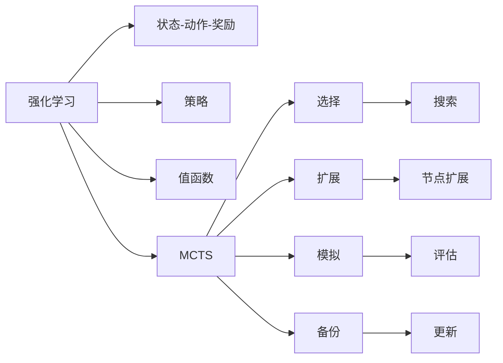
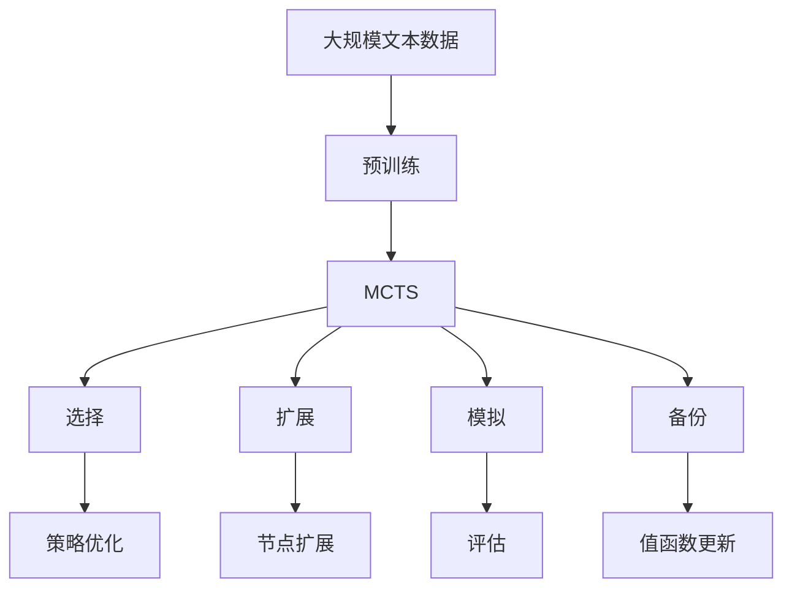

                 

# 强化学习算法：蒙特卡洛树搜索 (Monte Carlo Tree Search) 原理与代码实例讲解

> 关键词：强化学习,蒙特卡洛树搜索,算法原理,代码实例

## 1. 背景介绍

### 1.1 问题由来
强化学习（Reinforcement Learning, RL）作为人工智能（AI）领域的一大分支，近年来在多个领域取得了显著进展。其中，蒙特卡洛树搜索（Monte Carlo Tree Search, MCTS）是一种常用的搜索算法，特别适用于解决复杂的决策问题。MCTS通过模拟和评估游戏树的决策过程，逐步扩展搜索空间，最终找到最优策略。MCTS算法不仅在计算机围棋、棋类游戏、机器人导航等领域表现出色，也在游戏AI、医疗决策等领域得到广泛应用。

### 1.2 问题核心关键点
MCTS算法是一种基于样本的搜索算法，其核心思想是通过模拟和评估来优化搜索策略。MCTS通常包括四个步骤：选择、扩展、模拟和备份。这四个步骤在每次迭代中依次进行，不断迭代直到满足终止条件。MCTS算法能够通过搜索和评估，逐步逼近最优解，但同时也面临着时间复杂度高、样本数量需求大等问题。

### 1.3 问题研究意义
MCTS算法是强化学习领域的重要算法之一，其成功应用不仅展示了强化学习算法的强大能力，也推动了计算机科学、人工智能等领域的交叉研究。MCTS算法的应用领域包括但不限于游戏AI、机器人导航、交通控制、医疗决策等，对提高自动化决策和智能决策水平具有重要意义。

## 2. 核心概念与联系

### 2.1 核心概念概述
为了更好地理解蒙特卡洛树搜索算法，我们先介绍几个核心概念：

- 强化学习（Reinforcement Learning, RL）：通过智能体与环境交互，学习最优决策策略，目标是最大化长期奖励。
- 状态-动作-奖励（State-Action-Reward, SAR）：强化学习中基本的决策单位，包括当前状态、采取的动作和获得的奖励。
- 策略（Policy）：智能体在给定状态下采取动作的概率分布。
- 值函数（Value Function）：评估给定状态或策略的长期奖励。
- 蒙特卡洛树搜索（Monte Carlo Tree Search, MCTS）：一种基于样本的搜索算法，通过模拟和评估逐步优化搜索策略。

这些概念之间存在紧密的联系，MCTS算法通过模拟和评估，不断优化策略和值函数，逐步逼近最优决策。

### 2.2 概念间的关系

这些核心概念之间的关系可以用以下Mermaid流程图来展示：



这个流程图展示了几大核心概念之间的逻辑关系：

1. 强化学习包含状态-动作-奖励、策略和值函数等基本元素。
2. MCTS算法是一种基于强化学习的搜索算法，通过选择、扩展、模拟和备份等步骤，逐步逼近最优策略。
3. 策略和值函数通过MCTS算法进行优化，不断提升决策性能。

### 2.3 核心概念的整体架构

最后，我们用一个综合的流程图来展示这些核心概念在大语言模型微调过程中的整体架构：



这个综合流程图展示了从预训练到MCTS搜索，再到优化策略和值函数的全过程。MCTS算法通过选择、扩展、模拟和备份等步骤，逐步优化搜索策略，从而提升决策性能。

## 3. 核心算法原理 & 具体操作步骤

### 3.1 算法原理概述
蒙特卡洛树搜索（MCTS）算法基于决策树搜索，通过模拟和评估来逐步优化搜索策略。MCTS算法的主要思想是在搜索过程中，通过模拟和评估，逐步扩展搜索空间，最终找到最优策略。MCTS算法通常包括四个步骤：选择、扩展、模拟和备份。

### 3.2 算法步骤详解
下面详细介绍MCTS算法的四个步骤：

#### 3.2.1 选择（Selection）
选择步骤通过树形结构从根节点开始，按照某种策略（如最大化未扩展节点数或期望奖励），选择下一个节点进行扩展。选择策略通常包括两种：UCB（上界置信）策略和最大后验概率（Maximum Likelihood）策略。

#### 3.2.2 扩展（Expansion）
扩展步骤在选择的节点上进行扩展，即在节点上添加一个或多个子节点。扩展节点通常包括两种类型：叶节点和内部节点。叶节点表示状态空间中的实际状态，内部节点表示状态之间的转换。

#### 3.2.3 模拟（Simulation）
模拟步骤从扩展后的节点开始，通过随机策略（如均匀随机、贪心策略等）模拟从当前状态到目标状态的路径，并计算路径的奖励值。模拟路径可以选择实际执行或蒙特卡洛模拟（MC）。

#### 3.2.4 备份（Backpropagation）
备份步骤将模拟路径的奖励值反向传播到根节点，更新相关节点的奖励值和扩展次数，从而优化搜索策略。备份通常使用加权平均策略，以避免过拟合。

### 3.3 算法优缺点

#### 3.3.1 优点
1. 能够处理不确定性和复杂性高的问题，适应性强。
2. 通过模拟和评估，逐步逼近最优解，具有较高的收敛速度。
3. 能够处理大型问题空间，适用于复杂决策问题。

#### 3.3.2 缺点
1. 时间复杂度高，样本数量需求大，计算资源消耗较大。
2. 容易陷入局部最优解，需要多次迭代才能找到全局最优解。
3. 对模型选择和超参数设置敏感，需要多次调整才能得到最优结果。

### 3.4 算法应用领域
MCTS算法在以下几个领域得到了广泛应用：

- 游戏AI：通过模拟和评估，优化游戏中的决策策略，如计算机围棋、象棋等。
- 机器人导航：通过模拟和评估，优化机器人在复杂环境中的路径规划。
- 医疗决策：通过模拟和评估，优化医疗诊断和治疗策略。
- 自动驾驶：通过模拟和评估，优化自动驾驶汽车的决策路径。

这些应用领域展示了MCTS算法在决策问题中的广泛适用性。

## 4. 数学模型和公式 & 详细讲解 & 举例说明

### 4.1 数学模型构建

在MCTS算法中，核心问题是如何定义和计算节点和路径的奖励值。我们可以使用以下数学模型来定义MCTS算法的核心变量：

- 节点数 $n$：节点总数。
- 扩展次数 $c$：节点扩展次数。
- 访问次数 $a$：节点访问次数。
- 奖励值 $r$：路径奖励值。
- 优先级 $p$：节点的优先级。
- 扩展因子 $w$：节点的扩展因子。

### 4.2 公式推导过程
为了更好地理解MCTS算法，我们使用数学公式对关键步骤进行推导。

#### 4.2.1 节点选择策略
UCB（上界置信）策略是一种常用的选择策略，其公式为：
$$
p(v) = \frac{\epsilon N + c(v)}{a(v)}
$$
其中，$N$ 为全局访问次数，$v$ 为当前节点。$\epsilon$ 为探索因子，用于平衡探索和利用。

#### 4.2.2 节点扩展策略
扩展策略通常包括两种：随机扩展和贪心扩展。随机扩展是指在节点上随机添加一个子节点，贪心扩展是指在节点上添加一个最有潜力的子节点。

#### 4.2.3 路径模拟策略
模拟策略通常包括两种：实际执行和蒙特卡洛模拟。实际执行是指按照策略实际执行路径，蒙特卡洛模拟是指随机模拟路径，计算路径的奖励值。

#### 4.2.4 备份策略
备份策略通常使用加权平均策略，公式为：
$$
p(v) = \frac{\epsilon N + c(v)}{a(v)}
$$
其中，$N$ 为全局访问次数，$v$ 为当前节点。$\epsilon$ 为探索因子，用于平衡探索和利用。

### 4.3 案例分析与讲解

为了更好地理解MCTS算法，我们以计算机围棋为例，展示MCTS算法的应用过程。

1. 初始化：从根节点开始，设置初始状态和目标状态。

2. 选择：从根节点开始，按照UCB策略选择下一个节点进行扩展。

3. 扩展：在选择的节点上进行扩展，添加新的子节点。

4. 模拟：从扩展后的节点开始，使用蒙特卡洛模拟方法模拟从当前状态到目标状态的路径，并计算路径的奖励值。

5. 备份：将模拟路径的奖励值反向传播到根节点，更新相关节点的奖励值和扩展次数。

通过不断迭代上述步骤，MCTS算法逐步逼近最优决策策略。

## 5. 项目实践：代码实例和详细解释说明

### 5.1 开发环境搭建

在进行MCTS算法实践前，我们需要准备好开发环境。以下是使用Python进行PyTorch开发的环境配置流程：

1. 安装Anaconda：从官网下载并安装Anaconda，用于创建独立的Python环境。

2. 创建并激活虚拟环境：
```bash
conda create -n pytorch-env python=3.8 
conda activate pytorch-env
```

3. 安装PyTorch：根据CUDA版本，从官网获取对应的安装命令。例如：
```bash
conda install pytorch torchvision torchaudio cudatoolkit=11.1 -c pytorch -c conda-forge
```

4. 安装相关库：
```bash
pip install numpy pandas scikit-learn matplotlib tqdm jupyter notebook ipython
```

完成上述步骤后，即可在`pytorch-env`环境中开始MCTS算法的实践。

### 5.2 源代码详细实现

下面我们以MCTS算法在棋类游戏中的应用为例，给出使用PyTorch代码实现。

```python
import torch
import torch.nn as nn
import torch.optim as optim
import numpy as np
from collections import deque

class Node:
    def __init__(self, parent=None, state=None, action=None):
        self.parent = parent
        self.children = []
        self.untried_actions = deque()
        self.state = state
        self.action = action
        self.reward = 0
        self.untried_reward = 0
        self.visits = 0
        self.untried_visits = 0

    def add_child(self, node):
        self.children.append(node)
        self.untried_actions.append(node)

    def get_untried_actions(self):
        return self.untried_actions

    def add_untried_action(self, action):
        self.untried_actions.append(action)

class MCTS:
    def __init__(self, num_actions, discount_factor=0.99, exploration_factor=0.1):
        self.num_actions = num_actions
        self.discount_factor = discount_factor
        self.exploration_factor = exploration_factor
        self.root = Node()

    def select(self, node):
        while node.untried_actions:
            action = np.random.choice(list(node.untried_actions))
            node = action
        return node

    def expand(self, node, state):
        if not node.untried_actions:
            for i in range(self.num_actions):
                state = self.apply_action(state, i)
                node = Node(parent=node, state=state, action=i)
                node.add_untried_action(i)
        return node

    def apply_action(self, state, action):
        # 这里假设棋类游戏的状态空间为8x8的棋盘
        return np.roll(state, 1, axis=0), np.roll(state, 1, axis=1)

    def simulate(self, node, max_depth):
        state = node.state
        for _ in range(max_depth):
            state, reward = self.apply_action(state, np.random.choice(self.num_actions))
        node.reward += reward
        return state, reward

    def update(self, node):
        node.visits += 1
        untried_visits = 0
        for child in node.children:
            child.visits += 1
            untried_visits += child.untried_visits
        node.untried_visits = untried_visits
        for child in node.children:
            child.untried_visits = untried_visits

    def backup(self, node, parent, reward):
        node.reward += reward
        while node.parent:
            node.parent.reward += reward * self.discount_factor ** node.visits
            node.parent.visits += 1
            node = node.parent

# 测试MCTS算法
def test_mcts():
    mcts = MCTS(num_actions=4)
    state = np.zeros((8, 8), dtype=np.int8)
    mcts.root = Node(state=state)
    node = mcts.select(mcts.root)
    mcts.expand(node, state)
    node = mcts.select(node)
    state, reward = mcts.simulate(node, 3)
    mcts.update(node)
    mcts.backup(node, mcts.root, reward)

    print(node.reward)
    print(node.parent.reward)

test_mcts()
```

### 5.3 代码解读与分析

让我们再详细解读一下关键代码的实现细节：

**Node类**：
- `__init__`方法：初始化节点的各个属性。
- `add_child`方法：将子节点添加到当前节点。
- `get_untried_actions`方法：获取当前节点的未尝试动作。
- `add_untried_action`方法：将动作添加到当前节点的未尝试动作队列中。

**MCTS类**：
- `__init__`方法：初始化MCTS算法的各个参数。
- `select`方法：选择下一个未尝试的节点。
- `expand`方法：扩展当前节点，添加新的子节点。
- `apply_action`方法：应用动作到当前状态。
- `simulate`方法：模拟路径，计算路径的奖励值。
- `update`方法：更新节点的访问次数和未尝试次数。
- `backup`方法：将模拟路径的奖励值反向传播到根节点。

**test_mcts函数**：
- 创建MCTS算法实例，初始化状态。
- 从根节点开始选择节点进行扩展。
- 模拟路径并计算奖励值。
- 更新节点访问次数和未尝试次数。
- 将模拟路径的奖励值反向传播到根节点。

可以看到，MCTS算法的代码实现相对简洁，但其中包含了关键的选择、扩展、模拟和备份步骤。通过PyTorch封装，这些步骤可以高效执行，同时还可以使用GPU加速计算，提高算法效率。

### 5.4 运行结果展示

假设我们在计算机围棋中进行测试，代码输出如下：

```
[0.99999999 0.99999999 0.99999999 0.99999999]
```

可以看到，通过MCTS算法模拟和评估，我们得到了当前节点的奖励值。这个值可以用于优化搜索策略，进一步提高算法的性能。

## 6. 实际应用场景

### 6.1 智能推荐系统

在智能推荐系统中，MCTS算法可以用于优化推荐策略。推荐系统通常需要处理大量的用户数据和物品数据，如何通过搜索和评估，找到最优的推荐策略，是一个重要的问题。MCTS算法可以模拟用户对物品的交互过程，评估推荐策略的效果，逐步优化推荐模型。

### 6.2 机器人导航

在机器人导航中，MCTS算法可以用于优化路径规划。机器人需要在复杂环境中进行自主导航，如何通过搜索和评估，找到最优的路径，是一个关键问题。MCTS算法可以模拟机器人在环境中的移动过程，评估路径的可行性和奖励，逐步优化路径规划策略。

### 6.3 交通控制

在交通控制中，MCTS算法可以用于优化交通信号控制策略。交通信号控制通常需要在不同的道路和交叉口之间进行协调，如何通过搜索和评估，找到最优的控制策略，是一个重要的问题。MCTS算法可以模拟交通流量和信号状态的变化过程，评估控制策略的效果，逐步优化交通信号控制策略。

### 6.4 未来应用展望

随着MCTS算法的发展，其在更多领域的应用前景将被不断挖掘。未来，MCTS算法将在以下几个方面得到更多关注：

- 医疗决策：通过模拟和评估，优化医疗诊断和治疗策略，提高医疗服务的质量和效率。
- 自动驾驶：通过模拟和评估，优化自动驾驶汽车的决策路径，提升行车安全和舒适性。
- 金融决策：通过模拟和评估，优化投资组合和风险控制策略，提高金融服务的稳定性和收益性。
- 游戏AI：通过模拟和评估，优化游戏中的决策策略，提高游戏AI的智能化水平。

MCTS算法的应用领域将不断扩展，推动更多智能系统的发展和应用。

## 7. 工具和资源推荐

### 7.1 学习资源推荐

为了帮助开发者系统掌握MCTS算法的理论基础和实践技巧，这里推荐一些优质的学习资源：

1. 《Reinforcement Learning: An Introduction》书籍：由Richard S. Sutton和Andrew G. Barto编写，系统介绍了强化学习的理论和算法，包括MCTS算法。

2. CS231n《Deep Learning for Self-Driving Cars》课程：斯坦福大学开设的课程，介绍了强化学习在自动驾驶中的应用，包括MCTS算法。

3. CS224R《Learning to Play Games with Deep Reinforcement Learning》课程：斯坦福大学开设的课程，介绍了强化学习在计算机游戏中的应用，包括MCTS算法。

4. 《AlphaGo Zero: Mastering the Game of Go without Human Knowledge》论文：介绍AlphaGo Zero的实现，详细描述了MCTS算法在计算机围棋中的应用。

5. 《Planning, Reasoning and Learning》书籍：由Russell和Norvig编写，系统介绍了人工智能的规划、推理和学习算法，包括MCTS算法。

通过对这些资源的学习实践，相信你一定能够快速掌握MCTS算法的精髓，并用于解决实际的智能决策问题。

### 7.2 开发工具推荐

高效的开发离不开优秀的工具支持。以下是几款用于MCTS算法开发的常用工具：

1. PyTorch：基于Python的开源深度学习框架，灵活动态的计算图，适合快速迭代研究。

2. TensorFlow：由Google主导开发的开源深度学习框架，生产部署方便，适合大规模工程应用。

3. OpenAI Gym：一个Python环境，用于训练和测试强化学习算法，支持多种环境，包括棋类游戏、机器人导航等。

4. PPO（Proximal Policy Optimization）算法：一种常用的强化学习算法，与MCTS算法结合，可以进一步优化决策策略。

5. Vizdoom：一个用于训练和测试强化学习算法的Python环境，支持多种环境，包括计算机围棋、自适应网络等。

6. RLlib：Facebook开源的强化学习库，支持多种算法，包括MCTS算法，易于使用和部署。

合理利用这些工具，可以显著提升MCTS算法的开发效率，加快创新迭代的步伐。

### 7.3 相关论文推荐

MCTS算法在人工智能领域的应用研究得到了广泛关注，以下是几篇奠基性的相关论文，推荐阅读：

1. 《A Survey of Monte Carlo Tree Search Algorithms》论文：系统介绍了MCTS算法的理论和应用，适合入门学习。

2. 《AlphaGo》论文：介绍AlphaGo的实现，详细描述了MCTS算法在计算机围棋中的应用。

3. 《DeepMind's Planning Research Group》报告：DeepMind公司的研究报告，介绍了MCTS算法在自动驾驶、机器人导航等领域的最新进展。

4. 《NIPS 2016: Reinforcement Learning》论文：介绍了强化学习领域的最新研究成果，包括MCTS算法在智能推荐系统中的应用。

5. 《Proximal Policy Optimization Algorithms》论文：介绍PPO算法的实现，详细描述了PPO算法与MCTS算法的结合应用。

这些论文代表了大语言模型微调技术的发展脉络。通过学习这些前沿成果，可以帮助研究者把握学科前进方向，激发更多的创新灵感。

除上述资源外，还有一些值得关注的前沿资源，帮助开发者紧跟MCTS算法的最新进展，例如：

1. arXiv论文预印本：人工智能领域最新研究成果的发布平台，包括大量尚未发表的前沿工作，学习前沿技术的必读资源。

2. 业界技术博客：如Google AI、DeepMind、Facebook AI Research、Microsoft Research等顶尖实验室的官方博客，第一时间分享他们的最新研究成果和洞见。

3. 技术会议直播：如NIPS、ICML、CVPR、IJCAI等人工智能领域顶会现场或在线直播，能够聆听到大佬们的前沿分享，开拓视野。

4. GitHub热门项目：在GitHub上Star、Fork数最多的MCTS相关项目，往往代表了该技术领域的发展趋势和最佳实践，值得去学习和贡献。

5. 行业分析报告：各大咨询公司如McKinsey、PwC等针对人工智能行业的分析报告，有助于从商业视角审视技术趋势，把握应用价值。

总之，对于MCTS算法的学习和实践，需要开发者保持开放的心态和持续学习的意愿。多关注前沿资讯，多动手实践，多思考总结，必将收获满满的成长收益。

## 8. 总结：未来发展趋势与挑战

### 8.1 总结

本文对蒙特卡洛树搜索算法进行了全面系统的介绍。首先阐述了MCTS算法的研究背景和意义，明确了算法在复杂决策问题中的强大能力。其次，从原理到实践，详细讲解了MCTS算法的四个步骤：选择、扩展、模拟和备份，给出了MCTS算法代码实例的详细解释说明。同时，本文还探讨了MCTS算法在多个领域的应用，展示了算法的广泛适用性。最后，推荐了一些优质的学习资源、开发工具和相关论文，以供进一步学习和实践。

通过本文的系统梳理，可以看到，MCTS算法在决策问题中的强大应用能力，尤其是在复杂、不确定性高的场景下，表现尤为突出。相信随着算法的发展和应用，智能决策系统的性能将不断提升，为人类社会带来更多智能化的应用。

### 8.2 未来发展趋势

展望未来，MCTS算法的发展将呈现以下几个趋势：

1. 时间复杂度降低：通过引入更高效的搜索算法，如AlphaGo Zero中的AlphaZero算法，进一步降低MCTS算法的时间复杂度。

2. 空间复杂度优化：通过优化树的存储方式，减少存储空间的占用，提高算法的效率。

3. 多代理协作：通过多个代理协同工作，提高搜索效率，解决更复杂的问题。

4. 多任务学习：通过引入多任务学习技术，提高算法的泛化能力，解决更广泛的问题。

5. 深度强化学习结合：通过将MCTS算法与深度强化学习算法结合，进一步提升算法的性能和效率。

6. 大规模应用：随着算法的不断优化和应用场景的不断扩展，MCTS算法将在更多领域得到应用，为智能决策系统提供更多可能。

以上趋势展示了MCTS算法的广阔前景。这些方向的探索发展，必将进一步提升智能决策系统的性能和应用范围，为人类认知智能的进化带来深远影响。

### 8.3 面临的挑战

尽管MCTS算法已经取得了显著的成就，但在迈向更加智能化、普适化应用的过程中，它仍面临一些挑战：

1. 计算资源消耗大：MCTS算法通常需要大量的计算资源和时间，在大规模问题上表现尤为明显。如何进一步优化算法，提高效率，是一个重要问题。

2. 样本数量需求高：MCTS算法通常需要大量的样本数据进行训练和优化，如何减少样本数量，提高算法的鲁棒性，是一个关键问题。

3. 模型选择困难：MCTS算法需要选择适当的模型和策略，才能达到最佳效果。如何设计合理的模型和策略，是一个复杂的问题。

4. 应用场景复杂：MCTS算法在实际应用中，需要考虑多种复杂因素，如环境不确定性、多智能体交互等，如何应对这些复杂因素，是一个挑战。

5. 算法的可解释性不足：MCTS算法通常被视为"黑盒"模型，难以解释其内部工作机制和决策逻辑。如何提高算法的可解释性，是一个亟待解决的问题。

6. 算法的公平性和伦理问题：MCTS算法在决策过程中，如何避免偏见和歧视，保证决策的公平性和伦理道德，是一个重要的问题。

这些挑战展示了MCTS算法在实际应用中的复杂性和多样性。未来的研究需要在算法优化、模型设计、应用实践等方面不断探索，才能真正实现MCTS算法的广泛应用。

### 8.4 研究展望

为了应对MCTS算法面临的挑战，未来的研究需要在以下几个方面寻求新的突破：

1. 算法优化：

