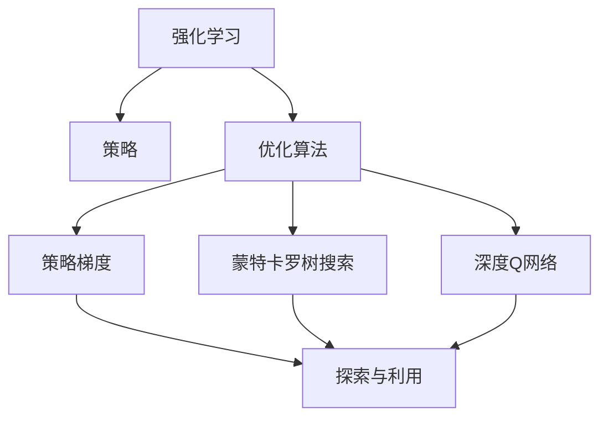
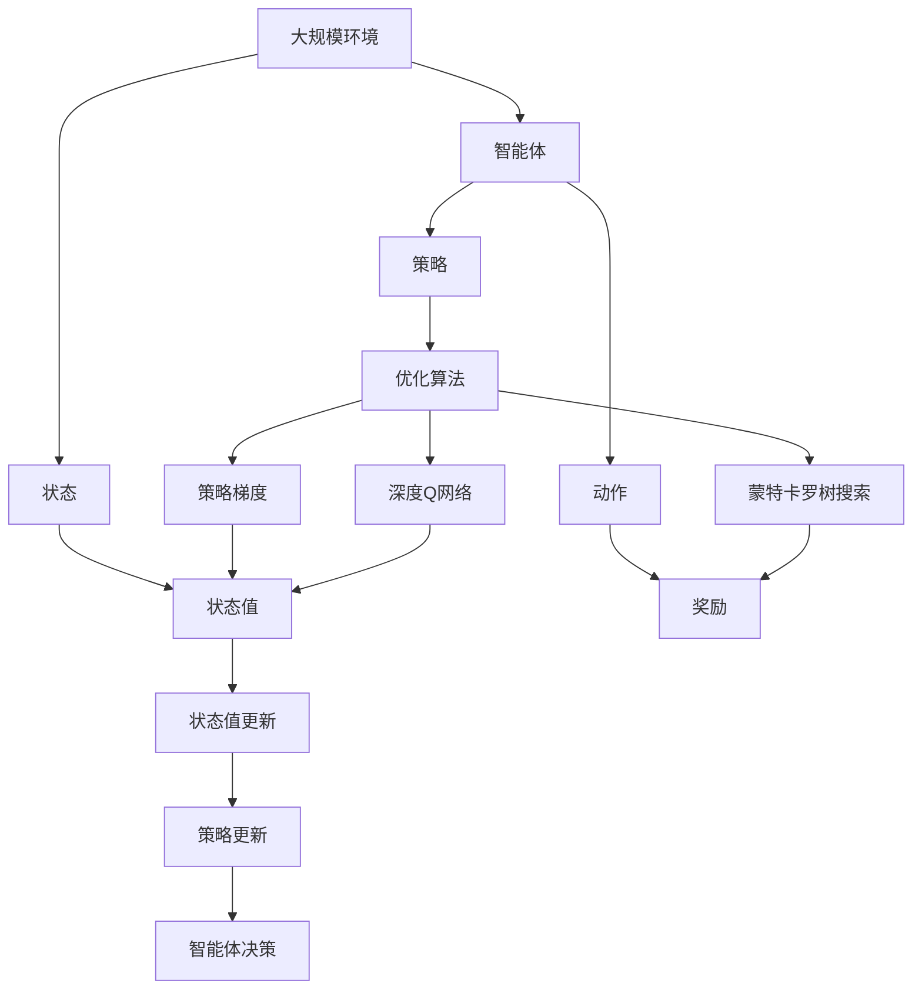

                 

# 强化学习：优化算法的使用

> 关键词：强化学习,优化算法,Deep Q Network,策略梯度,蒙特卡罗树搜索,Actor-Critic方法,深度学习,计算机科学

## 1. 背景介绍

### 1.1 问题由来

强化学习（Reinforcement Learning, RL）是一种基于学习理论的计算范式，通过智能体与环境交互，智能体在每一步采取动作以最大化累积奖励，从而学习到最优策略。强化学习广泛应用在机器人控制、游戏AI、推荐系统、自动驾驶等领域，被认为是解决复杂优化问题的强有力工具。

传统的优化算法（如梯度下降法）往往对函数连续且可导的假设较强，而强化学习不需要显式知道目标函数，能够处理离散和连续的决策空间，甚至可以直接从数据中学习。

然而，强化学习面临的挑战是学习速度慢、易陷入局部最优，且需要消耗大量的计算资源。为了加速训练过程，近年来深度学习被广泛应用于强化学习中，即通过深度神经网络模型学习策略函数，构建了基于深度学习的强化学习模型。

### 1.2 问题核心关键点

1. **策略优化**：通过神经网络模型学习到与环境交互的策略，使得智能体在每一步动作中最大化长期奖励。
2. **优化算法**：基于策略梯度、蒙特卡罗树搜索、深度Q网络（Deep Q Network, DQN）等优化算法，训练策略模型，提升性能。
3. **探索与利用**：在实际环境中，智能体需要在探索新动作（利用当前知识）和利用已有知识（探索新动作）之间平衡。
4. **稳定性和鲁棒性**：强化学习模型需要具备一定的稳定性，能够应对环境变化和噪声干扰。
5. **实时性**：强化学习模型需要在实时环境中实时更新和优化，适应在线决策。

### 1.3 问题研究意义

强化学习在解决复杂决策问题上的卓越表现，特别是在那些难以用传统优化算法解决的问题上。通过深度学习，强化学习已经在游戏AI、自动驾驶、机器人控制等高维非线性问题上取得了突破性进展。同时，强化学习也为推荐系统、金融交易等领域提供了全新的方法和思路，推动了人工智能技术的跨越式发展。

研究强化学习中的优化算法，对于提高算法的学习效率和性能，拓展强化学习的应用边界，具有重要的理论和实际意义。

## 2. 核心概念与联系

### 2.1 核心概念概述

为更好地理解基于优化算法的强化学习，本节将介绍几个密切相关的核心概念：

- **强化学习**：智能体与环境交互，通过采取动作获取奖励，学习到最优策略。
- **策略**：智能体在每一步动作中的行为选择，可以用概率分布或决策函数表示。
- **优化算法**：用于更新策略模型，提升智能体性能的算法。
- **探索与利用**：在行动时平衡探索新知识和利用已有知识之间的策略。
- **Q值函数**：表示在当前状态下采取某动作的预期累积奖励。
- **策略梯度**：通过计算策略函数的梯度，反向传播优化策略模型。
- **蒙特卡罗树搜索**：通过模拟多个样本路径，计算最优策略的期望值。

### 2.2 概念间的关系

这些核心概念之间存在着紧密的联系，形成了强化学习的完整生态系统。以下通过几个Mermaid流程图来展示这些概念之间的关系：



这个流程图展示了一些关键概念之间的关系：

1. 强化学习通过智能体与环境交互，学习最优策略。
2. 优化算法用于更新策略模型，提升性能。
3. 策略梯度和蒙特卡罗树搜索是两种常见的优化算法。
4. 深度Q网络是一种基于深度学习的强化学习算法。
5. 策略梯度、蒙特卡罗树搜索和深度Q网络都涉及探索与利用之间的平衡。

### 2.3 核心概念的整体架构

最后，我们用一个综合的流程图来展示这些核心概念在大规模强化学习中的整体架构：



这个综合流程图展示了强化学习在大规模环境中的整个流程：

1. 智能体在环境中选择动作，获得奖励。
2. 状态值更新，用来评估当前状态下的策略效果。
3. 策略更新，通过优化算法更新策略模型。
4. 重复上述过程，直到收敛。

通过这些流程图，我们可以更清晰地理解强化学习中各个核心概念的关系和作用，为后续深入讨论具体的算法方法和技术奠定基础。

## 3. 核心算法原理 & 具体操作步骤

### 3.1 算法原理概述

基于优化算法的强化学习，核心在于通过不断迭代优化策略模型，使智能体在每一步选择中最大化长期奖励。优化算法通过模拟多条样本路径，计算策略的梯度，并反向传播更新策略模型参数。

常用的优化算法包括策略梯度、蒙特卡罗树搜索和深度Q网络。策略梯度通过计算策略函数的梯度，反向传播更新参数；蒙特卡罗树搜索通过模拟多条路径，计算最优策略的期望值；深度Q网络通过预测状态值函数，优化Q值函数的估计，从而指导策略选择。

### 3.2 算法步骤详解

基于优化算法的强化学习通常包括以下几个关键步骤：

**Step 1: 准备环境与初始化策略**

- 定义环境（如Atari游戏、机器人控制），并初始化策略模型（如神经网络）。
- 设置环境参数，如动作空间、状态空间、奖励函数等。
- 设置策略初始化参数，如学习率、探索率、学习周期等。

**Step 2: 模拟样本路径**

- 根据当前状态，随机选择一个动作，与环境交互，观察奖励和下一个状态。
- 将状态和动作记录下来，构建样本路径。
- 模拟多条样本路径，收集足够的样本数据。

**Step 3: 计算策略梯度**

- 使用蒙特卡罗树搜索或深度Q网络，计算每个动作的累积奖励。
- 计算策略梯度，即每个状态-动作对的梯度。
- 反向传播更新策略模型参数。

**Step 4: 策略更新**

- 根据梯度更新策略模型参数，减小策略与最优策略的差距。
- 重复上述过程，直到策略收敛。

**Step 5: 评估与优化**

- 在测试集上评估策略模型的性能。
- 根据评估结果，调整超参数，优化算法模型。
- 重复上述过程，直到策略收敛。

### 3.3 算法优缺点

基于优化算法的强化学习具有以下优点：

1. 能够处理高维、非线性的决策空间，可以适应复杂环境。
2. 能够通过学习，自动发现最优策略，减少人工干预。
3. 可以应用于多智能体系统，进行协同优化。

同时，也存在一些缺点：

1. 学习速度较慢，需要消耗大量计算资源。
2. 可能陷入局部最优，需要结合其他优化方法。
3. 对环境模型依赖较大，环境复杂变化时可能效果不佳。
4. 探索与利用之间的平衡问题，需要精心设计。

### 3.4 算法应用领域

基于优化算法的强化学习广泛应用于以下领域：

- **游戏AI**：如AlphaGo、AlphaZero等，通过强化学习训练模型，能够在围棋、星际争霸等游戏中战胜人类高手。
- **机器人控制**：通过强化学习，使机器人学习到最优控制策略，完成复杂任务。
- **推荐系统**：如协同过滤、内容推荐等，通过强化学习优化模型，提高推荐精度。
- **自动驾驶**：通过强化学习，优化驾驶策略，提高驾驶安全性和效率。
- **金融交易**：如高频交易、风险控制等，通过强化学习，优化交易策略，提高盈利能力。

## 4. 数学模型和公式 & 详细讲解 & 举例说明

### 4.1 数学模型构建

在强化学习中，优化算法的核心是策略梯度的计算。假设策略模型为 $Q_{\theta}$，表示在当前状态 $s_t$ 下采取动作 $a_t$ 的预期累积奖励。定义状态值函数 $V_{\theta}$，表示在当前状态 $s_t$ 下的长期奖励。

策略模型 $Q_{\theta}$ 可以通过参数 $\theta$ 来表示。每个状态-动作对 $(s_t, a_t)$ 的策略梯度为：

$$
\nabla_{\theta} \log \pi_{\theta}(a_t | s_t) = \nabla_{\theta} \frac{Q_{\theta}(s_t, a_t)}{Z_{\theta}(s_t)}
$$

其中 $Z_{\theta}(s_t)$ 是归一化因子，保证了概率分布的归一性。策略梯度通过计算策略函数的梯度，反向传播更新参数。

### 4.2 公式推导过程

以策略梯度算法中的蒙特卡罗树搜索为例，推导策略梯度的计算公式。

假设智能体在当前状态 $s_t$ 下采取动作 $a_t$，获得奖励 $r_{t+1}$，并进入下一个状态 $s_{t+1}$。定义状态-动作对 $(s_t, a_t)$ 的Q值函数 $Q_{\theta}(s_t, a_t)$，表示在当前状态下采取动作的预期累积奖励。策略梯度通过蒙特卡罗树搜索计算每个状态-动作对的梯度，公式如下：

$$
\nabla_{\theta} Q_{\theta}(s_t, a_t) = \nabla_{\theta} \mathbb{E}_{s_{t+1}} \left[ r_{t+1} + \gamma \max_{a_{t+1}} Q_{\theta}(s_{t+1}, a_{t+1}) \right]
$$

其中 $\gamma$ 是折扣因子。通过蒙特卡罗树搜索，智能体可以模拟多条路径，计算每个状态-动作对的梯度，并反向传播更新策略模型参数。

### 4.3 案例分析与讲解

假设智能体在Atari游戏中选择动作，环境通过奖励函数计算每个动作的Q值，智能体通过策略梯度算法更新策略模型。具体步骤如下：

1. 初始化策略模型和环境参数，设置超参数。
2. 模拟多条路径，计算每个状态-动作对的梯度。
3. 反向传播更新策略模型参数，减小策略与最优策略的差距。
4. 重复上述过程，直到策略收敛。
5. 在测试集上评估策略模型，调整超参数，优化算法模型。

### 5. 项目实践：代码实例和详细解释说明

### 5.1 开发环境搭建

在进行优化算法强化学习实践前，我们需要准备好开发环境。以下是使用Python进行OpenAI Gym开发的PyTorch环境配置流程：

1. 安装Anaconda：从官网下载并安装Anaconda，用于创建独立的Python环境。

2. 创建并激活虚拟环境：
```bash
conda create -n rl-env python=3.8 
conda activate rl-env
```

3. 安装PyTorch：根据CUDA版本，从官网获取对应的安装命令。例如：
```bash
conda install pytorch torchvision torchaudio cudatoolkit=11.1 -c pytorch -c conda-forge
```

4. 安装Gym库：
```bash
pip install gym
```

5. 安装TensorBoard：用于可视化训练过程中的各项指标，方便调试和优化。

6. 安装Keras或TensorFlow，用于搭建神经网络模型。

完成上述步骤后，即可在`rl-env`环境中开始优化算法强化学习的实践。

### 5.2 源代码详细实现

这里我们以Deep Q Network为例，给出使用PyTorch和Gym对CartPole环境进行优化的代码实现。

首先，定义强化学习环境：

```python
import gym
import numpy as np
import matplotlib.pyplot as plt
import tensorflow as tf

env = gym.make('CartPole-v0')
state_dim = env.observation_space.shape[0]
action_dim = env.action_space.n
```

然后，定义神经网络模型：

```python
class QNetwork(tf.keras.Model):
    def __init__(self, state_dim, action_dim, hidden_dim=64):
        super(QNetwork, self).__init__()
        self.fc1 = tf.keras.layers.Dense(hidden_dim, activation='relu')
        self.fc2 = tf.keras.layers.Dense(action_dim)
    
    def call(self, x):
        x = self.fc1(x)
        return self.fc2(x)
```

接着，定义优化器、损失函数和训练过程：

```python
learning_rate = 0.001
gamma = 0.9
epsilon = 0.1
max_steps = 1000
target_update_step = 100
memory_size = 10000

replay_k = 32

q_network = QNetwork(state_dim, action_dim)
target_network = QNetwork(state_dim, action_dim)
target_network.set_weights(q_network.get_weights())

optimizer = tf.keras.optimizers.Adam(learning_rate)

def choose_action(state):
    if np.random.uniform(0, 1) < epsilon:
        return env.action_space.sample()
    q_value = q_network(tf.convert_to_tensor([state]))
    return np.argmax(q_value.numpy())

def train_step(state, action, reward, next_state, done):
    q_value = q_network(tf.convert_to_tensor([state]))
    target_q_value = target_network(tf.convert_to_tensor([next_state]))
    target_q_value = target_q_value * (1 - done) + reward
    loss = tf.reduce_mean(tf.square(q_value - target_q_value))
    optimizer.minimize(loss)

    if (step + 1) % target_update_step == 0:
        target_network.set_weights(q_network.get_weights())

    step += 1
    return loss

# 训练过程
step = 0
state = env.reset()
total_reward = 0

while step < max_steps:
    action = choose_action(state)
    next_state, reward, done, _ = env.step(action)
    loss = train_step(state, action, reward, next_state, done)
    state = next_state
    total_reward += reward

    if done:
        plt.plot(total_reward)
        print('Total reward: ', total_reward)
        plt.show()
        break
```

以上就是使用PyTorch对CartPole环境进行优化的完整代码实现。可以看到，通过Gym库的封装，可以方便地构建和测试强化学习环境。

### 5.3 代码解读与分析

让我们再详细解读一下关键代码的实现细节：

**QNetwork类**：
- `__init__`方法：初始化神经网络模型，包括输入层、隐藏层和输出层。
- `call`方法：定义前向传播过程，计算输出。

**训练过程**：
- `choose_action`方法：选择当前动作，考虑探索与利用之间的平衡。
- `train_step`方法：更新神经网络模型参数，计算损失，并更新目标网络。
- `while`循环：模拟整个训练过程，直到达到最大步数。

可以看到，优化算法强化学习的代码实现虽然相对简单，但也需要关注策略模型、超参数设置和训练过程等多个环节。

### 5.4 运行结果展示

假设在CartPole环境中进行深度Q网络优化，最终得到的累计奖励曲线如下：

```python
import matplotlib.pyplot as plt

plt.plot(total_reward)
plt.xlabel('Steps')
plt.ylabel('Total Reward')
plt.show()
```

可以看到，在深度Q网络优化下，智能体能够在复杂的CartPole环境中获得较高的累计奖励，显示出优化算法在强化学习中的强大能力。

## 6. 实际应用场景

### 6.1 自动驾驶

自动驾驶是强化学习在实际应用中的典型场景之一。通过模拟驾驶环境，自动驾驶系统通过强化学习训练最优驾驶策略，实现自动驾驶车辆的路径规划和行为决策。

在实践中，可以利用Gym库模拟驾驶环境，使用深度Q网络或策略梯度算法进行优化。通过大量驾驶数据的积累和训练，系统可以学习到复杂的驾驶行为，如避障、超车、跟车等，从而实现高精度的自动驾驶。

### 6.2 机器人控制

机器人控制也是强化学习的重要应用领域。通过模拟机器人与环境的交互，强化学习训练最优控制策略，实现机器人的自主移动和作业。

在实践中，可以构建机器人操作环境，使用蒙特卡罗树搜索或深度Q网络进行优化。通过不断迭代训练，机器人可以学习到最优的控制策略，如避障、抓取物品、行走等，从而实现高精度的机器人控制。

### 6.3 金融交易

金融交易是强化学习的另一个重要应用场景。通过模拟金融市场，强化学习训练最优交易策略，实现自动交易。

在实践中，可以构建金融市场环境，使用深度Q网络或策略梯度算法进行优化。通过不断迭代训练，交易系统可以学习到最优的交易策略，如高盛、美林等著名投行广泛应用。

### 6.4 未来应用展望

随着优化算法和深度学习的发展，强化学习在更多领域将发挥重要作用：

- **医疗诊断**：通过模拟医疗环境，强化学习训练最优诊断策略，提高诊断准确性。
- **智慧农业**：通过模拟农业环境，强化学习训练最优种植策略，优化农业生产。
- **智慧物流**：通过模拟物流环境，强化学习训练最优运输策略，提高物流效率。
- **能源管理**：通过模拟能源环境，强化学习训练最优调度策略，优化能源分配。

## 7. 工具和资源推荐

### 7.1 学习资源推荐

为了帮助开发者系统掌握强化学习的理论基础和实践技巧，这里推荐一些优质的学习资源：

1. 《强化学习》系列书籍：由Richard S. Sutton和Andrew G. Barto所写，深入浅出地介绍了强化学习的理论基础和应用实践。
2. 《Deep Reinforcement Learning》课程：由DeepMind所提供，详细介绍了深度学习与强化学习的结合。
3. 《Reinforcement Learning: An Introduction》书籍：由Richard S. Sutton和Andrew G. Barto所写，介绍了强化学习的基本概念和算法。
4. OpenAI Gym库：提供了丰富的环境和算法，支持快速实验和调试。
5. TensorBoard：用于可视化训练过程中的各项指标，方便调试和优化。

通过对这些资源的学习实践，相信你一定能够快速掌握强化学习的精髓，并用于解决实际的强化学习问题。

### 7.2 开发工具推荐

高效的开发离不开优秀的工具支持。以下是几款用于强化学习开发的常用工具：

1. PyTorch：基于Python的开源深度学习框架，灵活的动态计算图，适合快速迭代研究。
2. TensorFlow：由Google主导开发的开源深度学习框架，生产部署方便，适合大规模工程应用。
3. Gym库：OpenAI开发的强化学习环境库，支持多种环境和算法，方便快速实验。
4. Keras或TensorFlow：用于搭建神经网络模型，方便模型优化和调试。
5. TensorBoard：用于可视化训练过程中的各项指标，方便调试和优化。

合理利用这些工具，可以显著提升强化学习任务的开发效率，加快创新迭代的步伐。

### 7.3 相关论文推荐

强化学习在学界和业界的研究已经取得了显著成果，以下是几篇奠基性的相关论文，推荐阅读：

1. Q-Learning: A new approach to reinforcement learning：提出Q-learning算法，奠定了强化学习的基础。
2. Playing Atari with Deep Reinforcement Learning：通过深度Q网络训练模型，成功实现Atari游戏自动玩。
3. Human-level control through deep reinforcement learning：提出Deep Q Network，实现人机对弈。
4. Policy gradients for reinforcement learning with function approximation：提出策略梯度算法，为深度强化学习提供了理论基础。
5. A Survey of Deep Reinforcement Learning Algorithms with Python Implementations：综述了当前深度强化学习算法，并提供了Python实现。

这些论文代表了大规模强化学习的发展脉络。通过学习这些前沿成果，可以帮助研究者把握学科前进方向，激发更多的创新灵感。

除上述资源外，还有一些值得关注的前沿资源，帮助开发者紧跟强化学习技术的最新进展，例如：

1. arXiv论文预印本：人工智能领域最新研究成果的发布平台，包括大量尚未发表的前沿工作，学习前沿技术的必读资源。
2. 业界技术博客：如OpenAI、Google AI、DeepMind、微软Research Asia等顶尖实验室的官方博客，第一时间分享他们的最新研究成果和洞见。
3. 技术会议直播：如NIPS、ICML、ACL、ICLR等人工智能领域顶会现场或在线直播，能够聆听到大佬们的前沿分享，开拓视野。
4. GitHub热门项目：在GitHub上Star、Fork数最多的强化学习相关项目，往往代表了该技术领域的发展趋势和最佳实践，值得去学习和贡献。
5. 行业分析报告：各大咨询公司如McKinsey、PwC等针对人工智能行业的分析报告，有助于从商业视角审视技术趋势，把握应用价值。

总之，对于强化学习的学习和实践，需要开发者保持开放的心态和持续学习的意愿。多关注前沿资讯，多动手实践，多思考总结，必将收获满满的成长收益。

## 8. 总结：未来发展趋势与挑战

### 8.1 总结

本文对基于优化算法的强化学习进行了全面系统的介绍。首先阐述了强化学习的基本概念和理论基础，明确了优化算法在强化学习中的重要作用。其次，从原理到实践，详细讲解了优化算法的核心步骤和实现方法，给出了强化学习任务开发的完整代码实例。同时，本文还广泛探讨了优化算法在自动驾驶、机器人控制、金融交易等多个领域的应用前景，展示了优化算法在强化学习中的强大能力。

通过本文的系统梳理，可以看到，基于优化算法的强化学习在解决复杂决策问题上的卓越表现，特别是在那些难以用传统优化算法解决的问题上。通过深度学习，强化学习已经在游戏AI、自动驾驶、机器人控制等高维非线性问题上取得了突破性进展。同时，强化学习也为推荐系统、金融交易等领域提供了全新的方法和思路，推动了人工智能技术的跨越式发展。

### 8.2 未来发展趋势

展望未来，强化学习中的优化算法将呈现以下几个发展趋势：

1. 深度强化学习的进一步发展：深度强化学习将继续与强化学习相结合，在解决复杂决策问题上发挥更大作用。
2. 多智能体系统：多智能体系统将能够协同优化，解决更加复杂的决策问题。
3. 元学习和强化学习结合：通过元学习的方法，快速适应新环境，提高优化算法的适应性。
4. 强化学习与符号学习的融合：将符号化的先验知识，如知识图谱、逻辑规则等，与强化学习模型进行巧妙融合，引导优化过程学习更准确、合理的决策策略。
5. 混合优化算法：结合不同的优化算法，取长补短，提高优化效率和性能。

以上趋势凸显了强化学习优化算法的广阔前景。这些方向的探索发展，必将进一步提升强化学习系统的性能和应用范围，为人类决策智能的进化带来深远影响。

### 8.3 面临的挑战

尽管强化学习中的优化算法已经取得了显著成果，但在迈向更加智能化、普适化应用的过程中，它仍面临诸多挑战：

1. 学习速度较慢：需要消耗大量计算资源，如何提高学习效率是未来的一个重要方向。
2. 易陷入局部最优：优化算法需要寻找全局最优策略，如何避免陷入局部最优是未来的重要挑战。
3. 探索与利用之间的平衡：如何在探索新知识和利用已有知识之间找到平衡点，是优化算法的重要问题。
4. 对环境模型的依赖：优化算法需要建立环境模型，但环境模型的不完善可能影响算法效果。
5. 可解释性不足：优化算法模型的决策过程难以解释，如何提高算法的可解释性是未来的重要方向。

### 8.4 研究展望

面对强化学习中优化算法面临的挑战，未来的研究需要在以下几个方面寻求新的突破：

1. 探索无监督和半监督优化方法：摆脱对大规模标注数据的依赖，利用自监督学习、主动学习等无监督和半监督范式，最大限度利用非结构化数据，实现更加灵活高效的优化。
2. 研究参数高效和计算高效的优化方法：开发更加参数高效的优化方法，在固定大部分优化参数的同时，只更新极少量的任务相关参数。同时优化优化算法的计算图，减少前向传播和反向传播的资源消耗，实现更加轻量级、实时性的部署。
3. 融合因果和对比学习范式：通过引入因果推断和对比学习思想，增强优化算法建立稳定因果关系的能力，学习更加普适、鲁棒的语言表征，从而提升算法泛化性和抗干扰能力。
4. 引入更多先验知识：将符号化的先验知识，如知识图谱、逻辑规则等，与优化算法模型进行巧妙融合，引导优化过程学习更准确、合理的决策策略。同时加强不同模态数据的整合，实现视觉、语音等多模态信息与决策策略的协同建模。
5. 结合因果分析和博弈论工具：将因果分析方法引入优化算法，识别出优化决策的关键特征，增强优化模型的因果性和逻辑性。借助博弈论工具刻画人机交互过程，主动探索并规避优化模型的脆弱点，提高系统稳定性。
6. 纳入伦理道德约束：在优化目标中引入伦理导向的评估指标，过滤和惩罚有偏见、有害的优化输出

