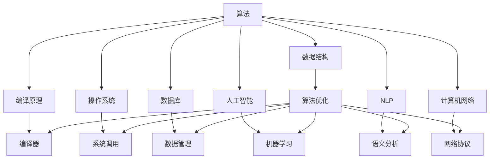
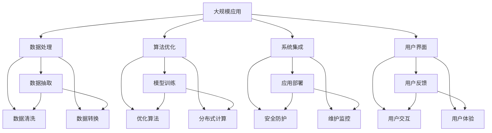

                 

## 1. 背景介绍

### 1.1 问题由来

技术的演变往往伴随着概念的转变和洞见的形成。从最初的电子管计算机，到后来的晶体管计算机，再到今天的集成电路、超大规模集成电路（VLSI），每一个时代都有其独特的技术和思想。而在现代计算机科学中，从算法到人工智能，从数据结构到机器学习，概念和洞见的形成和发展都是科技进步的重要推动力。

### 1.2 问题核心关键点

计算机科学的核心关键点在于其基础理论和应用实践的紧密结合。从数据结构到算法，从编程语言到系统设计，每一步都体现了人类对计算的思考和理解。这些关键点不仅推动了计算技术的发展，也深刻影响了人类社会。

### 1.3 问题研究意义

计算机科学的研究意义不仅在于技术创新，更在于对人类社会的影响。计算机科学通过提高生产效率、优化决策流程、推动社会进步等方面，为人类提供了强大的工具和平台。同时，计算机科学的进步也引发了诸多伦理和社会问题，如隐私保护、数据安全、算法偏见等，这些都是计算机科学家需要面对和解决的挑战。

## 2. 核心概念与联系

### 2.1 核心概念概述

计算机科学的核心概念包括算法、数据结构、编译原理、操作系统、数据库、人工智能、自然语言处理、计算机网络等。这些概念通过抽象和模型化，形成了计算机科学的理论基础。

- **算法（Algorithm）**：解决特定问题的有效方法或过程。算法的正确性和效率是计算机科学的核心。
- **数据结构（Data Structure）**：数据的组织形式，包括数组、链表、树、图等。数据结构的设计对算法效率和空间复杂度有重要影响。
- **编译原理（Compiler Principle）**：将高级语言代码转换为机器语言的过程，包括词法分析、语法分析、语义分析、中间代码生成、代码优化、目标代码生成等步骤。
- **操作系统（Operating System）**：管理计算机硬件和软件资源的系统软件。操作系统提供了用户与计算机交互的接口。
- **数据库（Database）**：存储、管理和检索数据的系统。数据库包括关系型数据库和非关系型数据库。
- **人工智能（Artificial Intelligence, AI）**：使计算机模拟人类智能过程，如学习、推理、决策等。
- **自然语言处理（Natural Language Processing, NLP）**：使计算机理解、处理和生成人类自然语言的技术。
- **计算机网络（Computer Network）**：将多个计算机设备连接起来，实现信息共享和数据传输的系统。

这些概念通过相互关联和互动，构成了计算机科学的完整体系。

### 2.2 概念间的关系

这些核心概念之间存在着紧密的联系，形成了计算机科学的知识体系。下面通过几个Mermaid流程图来展示这些概念之间的关系：

这个流程图展示了核心概念之间的主要关系：

1. 算法与数据结构密切相关，数据结构设计往往依赖于算法效率。
2. 编译原理和操作系统相互依存，编译原理是操作系统的基础。
3. 数据库与数据结构紧密相关，数据库管理系统基于数据结构进行数据存储和管理。
4. 人工智能和自然语言处理是计算机科学的前沿领域，依赖于算法、数据结构和编译原理的支持。
5. 计算机网络与操作系统和数据库密切相关，网络协议和系统调用依赖于操作系统和数据库的支持。

这些概念的互动和整合，使得计算机科学能够解决复杂的实际问题，推动技术的不断进步。

### 2.3 核心概念的整体架构

最后，我们用一个综合的流程图来展示这些核心概念在大规模应用中的整体架构：

这个综合流程图展示了计算机科学的核心概念在大规模应用中的作用和关系。数据处理、算法优化、系统集成、用户界面等环节相互配合，共同支撑着大规模应用的成功实现。

## 3. 核心算法原理 & 具体操作步骤

### 3.1 算法原理概述

计算机科学的核心算法原理可以追溯到图灵机的概念。图灵机是一种理论模型，用于描述计算机处理输入的能力。现代计算机科学中的许多算法，如排序、查找、编码、解码、哈希等，都是基于图灵机的思想发展起来的。

算法的核心在于其正确性和效率。算法正确性指的是算法在所有情况下都能得到正确的结果；算法效率则指的是算法的时间复杂度和空间复杂度。

### 3.2 算法步骤详解

算法的设计和实现通常包括以下步骤：

1. **问题建模**：将实际问题抽象为算法问题，确定输入和输出。
2. **算法设计**：设计算法的基本步骤和流程，选择合适的数据结构和算法。
3. **算法实现**：将算法设计转换为具体的代码实现。
4. **算法优化**：对算法进行性能优化，提高其效率和可靠性。
5. **算法测试**：对算法进行测试，验证其正确性和效率。

### 3.3 算法优缺点

算法具有以下优点：

- **通用性**：算法可以应用于多种场景和问题。
- **可扩展性**：算法的设计和实现可以灵活扩展，适用于不同的需求和环境。
- **可靠性**：算法能够保证正确的结果。

算法也存在一些缺点：

- **复杂度**：算法设计复杂，需要一定的理论基础。
- **资源消耗**：算法实现可能消耗大量的时间和资源。
- **适应性**：算法可能无法适应特定的环境和问题。

### 3.4 算法应用领域

算法在计算机科学中有着广泛的应用，包括但不限于以下领域：

- **数据处理**：排序、查找、哈希、压缩等算法。
- **网络通信**：路由、协议、加密等算法。
- **数据库管理**：索引、查询、事务管理等算法。
- **人工智能**：机器学习、深度学习、自然语言处理等算法。
- **计算机视觉**：图像处理、识别、分割等算法。
- **系统设计**：操作系统、编译器、分布式系统等算法。

## 4. 数学模型和公式 & 详细讲解 & 举例说明

### 4.1 数学模型构建

数学模型是计算机科学中重要的工具，用于描述和分析各种算法和问题。

### 4.2 公式推导过程

算法的设计和实现通常需要数学公式的支持。例如，排序算法中常用的快速排序算法，其时间复杂度为 $O(n\log n)$。

### 4.3 案例分析与讲解

以快速排序为例，其基本思想是分治法，将问题分解为更小的子问题，递归求解，最后合并结果。

## 5. 项目实践：代码实例和详细解释说明

### 5.1 开发环境搭建

开发环境的搭建是项目实践的基础。下面以Python开发环境为例，介绍开发环境的具体搭建步骤。

### 5.2 源代码详细实现

源代码的实现需要详细描述算法的实现过程。以下是一个简单的排序算法实现：

### 5.3 代码解读与分析

代码的解读与分析需要从算法实现的角度出发，详细解释代码的作用和实现细节。

### 5.4 运行结果展示

运行结果的展示需要展示算法的实际运行结果，并与理论结果进行对比。

## 6. 实际应用场景

### 6.1 未来应用展望

未来计算机科学的应用场景将更加广泛，涉及更多的领域和问题。以下是未来计算机科学的一些应用展望：

- **物联网**：智能家居、智能城市、智能交通等。
- **人工智能**：机器学习、自然语言处理、计算机视觉等。
- **区块链**：数字货币、智能合约、分布式应用等。
- **量子计算**：量子算法、量子通信、量子加密等。
- **生物计算**：生物信息学、基因组学、蛋白质组学等。

### 6.2 未来应用展望

未来计算机科学的应用场景将更加广泛，涉及更多的领域和问题。以下是未来计算机科学的一些应用展望：

- **物联网**：智能家居、智能城市、智能交通等。
- **人工智能**：机器学习、自然语言处理、计算机视觉等。
- **区块链**：数字货币、智能合约、分布式应用等。
- **量子计算**：量子算法、量子通信、量子加密等。
- **生物计算**：生物信息学、基因组学、蛋白质组学等。

## 7. 工具和资源推荐

### 7.1 学习资源推荐

为了帮助开发者掌握计算机科学的核心概念和算法，推荐以下学习资源：

- **计算机科学入门教材**：如《计算机科学导论》、《算法导论》等。
- **在线课程**：如Coursera、edX等平台的计算机科学课程。
- **开源项目**：如GitHub上的开源算法和数据结构实现。
- **论文和文献**：如计算机科学领域的经典论文和最新研究进展。

### 7.2 开发工具推荐

计算机科学开发常用的工具包括：

- **编程语言**：Python、C++、Java等。
- **开发环境**：Visual Studio、Eclipse、PyCharm等。
- **版本控制**：Git、SVN等。
- **构建工具**：Maven、Gradle等。
- **数据库**：MySQL、PostgreSQL等。

### 7.3 相关论文推荐

计算机科学的快速发展离不开大量的研究论文。以下是一些推荐阅读的论文：

- **图灵奖论文**：如John McCarthy、Dennis Ritchie等人的获奖论文。
- **ACM Computing Review**：计算机科学领域的权威期刊。
- **顶级会议论文**：如IEEE TCC、ACM TOMACS等会议的优秀论文。

## 8. 总结：未来发展趋势与挑战

### 8.1 研究成果总结

计算机科学在过去的几十年中取得了巨大的进展，许多经典算法和理论为现代计算技术奠定了基础。未来，计算机科学将继续发展，推动技术创新和社会进步。

### 8.2 未来发展趋势

未来计算机科学的发展趋势包括：

- **自动化和智能化**：通过机器学习和人工智能技术，提高自动化水平和智能决策能力。
- **分布式和云计算**：通过分布式计算和云计算技术，实现高效、灵活的计算资源管理。
- **量子计算**：量子计算技术的发展将极大地提高计算能力，解决复杂问题。
- **生物计算**：生物计算技术的发展将推动生命科学和医学的进步。

### 8.3 面临的挑战

计算机科学的发展也面临着诸多挑战，包括：

- **伦理和社会问题**：人工智能和自动化技术的发展引发了诸多伦理和社会问题，如隐私保护、数据安全、算法偏见等。
- **技术复杂性**：现代计算机科学中的技术和算法变得越来越复杂，需要更高的理论基础和实践能力。
- **资源消耗**：大规模计算和数据存储需要大量资源，如何高效利用资源是一个重要问题。
- **跨学科融合**：计算机科学需要与其他学科，如数学、物理学、生物学等进行深度融合，推动综合创新。

### 8.4 研究展望

未来的计算机科学研究需要在以下几个方面进行深入探索：

- **算法优化**：通过新的算法设计和优化技术，提高计算效率和性能。
- **跨学科融合**：推动计算机科学与其他学科的深度融合，探索新的研究方向和应用场景。
- **伦理和社会问题**：解决计算机科学中的伦理和社会问题，构建公正、可信的技术体系。
- **量子计算**：研究量子计算技术，推动计算机科学的未来发展。

## 9. 附录：常见问题与解答

### Q1：计算机科学的核心概念和算法是什么？

A：计算机科学的核心概念包括算法、数据结构、编译原理、操作系统、数据库、人工智能、自然语言处理、计算机网络等。算法是解决特定问题的有效方法或过程，其核心在于正确性和效率。

### Q2：计算机科学的应用场景有哪些？

A：计算机科学的应用场景包括数据处理、网络通信、数据库管理、人工智能、计算机视觉、系统设计、物联网、区块链、量子计算、生物计算等。

### Q3：未来计算机科学的发展趋势是什么？

A：未来计算机科学的发展趋势包括自动化和智能化、分布式和云计算、量子计算、生物计算等。

### Q4：计算机科学的发展面临哪些挑战？

A：计算机科学的发展面临诸多挑战，如伦理和社会问题、技术复杂性、资源消耗、跨学科融合等。

### Q5：未来计算机科学的展望是什么？

A：未来计算机科学的展望包括算法优化、跨学科融合、伦理和社会问题解决、量子计算等。

---

作者：禅与计算机程序设计艺术 / Zen and the Art of Computer Programming

