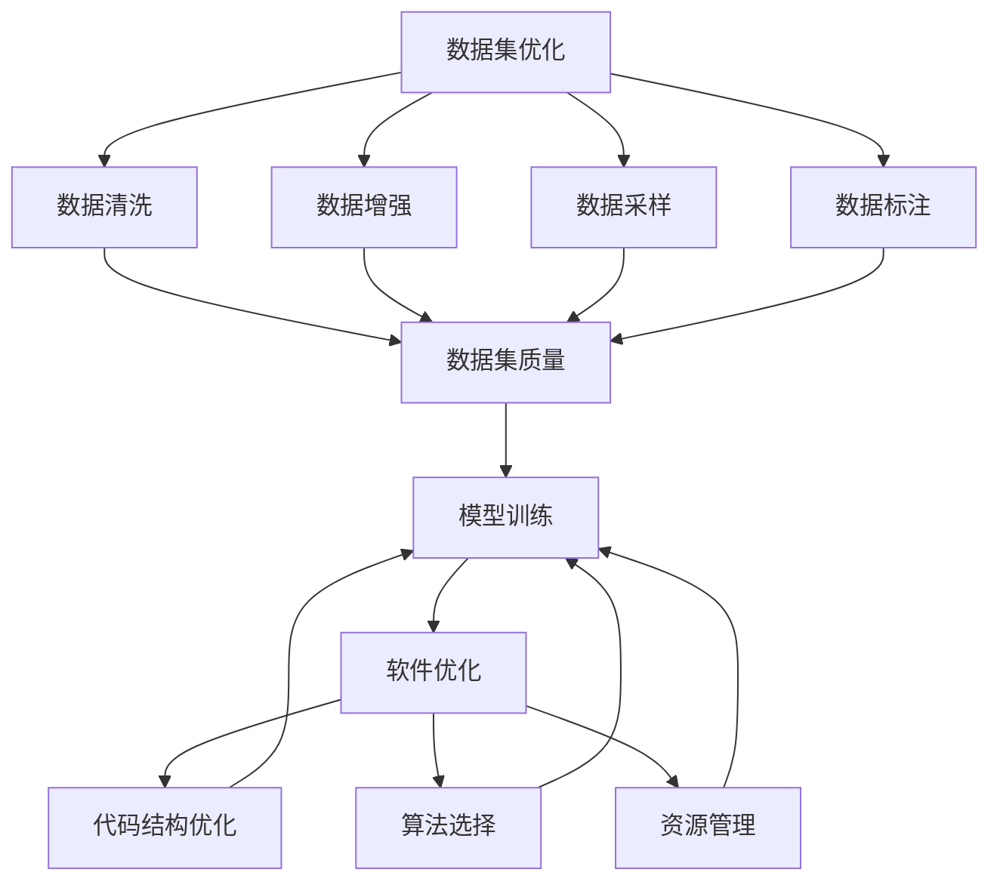
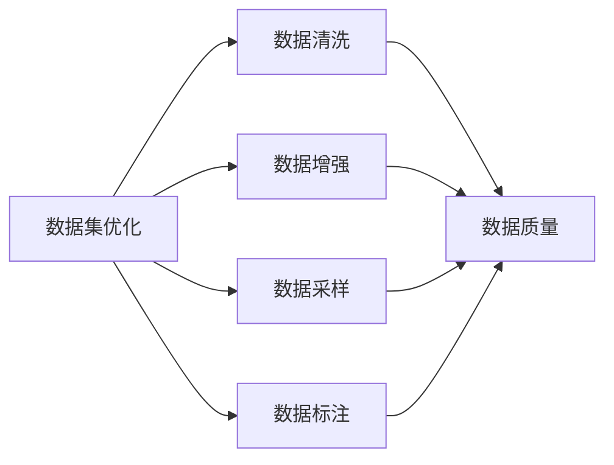
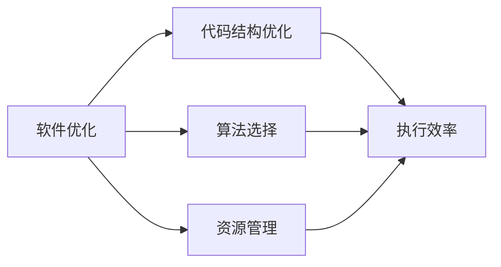
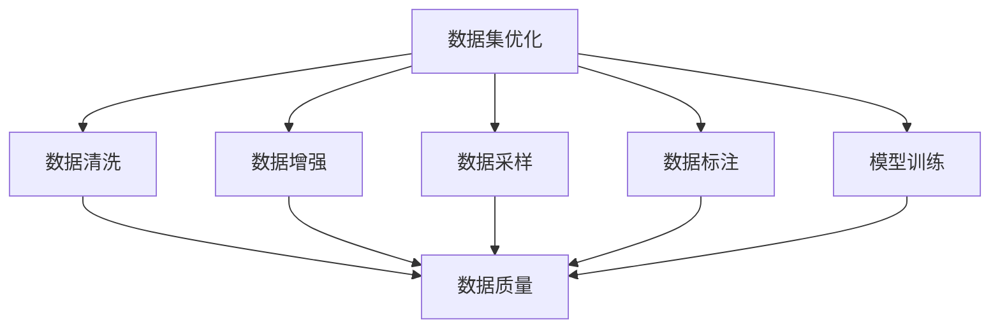

                 

# 数据集优化即软件优化,两种抽象的统一

数据集优化和软件优化，看似两个截然不同的领域，实则存在千丝万缕的联系。数据集作为软件的基础，其优化策略和方法论不仅直接影响到软件系统的性能和稳定性，还反映了软件工程的思想和原则。本文将深入探讨数据集优化与软件优化的内在联系，以及如何将数据集优化与软件优化进行统一，以期为软件开发人员和数据科学家提供新的视角和方法。

## 1. 背景介绍

### 1.1 数据集优化的重要性

在数据驱动的今天，数据集优化成为了数据科学和机器学习领域的核心任务之一。无论是预测模型、分类算法，还是聚类方法，都依赖于高质量、高效率的数据集。数据集的优化直接影响模型的训练效果和预测准确性，因此，优化数据集成为了实现高性能模型的重要步骤。

数据集优化包括数据清洗、数据增强、数据采样、数据标注等多个方面。数据清洗旨在去除噪声、异常值和冗余数据，确保数据集的质量和一致性。数据增强通过生成新的样本，扩大数据集的规模，提高模型的泛化能力。数据采样则通过选择代表性的样本，减少数据集的大小，提升训练效率。数据标注则是指对数据集进行标记，以便于模型的训练和评估。

### 1.2 软件优化的多维视角

软件优化是提升软件性能和可靠性的重要手段，它涉及代码结构、算法选择、资源管理等多个方面。通过优化代码结构，可以提高程序的执行效率，减少内存占用。选择高效的算法，可以大幅提升程序的执行速度，减少计算复杂度。合理的资源管理，可以避免资源瓶颈，提升系统的稳定性和可扩展性。

软件优化的目标是提升软件的性能、可维护性和可扩展性，使其能够满足用户的需求，并在各种环境下稳定运行。软件优化的工具和方法是多样的，包括静态分析工具、动态性能监控工具、自动化测试工具等。

## 2. 核心概念与联系

### 2.1 核心概念概述

为了更好地理解数据集优化与软件优化的内在联系，本节将介绍几个密切相关的核心概念：

- 数据集优化：通过清洗、增强、采样、标注等技术手段，提升数据集的质量和代表性，以便于模型训练和预测。
- 软件优化：通过代码结构优化、算法选择、资源管理等技术手段，提升软件的性能和稳定性，以适应各种运行环境。
- 数据与算法的统一：在数据集优化和软件优化中，数据和算法是密切相关的。高质量的数据集可以提升算法的性能，而高效的算法也能更好地利用数据集，发挥其潜力。
- 软件工程与数据科学的统一：软件工程和数据科学虽然看似两个不同的领域，但它们的基本思想和方法有很多相似之处。例如，迭代开发、版本控制、测试驱动等原则在数据科学中同样适用。

这些核心概念之间的逻辑关系可以通过以下Mermaid流程图来展示：



这个流程图展示了大数据集优化和软件优化的整体架构：

1. 数据集优化包括数据清洗、数据增强、数据采样、数据标注等多个环节，直接影响数据集的质量和规模。
2. 软件优化包括代码结构优化、算法选择、资源管理等多个环节，直接影响软件的性能和稳定性。
3. 数据集优化和软件优化通过模型训练环节相互关联，共同提升系统的表现。

### 2.2 概念间的关系

这些核心概念之间存在着紧密的联系，形成了数据集优化和软件优化的完整生态系统。下面我们通过几个Mermaid流程图来展示这些概念之间的关系。

#### 2.2.1 数据集优化的层次



这个流程图展示了数据集优化的不同层次：

1. 数据清洗：通过去除噪声、异常值和冗余数据，提升数据集的质量。
2. 数据增强：通过生成新的样本，扩大数据集的规模，提高模型的泛化能力。
3. 数据采样：通过选择代表性的样本，减少数据集的大小，提升训练效率。
4. 数据标注：对数据集进行标记，以便于模型的训练和评估。

#### 2.2.2 软件优化的层次



这个流程图展示了软件优化的不同层次：

1. 代码结构优化：通过优化代码结构，提高程序的执行效率，减少内存占用。
2. 算法选择：选择高效的算法，大幅提升程序的执行速度，减少计算复杂度。
3. 资源管理：通过合理管理资源，避免资源瓶颈，提升系统的稳定性和可扩展性。

#### 2.2.3 数据集与算法的统一



这个流程图展示了数据集优化和模型训练的统一：

1. 数据集优化通过数据清洗、数据增强、数据采样、数据标注等多个环节，提升数据集的质量和规模。
2. 模型训练通过利用优化后的数据集，进行模型的训练和预测，提升算法的性能。

## 3. 核心算法原理 & 具体操作步骤

### 3.1 算法原理概述

数据集优化和软件优化都涉及算法的选择和应用。数据集优化算法通常包括数据清洗、数据增强、数据采样、数据标注等。软件优化算法则包括代码结构优化、算法选择、资源管理等。这些算法的基本原理和方法论有相似之处，但具体实现方式有所不同。

以数据增强为例，其基本原理是通过生成新的样本，扩大数据集的规模，提高模型的泛化能力。数据增强的技术包括旋转、缩放、裁剪、翻转、平移、噪声添加等。在实际应用中，这些技术可以被应用于计算机视觉、自然语言处理、语音识别等多个领域。

以代码结构优化为例，其基本原理是通过优化代码结构，提高程序的执行效率，减少内存占用。代码结构优化的技术包括函数内联、循环展开、常量折叠、死代码移除、循环重构等。在实际应用中，这些技术可以被应用于编译器优化、代码生成、程序分析和调试等多个方面。

### 3.2 算法步骤详解

以下我们以数据增强为例，详细讲解数据增强的步骤：

**Step 1: 定义增强方式**

根据具体任务的特点，选择适合的增强方式。例如，对于图像数据，可以采用随机旋转、缩放、裁剪、翻转等增强方式；对于文本数据，可以采用同义词替换、随机插入、随机删除等增强方式。

**Step 2: 生成增强样本**

根据增强方式，生成新的样本。例如，对于图像数据，可以随机生成经过增强的图像；对于文本数据，可以随机生成经过增强的句子。

**Step 3: 标注增强样本**

对于生成的新样本，需要重新进行标注。标注方式与原始样本相同，即每个样本对应一个标签。

**Step 4: 合并原始数据集**

将原始数据集和新生成增强数据集合并，形成一个新的数据集。

**Step 5: 评估数据集**

通过评估指标（如数据集规模、数据质量、模型性能等），评估新生成数据集的质量和效果。

### 3.3 算法优缺点

数据集优化的优点包括：

- 提升数据集的质量和规模，增强模型的泛化能力。
- 减少模型过拟合的风险，提高模型的鲁棒性。
- 适应不同应用场景，具有较高的灵活性和可扩展性。

数据集优化的缺点包括：

- 生成新样本的过程可能会引入噪声，影响数据集的质量。
- 需要大量的计算资源和时间，尤其是大规模数据集增强。
- 数据增强的效果取决于增强方式的选择，选择合适的增强方式需要经验和技巧。

软件优化的优点包括：

- 提升程序的执行效率，减少内存占用。
- 选择高效的算法，提高程序的执行速度，减少计算复杂度。
- 优化资源管理，提升系统的稳定性和可扩展性。

软件优化的缺点包括：

- 代码结构优化可能会增加开发和维护的难度。
- 算法选择需要丰富的经验和知识，否则容易引入性能瓶颈。
- 资源管理需要动态调整，增加了系统的复杂性。

### 3.4 算法应用领域

数据集优化和软件优化在多个领域都有广泛的应用：

- 计算机视觉：通过数据增强、数据采样等技术，提升图像识别和分类模型的性能。
- 自然语言处理：通过数据清洗、数据标注等技术，提升语言模型和分类模型的性能。
- 语音识别：通过数据增强、数据采样等技术，提升语音识别和分类模型的性能。
- 软件开发：通过代码结构优化、算法选择、资源管理等技术，提升软件的执行效率和稳定性。
- 嵌入式系统：通过代码结构优化、算法选择、资源管理等技术，提升嵌入式系统的性能和可靠性。

## 4. 数学模型和公式 & 详细讲解 & 举例说明

### 4.1 数学模型构建

本节将使用数学语言对数据集优化和软件优化的核心算法进行更加严格的刻画。

假设原始数据集为 $D=\{(x_i,y_i)\}_{i=1}^N$，其中 $x_i \in \mathcal{X}, y_i \in \mathcal{Y}$。定义数据增强算法为 $\mathcal{A}(D)$，其中 $\mathcal{A}$ 为数据增强函数，$D$ 为原始数据集。定义数据增强后的数据集为 $D'$，其中 $D'=\mathcal{A}(D)$。

定义数据增强函数 $\mathcal{A}$ 的输入和输出：

$$
\mathcal{A}(D) = \{(x'_i,y'_i)\}_{i=1}^{N'} 
$$

其中 $x'_i = \mathcal{A}(x_i), y'_i = \mathcal{A}(y_i), N' > N$。

定义数据增强函数的优化目标为：

$$
\min_{\mathcal{A}} \mathcal{L}(D',M)
$$

其中 $\mathcal{L}$ 为损失函数，$M$ 为模型函数。优化目标表示通过数据增强函数 $\mathcal{A}$，使增强后的数据集 $D'$ 能够最大程度地提升模型 $M$ 的性能。

### 4.2 公式推导过程

以下我们以数据增强为例，推导数据增强函数的优化公式。

假设原始数据集为 $D=\{(x_i,y_i)\}_{i=1}^N$，其中 $x_i \in \mathcal{X}, y_i \in \mathcal{Y}$。定义数据增强算法为 $\mathcal{A}(D)$，其中 $\mathcal{A}$ 为数据增强函数，$D$ 为原始数据集。定义数据增强后的数据集为 $D'$，其中 $D'=\mathcal{A}(D)$。

假设模型 $M$ 的预测结果为 $\hat{y} = M(x)$，其中 $\hat{y} \in \mathcal{Y}$。

定义数据增强函数 $\mathcal{A}$ 的输入和输出：

$$
\mathcal{A}(x_i) = x'_i, \quad \mathcal{A}(y_i) = y'_i
$$

其中 $x'_i = \mathcal{A}(x_i), y'_i = \mathcal{A}(y_i), N' > N$。

定义模型函数 $M$ 的损失函数为交叉熵损失函数：

$$
\mathcal{L}(M(x_i),y_i) = -[y_i\log M(x_i) + (1-y_i)\log(1-M(x_i))]
$$

定义数据增强函数 $\mathcal{A}$ 的优化目标为：

$$
\min_{\mathcal{A}} \mathcal{L}(D',M)
$$

其中 $\mathcal{L}(D',M) = \frac{1}{N'} \sum_{i=1}^{N'} \mathcal{L}(M(x'_i),y'_i)$。

根据链式法则，损失函数对数据增强函数 $\mathcal{A}$ 的梯度为：

$$
\frac{\partial \mathcal{L}(D',M)}{\partial \mathcal{A}}
$$

将 $x'_i = \mathcal{A}(x_i), y'_i = \mathcal{A}(y_i)$ 代入，得：

$$
\frac{\partial \mathcal{L}(D',M)}{\partial \mathcal{A}} = \frac{1}{N'} \sum_{i=1}^{N'} \frac{\partial \mathcal{L}(M(x'_i),y'_i)}{\partial x'_i} \frac{\partial x'_i}{\partial \mathcal{A}}
$$

其中 $\frac{\partial x'_i}{\partial \mathcal{A}} = \frac{\partial \mathcal{A}(x_i)}{\partial \mathcal{A}}$。

根据链式法则，$\frac{\partial x'_i}{\partial \mathcal{A}}$ 可以进一步展开，得：

$$
\frac{\partial x'_i}{\partial \mathcal{A}} = \frac{\partial \mathcal{A}(x_i)}{\partial x_i} \frac{\partial x_i}{\partial \mathcal{A}}
$$

其中 $\frac{\partial x_i}{\partial \mathcal{A}} = 0$，因为 $x_i$ 与 $\mathcal{A}$ 无关。

因此，损失函数对数据增强函数 $\mathcal{A}$ 的梯度为：

$$
\frac{\partial \mathcal{L}(D',M)}{\partial \mathcal{A}} = \frac{1}{N'} \sum_{i=1}^{N'} \frac{\partial \mathcal{L}(M(x'_i),y'_i)}{\partial x'_i} \frac{\partial \mathcal{A}(x_i)}{\partial x_i}
$$

其中 $\frac{\partial \mathcal{A}(x_i)}{\partial x_i}$ 表示数据增强函数 $\mathcal{A}$ 对原始数据的导数，可以通过对数据增强函数进行差分或微分得到。

### 4.3 案例分析与讲解

以下我们以图像增强为例，具体分析数据增强函数的优化过程。

假设原始图像数据集为 $D=\{(x_i,y_i)\}_{i=1}^N$，其中 $x_i \in \mathcal{X}, y_i \in \mathcal{Y}$。定义数据增强算法为 $\mathcal{A}(D)$，其中 $\mathcal{A}$ 为图像增强函数，$D$ 为原始数据集。定义数据增强后的数据集为 $D'$，其中 $D'=\mathcal{A}(D)$。

假设图像增强函数 $\mathcal{A}$ 为随机旋转，定义其输入和输出：

$$
\mathcal{A}(x_i) = \begin{bmatrix} 
\cos(\theta_i) & -\sin(\theta_i) \\
\sin(\theta_i) & \cos(\theta_i)
\end{bmatrix}
\begin{bmatrix} 
x_{i,1} \\
x_{i,2}
\end{bmatrix} + \begin{bmatrix} 
a_i \\
b_i
\end{bmatrix}
$$

其中 $\theta_i \in [-\pi,\pi]$，$(a_i,b_i) \in \mathcal{X}_{aug}$。$\mathcal{X}_{aug}$ 为增强后的图像区域。

定义模型函数 $M$ 为卷积神经网络，其预测结果为 $\hat{y} = M(x)$。

假设原始图像数据集为 $D=\{(x_i,y_i)\}_{i=1}^N$，其中 $x_i \in \mathcal{X}, y_i \in \mathcal{Y}$。定义数据增强算法为 $\mathcal{A}(D)$，其中 $\mathcal{A}$ 为数据增强函数，$D$ 为原始数据集。定义数据增强后的数据集为 $D'$，其中 $D'=\mathcal{A}(D)$。

假设模型函数 $M$ 的损失函数为交叉熵损失函数：

$$
\mathcal{L}(M(x_i),y_i) = -[y_i\log M(x_i) + (1-y_i)\log(1-M(x_i))]
$$

定义数据增强函数 $\mathcal{A}$ 的优化目标为：

$$
\min_{\mathcal{A}} \mathcal{L}(D',M)
$$

其中 $\mathcal{L}(D',M) = \frac{1}{N'} \sum_{i=1}^{N'} \mathcal{L}(M(x'_i),y'_i)$。

根据链式法则，损失函数对数据增强函数 $\mathcal{A}$ 的梯度为：

$$
\frac{\partial \mathcal{L}(D',M)}{\partial \mathcal{A}}
$$

将 $x'_i = \mathcal{A}(x_i), y'_i = \mathcal{A}(y_i)$ 代入，得：

$$
\frac{\partial \mathcal{L}(D',M)}{\partial \mathcal{A}} = \frac{1}{N'} \sum_{i=1}^{N'} \frac{\partial \mathcal{L}(M(x'_i),y'_i)}{\partial x'_i} \frac{\partial x'_i}{\partial \mathcal{A}}
$$

其中 $\frac{\partial x'_i}{\partial \mathcal{A}} = \frac{\partial \mathcal{A}(x_i)}{\partial x_i} \frac{\partial x_i}{\partial \mathcal{A}}$。

根据链式法则，$\frac{\partial x'_i}{\partial \mathcal{A}}$ 可以进一步展开，得：

$$
\frac{\partial x'_i}{\partial \mathcal{A}} = \frac{\partial \mathcal{A}(x_i)}{\partial x_i} \frac{\partial x_i}{\partial \mathcal{A}}
$$

其中 $\frac{\partial x_i}{\partial \mathcal{A}} = 0$，因为 $x_i$ 与 $\mathcal{A}$ 无关。

因此，损失函数对数据增强函数 $\mathcal{A}$ 的梯度为：

$$
\frac{\partial \mathcal{L}(D',M)}{\partial \mathcal{A}} = \frac{1}{N'} \sum_{i=1}^{N'} \frac{\partial \mathcal{L}(M(x'_i),y'_i)}{\partial x'_i} \frac{\partial \mathcal{A}(x_i)}{\partial x_i}
$$

其中 $\frac{\partial \mathcal{A}(x_i)}{\partial x_i}$ 表示数据增强函数 $\mathcal{A}$ 对原始数据的导数，可以通过对数据增强函数进行差分或微分得到。

## 5. 项目实践：代码实例和详细解释说明

### 5.1 开发环境搭建

在进行数据集优化和软件优化的实践前，我们需要准备好开发环境。以下是使用Python进行TensorFlow开发的Python环境配置流程：

1. 安装Anaconda：从官网下载并安装Anaconda，用于创建独立的Python环境。

2. 创建并激活虚拟环境：
```bash
conda create -n pytorch-env python=3.8 
conda activate pytorch-env
```

3. 安装PyTorch：根据CUDA版本，从官网获取对应的安装命令。例如：
```bash
conda install pytorch torchvision torchaudio cudatoolkit=11.1 -c pytorch -c conda-forge
```

4. 安装TensorFlow：
```bash
pip install tensorflow
```

5. 安装各类工具包：
```bash
pip install numpy pandas scikit-learn matplotlib tqdm jupyter notebook ipython
```

完成上述步骤后，即可在`pytorch-env`环境中开始项目实践。

### 5.2 源代码详细实现

下面我们以数据增强为例，给出使用TensorFlow进行数据增强的Python代码实现。

首先，定义数据增强函数：

```python
import tensorflow as tf
from tensorflow.keras.preprocessing.image import ImageDataGenerator

def data_augmentation(train_dataset):
    datagen = ImageDataGenerator(rotation_range=10,
                                width_shift_range=0.1,
                                height_shift_range=0.1,
                                shear_range=0.1,
                                zoom_range=0.1,
                                horizontal_flip=True,
                                vertical_flip=True)
    return datagen.flow(train_dataset)

train_dataset = tf.data.Dataset.from_tensor_slices(train_images)
train_dataset = data_augmentation(train_dataset)
```

然后，定义训练函数：

```python
import tensorflow as tf
from tensorflow.keras.preprocessing.image import ImageDataGenerator
from tensorflow.keras.models import Sequential
from tensorflow.keras.layers import Conv2D, MaxPooling2D, Flatten, Dense

# 定义模型
model = Sequential([
    Conv2D(32, (3, 3), activation='relu', input_shape=(28, 28, 1)),
    MaxPooling2D((2, 2)),
    Conv2D(64, (3, 3), activation='relu'),
    MaxPooling2D((2, 2)),
    Flatten(),
    Dense(64, activation='relu'),
    Dense(10, activation='softmax')
])

# 编译模型
model.compile(optimizer='adam',
              loss='sparse_categorical_crossentropy',
              metrics=['accuracy'])

# 训练模型
history = model.fit(train_dataset, 
                    epochs=10,
                    validation_data=val_dataset)
```

最后，评估训练结果：

```python
# 评估模型
test_loss, test_acc = model.evaluate(test_dataset)

print(f"Test accuracy: {test_acc}")
```

以上就是使用TensorFlow进行图像数据增强的完整代码实现。可以看到，TensorFlow提供了强大的数据增强工具，通过简单的调用即可实现多种增强方式。

### 5.3 代码解读与分析

让我们再详细解读一下关键代码的实现细节：

**data_augmentation函数**：
- 定义数据增强函数，采用ImageDataGenerator类，实现多种增强方式。
- 返回增强后的数据集。

**train_dataset**：
- 定义训练数据集，采用TensorFlow的DataDataset类，将原始数据集转换为增强数据集。
- 调用data_augmentation函数，生成增强后的数据集。

**model**：
- 定义卷积神经网络模型，采用Sequential类，堆叠多个卷积、池化、全连接层。
- 编译模型，定义损失函数和优化器。
- 训练模型，使用fit函数进行训练。

**evaluation函数**：
- 定义测试数据集，采用TensorFlow的DataDataset类。
- 使用evaluate函数评估模型，输出测试准确率。

通过上述代码，我们可以清晰地看到数据增强和模型训练的流程，及其在TensorFlow中的实现方式。在实际应用中，我们可以通过选择合适的增强方式，最大化数据增强的效果，提升模型的泛化能力和鲁棒性。

## 6. 实际应用场景

### 6.1 智能安防系统

智能安防系统通常需要实时处理大量视频数据，对目标进行检测、跟踪和识别。通过数据增强，可以增加训练样本的多样性，提升模型的泛化能力，从而实现更准确的异常检测和目标识别。例如，可以采用旋转、缩放、翻转等增强方式，对原始视频数据进行处理，生成更多的训练样本。

### 6.2 无人驾驶系统

无人驾驶系统需要实时处理传感器数据，进行路径规划和环境感知。通过数据增强，可以增加训练样本的多样性，提升模型的泛化能力和鲁棒性，从而实现更准确的目标检测和环境感知。例如，可以采用随机旋转、随机裁剪、随机噪声等增强方式，对原始传感器数据进行处理，生成更多的训练样本。

### 6.3 医疗影像分析

医疗影像分析需要处理大量高质量的医疗影像数据，对病变进行检测和分类。通过数据增强，可以增加训练样本的多样性，提升模型的泛化能力和鲁棒性，从而实现更准确的病变检测和分类。例如，可以采用旋转、缩放、翻转等增强方式，对原始医疗影像数据进行处理，生成更多的训练样本。

## 7. 工具和资源推荐

### 7.1 学习资源推荐

为了帮助开发者系统掌握数据集优化与软件优化的理论基础和实践技巧，这里推荐一些优质的学习资源：

1. 《深度学习》系列书籍：由著名机器学习专家Ian Goodfellow、Yoshua Bengio、Aaron Courville等人合著，全面介绍了深度学习的基本概念和算法。

2. 《机器学习》系列书籍：由Tom Mitchell等人合著，介绍了机器学习的基本原理和应用。

3. 《Python深度学习》书籍：由Francois Chollet等人合著，

