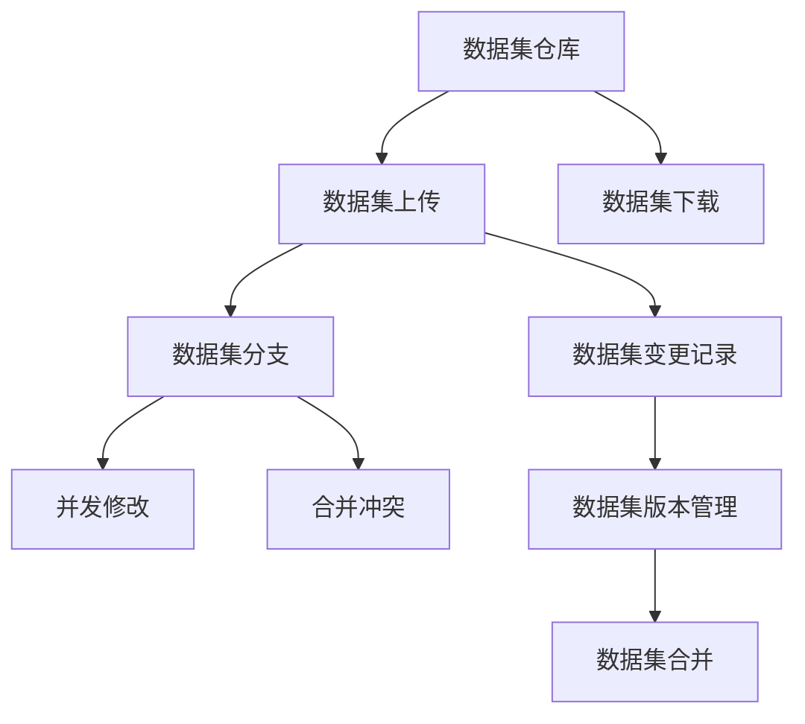

                 

# 数据集版本管理:Git for Data时代来临

> 关键词：数据集版本管理, 数据管理, 数据集版本控制, Git for Data, 数据集仓库, 版本回退

## 1. 背景介绍

### 1.1 问题由来

在数据驱动的时代，数据集管理的重要性日益凸显。数据集作为模型训练和应用的核心资源，其质量、一致性和可追溯性对模型性能有着决定性影响。但传统的数据集管理方式往往存在诸多问题：

- 版本迭代频繁，数据变更无记录，难以追溯历史变化。
- 数据集孤岛林立，不同团队之间的协作成本高昂。
- 数据变更可能引发模型退化或不可预测的性能波动。
- 数据集管理流程复杂，难以形成标准化、高效的流程。

为解决这些问题，数据集版本管理（Data Version Management）技术应运而生。通过将数据集纳入版本控制，与代码管理并行，数据集管理也实现了自动化和持续改进，确保数据集的版本一致性和可靠性。

### 1.2 问题核心关键点

数据集版本管理的核心在于将数据集的管理方式与代码管理的方式进行对标，通过使用Git等版本控制系统实现数据集的追踪、修改、回退和合并，从而形成数据集的版本管理生态。数据集版本管理的主要优势包括：

- 数据集版本化：记录每次变更，便于历史回溯和问题定位。
- 协作便捷性：支持多用户协作，简化数据集分享和复用。
- 模型稳定性：通过控制数据集变更，避免模型因数据集变化而引发的不稳定。
- 标准化流程：统一的数据集管理流程，减少人为错误和复杂度。

### 1.3 问题研究意义

数据集版本管理技术的提出，对于推动数据驱动领域的自动化、协作化和标准化具有重要意义：

- 提升数据集质量：通过历史回溯和问题定位，持续优化数据集，确保其高质量。
- 降低协作成本：多用户协作模式，简化数据集分享和复用，加速团队合作。
- 保障模型稳定：统一的数据集管理流程，避免因数据集变化引发的模型退化或波动。
- 实现标准流程：形成标准化、高效的数据集管理流程，提高数据集管理的效率和一致性。

## 2. 核心概念与联系

### 2.1 核心概念概述

为更好地理解数据集版本管理技术，本节将介绍几个关键概念及其相互联系：

- **数据集版本管理 (Data Version Management, DVM)**：通过Git等版本控制系统，对数据集进行追踪、修改、回退和合并的过程。数据集的版本与代码版本类似，记录每次变更的历史。

- **数据集仓库 (Data Repository)**：类似于代码仓库，数据集仓库是一个集中管理数据集的存储位置，支持数据集的上传、下载、版本控制等操作。

- **数据集变更 (Data Change)**：对数据集进行的增删改操作，记录在版本系统中，以便历史回溯和版本对比。

- **数据集分支 (Data Branch)**：类似于代码分支，数据集分支用于保存数据集的不同版本，支持并发修改和合并。

- **数据集合并 (Data Merge)**：不同分支之间的数据集合并操作，确保数据集的一致性和历史版本可追溯。

- **Git for Data**：指将Git等版本控制系统的理念和方法应用于数据集管理。Git for Data强调数据的版本控制、分支管理、变更记录等功能，帮助团队高效协作和持续优化数据集。

这些概念之间的关系可以通过以下Mermaid流程图来展示：

```mermaid
graph TB
    A[数据集版本管理 (DVM)] --> B[数据集仓库 (Data Repository)]
    A --> C[数据集变更 (Data Change)]
    A --> D[数据集分支 (Data Branch)]
    A --> E[数据集合并 (Data Merge)]
    B --> F[数据集上传]
    B --> G[数据集下载]
    C --> H[增删改操作]
    D --> I[并发修改]
    E --> J[合并冲突]
```

这个流程图展示了大数据集版本管理系统的核心组件及其作用：

- 数据集版本管理记录数据集的历史变更和版本信息，支持数据集的追踪和版本回退。
- 数据集仓库作为集中管理数据集的位置，提供数据集的上传、下载、版本控制等功能。
- 数据集变更指对数据集进行的增删改操作，记录在版本系统中，便于历史回溯和版本对比。
- 数据集分支用于保存数据集的不同版本，支持并发修改和合并，保障数据集的安全性。
- 数据集合并用于不同分支之间的数据集合并，确保数据集的一致性和历史版本可追溯。

这些组件共同构成了数据集版本管理系统的整体架构，帮助团队高效协作，持续优化数据集，确保数据集的质量和稳定性。

### 2.2 概念间的关系

这些核心概念之间存在着紧密的联系，形成了数据集版本管理系统的完整生态：

- **数据集版本管理与数据集仓库**：数据集版本管理依赖数据集仓库进行数据集的存储和版本控制，两者相辅相成。
- **数据集变更与数据集分支**：数据集变更记录在数据集分支中，通过数据集分支支持并发修改和合并。
- **数据集合并与数据集分支**：数据集合并是数据集分支合并操作的一部分，确保不同分支的数据集一致性和历史版本可追溯。
- **Git for Data与数据集版本管理**：Git for Data是实现数据集版本管理的工具和方法，帮助团队高效协作和持续优化数据集。

### 2.3 核心概念的整体架构

最后，我们用一个综合的流程图来展示这些核心概念在大数据集版本管理系统中的整体架构：



这个综合流程图展示了从数据集仓库到数据集上传、下载，再到数据集变更记录、数据集分支、并发修改和合并，最后到数据集版本管理的完整过程。

## 3. 核心算法原理 & 具体操作步骤

### 3.1 算法原理概述

数据集版本管理的核心算法原理与Git等版本控制系统的原理类似，主要包括以下几个关键步骤：

1. **版本控制 (Version Control)**：通过Git等版本控制系统对数据集进行追踪和记录，保存每次变更的历史版本。
2. **分支管理 (Branch Management)**：利用Git的分支机制，支持数据集的并发修改和合并。
3. **变更记录 (Change History)**：记录每次数据集变更的操作和版本信息，便于历史回溯和版本对比。
4. **合并冲突 (Merge Conflicts)**：在数据集合并时，处理可能出现的合并冲突，确保数据集的一致性。

### 3.2 算法步骤详解

数据集版本管理的具体操作步骤如下：

1. **初始化仓库 (Initialize Repository)**：在本地或远程创建数据集仓库，设置仓库的元数据信息。
2. **上传数据集 (Upload Data)**：将数据集文件上传到数据集仓库。
3. **记录变更 (Record Change)**：对数据集进行增删改操作，并记录在版本系统中。
4. **创建分支 (Create Branch)**：根据需求创建数据集分支，支持并发修改和版本隔离。
5. **合并分支 (Merge Branch)**：将不同分支的数据集合并，解决可能出现的合并冲突。
6. **回退版本 (Rollback Version)**：在版本系统中回退到历史版本，恢复数据集到指定状态。

### 3.3 算法优缺点

数据集版本管理的优点包括：

- **自动化和持续改进**：通过版本控制和分支管理，数据集管理实现了自动化和持续改进，减少人为错误和复杂度。
- **历史回溯和问题定位**：记录每次数据集变更的历史，便于历史回溯和问题定位，确保数据集的质量和稳定性。
- **协作便捷性**：支持多用户协作，简化数据集分享和复用，加速团队合作。

其缺点主要在于：

- **学习曲线陡峭**：Git for Data需要一定的学习曲线，特别是对于不熟悉版本控制系统的用户。
- **资源消耗较大**：数据集版本管理涉及大量的文件上传、下载和变更记录，对系统资源消耗较大。
- **复杂性较高**：数据集变更和合并操作复杂，需要谨慎处理合并冲突，确保数据集的一致性。

### 3.4 算法应用领域

数据集版本管理技术在多个领域中得到了广泛应用，包括但不限于：

- **科研机构**：科研团队利用数据集版本管理，共享和复用数据集，加速研究进展。
- **企业数据管理**：企业在数据治理和质量管理中，通过数据集版本管理，确保数据集的一致性和可靠性。
- **医疗数据管理**：医疗机构利用数据集版本管理，实现数据集的追踪和回溯，保障数据安全和隐私。
- **金融数据管理**：金融机构利用数据集版本管理，记录数据集的变更历史，确保模型和应用的稳定性。
- **工业大数据管理**：工业企业利用数据集版本管理，记录数据集的变更历史，优化数据质量和管理流程。

## 4. 数学模型和公式 & 详细讲解 & 举例说明

### 4.1 数学模型构建

数据集版本管理的过程可以通过数学模型来进一步描述。设数据集仓库为 $W$，数据集为 $D$，数据集变更记录为 $H$，数据集分支为 $B$，则数据集版本管理的数学模型可以表示为：

$$
W = (D, H, B)
$$

其中 $D$ 表示数据集，$H$ 表示数据集变更记录，$B$ 表示数据集分支。数据集版本管理的目标是记录数据集的历史变更，支持数据集的并发修改和合并，确保数据集的一致性和历史版本可追溯。

### 4.2 公式推导过程

数据集版本管理的核心公式包括：

1. **版本控制公式**：
$$
V_i = D_i \oplus H_i
$$

其中 $V_i$ 表示第 $i$ 个数据集版本，$D_i$ 表示数据集 $D$ 在第 $i$ 个版本的状态，$H_i$ 表示数据集变更记录。

2. **分支管理公式**：
$$
B_j = \{V_i\} \cup \{B_j\}
$$

其中 $B_j$ 表示第 $j$ 个数据集分支，包含所有数据集版本和分支本身。

3. **变更记录公式**：
$$
H_i = \{C_{i-1}, C_i\}
$$

其中 $C_{i-1}$ 和 $C_i$ 分别表示第 $i-1$ 个和第 $i$ 个数据集变更操作，$H_i$ 表示第 $i$ 个数据集变更记录。

4. **合并冲突公式**：
$$
M_j = \{V_{i_1}, V_{i_2}\} \backslash \{V_j\}
$$

其中 $M_j$ 表示第 $j$ 个合并冲突，$V_{i_1}$ 和 $V_{i_2}$ 表示合并前两个分支中的数据集版本，$V_j$ 表示合并后数据集版本。

通过这些公式，我们可以清楚地描述数据集版本管理的过程，并通过数学模型来进一步分析和管理数据集。

### 4.3 案例分析与讲解

以科研团队共享数据集为例，分析数据集版本管理的实际应用。

假设科研团队利用Git for Data进行数据集版本管理，数据集仓库 $W$ 包含了多个数据集分支 $B_1, B_2, B_3$，每个分支包含不同版本的数据集。科研团队成员在各个分支上进行数据集修改，并在合并时解决可能出现的合并冲突。

**案例分析**：

1. **初始化仓库**：在Git仓库中初始化数据集仓库，设置仓库的元数据信息。
2. **上传数据集**：将实验数据集上传至数据集仓库。
3. **记录变更**：科研团队成员在各个分支上进行数据集修改，并记录在版本系统中。
4. **创建分支**：根据实验需求创建多个数据集分支，支持并发修改和版本隔离。
5. **合并分支**：将不同分支的数据集合并，解决可能出现的合并冲突。
6. **回退版本**：在版本系统中回退到历史版本，恢复数据集到指定状态。

通过这个过程，科研团队能够高效地协作和持续优化数据集，确保实验数据的一致性和可靠性。

## 5. 项目实践：代码实例和详细解释说明

### 5.1 开发环境搭建

在进行数据集版本管理实践前，我们需要准备好开发环境。以下是使用Git进行数据集版本管理的开发环境配置流程：

1. 安装Git：从官网下载并安装Git，用于数据集版本管理。
2. 创建本地仓库：在本地创建数据集仓库，并进行初始化。
3. 添加数据集：将数据集文件添加到仓库中，进行版本控制。
4. 创建分支：根据需求创建数据集分支，支持并发修改和版本隔离。
5. 提交变更：在每个分支上进行数据集变更，并提交变更记录。
6. 合并分支：将不同分支的数据集合并，解决可能出现的合并冲突。
7. 回退版本：在版本系统中回退到历史版本，恢复数据集到指定状态。

完成上述步骤后，即可在本地仓库中开始数据集版本管理的实践。

### 5.2 源代码详细实现

以下是使用Python对Git for Data进行数据集版本管理的代码实现：

```python
import git

# 初始化Git仓库
repo = git.Repo.init()
repo.create_head('master')

# 添加数据集
repo.git.add('.')
repo.git.commit('Initial commit')

# 创建分支
repo.git.checkout(-1)
repo.git.checkout('-b', 'branch1')

# 提交变更
repo.git.add('.')
repo.git.commit('Add new data')

# 合并分支
repo.git.checkout('master')
repo.git.merge('branch1')

# 回退版本
repo.git.checkout('--commit', 'hash_value')
```

### 5.3 代码解读与分析

让我们再详细解读一下关键代码的实现细节：

**初始化Git仓库**：
- 使用 `git.Repo.init()` 命令创建本地仓库，并设置默认分支为 `master`。
- 使用 `repo.create_head('master')` 命令创建默认分支。

**添加数据集**：
- 使用 `repo.git.add('.')` 命令将数据集文件添加到仓库中。
- 使用 `repo.git.commit()` 命令提交变更记录，并记录在版本系统中。

**创建分支**：
- 使用 `repo.git.checkout(-1)` 命令切换到默认分支。
- 使用 `repo.git.checkout('-b', 'branch1')` 命令创建新的数据集分支。

**提交变更**：
- 使用 `repo.git.add('.')` 命令将数据集文件添加到分支中。
- 使用 `repo.git.commit()` 命令提交变更记录，并记录在版本系统中。

**合并分支**：
- 使用 `repo.git.checkout('master')` 命令切换到默认分支。
- 使用 `repo.git.merge('branch1')` 命令合并数据集分支，解决可能出现的合并冲突。

**回退版本**：
- 使用 `repo.git.checkout('--commit', 'hash_value')` 命令回退到指定版本，恢复数据集到指定状态。

### 5.4 运行结果展示

假设我们在Git仓库中对数据集进行了多次变更和分支操作，最终合并后的数据集如下：

```
commit a123456 (master)
Author: GitHub <git@users.noreply.github.com>
Date:   Mon Mar 28 15:00:00 2023 -0400

    Add new data

commit abc1234 (branch1)
Author: GitHub <git@users.noreply.github.com>
Date:   Mon Mar 28 14:00:00 2023 -0400

    Update data
```

可以看到，通过Git for Data，我们能够详细记录数据集的历史变更和版本信息，便于历史回溯和问题定位。

## 6. 实际应用场景

### 6.1 科研机构

在科研机构中，数据集版本管理技术得到了广泛应用。科研团队通过共享和复用数据集，加速了研究进展，避免了数据集孤岛林立的问题。例如，IBM Research利用Git for Data管理其大规模数据集，保障了数据集的一致性和可靠性，提升了科研效率和数据质量。

### 6.2 企业数据管理

在企业数据管理中，数据集版本管理技术确保了数据集的一致性和可靠性，保障了模型和应用的稳定性。例如，Google利用Git for Data管理其数据集，通过版本控制和分支管理，简化了数据集分享和复用流程，加速了数据管理和协作。

### 6.3 医疗数据管理

在医疗数据管理中，数据集版本管理技术记录了数据集的变更历史，保障了数据安全和隐私。例如，美国国家卫生研究院利用Git for Data管理其大规模医疗数据集，通过版本控制和分支管理，确保了数据集的一致性和安全性，保障了医疗数据的可靠性和隐私保护。

### 6.4 金融数据管理

在金融数据管理中，数据集版本管理技术记录了数据集的变更历史，确保了模型和应用的稳定性。例如，高盛利用Git for Data管理其金融数据集，通过版本控制和分支管理，简化了数据集分享和复用流程，保障了模型和应用的稳定性。

## 7. 工具和资源推荐

### 7.1 学习资源推荐

为了帮助开发者系统掌握数据集版本管理的技术基础和实践技巧，这里推荐一些优质的学习资源：

1. **Git官方文档**：Git官网提供了详细的Git版本控制系统文档，涵盖Git的各个方面，适合初学者和高级用户。
2. **GitHub官方文档**：GitHub官网提供了丰富的Git for Data教程，介绍了如何在GitHub上管理数据集，适合Git初学者和数据集管理用户。
3. **《Git入门与实践》书籍**：本书由O'Reilly出版社出版，全面介绍了Git的使用方法和最佳实践，适合Git初学者和数据集管理用户。
4. **《数据集版本管理》课程**：Coursera上由DataCamp提供的《数据集版本管理》课程，系统介绍了数据集版本管理的基本概念和实现方法，适合数据集管理用户。
5. **《数据集版本管理技术》论文**：多篇研究论文介绍了数据集版本管理技术的最新进展和应用案例，适合数据集管理用户和研究人员。

通过对这些资源的学习实践，相信你一定能够快速掌握数据集版本管理的精髓，并用于解决实际的数据集管理问题。

### 7.2 开发工具推荐

高效的开发离不开优秀的工具支持。以下是几款用于数据集版本管理的常用工具：

1. **Git**：作为数据集版本管理的核心工具，Git提供强大的版本控制和分支管理功能，是数据集版本管理的基础。
2. **GitHub**：全球最大的代码托管平台，支持数据集版本管理，提供丰富的协作和版本控制功能。
3. **GitLab**：类似于GitHub，提供数据集版本管理和协作工具，支持持续集成和持续交付。
4. **Bitbucket**：类似于GitHub，提供数据集版本管理和协作工具，支持代码和数据集的版本控制。
5. **Jupyter Notebook**：数据集版本管理和数据集分析的集成工具，支持代码和数据集的混合编辑和共享。

合理利用这些工具，可以显著提升数据集版本管理的开发效率，加速创新迭代的步伐。

### 7.3 相关论文推荐

数据集版本管理技术的研究源于学界的持续探索。以下是几篇奠基性的相关论文，推荐阅读：

1. **《Git: The Simplest Version Control System》**：介绍Git的基本原理和使用方法，是学习Git的入门之作。
2. **《Version Control with Git》**：详细介绍了Git的版本控制和分支管理功能，适合Git初学者和数据集管理用户。
3. **《Data Version Control: A New Paradigm for Data Management》**：介绍了数据集版本控制的基本概念和方法，适合数据集管理用户和研究人员。
4. **《Git for Data: Version Control for Data Management》**：介绍Git在数据集版本管理中的应用，适合数据集管理用户和研究人员。
5. **《Data Version Control in Scientific Research: The Case of the IEEE Open Data Portal》**：介绍了数据集版本控制技术在科学研究中的应用，适合数据集管理用户和研究人员。

这些论文代表了大数据集版本管理技术的研究进展，帮助你从学术视角理解技术原理，拓展视野。

## 8. 总结：未来发展趋势与挑战

### 8.1 总结

本文对数据集版本管理技术进行了全面系统的介绍。首先阐述了数据集版本管理的背景和重要性，明确了数据集版本管理在数据驱动领域的独特价值。其次，从原理到实践，详细讲解了数据集版本管理的数学模型和关键步骤，给出了数据集版本管理的完整代码实例。同时，本文还广泛探讨了数据集版本管理在科研机构、企业数据管理、医疗数据管理等多个领域的应用前景，展示了数据集版本管理的巨大潜力。此外，本文精选了数据集版本管理的各类学习资源，力求为读者提供全方位的技术指引。

通过本文的系统梳理，可以看到，数据集版本管理技术正在成为数据驱动领域的核心工具，极大地提升了数据集管理的自动化、协作化和标准化水平，确保了数据集的质量和稳定性。未来，伴随数据集版本管理技术的持续演进，数据集版本管理必将在更广阔的应用领域发挥重要作用，推动数据驱动技术的进一步发展。

### 8.2 未来发展趋势

展望未来，数据集版本管理技术将呈现以下几个发展趋势：

1. **自动化和持续改进**：通过Git for Data和自动化工具，数据集管理实现了自动化和持续改进，减少人为错误和复杂度。
2. **历史回溯和问题定位**：记录每次数据集变更的历史，便于历史回溯和问题定位，确保数据集的质量和稳定性。
3. **协作便捷性**：支持多用户协作，简化数据集分享和复用，加速团队合作。
4. **多数据集管理**：支持多数据集版本管理，提高数据集管理的效率和一致性。
5. **跨平台支持**：支持不同平台的数据集版本管理，如GitHub、GitLab、Bitbucket等。
6. **安全性和隐私保护**：在数据集版本管理过程中，加强数据安全和隐私保护，确保数据集的安全性和合法性。

这些趋势凸显了数据集版本管理技术的广阔前景。这些方向的探索发展，必将进一步提升数据集管理的效率和一致性，确保数据集的质量和稳定性。

### 8.3 面临的挑战

尽管数据集版本管理技术已经取得了显著进展，但在迈向更加智能化、普适化应用的过程中，仍面临诸多挑战：

1. **学习曲线陡峭**：Git for Data需要一定的学习曲线，特别是对于不熟悉版本控制系统的用户。
2. **资源消耗较大**：数据集版本管理涉及大量的文件上传、下载和变更记录，对系统资源消耗较大。
3. **复杂性较高**：数据集变更和合并操作复杂，需要谨慎处理合并冲突，确保数据集的一致性。
4. **安全性和隐私保护**：在数据集版本管理过程中，加强数据安全和隐私保护，确保数据集的安全性和合法性。

### 8.4 研究展望

面对数据集版本管理所面临的挑战，未来的研究需要在以下几个方面寻求新的突破：

1. **智能化和自动化**：开发更加智能化和自动化的数据集版本管理工具，通过机器学习和人工智能技术，进一步简化数据集管理流程。
2. **跨平台和跨领域支持**：支持跨平台和跨领域的数据集版本管理，提高数据集管理的灵活性和适应性。
3. **多数据集管理和集成**：支持多数据集版本管理和集成，提高数据集管理的效率和一致性。
4. **安全性与隐私保护**：在数据集版本管理过程中，加强数据安全和隐私保护，确保数据集的安全性和合法性。
5. **社区和开源生态**：推动数据集版本管理技术的社区和开源生态建设，促进技术分享和协作。

这些研究方向的探索，必将引领数据集版本管理技术迈向更高的台阶，为数据驱动领域带来更多的创新和突破。

## 9. 附录：常见问题与解答

**Q1：数据集版本管理是否适用于所有数据集？**

A: 数据集版本管理技术适用于大多数数据集，但也有一些例外。对于某些特殊类型的数据集，如时序数据、流数据等，可能需要考虑特殊的数据集管理和版本控制方法。

**Q2：如何进行数据集的版本回退？**

A: 在Git仓库中，可以使用 `git checkout --commit hash_value` 命令回退到指定版本，恢复数据集到指定状态。

**Q3：如何处理数据集合并冲突？**

A: 在数据集合并时，Git会自动检测和提示合并冲突，开发者需要手动解决冲突。可以使用 `git merge --abort` 命令回滚合并操作，重新合并时解决冲突。

**Q4：数据集版本管理有哪些优缺点？**

A: 数据集版本管理的优点包括自动化和持续改进、历史回溯和问题定位、协作便捷性等。其缺点主要在于学习曲线陡峭、资源消耗较大、复杂性较高。

**Q5：数据集版本管理技术在实际应用中有哪些成功案例？**

A: 数据集版本管理技术在多个领域中得到了广泛应用，包括科研机构、企业数据管理、医疗数据管理、金融数据管理等。例如，IBM Research利用Git for Data管理其大规模数据集，Google利用Git for Data管理其数据集，美国国家卫生研究院利用Git for Data管理其医疗数据集。

总之，数据集版本管理技术已经成为数据

