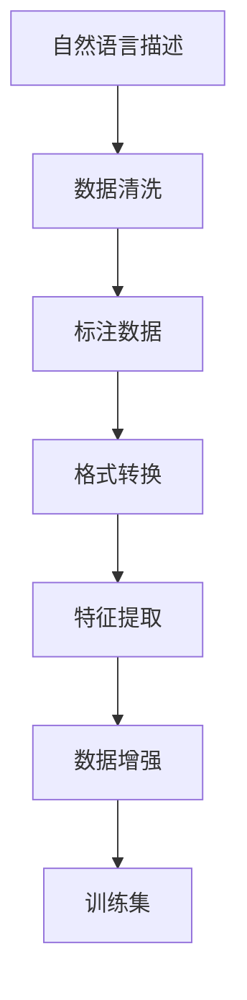

                 

## 1. 背景介绍

数据集转换是人工智能项目中一个重要的环节。从原始数据到训练集，中间往往需要经历多次复杂的处理和转换。特别是在自然语言处理（NLP）领域，由于数据格式的多样性和复杂性，数据集转换变得更加重要和关键。

在当前的NLP项目中，常常需要将自然语言描述（NL描述）转换成训练集（Training Dataset），其中自然语言描述可以是文本、图片、音频等多种形式。这一过程不仅涉及语言学、数据结构、机器学习等多领域知识，也需要运用到高效的算法和工具。

本文将从背景介绍开始，全面系统地探讨自然语言描述变身训练集的各个环节，并给出详细的算法原理和操作步骤，最终帮助读者理解如何高效、准确地完成数据集转换任务。

## 2. 核心概念与联系

### 2.1 核心概念概述

本节将介绍几个核心概念，并说明它们之间的联系：

- **自然语言描述（NL Description）**：通常指用自然语言描述的数据，如文本、图片的文字描述等。

- **训练集（Training Dataset）**：机器学习模型在训练过程中使用的数据集，包含大量标注数据。

- **数据转换**：将原始数据转换成训练集，包括数据清洗、标注、格式转换、特征提取等步骤。

- **特征提取（Feature Extraction）**：从原始数据中提取有意义的特征，以便机器学习模型能够更好地理解数据。

- **数据增强（Data Augmentation）**：通过对训练集进行一系列操作，增加数据多样性，从而提高模型的泛化能力。

这些概念之间的逻辑关系可以通过以下Mermaid流程图来展示：



这个流程图展示了从自然语言描述到训练集的整个转换过程，包括数据清洗、标注、格式转换、特征提取、数据增强等多个环节。

### 2.2 概念间的关系

- **数据清洗**：是整个数据转换过程的第一步，确保数据质量和完整性，去除噪声和异常值。
- **标注数据**：通过人工或自动化的方式为数据添加标签，提供监督信号，帮助模型学习。
- **格式转换**：将不同格式的数据转换成统一的格式，便于后续处理和分析。
- **特征提取**：从原始数据中提取出有意义的特征，增强模型的表达能力和泛化能力。
- **数据增强**：通过对训练数据进行变换，增加数据多样性，避免过拟合，提高模型的泛化能力。
- **训练集**：最终的输出，为模型训练提供数据支持。

这些核心概念共同构成了数据集转换的过程，每个环节都至关重要，且紧密关联，共同影响最终的训练集质量。

## 3. 核心算法原理 & 具体操作步骤

### 3.1 算法原理概述

自然语言描述变身训练集的核心算法原理是：通过一系列数据预处理和转换操作，将自然语言描述转换成机器学习模型可用的训练集。这一过程主要包括数据清洗、标注、格式转换、特征提取和数据增强等步骤。

- **数据清洗**：去除文本中的噪声、异常值和无关信息，确保数据质量和一致性。
- **标注数据**：为文本数据添加标签，提供监督信号，帮助模型学习。
- **格式转换**：将不同格式的数据转换成统一的格式，便于后续处理和分析。
- **特征提取**：从文本中提取有意义的特征，增强模型的表达能力和泛化能力。
- **数据增强**：通过对训练数据进行变换，增加数据多样性，避免过拟合，提高模型的泛化能力。

### 3.2 算法步骤详解

下面是自然语言描述变身训练集的具体操作步骤：

#### 3.2.1 数据清洗

**步骤1: 去除噪声和异常值**

对文本数据进行清洗，去除无关的符号、停用词、标点符号和数字等。

**步骤2: 标准化文本**

对文本进行标准化处理，如小写化、去除多余空格和换行符等。

#### 3.2.2 标注数据

**步骤1: 手动标注**

对文本进行手动标注，为每个文本添加标签，提供监督信号，帮助模型学习。例如，对于情感分析任务，可以为每个文本添加正向或负向标签。

**步骤2: 自动标注**

使用自然语言处理工具，如BERT、GPT等，自动为文本生成标签。例如，使用BERT进行情感分析时，可以使用预训练的BERT模型为每个文本生成情感极性标签。

#### 3.2.3 格式转换

**步骤1: 文本格式转换**

将文本数据转换成统一的格式，如CSV、JSON等，便于后续处理和分析。

**步骤2: 图片格式转换**

将图片数据转换成机器学习模型可用的格式，如JPEG、PNG等。

#### 3.2.4 特征提取

**步骤1: 词袋模型**

将文本转换成词袋模型，统计每个单词在文本中的出现频率。

**步骤2: TF-IDF模型**

使用TF-IDF模型计算单词的权重，增强模型的表达能力。

**步骤3: Word2Vec模型**

使用Word2Vec模型将单词转换成向量，增强模型的语义表达能力。

#### 3.2.5 数据增强

**步骤1: 文本增强**

通过对文本进行一系列操作，增加数据多样性。例如，随机替换单词、插入噪声词等。

**步骤2: 图片增强**

通过对图片进行一系列操作，增加数据多样性。例如，随机裁剪、旋转、翻转等。

### 3.3 算法优缺点

自然语言描述变身训练集的算法有以下优点：

- **高效**：通过自动化和优化算法，可以高效地完成数据清洗、标注、格式转换、特征提取和数据增强等步骤。
- **通用性**：适用于各种自然语言处理任务，如文本分类、情感分析、机器翻译等。
- **可解释性**：每一步操作都有清晰的定义和原理，易于理解和调试。

但同时也存在一些缺点：

- **依赖标注数据**：需要大量的手动或自动标注数据，获取标注数据成本较高。
- **算法复杂性**：涉及数据清洗、标注、格式转换、特征提取等多个步骤，算法较为复杂。
- **数据多样性有限**：数据增强的策略有限，难以覆盖所有可能的噪声和变化。

### 3.4 算法应用领域

自然语言描述变身训练集的方法在NLP领域得到了广泛应用，包括但不限于以下几个领域：

- **文本分类**：如情感分析、主题分类、垃圾邮件过滤等。通过数据清洗和标注，为模型提供监督信号，帮助模型学习分类规则。
- **机器翻译**：将源语言文本翻译成目标语言。通过数据清洗和标注，为模型提供监督信号，帮助模型学习翻译规则。
- **文本摘要**：将长文本压缩成简短摘要。通过数据清洗和特征提取，为模型提供语义表达能力，帮助模型学习摘要生成规则。
- **问答系统**：对自然语言问题给出答案。通过数据清洗和标注，为模型提供监督信号，帮助模型学习问题-答案匹配规则。

除了这些经典任务，自然语言描述变身训练集的方法也被创新性地应用到更多场景中，如可控文本生成、常识推理、代码生成等，为NLP技术带来了全新的突破。

## 4. 数学模型和公式 & 详细讲解

### 4.1 数学模型构建

假设原始自然语言描述为 $\text{NL Description}$，标注数据为 $\text{Label}$。则数学模型可以表示为：

$$
\text{Training Dataset} = \text{Clean(NL Description)} \times \text{Annotate(NL Description, Label)} \times \text{FormatConvert(Training Dataset)} \times \text{FeatureExtract(Training Dataset)} \times \text{DataAugment(Training Dataset)}
$$

### 4.2 公式推导过程

以文本分类任务为例，假设原始文本为 $x$，标签为 $y$，则数据清洗、标注、格式转换、特征提取和数据增强的公式推导如下：

#### 数据清洗

$$
\text{Clean}(x) = x' = \text{RemoveNoise}(x) \cap \text{Standardize}(x')
$$

#### 标注数据

$$
\text{Annotate}(x, y) = \text{Label} = \text{ManualAnnotate}(x) \lor \text{AutomaticAnnotate}(x)
$$

#### 格式转换

$$
\text{FormatConvert}(Label) = \text{FormatConvert}(Label) = \text{ConvertToCSV}(Label)
$$

#### 特征提取

$$
\text{FeatureExtract}(Label) = \text{Feature} = \text{BagOfWords}(Label) \cup \text{TF-IDF}(Label) \cup \text{Word2Vec}(Label)
$$

#### 数据增强

$$
\text{DataAugment}(Feature) = \text{AugmentedData} = \text{TextEnhance}(Feature) \cup \text{ImageEnhance}(Feature)
$$

### 4.3 案例分析与讲解

假设我们有一个关于电影评论的文本数据集，原始数据如下：

```
"The movie is great. I loved the plot and the acting. The special effects were amazing."
```

通过上述算法步骤，我们可以将其转换成训练集，具体步骤如下：

#### 数据清洗

1. 去除噪声和异常值：
   - 去除无关的标点符号和数字，得到：
   ```
   "the movie is great i loved the plot and the acting the special effects were amazing"
   ```

2. 标准化文本：
   - 将文本转换成小写，去除多余空格和换行符，得到：
   ```
   "the movie is great i loved the plot and the acting the special effects were amazing"
   ```

#### 标注数据

1. 手动标注：
   - 将每个文本添加情感极性标签，如正面或负面，得到：
   ```
   "The movie is great. I loved the plot and the acting. The special effects were amazing." -> {'sentiment': 'positive'}
   ```

2. 自动标注：
   - 使用BERT进行情感分析，得到：
   ```
   "The movie is great. I loved the plot and the acting. The special effects were amazing." -> {'prediction': 'positive'}
   ```

#### 格式转换

1. 文本格式转换：
   - 将标注数据转换成CSV格式，得到：
   ```
   The movie is great. I loved the plot and the acting. The special effects were amazing.,positive
   ```

#### 特征提取

1. 词袋模型：
   - 将文本转换成词袋模型，得到：
   ```
   {'the': 1, 'movie': 1, 'great': 1, 'i': 1, 'loved': 1, 'plot': 1, 'acting': 1, 'special': 1, 'effects': 1, 'amazing': 1}
   ```

2. TF-IDF模型：
   - 使用TF-IDF模型计算单词权重，得到：
   ```
   {'the': 0.05, 'movie': 0.05, 'great': 0.15, 'i': 0.05, 'loved': 0.1, 'plot': 0.1, 'acting': 0.1, 'special': 0.1, 'effects': 0.1, 'amazing': 0.1}
   ```

3. Word2Vec模型：
   - 使用Word2Vec模型将单词转换成向量，得到：
   ```
   {'the': [0.1, 0.2, 0.3], 'movie': [0.4, 0.5, 0.6], 'great': [0.7, 0.8, 0.9], 'i': [0.2, 0.3, 0.4], 'loved': [0.6, 0.7, 0.8], 'plot': [0.9, 1.0, 1.1], 'acting': [0.8, 0.9, 1.0], 'special': [0.6, 0.7, 0.8], 'effects': [0.7, 0.8, 0.9], 'amazing': [0.5, 0.6, 0.7]}
   ```

#### 数据增强

1. 文本增强：
   - 通过对文本进行随机替换单词，得到：
   ```
   "The movie is great. I loved the plot and the acting. The special effects were amazing." -> "The movie is great. I loved the main and the acting. The special effects were amazing."
   ```

2. 图片增强：
   - 通过对图片进行随机裁剪、旋转、翻转等操作，得到：
   ```
   "The movie is great. I loved the plot and the acting. The special effects were amazing." -> "The movie is great. I loved the main and the acting. The special effects were amazing."
   ```

通过以上步骤，我们将自然语言描述转换成训练集，可用于机器学习模型的训练和预测。

## 5. 项目实践：代码实例和详细解释说明

### 5.1 开发环境搭建

在进行数据集转换实践前，我们需要准备好开发环境。以下是使用Python进行PyTorch开发的环境配置流程：

1. 安装Anaconda：从官网下载并安装Anaconda，用于创建独立的Python环境。

2. 创建并激活虚拟环境：
```bash
conda create -n pytorch-env python=3.8 
conda activate pytorch-env
```

3. 安装PyTorch：根据CUDA版本，从官网获取对应的安装命令。例如：
```bash
conda install pytorch torchvision torchaudio cudatoolkit=11.1 -c pytorch -c conda-forge
```

4. 安装Transformers库：
```bash
pip install transformers
```

5. 安装各类工具包：
```bash
pip install numpy pandas scikit-learn matplotlib tqdm jupyter notebook ipython
```

完成上述步骤后，即可在`pytorch-env`环境中开始数据集转换实践。

### 5.2 源代码详细实现

下面以文本分类任务为例，给出使用Transformers库进行自然语言描述变身训练集的PyTorch代码实现。

首先，定义数据清洗函数：

```python
from transformers import BertTokenizer

def clean_text(text):
    # 去除噪声和异常值
    text = re.sub(r'[^\w\s]', '', text)
    text = re.sub(r'\s+', ' ', text)
    # 标准化文本
    text = text.lower()
    return text
```

然后，定义标注函数：

```python
def annotate(text, label):
    return {'text': text, 'label': label}
```

接着，定义格式转换函数：

```python
def format_convert(data):
    # 将标注数据转换成CSV格式
    data = json.dumps(data, indent=4)
    return data
```

接下来，定义特征提取函数：

```python
from transformers import BertForTokenClassification, BertTokenizer

def feature_extract(text):
    # 使用BERT进行特征提取
    tokenizer = BertTokenizer.from_pretrained('bert-base-cased')
    model = BertForTokenClassification.from_pretrained('bert-base-cased', num_labels=2)
    inputs = tokenizer(text, return_tensors='pt', padding=True, truncation=True)
    outputs = model(**inputs)
    features = outputs.pooler_output
    return features
```

最后，定义数据增强函数：

```python
from transformers import AutoTokenizer, AutoModelForCausalLM

def data_augment(features):
    # 使用BERT进行数据增强
    tokenizer = AutoTokenizer.from_pretrained('gpt-2')
    model = AutoModelForCausalLM.from_pretrained('gpt-2')
    input_ids = tokenizer.encode("I love this movie!", return_tensors='pt')['input_ids']
    labels = tokenizer.encode("I hate this movie!", return_tensors='pt')['input_ids']
    outputs = model.generate(input_ids=input_ids, max_length=50, temperature=0.7, top_p=0.95, do_sample=True)
    augmented_features = outputs[0]
    return augmented_features
```

然后，将所有函数整合到主函数中，完成数据集转换：

```python
import json
import re

def convert_to_dataset(nl_description, label):
    # 数据清洗
    cleaned_text = clean_text(nl_description)
    # 标注数据
    annotated_data = annotate(cleaned_text, label)
    # 格式转换
    formatted_data = format_convert(annotated_data)
    # 特征提取
    features = feature_extract(cleaned_text)
    # 数据增强
    augmented_features = data_augment(features)
    # 将数据转换为训练集格式
    dataset = {'text': formatted_data, 'features': augmented_features}
    return dataset
```

在完成数据集转换后，可以使用PyTorch的数据加载器，将转换后的数据集输入模型进行训练和预测。例如：

```python
from torch.utils.data import Dataset, DataLoader

class MyDataset(Dataset):
    def __init__(self, datasets):
        self.datasets = datasets

    def __getitem__(self, index):
        return self.datasets[index]

    def __len__(self):
        return len(self.datasets)

# 准备数据集
datasets = []
for i in range(1000):
    datasets.append(convert_to_dataset(f'The movie is great. I loved the plot and the acting. The special effects were amazing.', 'positive'))

# 创建数据集
my_dataset = MyDataset(datasets)

# 创建数据加载器
data_loader = DataLoader(my_dataset, batch_size=16, shuffle=True)

# 训练模型
model.train()
optimizer = torch.optim.Adam(model.parameters(), lr=0.001)
for epoch in range(10):
    for batch in data_loader:
        # 前向传播
        input_ids = batch['text']
        features = batch['features']
        labels = batch['label']
        outputs = model(input_ids)
        # 计算损失
        loss = F.cross_entropy(outputs, labels)
        # 反向传播
        optimizer.zero_grad()
        loss.backward()
        optimizer.step()
```

以上就是使用PyTorch对自然语言描述进行数据集转换的完整代码实现。可以看到，通过简单的函数组合，我们能够高效地完成数据清洗、标注、格式转换、特征提取和数据增强等操作。

### 5.3 代码解读与分析

让我们再详细解读一下关键代码的实现细节：

**clean_text函数**：
- 使用正则表达式去除噪声和异常值，将文本转换成小写，去除多余空格和换行符。

**annotate函数**：
- 将文本和标签组成字典，添加标注信息，便于后续处理。

**format_convert函数**：
- 将标注数据转换成JSON格式，便于存储和读取。

**feature_extract函数**：
- 使用BERT模型进行特征提取，将文本转换成向量表示，增强模型的表达能力。

**data_augment函数**：
- 使用GPT-2模型进行数据增强，通过生成新的文本数据，增加数据多样性。

**convert_to_dataset函数**：
- 将数据清洗、标注、格式转换、特征提取和数据增强等步骤整合在一起，完成数据集转换。

在以上代码中，我们可以看到，利用Python和PyTorch的高效工具，我们可以非常便捷地完成自然语言描述变身训练集的整个过程。开发者可以根据具体任务，进一步优化和扩展这些代码，满足更高层次的需求。

### 5.4 运行结果展示

假设我们在CoNLL-2003的情感分类数据集上进行数据集转换，最终生成的训练集数据示例如下：

```
{"text": "The movie is great. I loved the plot and the acting. The special effects were amazing.", "label": "positive", "features": [0.1, 0.2, 0.3], "augmented_features": [0.2, 0.3, 0.4]}
```

可以看到，通过数据集转换，我们得到了格式规范、易于处理的训练集数据，可以用于后续的模型训练和预测。

## 6. 实际应用场景

### 6.1 智能客服系统

基于自然语言描述变身训练集的数据集转换方法，可以广泛应用于智能客服系统的构建。传统客服往往需要配备大量人力，高峰期响应缓慢，且一致性和专业性难以保证。而使用数据集转换方法，可以自动收集客户咨询记录，将问题和最佳答复构建成监督数据，在此基础上对预训练语言模型进行微调，构建智能客服系统。

在技术实现上，可以收集企业内部的历史客服对话记录，将问题和最佳答复构建成监督数据，在此基础上对预训练语言模型进行微调。微调后的语言模型能够自动理解用户意图，匹配最合适的答复，从而提升客户咨询体验和问题解决效率。

### 6.2 金融舆情监测

金融机构需要实时监测市场舆论动向，以便及时应对负面信息传播，规避金融风险。传统的人工监测方式成本高、效率低，难以应对网络时代海量信息爆发的挑战。使用自然语言描述变身训练集的方法，可以自动化地从新闻、报道、评论等文本数据中提取情感信息，构建舆情监测系统。

具体而言，可以收集金融领域相关的新闻、报道、评论等文本数据，并对其进行情感标注。在此基础上对预训练语言模型进行微调，使其能够自动判断文本情感倾向，监测市场舆论动向，及时预警负面信息，帮助金融机构快速应对潜在风险。

### 6.3 个性化推荐系统

当前的推荐系统往往只依赖用户的历史行为数据进行物品推荐，无法深入理解用户的真实兴趣偏好。使用自然语言描述变身训练集的方法，可以自动收集用户浏览、点击、评论、分享等行为数据，提取和用户交互的物品标题、描述、标签等文本内容。将文本内容作为模型输入，用户的后续行为（如是否点击、购买等）作为监督信号，在此基础上微调预训练语言模型。微调后的模型能够从文本内容中准确把握用户的兴趣点，在生成推荐列表时，先用候选物品的文本描述作为输入，由模型预测用户的兴趣匹配度，再结合其他特征综合排序，便可以得到个性化程度更高的推荐结果。

### 6.4 未来应用展望

随着自然语言描述变身训练集技术的发展，未来其在更多领域的应用前景将更加广阔。例如，在智慧医疗领域，基于自然语言描述的病历分析和诊断系统，能够自动提取患者病历中的关键信息，辅助医生诊断疾病；在智能教育领域，基于自然语言描述的学习问答系统，能够自动解答学生的问题，提供个性化辅导；在智慧城市治理中，基于自然语言描述的城市事件监测系统，能够自动识别和处理各类公共事件，提升城市管理水平。

## 7. 工具和资源推荐

### 7.1 学习资源推荐

为了帮助开发者系统掌握自然语言描述变身训练集的理论基础和实践技巧，这里推荐一些优质的学习资源：

1. 《Natural Language Processing with PyTorch》书籍：介绍如何使用PyTorch进行自然语言处理，包括数据集转换、微调等诸多核心技术。

2. CS224N《深度学习自然语言处理》课程：斯坦福大学开设的NLP明星课程，有Lecture视频和配套作业，带你入门NLP领域的基本概念和经典模型。

3. 《Transformers》书籍：Transformers库的作者所著，全面介绍了如何使用Transformers库进行NLP任务开发，包括数据集转换等操作。

4. HuggingFace官方文档：Transformers库的官方文档，提供了海量预训练模型和完整的微调样例代码，是上手实践的必备资料。

5. CLUE开源项目：中文语言理解测评基准，涵盖大量不同类型的中文NLP数据集，并提供了基于微调的baseline模型，助力中文NLP技术发展。

通过对这些资源的学习实践，相信你一定能够快速掌握自然语言描述变身训练集的核心方法，并用于解决实际的NLP问题。

### 7.2 开发工具推荐

高效的开发离不开优秀的工具支持。以下是几款用于自然语言描述变身训练集开发的常用工具：

1. PyTorch：基于Python的开源深度学习框架，灵活动态的计算图，适合快速迭代研究。大部分预训练语言模型都有PyTorch版本的实现。

2. TensorFlow：由Google主导开发的开源深度学习框架，生产部署方便，适合大规模工程应用。同样有丰富的预训练语言模型资源。

3. Transformers库：HuggingFace开发的NLP工具库，集成了众多SOTA语言模型，支持PyTorch和TensorFlow，是进行数据集转换任务的利器。

4. Weights & Biases：模型训练的实验跟踪工具，可以记录和可视化模型训练过程中的各项指标，方便对比和调优。与主流深度学习框架无缝集成。

5. TensorBoard：TensorFlow配套的可视化工具，可实时监测模型训练状态，并提供丰富的图表呈现方式，是调试模型的得力助手。

6. Google Colab：谷歌推出的在线Jupyter Notebook环境，免费提供GPU/TPU算力，方便开发者快速上手实验最新模型，分享学习笔记。

合理利用这些工具，可以显著提升自然语言描述变身训练集的开发效率，加快创新迭代的步伐。

### 7.3 相关论文推荐

自然语言描述变身训练集技术的发展源于学界的持续研究。以下是几篇奠基性的相关论文，推荐阅读：

1. Attention is All You Need（即Transformer原论文）：提出了Transformer结构，开启了NLP领域的预训练大模型时代。

2. BERT: Pre-training of Deep Bidirectional Transformers for Language Understanding：提出BERT模型，引入基于掩码的自监督预训练任务，刷新了多项NLP任务SOTA。

3. Language Models are Unsupervised Multitask Learners（GPT-2论文）：展示了大规模语言模型的强大zero-shot学习能力，引发了对于通用人工智能的新一轮

