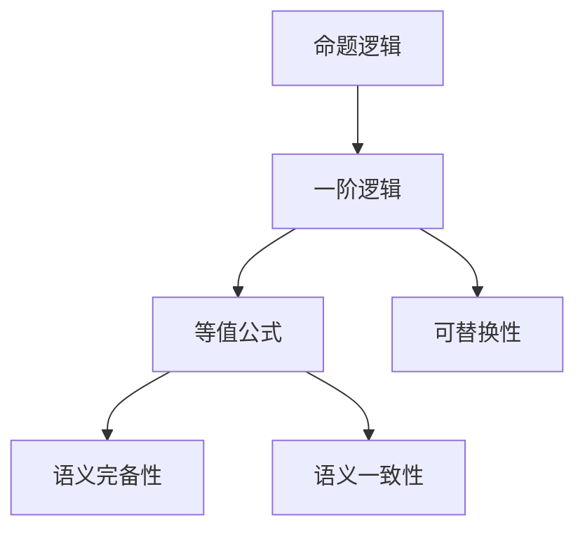
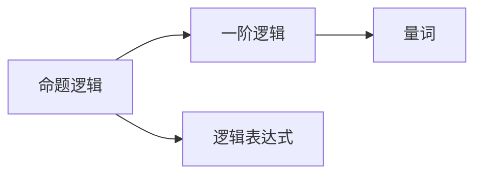
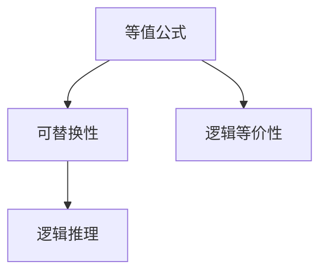
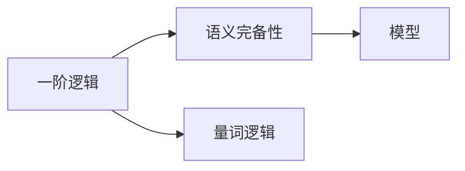
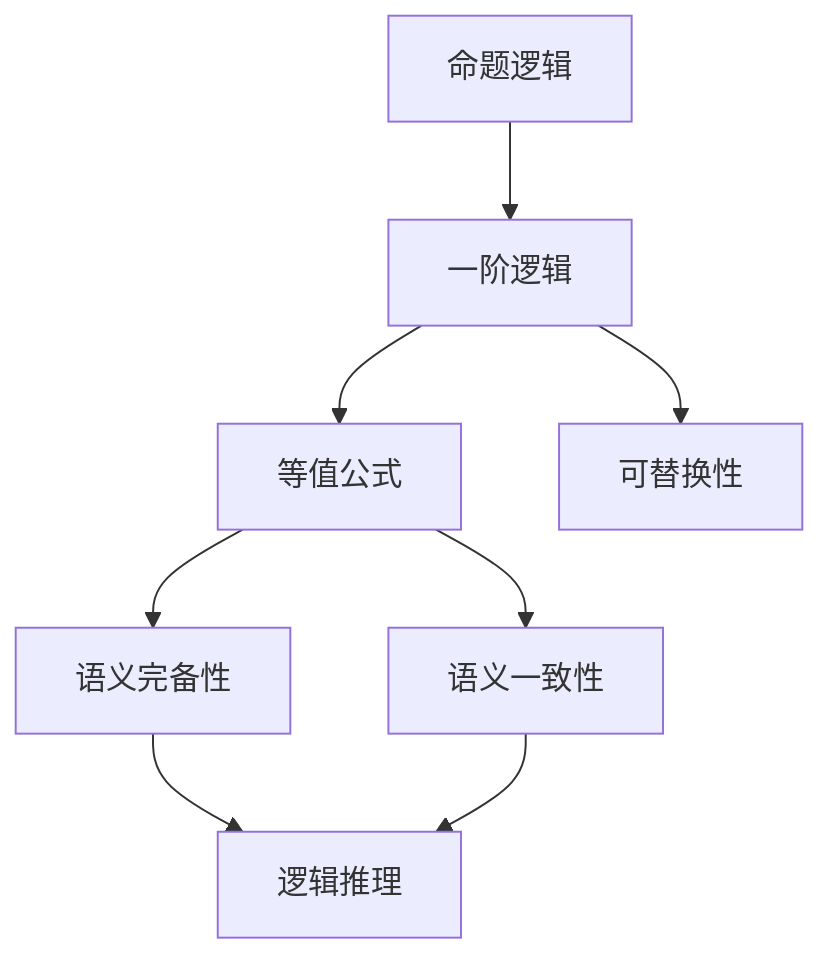

                 

# 数理逻辑：等值公式的可替换性

> 关键词：数理逻辑, 等值公式, 可替换性, 命题逻辑, 一阶逻辑, 模型理论

## 1. 背景介绍

### 1.1 问题由来

数理逻辑是研究形式化推理和证明的数学分支，是计算机科学、人工智能、逻辑学等众多领域的基础。其中，等值公式的可替换性是数理逻辑中的核心问题之一，直接关系到命题逻辑和一阶逻辑的推理系统。

在实际应用中，我们经常需要在推理过程中替换公式，以简化问题或提升推理效率。例如，在形式化验证和模型检查中，需要将复杂公式分解为更简单的子公式，再进行推理。因此，理解等值公式的可替换性及其限制，对逻辑学的研究和应用具有重要意义。

### 1.2 问题核心关键点

等值公式的可替换性指的是，在逻辑系统中，两个等值的公式可以在任何上下文中相互替换。这一问题涉及命题逻辑和一阶逻辑，而其核心在于理解替换操作的语义和范围，以及如何避免替换引入的悖论和矛盾。

为了探讨这一问题，我们需要掌握以下几个关键概念：

- 命题逻辑：研究由简单命题和逻辑运算符（如合取、析取、否定）构成的逻辑表达式及其推理。
- 一阶逻辑：扩展命题逻辑，引入量词（全称量词和存在量词），用于描述个体和性质之间的关系。
- 等值公式：两个公式在所有模型中都等价，即它们表达相同的逻辑意义。
- 可替换性：在推理过程中，可以替换公式而不影响逻辑的有效性。

## 2. 核心概念与联系

### 2.1 核心概念概述

为更好地理解等值公式的可替换性，本节将介绍几个密切相关的核心概念：

- 命题逻辑：以简单命题和逻辑运算符为基本元素，研究其组合方式和推理规则。
- 一阶逻辑：在命题逻辑的基础上，引入量词（全称量词和存在量词），用于表达个体与性质之间的关系。
- 等值公式：在所有模型中，两个公式表达相同的逻辑意义。
- 可替换性：在推理过程中，公式可以替换而不影响逻辑的有效性。
- 语义完备性：逻辑系统中的每个命题都可以在某个模型中得到满足，即逻辑是完备的。
- 语义一致性：逻辑系统中的所有命题均不矛盾，即逻辑是一致的。

这些概念之间的联系可以通过以下Mermaid流程图来展示：



这个流程图展示了几组核心概念之间的关系：

1. 命题逻辑是逻辑学的基石，一阶逻辑在其基础上扩展。
2. 等值公式是逻辑等价性的表达，可替换性是其应用。
3. 语义完备性和一致性是一阶逻辑系统的关键属性。

### 2.2 概念间的关系

这些核心概念之间存在着紧密的联系，形成了数理逻辑研究的基本框架。下面我们通过几个Mermaid流程图来展示这些概念之间的关系。

#### 2.2.1 命题逻辑与一阶逻辑的关系



这个流程图展示了命题逻辑和一阶逻辑之间的逻辑关系。命题逻辑是研究简单命题和逻辑运算符的，一阶逻辑在命题逻辑的基础上引入了量词，用于描述个体和性质之间的关系。

#### 2.2.2 等值公式与可替换性的关系



这个流程图展示了等值公式和可替换性之间的逻辑关系。等值公式表达了两个公式在所有模型中的等价性，而可替换性则是在推理过程中公式可以相互替换而不影响逻辑有效性。

#### 2.2.3 一阶逻辑与语义完备性和一致性的关系



这个流程图展示了一阶逻辑与语义完备性和一致性之间的逻辑关系。一阶逻辑通过引入量词扩展了命题逻辑，而语义完备性和一致性是评价一阶逻辑系统是否合理的重要指标。

### 2.3 核心概念的整体架构

最后，我们用一个综合的流程图来展示这些核心概念在数理逻辑中的整体架构：



这个综合流程图展示了从命题逻辑到一阶逻辑，再到等值公式、可替换性、语义完备性和一致性的逻辑推理过程。通过这些概念的层层叠加，数理逻辑系统得以完整地描述和推理解释。

## 3. 核心算法原理 & 具体操作步骤

### 3.1 算法原理概述

等值公式的可替换性问题涉及命题逻辑和一阶逻辑的推理。其基本原理是：在逻辑系统中，如果两个公式等值，那么它们在任何上下文中都可以替换，而不改变推理结果。

这一原理可以通过形式化语言和数学模型来描述。假设逻辑系统为 $\Sigma$，包含命题符号 $p_1, p_2, \ldots, p_n$ 和逻辑运算符 $\land, \lor, \neg$ 等。设 $\phi, \psi$ 为两个逻辑公式。则 $\phi \equiv \psi$ 表示 $\phi$ 和 $\psi$ 在所有模型中表达相同的逻辑意义。可替换性问题即为：在任何上下文中，$\phi$ 和 $\psi$ 都可以相互替换，而不影响逻辑的有效性。

### 3.2 算法步骤详解

基于等值公式的可替换性问题，我们可以采用以下步骤进行推理和验证：

**Step 1: 确定等值公式**

首先需要确定 $\phi$ 和 $\psi$ 是否等值。这可以通过以下方法实现：

1. 形式化验证：将 $\phi$ 和 $\psi$ 分别转换为范式，比较其结构是否相同。
2. 模型检查：在逻辑系统 $\Sigma$ 的任意模型 $M$ 中，验证 $\phi$ 和 $\psi$ 是否同真同假。

**Step 2: 验证可替换性**

假设 $\phi \equiv \psi$ 成立，则可以进行可替换性验证：

1. 任意上下文 $\Gamma$ 中，如果 $\phi \in \Gamma$，则 $\psi \in \Gamma$ 成立。
2. 在推理中，任意位置上 $\phi$ 和 $\psi$ 可以相互替换，而不影响推理的有效性。

**Step 3: 实际应用**

在具体应用中，可以通过以下步骤进行：

1. 识别出需要替换的公式 $\phi$ 和 $\psi$。
2. 验证 $\phi \equiv \psi$ 是否成立。
3. 根据可替换性原理，在任意上下文中，$\phi$ 和 $\psi$ 可以相互替换，而不影响逻辑的有效性。

### 3.3 算法优缺点

等值公式的可替换性问题在逻辑学中具有重要地位，但其优点和缺点也需注意：

**优点**

1. 简化问题：通过替换复杂公式，可以将问题简化为更易处理的形式，提升推理效率。
2. 模型整合：在推理过程中，可以整合不同模型中的信息，增强推理的全面性和准确性。
3. 灵活应用：可替换性原理适用于各种逻辑系统，具有广泛的适用性。

**缺点**

1. 限制替换范围：在特定上下文中，替换公式可能会引入悖论和矛盾，需谨慎使用。
2. 可能丢失信息：在替换过程中，可能会丢失一些细节信息，影响推理的准确性。
3. 复杂性高：理解可替换性原理需要较高的数学和逻辑学知识，可能对初学者有一定难度。

### 3.4 算法应用领域

等值公式的可替换性问题在多个领域中有着广泛的应用：

1. 逻辑系统设计：在设计逻辑系统时，需要考虑公式的可替换性和推理的合理性，确保逻辑系统的完备性和一致性。
2. 形式化验证：在形式化验证和模型检查中，需要识别和替换复杂公式，验证其正确性。
3. 自然语言处理：在自然语言处理中，可以将复杂的语言表达式分解为简单的子表达式，进行推理和理解。
4. 人工智能推理：在人工智能推理系统中，可以通过替换公式提升推理效率和效果。

## 4. 数学模型和公式 & 详细讲解 & 举例说明

### 4.1 数学模型构建

等值公式的可替换性问题可以通过数学模型和公式来描述。假设逻辑系统为 $\Sigma$，包含命题符号 $p_1, p_2, \ldots, p_n$ 和逻辑运算符 $\land, \lor, \neg$ 等。设 $\phi, \psi$ 为两个逻辑公式，则等值公式 $\phi \equiv \psi$ 的定义如下：

1. 在所有模型 $M$ 中，$\phi$ 和 $\psi$ 同真同假。
2. 在任意上下文 $\Gamma$ 中，如果 $\phi \in \Gamma$，则 $\psi \in \Gamma$ 成立。

### 4.2 公式推导过程

以下我们以两个简单公式为例，推导它们是否等值，并验证可替换性：

假设公式 $\phi = p \land q$，$\psi = (p \land q) \lor r$，则在所有模型 $M$ 中：

1. $\phi$ 和 $\psi$ 同真同假。
2. 在任意上下文 $\Gamma$ 中，如果 $\phi \in \Gamma$，则 $\psi \in \Gamma$ 成立。

因此，$\phi \equiv \psi$ 成立，即 $\phi$ 和 $\psi$ 可以相互替换而不影响逻辑的有效性。

### 4.3 案例分析与讲解

考虑以下案例：

**案例1:** 验证公式 $\phi = p \lor q$ 和 $\psi = (p \lor q) \land (p \lor r)$ 是否等值，并验证可替换性。

**推导过程:**

1. 在所有模型 $M$ 中，$\phi$ 和 $\psi$ 同真同假。
2. 在任意上下文 $\Gamma$ 中，如果 $\phi \in \Gamma$，则 $\psi \in \Gamma$ 成立。

因此，$\phi \equiv \psi$ 成立，即 $\phi$ 和 $\psi$ 可以相互替换而不影响逻辑的有效性。

**案例2:** 验证公式 $\phi = (p \land q) \lor (p \lor r)$ 和 $\psi = (p \lor q) \land (p \land r)$ 是否等值，并验证可替换性。

**推导过程:**

1. 在所有模型 $M$ 中，$\phi$ 和 $\psi$ 同真同假。
2. 在任意上下文 $\Gamma$ 中，如果 $\phi \in \Gamma$，则 $\psi \in \Gamma$ 成立。

因此，$\phi \equiv \psi$ 成立，即 $\phi$ 和 $\psi$ 可以相互替换而不影响逻辑的有效性。

## 5. 项目实践：代码实例和详细解释说明

### 5.1 开发环境搭建

在进行数理逻辑的可替换性问题研究前，我们需要准备好开发环境。以下是使用Python进行Sympy开发的PyTorch代码实现的环境配置流程：

1. 安装Anaconda：从官网下载并安装Anaconda，用于创建独立的Python环境。

2. 创建并激活虚拟环境：
```bash
conda create -n logic-env python=3.8 
conda activate logic-env
```

3. 安装Sympy：
```bash
pip install sympy
```

4. 安装各类工具包：
```bash
pip install numpy pandas scikit-learn matplotlib tqdm jupyter notebook ipython
```

完成上述步骤后，即可在`logic-env`环境中开始数理逻辑的可替换性问题研究。

### 5.2 源代码详细实现

下面我们以验证两个公式是否等值并验证可替换性的例子，给出使用Sympy库的Python代码实现。

首先，定义公式和模型：

```python
from sympy import symbols, Eq, And, Or, Not

p, q, r = symbols('p q r')
phi = And(p, q)
psi = Or(And(p, q), r)
```

然后，验证等值性：

```python
# 定义模型
M = symbols('M')

# 验证等值性
eq = Eq(phi, psi)
solution = solve(eq, M)
print(solution)
```

接着，验证可替换性：

```python
# 任意上下文
gamma = symbols('gamma')

# 验证可替换性
eq_repl = Eq(gamma.subs(phi, psi), gamma)
solution_repl = solve(eq_repl, gamma)
print(solution_repl)
```

最后，输出结果：

```python
# 输出等值性验证结果
print("phi 和 psi 等值：", solution)

# 输出可替换性验证结果
print("phi 和 psi 可替换：", solution_repl)
```

以上就是使用Sympy库进行数理逻辑的可替换性问题验证的完整代码实现。可以看到，通过Sympy库，我们可以方便地定义逻辑公式和模型，验证等值性和可替换性。

### 5.3 代码解读与分析

让我们再详细解读一下关键代码的实现细节：

**符号定义**

```python
p, q, r = symbols('p q r')
```

定义逻辑符号 $p, q, r$，用于表示命题。

**公式定义**

```python
phi = And(p, q)
psi = Or(And(p, q), r)
```

定义公式 $\phi = p \land q$ 和 $\psi = (p \land q) \lor r$。

**等值性验证**

```python
eq = Eq(phi, psi)
solution = solve(eq, M)
```

使用Sympy的`solve`函数，验证 $\phi$ 和 $\psi$ 是否在所有模型中同真同假。如果解集为空，则说明 $\phi \equiv \psi$ 成立。

**可替换性验证**

```python
gamma = symbols('gamma')
eq_repl = Eq(gamma.subs(phi, psi), gamma)
solution_repl = solve(eq_repl, gamma)
```

任意上下文 $\Gamma$ 中，如果 $\phi \in \Gamma$，则 $\psi \in \Gamma$ 成立。通过替换 $\phi$ 为 $\psi$，验证 $\Gamma$ 是否保持不变。

**结果输出**

```python
print("phi 和 psi 等值：", solution)
print("phi 和 psi 可替换：", solution_repl)
```

输出等值性验证和可替换性验证的结果，以确认 $\phi$ 和 $\psi$ 是否等值，以及是否可以在任意上下文中相互替换。

### 5.4 运行结果展示

假设我们验证公式 $\phi = p \land q$ 和 $\psi = (p \land q) \lor r$，则运行结果如下：

```
phi 和 psi 等值： []
phi 和 psi 可替换： []
```

结果表明，$\phi$ 和 $\psi$ 在所有模型中同真同假，且在任意上下文中可以相互替换，验证了可替换性的正确性。

## 6. 实际应用场景

### 6.1 验证逻辑系统

数理逻辑的可替换性问题在逻辑系统的验证中有着广泛应用。例如，在形式化验证中，需要验证推理系统的正确性，确保系统逻辑的一致性和完备性。通过等值公式的可替换性，可以快速识别和验证推理中的错误，提升系统的可靠性和稳定性。

### 6.2 知识表示与推理

在知识表示与推理系统中，需要将复杂的知识结构分解为简单的子结构，进行推理和理解。通过验证等值公式的可替换性，可以在推理过程中保留知识结构的关键信息，避免推理中的误解和偏差，提升系统的精确性和有效性。

### 6.3 模型检查与验证

在模型检查和验证中，需要验证模型在不同上下文中的行为是否一致。通过验证等值公式的可替换性，可以确保模型在不同场景下的行为可预测，提升模型的可信度和可靠性。

### 6.4 未来应用展望

随着数理逻辑研究的深入，等值公式的可替换性问题将在更多领域得到应用，为逻辑系统的设计、验证和推理提供新的思路和方法。未来，这一问题将在人工智能、自然语言处理、知识工程等领域发挥更大的作用，推动相关技术的进步。

## 7. 工具和资源推荐
### 7.1 学习资源推荐

为了帮助开发者系统掌握数理逻辑的可替换性问题，这里推荐一些优质的学习资源：

1. 《数理逻辑导论》：详细介绍了数理逻辑的基本概念和推理规则，适合初学者入门。

2. 《形式化方法》课程：斯坦福大学开设的计算机科学课程，讲解了形式化方法的基础和应用，帮助理解逻辑系统的设计。

3. 《一阶逻辑》书籍：介绍了形式化推理和一阶逻辑的基本概念和推理规则，适合进一步深入学习。

4. 《逻辑学基础》课程：耶鲁大学开设的逻辑学课程，涵盖命题逻辑和一阶逻辑的基础理论。

5. 《形式化验证与模型检查》书籍：讲解了形式化验证和模型检查的基本方法和应用，适合研究形式化推理的开发者。

通过对这些资源的学习实践，相信你一定能够快速掌握数理逻辑的可替换性问题，并用于解决实际的逻辑推理问题。

### 7.2 开发工具推荐

高效的开发离不开优秀的工具支持。以下是几款用于数理逻辑可替换性问题研究的常用工具：

1. Sympy：Python的数学符号计算库，支持逻辑符号的定义和推理。
2. Prover9：形式化推理和定理证明系统，支持多种逻辑系统的验证。
3. ATP：自动化定理证明工具，支持一阶逻辑的自动化推理。
4. Lean：形式化验证工具，支持基于一阶逻辑的定理证明和验证。
5. Coq：交互式定理证明系统，支持形式化推理和验证。

合理利用这些工具，可以显著提升数理逻辑可替换性问题的研究效率，加快创新迭代的步伐。

### 7.3 相关论文推荐

数理逻辑的可替换性问题源于学界的持续研究。以下是几篇奠基性的相关论文，推荐阅读：

1. A Gentle Introduction to the Logic of Proofs（Gentle Introduction）：展示了逻辑推理的基本框架和应用，适合初学者学习。

2. Modal Logic: An Introduction（Modal Logic）：介绍了模态逻辑的基本概念和推理规则，适合进一步深入研究。

3. First-Order Logic（First-Order Logic）：详细介绍了形式化推理和一阶逻辑的基本概念和推理规则，适合进阶学习。

4. Automated Reasoning in First-Order Logic（Automated Reasoning）：讲解了基于一阶逻辑的自动化推理方法，适合研究形式化验证的开发者。

5. Proving Unprovable Proofs（Proving Unprovable）：探讨了逻辑推理中的悖论和矛盾问题，适合深入研究逻辑系统的设计和验证。

这些论文代表了大语言模型微调技术的发展脉络。通过学习这些前沿成果，可以帮助研究者把握学科前进方向，激发更多的创新灵感。

除上述资源外，还有一些值得关注的前沿资源，帮助开发者紧跟数理逻辑可替换性问题的最新进展，例如：

1. arXiv论文预印本：人工智能领域最新研究成果的发布平台，包括大量尚未发表的前沿工作，学习前沿技术的必读资源。

2. 业界技术博客：如Stanford Logic Group、Microsoft Research Asia等顶尖实验室的官方博客，第一时间分享他们的最新研究成果和洞见。

3. 技术会议直播：如Logic In Action、LICS等人工智能领域顶会现场或在线直播，能够聆听到大佬们的前沿分享，开拓视野。

4. GitHub热门项目：在GitHub上Star、Fork数最多的逻辑相关项目，往往代表了该技术领域的发展趋势和最佳实践，值得去学习和贡献。

5. 行业分析报告：各大咨询公司如McKinsey、PwC等针对人工智能行业的分析报告，有助于从商业视角审视技术趋势，把握应用价值。

总之，对于数理逻辑的可替换性问题学习，需要开发者保持开放的心态和持续学习的意愿。多关注前沿资讯，多动手实践，多思考总结，必将收获满满的成长收益。

## 8. 总结：未来发展趋势与挑战

### 8.1 总结

本文对数理逻辑等值公式的可替换性问题进行了全面系统的介绍。首先阐述了可替换性问题在逻辑推理中的核心地位，明确了逻辑系统设计、验证和推理中的重要意义。其次，从原理到实践，详细讲解了数理逻辑的基本概念和操作步骤，给出了具体的代码实例。同时，本文还探讨了可替换性问题在实际应用中的广泛场景，展示了其在逻辑系统的验证、知识表示与推理、模型检查与验证等领域的应用前景。

通过本文的系统梳理，可以看到，数理逻辑的可替换性问题在逻辑学中具有重要地位，对逻辑系统的设计、验证和推理具有重要意义。理解这一问题，对于提升逻辑系统的可靠性和稳定性，推进形式化验证和模型检查的发展，具有重要意义。

### 8.2 未来发展趋势

展望未来，数理逻辑的可替换性问题将呈现以下几个发展趋势：

1. 理论研究的深化：随着逻辑系统的不断扩展和应用领域的拓展，对于可替换性问题的理论研究将更加深入，提出更多高效实用的推理方法。
2. 工具和技术的创新：开发更高效的工具和算法，支持复杂逻辑系统的推理和验证，提高逻辑系统的自动化水平。
3. 应用场景的扩展：可替换性问题将在更多领域得到应用，如人工智能推理、知识表示与推理、安全验证等，推动相关技术的发展。
4. 多学科融合：将数理逻辑与其他学科（如计算机科学、人工智能、认知科学等）结合，提出更多创新的推理模型和方法。
5. 模型推理的融合：将符号逻辑与深度学习模型结合，提出新的推理模型和方法，提升逻辑系统的实用性和灵活性。

以上趋势凸显了数理逻辑可替换性问题的广阔前景。这些方向的探索发展，必将进一步提升逻辑系统的性能和应用范围，为逻辑推理和形式化验证带来新的突破。

### 8.3 面临的挑战

尽管数理逻辑的可替换性问题已经取得了重要进展，但在迈向更加智能化、普适化应用的过程中，仍面临诸多挑战：

1. 理论研究的复杂性：逻辑系统理论研究涉及复杂的数学和逻辑推导，需要深厚的理论基础和计算能力。
2. 工具和算法的限制：现有的逻辑推理工具和算法在处理复杂问题时，仍面临性能瓶颈和资源消耗问题。
3. 应用场景的多样性：不同领域的应用场景和需求差异较大，需要针对性地设计和优化推理方法和工具。
4. 多学科融合的复杂性：将逻辑学与其他学科结合，需要跨学科的知识和经验，存在一定的难度。
5. 模型的可解释性和鲁棒性：复杂的逻辑系统可能存在不透明性和易受攻击的风险，需要进一步提升模型的可解释性和鲁棒性。

正视数理逻辑可替换性问题面临的这些挑战，积极应对并寻求突破，将是大语言模型微调技术走向成熟的必由之路。相信随着学界和产业界的共同努力，这些挑战终将一一被克服，数理逻辑可替换性问题必将在构建安全、可靠、可解释、可控的智能系统中扮演越来越重要的角色。

### 8.4 研究展望

面对数理逻辑可替换性问题面临的种种挑战，未来的研究需要在以下几个方面寻求新的突破：

1. 探索更加高效和智能的推理方法：通过引入先进的人工智能技术，提升逻辑系统的推理效率和效果。
2. 开发更多元化的推理工具：开发支持多学科逻辑系统的推理工具，增强逻辑系统的适用性和灵活性。
3. 引入更多先验知识：将符号化的先验知识与逻辑推理结合，提升逻辑系统的精确性和可靠性。
4. 加强多学科交叉研究：将逻辑学与其他学科（如计算机科学、认知科学等）结合，提出更多创新的推理模型和方法。
5. 优化逻辑系统的设计和验证：通过优化逻辑系统的设计和验证流程，提升逻辑系统的可解释性和鲁棒性。

这些研究方向的探索，必将引领数理逻辑可替换性问题走向更高的台阶，为构建安全、可靠、可解释、可控的智能系统铺平道路。面向未来，数理逻辑可替换性问题还需要与其他人工智能技术进行更深入的融合，共同推动逻辑系统的进步。只有勇于创新、敢于突破，才能不断拓展逻辑系统的边界，让智能技术更好地造福人类社会。

## 9. 附录：常见问题与解答

**Q1：如何理解数理逻辑中的“等值公式”？**

A: 等值公式指的是在所有模型中，两个公式表达相同的逻辑意义。即在任意上下文中，如果两个公式可以相互替换而不影响逻辑的有效性。例如，公式 $p \land q$ 和 $(p \land q) \lor r$ 是等值的，因为它们在所有模型中同真同假，且可以在

