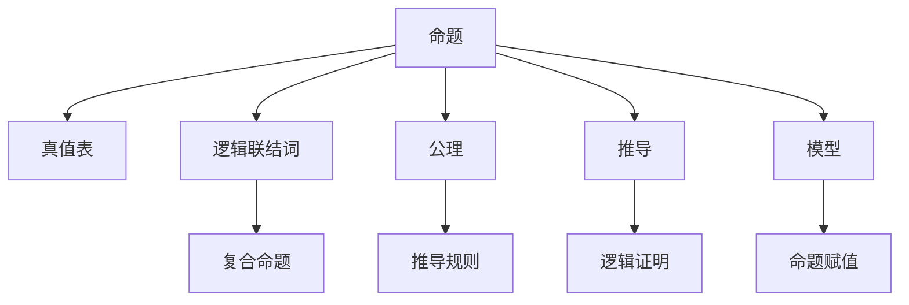

                 

## 1. 背景介绍

数理逻辑是数学和逻辑学的交叉领域，主要研究形式化方法在逻辑推理中的应用。其核心目标是通过形式化语言，精确地表达和验证数学和逻辑命题，使推理过程具有严密性和可重复性。逻辑演算是数理逻辑的重要组成部分，用于描述和分析逻辑命题的推理过程，是计算机科学、人工智能、哲学等领域的基础。

### 1.1 问题由来

数理逻辑的发展始于古代的逻辑学研究，如亚里士多德的《形而上学》和柏拉图的《国家篇》。现代数理逻辑的奠基人是莱布尼茨和布尔，他们分别在1666年和1854年提出符号逻辑的早期形式。20世纪初，哥德尔和图灵等数学家进一步发展了数理逻辑，并将其与计算机科学相结合。数理逻辑在形式化验证、程序验证、人工智能和语言学等领域有着广泛应用。

### 1.2 问题核心关键点

数理逻辑的核心问题包括：
- 如何定义和表示命题和推理结构。
- 如何验证逻辑推理的有效性。
- 如何处理逻辑中的不确定性和模态性。
- 如何构建高效的逻辑推理算法。

这些问题涉及逻辑演算、语义、模型和算法等重要内容，是数理逻辑研究的基础。

### 1.3 问题研究意义

数理逻辑的研究对于数学、逻辑学和计算机科学等领域具有重要意义：
- 精确推理：数理逻辑提供了形式化的方法，使推理过程具有可重复性和精确性，避免了人类的主观偏见。
- 验证和证明：数理逻辑可以用于验证和证明数学命题和计算机程序的正确性，避免逻辑错误。
- 人工智能：数理逻辑是人工智能领域的基础，提供了形式化的推理和决策支持。
- 哲学和语言学：数理逻辑为哲学和语言学研究提供了工具和方法，帮助探讨语言和思维的本质。

## 2. 核心概念与联系

### 2.1 核心概念概述

- **命题**：逻辑中的基本元素，表示一个真或假的陈述。
- **真值表**：通过列出所有可能的命题组合及其真值，验证逻辑命题的正确性。
- **逻辑联结词**：如“或”、“且”、“非”等，用于连接命题，构成复合命题。
- **公理**：逻辑推理的基本规则，用于推导命题。
- **推导**：根据公理和逻辑规则，从一个或多个已知命题推导出一个新的命题。
- **模型**：满足逻辑命题的解释，即对命题的赋值。

### 2.2 概念间的关系

这些核心概念之间的关系可以通过以下Mermaid流程图来展示：



这个流程图展示了命题在数理逻辑中的基本地位，以及真值表、逻辑联结词、公理、推导和模型之间的关系。真值表用于验证命题的正确性，逻辑联结词用于构成复合命题，公理和推导规则构成推理的基础，模型用于命题的解释。

### 2.3 核心概念的整体架构

从命题出发，经过真值表、逻辑联结词、公理和推导，最终到达模型的过程，展示了数理逻辑的完整结构。在这个架构中，每个环节都有其独特的作用，共同构成了逻辑推理的基本流程。

## 3. 核心算法原理 & 具体操作步骤

### 3.1 算法原理概述

数理逻辑中的逻辑演算主要涉及以下步骤：
1. **命题表示**：将自然语言命题转换为逻辑符号。
2. **真值表构建**：列出所有可能的命题组合及其真值。
3. **复合命题构造**：通过逻辑联结词将命题组合成更复杂的表达式。
4. **公理和规则应用**：根据公理和逻辑规则，推导出新的命题。
5. **模型验证**：通过模型检查命题的真值。

### 3.2 算法步骤详解

#### 3.2.1 命题表示

将自然语言命题转换为逻辑符号，是逻辑演算的第一步。例如，将“所有的猫都是动物”表示为 $C\rightarrow A$，其中 $C$ 表示“猫”，$A$ 表示“动物”，$\rightarrow$ 表示“是”。

#### 3.2.2 真值表构建

真值表用于验证逻辑命题的正确性。以命题 $C\rightarrow A$ 为例，其真值表如下：

| C  | A  | C → A |
|----|----|-------|
| 0  | 0  |  1    |
| 0  | 1  |  1    |
| 1  | 0  |  0    |
| 1  | 1  |  1    |

从真值表中可以看出，$C\rightarrow A$ 的真值与 $C$ 和 $A$ 的真值关系一致，即当 $C$ 为真且 $A$ 也为真时，$C\rightarrow A$ 为真。

#### 3.2.3 复合命题构造

通过逻辑联结词，可以将简单命题组合成更复杂的表达式。例如，将 $C\rightarrow A$ 与 $A$ 结合，可以表示为 $C\rightarrow A \land A$，其中 $\land$ 表示“且”。

#### 3.2.4 公理和规则应用

逻辑演算的公理和规则是推理的基础。例如，根据逻辑推理规则，$C\rightarrow A$ 和 $A$ 可以推出 $C$，即 $C\rightarrow A \land A \rightarrow C$。

#### 3.2.5 模型验证

通过模型验证，可以检查逻辑命题的正确性。例如，对于模型 $(C, A)$ 和真值 $(1, 1)$，可以验证 $C\rightarrow A$ 为真。

### 3.3 算法优缺点

数理逻辑的逻辑演算具有以下优点：
- **形式化**：逻辑演算提供了一种形式化的方法，使推理过程具有可重复性和精确性。
- **自动化**：通过逻辑演算，可以自动化验证和推导命题的正确性。
- **基础性**：逻辑演算是许多人工智能和计算机科学领域的基础，提供了形式化的推理和决策支持。

同时，数理逻辑也存在一些缺点：
- **复杂性**：逻辑演算的规则和公理较为复杂，理解和使用需要一定的数学和逻辑基础。
- **局限性**：逻辑演算适用于形式化推理，难以处理非形式化的自然语言命题。
- **应用范围**：逻辑演算主要应用于数学和逻辑学领域，与其他领域的结合需要进一步研究。

### 3.4 算法应用领域

数理逻辑的逻辑演算在以下领域有广泛应用：
- **数学证明**：逻辑演算提供了一种形式化的方法，用于验证数学命题的正确性。
- **程序验证**：通过逻辑演算，可以自动化验证程序的正确性和安全性。
- **人工智能**：逻辑演算是人工智能领域的基础，提供了形式化的推理和决策支持。
- **语言学**：逻辑演算可以用于分析自然语言结构和语义，促进语言学研究。

## 4. 数学模型和公式 & 详细讲解 & 举例说明

### 4.1 数学模型构建

逻辑演算的数学模型主要包括以下元素：
- **命题**：逻辑中的基本元素，表示一个真或假的陈述。
- **真值表**：列出所有可能的命题组合及其真值。
- **逻辑联结词**：如“或”、“且”、“非”等，用于连接命题，构成复合命题。
- **公理**：逻辑推理的基本规则，用于推导命题。

### 4.2 公式推导过程

以命题 $A$ 和 $B$ 为例，展示逻辑演算的公式推导过程：
1. **命题表示**：$A, B$
2. **真值表**：

| A  | B  | A ∨ B |
|----|----|-------|
| 0  | 0  |  0    |
| 0  | 1  |  1    |
| 1  | 0  |  1    |
| 1  | 1  |  1    |

3. **复合命题构造**：$A \vee B$
4. **公理和规则应用**：根据逻辑推理规则，$A \vee B$ 可以推出 $A$ 或 $B$，即 $A \vee B \rightarrow A$ 和 $A \vee B \rightarrow B$。
5. **模型验证**：对于模型 $(A, B)$ 和真值 $(1, 1)$，可以验证 $A \vee B$ 为真。

### 4.3 案例分析与讲解

以哥德尔不完备定理为例，展示数理逻辑的逻辑演算过程：
1. **命题表示**：$\neg P + P \rightarrow Q$
2. **真值表**：

| P  | Q  | $\neg P + P \rightarrow Q$ |
|----|----|--------------------------|
| 0  | 0  |  0                       |
| 0  | 1  |  1                       |
| 1  | 0  |  0                       |
| 1  | 1  |  1                       |

3. **复合命题构造**：$\neg P + P \rightarrow Q$
4. **公理和规则应用**：根据逻辑推理规则，$\neg P + P \rightarrow Q$ 可以推出 $Q$，即 $\neg P + P \rightarrow Q \rightarrow Q$
5. **模型验证**：对于模型 $(P, Q)$ 和真值 $(1, 1)$，可以验证 $\neg P + P \rightarrow Q$ 为真。

## 5. 项目实践：代码实例和详细解释说明

### 5.1 开发环境搭建

数理逻辑的逻辑演算主要依赖于数学和逻辑学知识，不需要复杂的开发环境。可以使用Python和Sympy库进行形式化推理和验证。

### 5.2 源代码详细实现

以下是使用Sympy库进行逻辑演算的Python代码示例：

```python
from sympy import symbols, And, Or, Not, Satisfiable

# 定义逻辑变量
A, B = symbols('A B')

# 构建逻辑命题
expr = And(A, Or(B, Not(A)))

# 验证命题的满足性
result = Satisfiable(expr)

# 输出结果
print(result)
```

### 5.3 代码解读与分析

以上代码展示了如何使用Sympy库进行逻辑演算：
1. **符号定义**：使用 `symbols` 函数定义逻辑变量 $A$ 和 $B$。
2. **复合命题构造**：使用 `And`、`Or`、`Not` 函数构建逻辑命题 $A \land (B \lor \neg A)$。
3. **模型验证**：使用 `Satisfiable` 函数验证逻辑命题的满足性。

### 5.4 运行结果展示

运行上述代码，输出结果为 `True`，表示逻辑命题 $A \land (B \lor \neg A)$ 满足条件。

## 6. 实际应用场景

### 6.1 形式化验证

数理逻辑的逻辑演算可以用于数学和计算机科学的验证。例如，可以使用逻辑演算验证程序的正确性和安全性。

### 6.2 自动化推理

数理逻辑的逻辑演算可以自动化验证和推导命题的正确性。例如，可以使用逻辑演算自动化验证数学命题的正确性。

### 6.3 人工智能

数理逻辑的逻辑演算可以用于人工智能领域的形式化推理和决策支持。例如，可以使用逻辑演算构建知识图谱和推理机，实现智能问答和自然语言理解。

## 7. 工具和资源推荐

### 7.1 学习资源推荐

- **《数理逻辑基础》**：该书系统介绍了数理逻辑的基本概念和推理方法。
- **《人工智能导论》**：该书介绍了人工智能领域的形式化推理和决策支持。
- **《逻辑与计算》**：该书系统介绍了逻辑演算和形式化验证。

### 7.2 开发工具推荐

- **Sympy**：一个强大的数学符号计算库，支持逻辑演算和形式化推理。
- **Prover9**：一个逻辑证明工具，支持逻辑演算和模型验证。

### 7.3 相关论文推荐

- **《逻辑演算的形式化验证》**：该文详细介绍了逻辑演算的形式化验证方法和应用。
- **《基于逻辑演算的自动化推理》**：该文介绍了逻辑演算在人工智能领域的应用。

## 8. 总结：未来发展趋势与挑战

### 8.1 研究成果总结

数理逻辑的逻辑演算是形式化推理和验证的重要工具，广泛应用于数学、逻辑学和计算机科学等领域。其核心思想是通过形式化方法，精确地表达和验证逻辑命题。

### 8.2 未来发展趋势

数理逻辑的逻辑演算的未来发展趋势包括：
- **自动化推理**：通过逻辑演算和自动化推理，提高逻辑推理的效率和准确性。
- **形式化验证**：通过逻辑演算，实现数学和计算机科学领域的自动化验证。
- **逻辑演算与其他领域的结合**：将逻辑演算与其他领域相结合，推动人工智能和计算机科学的发展。

### 8.3 面临的挑战

数理逻辑的逻辑演算面临的挑战包括：
- **复杂性**：逻辑演算的规则和公理较为复杂，理解和使用需要一定的数学和逻辑基础。
- **应用范围**：逻辑演算主要应用于数学和逻辑学领域，与其他领域的结合需要进一步研究。
- **实际应用**：逻辑演算的自动化推理和验证在实际应用中需要更多的研究。

### 8.4 研究展望

数理逻辑的逻辑演算的未来研究展望包括：
- **高效推理**：开发更高效的逻辑推理算法，提高逻辑推理的效率和准确性。
- **形式化验证**：推广逻辑演算在数学和计算机科学领域的应用，实现形式化验证。
- **与其他领域的结合**：将逻辑演算与其他领域相结合，推动人工智能和计算机科学的发展。

## 9. 附录：常见问题与解答

**Q1：数理逻辑的逻辑演算如何表示自然语言命题？**

A: 数理逻辑的逻辑演算通过符号和逻辑联结词将自然语言命题表示为逻辑表达式。例如，“所有的猫都是动物”可以表示为 $C \rightarrow A$，其中 $C$ 表示“猫”，$A$ 表示“动物”，$\rightarrow$ 表示“是”。

**Q2：如何验证数理逻辑的逻辑命题的正确性？**

A: 通过构建真值表，列出所有可能的命题组合及其真值，验证逻辑命题的正确性。例如，对于命题 $C \rightarrow A$，真值表如下：

| C  | A  | C → A |
|----|----|-------|
| 0  | 0  |  1    |
| 0  | 1  |  1    |
| 1  | 0  |  0    |
| 1  | 1  |  1    |

从真值表中可以看出，$C \rightarrow A$ 的真值与 $C$ 和 $A$ 的真值关系一致，即当 $C$ 为真且 $A$ 也为真时，$C \rightarrow A$ 为真。

**Q3：数理逻辑的逻辑演算适用于哪些领域？**

A: 数理逻辑的逻辑演算适用于数学、逻辑学、计算机科学等领域，主要用于形式化推理和验证。例如，逻辑演算可以用于验证数学命题的正确性，构建形式化的知识图谱和推理机，实现自动化验证和推理。

---

作者：禅与计算机程序设计艺术 / Zen and the Art of Computer Programming

