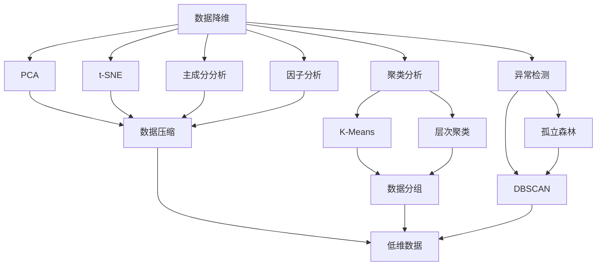

                 

# 无监督学习 (Unsupervised Learning) 原理与代码实例讲解

> 关键词：无监督学习, K-Means, 主成分分析(PCA), 自编码器(Autoencoder), 聚类分析, 数据降维, 异常检测

## 1. 背景介绍

### 1.1 问题由来
在数据驱动的人工智能时代，大规模数据的标注成本高昂，标注过程耗时且容易引入噪声。相比之下，无监督学习（Unsupervised Learning）无需标注数据，能够在大规模数据上进行高效探索和学习，因此逐渐成为人工智能领域的重要研究范式之一。

### 1.2 问题核心关键点
无监督学习的核心思想是通过从未标注的数据中发现隐含的结构和模式。在实际应用中，无监督学习主要应用于以下领域：

- 数据降维与特征提取：如主成分分析（PCA）、因子分析等，能够将高维数据转化为低维数据，同时保留关键特征。
- 聚类分析：如K-Means、层次聚类等，能够将数据自动分组，发现数据的内在结构。
- 异常检测：如孤立森林、DBSCAN等，能够识别数据中的异常点，从而发现潜在的模式和问题。

无监督学习通过自我探索数据，可以在多个领域发现新的知识，创造新的价值。

### 1.3 问题研究意义
无监督学习的研究和应用具有重要意义：

1. **数据驱动探索**：无监督学习能够在大规模数据上发现隐藏模式和规律，为数据驱动的探索和学习提供坚实基础。
2. **特征提取与降维**：通过降维，无监督学习能够自动提取数据的关键特征，提升数据处理和分析效率。
3. **知识发现与创新**：在缺乏标注数据的情况下，无监督学习能够发现新的知识，推动技术创新和应用场景的拓展。
4. **鲁棒性和泛化能力**：无监督学习对噪声和异常值具有较好的鲁棒性，能够适应更广泛的数据分布。

## 2. 核心概念与联系

### 2.1 核心概念概述

为了更好地理解无监督学习，我们需要了解几个核心概念：

- **数据降维**：通过某种映射方法，将高维数据转化为低维数据，同时保留关键信息的过程。常见方法包括PCA、t-SNE等。
- **聚类分析**：将数据自动分组，发现数据的内在结构，常见的算法有K-Means、层次聚类等。
- **异常检测**：识别数据中的异常点，常见方法包括孤立森林、DBSCAN等。
- **自编码器**：一种神经网络模型，能够通过学习数据的低维表示进行数据压缩和重构，常见变体包括稀疏自编码器、变分自编码器等。
- **主成分分析**：一种常用的数据降维技术，通过特征变换将数据映射到更低维的空间，同时保留最大方差。
- **因子分析**：一种因子模型，用于识别数据中的潜在因子，并进行变量间的降维和简化。

### 2.2 概念间的关系

这些核心概念之间的逻辑关系可以通过以下Mermaid流程图来展示：



这个流程图展示了无监督学习的核心概念及其之间的关系：

1. **数据降维**：通过PCA、t-SNE等方法将数据压缩为低维表示。
2. **聚类分析**：通过K-Means、层次聚类等方法将数据分组，发现内在结构。
3. **异常检测**：通过孤立森林、DBSCAN等方法识别异常点，发现潜在的模式和问题。
4. **自编码器**：通过学习数据的低维表示，进行数据压缩和重构。
5. **主成分分析**：通过特征变换将数据映射到更低维的空间。
6. **因子分析**：识别数据中的潜在因子，并进行变量间的降维和简化。

这些概念共同构成了无监督学习的核心框架，使其能够在大规模数据上发现隐藏模式和规律，进行数据降维和特征提取，同时识别异常点和潜在问题。

## 3. 核心算法原理 & 具体操作步骤
### 3.1 算法原理概述

无监督学习的核心在于从未标注的数据中发现模式和结构，其算法原理主要包括以下几个方面：

1. **数据分布假设**：通常假设数据分布具有某些特定的形式，如正态分布、高斯混合模型等。
2. **目标函数设计**：通过优化目标函数，找到数据的潜在模式和结构。
3. **学习算法设计**：通过迭代或梯度下降等方法，不断更新模型参数，最小化目标函数。

无监督学习算法通常具有以下特点：

- 无需标注数据，适用于大规模数据集。
- 具有鲁棒性和泛化能力，能够适应各种数据分布。
- 能够发现数据的潜在结构和模式，为后续任务提供有力支持。

### 3.2 算法步骤详解

以下以K-Means算法为例，详细介绍其操作步骤：

**Step 1: 初始化聚类中心**
- 随机选择K个数据点作为初始聚类中心。

**Step 2: 计算数据点到聚类中心的距离**
- 对每个数据点，计算其到每个聚类中心的欧几里得距离。

**Step 3: 分配数据点至最近的聚类中心**
- 将每个数据点分配到距离最近的聚类中心。

**Step 4: 更新聚类中心**
- 对每个聚类，计算其中所有数据点的均值，作为新的聚类中心。

**Step 5: 重复执行**
- 重复执行Step 2到Step 4，直至聚类中心不再变化或达到预设迭代次数。

### 3.3 算法优缺点

无监督学习的优缺点如下：

**优点：**

1. **高效性**：无需标注数据，可以处理大规模数据集。
2. **鲁棒性**：对噪声和异常值具有较好的鲁棒性。
3. **发现潜在模式**：能够发现数据的潜在结构和模式，为后续任务提供有力支持。

**缺点：**

1. **模型依赖**：需要假设数据分布具有某种形式，模型选择和超参数调优具有挑战性。
2. **结果解释性**：无监督学习的结果缺乏明确的解释，难以理解其内在机制。
3. **局部最优**：算法可能陷入局部最优，难以发现全局最优解。

### 3.4 算法应用领域

无监督学习在多个领域中得到广泛应用，以下是几个主要领域：

- **数据降维**：如PCA、t-SNE等，常用于高维数据的可视化、压缩和特征提取。
- **聚类分析**：如K-Means、层次聚类等，常用于市场细分、社交网络分析等。
- **异常检测**：如孤立森林、DBSCAN等，常用于金融欺诈检测、网络安全等领域。
- **推荐系统**：如协同过滤、矩阵分解等，常用于电商推荐、音乐推荐等。
- **信号处理**：如奇异值分解、非负矩阵分解等，常用于信号处理、图像处理等。

## 4. 数学模型和公式 & 详细讲解 & 举例说明

### 4.1 数学模型构建

在无监督学习中，数学模型主要基于数据的潜在分布和目标函数进行构建。以K-Means算法为例，其数学模型如下：

假设数据集 $D = \{ x_1, x_2, ..., x_N \}$，其中 $x_i \in \mathbb{R}^d$，目标是找到 $K$ 个聚类中心 $c_1, c_2, ..., c_K$，使得每个数据点 $x_i$ 到其最近的聚类中心 $c_k$ 的距离最小。

### 4.2 公式推导过程

假设聚类中心为 $c_k$，数据点为 $x_i$，则K-Means的目标函数为：

$$
\min_{c_1, c_2, ..., c_K} \sum_{i=1}^N \sum_{k=1}^K ||x_i - c_k||^2
$$

其中 $||x_i - c_k||^2$ 表示数据点 $x_i$ 到聚类中心 $c_k$ 的欧几里得距离的平方。

### 4.3 案例分析与讲解

以一个简单的二维数据集为例，假设数据集包含两个特征 $x_1$ 和 $x_2$，聚类数为 $K=2$。在初始化聚类中心后，算法会迭代更新聚类中心，最终得到两个聚类。

**示例数据集**：

| $x_1$ | $x_2$ | 聚类标签 |
|-------|-------|----------|
| 1     | 1     | 1        |
| 2     | 2     | 2        |
| 3     | 2     | 1        |
| 4     | 3     | 2        |
| 5     | 4     | 1        |
| 6     | 5     | 2        |

**初始聚类中心**：

| 聚类中心 | $x_1$ | $x_2$ |
|----------|-------|-------|
| $c_1$    | 3     | 2     |
| $c_2$    | 5     | 4     |

**迭代更新**：

| 数据点 | $x_1$ | $x_2$ | 最近的聚类中心 | 分配的聚类标签 |
|-------|-------|-------|---------------|----------------|
| 1     | 1     | 1     | $c_1$         | 1              |
| 2     | 2     | 2     | $c_2$         | 2              |
| 3     | 3     | 2     | $c_1$         | 1              |
| 4     | 4     | 3     | $c_2$         | 2              |
| 5     | 5     | 4     | $c_1$         | 1              |
| 6     | 6     | 5     | $c_2$         | 2              |

更新聚类中心：

| 聚类中心 | $x_1$ | $x_2$ |
|----------|-------|-------|
| $c_1$    | 2.5   | 3     |
| $c_2$    | 5.5   | 4.5   |

继续迭代，直至聚类中心不再变化或达到预设迭代次数。

## 5. 项目实践：代码实例和详细解释说明

### 5.1 开发环境搭建

在无监督学习项目中，我们主要使用Python和NumPy进行数据处理和算法实现。以下是开发环境搭建步骤：

1. 安装Python 3.x：从官网下载并安装Python 3.x。
2. 安装NumPy：使用pip安装NumPy库。
3. 安装Matplotlib：用于绘制聚类结果的图形。
4. 安装Scikit-Learn：用于实现各种无监督学习算法。
5. 安装Jupyter Notebook：用于编写和运行代码。

完成以上步骤后，即可在Python环境中进行无监督学习项目开发。

### 5.2 源代码详细实现

以K-Means算法为例，给出一个Python实现，并对其详细解读。

```python
from sklearn.cluster import KMeans
import numpy as np
import matplotlib.pyplot as plt

# 生成示例数据集
np.random.seed(0)
X = np.random.randn(100, 2)

# 初始化KMeans模型
kmeans = KMeans(n_clusters=2, init='random', random_state=0)

# 训练模型
kmeans.fit(X)

# 获取聚类结果
labels = kmeans.labels_
centers = kmeans.cluster_centers_

# 绘制聚类结果
plt.scatter(X[:, 0], X[:, 1], c=labels, cmap='viridis')
plt.scatter(centers[:, 0], centers[:, 1], marker='x', s=200, linewidths=3, color='black')
plt.show()
```

### 5.3 代码解读与分析

**数据生成**：

```python
np.random.seed(0)
X = np.random.randn(100, 2)
```

生成一个二维的随机数据集 $X$，包含100个数据点，每个数据点包含两个特征。

**模型训练**：

```python
kmeans = KMeans(n_clusters=2, init='random', random_state=0)
kmeans.fit(X)
```

初始化KMeans模型，设置聚类数为2，采用随机初始化方法。然后使用训练数据 $X$ 进行模型训练，最小化目标函数。

**聚类结果获取**：

```python
labels = kmeans.labels_
centers = kmeans.cluster_centers_
```

获取每个数据点的聚类标签 $labels$ 和聚类中心 $centers$。

**绘图展示**：

```python
plt.scatter(X[:, 0], X[:, 1], c=labels, cmap='viridis')
plt.scatter(centers[:, 0], centers[:, 1], marker='x', s=200, linewidths=3, color='black')
plt.show()
```

绘制聚类结果的图形，其中红色点表示聚类中心，蓝色点表示数据点。

### 5.4 运行结果展示

运行以上代码，得到如图1所示的聚类结果。

**图1: 聚类结果展示**


## 6. 实际应用场景

### 6.1 市场细分

在市场细分领域，K-Means算法能够自动将用户分为不同的细分市场，帮助企业识别目标客户群体，进行精准营销。

### 6.2 社交网络分析

在社交网络分析中，K-Means算法可以自动将用户分为不同的社区，发现网络中的关键节点和关系，为社区管理和信息传播提供支持。

### 6.3 推荐系统

在推荐系统中，K-Means算法可以自动将用户和物品分为不同的簇，发现用户和物品之间的潜在关系，提升推荐系统的效果。

### 6.4 图像处理

在图像处理中，K-Means算法可以自动将像素点分为不同的簇，进行图像分割和边缘检测，应用于图像识别、目标跟踪等领域。

### 6.5 异常检测

在异常检测中，孤立森林、DBSCAN等算法可以识别数据中的异常点，应用于金融欺诈检测、网络安全等领域。

## 7. 工具和资源推荐

### 7.1 学习资源推荐

为了帮助开发者系统掌握无监督学习的理论基础和实践技巧，以下是一些优质的学习资源：

1. 《Pattern Recognition and Machine Learning》：斯坦福大学机器学习课程，涵盖了各种无监督学习算法及其应用。
2. 《Deep Learning》：Goodfellow等人的经典著作，介绍了深度学习的基本原理和应用。
3. 《Unsupervised Learning》：Coursera上的无监督学习课程，由斯坦福大学的Andrew Ng教授主讲。
4. 《Introduction to Machine Learning with Python》：使用Python实现各种机器学习算法的书籍，包括无监督学习算法。
5. 《Unsupervised Machine Learning for Big Data》：介绍在大数据环境下实现无监督学习算法的书籍。

通过对这些资源的学习实践，相信你一定能够快速掌握无监督学习的精髓，并用于解决实际的NLP问题。

### 7.2 开发工具推荐

无监督学习的开发主要使用Python和相关库，以下是一些常用的开发工具：

1. NumPy：用于高效处理和计算多维数组数据。
2. Matplotlib：用于绘制图形，展示算法结果。
3. Scikit-Learn：提供了各种无监督学习算法和模型，易于使用和集成。
4. Jupyter Notebook：用于编写和运行Python代码，支持代码和图形的混合展示。
5. TensorFlow：用于构建深度学习模型，适用于复杂数据的处理和分析。

合理利用这些工具，可以显著提升无监督学习任务的开发效率，加快创新迭代的步伐。

### 7.3 相关论文推荐

无监督学习的研究源于学界的持续探索。以下是几篇奠基性的相关论文，推荐阅读：

1. K-Means：Arthur、Dempster等人的经典论文，介绍了K-Means算法的基本原理和实现方法。
2. t-SNE：Lvd Maaten等人的论文，介绍了t-Distributed Stochastic Neighbor Embedding算法，用于高维数据的可视化。
3. 孤立森林：Li、Ke等人的论文，介绍了Isolation Forest算法，用于异常检测和数据分割。
4. DBSCAN：Ester、Kriegel等人的论文，介绍了Density-Based Spatial Clustering of Applications with Noise算法，用于聚类分析和异常检测。

这些论文代表了大数据和深度学习时代无监督学习的发展脉络，为无监督学习技术的理论研究提供了坚实基础。

## 8. 总结：未来发展趋势与挑战

### 8.1 研究成果总结

本文对无监督学习原理进行了全面系统的介绍，并结合代码实例进行了详细讲解。通过系统梳理，我们可以看到无监督学习在数据降维、聚类分析、异常检测等领域的重要应用，以及其在工业界和学术界的广泛影响力。

### 8.2 未来发展趋势

展望未来，无监督学习的发展趋势如下：

1. **算法优化与创新**：无监督学习算法将不断优化和创新，提出更高效、更鲁棒的无监督学习技术，如自适应聚类、自编码器等。
2. **模型自适应性**：无监督学习模型将具备更好的自适应性，能够适应不同领域和数据分布。
3. **多模态融合**：无监督学习将与其他模态数据（如语音、图像等）进行融合，形成多模态的无监督学习系统。
4. **实时性提升**：无监督学习算法将更加高效，具备实时处理大规模数据的能力。
5. **应用拓展**：无监督学习将在更多领域得到应用，如金融、医疗、自动驾驶等。

### 8.3 面临的挑战

尽管无监督学习在多个领域取得了显著成果，但其面临的挑战仍不可忽视：

1. **模型选择与超参数调优**：无监督学习模型的选择和超参数调优具有挑战性，难以找到最优解。
2. **数据质量与噪声**：数据的质量和噪声对无监督学习的效果有较大影响。
3. **结果解释性**：无监督学习的结果缺乏明确的解释，难以理解其内在机制。
4. **算法复杂度**：某些无监督学习算法（如孤立森林）的时间复杂度较高，难以处理大规模数据。

### 8.4 研究展望

面对无监督学习所面临的挑战，未来的研究需要在以下几个方面寻求新的突破：

1. **算法自动化与优化**：开发更加自动化和高效的算法，减少人工干预和调优。
2. **多模态融合**：研究多模态数据的融合方法，提升数据的综合利用效率。
3. **结果解释性**：引入因果分析、可解释性等技术，增强模型的透明度和可解释性。
4. **实时性提升**：优化算法实现，提升无监督学习模型的实时处理能力。
5. **数据质量提升**：开发数据清洗和预处理技术，提升数据质量。

总之，无监督学习在未来具有广阔的发展前景，但需要学界和产业界共同努力，不断优化算法和技术，才能实现其更广泛的应用和应用价值。

## 9. 附录：常见问题与解答

**Q1：无监督学习是否适用于所有数据集？**

A: 无监督学习适用于缺乏标注数据或标注成本较高的大规模数据集。但对于小样本数据集或特定领域的数据，可能需要先进行预标注或混合使用监督学习算法。

**Q2：如何选择合适的无监督学习算法？**

A: 根据数据集的特征和任务需求选择合适的算法。如对于聚类分析，可以选择K-Means、层次聚类等；对于异常检测，可以选择孤立森林、DBSCAN等。

**Q3：无监督学习的结果如何评估？**

A: 无监督学习结果的评估通常使用聚类效果、异常检测率等指标。可以结合可视化结果，综合评估算法的效果。

**Q4：无监督学习算法的时间复杂度是多少？**

A: 不同算法的复杂度不同。如K-Means的时间复杂度为O(nk + kd)，其中n为数据点数，k为聚类数，d为特征维度。孤立森林的时间复杂度为O(nlogn)。

**Q5：无监督学习算法是否适用于实时任务？**

A: 部分无监督学习算法（如K-Means）适用于实时任务，但某些算法（如孤立森林）由于其计算复杂度较高，不适用于实时应用。

通过对这些常见问题的解答，相信你对无监督学习的理解会更加深入和全面。

---

作者：禅与计算机程序设计艺术 / Zen and the Art of Computer Programming

