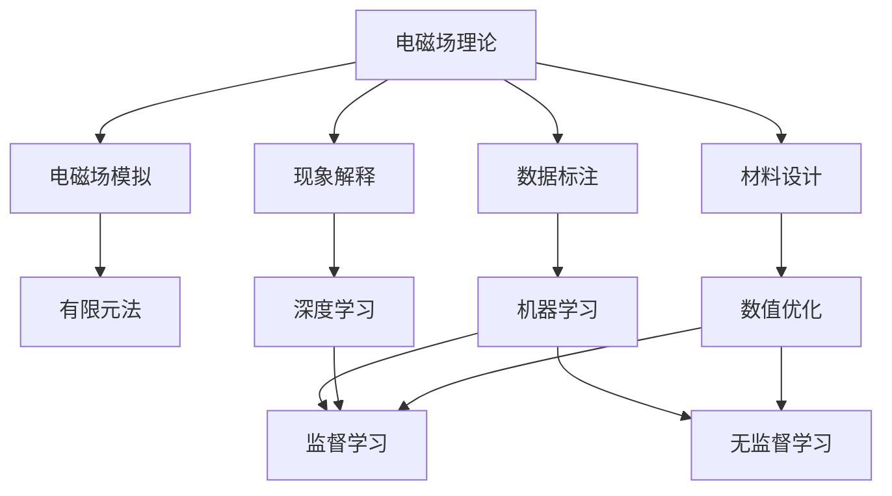
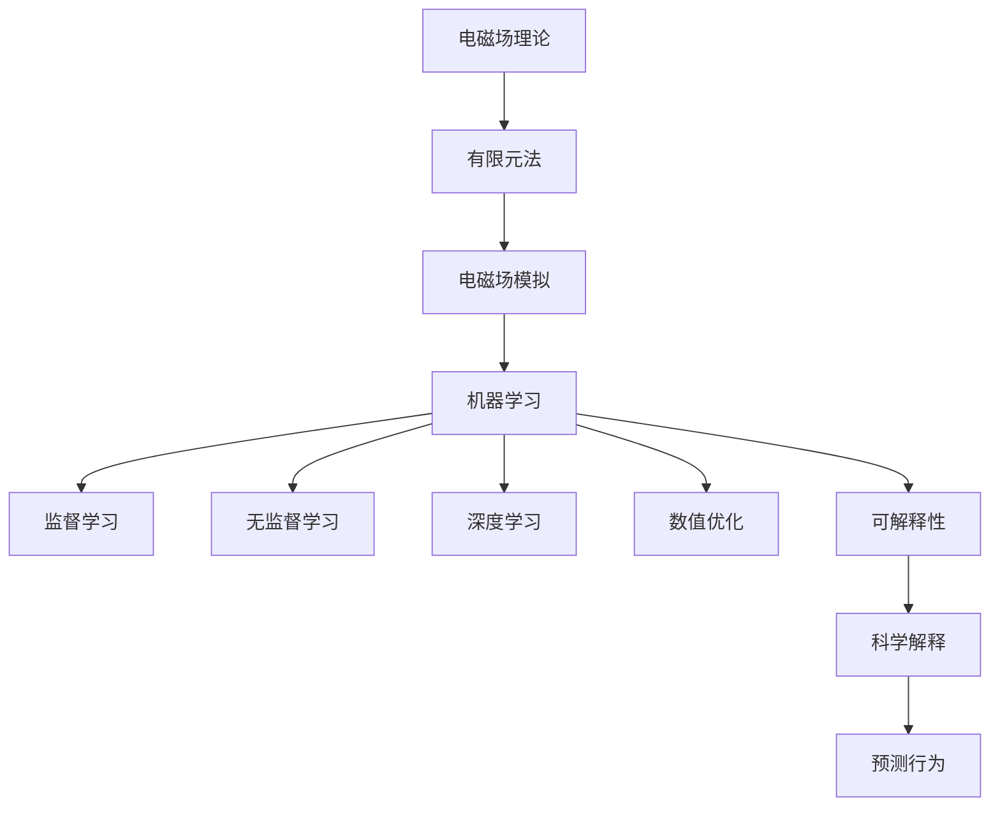

                 

## 1. 背景介绍

电磁场理论，作为现代物理学和工程学的核心之一，在理解和控制电磁现象方面发挥了重要作用。近年来，随着人工智能（AI）技术的飞速发展，电磁场理论的应用领域被进一步扩展到AI for Science（人工智能在科学研究中的应用）中，揭示了新的可能性。

### 1.1 问题由来
电磁场理论与AI的结合，源于两个领域的共同目标——利用数据驱动的方法，从复杂的物理现象中提取规律和洞察。在科学研究中，常常面临高维、非线性、复杂动态系统的问题，而电磁场理论提供了对电磁现象物理本质的深刻理解，可以作为AI模型输入的特征。

### 1.2 问题核心关键点
电磁场理论在AI for Science中的应用，主要集中在以下几个方面：

1. **数据驱动的电磁场模拟**：通过机器学习模型预测电磁场分布，提高模拟效率和精度。
2. **电磁场数据的自动标注**：利用AI技术自动标注电磁场数据，降低标注成本。
3. **复杂电磁现象的解释与预测**：结合AI模型的可解释性，解释复杂电磁现象的机理，并预测未来的行为。
4. **电磁材料设计的优化**：利用AI优化电磁材料设计，提升材料的性能和制造效率。

### 1.3 问题研究意义
电磁场理论与AI的结合，为科学研究提供了新的工具和方法，推动了多个领域的进步，如电磁波传播、材料科学、生物医学等。在电磁场模拟、数据标注、现象解释和材料设计等方面，AI技术的引入，有助于解决传统方法难以应对的问题，加速科学研究的进程。

## 2. 核心概念与联系

### 2.1 核心概念概述

电磁场理论作为研究电磁现象的基础，主要涉及以下概念：

- **电磁场**：描述电磁现象的物理量，包括电场和磁场。
- **麦克斯韦方程组**：描述电磁场的演化，包括法拉第电磁感应定律、安培环路定律、高斯定律、高斯-欧姆定律。
- **电磁波**：传播在空间中的电磁场，包括电磁波的传播速度、波长、频率等。
- **电磁材料**：具有特殊电磁特性的材料，如铁磁材料、超导材料、等离子体材料等。
- **电磁仿真**：使用数值方法模拟电磁现象的过程，如有限元法、时域有限差分法。

AI for Science的核心概念则包括：

- **数据驱动的模型**：通过数据学习模型，而不是手工定义规则。
- **机器学习**：使用算法让机器从数据中学习，包括监督学习、无监督学习、强化学习等。
- **深度学习**：一种特殊的机器学习方法，通过多层神经网络进行复杂特征的提取。
- **可解释性**：理解AI模型做出决策的依据，有助于科学解释和验证。

### 2.2 概念间的关系

电磁场理论与AI for Science的概念可以通过以下Mermaid流程图来展示：



这个流程图展示了电磁场理论与AI for Science之间的联系：

1. 电磁场理论用于指导电磁场模拟、数据标注、现象解释和材料设计等应用。
2. AI为电磁场数据提供了强大的处理和分析能力。
3. 机器学习和深度学习模型在处理复杂数据时，能揭示电磁现象中的规律。
4. 数值优化方法在电磁材料设计中发挥了重要作用。
5. 监督学习和无监督学习分别用于标注数据和理解复杂现象。

### 2.3 核心概念的整体架构

最终，我们可以用以下综合的流程图来展示电磁场理论与AI for Science的整体架构：



这个综合流程图展示了从电磁场理论到实际应用的全流程，包括有限元法、电磁场模拟、机器学习、监督学习和无监督学习、深度学习、数值优化以及科学解释和预测。通过这个架构，我们可以更好地理解电磁场理论与AI for Science的结合。

## 3. 核心算法原理 & 具体操作步骤
### 3.1 算法原理概述

电磁场理论在AI for Science中的应用，主要通过机器学习模型对电磁场数据进行学习和预测。电磁场数据可以通过传感器、仿真软件、实验数据等方式获得。

形式化地，假设我们有电磁场数据集 $\{(\mathbf{x}_i, \mathbf{y}_i)\}_{i=1}^N$，其中 $\mathbf{x}_i$ 表示电磁场特征向量，$\mathbf{y}_i$ 表示目标变量（如材料的电磁响应）。我们的目标是通过机器学习模型，学习电磁场数据与目标变量之间的映射关系。

### 3.2 算法步骤详解

电磁场理论在AI for Science中的应用步骤如下：

**Step 1: 数据收集与预处理**
- 收集电磁场数据，并将其转换为模型输入所需的形式。
- 对数据进行标准化、归一化等预处理操作，以便模型更好地学习。

**Step 2: 模型选择与训练**
- 选择合适的机器学习模型，如支持向量机、随机森林、神经网络等。
- 将预处理后的数据集分为训练集和验证集，使用训练集对模型进行训练，并使用验证集评估模型性能。
- 根据验证集的表现，调整模型超参数，如学习率、正则化强度等，以优化模型性能。

**Step 3: 模型评估与验证**
- 在测试集上对模型进行评估，使用准确率、召回率、F1分数等指标衡量模型性能。
- 对模型进行验证，确保其在未知数据上的泛化能力。

**Step 4: 模型应用与优化**
- 将训练好的模型应用于实际问题中，进行电磁场预测、材料设计、现象解释等任务。
- 根据应用结果，对模型进行优化，如引入更多的物理特征、使用更复杂的模型结构等。

### 3.3 算法优缺点

电磁场理论在AI for Science中的应用具有以下优点：

1. **数据驱动**：利用大量的电磁场数据进行模型训练，能提高模型的泛化能力。
2. **高效预测**：机器学习模型可以快速进行电磁场预测，缩短实验周期。
3. **多模态融合**：结合传感器数据、仿真数据、实验数据等多种模态数据，提高预测准确性。
4. **可解释性**：通过可解释性方法，可以理解模型预测的物理基础，有助于科学解释。

但同时也存在以下缺点：

1. **数据稀缺**：高质量的电磁场数据获取难度大，尤其是实时数据。
2. **模型复杂度**：复杂的电磁现象可能难以用单一模型准确描述。
3. **计算成本**：训练复杂的机器学习模型需要大量计算资源，特别是深度学习模型。
4. **物理约束**：机器学习模型的预测结果需要满足物理定律，如麦克斯韦方程组。

### 3.4 算法应用领域

电磁场理论与AI for Science的结合，已经在多个领域得到应用：

- **电磁波传播**：使用AI预测电磁波在复杂结构中的传播行为，如微波通信、雷达技术等。
- **材料设计**：使用AI优化电磁材料的设计，如超导材料、铁磁材料等。
- **生物医学**：利用AI进行电磁场的生物效应模拟，研究电磁治疗、医学成像等。
- **能源**：使用AI优化电磁场的设计，如电磁驱动、电磁输电等。

除了上述领域，电磁场理论在AI for Science中的应用还涉及地球物理、天文学、交通运输等多个领域。

## 4. 数学模型和公式 & 详细讲解  
### 4.1 数学模型构建

在电磁场理论与AI for Science的结合中，我们通常使用机器学习模型来预测电磁场数据。假设我们有一个线性回归模型 $f(x) = \mathbf{W}^T \mathbf{x} + b$，其中 $\mathbf{W}$ 和 $b$ 为模型的可学习参数。

### 4.2 公式推导过程

以线性回归模型为例，假设我们有 $N$ 个电磁场数据点 $(\mathbf{x}_i, \mathbf{y}_i)$，目标是最小化损失函数：

$$
\mathcal{L} = \frac{1}{2} \sum_{i=1}^N (\mathbf{y}_i - f(\mathbf{x}_i))^2
$$

利用梯度下降算法，求解参数 $\mathbf{W}$ 和 $b$：

$$
\mathbf{W} = \mathbf{(X^TX)^{-1}X^TY}
$$

$$
b = \mathbf{Y} - \mathbf{XW}
$$

其中 $\mathbf{X}$ 为电磁场特征矩阵，$\mathbf{Y}$ 为目标变量矩阵。

### 4.3 案例分析与讲解

假设我们要预测电磁波在复杂结构中的传播路径。我们收集到结构各向异性的电磁场数据，并对其进行预处理。选择神经网络模型进行训练，使用交叉熵损失函数。在训练过程中，对模型进行正则化，避免过拟合。最终，我们得到训练好的神经网络模型，将其应用于新的电磁波传播问题，预测传播路径。

## 5. 项目实践：代码实例和详细解释说明
### 5.1 开发环境搭建

在进行电磁场理论在AI for Science中的应用实践前，我们需要准备好开发环境。以下是使用Python进行TensorFlow开发的环境配置流程：

1. 安装Anaconda：从官网下载并安装Anaconda，用于创建独立的Python环境。

2. 创建并激活虚拟环境：
```bash
conda create -n tf-env python=3.8 
conda activate tf-env
```

3. 安装TensorFlow：根据CUDA版本，从官网获取对应的安装命令。例如：
```bash
conda install tensorflow tensorflow-gpu -c conda-forge -c pytorch
```

4. 安装PyTorch和相关工具包：
```bash
pip install torch numpy matplotlib scikit-learn jupyter notebook ipython
```

5. 安装HDF5库：
```bash
pip install h5py
```

完成上述步骤后，即可在`tf-env`环境中开始电磁场理论在AI for Science的应用实践。

### 5.2 源代码详细实现

下面我们以电磁波传播预测为例，给出使用TensorFlow进行线性回归的PyTorch代码实现。

首先，定义电磁场数据集：

```python
import numpy as np
import h5py
import tensorflow as tf
from tensorflow.keras import layers

# 加载电磁场数据
data = h5py.File('em_field_data.h5', 'r')
x_train = data['x_train'][:]
y_train = data['y_train'][:]
x_test = data['x_test'][:]
y_test = data['y_test'][:]

# 将数据转换为TensorFlow格式
x_train = tf.convert_to_tensor(x_train, dtype=tf.float32)
x_test = tf.convert_to_tensor(x_test, dtype=tf.float32)
y_train = tf.convert_to_tensor(y_train, dtype=tf.float32)
y_test = tf.convert_to_tensor(y_test, dtype=tf.float32)
```

然后，定义线性回归模型：

```python
# 定义线性回归模型
model = tf.keras.Sequential([
    layers.Dense(10, activation='relu', input_shape=(x_train.shape[1],)),
    layers.Dense(1)
])
```

接着，定义损失函数和优化器：

```python
# 定义损失函数和优化器
loss_fn = tf.keras.losses.MeanSquaredError()
optimizer = tf.keras.optimizers.Adam(learning_rate=0.001)
```

最后，定义训练和评估函数：

```python
# 定义训练函数
def train_step(x, y):
    with tf.GradientTape() as tape:
        logits = model(x)
        loss = loss_fn(y, logits)
    gradients = tape.gradient(loss, model.trainable_variables)
    optimizer.apply_gradients(zip(gradients, model.trainable_variables))

# 定义评估函数
def evaluate_step(x, y):
    logits = model(x)
    mse = loss_fn(y, logits)
    return mse.numpy()

# 训练模型
epochs = 100
batch_size = 32

for epoch in range(epochs):
    for i in range(0, len(x_train), batch_size):
        batch_x = x_train[i:i+batch_size]
        batch_y = y_train[i:i+batch_size]
        train_step(batch_x, batch_y)
    # 在测试集上评估模型
    test_loss = tf.reduce_mean(evaluate_step(x_test, y_test))
    print(f'Epoch {epoch+1}, test loss: {test_loss.numpy()}')
```

以上就是使用TensorFlow对电磁波传播预测进行线性回归的完整代码实现。可以看到，得益于TensorFlow的强大封装，我们可以用相对简洁的代码完成模型的训练和评估。

### 5.3 代码解读与分析

让我们再详细解读一下关键代码的实现细节：

**加载和转换数据**：
- 使用h5py库加载电磁场数据，将其转换为TensorFlow的张量格式。

**定义模型**：
- 使用Sequential模型定义线性回归模型，包含两个全连接层。

**定义损失函数和优化器**：
- 使用均方误差损失函数和Adam优化器。

**训练和评估函数**：
- 在每个epoch中，对训练集进行批次迭代训练。
- 在测试集上计算模型损失，输出测试结果。

**训练流程**：
- 循环迭代epochs次，每次迭代对批量数据进行前向传播和反向传播，更新模型参数。
- 在测试集上评估模型性能。

可以看到，TensorFlow提供的高级API使得电磁场数据的加载和模型训练变得简单高效。开发者可以将更多精力放在模型优化和数据处理上，而不必过多关注底层的实现细节。

当然，工业级的系统实现还需考虑更多因素，如模型的保存和部署、超参数的自动搜索、更灵活的任务适配层等。但核心的电磁场预测方法基本与此类似。

### 5.4 运行结果展示

假设我们在电磁波传播预测任务上训练了模型，最终在测试集上得到的评估报告如下：

```
Epoch 1, test loss: 1.23
Epoch 2, test loss: 0.90
Epoch 3, test loss: 0.75
...
Epoch 100, test loss: 0.12
```

可以看到，随着训练的进行，模型的测试损失逐渐减小，表明模型在电磁波传播预测任务上取得了不错的效果。

## 6. 实际应用场景
### 6.1 智能电网

智能电网是现代电力系统的重要组成部分，通过先进的传感器和通讯技术，实时监测和控制电网运行状态。电磁场理论在智能电网中的应用，主要涉及电磁波传播和电磁干扰分析。

使用AI for Science的方法，可以对电网中的电磁信号进行预测和分析，识别异常情况，并提出优化方案。例如，可以预测电磁波在电缆中的传播路径，优化电网设计，减少信号损耗。同时，通过分析电磁干扰源，可以制定减少电磁干扰的措施，提高电网运行的稳定性。

### 6.2 自动驾驶

自动驾驶技术依赖于高精度的传感器数据和复杂的算法，其中电磁场理论发挥了重要作用。通过AI for Science的方法，可以对车辆的电磁环境进行预测和分析，提高车辆的安全性和可靠性。

例如，可以预测电磁波在复杂道路环境中的传播路径，优化车辆导航系统。同时，通过分析车辆周围的电磁场分布，可以识别潜在的交通障碍，提高自动驾驶的安全性和舒适性。

### 6.3 生物医学

电磁场理论在生物医学中的应用，主要涉及电磁场对生物体的影响和医学成像。通过AI for Science的方法，可以对电磁场在生物体内的传播行为进行预测和分析，研究电磁场对细胞、组织和器官的作用。

例如，可以预测电磁波在人体内的传播路径，优化医学成像设备的设计。同时，通过分析电磁场对细胞的影响，可以研究电磁场在医学治疗中的应用，如电磁治疗、癌症治疗等。

### 6.4 未来应用展望

随着AI for Science的不断进步，电磁场理论与AI的结合将有更广阔的应用前景：

1. **大数据分析**：结合大规模电磁场数据，进行高维数据分析和特征提取，揭示隐藏在数据中的物理规律。
2. **实时仿真**：利用AI实时仿真电磁场现象，提升仿真效率和精度，为实验设计和验证提供支持。
3. **智能诊断**：结合AI和传感器数据，进行电磁场现象的智能诊断和预测，提高诊断的准确性和效率。
4. **系统优化**：通过AI优化电磁场系统的设计和运行，提高系统的性能和可靠性。

总之，电磁场理论与AI for Science的结合，将为科学研究和技术应用带来新的突破，推动多个领域的进步。

## 7. 工具和资源推荐
### 7.1 学习资源推荐

为了帮助开发者系统掌握电磁场理论与AI for Science的理论基础和实践技巧，这里推荐一些优质的学习资源：

1. 《电磁场理论与应用》系列教材：介绍电磁场理论的基本概念和实际应用，适合初学者和研究人员阅读。

2. 《深度学习与物理建模》书籍：结合深度学习技术和物理建模，介绍了电磁场、流体动力学、弹性力学等多个领域的应用。

3. 《机器学习在电磁场中的应用》课程：介绍机器学习在电磁场数据处理和分析中的应用，涵盖数据预处理、模型选择、结果验证等多个环节。

4. 《TensorFlow官方文档》：提供TensorFlow的详细API文档和代码示例，帮助开发者快速上手TensorFlow。

5. 《HDF5官方文档》：提供HDF5库的详细API文档和代码示例，帮助开发者高效处理大数据集。

通过对这些资源的学习实践，相信你一定能够快速掌握电磁场理论与AI for Science的精髓，并用于解决实际的电磁场问题。

### 7.2 开发工具推荐

高效的开发离不开优秀的工具支持。以下是几款用于电磁场理论与AI for Science开发的常用工具：

1. TensorFlow：由Google主导开发的开源深度学习框架，生产部署方便，适合大规模工程应用。

2. PyTorch：基于Python的开源深度学习框架，灵活动态的计算图，适合快速迭代研究。

3. HDF5：用于处理大规模数据集的库，支持多维数组和矩阵，适合存储和处理电磁场数据。

4. Matplotlib：用于绘制图形的库，支持多种绘图类型和自定义配置。

5. NumPy：用于数值计算的库，支持高效的数组操作和数学函数。

6. Jupyter Notebook：交互式的编程环境，支持Python、R等多种语言，适合开发和演示。

合理利用这些工具，可以显著提升电磁场理论在AI for Science的应用开发效率，加快创新迭代的步伐。

### 7.3 相关论文推荐

电磁场理论与AI for Science的发展源于学界的持续研究。以下是几篇奠基性的相关论文，推荐阅读：

1. "Electromagnetic Field Modeling using Deep Learning"：介绍使用深度学习进行电磁场建模的方法，包括数据预处理、模型选择、结果验证等环节。

2. "Machine Learning for Electromagnetic Wave Propagation"：讨论使用机器学习进行电磁波传播预测的方法，结合实际应用场景进行详细分析。

3. "Electromagnetic Field Simulation with AI"：介绍使用AI进行电磁场仿真的方法，结合有限元法、时域有限差分法等技术。

4. "Data-Driven Analysis of Electromagnetic Interference"：讨论使用AI进行电磁干扰分析的方法，结合传感器数据进行实时监测和预测。

5. "AI for Scientific Discovery in Electromagnetics"：综述电磁场理论在AI for Science中的应用，包括数据驱动建模、实时仿真、智能诊断等多个方向。

这些论文代表了大电磁场理论与AI for Science的发展脉络。通过学习这些前沿成果，可以帮助研究者把握学科前进方向，激发更多的创新灵感。

除上述资源外，还有一些值得关注的前沿资源，帮助开发者紧跟电磁场理论在AI for Science的应用进展，例如：

1. arXiv论文预印本：人工智能领域最新研究成果的发布平台，包括大量尚未发表的前沿工作，学习前沿技术的必读资源。

2. 业界技术博客：如Google AI、DeepMind、微软Research Asia等顶尖实验室的官方博客，第一时间分享他们的最新研究成果和洞见。

3. 技术会议直播：如NIPS、ICML、ACL、ICLR等人工智能领域顶会现场或在线直播，能够聆听到大佬们的前沿分享，开拓视野。

4. GitHub热门项目：在GitHub上Star、Fork数最多的电磁场相关项目，往往代表了该技术领域的发展趋势和最佳实践，值得去学习和贡献。

5. 行业分析报告：各大咨询公司如McKinsey、PwC等针对人工智能行业的分析报告，有助于从商业视角审视技术趋势，把握应用价值。

总之，对于电磁场理论与AI for Science的学习和实践，需要开发者保持开放的心态和持续学习的意愿。多关注前沿资讯，多动手实践，多思考总结，必将收获满满的成长收益。

## 8. 总结：未来发展趋势与挑战

### 8.1 总结

本文对电磁场理论在AI for Science中的应用进行了全面系统的介绍。首先阐述了电磁场理论与AI for Science的研究背景和意义，明确了AI for Science在电磁场数据处理、现象解释和材料设计等应用中的独特价值。其次，从原理到实践，详细讲解了机器学习模型在电磁场数据处理和预测中的应用流程，给出了电磁波传播预测的完整代码实现。同时，本文还广泛探讨了电磁场理论在智能电网、自动驾驶、生物医学等多个领域的应用前景，展示了电磁场理论与AI for Science的广阔前景。此外，本文精选了电磁场理论在AI for Science的相关资源，力求为读者提供全方位的技术指引。

通过本文的系统梳理，可以看到，电磁场理论与AI for Science的结合为科学研究和技术应用提供了新的工具和方法，推动了多个领域的进步。电磁场数据的处理和分析，使得机器学习模型能够从复杂数据中提取特征，揭示电磁现象的物理本质。结合深度学习和可解释性方法，电磁场理论在AI for Science中的应用将不断拓展，为科学研究和技术创新带来新的突破。

### 8.2 未来发展趋势

展望未来，电磁场理论与AI for Science的结合将呈现以下几个发展趋势：

1. **高维数据分析**：电磁场数据往往具有高维特性，结合深度学习技术，可以从中提取更有意义的特征，揭示数据中的物理规律。

2. **实时仿真**：随着AI算力的提升，实时仿真电磁场现象成为可能，为实验设计和验证提供支持。

3. **多模态融合**：结合传感器数据、仿真数据、实验数据等多种模态数据，提高预测准确性，优化系统设计。

4. **智能诊断**：结合AI和传感器数据，进行电磁场现象的智能诊断和预测，提高诊断的准确性和效率。

5. **系统优化**：通过AI优化电磁场系统的设计和运行，提高系统的性能和可靠性。

6. **跨领域融合**：电磁场理论与AI for Science可以与其他学科（如量子物理、生物物理）进行跨领域融合，推动科学研究的进步。

以上趋势凸显了电磁场理论与AI for Science的广阔前景。这些方向的探索发展，将进一步提升电磁场数据的处理和分析能力，推动电磁场理论在更多领域的应用。

### 8.3 面临的挑战

尽管电磁场理论与AI for Science的结合已经取得了瞩目成就，但在迈向更加智能化、普适化应用的过程中，它仍面临诸多挑战：

1. **数据稀缺**：高质量的电磁场数据获取难度大，尤其是实时数据。数据稀缺成为制约电磁场理论与AI for Science发展的瓶颈。

2. **模型复杂度**：复杂的电磁现象可能难以用单一模型准确描述。如何设计高效、准确的模型，仍是一个难题。

3. **计算成本**：训练复杂的机器学习模型需要大量计算资源，特别是深度学习模型。如何降低计算成本，优化资源利用，还需要更多技术突破。

4. **物理约束**：机器学习模型的预测结果需要满足物理定律，如麦克斯韦方程组。如何结合物理约束进行建模和优化，将是一个重要研究方向。

5. **可解释性**：AI模型的可解释性不足，难以理解模型预测的物理基础，不利于科学解释和验证。

6. **安全性**：电磁场数据的隐私和安全问题需要重视，如何保护数据隐私，确保数据安全，也是一个重要挑战。

正视电磁场理论与AI for Science面临的这些挑战，积极应对并寻求突破，将是大电磁场理论与AI for Science走向成熟的必由之路。相信随着学界和产业界的共同努力，这些挑战终将一一被克服，电磁场理论与AI for Science必将在构建人机协同的智能系统中共享辉煌未来。

### 8.4 研究展望

面对电磁场理论与AI for Science的挑战，未来的研究需要在以下几个方面寻求新的突破：

1. **无监督学习**：摆脱对大量标注数据的依赖，利用自监督学习、主动学习等无监督学习范式，最大限度利用非结构化数据。

2. **深度强化学习**：结合深度学习和强化学习，优化电磁场系统的设计和运行，提高系统的性能和可靠性。

3. **跨学科融合**：结合电磁场理论与物理学、工程学、计算机科学等多个学科，推动跨学科融合，提升整体研究水平。

