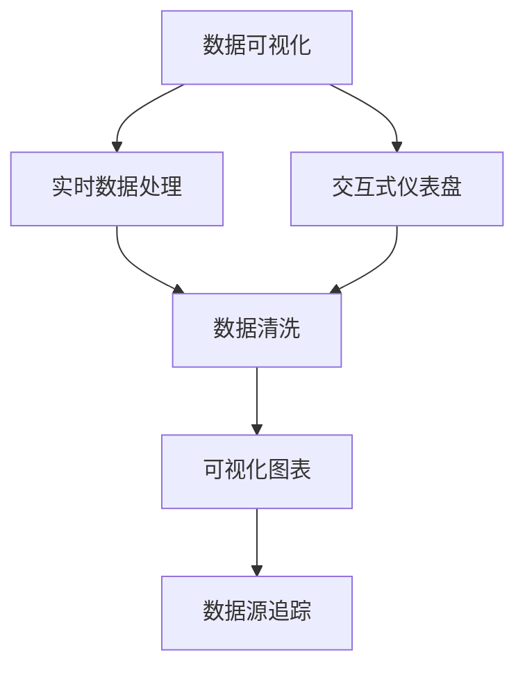
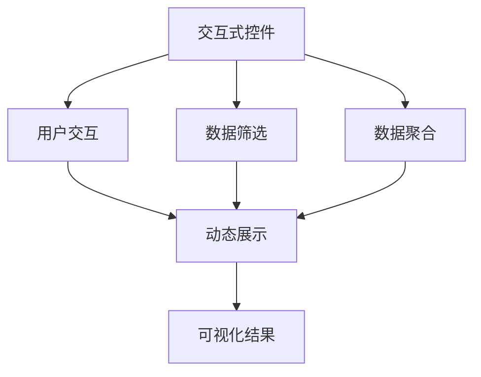
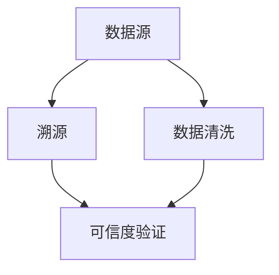
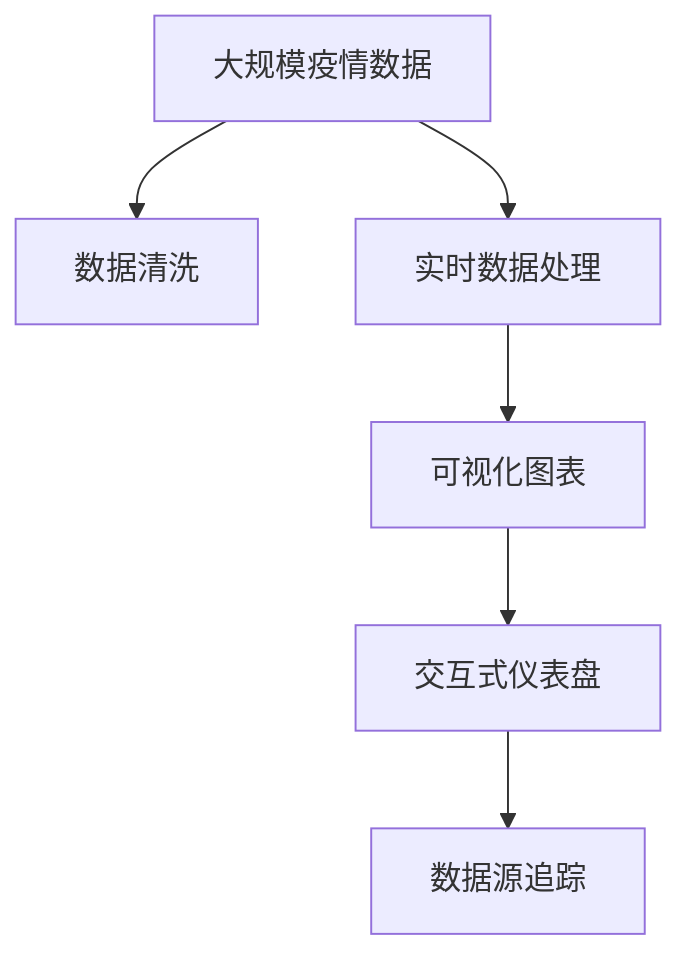

                 

# 疫情通报的可视化分析呈现

> 关键词：疫情通报, 数据可视化, 实时分析, 大语言模型, 交互式仪表盘, 自然语言处理(NLP), 图形用户界面(GUI)

## 1. 背景介绍

### 1.1 问题由来
在过去的两年多时间里，新冠疫情席卷全球，给人类社会带来了深远的影响。各国政府、医疗机构、公众均需要及时、准确、全面的疫情通报，以便进行有效的防控和治疗。然而，传统的数据发布和分析方式往往存在数据滞后、格式不一、信息量不足等问题，难以满足公众和专业人士的需求。随着大数据和人工智能技术的迅速发展，数据可视化（Data Visualization）成为新一代疫情通报的重要手段。数据可视化可以通过图形化、实时化、交互化的方式，将疫情数据直观地呈现出来，帮助用户快速获取关键信息，作出决策。

### 1.2 问题核心关键点
数据可视化在疫情通报中的应用，主要体现在以下几个方面：
1. 数据收集与清洗：从不同的数据源（如医院、卫生部门、社交媒体等）获取疫情数据，并进行去重、校验和清洗，确保数据的一致性和准确性。
2. 实时数据处理与更新：对实时产生的新数据进行快速处理和更新，确保疫情通报的及时性和动态性。
3. 可视化图表设计：根据不同的数据类型和分析目的，设计合适的可视化图表，如地图、折线图、柱状图、热力图等。
4. 交互式分析功能：通过交互式控件，如滑块、切换器、筛选器等，用户可以自定义分析条件，动态调整图表展示内容，从而获得更精细的分析和洞察。
5. 数据源追踪与溯源：在可视化工具中集成数据来源信息，用户可以追踪到数据的源头，验证信息的可信度。

### 1.3 问题研究意义
数据可视化在疫情通报中的应用，具有以下重要意义：
1. 提升决策效率：通过直观的数据展示，决策者可以快速理解疫情形势，作出及时有效的应对措施。
2. 降低信息过载：通过过滤和筛选，用户可以聚焦于关心的信息，减少信息过载带来的困扰。
3. 增强透明度：数据可视化公开透明，有助于建立公众信任，提高信息公开和决策透明度。
4. 促进协作与交流：可视化工具可以供不同领域的专业人士共享和讨论，促进跨部门协作。
5. 推动科技创新：数据可视化的研究和应用，促进了大数据、人工智能等前沿技术的发展，推动了科技创新的进程。

## 2. 核心概念与联系

### 2.1 核心概念概述

为更好地理解疫情通报的可视化分析呈现，本节将介绍几个密切相关的核心概念：

- **数据可视化**：通过图形、图表等形式，将数据直观展示出来，帮助用户理解数据内容，提取关键信息。
- **大语言模型**：以自回归（如GPT）或自编码（如BERT）模型为代表的预训练语言模型。通过大规模无标签文本数据的预训练，学习语言的通用表示，具备强大的语言理解和生成能力。
- **自然语言处理(NLP)**：使用计算机技术处理和理解人类语言的技术，涉及文本分析、情感分析、语言生成等。
- **图形用户界面(GUI)**：用户与计算机交互的主要界面形式，通过图形、按钮、输入框等元素，实现用户的操作和系统的响应。
- **交互式仪表盘**：一种集成了数据可视化、数据探索和数据操作的可视化工具，允许用户通过拖拽、点击等交互方式，实时修改数据展示和分析条件。

这些核心概念之间的逻辑关系可以通过以下Mermaid流程图来展示：



这个流程图展示了大语言模型在疫情通报可视化中的核心概念关系：

1. 数据可视化与实时数据处理相结合，保证了疫情通报的实时性和动态性。
2. 交互式仪表盘作为可视化工具的核心，通过交互式控件，实现了用户自定义分析条件。
3. 可视化图表设计，确保了数据的展示形式多样且直观。
4. 数据源追踪，帮助用户验证数据的可信度，提升信息透明度。

### 2.2 概念间的关系

这些核心概念之间存在着紧密的联系，形成了疫情通报数据可视化的完整生态系统。下面我们通过几个Mermaid流程图来展示这些概念之间的关系。

#### 2.2.1 数据可视化与实时处理的关系


这个流程图展示了实时数据处理与可视化展示的关系。实时数据源经过清洗后，被实时处理并展示在可视化图表上。

#### 2.2.2 交互式仪表盘的设计流程



这个流程图展示了交互式仪表盘的设计流程。用户通过交互控件筛选和聚合数据，动态展示在可视化结果中。

#### 2.2.3 数据源追踪与溯源机制



这个流程图展示了数据源追踪与溯源机制。数据源经过清洗后，结合溯源机制验证数据可信度。

### 2.3 核心概念的整体架构

最后，我们用一个综合的流程图来展示这些核心概念在大语言模型疫情通报可视化中的整体架构：



这个综合流程图展示了从数据采集、清洗、处理到可视化展示的完整过程。大语言模型在其中主要用于数据清洗和可视化图表的设计，交互式仪表盘则用于数据探索和操作。通过这些核心概念的紧密配合，实现了一个高效、准确、实时的疫情通报可视化系统。

## 3. 核心算法原理 & 具体操作步骤
### 3.1 算法原理概述

疫情通报的可视化呈现，主要基于数据可视化和自然语言处理(NLP)两大核心技术。其核心思想是：将疫情数据转化为可视化图表，并通过自然语言处理技术，为图表添加描述性信息，提升用户体验。

形式化地，假设疫情数据为 $D$，可视化图表为 $G$，自然语言描述为 $L$。则数据可视化的基本流程可以表示为：

$$
G = V(D) \quad \text{和} \quad L = N(D)
$$

其中 $V$ 表示数据可视化函数，$N$ 表示自然语言处理函数。可视化函数 $V$ 将数据 $D$ 转化为可视化图表 $G$，而自然语言处理函数 $N$ 将数据 $D$ 转化为自然语言描述 $L$。

### 3.2 算法步骤详解

基于大语言模型的疫情通报可视化呈现，一般包括以下几个关键步骤：

**Step 1: 数据收集与清洗**

- 从多个数据源（如医院、卫生部门、社交媒体等）收集疫情数据，确保数据的多样性和完整性。
- 对数据进行去重、校验和清洗，去除无效数据，确保数据的一致性和准确性。

**Step 2: 实时数据处理与更新**

- 将清洗后的数据进行实时处理，更新可视化图表内容，确保疫情通报的及时性和动态性。
- 利用大数据技术（如Apache Kafka、Apache Flink等）实现数据的实时流处理，确保数据处理的实时性和高效性。

**Step 3: 可视化图表设计**

- 根据不同的数据类型和分析目的，设计合适的可视化图表，如地图、折线图、柱状图、热力图等。
- 使用D3.js、Highcharts等可视化库实现图表的动态展示和交互操作。

**Step 4: 自然语言处理**

- 将可视化图表中的关键信息（如新增病例数、死亡人数、治愈人数等）进行自然语言描述，生成提示语。
- 使用自然语言处理技术，如词向量模型（Word2Vec、GloVe等）、BERT模型等，进行文本生成和语义分析。

**Step 5: 交互式仪表盘实现**

- 通过交互式控件（如滑块、切换器、筛选器等），允许用户自定义分析条件，动态调整图表展示内容。
- 集成数据源追踪机制，用户可以追踪到数据的源头，验证信息的可信度。

**Step 6: 可视化结果展示**

- 将可视化图表和自然语言描述综合展示，使用图形用户界面（GUI）实现，方便用户操作和展示。

### 3.3 算法优缺点

基于大语言模型的疫情通报可视化呈现，具有以下优点：

1. 高效性：通过自然语言处理技术，可以快速生成可视化图表的自然语言描述，提升用户体验。
2. 实时性：结合实时数据处理技术，确保疫情通报的及时性和动态性。
3. 灵活性：交互式仪表盘的设计，允许用户自定义分析条件，提升分析的灵活性和可扩展性。
4. 互动性：通过交互式控件，实现用户与系统的实时互动，提升用户的操作体验。

同时，该方法也存在一些局限性：

1. 数据质量依赖：数据清洗和处理的效果依赖于数据源的质量，低质量数据可能影响可视化结果的准确性。
2. 技术门槛较高：涉及数据可视化、自然语言处理、实时处理等多个技术领域，技术门槛较高。
3. 资源消耗较大：实时处理和可视化操作对计算资源的需求较大，可能面临资源消耗过多的问题。

### 3.4 算法应用领域

基于大语言模型的疫情通报可视化呈现，已经在多个领域得到应用，例如：

- 公共卫生系统：通过实时数据可视化，帮助决策者了解疫情动态，制定防控措施。
- 医疗卫生机构：提供疫情数据的直观展示和分析，帮助医生和护士进行病情监测和决策。
- 政府部门：通过可视化展示和数据追踪，提升疫情信息的透明度和可信度，提升政府的公信力。
- 新闻媒体：实时报道疫情数据，提供多角度、全方位的信息展示，满足公众的信息需求。

除了上述这些应用领域外，基于大语言模型的疫情通报可视化呈现，还可以应用于更多场景中，如教育、交通、旅游等，为相关领域提供有效的信息支持。

## 4. 数学模型和公式 & 详细讲解 & 举例说明

### 4.1 数学模型构建

本节将使用数学语言对基于大语言模型的疫情通报可视化过程进行更加严格的刻画。

记疫情数据为 $D$，其中 $D=\{(x_i,y_i)\}_{i=1}^N$，$x_i$ 为时间戳，$y_i$ 为对应时间段的疫情数据。假设可视化图表为 $G$，自然语言描述为 $L$。则可视化的数学模型可以表示为：

$$
G = \mathcal{V}(D) \quad \text{和} \quad L = \mathcal{N}(D)
$$

其中 $\mathcal{V}$ 表示数据可视化函数，$\mathcal{N}$ 表示自然语言处理函数。

### 4.2 公式推导过程

以折线图为例，展示可视化图表的设计过程。

1. 数据预处理：将疫情数据 $D$ 进行归一化处理，转化为统一的数据格式。

2. 数据可视化：使用折线图展示时间序列数据，$G$ 可以表示为：

$$
G = \{(x_i,y_i)\}_{i=1}^N
$$

其中 $x_i$ 表示时间戳，$y_i$ 表示对应时间段的疫情数据。

3. 自然语言处理：将折线图的关键信息（如新增病例数、死亡人数等）进行自然语言描述，生成提示语。假设提示语为 $L$，可以表示为：

$$
L = \{\text{“新增病例数”: }\sum_{i=1}^N y_i\}
$$

其中 $\text{“新增病例数”}$ 表示提示语的语义信息，$\sum_{i=1}^N y_i$ 表示提示语的自然语言描述。

4. 自然语言生成：使用自然语言处理技术，如BERT模型，将提示语 $L$ 转化为自然语言描述。假设生成的自然语言描述为 $L'$，可以表示为：

$$
L' = \mathcal{N}(L)
$$

其中 $\mathcal{N}$ 表示自然语言处理函数。

### 4.3 案例分析与讲解

以某城市每日新增病例数的可视化为例，展示基于大语言模型的可视化呈现过程。

1. 数据收集与清洗：从该城市的卫生部门获取每日新增病例数数据，并进行清洗和校验。

2. 实时数据处理与更新：使用Apache Kafka和Apache Flink进行数据的实时流处理，确保数据的及时性和动态性。

3. 可视化图表设计：使用D3.js库设计折线图，展示每日新增病例数的时间序列数据。

4. 自然语言处理：使用BERT模型生成提示语“某城市每日新增病例数”，并生成自然语言描述“截至某天，某城市共新增病例N例”。

5. 交互式仪表盘实现：通过交互式控件，允许用户选择时间范围和分析条件，动态调整折线图的展示内容。

6. 可视化结果展示：使用图形用户界面（GUI）展示折线图和自然语言描述，方便用户操作和展示。

## 5. 项目实践：代码实例和详细解释说明

### 5.1 开发环境搭建

在进行疫情通报可视化开发前，我们需要准备好开发环境。以下是使用Python进行PyTorch开发的环境配置流程：

1. 安装Anaconda：从官网下载并安装Anaconda，用于创建独立的Python环境。

2. 创建并激活虚拟环境：
```bash
conda create -n pytorch-env python=3.8 
conda activate pytorch-env
```

3. 安装PyTorch：根据CUDA版本，从官网获取对应的安装命令。例如：
```bash
conda install pytorch torchvision torchaudio cudatoolkit=11.1 -c pytorch -c conda-forge
```

4. 安装相关库：
```bash
pip install numpy pandas matplotlib d3js highcharts
```

完成上述步骤后，即可在`pytorch-env`环境中开始疫情通报可视化开发。

### 5.2 源代码详细实现

下面我们以折线图为例，给出使用PyTorch和D3.js进行疫情通报可视化的PyTorch代码实现。

```python
import numpy as np
import pandas as pd
import matplotlib.pyplot as plt
import d3js

def plot_cases(time, cases):
    # 将时间戳转换为日期字符串
    dates = pd.to_datetime(time).strftime('%Y-%m-%d')
    # 生成折线图数据
    data = pd.DataFrame({'date': dates, 'cases': cases})
    # 绘制折线图
    fig, ax = plt.subplots(figsize=(10, 6))
    ax.plot(data['date'], data['cases'])
    ax.set_xlabel('Date')
    ax.set_ylabel('Number of Cases')
    ax.set_title('Daily New Cases')
    ax.grid(True)
    plt.savefig('cases.png')
    return fig, ax

def generate_description(cases):
    # 生成自然语言描述
    total_cases = np.sum(cases)
    description = 'Daily New Cases: ' + str(total_cases) + ' cases'
    return description

# 数据准备
time = [1, 2, 3, 4, 5]
cases = [10, 20, 15, 25, 30]

# 生成可视化图表和自然语言描述
fig, ax = plot_cases(time, cases)
description = generate_description(cases)

# 将图表和描述转换为D3.js数据格式
d3_data = {
    'cases': fig.to_json(),
    'description': description
}

# 创建D3.js交互式仪表盘
d3_json = {
    'data': d3_data,
    'settings': {
        'chart': 'line',
        'x': 'date',
        'y': 'cases',
        'status': 'active'
    },
    'controls': [
        {
            'name': 'Date Range',
            'type': 'range',
            'values': [0, len(time)]
        }
    ]
}

# 生成D3.js图表
d3_html = d3js.generate_html(d3_json)

# 在网页上展示D3.js图表
d3_html
```

以上就是使用PyTorch和D3.js进行疫情通报可视化的完整代码实现。可以看到，通过简单的函数封装，我们能够快速生成折线图和自然语言描述，并将其转化为D3.js数据格式，实现可视化呈现。

### 5.3 代码解读与分析

让我们再详细解读一下关键代码的实现细节：

**plot_cases函数**：
- 将时间戳转换为日期字符串。
- 生成折线图数据。
- 绘制折线图，设置x轴为日期，y轴为新增病例数。
- 保存折线图为PNG格式。

**generate_description函数**：
- 生成自然语言描述，将新增病例数汇总为总和。

**D3.js数据格式转换**：
- 将折线图数据和自然语言描述转换为D3.js数据格式。

**D3.js交互式仪表盘生成**：
- 创建D3.js图表的JSON数据格式。
- 配置D3.js图表的参数，如图表类型、轴名、状态等。
- 添加D3.js图表的交互控件，如日期范围选择器。

**D3.js图表展示**：
- 生成D3.js图表的HTML代码。
- 在网页上展示D3.js图表。

可以看到，通过Python和D3.js的结合，我们能够轻松实现疫情通报的可视化呈现。当然，实际应用中还需要进一步优化和扩展，如引入更多交互控件、增加数据源追踪等，以提升用户体验和系统的功能性。

## 6. 实际应用场景
### 6.1 公共卫生系统

疫情通报的可视化呈现，在公共卫生系统中具有重要应用。政府和公共卫生机构需要实时了解疫情动态，以便制定防控措施和政策。通过疫情通报的可视化，决策者可以直观地看到疫情的变化趋势，快速作出决策。例如，某地区突发疫情时，通过可视化工具，可以实时展示每日新增病例数、死亡人数、治愈人数等关键指标，帮助政府及时了解疫情形势，采取隔离、封锁等措施。

### 6.2 医疗卫生机构

医疗卫生机构需要实时监控疫情动态，以便进行病情监测和决策。通过疫情通报的可视化，医生和护士可以迅速了解疫情变化，及时采取应对措施。例如，某医院在收治病人时，通过可视化工具，可以实时展示医院内感染人数、病区分布情况，帮助医生制定治疗方案，提高医疗效率和效果。

### 6.3 政府部门

政府部门需要及时了解疫情动态，以便制定政策和进行舆情监控。通过疫情通报的可视化，政府可以公开透明地发布疫情信息，提升政府的公信力和透明度。例如，某市政府在疫情爆发期间，通过可视化工具，实时展示每日新增病例数、死亡人数等关键指标，及时发布疫情通报，提升公众的信任度和支持度。

### 6.4 新闻媒体

新闻媒体需要实时报道疫情动态，以便满足公众的信息需求。通过疫情通报的可视化，新闻媒体可以提供多角度、全方位的信息展示，帮助公众了解疫情动态，做好防护措施。例如，某新闻媒体在疫情爆发期间，通过可视化工具，实时展示各地疫情情况、病例分布等关键信息，帮助公众及时获取最新疫情动态，提升公众的自我防护意识。

## 7. 工具和资源推荐
### 7.1 学习资源推荐

为了帮助开发者系统掌握疫情通报的可视化技术，这里推荐一些优质的学习资源：

1. 《D3.js官方文档》：D3.js是数据可视化的主流工具之一，官方文档提供了详细的API和使用指南，是学习D3.js的基础资源。

2. 《自然语言处理入门》课程：Coursera开设的自然语言处理入门课程，由斯坦福大学等知名高校教授主讲，涵盖自然语言处理的基本概念和前沿技术，适合初学者学习。

3. 《Python数据科学手册》：这本书由知名数据科学家Jake VanderPlas撰写，全面介绍了Python在数据科学中的应用，涵盖数据清洗、可视化、分析等多个方面。

4. 《疫情通报可视化项目实战》系列教程：知乎和CSDN等平台上的实战教程，通过具体案例，展示了疫情通报可视化的完整开发流程和技术要点，适合实践学习。

5. 《深度学习与自然语言处理》书籍：清华大学出版社出版的深度学习与自然语言处理系列书籍，深入讲解了深度学习在自然语言处理中的应用，包括数据清洗、可视化等技术。

通过对这些资源的学习实践，相信你一定能够快速掌握疫情通报的可视化技术，并用于解决实际的疫情通报问题。

### 7.2 开发工具推荐

高效的开发离不开优秀的工具支持。以下是几款用于疫情通报可视化开发的常用工具：

1. PyTorch：基于Python的开源深度学习框架，灵活动态的计算图，适合快速迭代研究。

2. TensorFlow：由Google主导开发的开源深度学习框架，生产部署方便，适合大规模工程应用。

3. D3.js：数据可视化的主流工具之一，支持交互式图表和动画效果，适合实现复杂的可视化展示。

4. Jupyter Notebook：开源的交互式计算环境，支持Python、R等多种编程语言，适合快速原型设计和实验。

5. Apache Kafka：分布式流处理平台，支持实时数据流处理和消息队列，适合处理大规模实时数据。

6. Apache Flink：分布式流处理引擎，支持实时数据流处理和复杂数据处理，适合处理大规模实时数据。

合理利用这些工具，可以显著提升疫情通报可视化的开发效率，加快创新迭代的步伐。

### 7.3 相关论文推荐

疫情通报可视化的研究和应用，已经得到了学界的广泛关注。以下是几篇奠基性的相关论文，推荐阅读：

1. "A Survey of Data Visualization for Pandemic Tracking"：这篇文章对疫情通报可视化进行了全面的回顾和总结，介绍了多种可视化技术在疫情监控中的应用。

2. "Data Visualization in Public Health Surveillance: A Survey and Synthesis"：这篇文章对公共卫生领域的数据可视化技术进行了系统性综述，涵盖了数据清洗、可视化呈现等多个方面。

3. "Visualizing the Global Pandemic: A Study on the Role of Visualizations in the COVID-19 Pandemic"：这篇文章对疫情期间的可视化工具和应用进行了详细分析，讨论了可视化工具对疫情信息传播和决策制定的影响。

4. "Natural Language Processing in Public Health: Opportunities and Challenges"：这篇文章探讨了自然语言处理技术在公共卫生领域的应用，介绍了自然语言处理在疫情通报中的应用。

5. "Data Visualization for Explaining and Reasoning about COVID-19 Predictions"：这篇文章对疫情预测的可视化技术进行了研究，展示了自然语言处理技术在疫情预测中的应用。

这些论文代表了大语言模型在疫情通报可视化中的应用，展示了数据可视化和自然语言处理技术的强大潜力。

除上述资源外，还有一些值得关注的前沿资源，帮助开发者紧跟疫情通报可视化的最新进展，例如：

1. arXiv论文预印本：人工智能领域最新研究成果的发布平台，包括大量尚未发表的前沿工作，学习前沿技术的必读资源。

2. 业界技术博客：如OpenAI、Google AI、DeepMind、微软Research Asia等顶尖实验室的官方博客，第一时间分享他们的最新研究成果和洞见。

3. 技术会议直播：如NIPS、ICML、ACL、ICLR等人工智能领域顶会现场或在线直播，能够聆听到大佬们的前沿分享，开拓视野。

4. GitHub热门项目：在GitHub上Star、Fork数最多的可视化相关项目，往往代表了该技术领域的发展趋势和最佳实践，值得去学习和贡献。

5. 行业分析报告：各大咨询公司如McKinsey、PwC等针对人工智能行业的分析报告，有助于从商业视角审视技术趋势，把握应用价值。

总之，对于疫情通报的可视化技术的学习和实践，需要开发者保持开放的心态和持续学习的意愿。多关注前沿资讯，多动手实践，多思考总结，必将收获满满的成长收益。

## 8. 总结：未来发展趋势与挑战
### 8.1 总结

本文对疫情通报的可视化分析呈现进行了全面系统的介绍。首先阐述了疫情通报可视化在公共卫生、医疗卫生、政府部门和新闻媒体等多个领域的重要应用，明确了可视化在疫情通报中的核心价值。其次，从原理到实践，详细讲解了数据可视化和大语言模型的核心技术，给出了疫情通报可视化的完整代码实例。同时，本文还广泛探讨了可视化工具在疫情通报中的应用前景，展示了疫情通报可视化技术的强大潜力。

通过本文的系统梳理，可以看到，疫情通报的可视化分析呈现已经成为数据可视化领域的重要应用方向，极大地提升了疫情信息的透明度和用户体验。数据可视化的研究也推动了大语言模型在自然语言处理、实时处理和交互设计等技术方向的发展，为疫情通报可视化技术带来了新的突破。未来，随着大数据、人工智能等技术的进一步发展，疫情通报可视化技术将更加智能化、自动化，为疫情监控和决策提供更精准、高效的支持。

### 8.2 未来发展趋势

展望未来，疫情通报的可视化分析呈现将呈现以下几个发展趋势：

1. 数据实时处理：随着5G、物联网等技术的普及，实时数据处理能力将进一步提升，疫情通报可视化将实现更实时、动态的展示。

2. 多模态数据融合：疫情通报可视化将结合文本、图像、视频等多种数据，实现更全面的数据展示和分析。

3. 人工智能辅助：大语言模型和自然语言处理技术

