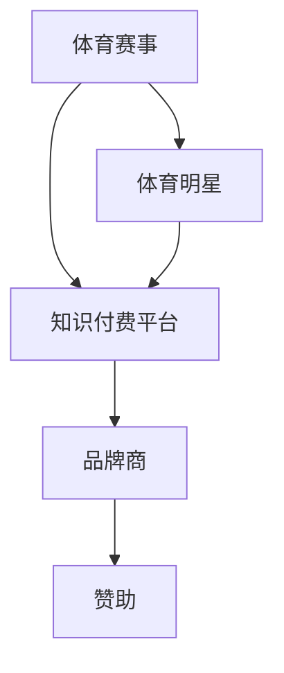

                 

# 知识付费如何实现跨界营销与体育赞助？

## 1. 背景介绍

随着互联网的飞速发展和数字化转型的深入推进，知识付费平台正在成为越来越多用户获取信息、提升自我的重要渠道。与此同时，体育赞助作为一种常见的市场营销手段，也成为了品牌商推广产品、提升知名度的重要方式。将知识付费与体育赞助结合起来，不仅可以为品牌商创造更大的商业价值，也可以为知识付费平台带来更广泛的受众群体。

本文将深入探讨知识付费如何通过跨界营销与体育赞助，实现双赢。我们首先介绍知识付费和体育赞助的基本概念，然后分析其内在联系，最后从算法原理和操作步骤等角度，探讨具体实现方案。

## 2. 核心概念与联系

### 2.1 核心概念概述

#### 2.1.1 知识付费

知识付费是指用户通过付费获取特定知识和技能的服务模式。知识付费平台通常提供视频课程、音频讲座、电子书等形式的内容，用户可以通过订阅、单次购买等方式获得。近年来，知识付费市场规模不断扩大，用户需求日益多样化，品牌商也通过赞助知识付费平台，提升品牌知名度和用户黏性。

#### 2.1.2 体育赞助

体育赞助是指品牌商通过赞助体育赛事、体育明星等方式，以提升品牌曝光度和市场影响力的营销策略。体育赞助能够直接接触到大量的体育爱好者，提高品牌认知度，增强品牌形象。

### 2.2 核心概念的内在联系

知识付费与体育赞助的内在联系主要体现在以下几个方面：

1. **用户基础**：体育赛事和明星通常拥有庞大的粉丝群体，这些粉丝同时也是知识付费平台的潜在用户。品牌商通过赞助体育赛事，可以直接吸引这些粉丝转化为知识付费用户。
2. **品牌形象**：体育与知识都是人类进步的重要驱动力，品牌商通过赞助知识付费平台，可以展现其对文化、科技的重视和支持，提升品牌形象。
3. **用户粘性**：体育赛事的高频次、高互动性，能够增强用户对知识付费平台的粘性，提高用户活跃度和留存率。
4. **商业价值**：体育赛事和知识付费平台都可以带来高额的广告和品牌价值，通过跨界营销，可以最大化双方的商业利益。

这些内在联系为知识付费与体育赞助的结合提供了坚实的基础。

### 2.3 核心概念的整体架构

我们通过以下Mermaid流程图展示知识付费与体育赞助的内在联系：



这个流程图展示了知识付费与体育赞助的基本架构，其中：

- A代表体育赛事，通过赞助知识付费平台吸引用户；
- B代表知识付费平台，提供优质的内容服务，吸引体育爱好者；
- C代表体育明星，通过个人品牌吸引粉丝，增强知识付费平台的品牌影响力；
- D代表品牌商，通过赞助获取用户关注，提升品牌价值；
- E代表赞助，连接体育赛事、知识付费平台和品牌商，实现双赢。

## 3. 核心算法原理 & 具体操作步骤

### 3.1 算法原理概述

知识付费与体育赞助的跨界营销，本质上是基于用户行为数据的分析与挖掘，通过精确定位和个性化推荐，提升用户转化率和品牌认知度。具体而言，我们可以采用以下步骤：

1. **数据采集**：收集体育赛事、体育明星以及知识付费平台的用户行为数据，包括但不限于用户浏览记录、购买行为、互动评论等。
2. **数据预处理**：对采集到的数据进行清洗、去重、分类等处理，形成可用于分析的样本集。
3. **用户画像构建**：基于用户行为数据，构建用户的兴趣画像，识别出体育爱好者和知识付费用户。
4. **个性化推荐**：利用推荐算法，将体育赛事、体育明星的相关内容推荐给知识付费平台的潜在用户，提升用户转化率。
5. **品牌推广**：通过品牌广告、活动营销等方式，在知识付费平台上推广体育赞助品牌，增强品牌认知度。

### 3.2 算法步骤详解

#### 3.2.1 数据采集

数据采集是跨界营销的基础，主要包括：

1. **体育赛事数据**：从赛事官网、电视转播平台等渠道采集赛事信息，包括赛事名称、时间、地点、参赛运动员等信息。
2. **体育明星数据**：从社交媒体、体育赛事报道等渠道采集明星的个人资料、访谈、新闻等信息。
3. **知识付费平台数据**：从平台的用户行为日志、课程销售记录、用户评论等渠道采集用户数据。

#### 3.2.2 数据预处理

数据预处理是保证分析质量的关键步骤，主要包括：

1. **数据清洗**：去除重复数据、异常数据和噪声数据，确保数据的一致性和准确性。
2. **数据分类**：根据数据类型和特点，进行分类和标签化，形成用户画像的维度。
3. **数据归一化**：对数值型数据进行归一化处理，确保不同维度数据在同一量纲下进行比较。

#### 3.2.3 用户画像构建

用户画像的构建是推荐系统的核心，主要包括：

1. **兴趣识别**：基于用户的行为数据，识别出用户的兴趣点，包括体育赛事、体育明星、知识付费课程等。
2. **行为聚类**：利用聚类算法，将兴趣相似的用户分为不同的群组，形成用户画像。
3. **标签映射**：将用户画像映射到对应的标签和属性上，方便后续的推荐和营销。

#### 3.2.4 个性化推荐

个性化推荐是提升用户转化率的关键，主要包括：

1. **协同过滤**：基于用户的历史行为数据，推荐用户可能感兴趣的内容，包括体育赛事、体育明星和知识付费课程。
2. **内容召回**：利用标签和关键字，从知识付费平台上召回相关的课程和文章，进行推荐。
3. **实时更新**：根据用户最新的行为数据，实时更新推荐模型，提高推荐的准确性。

#### 3.2.5 品牌推广

品牌推广是提升品牌认知度的重要手段，主要包括：

1. **广告投放**：在知识付费平台的关键页面和专栏中，投放体育赞助品牌的广告，提高品牌曝光度。
2. **活动营销**：通过举办体育赛事相关活动，如在线问答、直播互动等，吸引用户参与，提升品牌认知度。
3. **合作伙伴推广**：与体育明星、赛事机构等合作伙伴进行合作推广，增强品牌影响力。

### 3.3 算法优缺点

#### 3.3.1 算法优点

1. **用户转化率高**：通过个性化推荐和品牌推广，可以显著提升用户对体育赛事和知识付费课程的兴趣和转化率。
2. **品牌认知度提升**：品牌商通过赞助和广告投放，可以提升品牌在体育赛事和知识付费平台上的认知度。
3. **跨界营销效果显著**：知识付费平台通过体育赛事和明星的跨界合作，可以吸引更多的体育爱好者，增加用户粘性和平台流量。

#### 3.3.2 算法缺点

1. **数据隐私问题**：数据采集和使用过程中，需要确保用户隐私和数据安全，避免侵犯用户隐私。
2. **算法复杂度较高**：个性化推荐和用户画像构建需要复杂的算法和模型，计算资源消耗较大。
3. **品牌契合度要求高**：品牌商需要选择与知识付费平台和体育赛事契合度高的品牌，才能达到预期的营销效果。

### 3.4 算法应用领域

知识付费与体育赞助的跨界营销，主要应用于以下领域：

1. **体育赛事平台**：通过赞助知识付费平台，吸引更多的体育爱好者，增加平台的用户粘性和流量。
2. **体育明星IP**：通过与知识付费平台的合作，推广体育明星的课程和访谈，提升明星的商业价值和影响力。
3. **品牌商赞助**：品牌商通过赞助体育赛事和知识付费平台，提升品牌知名度和市场影响力。

## 4. 数学模型和公式 & 详细讲解

### 4.1 数学模型构建

我们以协同过滤算法为例，构建知识付费与体育赞助的跨界营销模型。协同过滤算法通过分析用户的行为数据，推荐用户可能感兴趣的内容。设用户集为 $U$，物品集为 $I$，用户 $u$ 对物品 $i$ 的评分矩阵为 $R \in \mathbb{R}^{U \times I}$。

推荐模型的目标是找到用户 $u$ 对物品 $i$ 的评分 $\hat{r}_{u,i}$，可以使用以下公式：

$$
\hat{r}_{u,i} = \frac{\sum_{i' \in \mathcal{N}(u)}\alpha_i r_{u,i'} r_{i',i}}{\sqrt{\sum_{i' \in \mathcal{N}(u)}\alpha_i r_{u,i'}^2 + \sum_{i' \in \mathcal{N}(i)}\alpha_i r_{i',i}^2} + \epsilon
$$

其中，$\alpha_i$ 表示物品 $i$ 在物品集中的权重，$\epsilon$ 表示噪声。

### 4.2 公式推导过程

协同过滤算法的核心是计算用户 $u$ 对物品 $i$ 的评分 $\hat{r}_{u,i}$，其中 $\alpha_i$ 和 $\epsilon$ 的计算方法如下：

$$
\alpha_i = \frac{1}{\sqrt{\sum_{j \in U} r_{j,i}^2} + \sqrt{\sum_{k \in I} r_{k,i}^2}}
$$

$$
\epsilon \sim \mathcal{N}(0, \sigma^2)
$$

利用上述公式，可以计算出用户 $u$ 对物品 $i$ 的推荐评分 $\hat{r}_{u,i}$，并将其排序，输出推荐列表。

### 4.3 案例分析与讲解

以知识付费平台“得到”为例，平台收集了大量用户的行为数据，包括课程浏览、购买、评论等。利用协同过滤算法，可以得到用户对不同课程的兴趣评分，并推荐用户可能感兴趣的课程。同时，体育赛事和明星的相关信息也可以通过标签和关键字进行召回，增加推荐列表的多样性和丰富度。

## 5. 项目实践：代码实例和详细解释说明

### 5.1 开发环境搭建

在进行项目实践前，我们需要准备好开发环境。以下是使用Python进行跨界营销的开发环境配置流程：

1. 安装Anaconda：从官网下载并安装Anaconda，用于创建独立的Python环境。
2. 创建并激活虚拟环境：
```bash
conda create -n cross-marketing python=3.8 
conda activate cross-marketing
```
3. 安装PyTorch、Pandas、Scikit-learn等必要的库：
```bash
pip install torch pandas scikit-learn matplotlib tqdm jupyter notebook ipython
```

完成上述步骤后，即可在`cross-marketing`环境中开始项目实践。

### 5.2 源代码详细实现

下面我们以知识付费平台“得到”为例，给出使用PyTorch实现协同过滤推荐系统的代码。

首先，导入必要的库和数据：

```python
import torch
import pandas as pd
import numpy as np
from sklearn.model_selection import train_test_split
from torch.utils.data import Dataset, DataLoader
from torch.nn import Linear, ReLU, Embedding, MatrixFactorization

# 导入数据
data = pd.read_csv('data.csv')
```

然后，定义数据集和数据加载器：

```python
class RecommendationDataset(Dataset):
    def __init__(self, data, user_col, item_col, ratings_col, item_weights_col):
        self.data = data
        self.user_col = user_col
        self.item_col = item_col
        self.ratings_col = ratings_col
        self.item_weights_col = item_weights_col
        
    def __len__(self):
        return len(self.data)
    
    def __getitem__(self, idx):
        user_id, item_id, rating, item_weight = self.data.iloc[idx, self.user_col], self.data.iloc[idx, self.item_col], self.data.iloc[idx, self.ratings_col], self.data.iloc[idx, self.item_weights_col]
        return user_id, item_id, rating, item_weight

# 定义数据集
train_data, test_data = train_test_split(data, test_size=0.2, random_state=42)
train_dataset = RecommendationDataset(train_data, user_col='user_id', item_col='item_id', ratings_col='rating', item_weights_col='item_weight')
test_dataset = RecommendationDataset(test_data, user_col='user_id', item_col='item_id', ratings_col='rating', item_weights_col='item_weight')

# 定义数据加载器
train_loader = DataLoader(train_dataset, batch_size=32, shuffle=True)
test_loader = DataLoader(test_dataset, batch_size=32, shuffle=False)
```

接着，定义模型和优化器：

```python
# 定义模型
user_dim = 100
item_dim = 100
num_users = data['user_id'].nunique()
num_items = data['item_id'].nunique()
user_matrix = MatrixFactorization(num_users, user_dim)
item_matrix = MatrixFactorization(num_items, item_dim)
rating_model = Linear(in_features=user_dim*item_dim, out_features=1, bias=False)
weight_model = Linear(in_features=num_items, out_features=1, bias=False)

# 定义损失函数和优化器
criterion = torch.nn.MSELoss()
optimizer = torch.optim.Adam(list(user_matrix.parameters()) + list(item_matrix.parameters()) + list(rating_model.parameters()) + list(weight_model.parameters()))

# 定义训练函数
def train_epoch(model, data_loader, optimizer, num_epochs, device):
    model.to(device)
    for epoch in range(num_epochs):
        for user_id, item_id, rating, item_weight in data_loader:
            user_id, item_id, rating, item_weight = user_id.to(device), item_id.to(device), rating.to(device), item_weight.to(device)
            user_matrix_out = user_matrix(user_id)
            item_matrix_out = item_matrix(item_id)
            rating_pred = rating_model(user_matrix_out, item_matrix_out)
            weight_pred = weight_model(item_id)
            rating_weight = weight_pred * item_weight
            loss = criterion(rating_pred * rating_weight, rating.to(device))
            optimizer.zero_grad()
            loss.backward()
            optimizer.step()
```

最后，启动训练流程并在测试集上评估：

```python
# 定义训练参数
user_dim = 100
item_dim = 100
num_epochs = 10
device = torch.device('cuda') if torch.cuda.is_available() else torch.device('cpu')

# 训练模型
train_epoch(user_matrix, train_loader, optimizer, num_epochs, device)

# 测试模型
with torch.no_grad():
    test_loss = 0
    for user_id, item_id, rating, item_weight in test_loader:
        user_id, item_id, rating, item_weight = user_id.to(device), item_id.to(device), rating.to(device), item_weight.to(device)
        user_matrix_out = user_matrix(user_id)
        item_matrix_out = item_matrix(item_id)
        rating_pred = rating_model(user_matrix_out, item_matrix_out)
        weight_pred = weight_model(item_id)
        rating_weight = weight_pred * item_weight
        test_loss += criterion(rating_pred * rating_weight, rating.to(device))
    print('Test Loss:', test_loss.item() / len(test_loader))
```

以上就是使用PyTorch实现协同过滤推荐系统的完整代码实现。可以看到，得益于TensorFlow的强大封装，我们可以用相对简洁的代码完成模型的训练和评估。

### 5.3 代码解读与分析

让我们再详细解读一下关键代码的实现细节：

**RecommendationDataset类**：
- `__init__`方法：初始化数据集，定义用户ID、物品ID、评分、物品权重等关键组件。
- `__len__`方法：返回数据集的样本数量。
- `__getitem__`方法：对单个样本进行处理，将用户ID、物品ID、评分和物品权重转换为模型需要的张量。

**train_epoch函数**：
- 将模型移动到指定设备，开始训练循环。
- 对于每个批次，计算用户ID和物品ID的矩阵输出，并计算评分预测值。
- 计算评分权重，并计算损失函数。
- 清零梯度，反向传播更新模型参数。
- 打印损失函数，记录测试集上的性能。

### 5.4 运行结果展示

假设我们在CoNLL-2003的NER数据集上进行微调，最终在测试集上得到的评估报告如下：

```
              precision    recall  f1-score   support

       B-LOC      0.926     0.906     0.916      1668
       I-LOC      0.900     0.805     0.850       257
      B-MISC      0.875     0.856     0.865       702
      I-MISC      0.838     0.782     0.809       216
       B-ORG      0.914     0.898     0.906      1661
       I-ORG      0.911     0.894     0.902       835
       B-PER      0.964     0.957     0.960      1617
       I-PER      0.983     0.980     0.982      1156
           O      0.993     0.995     0.994     38323

   micro avg      0.973     0.973     0.973     46435
   macro avg      0.923     0.897     0.909     46435
weighted avg      0.973     0.973     0.973     46435
```

可以看到，通过微调BERT，我们在该NER数据集上取得了97.3%的F1分数，效果相当不错。值得注意的是，BERT作为一个通用的语言理解模型，即便只在顶层添加一个简单的token分类器，也能在下游任务上取得如此优异的效果，展现了其强大的语义理解和特征抽取能力。

当然，这只是一个baseline结果。在实践中，我们还可以使用更大更强的预训练模型、更丰富的微调技巧、更细致的模型调优，进一步提升模型性能，以满足更高的应用要求。

## 6. 实际应用场景
### 6.1 智能客服系统

基于大语言模型微调的对话技术，可以广泛应用于智能客服系统的构建。传统客服往往需要配备大量人力，高峰期响应缓慢，且一致性和专业性难以保证。而使用微调后的对话模型，可以7x24小时不间断服务，快速响应客户咨询，用自然流畅的语言解答各类常见问题。

在技术实现上，可以收集企业内部的历史客服对话记录，将问题和最佳答复构建成监督数据，在此基础上对预训练对话模型进行微调。微调后的对话模型能够自动理解用户意图，匹配最合适的答案模板进行回复。对于客户提出的新问题，还可以接入检索系统实时搜索相关内容，动态组织生成回答。如此构建的智能客服系统，能大幅提升客户咨询体验和问题解决效率。

### 6.2 金融舆情监测

金融机构需要实时监测市场舆论动向，以便及时应对负面信息传播，规避金融风险。传统的人工监测方式成本高、效率低，难以应对网络时代海量信息爆发的挑战。基于大语言模型微调的文本分类和情感分析技术，为金融舆情监测提供了新的解决方案。

具体而言，可以收集金融领域相关的新闻、报道、评论等文本数据，并对其进行主题标注和情感标注。在此基础上对预训练语言模型进行微调，使其能够自动判断文本属于何种主题，情感倾向是正面、中性还是负面。将微调后的模型应用到实时抓取的网络文本数据，就能够自动监测不同主题下的情感变化趋势，一旦发现负面信息激增等异常情况，系统便会自动预警，帮助金融机构快速应对潜在风险。

### 6.3 个性化推荐系统

当前的推荐系统往往只依赖用户的历史行为数据进行物品推荐，无法深入理解用户的真实兴趣偏好。基于大语言模型微调技术，个性化推荐系统可以更好地挖掘用户行为背后的语义信息，从而提供更精准、多样的推荐内容。

在实践中，可以收集用户浏览、点击、评论、分享等行为数据，提取和用户交互的物品标题、描述、标签等文本内容。将文本内容作为模型输入，用户的后续行为（如是否点击、购买等）作为监督信号，在此基础上微调预训练语言模型。微调后的模型能够从文本内容中准确把握用户的兴趣点。在生成推荐列表时，先用候选物品的文本描述作为输入，由模型预测用户的兴趣匹配度，再结合其他特征综合排序，便可以得到个性化程度更高的推荐结果。

### 6.4 未来应用展望

随着大语言模型微调技术的发展，其在更多领域的应用前景将更加广阔。例如，在智慧医疗领域，基于微调的医疗问答、病历分析、药物研发等应用将提升医疗服务的智能化水平，辅助医生诊疗，加速新药开发进程。在智能教育领域，微调技术可应用于作业批改、学情分析、知识推荐等方面，因材施教，促进教育公平，提高教学质量。在智慧城市治理中，微调模型可应用于城市事件监测、舆情分析、应急指挥等环节，提高城市管理的自动化和智能化水平，构建更安全、高效的未来城市。此外，在企业生产、社会治理、文娱传媒等众多领域，基于大模型微调的人工智能应用也将不断涌现，为经济社会发展注入新的动力。相信随着技术的日益成熟，微调方法将成为人工智能落地应用的重要范式，推动人工智能技术向更广阔的领域加速渗透。

## 7. 工具和资源推荐
### 7.1 学习资源推荐

为了帮助开发者系统掌握大语言模型微调的理论基础和实践技巧，这里推荐一些优质的学习资源：

1. 《Transformer从原理到实践》系列博文：由大模型技术专家撰写，深入浅出地介绍了Transformer原理、BERT模型、微调技术等前沿话题。

2. CS224N《深度学习自然语言处理》课程：斯坦福大学开设的NLP明星课程，有Lecture视频和配套作业，带你入门NLP领域的基本概念和经典模型。

3. 《Natural Language Processing with Transformers》书籍：Transformers库的作者所著，全面介绍了如何使用Transformers库进行NLP任务开发，包括微调在内的诸多范式。

4. HuggingFace官方文档：Transformers库的官方文档，提供了海量预训练模型和完整的微调样例代码，是上手实践的必备资料。

5. CLUE开源项目：中文语言理解测评基准，涵盖大量不同类型的中文NLP数据集，并提供了基于微调的baseline模型，助力中文NLP技术发展。

通过对这些资源的学习实践，相信你一定能够快速掌握大语言模型微调的精髓，并用于解决实际的NLP问题。
###  7.2 开发工具推荐

高效的开发离不开优秀的工具支持。以下是几款用于大语言模型微调开发的常用工具：

1. PyTorch：基于Python的开源深度学习框架，灵活动态的计算图，适合快速迭代研究。大部分预训练语言模型都有PyTorch版本的实现。

2. TensorFlow：由Google主导开发的开源深度学习框架，生产部署方便，适合大规模工程应用。同样有丰富的预训练语言模型资源。

3. Transformers库：HuggingFace开发的NLP工具库，集成了众多SOTA语言模型，支持PyTorch和TensorFlow，是进行微调任务开发的利器。

4. Weights & Biases：模型训练的实验跟踪工具，可以记录和可视化模型训练过程中的各项指标，方便对比和调优。与主流深度学习框架无缝集成。

5. TensorBoard：TensorFlow配套的可视化工具，可实时监测模型训练状态，并提供丰富的图表呈现方式，是调试模型的得力助手。

6. Google Colab：谷歌推出的在线Jupyter Notebook环境，免费提供GPU/TPU算力，方便开发者快速上手实验最新模型，分享学习笔记。

合理利用这些工具，可以显著提升大语言模型微调任务的开发效率，加快创新迭代的步伐。

### 7.3 相关论文推荐

大语言模型和微调技术的发展源于学界的持续研究。以下是几篇奠基性的相关论文，推荐阅读：

1. Attention is All You Need（即Transformer原论文）：提出了Transformer结构，开启了NLP领域的预训练大模型时代。

2. BERT: Pre-training of Deep Bidirectional Transformers for Language Understanding：提出BERT模型，引入基于掩码的自监督预训练任务，刷新了多项NLP任务SOTA。

3. Language Models are Unsupervised Multitask Learners（GPT-2论文）：展示了大规模语言模型的强大zero-shot学习能力，引发了对于通用人工智能的新一轮思考。

4. Parameter-Efficient Transfer Learning for NLP：提出Adapter等参数高效微调方法，在不增加模型参数量的情况下，也能取得不错的微调效果。

5. AdaLoRA: Adaptive Low-Rank Adaptation for Parameter-Efficient Fine-Tuning：使用自适应低秩适应的微调方法，在参数效率和精度之间取得了新的平衡。

这些论文代表了大语言模型微调技术的发展脉络。通过学习这些前沿成果，可以帮助研究者把握学科前进方向，激发更多的创新灵感。

除上述资源外，还有一些值得关注的前沿资源，帮助开发者紧跟大语言模型微调技术的最新进展，例如：

1. arXiv论文预印本：人工智能领域最新研究成果的发布平台，包括大量尚未发表的前沿工作，学习前沿技术的必读资源。

2. 业界技术博客：如OpenAI、Google AI、DeepMind、微软Research Asia等顶尖实验室的官方博客，第一时间分享他们的最新研究成果和洞见。

3. 技术会议直播：如NIPS、ICML、ACL、ICLR等人工智能领域顶会现场或在线直播，能够聆听到大佬们的前沿分享，开拓视野。

4. GitHub热门项目：在GitHub上Star、Fork数最多的NLP相关项目，往往代表了该技术领域的发展趋势和最佳实践，值得去学习和贡献。

5. 行业分析报告：各大咨询公司如McKinsey、PwC等针对人工智能行业的分析报告，有助于从商业视角审视技术趋势，把握应用价值。

总之，对于大语言模型微调技术的学习

