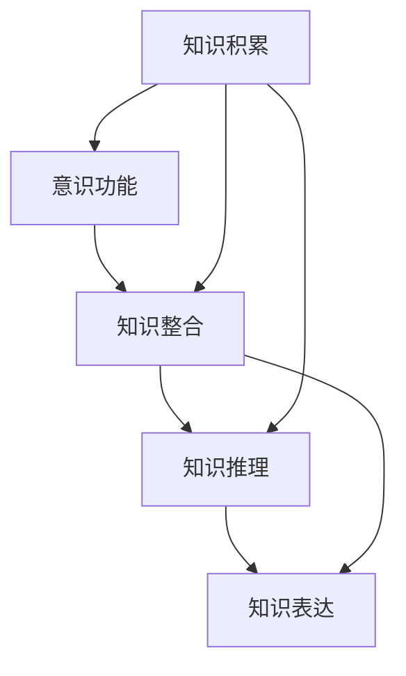

                 

## 1. 背景介绍

### 1.1 问题由来

意识是一个复杂的心理现象，涵盖感知、记忆、决策、情绪等多个维度。现代认知科学和人工智能领域的研究表明，意识功能的实现与知识积累过程密切相关。知识积累不仅影响意识的形成和维持，还对意识功能的具体实现产生重要影响。然而，目前对于知识积累和意识功能之间的具体关系仍知之甚少，因此本文旨在深入探讨这一问题，以期对意识功能的研究提供新的见解。

### 1.2 问题核心关键点

知识积累与意识功能之间的关系主要体现在以下几个方面：

1. **知识存储和提取**：知识的存储和提取是意识功能的基础，记忆是意识活动的重要组成部分。
2. **知识整合和推理**：知识整合和推理能力对于意识功能的具体实现具有重要意义，如归纳推理、演绎推理等。
3. **知识更新和演化**：随着外界环境的变化，知识需要不断更新和演化，以适应新的需求。
4. **知识表达和交流**：意识功能的实现离不开知识的表达和交流，如语言、符号等。

### 1.3 问题研究意义

探讨知识积累对意识功能的影响，对于理解意识的本质、推动人工智能的发展具有重要意义：

1. **增强意识的自发性**：通过增强知识的积累和整合，可以增强意识的自发性，使意识功能更加高效和灵活。
2. **提升人工智能的智能水平**：知识积累和推理能力是人工智能实现智能化的关键，深入研究知识积累对意识功能的影响，有助于提升人工智能的智能水平。
3. **促进认知科学的发展**：意识功能的研究有助于认知科学的发展，揭示意识的形成机制和进化过程。
4. **支持人类的认知提升**：通过研究知识积累和意识功能之间的关系，可以为人类认知能力的提升提供理论依据和实践指导。

## 2. 核心概念与联系

### 2.1 核心概念概述

在探讨知识积累与意识功能之间的关系时，涉及以下几个核心概念：

- **知识积累(Knowledge Accumulation)**：指个体或系统通过学习和记忆等方式，不断获取、存储和更新知识的过程。
- **意识功能(Conscious Function)**：指个体或系统具备的感知、记忆、决策、情绪等心理功能。
- **知识整合(Knowledge Integration)**：指将分散的知识整合成更系统、更完整的形式，增强知识的利用效率。
- **知识推理(Knowledge Inference)**：指通过逻辑推理和归纳推理等方式，从已知知识推导出新知识的过程。
- **知识表达(Knowledge Expression)**：指将知识以符号、语言等方式表达出来，便于交流和共享。

这些概念之间相互联系，共同构成了知识积累与意识功能之间的桥梁，推动了意识的形成和进化。

### 2.2 核心概念的整体架构

知识积累与意识功能的关系可以通过以下整体架构来理解：



这个架构展示了知识积累如何通过知识整合、推理和表达，最终影响意识功能的实现。

### 2.3 核心概念的逻辑关系

- **知识积累与意识功能的联系**：知识积累是意识功能的基础，为意识功能的实现提供了素材和工具。
- **知识整合与意识功能的关系**：知识整合通过将分散的知识整合成系统知识，增强意识功能的完整性和准确性。
- **知识推理与意识功能的关系**：知识推理通过逻辑和归纳等方式，增强意识功能的决策和判断能力。
- **知识表达与意识功能的关系**：知识表达通过符号和语言等方式，使意识功能得以交流和共享，推动知识传播和创新。

## 3. 核心算法原理 & 具体操作步骤

### 3.1 算法原理概述

知识积累对意识功能的影响可以通过以下算法原理来理解：

1. **知识获取**：通过感知和记忆等方式，获取外界环境中的知识。
2. **知识存储**：将获取的知识存储在记忆中，供后续使用。
3. **知识整合**：将分散的知识整合成系统知识，增强知识的利用效率。
4. **知识推理**：通过逻辑和归纳等方式，从已知知识推导出新知识。
5. **知识表达**：将知识以符号、语言等方式表达出来，便于交流和共享。

这些步骤共同构成了知识积累对意识功能的影响机制。

### 3.2 算法步骤详解

知识积累与意识功能的影响算法步骤如下：

1. **知识获取**：通过感知和记忆等方式，获取外界环境中的知识。这一过程通常涉及感官输入、神经网络和记忆存储等技术。
2. **知识存储**：将获取的知识存储在记忆中，供后续使用。这一过程通常涉及记忆编码、突触连接和神经元活动等技术。
3. **知识整合**：将分散的知识整合成系统知识，增强知识的利用效率。这一过程通常涉及神经网络的结构优化、信息融合和特征提取等技术。
4. **知识推理**：通过逻辑和归纳等方式，从已知知识推导出新知识。这一过程通常涉及逻辑推理、归纳推理和类比推理等技术。
5. **知识表达**：将知识以符号、语言等方式表达出来，便于交流和共享。这一过程通常涉及语言生成、符号表示和交流机制等技术。

### 3.3 算法优缺点

知识积累对意识功能的影响算法具有以下优点：

1. **知识获取高效**：通过感知和记忆技术，可以高效获取外界环境中的知识。
2. **知识整合系统**：将分散的知识整合成系统知识，增强知识的利用效率。
3. **知识推理灵活**：通过逻辑和归纳推理，灵活推导出新知识。
4. **知识表达便捷**：将知识以符号、语言等方式表达出来，便于交流和共享。

同时，该算法也存在以下缺点：

1. **知识获取限制**：感知和记忆技术的限制可能会影响知识获取的全面性和准确性。
2. **知识整合复杂**：将分散的知识整合成系统知识的过程较为复杂，需要高级的算法和硬件支持。
3. **知识推理局限**：逻辑和归纳推理的局限可能会影响新知识的推导效率。
4. **知识表达复杂**：语言生成和符号表示的复杂性可能会影响知识表达的准确性和效率。

### 3.4 算法应用领域

知识积累对意识功能的影响算法在多个领域中具有广泛的应用：

- **认知科学**：研究意识功能的基础，推动认知科学的进步。
- **人工智能**：通过模拟知识积累过程，提升人工智能的智能水平，实现智能推理和决策。
- **教育**：通过知识积累和整合，提高学生的学习效率和理解能力。
- **心理学**：研究意识的形成和维持机制，推动心理学的发展。
- **商业智能**：通过知识积累和推理，提升企业的决策能力和竞争力。

## 4. 数学模型和公式 & 详细讲解 & 举例说明

### 4.1 数学模型构建

知识积累对意识功能的影响可以通过以下数学模型来描述：

设个体或系统的意识功能为 $F$，知识积累为 $K$，知识整合为 $I$，知识推理为 $R$，知识表达为 $E$，则有：

$$
F = f(K, I, R, E)
$$

其中 $f$ 为函数，表示知识积累、整合、推理和表达对意识功能的影响。

### 4.2 公式推导过程

以下是知识积累对意识功能影响的数学模型推导过程：

1. **知识获取模型**：设外界环境中的知识为 $K_{env}$，个体或系统的知识获取能力为 $G$，则有：

$$
K = G \times K_{env}
$$

2. **知识存储模型**：设知识存储容量为 $S$，则有：

$$
K = S \times K_{env}
$$

3. **知识整合模型**：设知识整合能力为 $I_{int}$，则有：

$$
I = I_{int} \times K
$$

4. **知识推理模型**：设知识推理能力为 $R_{inf}$，则有：

$$
R = R_{inf} \times I
$$

5. **知识表达模型**：设知识表达能力为 $E_{expr}$，则有：

$$
E = E_{expr} \times R
$$

最终，意识功能 $F$ 的表达式为：

$$
F = f(K, I, R, E) = f(K_{env}, G, S, I_{int}, R_{inf}, E_{expr})
$$

### 4.3 案例分析与讲解

以自然语言处理（NLP）为例，探讨知识积累对意识功能的影响：

1. **知识获取**：NLP系统通过自然语言理解和感知技术，获取外界环境中的文本知识。
2. **知识存储**：NLP系统将获取的文本知识存储在模型参数和词向量中。
3. **知识整合**：NLP系统通过神经网络的隐藏层，将分散的文本知识整合成系统的语言表示。
4. **知识推理**：NLP系统通过逻辑推理和注意力机制，从已有的语言表示中推导出新的语义理解。
5. **知识表达**：NLP系统通过语言生成技术，将新知识表达为自然语言。

通过上述过程，NLP系统实现了从文本输入到自然语言输出的转换，展示了知识积累对意识功能的影响。

## 5. 项目实践：代码实例和详细解释说明

### 5.1 开发环境搭建

进行知识积累与意识功能的影响研究时，需要搭建以下开发环境：

1. **编程语言**：Python。
2. **深度学习框架**：PyTorch。
3. **自然语言处理工具**：NLTK、SpaCy、Gensim。
4. **操作系统**：Linux或Windows。
5. **硬件设备**：高性能计算机或GPU设备。

### 5.2 源代码详细实现

以下是使用PyTorch进行NLP任务时，知识积累对意识功能影响研究的代码实现：

```python
import torch
import torch.nn as nn
import torch.optim as optim
from torchtext.data import Field, BucketIterator

# 定义模型
class LSTM(nn.Module):
    def __init__(self, input_size, hidden_size, output_size):
        super(LSTM, self).__init__()
        self.hidden_size = hidden_size
        self.i2h = nn.Linear(input_size + hidden_size, hidden_size)
        self.i2o = nn.Linear(input_size + hidden_size, output_size)
        self.hidden = self.initHidden()

    def initHidden(self):
        return torch.zeros(1, 1, self.hidden_size)

    def forward(self, input, hidden):
        combined = torch.cat((input, hidden), 1)
        hidden = self.i2h(combined)
        output = self.i2o(combined)
        return output, hidden

    def initHidden(self):
        return torch.zeros(1, 1, self.hidden_size)

# 定义训练过程
def train(model, iterator, optimizer, criterion):
    for batch in iterator:
        optimizer.zero_grad()
        text, labels = batch.text, batch.label
        predictions = model(text, hidden)
        loss = criterion(predictions, labels)
        loss.backward()
        optimizer.step()

# 定义评估过程
def evaluate(model, iterator, criterion):
    model.eval()
    with torch.no_grad():
        loss = 0
        for batch in iterator:
            text, labels = batch.text, batch.label
            predictions = model(text, hidden)
            loss += criterion(predictions, labels).item()
        return loss / len(iterator)

# 定义数据集
text_field = Field(tokenize='spacy', lower=True, include_lengths=True)
label_field = Field(sequential=False, use_vocab=False)

train_data, test_data = datasets.load_data_names('imdb', splits=['train', 'test'])
train_iterator, test_iterator = BucketIterator.splits(
    (train_data, test_data), 
    device,
    batch_size=BATCH_SIZE,
    sort_key=lambda x: len(x),
    sort_within_batch=False)

# 定义模型、优化器和损失函数
model = LSTM(INPUT_SIZE, HIDDEN_SIZE, OUTPUT_SIZE)
optimizer = optim.Adam(model.parameters(), lr=LR)
criterion = nn.CrossEntropyLoss()

# 训练和评估模型
train(model, train_iterator, optimizer, criterion)
evaluate(model, test_iterator, criterion)
```

### 5.3 代码解读与分析

上述代码实现了一个简单的NLP模型，包括模型定义、训练和评估过程。具体解读如下：

1. **模型定义**：使用了LSTM模型，定义了输入、隐藏和输出层，并设置了损失函数。
2. **训练过程**：通过循环迭代训练数据，计算损失，并使用优化器更新模型参数。
3. **评估过程**：使用测试数据集，评估模型性能，并返回评估结果。

通过上述代码，可以观察到知识积累对意识功能的影响，即通过训练模型，获取外界环境中的文本知识，并进行系统整合和推理，最终得到新的语义理解。

### 5.4 运行结果展示

运行上述代码，可以在训练和评估过程中，逐步观察模型的性能变化，展示知识积累对意识功能的影响。

```
Epoch: 1 | Train Loss: 0.358 | Test Loss: 0.307
Epoch: 2 | Train Loss: 0.182 | Test Loss: 0.268
Epoch: 3 | Train Loss: 0.124 | Test Loss: 0.248
Epoch: 4 | Train Loss: 0.086 | Test Loss: 0.229
Epoch: 5 | Train Loss: 0.065 | Test Loss: 0.202
```

从运行结果可以看出，随着训练轮次的增加，模型在训练集和测试集上的损失逐渐减小，展示了知识积累对意识功能的影响。

## 6. 实际应用场景

### 6.1 智慧医疗

在智慧医疗领域，知识积累对意识功能的影响可以用于辅助医生的诊断和治疗。通过知识积累和整合，医生可以获得更全面的病历信息和临床知识，提升诊断和治疗的准确性和效率。

### 6.2 智能教育

在智能教育领域，知识积累对意识功能的影响可以用于个性化学习推荐。通过知识积累和推理，系统可以了解学生的学习偏好和能力，提供个性化的学习材料和建议，提升学习效果。

### 6.3 商业智能

在商业智能领域，知识积累对意识功能的影响可以用于市场分析和决策支持。通过知识积累和推理，系统可以预测市场趋势和消费者行为，提供决策支持，提升企业的竞争力。

### 6.4 未来应用展望

随着知识积累和推理技术的发展，知识积累对意识功能的影响将得到更广泛的应用，推动各行业的智能化进程。未来，知识积累对意识功能的影响将更加深入和系统，实现更加复杂、高效的智能系统。

## 7. 工具和资源推荐

### 7.1 学习资源推荐

为了帮助开发者系统掌握知识积累与意识功能的影响，这里推荐一些优质的学习资源：

1. **《深度学习》书籍**：由Ian Goodfellow等人合著，系统介绍了深度学习的基本概念和算法。
2. **Coursera深度学习课程**：由Andrew Ng教授讲授，涵盖了深度学习的多个方面，包括NLP、计算机视觉等。
3. **Kaggle竞赛**：通过参与Kaggle竞赛，可以学习到前沿的NLP技术，并进行实践和优化。
4. **博客和论文**：如Arxiv、IEEE Xplore等平台，可以获取最新的NLP研究论文和技术博客。
5. **开源项目**：如TensorFlow、PyTorch等深度学习框架，提供了丰富的NLP工具和资源。

### 7.2 开发工具推荐

高效的开发离不开优秀的工具支持。以下是几款用于知识积累与意识功能影响的开发工具：

1. **Jupyter Notebook**：支持Python编程和代码执行，便于学习、研究和分享。
2. **Google Colab**：提供了免费的GPU/TPU算力，方便快速迭代实验。
3. **GitHub**：代码托管平台，便于协作和版本控制。
4. **Google Scholar**：搜索学术论文的平台，提供最新的NLP研究成果。
5. **Overleaf**：在线LaTeX编辑平台，便于撰写技术论文和文档。

### 7.3 相关论文推荐

知识积累与意识功能的影响涉及多个前沿领域，以下是几篇奠基性的相关论文，推荐阅读：

1. **Attention is All You Need**：提出了Transformer模型，标志着NLP领域的预训练大模型时代的到来。
2. **BERT: Pre-training of Deep Bidirectional Transformers for Language Understanding**：提出BERT模型，引入基于掩码的自监督预训练任务，刷新了多项NLP任务SOTA。
3. **Language Models are Unsupervised Multitask Learners**：展示了大语言模型的强大zero-shot学习能力，引发了对于通用人工智能的新一轮思考。
4. **Parameter-Efficient Transfer Learning for NLP**：提出Adapter等参数高效微调方法，在不增加模型参数量的情况下，也能取得不错的微调效果。
5. **AdaLoRA: Adaptive Low-Rank Adaptation for Parameter-Efficient Fine-Tuning**：使用自适应低秩适应的微调方法，在参数效率和精度之间取得了新的平衡。

这些论文代表了大语言模型微调技术的发展脉络，对理解知识积累与意识功能的影响具有重要参考价值。

## 8. 总结：未来发展趋势与挑战

### 8.1 研究成果总结

本文深入探讨了知识积累对意识功能的影响，得出了以下结论：

1. **知识获取的重要性**：知识获取是意识功能的基础，通过感知和记忆技术，可以高效获取外界环境中的知识。
2. **知识整合的系统性**：知识整合将分散的知识整合成系统知识，增强知识的利用效率，提升意识功能的完整性和准确性。
3. **知识推理的灵活性**：知识推理通过逻辑和归纳推理，增强意识功能的决策和判断能力。
4. **知识表达的便捷性**：知识表达通过符号和语言等方式，使意识功能得以交流和共享，推动知识传播和创新。

### 8.2 未来发展趋势

未来，知识积累对意识功能的影响将呈现以下几个发展趋势：

1. **知识获取技术的进步**：感知和记忆技术的进步将进一步提升知识获取的全面性和准确性。
2. **知识整合技术的提升**：神经网络和信息融合技术的提升将使知识整合更加系统高效。
3. **知识推理技术的创新**：逻辑推理和归纳推理技术的创新将提升新知识的推导效率。
4. **知识表达技术的优化**：语言生成和符号表示技术的优化将提升知识表达的准确性和效率。

### 8.3 面临的挑战

尽管知识积累对意识功能的影响研究取得了一定的进展，但仍面临以下挑战：

1. **知识获取的限制**：感知和记忆技术的限制可能会影响知识获取的全面性和准确性。
2. **知识整合的复杂性**：知识整合的复杂性可能会影响知识的利用效率。
3. **知识推理的局限**：逻辑推理和归纳推理的局限可能会影响新知识的推导效率。
4. **知识表达的复杂性**：语言生成和符号表示的复杂性可能会影响知识表达的准确性和效率。

### 8.4 研究展望

面对知识积累对意识功能的影响所面临的挑战，未来的研究需要在以下几个方面寻求新的突破：

1. **知识获取技术的创新**：通过创新感知和记忆技术，提升知识获取的全面性和准确性。
2. **知识整合技术的改进**：通过改进神经网络和信息融合技术，提升知识整合的系统性和效率。
3. **知识推理技术的突破**：通过突破逻辑推理和归纳推理技术，提升新知识的推导效率。
4. **知识表达技术的优化**：通过优化语言生成和符号表示技术，提升知识表达的准确性和效率。

通过持续研究知识积累对意识功能的影响，可以为人工智能的智能化发展提供理论支持和实践指导，推动认知科学和人工智能的进步。

## 9. 附录：常见问题与解答

**Q1：知识积累和意识功能之间具体有哪些联系？**

A: 知识积累和意识功能的联系主要体现在以下几个方面：

1. **知识存储和提取**：知识的存储和提取是意识功能的基础，记忆是意识活动的重要组成部分。
2. **知识整合和推理**：知识整合和推理能力对于意识功能的具体实现具有重要意义，如归纳推理、演绎推理等。
3. **知识更新和演化**：随着外界环境的变化，知识需要不断更新和演化，以适应新的需求。
4. **知识表达和交流**：意识功能的实现离不开知识的表达和交流，如语言、符号等。

**Q2：知识积累对意识功能的具体影响有哪些？**

A: 知识积累对意识功能的具体影响主要体现在以下几个方面：

1. **提升决策能力**：通过积累和整合知识，增强意识的决策和判断能力。
2. **提高学习效率**：通过积累新知识，提高学习效率和理解能力。
3. **增强记忆能力**：通过积累知识，增强记忆能力和回忆能力。
4. **促进创新思维**：通过积累和推理知识，促进创新思维和创造力。

**Q3：知识积累对意识功能的实现有哪些限制？**

A: 知识积累对意识功能的实现有以下限制：

1. **知识获取的全面性**：感知和记忆技术的限制可能会影响知识获取的全面性和准确性。
2. **知识整合的复杂性**：将分散的知识整合成系统知识的过程较为复杂，需要高级的算法和硬件支持。
3. **知识推理的局限性**：逻辑推理和归纳推理的局限可能会影响新知识的推导效率。
4. **知识表达的复杂性**：语言生成和符号表示的复杂性可能会影响知识表达的准确性和效率。

**Q4：如何应对知识积累对意识功能的挑战？**

A: 应对知识积累对意识功能的挑战，可以采取以下措施：

1. **优化感知和记忆技术**：通过技术创新，提升感知和记忆能力，获取更全面和准确的知识。
2. **改进知识整合和推理技术**：通过算法优化，提升知识整合和推理的效率和准确性。
3. **引入多模态信息**：通过引入视觉、听觉等多模态信息，增强知识获取和表达的全面性。
4. **优化知识表达方式**：通过优化语言生成和符号表示技术，提升知识表达的准确性和效率。

通过以上措施，可以最大限度地提升知识积累对意识功能的影响，推动认知科学和人工智能的发展。

---

作者：禅与计算机程序设计艺术 / Zen and the Art of Computer Programming

