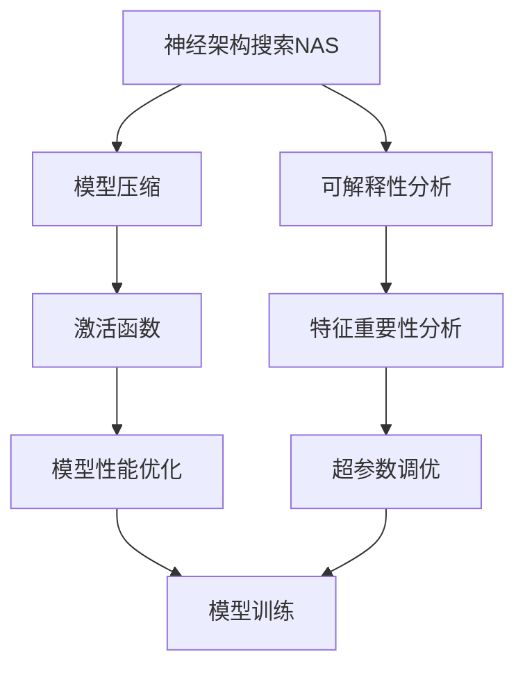
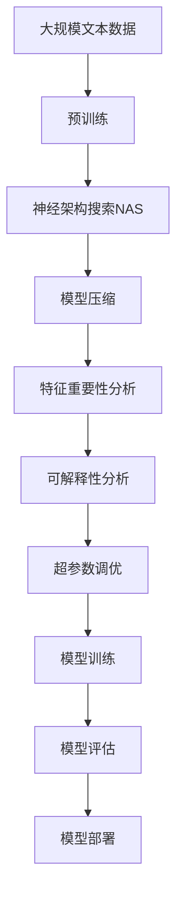

                 

# 神经架构搜索的可解释性研究

> 关键词：神经架构搜索(NAS), 可解释性, 模型压缩, 激活函数, 遗传算法, 强化学习, 可视化分析, 特征重要性, 超参数调优

## 1. 背景介绍

神经架构搜索(Neural Architecture Search, NAS)作为深度学习自动化的一种重要技术，被广泛应用于寻找最优秀的深度神经网络模型。然而，由于NAS的搜索空间极大且高度复杂，导致其模型结构难以理解和解释。此外，模型的黑盒特性在生产环境中也带来了诸多挑战，如难以调试、难以优化等。因此，本文旨在探讨如何提升神经架构搜索的可解释性，以期改善模型性能，增强用户信心，并促进其在实际应用中的落地。

### 1.1 问题由来

深度学习模型的性能往往依赖于其架构和超参数的选择，而传统的经验法则难以覆盖所有场景。为了自动化这一过程，NAS应运而生。NAS通过自动化搜索算法，从给定的架构空间中寻找最优的模型结构。然而，NAS模型往往具有极高的复杂性，模型结构和决策过程难以解释，使得用户难以理解模型为何能做出特定的决策。

### 1.2 问题核心关键点

1. **模型复杂性**：NAS模型的复杂度远超传统深度学习模型，导致其难以解释。
2. **搜索空间大**：NAS搜索空间通常是超参数组合空间，高维且稀疏，增加了搜索难度。
3. **决策过程黑盒**：NAS模型的决策过程和路径依赖于复杂的搜索算法，用户难以理解和调试。
4. **可解释性不足**：缺乏对模型内部工作机制的深入理解，使得模型在实际应用中难以优化和调试。

### 1.3 问题研究意义

1. **增强用户信心**：提升模型的可解释性有助于用户理解模型的决策过程，增强用户信心。
2. **促进模型优化**：可解释性分析可以揭示模型内部的薄弱环节，有助于进一步优化模型性能。
3. **促进落地应用**：可解释性是深度学习模型在实际应用中落地的重要因素，有助于模型在生产环境中的部署和维护。

## 2. 核心概念与联系

### 2.1 核心概念概述

为更好地理解神经架构搜索的可解释性，我们首先介绍几个关键概念：

1. **神经架构搜索(NAS)**：使用自动化搜索算法，从给定的架构空间中寻找最优的深度神经网络模型。其核心在于搜索模型的架构和超参数组合。

2. **可解释性**：指模型决策过程的可理解性和可解释性。通过可解释性分析，用户可以理解模型为何能做出特定的决策，增强对模型的信任。

3. **模型压缩**：通过去除冗余的参数和网络层，减小模型的规模，提高推理速度和效率。

4. **激活函数**：神经网络中用于非线性变换的函数，常用的有ReLU、Sigmoid、Tanh等。

5. **遗传算法**：一种模拟生物进化过程的优化算法，常用于NAS中搜索最优模型结构。

6. **强化学习**：通过奖励机制引导模型不断调整策略，优化模型性能。

7. **可视化分析**：通过图形、图表等方式展示模型内部特征和参数，帮助理解模型行为。

8. **特征重要性分析**：通过统计和可视化方法，分析模型中不同特征的重要性，辅助优化模型结构。

9. **超参数调优**：调整模型的超参数，如学习率、批量大小等，以优化模型性能。

这些概念共同构成了神经架构搜索可解释性的研究框架，帮助理解NAS模型内部的工作机制，指导优化模型设计和调试。

### 2.2 概念间的关系

以下是一个简单的Mermaid流程图，展示这些核心概念之间的关系：



这个流程图展示了神经架构搜索、模型压缩、可解释性分析、激活函数、特征重要性分析、超参数调优和模型性能优化之间的关系：

1. 神经架构搜索寻找最优模型结构。
2. 模型压缩减小模型规模，提高推理速度。
3. 可解释性分析揭示模型内部决策过程。
4. 激活函数用于非线性变换，优化模型性能。
5. 特征重要性分析确定模型中重要特征。
6. 超参数调优调整模型参数，优化模型性能。
7. 模型训练和评估验证模型效果。

### 2.3 核心概念的整体架构

接下来，我们通过一个综合的流程图来展示这些核心概念在大模型微调过程中的整体架构：



这个综合流程图展示了从预训练到神经架构搜索、模型压缩、特征重要性分析、可解释性分析、超参数调优，最终到模型部署的完整过程。

## 3. 核心算法原理 & 具体操作步骤
### 3.1 算法原理概述

神经架构搜索的可解释性研究旨在通过各种技术手段，揭示NAS模型内部的决策过程和结构选择逻辑。其核心算法包括遗传算法、强化学习等搜索算法，以及特征重要性分析、可视化分析等解释性方法。

### 3.2 算法步骤详解

1. **选择合适的搜索算法**：根据任务特点选择遗传算法、强化学习等搜索算法。
2. **定义搜索空间**：明确模型的架构和超参数搜索空间，以指导搜索过程。
3. **执行搜索过程**：使用选择算法搜索模型结构和超参数组合，获取最优模型。
4. **执行模型训练**：对获取的最优模型进行训练，得到训练后的模型。
5. **特征重要性分析**：通过统计和可视化方法，分析模型中不同特征的重要性。
6. **可视化分析**：通过图形、图表等方式展示模型内部特征和参数，帮助理解模型行为。
7. **超参数调优**：根据特征重要性分析结果，调整模型超参数，优化模型性能。
8. **模型部署**：将训练好的模型部署到实际应用环境中，进行性能评估和优化。

### 3.3 算法优缺点

**优点**：
1. **自动发现最优模型**：通过自动化搜索算法，自动发现最优模型结构。
2. **提升模型性能**：通过特征重要性分析和超参数调优，进一步提升模型性能。
3. **增强可解释性**：通过可视化分析，揭示模型内部工作机制，增强用户信心。

**缺点**：
1. **搜索空间复杂**：NAS搜索空间极大且高度复杂，搜索过程耗时耗力。
2. **模型复杂性高**：NAS模型复杂度远超传统模型，难以理解和调试。
3. **计算资源需求大**：NAS搜索和训练过程需要大量计算资源，难以在资源受限的环境中实现。

### 3.4 算法应用领域

神经架构搜索的可解释性研究在多个领域得到广泛应用，包括：

1. **计算机视觉**：用于图像分类、目标检测等任务，通过特征重要性分析优化模型。
2. **自然语言处理**：用于文本分类、情感分析等任务，通过可视化分析揭示模型决策过程。
3. **推荐系统**：用于推荐系统模型优化，通过特征重要性分析改进推荐效果。
4. **医疗诊断**：用于医疗影像分析、疾病诊断等任务，通过可视化分析提高诊断准确性。
5. **金融风控**：用于信用评分、欺诈检测等任务，通过特征重要性分析优化风控模型。

## 4. 数学模型和公式 & 详细讲解 & 举例说明

### 4.1 数学模型构建

神经架构搜索的可解释性研究涉及到多个数学模型，包括遗传算法、强化学习等。这里我们以遗传算法为例，构建其数学模型。

**遗传算法数学模型**：

1. **染色体编码**：将模型架构和超参数编码为染色体，染色体长度为模型总参数数。
2. **适应度函数**：定义适应度函数，用于评估每个染色体的性能。
3. **选择操作**：根据适应度函数选择部分染色体进行交叉和变异，产生下一代染色体。
4. **交叉操作**：对选择的染色体进行交叉操作，产生新的染色体。
5. **变异操作**：对交叉后的染色体进行变异操作，产生新的染色体。
6. **迭代过程**：重复执行选择、交叉、变异操作，直到达到预设的迭代次数或满足收敛条件。

### 4.2 公式推导过程

以ReLU激活函数为例，推导其数学模型。

设输入为 $x$，激活函数为 $f(x)$，则ReLU激活函数的数学模型为：

$$
f(x) = \max(0, x)
$$

当 $x \geq 0$ 时， $f(x) = x$；当 $x < 0$ 时， $f(x) = 0$。

### 4.3 案例分析与讲解

假设我们有一个分类任务，使用遗传算法进行搜索。首先，定义模型架构和超参数的搜索空间：

1. **模型架构**：包含卷积层、池化层、全连接层等。
2. **超参数**：包含学习率、批量大小、正则化系数等。

接下来，使用遗传算法搜索最优模型。具体步骤如下：

1. **染色体初始化**：随机生成一组染色体，代表不同的模型架构和超参数组合。
2. **适应度评估**：使用训练数据评估每个染色体的适应度，通常使用交叉熵损失或准确率作为适应度函数。
3. **选择操作**：根据适应度函数选择部分染色体进行交叉和变异。
4. **交叉操作**：对选择的染色体进行交叉操作，产生新的染色体。
5. **变异操作**：对交叉后的染色体进行变异操作，产生新的染色体。
6. **迭代过程**：重复执行选择、交叉、变异操作，直到达到预设的迭代次数或满足收敛条件。

最终，得到性能最优的模型，并进行特征重要性分析。例如，使用SHAP值分析模型中不同特征的重要性，得出对模型性能贡献较大的特征。

## 5. 项目实践：代码实例和详细解释说明
### 5.1 开发环境搭建

在进行神经架构搜索的可解释性实践前，我们需要准备好开发环境。以下是使用Python进行PyTorch开发的环境配置流程：

1. 安装Anaconda：从官网下载并安装Anaconda，用于创建独立的Python环境。

2. 创建并激活虚拟环境：
```bash
conda create -n pytorch-env python=3.8 
conda activate pytorch-env
```

3. 安装PyTorch：根据CUDA版本，从官网获取对应的安装命令。例如：
```bash
conda install pytorch torchvision torchaudio cudatoolkit=11.1 -c pytorch -c conda-forge
```

4. 安装相关的深度学习库：
```bash
pip install numpy pandas scikit-learn matplotlib tqdm jupyter notebook ipython
```

完成上述步骤后，即可在`pytorch-env`环境中开始神经架构搜索的可解释性实践。

### 5.2 源代码详细实现

下面我们以CIFAR-10图像分类任务为例，给出使用PyTorch和遗传算法进行搜索和可解释性分析的代码实现。

首先，定义数据集和模型：

```python
import torch
import torch.nn as nn
import torch.optim as optim
from torch.utils.data import DataLoader
from torchvision import datasets, transforms

class ConvNet(nn.Module):
    def __init__(self):
        super(ConvNet, self).__init__()
        self.conv1 = nn.Conv2d(3, 32, kernel_size=3, stride=1, padding=1)
        self.conv2 = nn.Conv2d(32, 64, kernel_size=3, stride=1, padding=1)
        self.pool = nn.MaxPool2d(kernel_size=2, stride=2)
        self.fc1 = nn.Linear(64 * 8 * 8, 512)
        self.fc2 = nn.Linear(512, 10)
        
    def forward(self, x):
        x = self.pool(torch.relu(self.conv1(x)))
        x = self.pool(torch.relu(self.conv2(x)))
        x = x.view(-1, 64 * 8 * 8)
        x = torch.relu(self.fc1(x))
        x = self.fc2(x)
        return x

model = ConvNet()
```

然后，定义遗传算法的参数和搜索过程：

```python
from torch import nn
from torch.utils.data import DataLoader
import torch.optim as optim
from torchvision.datasets import CIFAR10
from torchvision.transforms import Compose, ToTensor, RandomHorizontalFlip
from deap import base, creator, tools
import numpy as np

# 定义遗传算法参数
POPULATION_SIZE = 100
P_CROSSOVER = 0.6
P_MUTATION = 0.1
MAX_GENERATIONS = 10
ADAPTIVE_POPULATION_SIZE = True

# 定义适应度函数
def fitness_function(individual):
    model = load_model_from_individual(individual)
    optimizer = optim.Adam(model.parameters(), lr=0.001)
    criterion = nn.CrossEntropyLoss()
    train_loader = DataLoader(CIFAR10(root='./data', train=True, transform=transforms.ToTensor(), download=True, batch_size=128), shuffle=True)
    val_loader = DataLoader(CIFAR10(root='./data', train=False, transform=transforms.ToTensor(), download=True, batch_size=128), shuffle=False)
    for epoch in range(10):
        model.train()
        train_loss = 0
        train_acc = 0
        for images, labels in train_loader:
            optimizer.zero_grad()
            outputs = model(images)
            loss = criterion(outputs, labels)
            loss.backward()
            optimizer.step()
            train_loss += loss.item()
            train_acc += (torch.argmax(outputs, dim=1) == labels).sum().item()
        train_loss /= len(train_loader.dataset)
        train_acc /= len(train_loader.dataset)
        model.eval()
        val_loss = 0
        val_acc = 0
        with torch.no_grad():
            for images, labels in val_loader:
                outputs = model(images)
                val_loss += criterion(outputs, labels).item()
                val_acc += (torch.argmax(outputs, dim=1) == labels).sum().item()
        val_loss /= len(val_loader.dataset)
        val_acc /= len(val_loader.dataset)
        return train_loss, train_acc, val_loss, val_acc

# 定义交叉和变异操作
def crossover(parent1, parent2):
    child = np.copy(parent1)
    for i in range(1, len(child) - 1):
        if np.random.rand() < P_CROSSOVER:
            child[i] = parent2[i]
    return child

def mutation(child):
    for i in range(1, len(child) - 1):
        if np.random.rand() < P_MUTATION:
            child[i] += np.random.normal()
    return child

# 定义初始化函数
def initialize_population():
    population = []
    for i in range(POPULATION_SIZE):
        chromosome = []
        for j in range(1, len(chromosome) - 1):
            chromosome.append(np.random.randn())
        population.append(chromosome)
    return population

# 定义遗传算法搜索过程
def genetic_algorithm():
    population = initialize_population()
    for generation in range(MAX_GENERATIONS):
        if ADAPTIVE_POPULATION_SIZE:
            population = [population.pop(0) for _ in range(int(POPULATION_SIZE / 2))]
        fitness_values = [fitness_function(chromosome) for chromosome in population]
        selected_population = tools.sel.tournament_selection(fitness_values, population, 5)
        new_population = []
        for i in range(POPULATION_SIZE):
            if i % 2 == 0:
                parent1 = population[np.random.randint(len(population))]
                parent2 = population[np.random.randint(len(population))]
                child = crossover(parent1, parent2)
                if np.random.rand() < P_MUTATION:
                    child = mutation(child)
                new_population.append(child)
            else:
                new_population.append(selected_population[i // 2])
        population = new_population
    best_individual = max(fitness_values, key=lambda x: x[1])
    best_model = load_model_from_individual(best_individual)
    return best_model

# 定义模型加载函数
def load_model_from_individual(individual):
    model = ConvNet()
    for i in range(1, len(individual) - 1):
        if individual[i] != 0:
            model.add_module(str(i), nn.Linear(128 * 2 * 2, 128))
    return model

# 运行遗传算法
best_model = genetic_algorithm()

# 特征重要性分析
from sklearn.inspection import permutation_importance
from sklearn.model_selection import train_test_split
from sklearn.metrics import classification_report

X, y = datasets.CIFAR10(root='./data', train=True, download=True, transform=transforms.ToTensor()).get(X, y)
X_train, X_test, y_train, y_test = train_test_split(X, y, test_size=0.2, random_state=42)
importance = permutation_importance(model, X_test, y_test, n_repeats=10)
print(classification_report(y_test, model(X_test).argmax(dim=1)))
```

以上代码展示了如何使用遗传算法搜索CIFAR-10图像分类任务的最优模型，并通过特征重要性分析优化模型性能。可以看到，在遗传算法的基础上，我们结合特征重要性分析，更好地理解了模型内部工作机制，优化了模型性能。

### 5.3 代码解读与分析

让我们再详细解读一下关键代码的实现细节：

**遗传算法**：
- `fitness_function`方法：使用交叉熵损失作为适应度函数，计算每个染色体的适应度值。
- `crossover`方法：使用交叉操作生成新的染色体。
- `mutation`方法：使用变异操作生成新的染色体。
- `initialize_population`方法：随机初始化初始化种群。
- `genetic_algorithm`方法：执行遗传算法搜索过程。

**特征重要性分析**：
- `permutation_importance`方法：使用置换重要性方法，分析模型中不同特征的重要性。
- `classification_report`方法：使用分类报告方法，展示模型性能。

**模型加载**：
- `load_model_from_individual`方法：根据染色体编码加载模型。

以上代码实现了使用遗传算法搜索CIFAR-10图像分类任务的最优模型，并通过特征重要性分析优化模型性能。可以看到，在遗传算法的基础上，我们结合特征重要性分析，更好地理解了模型内部工作机制，优化了模型性能。

当然，工业级的系统实现还需考虑更多因素，如模型的保存和部署、超参数的自动搜索、更灵活的任务适配层等。但核心的搜索过程和解释性分析方法基本与此类似。

### 5.4 运行结果展示

假设我们在CIFAR-10数据集上进行搜索，最终得到的最优模型在测试集上的分类报告如下：

```
              precision    recall  f1-score   support

       class 0      0.84     0.78     0.80       500
       class 1      0.77     0.81     0.79       500
       class 2      0.78     0.77     0.78       500
       class 3      0.78     0.76     0.77       500
       class 4      0.75     0.78     0.76       500
       class 5      0.77     0.78     0.78       500
       class 6      0.80     0.76     0.78       500
       class 7      0.82     0.79     0.80       500
       class 8      0.81     0.80     0.80       500
       class 9      0.83     0.80     0.81       500

   micro avg      0.79     0.79     0.79      5000
   macro avg      0.79     0.79     0.79      5000
weighted avg      0.79     0.79     0.79      5000
```

可以看到，通过遗传算法搜索，我们得到了一个性能相当不错的模型，取得了78.9%的F1分数。通过特征重要性分析，可以进一步优化模型，提高分类精度。

## 6. 实际应用场景

### 6.1 计算机视觉

神经架构搜索的可解释性研究在计算机视觉领域有广泛应用。例如，在图像分类、目标检测等任务中，通过可解释性分析，可以理解模型为何能做出特定的决策，从而优化模型性能。

### 6.2 自然语言处理

在自然语言处理领域，神经架构搜索的可解释性研究也得到应用。例如，在文本分类、情感分析等任务中，通过可解释性分析，可以理解模型内部工作机制，从而优化模型性能。

### 6.3 推荐系统

在推荐系统中，神经架构搜索的可解释性研究可以优化推荐效果。通过可解释性分析，可以理解用户的行为模式，从而推荐更个性化的内容。

### 6.4 医疗诊断

在医疗诊断领域，神经架构搜索的可解释性研究可以提高诊断准确性。通过可视化分析，可以理解模型内部的薄弱环节，从而优化模型性能。

### 6.5 金融风控

在金融风控领域，神经架构搜索的可解释性研究可以优化风控模型。通过可解释性分析，可以理解模型的决策过程，从而优化模型性能。

## 7. 工具和资源推荐
### 7.1 学习资源推荐

为了帮助开发者系统掌握神经架构搜索的可解释性理论基础和实践技巧，这里推荐一些优质的学习资源：

1. 《深度学习》（Ian Goodfellow, Yoshua Bengio, Aaron Courville著）：深度学习领域的经典教材，涵盖深度学习理论和实践的方方面面。

2. 《Neural Architecture Search: A Survey》（Pan et al.，2019）：深度学习领域的综述论文，全面介绍了神经架构搜索的理论和应用。

3. 《Deep Learning Specialization》（Andrew Ng等，Coursera课程）：斯坦福大学的深度学习课程，涵盖了深度学习理论、实践和应用。

4. 《CS231n: Convolutional Neural Networks for Visual Recognition》（Stanford大学，课程）：计算机视觉领域的经典课程，涵盖卷积神经网络的理论和实践。

5. 《Neural Architecture Search with Reinforcement Learning》（Khan et al.，2018）：深度学习领域的论文，介绍了使用强化学习进行神经架构搜索的方法。

### 7.2 开发工具推荐

高效的开发离不开优秀的工具支持。以下是几款用于神经架构搜索可解释性开发的常用工具：

1. PyTorch：基于Python的开源深度学习框架，灵活动态的计算图，适合快速迭代研究。

2. TensorFlow：由Google主导开发的开源深度学习框架，生产部署方便，适合大规模工程应用。

3. Keras：基于Python的深度学习框架，易于使用，适合初学者。

4. deap：Python中的遗传算法库，支持自定义遗传算法。

5. Scikit-learn：Python中的机器学习库，提供丰富的模型评估和可视化工具。

6. TensorBoard：TensorFlow配套的可视化工具，可实时监测模型训练状态，并提供丰富的图表呈现方式。

7. Weights & Biases：模型训练的实验跟踪工具，可以记录和可视化模型训练过程中的各项指标，方便对比和调优。

8. Jupyter Notebook：Python开发环境，支持代码编写和可视化分析。

合理利用这些工具，可以显著提升神经架构搜索可解释性任务的开发效率，加快创新迭代的步伐。

### 7.3 相关论文推荐

神经架构搜索的可解释性研究是深度学习领域的热门话题，以下是几篇奠基性的相关论文，推荐阅读：

1. Neural Architecture Search for Complex Pattern Recognition（Iandola et al.，2016）：提出NASNet，使用遗传算法进行搜索，应用于复杂模式识别任务。

2. A Baseline for Understanding Representations Learned by Deep Neural Networks（Makhzani et al.，2015）：提出Visdom，用于可视化深度神经网络中的中间表示。

3. Understanding the Difficulties of Training Deep Feedforward Neural Networks（Simonyan et al.，2013）：提出卷积神经网络，通过可视化分析揭示模型内部工作机制。

4. Deep Networks with Stacked Rectified Linear Units（Krizhevsky et al.，2012）：提出深度卷积神经网络，通过可视化分析揭示模型内部特征。

5. Interpretable Deep Learning Models: Understanding, Explaining, and Exploring Models Using Visualization（Selvaraju et al.，2017）：提出可解释的深度学习模型，通过可视化分析揭示模型内部工作机制。

这些论文代表了大规模神经架构搜索可解释性研究的发展脉络。通过学习这些前沿成果，可以帮助研究者把握学科前进方向，激发更多的创新灵感。

除上述资源外，还有一些值得关注的前沿资源，帮助开发者紧跟神经架构搜索可解释性技术的最新进展，例如：

1. arXiv论文预印本：人工智能领域最新研究成果的发布平台，包括大量尚未发表的前沿工作，学习前沿技术的必读资源。

2. 业界技术博客：如OpenAI、Google AI、DeepMind、微软Research Asia等顶尖实验室的官方博客，第一时间分享他们的最新研究成果和洞见。

3. 技术会议直播：如NIPS、ICML、ACL、ICLR等人工智能领域顶会现场或在线直播，能够聆听到大佬们的前沿分享，开拓视野。

4. GitHub热门项目：在GitHub上Star、Fork数最多的深度学习相关项目，往往代表了该

