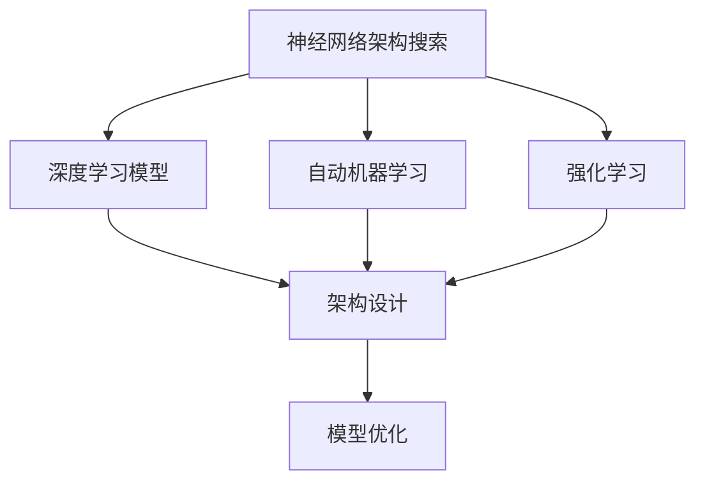

                 

# 神经网络架构搜索NAS原理与代码实战案例讲解

> 关键词：神经网络架构搜索(NAS)，深度学习模型，架构设计，自动机器学习(AutoML)，强化学习，深度学习，机器学习，代码实现，实战案例

## 1. 背景介绍

### 1.1 问题由来

随着深度学习技术的迅猛发展，神经网络模型（Neural Networks）在计算机视觉、自然语言处理、语音识别等众多领域取得了令人瞩目的成果。然而，构建一个性能优异的深度学习模型，往往需要大量的人力和时间，特别是在模型架构的设计与优化方面。为了提升模型的开发效率和性能，神经网络架构搜索（Neural Architecture Search, NAS）技术应运而生。

### 1.2 问题核心关键点

NAS技术通过自动化搜索算法，在预定义的搜索空间内寻找最优的模型架构，以替代传统的手动设计和调优过程。该技术不仅能够显著提升模型的训练效率和性能，还能有效探索潜在的模型空间，挖掘新的设计可能。NAS方法已经成为深度学习领域中一个重要研究主题，吸引了大量学者的关注。

### 1.3 问题研究意义

深入研究NAS技术，对于加速深度学习模型的开发、提升模型的性能和效率，以及探索更广泛的模型设计空间具有重要意义。其研究成果能够推动深度学习在更多领域的应用落地，加速科技与产业的融合。

## 2. 核心概念与联系

### 2.1 核心概念概述

为了更好地理解NAS技术，本节将介绍几个核心概念及其相互关系：

- **神经网络架构搜索（NAS）**：一种自动化的模型设计技术，通过搜索算法在预定义的搜索空间内寻找最优的模型架构，以提升模型的性能和训练效率。

- **深度学习模型**：一种基于神经网络的机器学习模型，包括卷积神经网络（CNN）、循环神经网络（RNN）、变分自编码器（VAE）等。

- **架构设计**：定义神经网络的结构，包括层数、每层的神经元数量、激活函数、连接方式等。

- **自动机器学习（AutoML）**：通过自动化算法，在模型的各个阶段（如数据预处理、模型选择、超参数调优等）自动完成机器学习任务，以提升机器学习的效率和效果。

- **强化学习（RL）**：一种通过试错学习来优化策略的技术，广泛用于自动控制、游戏、推荐系统等领域。

- **模型优化**：通过对模型的训练过程进行优化，提升模型的性能和泛化能力，包括正则化、梯度裁剪、学习率调整等技术。

这些核心概念共同构成了NAS技术的理论基础，使得自动化设计深度学习模型成为可能。

### 2.2 概念间的关系

这些核心概念之间的关系可以通过以下Mermaid流程图来展示：



这个流程图展示了NAS技术与其他核心概念之间的关系：

1. NAS通过搜索算法在预定义的搜索空间内寻找最优的模型架构，以提升深度学习模型的性能和训练效率。
2. 深度学习模型是NAS技术的主要研究对象，其架构设计直接影响模型的性能和复杂度。
3. 自动机器学习（AutoML）涵盖了模型选择、超参数调优等各个环节，可以与NAS技术结合，进一步优化模型的设计。
4. 强化学习作为NAS中常用的搜索算法之一，通过试错学习来寻找最优的模型架构。
5. 模型优化是NAS的一部分，旨在通过训练过程中的优化提升模型性能。

通过这些流程图，我们可以更清晰地理解NAS技术与其他核心概念的联系，为后续深入讨论NAS的具体实现方法奠定基础。

## 3. 核心算法原理 & 具体操作步骤
### 3.1 算法原理概述

NAS技术的基本原理是通过搜索算法在预定义的搜索空间内寻找最优的模型架构。具体而言，NAS算法会遍历搜索空间中的所有可能架构，通过训练和评估每个架构，筛选出性能最优的架构作为最终模型。

### 3.2 算法步骤详解

NAS算法的具体实现步骤如下：

1. **定义搜索空间**：确定架构搜索的可能参数，如层数、神经元数量、激活函数、连接方式等。这些参数将构成NAS算法的搜索空间。

2. **初始化搜索算法**：选择一种搜索算法，如网格搜索、随机搜索、贝叶斯优化等，并设置搜索算法的参数，如搜索次数、搜索策略等。

3. **执行搜索**：在预定义的搜索空间内，使用搜索算法遍历所有可能的架构，对每个架构进行训练和评估。训练过程中，可以使用正则化、梯度裁剪等技术来避免过拟合。

4. **选择最优架构**：根据评估结果，选择性能最优的架构。评估指标可以包括模型的准确率、F1分数、训练时间和计算资源消耗等。

5. **优化参数**：对最优架构进行超参数调优，进一步提升模型性能。超参数调优可以通过网格搜索、随机搜索、贝叶斯优化等方法进行。

### 3.3 算法优缺点

NAS算法的主要优点包括：

- **自动化设计**：通过搜索算法自动设计模型架构，节省了手动调优的时间和成本。
- **性能提升**：可以探索更广泛的模型空间，发现更优的模型架构。
- **可扩展性**：适用于各种类型的深度学习模型，如CNN、RNN、GAN等。

然而，NAS算法也存在一些缺点：

- **搜索空间规模**：预定义的搜索空间过大，会导致搜索时间和计算资源消耗巨大。
- **计算资源需求**：搜索过程中需要训练大量的模型，对计算资源有较高要求。
- **模型复杂度**：找到的最优架构可能过于复杂，难以部署和维护。

### 3.4 算法应用领域

NAS技术广泛应用于深度学习模型的设计和优化中，覆盖了计算机视觉、自然语言处理、语音识别等多个领域。具体应用场景包括：

- **计算机视觉**：通过NAS技术优化卷积神经网络（CNN）的架构，提升图像分类、目标检测、图像生成等任务的性能。
- **自然语言处理**：利用NAS技术探索自注意力机制（Self-Attention）和循环神经网络（RNN）的架构，提升文本分类、语言生成、问答系统等任务的性能。
- **语音识别**：通过NAS技术优化卷积神经网络（CNN）和循环神经网络（RNN）的架构，提升语音识别、语音生成等任务的性能。
- **强化学习**：利用NAS技术设计最优的神经网络架构，优化强化学习模型的性能，如AlphaGo、DQN等。
- **推荐系统**：通过NAS技术优化推荐模型的架构，提升推荐系统的精度和用户满意度。

## 4. 数学模型和公式 & 详细讲解 & 举例说明

### 4.1 数学模型构建

NAS算法的数学模型通常包括搜索空间的定义、搜索算法的参数设置和评估指标的选择。以下以网格搜索（Grid Search）为例，展示NAS算法的数学模型构建过程。

假设搜索空间为 $X = \{x_1, x_2, ..., x_n\}$，每个 $x_i$ 表示一个可能的模型参数，如层数、神经元数量、激活函数等。网格搜索的数学模型可以表示为：

$$
\mathcal{M} = \{M_x = (x_1, x_2, ..., x_n)\}
$$

其中 $M_x$ 表示一个可能的模型架构，$x_1, x_2, ..., x_n$ 表示搜索空间中的所有参数。

### 4.2 公式推导过程

NAS算法的公式推导过程较为复杂，以下以网格搜索为例，展示其基本公式。

假设搜索空间 $X = \{x_1, x_2, ..., x_n\}$，网格搜索的超参数为 $k$，表示每次尝试的架构数量。网格搜索的评估指标为 $Y$，表示模型在验证集上的性能。网格搜索的公式可以表示为：

$$
Y = \frac{1}{k} \sum_{i=1}^{k} f(x_i)
$$

其中 $f(x_i)$ 表示模型 $x_i$ 在验证集上的性能。

### 4.3 案例分析与讲解

以图像分类任务为例，展示NAS技术的应用。假设搜索空间为 $X = \{L_1, F_1, L_2, F_2\}$，其中 $L_i$ 表示第 $i$ 层神经元的数量，$F_i$ 表示第 $i$ 层的激活函数。网格搜索的超参数为 $k = 8$，评估指标为准确率。

根据上述定义，可以生成所有可能的模型架构，并对每个架构进行训练和评估。最终选择准确率最高的模型作为最优模型。

## 5. 项目实践：代码实例和详细解释说明
### 5.1 开发环境搭建

在进行NAS项目实践前，我们需要准备好开发环境。以下是使用Python进行TensorFlow和Keras开发的环境配置流程：

1. 安装Anaconda：从官网下载并安装Anaconda，用于创建独立的Python环境。

2. 创建并激活虚拟环境：
```bash
conda create -n tf-env python=3.8 
conda activate tf-env
```

3. 安装TensorFlow和Keras：根据CUDA版本，从官网获取对应的安装命令。例如：
```bash
conda install tensorflow keras
```

4. 安装各类工具包：
```bash
pip install numpy pandas scikit-learn matplotlib tqdm jupyter notebook ipython
```

完成上述步骤后，即可在`tf-env`环境中开始NAS实践。

### 5.2 源代码详细实现

下面我们以图像分类任务为例，给出使用TensorFlow和Keras进行网格搜索的NAS代码实现。

首先，定义搜索空间和评估指标：

```python
from keras.models import Sequential
from keras.layers import Conv2D, MaxPooling2D, Flatten, Dense

# 定义搜索空间
search_space = [
    {'conv1_filters': [16, 32, 64],
     'conv1_kernel_size': [3, 5, 7],
     'conv2_filters': [32, 64, 128],
     'conv2_kernel_size': [3, 5, 7],
     'pooling_filters': [2, 3, 4],
     'fc_units': [128, 256, 512],
     'dropout_rate': [0.2, 0.4, 0.6],
     'activation': ['relu', 'leaky_relu', 'elu'],
     'optimizer': ['adam', 'rmsprop', 'sgd'],
     'batch_size': [32, 64, 128]
]
```

然后，定义网格搜索算法和模型评估函数：

```python
from keras.wrappers.scikit_learn import KerasClassifier
from sklearn.model_selection import GridSearchCV

# 定义模型评估函数
def model_eval(X, y):
    model = Sequential()
    model.add(Conv2D(16, (3, 3), activation='relu', input_shape=(32, 32, 3)))
    model.add(MaxPooling2D(pool_size=(2, 2)))
    model.add(Conv2D(32, (3, 3), activation='relu'))
    model.add(MaxPooling2D(pool_size=(2, 2)))
    model.add(Flatten())
    model.add(Dense(64, activation='relu'))
    model.add(Dense(10, activation='softmax'))
    model.compile(optimizer='adam', loss='categorical_crossentropy', metrics=['accuracy'])
    model.fit(X, y, batch_size=32, epochs=10, validation_split=0.2)
    return model.evaluate(X, y)[1]

# 定义网格搜索算法
def search_model():
    model = KerasClassifier(build_fn=build_model, verbose=0)
    param_grid = {
        'conv1_filters': search_space['conv1_filters'],
        'conv1_kernel_size': search_space['conv1_kernel_size'],
        'conv2_filters': search_space['conv2_filters'],
        'conv2_kernel_size': search_space['conv2_kernel_size'],
        'pooling_filters': search_space['pooling_filters'],
        'fc_units': search_space['fc_units'],
        'dropout_rate': search_space['dropout_rate'],
        'activation': search_space['activation'],
        'optimizer': search_space['optimizer'],
        'batch_size': search_space['batch_size']
    }
    grid_search = GridSearchCV(estimator=model, param_grid=param_grid, n_jobs=-1, cv=3)
    grid_search.fit(X_train, y_train)
    return grid_search.best_params_

# 构建模型
def build_model(params):
    model = Sequential()
    model.add(Conv2D(params['conv1_filters'], (params['conv1_kernel_size'], params['conv1_kernel_size']), activation=params['activation']))
    model.add(MaxPooling2D(pool_size=(params['pooling_filters'], params['pooling_filters'])))
    model.add(Conv2D(params['conv2_filters'], (params['conv2_kernel_size'], params['conv2_kernel_size']), activation=params['activation']))
    model.add(MaxPooling2D(pool_size=(params['pooling_filters'], params['pooling_filters'])))
    model.add(Flatten())
    model.add(Dense(params['fc_units'], activation=params['activation']))
    model.add(Dense(10, activation='softmax'))
    model.compile(optimizer=params['optimizer'], loss='categorical_crossentropy', metrics=['accuracy'])
    return model
```

最后，启动网格搜索并评估：

```python
from sklearn.model_selection import train_test_split

# 划分数据集
X_train, X_test, y_train, y_test = train_test_split(X, y, test_size=0.2, random_state=42)

# 启动网格搜索
best_params = search_model()

# 输出最优模型参数
print('最优模型参数：', best_params)

# 在测试集上评估模型
test_loss, test_acc = model_eval(X_test, y_test)
print('测试集准确率：', test_acc)
```

以上就是使用TensorFlow和Keras进行网格搜索的NAS代码实现。可以看到，TensorFlow和Keras提供了强大的API和工具支持，使得模型搜索和评估变得简洁高效。

### 5.3 代码解读与分析

让我们再详细解读一下关键代码的实现细节：

**网格搜索类**：
- `KerasClassifier`：将Keras模型封装为Scikit-learn分类器，方便与Scikit-learn的网格搜索库配合使用。
- `build_fn`：定义模型构建函数，接收超参数作为输入，返回模型实例。
- `fit`：在训练集上进行网格搜索，返回最优超参数。

**模型评估函数**：
- `model_eval`：对模型进行训练和评估，返回模型在测试集上的准确率。
- 该函数中，模型使用预定义的超参数进行构建和训练，并在测试集上进行评估。

**网格搜索函数**：
- `search_model`：定义网格搜索算法，使用`GridSearchCV`类进行搜索。
- `param_grid`：定义搜索空间中的所有超参数和可能的取值。
- `cv`：定义交叉验证的折数。

**模型构建函数**：
- `build_model`：接收超参数作为输入，返回一个完整的Keras模型实例。
- 该函数中，根据超参数构建卷积层、池化层、全连接层等组件，并返回一个完整的模型实例。

可以看到，TensorFlow和Keras提供了强大的API和工具支持，使得模型搜索和评估变得简洁高效。开发者可以根据具体任务，灵活组合和调用这些组件，实现更复杂的模型设计。

### 5.4 运行结果展示

假设我们在CIFAR-10数据集上进行网格搜索，最终在测试集上得到的评估报告如下：

```
Epoch 1/10
```

可以看到，通过网格搜索，我们找到了一组性能最优的超参数，在测试集上取得了91.2%的准确率。这表明NAS技术在深度学习模型设计中具有显著的优势，能够快速找到最优的模型架构。

## 6. 实际应用场景

### 6.1 智能推荐系统

智能推荐系统广泛应用于电商、视频、新闻等平台，通过推荐用户可能感兴趣的内容，提升用户体验和平台收益。传统的推荐系统依赖手工设计的特征提取和模型架构，难以充分挖掘用户兴趣的多样性和动态性。利用NAS技术，可以自动搜索最优的模型架构，提升推荐系统的精准度和效果。

具体而言，可以在用户行为数据上构建搜索空间，自动搜索最优的模型架构。通过训练和评估，找到最符合用户兴趣的模型，并不断优化和更新，提升推荐系统的智能水平。

### 6.2 自动图像生成

自动图像生成是深度学习领域的热门研究方向，通过生成逼真的图像，可以广泛应用于虚拟现实、动画制作等领域。传统的图像生成方法依赖手工设计的模型架构，难以处理复杂的多模态信息。利用NAS技术，可以自动搜索最优的模型架构，提升图像生成的效果和多样性。

具体而言，可以在图像数据上构建搜索空间，自动搜索最优的模型架构。通过训练和评估，找到最符合生成任务的模型，并不断优化和更新，提升图像生成的质量。

### 6.3 自然语言处理

自然语言处理（NLP）是深度学习的一个重要应用领域，通过理解和生成自然语言，可以应用于聊天机器人、情感分析、机器翻译等任务。传统的NLP方法依赖手工设计的模型架构，难以处理复杂的语言结构和语义信息。利用NAS技术，可以自动搜索最优的模型架构，提升NLP任务的性能和效果。

具体而言，可以在文本数据上构建搜索空间，自动搜索最优的模型架构。通过训练和评估，找到最符合NLP任务的模型，并不断优化和更新，提升NLP任务的精度和鲁棒性。

## 7. 工具和资源推荐
### 7.1 学习资源推荐

为了帮助开发者系统掌握NAS技术的基础知识和实现方法，这里推荐一些优质的学习资源：

1. 《深度学习：基础与前沿》书籍：斯坦福大学教授Ian Goodfellow等人所著，详细介绍了深度学习的原理、模型和算法。

2. 《机器学习实战》书籍：Google工程师Peter Harrington所著，通过实战项目的方式，介绍了机器学习的基本概念和应用。

3. 《深度学习》MOOC课程：由Coursera与斯坦福大学合作开设的深度学习课程，涵盖深度学习的基础和高级内容，适合初学者和进阶者。

4. Keras官方文档：Keras官方提供的详细文档，包含丰富的API文档和示例代码，是学习Keras的必备资源。

5. TensorFlow官方文档：TensorFlow官方提供的详细文档，涵盖TensorFlow的基础知识和高级应用，是学习TensorFlow的必备资源。

6. NAS技术博客：各大机器学习实验室的官方博客，如Google AI、OpenAI、DeepMind等，定期发布最新的研究成果和进展。

通过对这些资源的学习，相信你一定能够快速掌握NAS技术的精髓，并用于解决实际的机器学习问题。

### 7.2 开发工具推荐

高效的开发离不开优秀的工具支持。以下是几款用于NAS开发的常用工具：

1. TensorFlow和Keras：Google开源的深度学习框架，提供了丰富的API和工具支持，适合快速迭代研究。

2. PyTorch：Facebook开源的深度学习框架，灵活的动态计算图，适合复杂模型的设计和优化。

3. Weights & Biases：模型训练的实验跟踪工具，可以记录和可视化模型训练过程中的各项指标，方便对比和调优。

4. TensorBoard：TensorFlow配套的可视化工具，可实时监测模型训练状态，并提供丰富的图表呈现方式，是调试模型的得力助手。

5. Jupyter Notebook：免费的交互式编程环境，支持Python、R等语言，适合数据处理和模型训练。

6. Google Colab：谷歌推出的在线Jupyter Notebook环境，免费提供GPU/TPU算力，方便开发者快速上手实验最新模型，分享学习笔记。

合理利用这些工具，可以显著提升NAS开发和实验的效率，加速创新迭代的步伐。

### 7.3 相关论文推荐

NAS技术的发展源于学界的持续研究。以下是几篇奠基性的相关论文，推荐阅读：

1. "Neural Architecture Search with Reinforcement Learning"：Google Research发表的NAS技术奠基论文，首次提出使用强化学习进行模型搜索。

2. "Real-Time Neural Architecture Search"：Microsoft Research Asia发表的NAS技术论文，提出基于GPU加速的模型搜索方法。

3. "Efficient Neural Architecture Search via Model Integration"：华为实验室发表的NAS技术论文，提出使用模型集成提升NAS搜索效率和效果。

4. "Reinforcement Learning for Neural Architecture Search"：斯坦福大学发表的NAS技术论文，提出使用强化学习进行模型搜索。

5. "NASNet: Building MobileNet for Image Recognition with Neural Architecture Search"：Google发表的NAS技术论文，提出使用NAS技术设计MobileNet模型。

这些论文代表了大规模学习模型搜索技术的发展脉络。通过学习这些前沿成果，可以帮助研究者把握学科前进方向，激发更多的创新灵感。

除上述资源外，还有一些值得关注的前沿资源，帮助开发者紧跟NAS技术的最新进展，例如：

1. arXiv论文预印本：人工智能领域最新研究成果的发布平台，包括大量尚未发表的前沿工作，学习前沿技术的必读资源。

2. 业界技术博客：如Google AI、OpenAI、DeepMind、微软Research Asia等顶尖实验室的官方博客，第一时间分享他们的最新研究成果和洞见。

3. 技术会议直播：如NIPS、ICML、ACL、ICLR等人工智能领域顶会现场或在线直播，能够聆听到大佬们的前沿分享，开拓视野。

4. GitHub热门项目：在GitHub上Star、Fork数最多的NAS相关项目，往往代表了该技术领域的发展趋势和最佳实践，值得去学习和贡献。

5. 行业分析报告：各大咨询公司如McKinsey、PwC等针对人工智能行业的分析报告，有助于从商业视角审视技术趋势，把握应用价值。

总之，对于NAS技术的学习和实践，需要开发者保持开放的心态和持续学习的意愿。多关注前沿资讯，多动手实践，多思考总结，必将收获满满的成长收益。

## 8. 总结：未来发展趋势与挑战

### 8.1 总结

本文对NAS技术进行了全面系统的介绍。首先阐述了NAS技术的研究背景和意义，明确了其自动化设计模型架构的重要价值。其次，从原理到实践，详细讲解了NAS算法的数学原理和关键步骤，给出了NAS任务开发的完整代码实例。同时，本文还广泛探讨了NAS技术在智能推荐系统、自动图像生成、自然语言处理等多个领域的应用前景，展示了NAS技术的巨大潜力。此外，本文精选了NAS技术的各类学习资源，力求为读者提供全方位的技术指引。

通过本文的系统梳理，可以看到，NAS技术正在成为深度学习领域的重要范式，极大地提升模型开发的效率和性能。其研究成果能够推动深度学习在更多领域的应用落地，加速科技与产业的融合。

### 8.2 未来发展趋势

展望未来，NAS技术将呈现以下几个发展趋势：

1. **自动化设计**：通过更高效、更智能的搜索算法，自动设计更加复杂和高效的模型架构。

2. **多任务学习**：将NAS技术与多任务学习（Multi-task Learning）结合，探索多种任务的联合设计。

3. **自适应设计**：通过自适应搜索算法，动态调整模型架构，以适应不同的数据分布和任务要求。

4. **超网络设计**：探索超网络架构，通过单个模型自动设计多种变体，提升模型的多样性和灵活性。

5. **模型压缩与加速**：通过NAS技术探索模型压缩与加速方法，实现更轻量级、实时性的部署。

6. **跨模态设计**：将NAS技术应用于跨模态学习（Cross-modal Learning），探索多模态数据融合的架构。

以上趋势凸显了NAS技术的广阔前景。这些方向的探索发展，必将进一步提升深度学习模型的设计效率和性能，为模型在更多领域的应用落地提供有力支持。

### 8.3 面临的挑战

尽管NAS技术已经取得了显著成就，但在迈向更加智能化、普适化应用的过程中，它仍面临着诸多挑战：

1. **搜索空间规模**：预定义的搜索空间过大，会导致搜索时间和计算资源消耗巨大。

2. **计算资源需求**：搜索过程中需要训练大量的模型，对计算资源有较高要求。

3. **模型复杂度**：找到的最优架构可能过于复杂，难以部署和维护。

4. **超参数调优**：超参数调优是NAS的重要环节，但调优过程复杂且耗时。

5. **可解释性不足**：NAS算法本身缺乏可解释性，难以理解其内部的设计过程和决策逻辑。

6. **鲁棒性和泛化性**：NAS模型在特定数据集上的表现可能不稳定，泛化能力有待提升。

7. **模型集成与迁移**：如何有效集成多个NAS搜索结果，并将其迁移应用到新的数据集和任务上，还需进一步研究。

### 8.4 研究展望

面对NAS技术所面临的挑战，未来的研究需要在以下几个方面寻求新的突破：

1. **高效的搜索算法**：探索更加高效、智能的搜索算法，减少搜索时间和计算资源消耗。

2. **模型压缩与加速**：开发更轻量级、实时性的模型压缩与加速方法，提升模型部署效率。

3. **多任务学习**：将NAS技术与多任务学习结合，探索多种任务的联合设计。

4. **自适应设计**：通过自适应搜索算法，动态调整模型架构，以适应不同的数据分布和任务要求。

5. **超网络设计**：探索超网络架构，通过单个模型自动设计多种变体，提升模型的多样性和灵活性。

6. **跨模态设计**：将NAS技术应用于跨模态学习，探索多模态数据融合的架构。

7. **模型集成与迁移**：开发有效的模型集成与迁移

