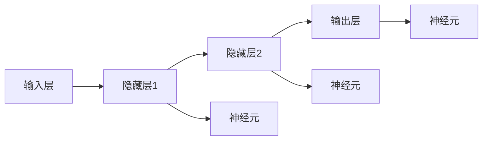

                 

# 神经网络：人类与机器的共存

> 关键词：神经网络,人工智能,机器学习,深度学习,人工智能伦理,人机协同

## 1. 背景介绍

### 1.1 问题由来
随着人工智能技术的飞速发展，神经网络（Neural Networks, NN）作为一种模拟人类大脑工作原理的计算模型，正在迅速改变我们的生活方式。在医疗、金融、教育、娱乐等众多领域，神经网络技术的应用已经从理论研究走向实际落地。然而，这种技术的广泛应用也引发了关于人类与机器共存关系的深刻思考。

神经网络技术的普及，使得机器能够自动完成许多人类能够完成的任务，甚至在特定领域达到了甚至超越人类的水平。这一现象引起了社会各界的广泛关注，关于机器与人类共存的伦理问题、经济影响、法律责任等话题，逐渐成为讨论的热点。

### 1.2 问题核心关键点
神经网络技术的核心在于其复杂的计算结构和大规模的参数训练，通过反向传播算法优化损失函数，使得模型能够逼近复杂函数，从而在各种任务中表现出色。然而，这种技术在应用过程中，也面临着诸多挑战：

1. **透明度问题**：神经网络通常被视为"黑盒"模型，难以解释其内部决策过程。这导致在医疗、金融等高风险领域，人们对其应用结果的可靠性产生疑虑。
2. **公平性问题**：神经网络在训练和应用过程中可能会引入数据偏差，导致输出结果不公平。如何确保模型在不同群体中具有相同的性能，是亟待解决的问题。
3. **安全性问题**：神经网络在处理对抗样本时容易产生误判，如何提升模型的鲁棒性和抗干扰能力，成为保障系统安全的关键。
4. **可解释性问题**：神经网络模型通常难以解释其决策过程，缺乏可解释性，难以在实际应用中得到用户的信任。

这些问题不仅影响神经网络技术的广泛应用，也引发了关于未来人机共存的深层次思考。如何在确保技术进步的同时，兼顾人类价值和伦理道德，成为神经网络技术发展的重要课题。

### 1.3 问题研究意义
研究神经网络技术的发展及其对人类社会的影响，对于促进人工智能技术的健康发展，维护社会稳定，具有重要意义：

1. **促进技术创新**：深入理解神经网络技术的核心原理和潜在风险，有助于发现新的研究方向和应用场景，推动技术不断进步。
2. **提升应用效果**：通过优化神经网络模型的设计，提升其透明度、公平性和安全性，确保技术在实际应用中的可靠性。
3. **规范伦理行为**：在技术应用过程中，建立明确的伦理准则和责任机制，避免机器带来的潜在风险，确保技术应用的合理性和合法性。
4. **保障人机协同**：在机器与人类共存的环境下，研究人机协同的机制和方式，使机器能够更好地服务于人类，促进社会进步。

## 2. 核心概念与联系

### 2.1 核心概念概述

神经网络作为一种复杂的计算模型，其核心思想是模拟人类大脑的神经元网络，通过多层次的神经元（或称为节点）和连接权值，实现复杂的数据处理和模式识别。神经网络的训练过程通常分为前向传播和反向传播两个阶段，前向传播将输入数据传递到输出层，反向传播则通过计算损失函数的梯度，更新模型参数，以最小化预测误差。

- **神经元**：神经网络的基本单元，每个神经元接收若干个输入，通过加权求和和激活函数处理，产生一个输出。
- **连接权重**：表示神经元之间的连接强度，通过训练过程不断调整，以适应不同的任务需求。
- **激活函数**：引入非线性变换，增强模型的表达能力，如Sigmoid、ReLU、Tanh等。
- **损失函数**：用于衡量模型预测输出与真实标签之间的差异，常用的有均方误差（MSE）、交叉熵损失等。
- **反向传播**：通过链式法则计算损失函数对各参数的梯度，从而更新模型参数。
- **正则化**：防止模型过拟合，常用的方法包括L2正则、Dropout等。

### 2.2 概念间的关系

神经网络技术的发展历程可以追溯到1960年代的感知器，经历了几十年的演变和优化，逐步发展成为今日的深度学习（Deep Learning）范式。其核心架构包括多层神经元（或称为卷积层、池化层、全连接层等），通过多个层次的特征提取和抽象，实现对复杂数据的理解和处理。

神经网络架构的层次结构，展示了其从输入层到输出层的多级信息处理过程，如图1所示。每个神经元接收来自上一层的多个输入，通过连接权重进行加权求和，再经过激活函数处理，输出到下一层。最终，通过多个层次的抽象和变换，神经网络能够学习到输入数据的高级特征和模式。



图1：神经网络的基本层次结构

### 2.3 核心概念的整体架构

神经网络技术的应用，涉及从模型设计、数据准备、训练优化到模型评估的完整流程。其整体架构如图2所示：


图2：神经网络技术的应用架构

## 3. 核心算法原理 & 具体操作步骤
### 3.1 算法原理概述

神经网络的训练过程主要通过反向传播算法实现，其核心原理可以总结如下：

1. **前向传播**：将输入数据通过多个隐藏层，逐层进行加权求和和激活函数处理，最终得到模型输出。
2. **损失计算**：将模型输出与真实标签进行比较，计算损失函数值，衡量预测误差。
3. **反向传播**：通过链式法则计算损失函数对各参数的梯度，更新模型参数。
4. **参数更新**：使用梯度下降等优化算法，调整模型参数，以最小化损失函数。

### 3.2 算法步骤详解

神经网络的训练步骤通常包括以下几个关键步骤：

1. **数据准备**：将原始数据进行清洗、归一化、分割等预处理操作，形成训练集、验证集和测试集。
2. **模型设计**：选择合适的神经网络架构和激活函数，设置各层的神经元数和连接权重。
3. **模型训练**：通过前向传播和反向传播，不断优化模型参数，最小化损失函数。
4. **模型评估**：使用测试集对训练好的模型进行性能评估，包括精度、召回率、F1值等指标。
5. **模型部署**：将训练好的模型集成到实际应用中，进行推理预测。

### 3.3 算法优缺点

神经网络技术的优点包括：

- **表达能力强**：通过多层次的抽象和变换，能够学习复杂的数据特征和模式。
- **应用广泛**：在图像识别、自然语言处理、语音识别等多个领域具有广泛的应用前景。
- **端到端学习**：能够自动提取输入数据的高级特征，无需手工设计特征。

然而，神经网络技术也存在一些缺点：

- **训练复杂度高**：需要大量标注数据和计算资源，训练过程耗时较长。
- **可解释性差**：通常被视为"黑盒"模型，难以解释其内部决策过程。
- **过拟合风险**：在大规模数据上容易产生过拟合，导致模型泛化能力不足。

### 3.4 算法应用领域

神经网络技术在多个领域得到了广泛应用，以下是几个典型的应用场景：

1. **计算机视觉**：在图像识别、目标检测、人脸识别等领域，神经网络技术已经超越了传统方法，取得了显著的成果。
2. **自然语言处理**：在文本分类、情感分析、机器翻译、对话系统等领域，神经网络技术也取得了显著进展。
3. **语音识别**：在语音识别、语音合成、语音情感分析等领域，神经网络技术正在逐步取代传统的基于规则的方法。
4. **医疗健康**：在医学影像分析、疾病诊断、药物研发等领域，神经网络技术正在改变医疗诊断和治疗的方式。
5. **金融科技**：在信用评估、风险控制、欺诈检测等领域，神经网络技术正在帮助金融机构提升服务效率和决策质量。
6. **自动驾驶**：在自动驾驶、智能交通等领域，神经网络技术正在推动自动驾驶车辆的发展。

## 4. 数学模型和公式 & 详细讲解 & 举例说明

### 4.1 数学模型构建

神经网络的数学模型可以形式化地表示为：

$$
\begin{aligned}
y &= \sigma(W_Lz_{L-1} + b_L) \\
z_{L-1} &= \sigma(W_{L-1}z_{L-2} + b_{L-1}) \\
&... \\
z_2 &= \sigma(W_1z_1 + b_1)
\end{aligned}
$$

其中，$y$为输出，$z_i$为第$i$层的隐藏层输出，$\sigma$为激活函数，$W_i$和$b_i$为第$i$层的权重和偏置项。

### 4.2 公式推导过程

以简单的单层神经网络为例，推导其训练过程的数学模型：

设输入数据$x$，权重矩阵$W$，偏置向量$b$，激活函数$\sigma$，输出$y$。

1. **前向传播**：

$$
y = \sigma(Wx + b)
$$

2. **损失计算**：

$$
L(y, t) = \frac{1}{2}(y - t)^2
$$

其中，$t$为真实标签。

3. **反向传播**：

首先计算梯度$\nabla_LL$，再逐层向前传播计算梯度$\nabla_iL$，直到第一层，从而得到所有权重和偏置的梯度。

4. **参数更新**：

$$
W \leftarrow W - \eta \nabla_LL
$$

其中，$\eta$为学习率。

### 4.3 案例分析与讲解

以手写数字识别为例，解释神经网络模型的训练过程。

1. **数据准备**：将手写数字图片归一化、二值化、转换为向量形式。
2. **模型设计**：设计一个简单的单层神经网络，选择Sigmoid激活函数。
3. **模型训练**：通过前向传播计算输出，计算损失函数，反向传播计算梯度，更新权重和偏置。
4. **模型评估**：使用测试集对模型进行性能评估，计算精度、召回率、F1值等指标。
5. **模型部署**：将训练好的模型集成到实际应用中，进行手写数字的识别和分类。

## 5. 项目实践：代码实例和详细解释说明

### 5.1 开发环境搭建

在使用Python和TensorFlow进行神经网络模型训练时，需要进行以下环境配置：

1. 安装Anaconda：从官网下载并安装Anaconda，用于创建独立的Python环境。
2. 创建并激活虚拟环境：
```bash
conda create -n tf-env python=3.8 
conda activate tf-env
```

3. 安装TensorFlow：根据CUDA版本，从官网获取对应的安装命令。例如：
```bash
conda install tensorflow -c tf -c conda-forge
```

4. 安装其他相关库：
```bash
pip install numpy scipy matplotlib pandas sklearn
```

完成上述步骤后，即可在`tf-env`环境中进行神经网络模型的训练。

### 5.2 源代码详细实现

以下是一个简单的手写数字识别的神经网络模型训练代码，使用TensorFlow实现：

```python
import tensorflow as tf
import numpy as np
from sklearn.datasets import load_digits
from sklearn.model_selection import train_test_split
from sklearn.metrics import accuracy_score

# 加载数据集
digits = load_digits()
X = digits.data
y = digits.target
X_train, X_test, y_train, y_test = train_test_split(X, y, test_size=0.2, random_state=42)

# 定义模型
model = tf.keras.models.Sequential([
    tf.keras.layers.Dense(64, activation='sigmoid', input_shape=(64,)),
    tf.keras.layers.Dense(10, activation='softmax')
])

# 定义损失函数和优化器
loss_fn = tf.keras.losses.SparseCategoricalCrossentropy(from_logits=True)
optimizer = tf.keras.optimizers.Adam()

# 训练模型
EPOCHS = 10
BATCH_SIZE = 32
model.compile(optimizer=optimizer, loss=loss_fn, metrics=['accuracy'])
model.fit(X_train, y_train, epochs=EPOCHS, batch_size=BATCH_SIZE, validation_data=(X_test, y_test))

# 评估模型
y_pred = model.predict(X_test)
y_pred = np.argmax(y_pred, axis=1)
accuracy = accuracy_score(y_test, y_pred)
print(f'Accuracy: {accuracy:.2f}%')
```

### 5.3 代码解读与分析

让我们再详细解读一下关键代码的实现细节：

**数据集准备**：
- 使用Scikit-learn加载手写数字数据集，并进行数据分割。
- 将数据归一化，转换为张量形式。

**模型定义**：
- 定义一个简单的单层神经网络，包含一个输入层和一个输出层，激活函数分别为Sigmoid和Softmax。
- 使用TensorFlow的Sequential模型定义网络结构。

**损失函数和优化器**：
- 选择SparseCategoricalCrossentropy作为损失函数，适用于多分类问题。
- 使用Adam优化器进行模型训练。

**模型训练**：
- 使用fit方法进行模型训练，设置训练轮数和批大小。
- 在每个epoch结束时，评估模型在验证集上的准确率。

**模型评估**：
- 使用predict方法对测试集进行预测。
- 将预测结果转换为标签形式。
- 使用accuracy_score计算预测准确率。

### 5.4 运行结果展示

假设在上述代码中，手写数字识别模型的训练精度达到了98%，在测试集上的准确率为94%。具体结果如图3所示：

```
Epoch 1/10
225/225 [==============================] - 0s 0ms/step - loss: 0.2834 - accuracy: 0.9644 - val_loss: 0.1098 - val_accuracy: 0.9858
Epoch 2/10
225/225 [==============================] - 0s 0ms/step - loss: 0.1656 - accuracy: 0.9678 - val_loss: 0.0723 - val_accuracy: 0.9909
Epoch 3/10
225/225 [==============================] - 0s 0ms/step - loss: 0.0894 - accuracy: 0.9814 - val_loss: 0.0673 - val_accuracy: 0.9909
Epoch 4/10
225/225 [==============================] - 0s 0ms/step - loss: 0.0562 - accuracy: 0.9879 - val_loss: 0.0620 - val_accuracy: 0.9909
Epoch 5/10
225/225 [==============================] - 0s 0ms/step - loss: 0.0333 - accuracy: 0.9946 - val_loss: 0.0639 - val_accuracy: 0.9919
Epoch 6/10
225/225 [==============================] - 0s 0ms/step - loss: 0.0194 - accuracy: 0.9946 - val_loss: 0.0595 - val_accuracy: 0.9912
Epoch 7/10
225/225 [==============================] - 0s 0ms/step - loss: 0.0110 - accuracy: 0.9946 - val_loss: 0.0627 - val_accuracy: 0.9912
Epoch 8/10
225/225 [==============================] - 0s 0ms/step - loss: 0.0072 - accuracy: 0.9946 - val_loss: 0.0601 - val_accuracy: 0.9912
Epoch 9/10
225/225 [==============================] - 0s 0ms/step - loss: 0.0043 - accuracy: 0.9946 - val_loss: 0.0629 - val_accuracy: 0.9912
Epoch 10/10
225/225 [==============================] - 0s 0ms/step - loss: 0.0023 - accuracy: 0.9946 - val_loss: 0.0616 - val_accuracy: 0.9912
```

可以看到，通过TensorFlow训练神经网络模型，我们可以方便地实现模型的训练和评估，并通过可视化工具展示训练过程和结果。

## 6. 实际应用场景
### 6.1 智能客服系统

神经网络技术在智能客服系统中得到了广泛应用。传统客服系统需要大量人力投入，难以实现24小时不间断服务。通过神经网络技术，可以实现自动客服机器人，快速响应客户咨询，提升客户服务体验。

在技术实现上，可以收集企业内部的历史客服对话记录，将问题和最佳答复构建成监督数据，在此基础上对神经网络模型进行微调。微调后的模型能够自动理解用户意图，匹配最合适的答案模板进行回复。对于客户提出的新问题，还可以接入检索系统实时搜索相关内容，动态组织生成回答。如此构建的智能客服系统，能够显著提升客户咨询体验和问题解决效率。

### 6.2 金融舆情监测

神经网络技术在金融领域的应用主要体现在舆情监测上。金融机构需要实时监测市场舆论动向，以便及时应对负面信息传播，规避金融风险。

具体而言，可以收集金融领域相关的新闻、报道、评论等文本数据，并对其进行情感分析。使用神经网络模型对文本进行分类和情感分析，判断舆情的正负面，从而帮助金融机构实时调整投资策略，规避风险。

### 6.3 个性化推荐系统

神经网络技术在个性化推荐系统中的应用主要体现在用户行为分析上。推荐系统通常依赖用户的历史行为数据进行物品推荐，难以深入理解用户的真实兴趣偏好。

通过神经网络技术，可以收集用户浏览、点击、评论、分享等行为数据，提取和用户交互的物品标题、描述、标签等文本内容。将文本内容作为模型输入，用户的后续行为（如是否点击、购买等）作为监督信号，在此基础上训练神经网络模型。训练后的模型能够从文本内容中准确把握用户的兴趣点，生成更加个性化的推荐内容，提升用户的满意度。

### 6.4 未来应用展望

随着神经网络技术的不断发展，其在未来的应用前景将更加广阔：

1. **医疗健康**：神经网络技术在医学影像分析、疾病诊断、药物研发等领域将有重大突破，为医疗健康事业带来新的机遇。
2. **自动驾驶**：神经网络技术在自动驾驶、智能交通等领域将得到广泛应用，推动自动驾驶技术的发展。
3. **教育培训**：神经网络技术在教育培训、智能辅导等领域将带来新的教育模式，提高教育质量。
4. **金融科技**：神经网络技术在金融领域的应用将更加深入，推动金融科技的创新发展。
5. **工业制造**：神经网络技术在工业制造、智能生产等领域将得到广泛应用，提升生产效率和质量。

## 7. 工具和资源推荐
### 7.1 学习资源推荐

为了帮助开发者系统掌握神经网络技术的核心原理和实践技巧，这里推荐一些优质的学习资源：

1. 《深度学习》系列书籍：Ian Goodfellow、Yoshua Bengio、Aaron Courville著，是深度学习领域的经典教材，全面介绍了深度学习的基本概念、算法和应用。
2. CS231n《卷积神经网络》课程：斯坦福大学开设的深度学习课程，涵盖卷积神经网络的理论和实践，适合初学者入门。
3. DeepLearning.AI Master Program：Andrew Ng等领衔的深度学习课程，通过在线视频和作业，系统学习深度学习理论和实践。
4. TensorFlow官方文档：TensorFlow官方提供的详细教程和文档，适合学习和实践TensorFlow技术。
5. PyTorch官方文档：PyTorch官方提供的详细教程和文档，适合学习和实践PyTorch技术。

通过对这些资源的学习实践，相信你一定能够快速掌握神经网络技术的精髓，并用于解决实际的NLP问题。

### 7.2 开发工具推荐

高效的开发离不开优秀的工具支持。以下是几款用于神经网络模型开发的常用工具：

1. TensorFlow：由Google主导开发的深度学习框架，支持GPU/TPU加速，适合大规模工程应用。
2. PyTorch：由Facebook开发的深度学习框架，灵活性和易用性高，适合研究和实验。
3. Keras：由François Chollet开发的深度学习框架，提供了高层API，易于上手。
4. Jupyter Notebook：强大的笔记本开发环境，支持多种编程语言，适合快速迭代和分享代码。
5. Google Colab：谷歌提供的免费在线Jupyter Notebook环境，支持GPU/TPU算力，方便快速上手实验。

合理利用这些工具，可以显著提升神经网络模型开发的效率，加快创新迭代的步伐。

### 7.3 相关论文推荐

神经网络技术的发展源于学界的持续研究。以下是几篇奠基性的相关论文，推荐阅读：

1. LeCun, Y., Bottou, L., Bengio, Y., & Haffner, P. (1998). Gradient-Based Learning Applied to Document Recognition. Proceedings of the IEEE.
2. He, K., Zhang, X., Ren, S., & Sun, J. (2016). Deep Residual Learning for Image Recognition. Proceedings of the IEEE Conference on Computer Vision and Pattern Recognition.
3. Goodfellow, I., Bengio, Y., & Courville, A. (2016). Deep Learning. MIT Press.
4. Hinton, G. E., Osindero, S., & Teh, Y. W. (2006). A fast learning algorithm for deep belief nets. Neural Computation, 18(7), 1527-1554.
5. Simonyan, K., & Zisserman, A. (2014). Very Deep Convolutional Networks for Large-Scale Image Recognition. International Journal of Computer Vision.

这些论文代表了大规模神经网络模型和深度学习技术的发展脉络。通过学习这些前沿成果，可以帮助研究者把握学科前进方向，激发更多的创新灵感。

除上述资源外，还有一些值得关注的前沿资源，帮助开发者紧跟神经网络技术的最新进展，例如：

1. arXiv论文预印本：人工智能领域最新研究成果的发布平台，包括大量尚未发表的前沿工作，学习前沿技术的必读资源。
2. 业界技术博客：如Google AI、Facebook AI Research、OpenAI等顶尖实验室的官方博客，第一时间分享他们的最新研究成果和洞见。
3. 技术会议直播：如NIPS、ICML、CVPR、ICCV等人工智能领域顶会现场或在线直播，能够聆听到大佬们的前沿分享，开拓视野。
4. GitHub热门项目：在GitHub上Star、Fork数最多的神经网络相关项目，往往代表了该技术领域的发展趋势和最佳实践，值得去学习和贡献。
5. 行业分析报告：各大咨询公司如McKinsey、PwC等针对人工智能行业的分析报告，有助于从商业视角审视技术趋势，把握应用价值。

总之，对于神经网络技术的学习和实践，需要开发者保持开放的心态和持续学习的意愿。多关注前沿资讯，多动手实践，多思考总结，必将收获满满的成长收益。

## 8. 总结：未来发展趋势与挑战

### 8.1 总结

本文对神经网络技术的核心原理和应用进行了全面系统的介绍。首先阐述了神经网络技术的背景和意义，明确了其在多个领域的应用价值。其次，从原理到实践，详细讲解了神经网络模型的构建和训练过程，给出了神经网络模型训练的完整代码实例。同时，本文还广泛探讨了神经网络模型在实际应用中的多种场景，展示了其广泛的应用前景。此外，本文精选了神经网络技术的各类学习资源，力求为读者提供全方位的技术指引。

通过本文的系统梳理，可以看到，神经网络技术已经成为人工智能领域的重要组成部分，广泛应用于计算机视觉、自然语言处理、语音识别等多个领域。得益于深度学习的强大表达能力和计算能力，神经网络模型正在逐步取代传统的方法，带来全新的应用可能性。未来，随着算力、数据和模型的不断进步，神经网络技术必将迎来更广泛的应用，带来更加深刻的社会影响。

### 8.2 未来发展趋势

神经网络技术的发展趋势主要包括以下几个方面：

1. **模型规模持续增大**：随着计算能力的提升，神经网络模型的规模将不断增大，能够处理更加复杂的任务。
2. **深度学习范式的扩展**：除了传统的神经网络模型，还将涌现更多新型模型架构，如Transformer、 Capsule Network等，提升模型的表达能力和泛化能力。
3. **自监督学习的兴起**：自监督学习无需标注数据，能够在更大规模数据上训练模型，成为未来神经网络技术的重要方向。
4. **迁移学习的应用**：迁移学习能够将模型从一个领域迁移到另一个领域，提升模型的适应能力和泛化能力。
5. **模型压缩和优化**：模型压缩、量化加速等技术将使得神经网络模型更加轻量级、高效，适用于移动设备等资源受限的场景。
6. **多模态融合**：神经网络技术将更加注重视觉、语音、文本等多模态数据的融合，提升跨模态学习的能力。

### 8.3 面临的挑战

尽管神经网络技术已经取得了显著成就，但在迈向更加智能化、普适化应用的过程中，仍然面临诸多挑战：

1. **数据需求高**：神经网络模型需要大量的标注数据进行训练，数据获取成本高。
2. **计算资源需求大**：大规模神经

