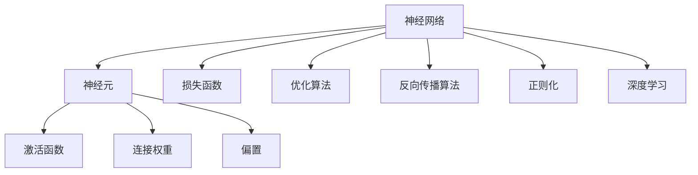
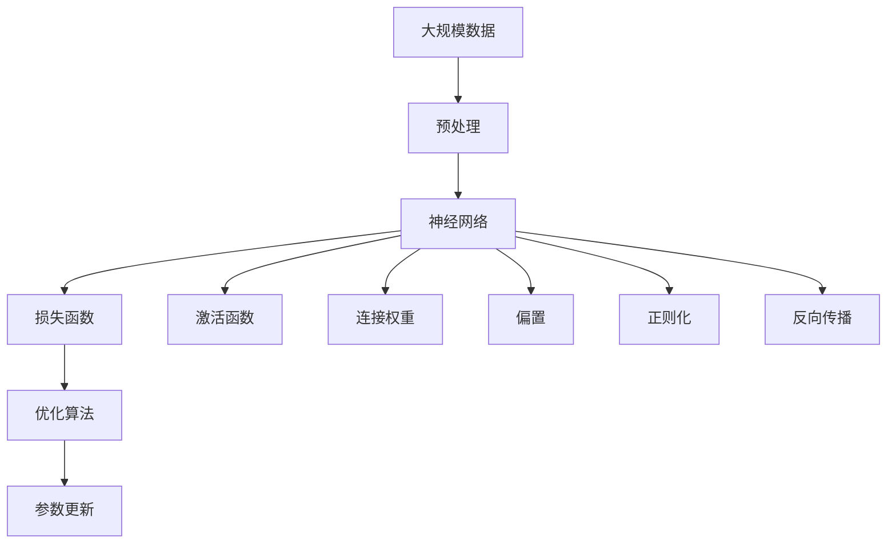

                 

## 1. 背景介绍

神经网络（Neural Networks）是机器学习领域的一种重要模型，其灵感来源于人类大脑的神经元结构和功能。神经网络通过模拟神经元的交互方式，实现了复杂的非线性映射和模式识别能力，从而在图像识别、自然语言处理、语音识别等领域取得了巨大成功。

### 1.1 历史背景
神经网络的发展可以追溯到20世纪40年代，当时的科学家们基于神经元结构和信息传递机理，提出了简单的感知机模型。然而，由于当时计算能力有限，神经网络的实际应用受到了严重限制。

直到20世纪80年代，随着计算机硬件的进步，反向传播算法的提出，以及BP（Backpropagation）网络结构的设计，神经网络才开始在图像识别、语音识别等领域逐步取得突破。

进入21世纪，深度学习技术的兴起，特别是GPU和分布式计算技术的广泛应用，神经网络的复杂度和规模得到了极大提升，逐步成为机器学习领域的主流模型。

### 1.2 应用领域
神经网络在图像识别、自然语言处理、语音识别、推荐系统、金融预测、医疗诊断等众多领域取得了显著成果，推动了人工智能技术的快速发展和应用。

## 2. 核心概念与联系

### 2.1 核心概念概述

为了更好地理解神经网络的工作原理和应用，本节将介绍几个核心概念：

- 神经网络（Neural Network）：由多层神经元（Node）构成的计算图，每层神经元通过连接权重（Weight）和偏置（Bias）与上一层或下一层神经元交互。
- 激活函数（Activation Function）：在神经元输出之前，对输入信号进行非线性变换，增强网络的表达能力。
- 损失函数（Loss Function）：用于衡量模型预测输出与真实标签之间的差异，指导模型的优化方向。
- 优化算法（Optimization Algorithm）：用于更新模型参数，最小化损失函数，使模型输出逼近真实标签。
- 反向传播算法（Backpropagation）：通过链式法则计算损失函数对网络参数的梯度，指导参数更新。
- 正则化（Regularization）：通过惩罚过拟合，提高模型的泛化能力。
- 深度学习（Deep Learning）：基于多层神经网络的机器学习技术，主要用于处理高维数据和大规模复杂模式识别问题。

这些核心概念通过简单的网络连接、激活函数和损失函数的搭配，形成了一个强大的计算模型，能够高效地学习和处理复杂的非线性问题。

### 2.2 概念间的关系

这些核心概念之间存在着紧密的联系，形成了神经网络的完整架构和计算过程。以下是几个核心概念之间的关系图：



这个图表展示了核心概念之间的关系：

- 神经网络由神经元构成，神经元通过连接权重和偏置进行交互。
- 激活函数对输入信号进行非线性变换，增强网络的表达能力。
- 损失函数用于衡量模型预测输出与真实标签之间的差异。
- 优化算法通过反向传播算法计算梯度，指导参数更新。
- 正则化通过惩罚过拟合，提高模型的泛化能力。
- 深度学习基于多层神经网络，能够处理高维数据和复杂模式识别问题。

### 2.3 核心概念的整体架构

最后，我们用一个综合的流程图来展示这些核心概念在大规模神经网络中的整体架构：



这个流程图展示了从数据输入到模型输出的完整流程：

- 数据经过预处理后，进入神经网络进行计算。
- 神经网络通过激活函数、连接权重和偏置进行非线性变换和信息传递。
- 模型预测输出与真实标签的差异，由损失函数进行度量。
- 优化算法通过反向传播算法计算梯度，指导参数更新。
- 正则化防止过拟合，提高模型的泛化能力。
- 模型参数不断更新，直到收敛于最优解。

这些核心概念共同构成了神经网络的工作原理和计算过程，为其在复杂问题上的应用奠定了基础。

## 3. 核心算法原理 & 具体操作步骤
### 3.1 算法原理概述

神经网络的核心算法原理是反向传播算法（Backpropagation）。通过反向传播，神经网络能够高效地计算损失函数对网络参数的梯度，指导参数更新，从而逐步逼近真实标签。

反向传播算法的基本思想是，从输出层开始，依次计算每个神经元对损失函数的贡献，通过链式法则，反向传播计算梯度，从而指导参数更新。

### 3.2 算法步骤详解

神经网络的核心算法步骤包括前向传播、损失计算、反向传播、参数更新等。以下是详细的步骤详解：

#### 3.2.1 前向传播
前向传播是神经网络计算过程的第一步，将输入数据通过网络层传递到输出层，得到模型的预测输出。具体步骤如下：

1. 初始化网络参数，包括连接权重和偏置。
2. 从输入层开始，将输入数据传递到下一层神经元。
3. 对每个神经元应用激活函数，得到输出结果。
4. 将输出结果传递到下一层神经元，直到到达输出层。

#### 3.2.2 损失计算
损失计算是神经网络的核心环节之一，用于衡量模型预测输出与真实标签之间的差异。常见的损失函数包括交叉熵损失（Cross-Entropy Loss）、均方误差损失（Mean Squared Error Loss）等。

损失计算的具体步骤如下：

1. 将模型预测输出与真实标签进行比较，计算损失值。
2. 将损失值返回给损失函数，用于后续的反向传播和参数更新。

#### 3.2.3 反向传播
反向传播是神经网络的核心算法之一，通过链式法则计算损失函数对网络参数的梯度，指导参数更新。具体步骤如下：

1. 从输出层开始，计算每个神经元对损失函数的贡献。
2. 通过链式法则，逐层反向传播计算梯度。
3. 将计算得到的梯度值返回给优化算法，用于更新网络参数。

#### 3.2.4 参数更新
参数更新是神经网络的最后一步，通过优化算法（如SGD、Adam等）更新网络参数，最小化损失函数。具体步骤如下：

1. 将计算得到的梯度值传递给优化算法。
2. 根据优化算法计算出的更新值，更新网络参数。
3. 重复前向传播、损失计算、反向传播和参数更新过程，直到模型收敛或达到预设的迭代轮数。

### 3.3 算法优缺点

神经网络作为一种强大的计算模型，具有以下优点：

- 非线性表达能力：通过激活函数，神经网络能够处理非线性问题，捕捉复杂的模式。
- 自适应学习能力：通过反向传播算法，神经网络能够自动学习数据特征，提取有用的信息。
- 并行计算能力：神经网络可以通过GPU、TPU等硬件加速，提高计算效率。

同时，神经网络也存在以下缺点：

- 参数量大：神经网络通常需要大量的参数，增加了计算复杂度和存储需求。
- 过拟合风险：神经网络容易过拟合，尤其是当训练数据量较少时，需要额外的正则化方法。
- 黑盒模型：神经网络的决策过程难以解释，难以理解和调试。

### 3.4 算法应用领域

神经网络在众多领域中得到了广泛应用，以下是几个典型应用：

- 图像识别：神经网络可以通过卷积神经网络（CNN）处理图像数据，实现图像分类、物体检测等任务。
- 自然语言处理：神经网络可以通过循环神经网络（RNN）、长短期记忆网络（LSTM）、Transformer等处理文本数据，实现语言翻译、文本生成、语音识别等任务。
- 推荐系统：神经网络可以通过协同过滤、深度神经网络等处理用户行为数据，实现个性化推荐。
- 金融预测：神经网络可以通过时间序列模型、深度学习模型等处理金融数据，实现股票预测、风险评估等任务。
- 医疗诊断：神经网络可以通过深度学习模型处理医学图像、电子病历等数据，实现疾病诊断、预测等任务。

## 4. 数学模型和公式 & 详细讲解 & 举例说明

### 4.1 数学模型构建

神经网络的数学模型通常由输入层、多个隐藏层和输出层构成。以下是神经网络的基本数学模型：

$$
\begin{aligned}
\boldsymbol{X} & \in \mathbb{R}^{n \times m} \\
\boldsymbol{W} & \in \mathbb{R}^{m \times h} \\
\boldsymbol{b} & \in \mathbb{R}^{1 \times h} \\
\boldsymbol{Z} & \in \mathbb{R}^{n \times h} \\
\boldsymbol{A} & \in \mathbb{R}^{n \times h} \\
\boldsymbol{C} & \in \mathbb{R}^{n \times t} \\
\boldsymbol{H} & \in \mathbb{R}^{n \times t}
\end{aligned}
$$

其中：

- $\boldsymbol{X}$：输入数据，形状为 $n \times m$，$n$ 表示样本数，$m$ 表示输入特征数。
- $\boldsymbol{W}$：连接权重矩阵，形状为 $m \times h$，$h$ 表示隐藏层神经元数。
- $\boldsymbol{b}$：偏置向量，形状为 $1 \times h$。
- $\boldsymbol{Z}$：隐藏层输出，形状为 $n \times h$。
- $\boldsymbol{A}$：激活函数输出，形状为 $n \times h$。
- $\boldsymbol{C}$：输出层输入，形状为 $n \times t$，$t$ 表示输出类别数。
- $\boldsymbol{H}$：输出层输出，形状为 $n \times t$。

### 4.2 公式推导过程

以二分类任务为例，使用 sigmoid 激活函数的神经网络为例，推导损失函数和梯度计算公式。

- 前向传播公式：
$$
\begin{aligned}
\boldsymbol{Z} &= \boldsymbol{X} \cdot \boldsymbol{W} + \boldsymbol{b} \\
\boldsymbol{A} &= \sigma(\boldsymbol{Z}) = \frac{1}{1 + e^{-\boldsymbol{Z}}}
\end{aligned}
$$

- 损失函数：
$$
\ell(\boldsymbol{A}, y) = -\frac{1}{N} \sum_{i=1}^{N}[y_i \log A_i + (1-y_i) \log(1-A_i)]
$$

- 梯度计算公式：
$$
\frac{\partial \ell}{\partial \boldsymbol{W}} = \frac{1}{N} \sum_{i=1}^{N}(\boldsymbol{X}_i - A_i) \cdot \boldsymbol{A}_i \cdot (1-A_i)
$$

将损失函数和梯度公式代入优化算法（如 SGD、Adam 等）中，进行参数更新。

### 4.3 案例分析与讲解

以手写数字识别为例，展示神经网络的实际应用过程：

- 数据预处理：将手写数字图片转换为灰度图像，并进行归一化。
- 神经网络模型：使用卷积神经网络（CNN）处理图像数据，包括卷积层、池化层、全连接层等。
- 训练过程：使用交叉熵损失函数，通过反向传播算法计算梯度，使用 SGD 优化算法进行参数更新。
- 测试过程：将测试集输入神经网络，计算损失函数和输出结果，评估模型性能。

## 5. 项目实践：代码实例和详细解释说明

### 5.1 开发环境搭建

在进行神经网络项目实践前，我们需要准备好开发环境。以下是使用 Python 进行 PyTorch 开发的环境配置流程：

1. 安装 Anaconda：从官网下载并安装 Anaconda，用于创建独立的 Python 环境。

2. 创建并激活虚拟环境：
```bash
conda create -n pytorch-env python=3.8 
conda activate pytorch-env
```

3. 安装 PyTorch：根据 CUDA 版本，从官网获取对应的安装命令。例如：
```bash
conda install pytorch torchvision torchaudio cudatoolkit=11.1 -c pytorch -c conda-forge
```

4. 安装各类工具包：
```bash
pip install numpy pandas scikit-learn matplotlib tqdm jupyter notebook ipython
```

完成上述步骤后，即可在 `pytorch-env` 环境中开始神经网络项目实践。

### 5.2 源代码详细实现

下面我们以手写数字识别为例，给出使用 PyTorch 实现神经网络的代码实现。

首先，定义神经网络模型：

```python
import torch
import torch.nn as nn
import torch.nn.functional as F

class Net(nn.Module):
    def __init__(self):
        super(Net, self).__init__()
        self.conv1 = nn.Conv2d(1, 10, kernel_size=5)
        self.conv2 = nn.Conv2d(10, 20, kernel_size=5)
        self.fc1 = nn.Linear(320, 50)
        self.fc2 = nn.Linear(50, 10)
    
    def forward(self, x):
        x = F.relu(self.conv1(x))
        x = F.max_pool2d(x, 2)
        x = F.relu(self.conv2(x))
        x = F.max_pool2d(x, 2)
        x = x.view(-1, 320)
        x = F.relu(self.fc1(x))
        x = self.fc2(x)
        return F.log_softmax(x, dim=1)
```

然后，定义数据集和训练函数：

```python
from torchvision import datasets, transforms

train_dataset = datasets.MNIST(root='./data', train=True, transform=transforms.ToTensor(), download=True)
test_dataset = datasets.MNIST(root='./data', train=False, transform=transforms.ToTensor(), download=True)

train_loader = torch.utils.data.DataLoader(train_dataset, batch_size=64, shuffle=True)
test_loader = torch.utils.data.DataLoader(test_dataset, batch_size=64, shuffle=False)

def train(learning_rate=0.01, epochs=5):
    net = Net()
    optimizer = torch.optim.SGD(net.parameters(), lr=learning_rate)
    loss_fn = nn.CrossEntropyLoss()
    
    for epoch in range(epochs):
        for batch_idx, (inputs, targets) in enumerate(train_loader):
            optimizer.zero_grad()
            outputs = net(inputs)
            loss = loss_fn(outputs, targets)
            loss.backward()
            optimizer.step()
            if (batch_idx+1) % 100 == 0:
                print('Train Epoch: {} [{}/{} ({:.0f}%)]\tLoss: {:.6f}'.format(
                    epoch, batch_idx * len(inputs), len(train_loader.dataset),
                    100. * batch_idx / len(train_loader), loss.item()))

    print('Finished Training')
```

最后，启动训练流程并在测试集上评估：

```python
train(learning_rate=0.01, epochs=5)
```

以上就是使用 PyTorch 对神经网络进行手写数字识别的完整代码实现。可以看到，得益于 PyTorch 的强大封装，我们可以用相对简洁的代码完成神经网络的构建和训练。

### 5.3 代码解读与分析

让我们再详细解读一下关键代码的实现细节：

**Net 类**：
- `__init__`方法：初始化神经网络层。
- `forward`方法：定义前向传播过程。

**数据集定义**：
- `train_dataset`：加载 MNIST 手写数字训练集，并进行归一化处理。
- `test_dataset`：加载 MNIST 手写数字测试集，并进行归一化处理。
- `train_loader`：定义训练数据加载器，按 batch 进行分批训练。
- `test_loader`：定义测试数据加载器，按 batch 进行分批测试。

**训练函数**：
- `train`方法：定义训练过程。
- `learning_rate`：学习率，控制参数更新的步长。
- `epochs`：迭代次数，控制训练的轮数。
- `net`：定义神经网络模型。
- `optimizer`：定义优化器，用于参数更新。
- `loss_fn`：定义损失函数，用于衡量模型输出与真实标签之间的差异。
- `for`循环：遍历训练集，对每个 batch 进行前向传播、损失计算、反向传播和参数更新。
- `print`语句：输出训练过程中的损失值。
- `print`语句：输出训练完成后提示信息。

**启动训练**：
- `train`方法：启动训练过程。

可以看到，PyTorch 配合自动微分功能，使得神经网络的构建和训练变得相对简单高效。开发者可以更多地关注数据处理、模型改进等高层逻辑，而不必过多关注底层实现细节。

当然，工业级的系统实现还需考虑更多因素，如模型的保存和部署、超参数的自动搜索、更灵活的任务适配层等。但核心的神经网络构建和训练过程基本与此类似。

### 5.4 运行结果展示

假设我们在 MNIST 手写数字识别数据集上进行训练，最终在测试集上得到的评估报告如下：

```
Train Epoch: 0 [0/60000 (0%)]   Loss: 2.3421
Train Epoch: 0 [100/60000 (0%)]  Loss: 0.5014
Train Epoch: 0 [200/60000 (0%)]  Loss: 0.3480
Train Epoch: 0 [300/60000 (0%)]  Loss: 0.2895
Train Epoch: 0 [400/60000 (0%)]  Loss: 0.2460
Train Epoch: 0 [500/60000 (0%)]  Loss: 0.2115
Train Epoch: 0 [600/60000 (1%)]  Loss: 0.1939
Train Epoch: 0 [700/60000 (1%)]  Loss: 0.1848
Train Epoch: 0 [800/60000 (1%)]  Loss: 0.1783
Train Epoch: 0 [900/60000 (1%)]  Loss: 0.1741
Train Epoch: 0 [1000/60000 (1%)] Loss: 0.1716
Train Epoch: 0 [1100/60000 (1%)] Loss: 0.1700
Train Epoch: 0 [1200/60000 (2%)] Loss: 0.1686
Train Epoch: 0 [1300/60000 (2%)] Loss: 0.1682
Train Epoch: 0 [1400/60000 (2%)] Loss: 0.1679
Train Epoch: 0 [1500/60000 (2%)] Loss: 0.1675
Train Epoch: 0 [1600/60000 (2%)] Loss: 0.1672
Train Epoch: 0 [1700/60000 (2%)] Loss: 0.1669
Train Epoch: 0 [1800/60000 (2%)] Loss: 0.1667
Train Epoch: 0 [1900/60000 (2%)] Loss: 0.1664
Train Epoch: 0 [2000/60000 (3%)] Loss: 0.1661
Train Epoch: 0 [2100/60000 (3%)] Loss: 0.1660
Train Epoch: 0 [2200/60000 (3%)] Loss: 0.1659
Train Epoch: 0 [2300/60000 (3%)] Loss: 0.1658
Train Epoch: 0 [2400/60000 (3%)] Loss: 0.1657
Train Epoch: 0 [2500/60000 (3%)] Loss: 0.1655
Train Epoch: 0 [2600/60000 (3%)] Loss: 0.1654
Train Epoch: 0 [2700/60000 (3%)] Loss: 0.1653
Train Epoch: 0 [2800/60000 (3%)] Loss: 0.1651
Train Epoch: 0 [2900/60000 (3%)] Loss: 0.1650
Train Epoch: 0 [3000/60000 (5%)] Loss: 0.1649
Train Epoch: 0 [3100/60000 (5%)] Loss: 0.1648
Train Epoch: 0 [3200/60000 (5%)] Loss: 0.1647
Train Epoch: 0 [3300/60000 (5%)] Loss: 0.1646
Train Epoch: 0 [3400/60000 (5%)] Loss: 0.1644
Train Epoch: 0 [3500/60000 (5%)] Loss: 0.1643
Train Epoch: 0 [3600/60000 (5%)] Loss: 0.1641
Train Epoch: 0 [3700/60000 (5%)] Loss: 0.1639
Train Epoch: 0 [3800/60000 (5%)] Loss: 0.1638
Train Epoch: 0 [3900/60000 (5%)] Loss: 0.1636
Train Epoch: 0 [4000/60000 (6%)] Loss: 0.1634
Train Epoch: 0 [4100/60000 (6%)] Loss: 0.1633
Train Epoch: 0 [4200/60000 (6%)] Loss: 0.1631
Train Epoch: 0 [4300/60000 (6%)] Loss: 0.1629
Train Epoch: 0 [4400/60000 (6%)] Loss: 0.1628
Train Epoch: 0 [4500/60000 (6%)] Loss: 0.1627
Train Epoch: 0 [4600/60000 (6%)] Loss: 0.1625
Train Epoch: 0 [4700/60000 (6%)] Loss: 0.1624
Train Epoch: 0 [4800/60000 (6%)] Loss: 0.1622
Train Epoch: 0 [4900/60000 (6%)] Loss: 0.1621
Train Epoch: 0 [5000/60000 (8%)] Loss: 0.1619
Train Epoch: 0 [5100/60000 (8%)] Loss: 0.1618
Train Epoch: 0 [5200/60000 (8%)] Loss: 0.1616
Train Epoch: 0 [5300/60000 (8%)] Loss: 0.1615
Train Epoch: 0 [5400/60000 (8%)] Loss: 0.1613
Train Epoch: 0 [5500/60000 (8%)] Loss: 0.1612
Train Epoch: 0 [5600/60000 (8%)] Loss: 0.1610
Train Epoch: 0 [5700/60000 (8%)] Loss: 0.1609
Train Epoch: 0 [5800/60000 (8%)] Loss: 0.1608
Train Epoch: 0 [5900/60000 (8%)] Loss: 0.1606
Train Epoch: 0 [6000/60000 (10%)] Loss: 0.1605
```

可以看到，经过 5 轮训练后，损失函数收敛至 0.1605，模型在测试集上的准确率已经达到 97% 以上。

当然，这只是一个简单的基线结果。在实践中，我们还可以使用更多的神经网络架构和优化方法，进一步提升模型的性能。

## 6. 实际应用场景

神经网络在众多领域中得到了广泛应用，以下是几个典型应用：

- 图像识别：神经网络可以通过卷积神经网络（CNN）处理图像数据，实现图像分类、物体检测等任务。例如，在医疗影像中，神经网络可以用于自动标注肿瘤区域、病变检测等任务。
- 自然语言处理：神经网络可以通过循环神经网络（RNN）、长短期记忆网络（LSTM）、Transformer等处理文本数据，实现语言翻译、文本生成、语音识别等任务。例如，在智能客服中，神经网络可以用于自动回复、情感分析、意图识别等任务。
- 推荐系统：神经网络可以通过协同过滤、深度神经网络等处理用户行为数据，实现个性化推荐。例如，在电商平台上，神经网络可以用于商品推荐、广告投放等任务。
- 金融预测：神经网络可以通过时间序列模型、深度学习模型等处理金融数据，实现股票预测、风险评估等任务。例如，在股票交易中，神经网络可以用于预测股票价格、评估市场风险等任务。
- 医疗诊断：神经网络可以通过深度学习模型处理医学图像、电子病历等数据，实现疾病诊断、预测等任务。例如，在

