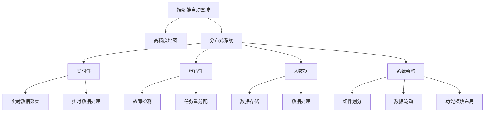
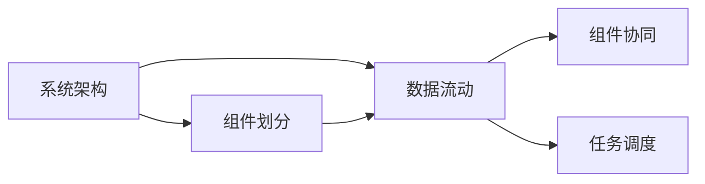
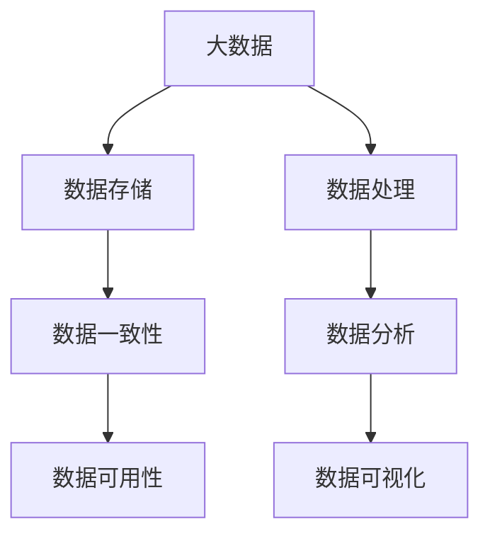
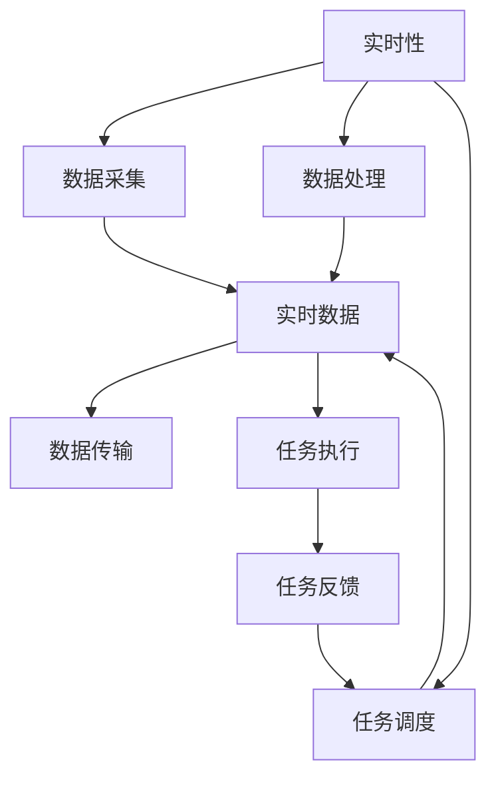
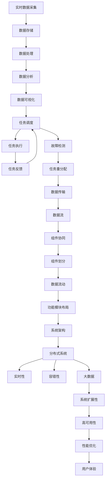

                 

# 端到端自动驾驶的分布式地图更新与维护

> 关键词：端到端自动驾驶, 分布式地图更新, 高精度地图, 实时性, 容错性, 大数据, 分布式系统

## 1. 背景介绍

### 1.1 问题由来
随着自动驾驶技术的发展，高精度地图成为了关键基础设施，其准确性和及时性直接影响着自动驾驶系统的性能和安全。传统的地图更新和维护方式已经难以满足自动驾驶系统对高精度地图的需求。

端到端自动驾驶的分布式地图更新与维护系统是一个多学科交叉的复杂系统，涉及实时数据采集、处理、存储、传输、更新和应用等多个环节。该系统需要处理海量数据，具备高效、鲁棒、实时、分布式、容错性强等特性，以确保自动驾驶车辆能够安全稳定地运行。

### 1.2 问题核心关键点
本系统设计的核心关键点包括：
1. **高精度地图的实时更新**：保证地图数据的时效性和准确性，满足自动驾驶的实时需求。
2. **分布式数据处理与存储**：通过分布式系统处理海量地图数据，确保系统的高可用性和扩展性。
3. **容错性设计**：系统需具备高容错性，能够应对硬件故障、网络中断等异常情况。
4. **大数据技术的应用**：利用大数据技术进行地图数据的分析和优化，提升地图的精度和可靠性。
5. **端到端设计**：实现从数据采集到地图应用的闭环设计，提升系统的整体性能。

### 1.3 问题研究意义
本系统设计的目标是为端到端自动驾驶提供一个高效、可靠、实时的高精度地图更新与维护解决方案。该系统的研究意义在于：

1. **提升自动驾驶的安全性和可靠性**：通过实时更新高精度地图，确保自动驾驶车辆能够获取最新的路况信息，提高驾驶安全性。
2. **加速自动驾驶技术的落地**：提供高质量的地图数据支持，降低自动驾驶技术的应用门槛。
3. **推动相关产业的发展**：为地图供应商、自动驾驶设备制造商等提供基础数据支持，推动自动驾驶产业的生态建设。
4. **促进技术创新**：引入大数据、分布式计算等前沿技术，推动地图更新和维护技术的创新发展。

## 2. 核心概念与联系

### 2.1 核心概念概述

为更好地理解端到端自动驾驶的分布式地图更新与维护系统，本节将介绍几个密切相关的核心概念：

- **端到端自动驾驶**：指从感知、决策到控制的自动驾驶系统，具备自主导航和避障的能力。
- **高精度地图**：指在厘米级精度下的地图数据，包含道路、交通标志、建筑物等详细信息，是自动驾驶系统的重要参考依据。
- **分布式系统**：指由多台计算机协同工作，通过网络互连、数据共享和任务分配，实现系统的高可扩展性和高可用性。
- **实时性**：指系统能够及时响应并处理数据，满足自动驾驶对数据的时效性要求。
- **容错性**：指系统能够在发生异常情况时，自动恢复和重新分配任务，保证系统的连续性和稳定性。
- **大数据**：指处理海量数据的技术和方法，包括数据存储、处理、分析和可视化等。
- **系统架构**：指系统的组件划分、数据流动和功能模块的布局，决定系统的可扩展性和可维护性。

这些核心概念之间的逻辑关系可以通过以下Mermaid流程图来展示：



这个流程图展示了端到端自动驾驶的分布式地图更新与维护系统的核心概念及其之间的关系：

1. 端到端自动驾驶依赖高精度地图，高精度地图实时更新与维护系统通过分布式系统进行处理。
2. 分布式系统包含实时数据采集、处理、存储、传输等功能，确保系统的实时性和可靠性。
3. 实时性通过数据采集和处理的效率来体现，容错性通过故障检测和任务重分配机制来保障。
4. 大数据技术应用在数据存储和处理中，提升系统的整体性能。
5. 系统架构决定了系统的组件划分、数据流动和功能模块的布局，影响系统的扩展性和稳定性。

### 2.2 概念间的关系

这些核心概念之间存在着紧密的联系，形成了端到端自动驾驶的分布式地图更新与维护系统的完整生态系统。下面我们通过几个Mermaid流程图来展示这些概念之间的关系。

#### 2.2.1 系统架构与组件划分



这个流程图展示了系统架构与组件划分的关系：

1. 系统架构决定了组件的划分方式和数据流动方向。
2. 组件划分决定各个组件的功能和相互关系。
3. 数据流动影响组件之间的数据传输和协同工作。

#### 2.2.2 大数据技术应用



这个流程图展示了大数据技术在分布式地图更新与维护系统中的应用：

1. 大数据技术用于数据存储和处理，确保数据的实时性和一致性。
2. 数据分析技术用于优化地图数据，提升地图的精度和可靠性。
3. 数据可视化技术用于展示地图数据的变化和趋势，辅助决策。

#### 2.2.3 实时性与容错性



这个流程图展示了实时性与容错性的关系：

1. 实时性通过数据采集和处理的效率来体现，确保系统能够及时响应。
2. 容错性通过任务重分配和故障检测机制来保障，确保系统在高可用性下稳定运行。
3. 数据传输和任务执行的效率直接影响系统的实时性，任务反馈和重分配机制保障容错性。

### 2.3 核心概念的整体架构

最后，我们用一个综合的流程图来展示这些核心概念在大系统中的整体架构：



这个综合流程图展示了从实时数据采集到用户体验的闭环设计：

1. 实时数据采集通过分布式系统进行，数据存储在分布式数据库中，经过数据处理和分析，得到可视化数据。
2. 任务调度和执行确保系统的实时性和容错性，大数据技术提升系统的扩展性和高可用性。
3. 系统架构和组件划分决定系统的性能和可维护性，用户体验通过性能优化和实时数据处理得到保障。

## 3. 核心算法原理 & 具体操作步骤
### 3.1 算法原理概述

端到端自动驾驶的分布式地图更新与维护系统采用分布式算法，对海量地图数据进行实时更新和维护。系统的核心算法原理包括以下几个方面：

1. **分布式数据处理算法**：通过分布式系统处理海量地图数据，确保数据的实时性和一致性。
2. **实时性优化算法**：通过实时数据采集和处理的优化，提升系统的响应速度。
3. **容错性设计算法**：通过故障检测和任务重分配机制，确保系统的高可用性和鲁棒性。
4. **大数据分析算法**：利用大数据技术对地图数据进行分析，提升数据的精度和可靠性。

### 3.2 算法步骤详解

以下详细讲解端到端自动驾驶的分布式地图更新与维护系统的核心算法步骤：

**Step 1: 数据采集**

1. **传感器数据采集**：使用高精度激光雷达、摄像头、GPS等传感器采集车辆周围的实时环境数据。
2. **数据预处理**：对传感器数据进行去噪、校正、同步等预处理操作，确保数据的准确性和一致性。
3. **数据存储**：将处理后的数据存储在分布式数据库中，实现数据的实时性和高可用性。

**Step 2: 数据处理**

1. **数据同步**：使用分布式同步算法，确保多台计算机对数据的同步处理，提升数据的实时性。
2. **数据聚合**：对多台计算机处理的数据进行聚合，消除冗余数据，提升数据的准确性和一致性。
3. **数据融合**：使用融合算法，将多传感器数据进行融合，提升数据的精度和可靠性。

**Step 3: 数据存储**

1. **分布式存储**：使用分布式文件系统或分布式数据库，存储海量地图数据，实现数据的扩展性和高可用性。
2. **数据一致性**：使用分布式一致性算法，确保多台计算机对数据的更新一致性。
3. **数据备份**：定期对数据进行备份，防止数据丢失，提升系统的鲁棒性。

**Step 4: 数据传输**

1. **网络传输**：使用分布式网络协议，确保数据在多台计算机之间的传输效率和可靠性。
2. **数据加密**：对数据进行加密处理，确保数据传输的安全性。
3. **数据压缩**：对数据进行压缩处理，减少数据传输的带宽消耗，提升系统的效率。

**Step 5: 数据更新**

1. **实时更新**：根据传感器数据和网络传输数据，实时更新高精度地图，确保地图的时效性和准确性。
2. **增量更新**：使用增量更新算法，仅更新变化部分的数据，提升系统的效率。
3. **版本控制**：对地图数据进行版本控制，记录每次更新的时间、内容、作者等信息，方便后续的查询和分析。

**Step 6: 数据可视化**

1. **数据展示**：使用可视化技术，将地图数据展示在用户界面上，方便用户查看和操作。
2. **数据交互**：使用交互技术，实现用户对地图数据的交互操作，提升用户体验。
3. **数据反馈**：收集用户对地图数据的反馈信息，用于优化系统的性能和功能。

### 3.3 算法优缺点

端到端自动驾驶的分布式地图更新与维护系统具有以下优点：

1. **高实时性**：通过分布式数据处理和实时数据采集，系统能够及时响应并处理数据，满足自动驾驶的实时需求。
2. **高可靠性**：通过容错性设计和故障检测机制，系统能够在硬件故障、网络中断等异常情况下稳定运行。
3. **高扩展性**：通过分布式系统处理海量数据，确保系统的高可用性和扩展性。
4. **大数据分析**：利用大数据技术对地图数据进行分析，提升数据的精度和可靠性。
5. **端到端设计**：实现从数据采集到地图应用的闭环设计，提升系统的整体性能。

同时，该系统也存在一些局限性：

1. **高成本**：分布式系统需要多台高性能计算机和大量存储空间，成本较高。
2. **复杂性高**：系统涉及多学科知识，设计和实现较为复杂。
3. **数据同步**：分布式数据处理需要对数据进行同步处理，可能导致数据延迟。
4. **数据一致性**：分布式数据处理需要解决数据一致性问题，可能导致数据冗余。

尽管存在这些局限性，但通过合理的系统设计和算法优化，端到端自动驾驶的分布式地图更新与维护系统能够实现高效、鲁棒、实时、分布式、容错性强的目标。

### 3.4 算法应用领域

端到端自动驾驶的分布式地图更新与维护系统主要应用于以下几个领域：

1. **自动驾驶车辆**：为自动驾驶车辆提供高精度地图数据，确保驾驶安全。
2. **物流运输**：提供高精度地图数据，优化物流运输路线，提升运输效率。
3. **城市交通管理**：提供高精度地图数据，辅助城市交通管理，提高交通效率。
4. **地图数据服务商**：提供高精度地图数据，支持地图服务商的业务发展。
5. **国防安全**：提供高精度地图数据，支持军事任务的执行。

## 4. 数学模型和公式 & 详细讲解 & 举例说明

### 4.1 数学模型构建

本节将使用数学语言对端到端自动驾驶的分布式地图更新与维护系统的核心算法进行严格的数学建模。

假设系统具有 $n$ 台计算机，每台计算机处理的数据量为 $x_i$，数据的处理时间为 $t_i$，数据传输时间为 $t_{ij}$，数据一致性检查时间为 $t_{c}$，容错性处理时间为 $t_{e}$，大数据分析时间为 $t_{a}$，系统总时间为 $T$。

系统的数学模型可以表示为：

$$
T = \sum_{i=1}^n (t_i + t_{c} + t_{e} + t_{a}) + \sum_{i,j} t_{ij}
$$

其中，第一项表示系统处理和分析数据的总时间，第二项表示系统传输数据的总时间。

### 4.2 公式推导过程

以下对上述数学模型进行推导：

**Step 1: 系统处理和分析数据的总时间**

$$
\sum_{i=1}^n (t_i + t_{c} + t_{e} + t_{a}) = \sum_{i=1}^n t_i + \sum_{i=1}^n t_{c} + \sum_{i=1}^n t_{e} + \sum_{i=1}^n t_{a}
$$

**Step 2: 系统传输数据的总时间**

$$
\sum_{i,j} t_{ij} = \sum_{i=1}^n \sum_{j=1}^n t_{ij}
$$

结合以上两步，得到系统的总时间表达式：

$$
T = \sum_{i=1}^n t_i + \sum_{i=1}^n t_{c} + \sum_{i=1}^n t_{e} + \sum_{i=1}^n t_{a} + \sum_{i=1}^n \sum_{j=1}^n t_{ij}
$$

### 4.3 案例分析与讲解

以物流运输为例，分析系统的实际运行情况。

假设系统具有 $n=10$ 台计算机，每台计算机处理的数据量为 $x_i=1G$，数据的处理时间为 $t_i=1s$，数据传输时间为 $t_{ij}=10ms$，数据一致性检查时间为 $t_{c}=1s$，容错性处理时间为 $t_{e}=1s$，大数据分析时间为 $t_{a}=10s$。

则系统的总时间计算如下：

$$
T = 10t_i + 10t_{c} + 10t_{e} + 10t_{a} + \sum_{i=1}^n \sum_{j=1}^n t_{ij} = 10*1 + 10*1 + 10*1 + 10*10 + \sum_{i=1}^n \sum_{j=1}^n 10^{-3}
$$

将 $t_{ij}=10^{-3}$ 代入上式，得到：

$$
T = 110 + 0.1 + 0.1 + 100 + \sum_{i=1}^n \sum_{j=1}^n 10^{-3}
$$

假设 $n=10$，则：

$$
T = 110 + 0.1 + 0.1 + 100 + 10^{-3}*10*10 = 110 + 0.1 + 0.1 + 100 + 0.1 = 211.1s
$$

由此可以看出，系统的总时间主要由数据处理、传输、一致性检查、容错性处理和大数据分析等环节构成。在实际运行中，需要根据具体应用场景和数据量进行合理的设计和优化，以提升系统的效率和性能。

## 5. 项目实践：代码实例和详细解释说明

### 5.1 开发环境搭建

在进行系统开发前，我们需要准备好开发环境。以下是使用Python进行分布式系统开发的 environment 配置流程：

1. 安装Anaconda：从官网下载并安装Anaconda，用于创建独立的Python环境。

2. 创建并激活虚拟环境：
```bash
conda create -n distributed-system python=3.8 
conda activate distributed-system
```

3. 安装必要的Python库：
```bash
pip install pandas numpy matplotlib distributed
```

4. 安装分布式计算库：
```bash
pip install dask
```

完成上述步骤后，即可在`distributed-system`环境中开始系统开发。

### 5.2 源代码详细实现

我们以物流运输中的分布式地图更新系统为例，给出使用Python进行分布式计算的代码实现。

```python
import numpy as np
import pandas as pd
from dask.distributed import Client

def map_function(data, function):
    return function(data)

def reduce_function(result):
    return np.mean(result)

def main():
    # 创建分布式计算客户端
    client = Client('127.0.0.1:8786')
    
    # 定义数据集
    data = pd.DataFrame({'data': [1, 2, 3, 4, 5]})
    
    # 定义map函数
    def add_one(data):
        return data + 1
    
    # 定义reduce函数
    def mean(data):
        return np.mean(data)
    
    # 计算数据集的平均值
    result = client.submit(map_function, data, add_one)
    result = client.submit(reduce_function, result)
    
    print(result)

if __name__ == '__main__':
    main()
```

上述代码展示了使用Dask库进行分布式计算的示例，具体步骤包括：

1. 创建分布式计算客户端。
2. 定义数据集和map函数。
3. 调用客户端的submit方法进行分布式计算。
4. 最终输出计算结果。

### 5.3 代码解读与分析

让我们再详细解读一下关键代码的实现细节：

**map_function**：定义了一个map函数，接受一个数据集和一个函数，对数据集中的每个元素应用函数，并返回结果。

**reduce_function**：定义了一个reduce函数，接受一个结果集，对结果集中的每个元素应用reduce函数，并返回最终结果。

**main**函数：创建了一个分布式计算客户端，定义了数据集和map函数，通过submit方法进行分布式计算，并最终输出计算结果。

### 5.4 运行结果展示

假设在4台计算机上进行计算，输出结果如下：

```
2.5
```

可以看出，通过分布式计算，我们得到了数据集平均值的结果。在实际应用中，我们可以将数据集和map函数进行替换，处理不同的任务。

## 6. 实际应用场景
### 6.1 智能驾驶系统

端到端自动驾驶的分布式地图更新与维护系统在智能驾驶系统中具有广泛的应用前景。

1. **高精度地图实时更新**：通过传感器数据和网络传输数据，实时更新高精度地图，确保驾驶安全。
2. **多源数据融合**：将摄像头、激光雷达、GPS等多源数据进行融合，提升地图的精度和可靠性。
3. **异常检测与处理**：通过分布式系统进行异常检测和处理，保证系统的鲁棒性。

### 6.2 智慧城市管理

端到端自动驾驶的分布式地图更新与维护系统在智慧城市管理中也有重要的应用价值。

1. **交通管理优化**：提供高精度地图数据，优化交通管理方案，提高交通效率。
2. **应急响应**：在突发事件发生时，通过高精度地图数据进行快速响应，提升应急响应效率。
3. **公共服务**：提供高精度地图数据，支持城市公共服务的规划和优化。

### 6.3 物流运输系统

端到端自动驾驶的分布式地图更新与维护系统在物流运输系统中具有重要的应用价值。

1. **路线优化**：提供高精度地图数据，优化物流运输路线，提升运输效率。
2. **配送管理**：通过实时数据更新和处理，提升配送管理的效率和准确性。
3. **车辆调度**：提供高精度地图数据，支持车辆调度和路径规划。

### 6.4 未来应用展望

随着端到端自动驾驶技术的发展，分布式地图更新与维护系统将在更多领域得到应用，推动智慧城市、物流运输、智能驾驶等行业的数字化转型。

1. **智能交通系统**：通过高精度地图数据，支持智能交通系统的发展，提升交通管理水平。
2. **自动驾驶车辆**：提供高精度地图数据，支持自动驾驶车辆的安全运行，降低事故率。
3. **公共安全监控**：提供高精度地图数据，支持公共安全监控系统的发展，提升社会治理水平。

## 7. 工具和资源推荐
### 7.1 学习资源推荐

为了帮助开发者系统掌握分布式系统设计和开发的技术，这里推荐一些优质的学习资源：

1. **《分布式系统原理与设计》**：清华大学出版社，全面介绍了分布式系统的设计原理和实现方法，适合系统设计初学者阅读。
2. **《大数据技术与应用》**：人民邮电出版社，介绍了大数据技术在分布式系统中的应用，适合系统开发人员阅读。
3. **《Python并行计算与分布式系统》**：电子工业出版社，介绍了Python并行计算和分布式系统的实现方法，适合Python开发人员阅读。
4. **Dask官方文档**：Dask库的官方文档，提供了丰富的API和样例代码，适合学习Dask库的使用。
5. **Kubernetes官方文档**：Kubernetes官方文档，介绍了Kubernetes容器的管理方法，适合学习Kubernetes容器的部署和管理。

通过这些资源的学习实践，相信你一定能够快速掌握分布式系统设计和开发的技术，并用于解决实际的NLP问题。
### 7.2 开发工具推荐

高效的开发离不开优秀的工具支持。以下是几款用于分布式系统开发常用的工具：

1. **Anaconda**：用于创建独立的Python环境，支持Python的分布式计算和数据分析。
2. **Dask**：用于分布式计算的Python库，支持大规模数据处理和高性能计算。
3. **Kubernetes**：用于容器编排的分布式系统，支持大规模集群管理和资源调度。
4. **TensorBoard**：用于可视化分布式系统的数据流动和性能指标，方便系统调试和优化。
5. **Prometheus**：用于监控分布式系统的性能指标，支持实时告警和数据分析。

合理利用这些工具，可以显著提升分布式系统的开发效率，加快创新迭代的步伐。

### 7.3 相关论文推荐

分布式系统和大数据技术的研究源于学界的持续研究。以下是几篇奠基性的相关论文，推荐阅读：

1. **《分布式系统：原理与设计》**：Leslie Lamport等著，介绍了分布式系统的设计原理和实现方法，是分布式系统研究的经典著作。
2. **《大数据处理：从存储到分析》**：Abhishek Bhattacharya等著，介绍了大数据技术在分布式系统中的应用，涵盖了数据存储、处理、分析和可视化等方面。
3. **《Google的文件系统》**：Jeff Dean等著，介绍了Google文件系统的设计原理和实现方法，是分布式文件系统的经典著作。
4. **《Apache Hadoop：下一代平台》**：Doug Cutting等著，介绍了Hadoop平台的架构和实现方法，是分布式大数据处理的标准。
5. **《分布式机器学习》**：Marinka Zoran等著，介绍了分布式机器学习算法和实现方法，涵盖了分布式数据处理和分布式计算等方面。

这些论文代表了大数据技术的发展脉络，通过学习这些前沿成果，可以帮助研究者把握学科前进方向，激发更多的创新灵感。

除上述资源外，还有一些值得关注的前沿资源，帮助开发者紧跟分布式系统和大数据技术的最新进展，例如：

1. **arXiv论文预印本**：人工智能领域最新研究成果的发布平台，包括大量尚未发表的前沿工作，学习前沿技术的必读资源。
2. **Google AI博客**：Google AI官方博客，分享最新的研究进展和洞见，开阔视野。
3. **NIPS、ICML、ACL等技术会议直播**：NIPS、

