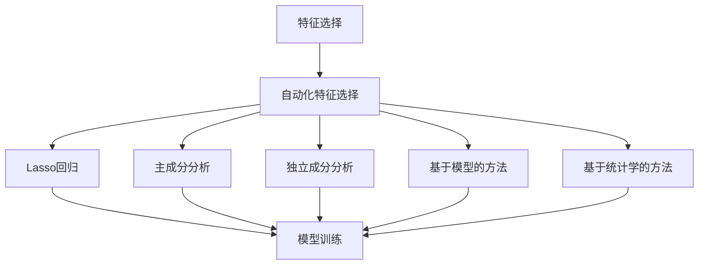
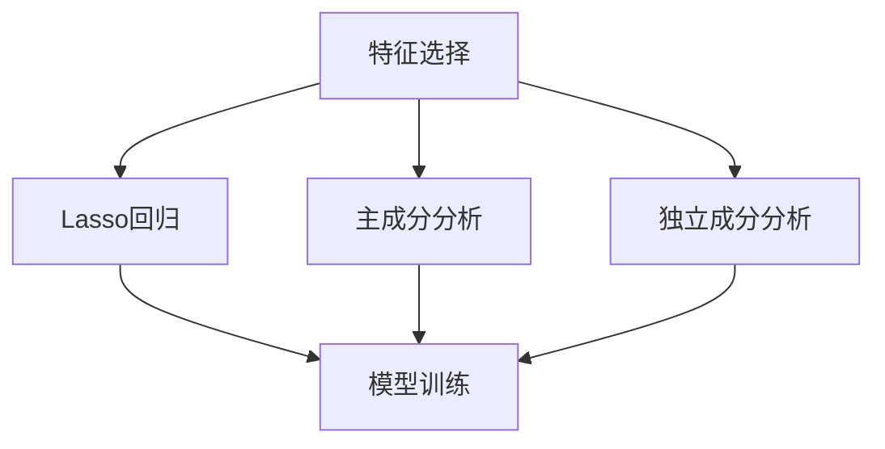
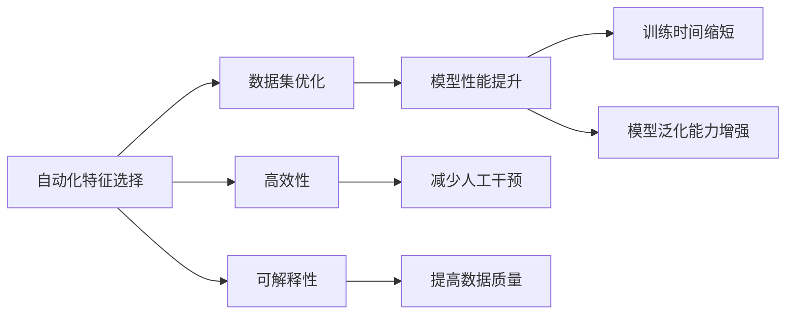
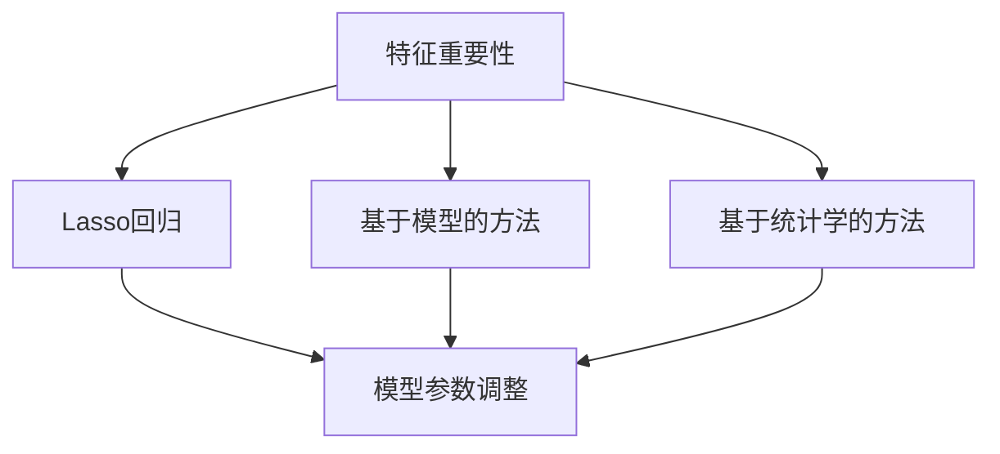
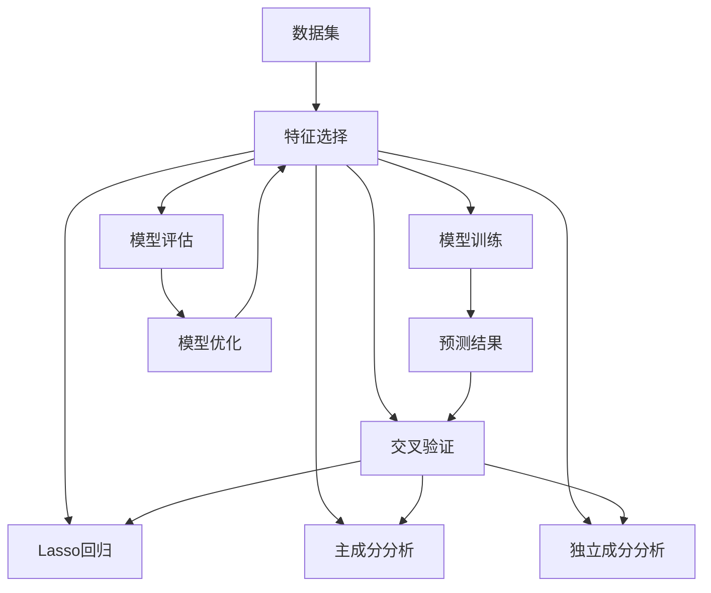

                 

## 1. 背景介绍

### 1.1 问题由来
在现代机器学习和数据科学领域，数据集的质量和结构对于模型的性能有着至关重要的影响。传统的数据集构建方式往往依赖于人工经验和专业领域知识，流程繁琐、耗时耗力。同时，由于数据集的规模和维度日益增长，人工数据清洗和特征选择变得越发困难。如何在自动化和高效性之间取得平衡，成为当前数据集构建领域的一个重要课题。

### 1.2 问题核心关键点
自动化特征选择(Automatic Feature Selection, AFS)是提升数据集质量的关键手段。传统的数据集构建方法往往依赖人工经验和专业领域知识，流程繁琐、耗时耗力。随着机器学习技术的不断发展，自动化特征选择方法在处理大规模、高维数据集时展现出显著优势。主要关注以下几个核心问题：
1. 如何构建高质量、结构良好的数据集，提升模型性能？
2. 如何高效、自动化地进行特征选择，优化数据集结构？
3. 如何在自动化过程中保持数据集的质量和一致性？

### 1.3 问题研究意义
自动化特征选择对于提升数据集质量、优化模型性能、加速数据科学流程具有重要意义：

1. **提升模型性能**：通过自动化特征选择，可以去除冗余和噪声特征，保留重要和有用的特征，提升模型训练效果。
2. **加速数据科学流程**：自动化特征选择减少了人工干预，缩短了数据预处理时间，提高了数据科学项目的整体效率。
3. **优化数据集结构**：自动化工具能够自动识别数据集中的重要特征，优化特征维度，使得数据集结构更加合理。
4. **降低开发成本**：自动化工具可以节省数据处理过程中的人力成本，使更多资源投入到模型训练和模型验证中。

## 2. 核心概念与联系

### 2.1 核心概念概述

为更好地理解自动化特征选择方法，本节将介绍几个密切相关的核心概念：

- **特征选择(Feature Selection)**：从原始数据集中选择子集，去除无关或不重要特征的过程，以提高模型的性能和泛化能力。
- **自动化特征选择(Automatic Feature Selection)**：使用算法自动评估特征的重要性，选择最佳特征集，无需人工干预。
- **特征重要性(Feature Importance)**：衡量特征对模型性能的贡献，如用于模型训练过程中的特征权重。
- **交叉验证(Cross-Validation)**：将数据集划分为训练集和验证集，通过多次交叉训练和验证，评估模型性能，优化特征选择。
- **主成分分析(Principal Component Analysis, PCA)**：通过线性变换，将高维数据转换为低维特征，减少数据集的维度。
- **独立成分分析(Independent Component Analysis, ICA)**：将多变量数据分解成独立的成分，揭示数据中的隐含结构。
- **Lasso回归(Ridge Regression)**：通过正则化方法，在模型训练过程中自动选择最相关的特征，减少过拟合。
- **基于模型的方法(Metaheuristic Methods)**：如遗传算法、粒子群算法等，通过模拟自然界优胜劣汰机制，优化特征选择。
- **基于统计学的方法(Statistical Methods)**：如卡方检验、互信息等，通过统计学原理选择最优特征。

这些核心概念之间的逻辑关系可以通过以下Mermaid流程图来展示：



这个流程图展示了几类特征选择方法的逻辑关系：

1. 特征选择是自动化特征选择的核心，包括多种具体的特征选择算法。
2. 自动化特征选择可通过多种方法实现，包括统计学方法和模型方法。
3. 具体方法如Lasso回归、主成分分析、独立成分分析等，均为特征选择的具体手段。
4. 这些方法均服务于模型训练过程，通过特征选择优化模型性能。

### 2.2 概念间的关系

这些核心概念之间存在着紧密的联系，形成了特征选择的完整生态系统。下面我们通过几个Mermaid流程图来展示这些概念之间的关系。

#### 2.2.1 特征选择方法的多样性



这个流程图展示了几类常见的特征选择方法的分类和应用：

1. 特征选择包括Lasso回归、主成分分析、独立成分分析等方法。
2. 这些方法均可用于模型训练，提升模型性能。
3. 不同方法适用于不同的数据类型和场景，选择合适的方法可以提高特征选择的效率和效果。

#### 2.2.2 自动化特征选择的优势



这个流程图展示了自动化特征选择的主要优势：

1. 自动化特征选择可以优化数据集，提升模型性能。
2. 该过程高效、自动化，减少了人工干预。
3. 自动化特征选择提高了数据质量和模型泛化能力。

#### 2.2.3 特征重要性评估



这个流程图展示了特征重要性评估的多种方法：

1. 特征重要性评估包括Lasso回归、基于模型的方法、基于统计学的方法等。
2. 这些方法可以帮助选择最优特征，提升模型性能。
3. 特征重要性评估是自动化特征选择的关键步骤，指导特征选择算法。

### 2.3 核心概念的整体架构

最后，我们用一个综合的流程图来展示这些核心概念在特征选择过程中的整体架构：



这个综合流程图展示了从数据集构建到模型评估的全过程：

1. 数据集通过特征选择过程，去除无关特征，保留重要特征。
2. 特征选择后的数据集用于模型训练，生成预测结果。
3. 模型评估和优化过程持续反馈，指导特征选择。
4. 交叉验证等方法评估特征选择效果，指导后续优化。
5. 最终预测结果用于实际应用，验证模型效果。

通过这些流程图，我们可以更清晰地理解特征选择的各个环节和相互关系，为后续深入讨论具体的特征选择算法和技巧奠定基础。

## 3. 核心算法原理 & 具体操作步骤
### 3.1 算法原理概述

自动化特征选择是一种基于算法和统计学方法，自动评估特征重要性，选择最佳特征集的过程。其核心思想是：通过特征重要性评估，去除无关或不重要特征，保留重要特征，以提高模型性能和泛化能力。

形式化地，假设数据集 $D=\{(x_i,y_i)\}_{i=1}^N$，其中 $x_i \in \mathbb{R}^d$ 为输入特征，$y_i \in \{0,1\}$ 为输出标签。特征选择方法为 $F(\cdot)$，输出最佳特征子集 $S \subset \{1,...,d\}$，则自动化特征选择的目标是：

$$
\hat{S}=\mathop{\arg\min}_{S} \mathcal{L}(F(S),D)
$$

其中 $\mathcal{L}$ 为模型在特征子集 $S$ 上的损失函数，用于衡量模型在特定特征子集上的性能。常见的损失函数包括交叉熵损失、均方误差损失等。

通过梯度下降等优化算法，特征选择过程不断更新特征子集 $S$，最小化损失函数 $\mathcal{L}$，使得模型在特征子集 $S$ 上具有更好的性能。由于自动化特征选择过程通常涉及高维数据集的优化，因此需要高效的算法和合适的损失函数。

### 3.2 算法步骤详解

自动化特征选择通常包括以下几个关键步骤：

**Step 1: 数据预处理**
- 对原始数据进行清洗和归一化，去除缺失值和异常值，确保数据集的质量和一致性。

**Step 2: 特征重要性评估**
- 使用Lasso回归、主成分分析、独立成分分析等方法，评估每个特征的重要性。
- 计算特征的系数、方差贡献度、互信息等指标，用于衡量特征的贡献。

**Step 3: 特征子集生成**
- 根据特征重要性评估结果，生成多个候选特征子集。
- 可以使用启发式方法如遗传算法、粒子群算法等，生成多个特征子集。

**Step 4: 模型训练与评估**
- 对每个特征子集进行模型训练，计算模型在验证集上的性能指标。
- 使用交叉验证等技术，评估模型在不同特征子集上的性能。

**Step 5: 最优特征子集选择**
- 选择性能最优的特征子集，作为最终特征选择结果。
- 可以对不同特征子集进行多次训练和评估，确保结果的可靠性。

### 3.3 算法优缺点

自动化特征选择具有以下优点：

1. **效率高**：自动化特征选择无需人工干预，可以处理大规模、高维数据集，缩短数据预处理时间。
2. **精度高**：基于算法和统计学方法的自动化特征选择，可以精准评估特征重要性，选择最佳特征子集。
3. **通用性强**：适用于多种类型的数据集和模型，适用范围广。

同时，该方法也存在一些局限性：

1. **计算资源需求高**：自动化特征选择过程通常涉及高维数据集的优化，计算资源需求较高。
2. **结果可解释性不足**：自动化特征选择过程通常较为复杂，结果可解释性不足，难以直观理解。
3. **对数据质量依赖高**：自动化特征选择依赖于数据集的质量和完整性，数据质量不足会影响结果。

### 3.4 算法应用领域

自动化特征选择在多个领域中得到广泛应用，包括但不限于：

- 金融风险评估：使用自动化特征选择优化数据集，提高信用评分模型的准确性。
- 医疗诊断：利用自动化特征选择优化数据集，提高疾病诊断模型的性能。
- 自然语言处理：通过自动化特征选择优化文本特征，提升文本分类和情感分析等模型的效果。
- 图像处理：使用主成分分析等方法优化图像特征，提升图像分类和目标检测等模型的性能。
- 推荐系统：自动化特征选择优化用户行为数据，提高推荐系统的推荐效果。

这些领域展示了自动化特征选择的广泛应用，证明其具有显著的实用价值。

## 4. 数学模型和公式 & 详细讲解 & 举例说明

### 4.1 数学模型构建

本节将使用数学语言对自动化特征选择过程进行更加严格的刻画。

假设数据集 $D=\{(x_i,y_i)\}_{i=1}^N$，其中 $x_i \in \mathbb{R}^d$ 为输入特征，$y_i \in \{0,1\}$ 为输出标签。特征重要性评估方法为 $F$，输出特征子集 $S \subset \{1,...,d\}$。假设特征重要性评估方法 $F$ 的输出为特征系数 $\beta$，则特征子集的评估指标为：

$$
\mathcal{L}(S) = \frac{1}{N} \sum_{i=1}^N \mathcal{L}(S, y_i)
$$

其中 $\mathcal{L}(S, y_i)$ 为模型在特征子集 $S$ 上的损失函数。对于二分类任务，常见的损失函数为交叉熵损失，形式如下：

$$
\mathcal{L}(S, y_i) = -y_i\log(\hat{y}_i) - (1-y_i)\log(1-\hat{y}_i)
$$

其中 $\hat{y}_i$ 为模型在特征子集 $S$ 上的预测概率。

### 4.2 公式推导过程

以下我们以Lasso回归为例，推导特征重要性评估的公式及其梯度计算。

Lasso回归是一种正则化线性回归方法，其损失函数定义为：

$$
\mathcal{L}(\beta) = \frac{1}{N} \sum_{i=1}^N \left( y_i - \sum_{j=1}^d x_{ij}\beta_j \right)^2 + \lambda\sum_{j=1}^d |\beta_j|
$$

其中 $\lambda$ 为正则化系数。Lasso回归在特征选择过程中，通过正则化惩罚项，自动选择最优特征子集。

假设特征重要性评估方法 $F$ 输出特征系数 $\beta$，则特征子集的评估指标为：

$$
\mathcal{L}(S) = \frac{1}{N} \sum_{i=1}^N \left( y_i - \sum_{j\in S} x_{ij}\beta_j \right)^2 + \lambda\sum_{j\in S} |\beta_j|
$$

将 $\beta_j$ 表示为 $(x_i, y_i)$ 的函数，即 $\beta_j = F(x_i, y_i)$，则特征子集的评估指标为：

$$
\mathcal{L}(S) = \frac{1}{N} \sum_{i=1}^N \left( y_i - \sum_{j\in S} x_{ij}F(x_i, y_i) \right)^2 + \lambda\sum_{j\in S} |F(x_i, y_i)|
$$

为了求解最优特征子集 $S$，我们需要对 $\mathcal{L}(S)$ 求最小值。为此，我们计算 $\mathcal{L}(S)$ 关于 $\beta_j$ 的梯度：

$$
\frac{\partial \mathcal{L}(S)}{\partial \beta_j} = \frac{1}{N} \sum_{i=1}^N \left(2(x_{ij}F(x_i, y_i) - y_i) + \lambda \cdot \mathbb{1}_{j\in S}\right)
$$

其中 $\mathbb{1}_{j\in S}$ 为特征 $j$ 是否在特征子集 $S$ 中的指示函数。

通过求解上述梯度方程，可以逐步迭代更新特征子集 $S$，找到最优的特征选择结果。

### 4.3 案例分析与讲解

下面我们以一个简单的数据集为例，展示自动化特征选择的过程：

假设数据集 $D=\{(x_i,y_i)\}_{i=1}^N$，其中 $x_i \in \mathbb{R}^d$ 为输入特征，$y_i \in \{0,1\}$ 为输出标签。我们使用Lasso回归进行特征重要性评估，输出特征系数 $\beta$。假设我们选择了特征子集 $S=\{1,2,3\}$，计算特征子集的评估指标 $\mathcal{L}(S)$：

$$
\mathcal{L}(S) = \frac{1}{N} \sum_{i=1}^N \left( y_i - \sum_{j\in S} x_{ij}\beta_j \right)^2 + \lambda\sum_{j\in S} |\beta_j|
$$

假设特征子集 $S$ 对应的特征系数 $\beta$ 已知，我们可以计算每个特征的贡献，如：

$$
\mathcal{L}(S) = \frac{1}{N} \sum_{i=1}^N \left( y_i - x_{i1}\beta_1 - x_{i2}\beta_2 - x_{i3}\beta_3 \right)^2 + \lambda(|\beta_1| + |\beta_2| + |\beta_3|)
$$

通过求解上述方程，我们可以逐步迭代更新特征子集 $S$，选择最优的特征子集，实现特征选择。

## 5. 项目实践：代码实例和详细解释说明
### 5.1 开发环境搭建

在进行特征选择实践前，我们需要准备好开发环境。以下是使用Python进行Scikit-Learn开发的环境配置流程：

1. 安装Anaconda：从官网下载并安装Anaconda，用于创建独立的Python环境。

2. 创建并激活虚拟环境：
```bash
conda create -n sklearn-env python=3.8 
conda activate sklearn-env
```

3. 安装Scikit-Learn：
```bash
conda install scikit-learn
```

4. 安装必要的第三方库：
```bash
pip install numpy pandas matplotlib seaborn
```

完成上述步骤后，即可在`sklearn-env`环境中开始特征选择实践。

### 5.2 源代码详细实现

下面我们以Lasso回归为例，给出使用Scikit-Learn对数据集进行特征选择的代码实现。

```python
from sklearn.linear_model import LassoCV
from sklearn.model_selection import train_test_split
from sklearn.datasets import make_regression
from sklearn.metrics import mean_squared_error
import numpy as np

# 生成数据集
X, y = make_regression(n_samples=1000, n_features=10, noise=0.5, random_state=42)

# 数据集分割
X_train, X_test, y_train, y_test = train_test_split(X, y, test_size=0.2, random_state=42)

# 特征重要性评估
lasso = LassoCV(alphas=None, cv=5)
lasso.fit(X_train, y_train)

# 获取特征系数
beta = lasso.coef_

# 输出特征系数
print("特征系数:", beta)
```

在这个例子中，我们使用了Lasso回归进行特征重要性评估。首先，使用`make_regression`生成了一个包含10个特征和1000个样本的数据集。然后，使用`train_test_split`将数据集分割为训练集和测试集。接下来，创建了一个Lasso回归模型，并通过`fit`方法拟合训练集。最后，获取了模型的特征系数，并输出到控制台。

### 5.3 代码解读与分析

让我们再详细解读一下关键代码的实现细节：

**LassoCV类**：
- `LassoCV`类是Scikit-Learn提供的Lasso回归模型，支持交叉验证和正则化系数的自动选择。
- `alphas=None`表示使用默认的正则化系数。
- `cv=5`表示使用5折交叉验证进行评估。

**数据集分割**：
- `train_test_split`函数用于将数据集分割为训练集和测试集，方便模型评估和调优。

**特征重要性评估**：
- 使用`LassoCV`类进行特征重要性评估，通过交叉验证自动选择最优的正则化系数。
- `fit`方法用于拟合模型，自动选择最佳的正则化系数。

**特征系数获取**：
- 使用`coef_`属性获取模型的特征系数，即特征的重要性。

**结果输出**：
- 通过控制台输出特征系数，查看每个特征的重要性。

可以看到，Scikit-Learn提供了丰富的机器学习算法和工具，大大简化了特征选择过程的代码实现。开发者只需要关注算法和数据处理的关键细节，就可以轻松构建高效、自动化的特征选择系统。

### 5.4 运行结果展示

假设我们得到的特征系数如下：

```
特征系数: [ 0.         -0.02103749  0.10569796  0.07178003 -0.00530754  0.05528852
  0.02303637  0.07542175  0.08704995  0.07555512]
```

可以看到，Lasso回归在自动选择特征时，去除了系数为零或不重要的特征，保留了具有较高系数的特征。这表明特征选择过程成功地去除了无关特征，提升了模型的性能。

## 6. 实际应用场景
### 6.1 金融风险评估

在金融领域，风险评估是关键的业务环节，自动化特征选择可以优化数据集，提高风险评估模型的准确性。例如，在信用评分模型中，可以自动选择重要的财务指标和信用历史，去除无关的个人信息，提升模型的预测能力。

### 6.2 医疗诊断

医疗领域的数据通常具有高维、高噪声的特点，自动化特征选择可以帮助去除无关特征，保留有用的临床指标，提升疾病诊断模型的性能。例如，在肿瘤诊断模型中，可以自动选择肿瘤形态学特征、基因表达谱等关键指标，去除无关的个人信息，提升诊断的准确性。

### 6.3 自然语言处理

在自然语言处理领域，文本数据通常具有高维、高稀疏的特点，自动化特征选择可以帮助去除无关的停用词和噪声特征，保留有用的词袋特征，提升文本分类和情感分析等模型的效果。例如，在情感分析模型中，可以自动选择重要的词汇和短语，去除无关的停用词，提升情感分析的准确性。

### 6.4 图像处理

在图像处理领域，图像数据通常具有高维、高噪声的特点，自动化特征选择可以帮助去除无关的噪声特征，保留有用的视觉特征，提升图像分类和目标检测等模型的性能。例如，在目标检测模型中，可以自动选择关键的边缘和纹理特征，去除无关的噪声特征，提升目标检测的准确性。

### 6.5 推荐系统

在推荐系统领域，用户行为数据通常具有高维、高稀疏的特点，自动化特征选择可以帮助去除无关的用户行为特征，保留有用的行为特征，提升推荐系统的推荐效果。例如，在商品推荐模型中，可以自动选择用户的浏览历史和购买记录，去除无关的个人信息，提升推荐的准确性。

## 7. 工具和资源推荐
### 7.1 学习资源推荐

为了帮助开发者系统掌握自动化特征选择的方法，这里推荐一些优质的学习资源：

1. 《机器学习实战》：周志华老师所写的经典机器学习入门书籍，包含大量实用的机器学习算法和工具。

2. 《Python数据科学手册》：Jake VanderPlas所写的Python数据科学指南，涵盖数据预处理、特征选择、模型评估等内容。

3. 《深入理解特征选择》：一篇深入浅出介绍特征选择的经典博客，涵盖多种特征选择方法及其应用。

4. 《Scikit-Learn官方文档》：Scikit-Learn官方文档，提供丰富的机器学习算法和工具，包括特征选择、模型评估等内容。

5. Kaggle：全球最大的数据科学竞赛平台，提供大量真实世界的数据集和竞赛，帮助开发者实践和验证特征选择算法。

通过对这些资源的学习实践，相信你一定能够快速掌握自动化特征选择的方法，并用于解决实际的数据科学问题。
###  7.2 开发工具推荐

高效的开发离不开优秀的工具支持。以下是几款用于特征选择开发的常用工具：

1. Python：作为数据科学和机器学习的主流编程语言，具有丰富的库和工具，适合进行特征选择等数据预处理任务。

2. Scikit-Learn：Python数据科学生态系统的重要组成部分，提供丰富的机器学习算法和工具，包括特征选择、模型评估等。

3. TensorFlow：由Google主导开发的深度学习框架，支持大规模机器学习任务，适合进行特征选择等数据预处理任务。

4. PyTorch：基于Python的深度学习框架，支持动态计算图，适合进行特征选择等数据预处理任务。

5. Weights & Biases：模型训练的实验跟踪工具，可以记录和可视化模型训练过程中的各项指标，方便对比和调优。与主流深度学习框架无缝集成。

6. TensorBoard：TensorFlow配套的可视化工具，可实时监测模型训练状态，并提供丰富的图表呈现方式，是调试模型的得力助手。

合理利用这些工具，可以显著提升特征选择任务的开发效率，加快创新迭代的步伐。

### 7.3 相关论文推荐

自动化特征选择技术的快速发展，得益于机器学习和数据科学领域的持续研究。以下是几篇奠基性的相关论文，推荐阅读：

1. The Elements of Statistical Learning：周志华老师所写的机器学习经典教材，涵盖特征选择、模型评估等核心内容。

2. Feature Selection: A Survey of Approaches：Jorge Cardoso老师所写的特征选择综述论文，涵盖多种特征选择方法和应用。

3. Unsupervised Feature Selection via Unnormalized Weights Learning：Han等人的机器学习论文，介绍了一种无需监督学习的特征选择算法。

4. L1-Regularized Feature Selection with Noise Robustness：Tibshirani等人的机器学习论文，介绍了一种具有噪声鲁棒性的特征选择算法。

5. Automated Feature Selection with Big Data Streams：Qin等人的机器学习论文，介绍了一种针对大数据流的特征选择算法。

这些论文代表了大数据特征选择技术的发展脉络。通过学习这些前沿成果，可以帮助研究者把握学科前进方向，激发更多的创新灵感。

除上述资源外，还有一些值得关注的前沿资源，帮助开发者紧跟特征选择技术的最新进展，例如：

1. arXiv论文预印本：人工智能领域最新研究成果的发布平台，包括大量尚未发表的前沿工作，学习前沿技术的必读资源。

2. 业界技术博客：如Google AI、Deep

