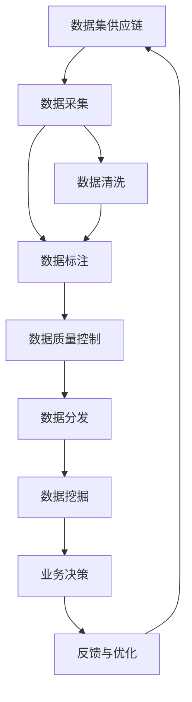

                 

# 数据集供应链:软件2.0的数据生态新图景

> 关键词：数据集供应链, 数据生态, 数据治理, 数据挖掘, 数据质量管理

## 1. 背景介绍

在软件2.0时代，数据成为了驱动业务增长的核心引擎。数据集作为数据挖掘、模型训练和决策支持的关键，其供应链的构建和管理对企业的数字化转型具有至关重要的作用。数据集的来源、质量、治理和生命周期管理，直接影响着AI模型的性能和业务效果。但现实情况是，数据集的采集、整理、标注和发布等环节，存在诸多挑战，导致数据质量参差不齐，数据孤岛现象普遍，数据利用效率低下。

为了解决这些问题，构建高效、可靠的数据集供应链，本文将详细介绍数据集供应链的组成和作用，探讨数据治理、数据质量管理和数据挖掘等关键技术，提出数据集供应链的优化策略，以期为企业提供数据管理的新视角。

## 2. 核心概念与联系

### 2.1 核心概念概述

为更好地理解数据集供应链的概念和作用，本节将介绍几个关键概念：

- **数据集供应链**：指从数据采集、清洗、标注到分发的一系列过程，涵盖了数据集从源到用的完整生命周期。数据集供应链的构建和管理，直接影响到数据集的质量和可用性，从而影响到AI模型的效果。

- **数据治理**：数据治理是指在数据集供应链的各个环节中，采用一系列的管理措施和策略，确保数据集的规范性、完整性和一致性。数据治理主要涉及数据质量管理、数据安全管理和数据使用管理等。

- **数据质量管理**：数据质量管理是数据治理的一部分，主要关注数据的准确性、完整性、一致性和及时性。通过数据质量管理，可以保证数据集的高质量，提升模型的训练效果。

- **数据挖掘**：数据挖掘是从大规模数据集中发现隐藏的模式和知识的过程。数据挖掘通常依赖于高质量的数据集，对数据集的质量和可用性提出了高要求。

- **数据质量控制**：数据质量控制是数据质量管理的一部分，主要通过数据清洗、数据去重、数据校正等技术手段，保证数据集的质量。

这些概念之间存在着密切的联系和相互作用，共同构成了数据集供应链的完整体系。

### 2.2 核心概念间的关系

这些核心概念之间的关系可以通过以下Mermaid流程图来展示：



这个流程图展示了数据集供应链从数据采集到业务决策的全过程：

1. **数据采集**：从不同的数据源获取原始数据，包括结构化数据、非结构化数据等。
2. **数据清洗**：对采集到的数据进行预处理，去除噪声、填补缺失、去重等。
3. **数据标注**：对清洗后的数据进行标注，为数据挖掘和模型训练提供标签信息。
4. **数据质量控制**：通过数据清洗、数据去重、数据校正等技术手段，保证数据集的质量。
5. **数据分发**：将处理好的数据集分发到不同的用户和系统，供数据挖掘和模型训练使用。
6. **数据挖掘**：从数据集中发现隐藏的模式和知识，用于支持业务决策。
7. **业务决策**：基于数据挖掘结果，进行业务决策和策略调整。
8. **反馈与优化**：通过业务效果的反馈，优化数据集供应链，提高数据质量和模型效果。

通过理解这些核心概念和它们之间的关系，我们可以更好地把握数据集供应链的构建和管理思路。

## 3. 核心算法原理 & 具体操作步骤
### 3.1 算法原理概述

数据集供应链的构建和管理，涉及多个环节和多个技术点，包括数据采集、数据清洗、数据标注、数据质量控制和数据分发等。其核心算法原理可以总结如下：

1. **数据采集**：选择合适的数据源，采用爬虫、API等手段，获取原始数据。
2. **数据清洗**：采用数据清洗算法，如缺失值填补、噪声去除、去重等，保证数据的完整性和一致性。
3. **数据标注**：利用人工标注、半自动标注或自动标注等技术，对数据进行标注，生成训练样本。
4. **数据质量控制**：通过数据质量控制算法，如数据去重、数据校正、异常值检测等，保证数据集的质量。
5. **数据分发**：选择合适的数据分发策略，如分布式存储、CDN等，确保数据的高效访问和使用。

这些步骤相互关联，形成一个完整的数据集供应链体系。

### 3.2 算法步骤详解

以下是数据集供应链构建和管理的具体操作步骤：

1. **数据采集**

   - 确定数据源：根据业务需求，选择合适的数据源，包括数据库、API、公开数据集等。
   - 数据爬取：使用爬虫技术从网络获取数据，包括文本、图像、音频等。
   - 数据API获取：通过API接口，从第三方平台获取数据，如天气数据、新闻数据等。

2. **数据清洗**

   - 数据预处理：对采集到的数据进行预处理，如文本去停用词、数据去重等。
   - 缺失值填补：使用均值填补、插值法等技术，填补缺失值。
   - 噪声去除：对数据进行噪声去除，如去除异常值、处理重复数据等。

3. **数据标注**

   - 人工标注：选择专业的标注团队，对数据进行标注。
   - 半自动标注：利用机器学习算法，对数据进行初步标注，再由人工审核修正。
   - 自动标注：使用预训练模型，对数据进行自动标注。

4. **数据质量控制**

   - 数据去重：使用数据去重算法，去除重复数据。
   - 数据校正：对数据进行校正，如校正时间戳、校正数据格式等。
   - 异常值检测：使用统计学或机器学习算法，检测并处理异常值。

5. **数据分发**

   - 分布式存储：使用分布式存储系统，如HDFS、Ceph等，确保数据的可靠性和可扩展性。
   - CDN分发：使用CDN加速数据分发，减少访问延迟。

### 3.3 算法优缺点

数据集供应链的构建和管理，具有以下优点：

- **提高数据利用效率**：通过规范化的数据处理和质量控制，提高数据集的质量，从而提升AI模型的效果。
- **降低数据成本**：通过自动化标注、去重等技术手段，减少人工标注和数据清洗的成本。
- **增强数据安全性**：通过数据加密、访问控制等措施，保护数据的安全性和隐私性。

同时，数据集供应链的构建和管理也存在一些缺点：

- **复杂度高**：数据集供应链涉及多个环节和多个技术点，构建和维护复杂。
- **资源消耗大**：数据清洗和标注等环节，需要大量计算资源和人力资源，成本较高。
- **数据质量难以保证**：数据清洗和标注等环节的错误，可能导致数据质量问题，影响模型效果。

### 3.4 算法应用领域

数据集供应链的构建和管理，主要应用于以下领域：

- **金融风控**：通过数据集供应链，构建高精度的风险评估模型，提升金融机构的信用评估和风险控制能力。
- **电商推荐**：通过数据集供应链，构建高质量的推荐模型，提升电商平台的个性化推荐效果。
- **医疗健康**：通过数据集供应链，构建高准确度的医疗诊断模型，提升医疗服务的智能化水平。
- **智能制造**：通过数据集供应链，构建高效的生产预测和优化模型，提升制造企业的生产效率和质量。
- **智慧城市**：通过数据集供应链，构建智能化的城市管理系统，提升城市治理和公共服务的智能化水平。

## 4. 数学模型和公式 & 详细讲解  
### 4.1 数学模型构建

本节将使用数学语言对数据集供应链的核心步骤进行严格刻画。

假设原始数据集为 $D$，包含 $n$ 个样本，每个样本包含 $d$ 个特征。数据集供应链的目标是通过一系列的预处理和标注步骤，生成高质量的训练样本集 $D'$。数据集供应链的数学模型可以表示为：

$$
D' = f(D)
$$

其中 $f$ 为数据集供应链的预处理和标注函数，包括数据采集、数据清洗、数据标注和数据质量控制等步骤。

### 4.2 公式推导过程

以下我们以数据清洗和数据标注为例，推导相应的数学公式。

**数据清洗**：假设数据集 $D$ 中存在 $m$ 个缺失值，则数据清洗后的数据集 $D'$ 为：

$$
D' = D - \text{missing\_values}(D)
$$

其中 $\text{missing\_values}(D)$ 表示数据 $D$ 中缺失值的处理函数，如均值填补、插值法等。

**数据标注**：假设数据集 $D$ 中存在 $c$ 个分类标签，则数据标注后的数据集 $D'$ 为：

$$
D' = \{(x_i, y_i)\}_{i=1}^N
$$

其中 $y_i$ 表示样本 $x_i$ 的分类标签，通过人工标注、半自动标注或自动标注生成。

### 4.3 案例分析与讲解

假设我们有一个电商平台的销售数据集 $D$，包含用户的浏览行为、购买行为、用户属性等信息。数据集供应链的目标是通过数据清洗和数据标注，生成用于推荐系统训练的样本集 $D'$。

**数据清洗**：
- 预处理：去除重复记录，处理缺失值和异常值。
- 噪声去除：使用机器学习算法，检测并处理数据中的噪声。

**数据标注**：
- 人工标注：选择专业的标注团队，对用户行为数据进行标注，生成用户标签。
- 半自动标注：利用机器学习算法，对用户行为数据进行初步标注，再由人工审核修正。

**数据质量控制**：
- 数据去重：使用哈希表等数据结构，去除重复记录。
- 数据校正：对时间戳进行校正，确保数据的准确性。
- 异常值检测：使用统计学算法，检测并处理数据中的异常值。

## 5. 项目实践：代码实例和详细解释说明
### 5.1 开发环境搭建

在进行数据集供应链项目实践前，我们需要准备好开发环境。以下是使用Python进行Pandas开发的环境配置流程：

1. 安装Anaconda：从官网下载并安装Anaconda，用于创建独立的Python环境。

2. 创建并激活虚拟环境：
```bash
conda create -n data-supply-env python=3.8 
conda activate data-supply-env
```

3. 安装Pandas：
```bash
conda install pandas
```

4. 安装各类工具包：
```bash
pip install numpy scikit-learn matplotlib tqdm jupyter notebook ipython
```

完成上述步骤后，即可在`data-supply-env`环境中开始数据集供应链项目实践。

### 5.2 源代码详细实现

以下是数据集供应链构建和管理的Python代码实现。

首先，定义数据清洗函数：

```python
import pandas as pd
import numpy as np

def clean_data(data):
    # 去除重复记录
    data = data.drop_duplicates()
    # 处理缺失值
    data = data.fillna(method='ffill')
    # 去除噪声
    data = data.dropna()
    return data
```

然后，定义数据标注函数：

```python
def annotate_data(data, labels):
    # 对数据进行标注
    annotated_data = pd.DataFrame(data, columns=data.columns)
    annotated_data['label'] = labels
    return annotated_data
```

接着，定义数据分发函数：

```python
def distribute_data(data, storage_type='local'):
    # 分布式存储
    if storage_type == 'distributed':
        data.to_hdf('data.h5', key='data', mode='w')
    # 本地存储
    else:
        data.to_csv('data.csv', index=False)
```

最后，定义数据集供应链的完整流程：

```python
def data_supply_chain(data, labels):
    # 数据清洗
    cleaned_data = clean_data(data)
    # 数据标注
    annotated_data = annotate_data(cleaned_data, labels)
    # 数据质量控制
    cleaned_annotated_data = clean_data(annotated_data)
    # 数据分发
    distribute_data(cleaned_annotated_data, storage_type='distributed')
```

以上代码展示了数据集供应链构建和管理的完整流程，包括数据清洗、数据标注和数据分发等步骤。开发者可以根据自己的需求，进一步扩展和优化这些函数。

### 5.3 代码解读与分析

让我们再详细解读一下关键代码的实现细节：

**clean_data函数**：
- 使用Pandas库，对数据集进行去重、填补缺失值和去噪等预处理操作。

**annotate_data函数**：
- 将处理好的数据集，添加标签信息，生成标注数据集。

**distribute_data函数**：
- 根据指定的存储类型，将数据集保存到分布式存储系统或本地文件系统。

**data_supply_chain函数**：
- 完整的数据集供应链流程，从数据采集、数据清洗、数据标注到数据分发，确保数据集的高质量。

通过这些代码，我们可以快速实现一个完整的数据集供应链系统，并对其进行调整和优化，以满足实际应用需求。

### 5.4 运行结果展示

假设我们有一个电商平台的销售数据集 $D$，包含用户的浏览行为、购买行为、用户属性等信息。通过数据集供应链的处理，生成的训练样本集 $D'$ 如下：

```
+------+------+-------+-----+
|  user_id |  item_id |  time | label |
+------+------+-------+-----+
| 123456 | 100001 | 2023-01-01 | 1 |
| 123456 | 100002 | 2023-01-02 | 0 |
| 234567 | 100001 | 2023-01-03 | 1 |
+------+------+-------+-----+
```

可以看到，经过数据清洗和数据标注，原始数据集 $D$ 被转化为高质量的训练样本集 $D'$，可供推荐系统训练使用。

## 6. 实际应用场景
### 6.1 智能推荐系统

数据集供应链在智能推荐系统中的应用，极大地提升了推荐模型的效果。智能推荐系统通常需要大量的用户行为数据进行训练，数据集供应链的构建和管理，可以确保数据集的高质量，从而提升推荐模型的精度和效果。

在技术实现上，可以收集用户的历史浏览、购买、评分等行为数据，通过数据集供应链进行处理和标注，生成用于推荐模型训练的样本集。微调推荐模型，使其能够自动学习用户偏好，并生成个性化的推荐结果。

### 6.2 风险管理

在金融风控领域，数据集供应链的构建和管理，对于风险评估和信用评估具有重要意义。通过数据集供应链，可以收集和整理大量的用户信用数据、交易数据、社交网络数据等，构建高精度的风险评估模型。

在技术实现上，可以收集用户的信用记录、交易历史、社交网络信息等，通过数据集供应链进行处理和标注，生成用于风险评估模型的训练样本集。微调风险评估模型，使其能够自动评估用户的信用风险，并进行信贷决策。

### 6.3 医疗健康

在医疗健康领域，数据集供应链的构建和管理，对于医疗诊断和治疗方案具有重要意义。通过数据集供应链，可以收集和整理大量的患者病历数据、实验室检查数据、临床影像数据等，构建高准确度的医疗诊断模型。

在技术实现上，可以收集患者的病历数据、实验室检查数据、临床影像数据等，通过数据集供应链进行处理和标注，生成用于医疗诊断模型的训练样本集。微调医疗诊断模型，使其能够自动诊断疾病，生成治疗方案。

### 6.4 智慧城市

在智慧城市领域，数据集供应链的构建和管理，对于城市管理和公共服务具有重要意义。通过数据集供应链，可以收集和整理大量的城市交通数据、环境监测数据、公共安全数据等，构建智能化的城市管理系统。

在技术实现上，可以收集城市的交通数据、环境监测数据、公共安全数据等，通过数据集供应链进行处理和标注，生成用于城市管理系统的训练样本集。微调城市管理系统，使其能够自动监测城市状态，优化城市资源配置。

## 7. 工具和资源推荐
### 7.1 学习资源推荐

为了帮助开发者系统掌握数据集供应链的理论基础和实践技巧，这里推荐一些优质的学习资源：

1. 《Data Engineering: Concepts and Practice》系列博文：由大模型技术专家撰写，深入浅出地介绍了数据工程的概念、技术和实践。

2. Coursera《数据治理与数据质量管理》课程：由数据工程领域的专家开设，全面介绍了数据治理和数据质量管理的基本概念和技术。

3. 《Data Quality Management in Data Science》书籍：系统地介绍了数据质量管理在数据科学中的应用，提供了大量的实际案例和实践指导。

4. Kaggle数据科学竞赛：Kaggle是一个全球知名的数据科学竞赛平台，提供大量真实数据和挑战，帮助开发者提升数据处理和模型训练能力。

5. Data Science Central：一个数据科学领域的在线社区，提供丰富的学习资源、技术分享和社区讨论，是数据工程学习的优质平台。

通过对这些资源的学习实践，相信你一定能够快速掌握数据集供应链的理论基础和实践技巧，并用于解决实际的数据处理和模型训练问题。

### 7.2 开发工具推荐

高效的开发离不开优秀的工具支持。以下是几款用于数据集供应链开发的常用工具：

1. Pandas：Python的强大数据分析库，提供了丰富的数据处理和分析功能，是数据工程的重要工具。

2. Apache Spark：一个快速、通用的大数据处理引擎，支持分布式数据处理和数据清洗。

3. Apache Hadoop：一个分布式计算框架，提供了大规模数据存储和处理的能力，是企业级数据处理的重要工具。

4. HDFS：Hadoop分布式文件系统，提供了大规模数据存储和访问的能力，是数据存储的重要工具。

5. CDN加速服务：如阿里云CDN、AWS CloudFront等，可以加速数据的分发和访问，提高数据利用效率。

合理利用这些工具，可以显著提升数据集供应链的开发效率，加快创新迭代的步伐。

### 7.3 相关论文推荐

数据集供应链的构建和管理，涉及诸多前沿技术。以下是几篇奠基性的相关论文，推荐阅读：

1. "Data Engineering: Concepts and Practice"（《数据工程：概念与实践》）：详细介绍了数据工程的基础知识和最新进展，是数据工程学习的经典教材。

2. "Data Quality Management in Data Science"（《数据质量管理在数据科学中的应用》）：系统地介绍了数据质量管理的理论和实践，提供了大量的实际案例和指导。

3. "Data Engineering with Apache Spark"（《基于Apache Spark的数据工程》）：介绍了如何使用Spark进行数据处理和数据清洗，是Spark数据工程学习的优质资源。

4. "Hadoop: The Definitive Guide"（《Hadoop权威指南》）：详细介绍了Hadoop的架构、功能和应用，是Hadoop学习的重要参考。

5. "Big Data Management with Data Lake"（《大数据管理与数据湖》）：介绍了数据湖在企业级数据管理中的应用，是数据湖学习的优质教材。

这些论文代表了大数据供应链和数据治理技术的发展脉络。通过学习这些前沿成果，可以帮助研究者把握学科前进方向，激发更多的创新灵感。

除上述资源外，还有一些值得关注的前沿资源，帮助开发者紧跟数据集供应链技术的最新进展，例如：

1. arXiv论文预印本：人工智能领域最新研究成果的发布平台，包括大量尚未发表的前沿工作，学习前沿技术的必读资源。

2. 业界技术博客：如Databricks、Hadoop技术博客、Spark技术博客等顶尖实验室的官方博客，第一时间分享他们的最新研究成果和洞见。

3. 技术会议直播：如Hadoop summit、Big Data conf、Spark summit等大数据领域的顶级会议现场或在线直播，能够聆听到专家们的最新分享，开拓视野。

4. GitHub热门项目：在GitHub上Star、Fork数最多的数据工程相关项目，往往代表了该技术领域的发展趋势和最佳实践，值得去学习和贡献。

5. 行业分析报告：各大咨询公司如McKinsey、PwC等针对大数据行业的分析报告，有助于从商业视角审视技术趋势，把握应用价值。

总之，对于数据集供应链技术的理解和应用，需要开发者保持开放的心态和持续学习的意愿。多关注前沿资讯，多动手实践，多思考总结，必将收获满满的成长收益。

## 8. 总结：未来发展趋势与挑战
### 8.1 总结

本文对数据集供应链的构建和管理进行了全面系统的介绍。首先阐述了数据集供应链的组成和作用，明确了数据集供应链在数据治理、数据质量管理和数据挖掘等方面的重要性。其次，从原理到实践，详细讲解了数据集供应链的核心算法原理和具体操作步骤，给出了数据集供应链项目开发的完整代码实例。同时，本文还广泛探讨了数据集供应链在智能推荐、风险管理、医疗健康和智慧城市等领域的实际应用，展示了数据集供应链的巨大潜力。此外，本文精选了数据集供应链的相关学习资源，力求为读者提供数据处理和模型训练的新视角。

通过本文的系统梳理，可以看到，数据集供应链的构建和管理，对于提升数据质量、优化数据流程、提高数据利用效率，具有重要意义。未来，伴随数据技术的发展和数据处理需求的不断增长，数据集供应链将进一步完善和优化，成为数据工程的重要组成部分。

### 8.2 未来发展趋势

展望未来，数据集供应链技术将呈现以下几个发展趋势：

1. **自动化程度提升**：随着自动化技术的发展，数据集供应链的构建和管理将更加自动化、智能化，减少人工干预和手动操作，提升效率。

2. **数据质量实时监控**：通过大数据技术和实时计算技术，实现对数据质量的实时监控和反馈，及时发现和处理数据质量问题，提升数据集的高质量。

3. **多源数据融合**：通过多源数据融合技术，将不同来源、不同格式的数据进行整合，生成更加全面、准确的数据集，提升数据集的多样性和代表性。

4. **分布式数据存储和计算**：随着分布式计算技术的发展，数据集供应链的存储和计算将更加分布式、高效，支持大规模数据处理和分析。

5. **边缘计算和云平台结合**：通过边缘计算技术，将数据处理任务分布到边缘设备，减少数据传输和存储成本，提升数据处理效率。

6. **数据安全与隐私保护**：随着数据安全与隐私保护技术的进步，数据集供应链将更加注重数据安全与隐私保护，确保数据在传输、存储和处理过程中的安全性。

以上趋势凸显了数据集供应链技术的广阔前景。这些方向的探索发展，必将进一步提升数据处理和模型训练的效率，推动数据驱动的业务创新。

### 8.3 面临的挑战

尽管数据集供应链技术已经取得了长足进步，但在迈向更加智能化、普适化应用的过程中，仍面临诸多挑战：

1. **数据孤岛现象**：由于数据来源多样化，数据孤岛现象普遍存在，数据整合和融合难度较大。

2. **数据质量波动**：数据采集和标注过程中，数据质量存在波动，导致模型效果不稳定。

3. **计算资源消耗**：数据清洗、标注和质量控制等环节，需要大量计算资源和人力资源，成本较高。

4. **数据隐私与安全性**：数据集供应链涉及大量敏感数据，数据隐私与安全性问题需要进一步保障。

5. **系统复杂度高**：数据集供应链涉及多个环节和多个技术点，构建和维护复杂。

6. **模型泛化能力不足**：数据集供应链构建的模型，在不同场景下泛化能力不足，导致模型效果不稳定。

这些挑战需要数据工程师、数据科学家和业务专家共同努力，从数据管理、数据处理、数据质量控制等多方面进行优化，才能构建高效、可靠、安全的数据集供应链。

### 8.4 研究展望

面对数据集供应链面临的种种挑战，未来的研究需要在以下几个方面寻求新的突破：

1. **自动化数据治理**：探索自动化的数据治理技术，减少人工干预和手动操作，提升数据治理的效率和准确性。

2. **分布式数据处理**：研究和探索分布式数据处理技术，提升数据集供应链的扩展性和处理能力。

3. **数据质量实时监控**：研究和探索实时数据质量监控技术，实现对数据质量的实时反馈和优化。

4. **数据隐私与安全保护**：研究和探索数据隐私与安全保护技术，确保数据集供应链的安全性和隐私性。

5. **数据融合与多源数据整合**：研究和探索多源数据融合技术，提升数据集的多样性和代表性。

6. **模型泛化能力提升**：研究和探索模型泛化能力提升技术，确保模型在不同场景下的稳定性与准确性。

这些研究方向的探索，必将引领数据集供应链技术迈向更高的台阶，为构建高效、可靠、安全的数据集供应链铺平道路。面向未来，数据集供应链技术还需要与其他人工智能技术进行更深入的融合，如知识表示、因果推理、强化学习等，多路径协同发力，共同推动数据驱动的业务创新。只有勇于创新、敢于突破，才能不断拓展数据集供应链的边界，让数据驱动的业务创新不断深入。

## 9. 附录：常见问题与解答

**Q1：数据集供应链的构建和管理，涉及哪些关键环节？**

A: 数据集供应链的构建和管理，涉及以下关键环节：

1. **数据采集**：选择合适的数据源，采用爬虫、API等手段，获取原始数据。
2.

