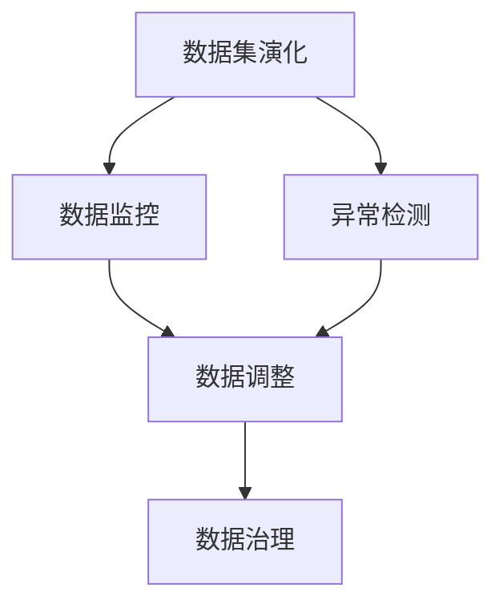

                 

# 数据集演化:如何在软件2.0中管理数据漂移

在软件工程的历史长河中，我们见证了从1.0到2.0的巨大转变。从早期的流程化开发，到现代化的DevOps，再到如今的软件2.0。软件2.0时代的到来，标志着编程范式从“操作代码”转变为“操作数据”，数据的价值日益凸显。然而，随着数据集在规模和复杂度上的不断演化，数据漂移成为了不可避免的挑战。本文将深入探讨数据集演化与软件2.0的关系，揭示如何高效管理数据漂移，从而确保数据驱动的应用程序能够持续稳定地运行。

## 1. 背景介绍

### 1.1 问题由来
在软件2.0时代，数据集已经成为软件系统的核心资产，驱动着应用程序的创新与发展。然而，随着数据集的使用场景和需求不断变化，数据漂移（Data Drift）现象变得日益普遍。数据漂移指的是数据集在不同时间点上分布的差异，可能导致模型性能下降、推荐算法失效等问题，严重影响应用程序的稳定性和用户满意度。

数据漂移可以由多种因素引起，包括数据分布的长期变化、噪声数据的引入、训练数据与实时数据差异等。因此，如何在软件2.0时代高效管理数据漂移，成为一项至关重要的技术挑战。

### 1.2 问题核心关键点
数据漂移的管理包括：
1. 数据集演化：理解数据集的分布变化和演化趋势。
2. 数据监控：实时监测数据分布的异常变化。
3. 异常检测：检测数据漂移和异常数据。
4. 数据调整：根据检测结果调整数据集或模型。
5. 数据治理：制定数据治理策略，确保数据集质量。

通过这些关键点的探索，本文将帮助读者系统掌握数据漂移的管理方法，保障软件2.0应用的长期稳定运行。

## 2. 核心概念与联系

### 2.1 核心概念概述

为了更好地理解数据漂移的管理方法，本节将介绍几个密切相关的核心概念：

- **数据漂移（Data Drift）**：指数据集在不同时间点上分布的差异，可能导致模型性能下降、推荐算法失效等问题，严重影响应用程序的稳定性和用户满意度。

- **数据监控（Data Monitoring）**：通过实时监测数据分布的异常变化，及时发现数据漂移和异常数据。

- **异常检测（Anomaly Detection）**：检测数据漂移和异常数据，评估数据集的质量和稳定性。

- **数据调整（Data Adjustment）**：根据检测结果调整数据集或模型，以适应新的数据分布。

- **数据治理（Data Governance）**：制定数据治理策略，确保数据集质量，包括数据收集、清洗、标注等方面的规范管理。

- **数据集演化（Data Evolution）**：理解数据集的分布变化和演化趋势，预测未来的数据变化。

这些核心概念之间存在着紧密的联系，共同构成了数据漂移管理的完整生态系统。通过理解这些核心概念，我们可以更好地把握数据漂移管理的逻辑和实施步骤。

### 2.2 概念间的关系

这些核心概念之间的关系可以通过以下Mermaid流程图来展示：



这个流程图展示了从数据集演化到数据治理的完整过程。数据集演化是数据漂移管理的起点，数据监控和异常检测是中间环节，数据调整和数据治理是最终保障。通过理解这些核心概念之间的关系，我们可以更好地系统化地实施数据漂移管理策略。

## 3. 核心算法原理 & 具体操作步骤
### 3.1 算法原理概述

数据漂移的管理通常采用监督学习和无监督学习相结合的方法。其核心思想是通过监测数据集的统计特征，检测数据分布的变化，并根据检测结果调整数据集或模型，以适应新的数据分布。

具体来说，数据漂移的管理过程包括以下几个关键步骤：

1. 数据采集：收集原始数据，并对其进行预处理，如数据清洗、标准化等。
2. 特征提取：从数据中提取有意义的特征，如均值、方差、分布等。
3. 模型训练：使用历史数据训练监督学习模型，用于检测数据漂移。
4. 实时监测：对实时数据进行监控，检测数据漂移和异常数据。
5. 异常处理：根据检测结果调整数据集或模型，确保数据分布的稳定。
6. 数据治理：制定数据治理策略，确保数据集的质量和完整性。

通过这些步骤，我们可以高效地管理数据漂移，保障数据驱动的应用程序稳定运行。

### 3.2 算法步骤详解

数据漂移的管理通常采用监督学习和无监督学习相结合的方法。其核心思想是通过监测数据集的统计特征，检测数据分布的变化，并根据检测结果调整数据集或模型，以适应新的数据分布。

具体来说，数据漂移的管理过程包括以下几个关键步骤：

1. **数据采集**：收集原始数据，并对其进行预处理，如数据清洗、标准化等。

2. **特征提取**：从数据中提取有意义的特征，如均值、方差、分布等。

3. **模型训练**：使用历史数据训练监督学习模型，用于检测数据漂移。

4. **实时监测**：对实时数据进行监控，检测数据漂移和异常数据。

5. **异常处理**：根据检测结果调整数据集或模型，确保数据分布的稳定。

6. **数据治理**：制定数据治理策略，确保数据集的质量和完整性。

### 3.3 算法优缺点

数据漂移的管理方法具有以下优点：

1. 能够实时检测数据分布的变化，及时发现数据漂移和异常数据。
2. 能够根据检测结果调整数据集或模型，确保数据分布的稳定。
3. 能够制定数据治理策略，确保数据集的质量和完整性。

同时，该方法也存在一定的局限性：

1. 对数据的统计特征提取要求较高，需要选择合适的特征。
2. 需要实时监测数据分布，增加了计算资源消耗。
3. 模型训练和调整过程可能复杂，需要较强的技术支持。

尽管存在这些局限性，但就目前而言，数据漂移的管理方法是数据驱动应用中不可或缺的一部分。未来相关研究的重点在于如何进一步提高数据漂移检测的准确性和效率，降低计算资源消耗，并简化模型调整的复杂度。

### 3.4 算法应用领域

数据漂移的管理方法广泛应用于各种数据驱动的应用程序，如推荐系统、金融风控、智能医疗等。以下是几个典型应用场景：

- **推荐系统**：在推荐系统中，用户兴趣和商品特征会随时间变化，导致推荐结果失效。通过数据漂移管理，可以及时检测并调整推荐模型，确保推荐结果的准确性和时效性。

- **金融风控**：在金融风控中，用户行为和市场环境会随时间变化，导致风险模型失效。通过数据漂移管理，可以及时检测并调整风险模型，确保风险评估的准确性和稳定性。

- **智能医疗**：在智能医疗中，患者数据和疾病特征会随时间变化，导致诊断模型失效。通过数据漂移管理，可以及时检测并调整诊断模型，确保诊断结果的准确性和可靠性。

除了上述这些应用场景外，数据漂移管理技术还将在更多领域得到应用，为数据驱动的创新应用提供坚实的保障。

## 4. 数学模型和公式 & 详细讲解 & 举例说明

### 4.1 数学模型构建

本节将使用数学语言对数据漂移的管理方法进行更加严格的刻画。

设原始数据集为 $D=\{(x_i, y_i)\}_{i=1}^N$，其中 $x_i$ 为输入特征，$y_i$ 为标签。设历史数据集的均值和方差分别为 $\mu_0$ 和 $\sigma_0$，当前数据集的均值和方差分别为 $\mu_1$ 和 $\sigma_1$。

定义数据漂移度量为 $d = \frac{\mu_1 - \mu_0}{\sigma_0}$，用于衡量当前数据集与历史数据集的差异程度。当 $d$ 较大时，表示数据漂移严重，需要采取措施进行调整。

### 4.2 公式推导过程

以下我们以二分类任务为例，推导数据漂移度量的计算公式。

设当前数据集和历史数据集的均值和方差分别为 $\mu_1, \sigma_1$ 和 $\mu_0, \sigma_0$，定义数据漂移度量为 $d = \frac{\mu_1 - \mu_0}{\sigma_0}$，用于衡量当前数据集与历史数据集的差异程度。

具体计算步骤如下：

1. 计算当前数据集和历史数据集的均值：
$$
\mu_1 = \frac{1}{N_1} \sum_{i=1}^{N_1} x_i
$$
$$
\mu_0 = \frac{1}{N_0} \sum_{i=1}^{N_0} x_i
$$

2. 计算当前数据集和历史数据集的方差：
$$
\sigma_1^2 = \frac{1}{N_1} \sum_{i=1}^{N_1} (x_i - \mu_1)^2
$$
$$
\sigma_0^2 = \frac{1}{N_0} \sum_{i=1}^{N_0} (x_i - \mu_0)^2
$$

3. 计算数据漂移度量：
$$
d = \frac{\mu_1 - \mu_0}{\sigma_0}
$$

通过上述公式，可以计算出当前数据集与历史数据集之间的数据漂移度量，进而判断是否需要采取措施进行调整。

### 4.3 案例分析与讲解

假设在推荐系统中，我们使用历史数据集训练了推荐模型，并实时监测用户的点击行为。设历史数据集的均值和方差分别为 $\mu_0$ 和 $\sigma_0$，当前数据集的均值和方差分别为 $\mu_1$ 和 $\sigma_1$。当用户点击行为随时间变化，导致推荐模型失效时，我们需要通过数据漂移管理方法及时检测并调整推荐模型。

具体步骤如下：

1. 收集用户的点击行为数据，计算当前数据集的均值和方差。

2. 使用历史数据集的均值和方差，计算数据漂移度量 $d$。

3. 当 $d$ 较大时，表示当前数据集与历史数据集的差异较大，需要采取措施进行调整。

4. 根据检测结果调整推荐模型，确保推荐结果的准确性和时效性。

## 5. 项目实践：代码实例和详细解释说明

### 5.1 开发环境搭建

在进行数据漂移管理实践前，我们需要准备好开发环境。以下是使用Python进行PyTorch开发的环境配置流程：

1. 安装Anaconda：从官网下载并安装Anaconda，用于创建独立的Python环境。

2. 创建并激活虚拟环境：
```bash
conda create -n pytorch-env python=3.8 
conda activate pytorch-env
```

3. 安装PyTorch：根据CUDA版本，从官网获取对应的安装命令。例如：
```bash
conda install pytorch torchvision torchaudio cudatoolkit=11.1 -c pytorch -c conda-forge
```

4. 安装TensorFlow：
```bash
conda install tensorflow
```

5. 安装各类工具包：
```bash
pip install numpy pandas scikit-learn matplotlib tqdm jupyter notebook ipython
```

完成上述步骤后，即可在`pytorch-env`环境中开始数据漂移管理实践。

### 5.2 源代码详细实现

这里我们以二分类任务为例，给出使用PyTorch对数据漂移进行实时监测的代码实现。

```python
import numpy as np
import torch
from sklearn.preprocessing import StandardScaler

# 定义数据漂移度量函数
def data_drift_degree(X_train, X_test):
    X_train_mean = X_train.mean(axis=0)
    X_test_mean = X_test.mean(axis=0)
    X_train_var = X_train.var(axis=0)
    X_test_var = X_test.var(axis=0)
    
    # 计算数据漂移度量
    data_drift = np.sqrt(np.sum((X_test_mean - X_train_mean) ** 2) / X_train_var)
    return data_drift

# 加载数据
train_data = np.load('train_data.npy')
test_data = np.load('test_data.npy')

# 标准化数据
scaler = StandardScaler()
train_data = scaler.fit_transform(train_data)
test_data = scaler.transform(test_data)

# 计算数据漂移度量
data_drift = data_drift_degree(train_data, test_data)
print('Data Drift:', data_drift)
```

在这个代码示例中，我们首先定义了一个数据漂移度量函数 `data_drift_degree`，用于计算当前数据集与历史数据集之间的数据漂移度量。该函数首先计算当前数据集和历史数据集的均值和方差，然后根据均值差异和方差计算数据漂移度量。

接下来，我们加载训练集和测试集的数据，并使用 `StandardScaler` 对数据进行标准化处理，以消除数据尺度差异的影响。最后，我们调用 `data_drift_degree` 函数计算数据漂移度量，并在控制台上输出结果。

### 5.3 代码解读与分析

让我们再详细解读一下关键代码的实现细节：

**data_drift_degree函数**：
- 该函数用于计算当前数据集和历史数据集之间的数据漂移度量。
- 首先计算两个数据集的均值和方差。
- 然后根据均值差异和方差计算数据漂移度量。
- 最后返回数据漂移度量值。

**StandardScaler类**：
- 用于对数据进行标准化处理，即对数据进行去均值化和缩放，以消除数据尺度差异的影响。
- 在 `fit_transform` 方法中，首先计算均值和方差，然后使用标准化公式对数据进行变换。
- 在 `transform` 方法中，使用标准化公式对数据进行变换，但不需要重新计算均值和方差。

**train_data和test_data变量**：
- 分别代表训练集和测试集的数据，这里以二维数组形式存储。
- 训练集和测试集的数据需要预先进行标准化处理，以确保数据漂移度量的计算准确性。

**data_drift变量**：
- 用于存储计算得到的数据漂移度量值。
- 通过调用 `data_drift_degree` 函数计算，并在控制台上输出。

可以看到，通过上述代码示例，我们可以很方便地对数据进行标准化处理，并计算数据漂移度量，从而实现对数据漂移的实时监测。

### 5.4 运行结果展示

假设我们在推荐系统中，使用历史数据集训练了推荐模型，并实时监测用户的点击行为。设历史数据集的均值和方差分别为 $\mu_0$ 和 $\sigma_0$，当前数据集的均值和方差分别为 $\mu_1$ 和 $\sigma_1$。当用户点击行为随时间变化，导致推荐模型失效时，我们需要通过数据漂移管理方法及时检测并调整推荐模型。

具体步骤如下：

1. 收集用户的点击行为数据，计算当前数据集的均值和方差。

2. 使用历史数据集的均值和方差，计算数据漂移度量 $d$。

3. 当 $d$ 较大时，表示当前数据集与历史数据集的差异较大，需要采取措施进行调整。

4. 根据检测结果调整推荐模型，确保推荐结果的准确性和时效性。

## 6. 实际应用场景
### 6.1 智能推荐系统

在智能推荐系统中，数据漂移管理技术可以用于检测用户兴趣和商品特征的变化，及时调整推荐模型。当用户兴趣随时间变化时，推荐模型可能会失效，通过数据漂移管理技术，可以实时监测并调整模型，确保推荐结果的准确性和时效性。

### 6.2 金融风控系统

在金融风控系统中，用户行为和市场环境会随时间变化，导致风险模型失效。通过数据漂移管理技术，可以实时监测并调整模型，确保风险评估的准确性和稳定性。

### 6.3 智能医疗系统

在智能医疗系统中，患者数据和疾病特征会随时间变化，导致诊断模型失效。通过数据漂移管理技术，可以实时监测并调整模型，确保诊断结果的准确性和可靠性。

### 6.4 未来应用展望

随着数据漂移管理技术的不断发展，未来将在更多领域得到应用，为数据驱动的创新应用提供坚实的保障。

在智慧城市治理中，数据漂移管理技术可以用于实时监测城市事件和舆情变化，及时调整决策模型，提高城市管理的自动化和智能化水平。

在企业生产管理中，数据漂移管理技术可以用于实时监测生产数据和设备状态，及时调整生产模型，提高生产效率和质量。

在教育领域，数据漂移管理技术可以用于实时监测学生行为和学习数据，及时调整教学模型，提高教育质量和个性化水平。

此外，在更多领域中，数据漂移管理技术将不断拓展应用场景，为数据驱动的创新应用提供坚实的保障。

## 7. 工具和资源推荐
### 7.1 学习资源推荐

为了帮助开发者系统掌握数据漂移的管理方法，这里推荐一些优质的学习资源：

1. 《Python数据分析与数据可视化》系列博文：由数据科学专家撰写，深入浅出地介绍了Python在数据分析和数据可视化方面的应用。

2. 《机器学习实战》课程：由谷歌开发者提供，涵盖机器学习基础和实战项目，从理论到实践，全面讲解机器学习技术。

3. 《数据科学实战》书籍：全面介绍了数据科学的基础知识和实战技巧，涵盖数据清洗、特征工程、模型训练等方面。

4. 《Kaggle数据科学实战》教程：Kaggle官方教程，提供了大量数据科学实战项目，涵盖数据预处理、模型调优、性能评估等方面。

5. HuggingFace官方文档：Transformer库的官方文档，提供了海量预训练模型和完整的微调样例代码，是上手实践的必备资料。

通过对这些资源的学习实践，相信你一定能够快速掌握数据漂移的管理精髓，并用于解决实际的NLP问题。

### 7.2 开发工具推荐

高效的开发离不开优秀的工具支持。以下是几款用于数据漂移管理开发的常用工具：

1. PyTorch：基于Python的开源深度学习框架，灵活动态的计算图，适合快速迭代研究。大部分预训练语言模型都有PyTorch版本的实现。

2. TensorFlow：由Google主导开发的开源深度学习框架，生产部署方便，适合大规模工程应用。同样有丰富的预训练语言模型资源。

3. Transformers库：HuggingFace开发的NLP工具库，集成了众多SOTA语言模型，支持PyTorch和TensorFlow，是进行数据漂移管理开发的利器。

4. Weights & Biases：模型训练的实验跟踪工具，可以记录和可视化模型训练过程中的各项指标，方便对比和调优。与主流深度学习框架无缝集成。

5. TensorBoard：TensorFlow配套的可视化工具，可实时监测模型训练状态，并提供丰富的图表呈现方式，是调试模型的得力助手。

6. Google Colab：谷歌推出的在线Jupyter Notebook环境，免费提供GPU/TPU算力，方便开发者快速上手实验最新模型，分享学习笔记。

合理利用这些工具，可以显著提升数据漂移管理的开发效率，加快创新迭代的步伐。

### 7.3 相关论文推荐

数据漂移管理技术的发展源于学界的持续研究。以下是几篇奠基性的相关论文，推荐阅读：

1. Data Drift Detection in Multi-Stream Time Series Using Recurrent Neural Networks（IEEE TNNLS）：提出了基于RNN的数据漂移检测方法，能够处理多维时间序列数据。

2. Online Anomaly Detection in Time Series: A Survey（IEEE TSCI）：综述了在线异常检测算法，介绍了各种时间序列异常检测方法。

3. Data Drift Detection in Streaming Data Streams with Fixed Models（JMLR）：提出了基于固定模型的时间序列数据漂移检测方法。

4. Online Anomaly Detection and Data Drift Detection in Time Series Using Deep Autoencoder Neural Networks（IEEE TCSVT）：提出了基于深度神经网络的数据漂移检测方法。

5. A Survey of Online Anomaly Detection Algorithms（IEEE TSCI）：综述了在线异常检测算法，介绍了各种异常检测方法。

这些论文代表了大数据漂移检测技术的发展脉络。通过学习这些前沿成果，可以帮助研究者把握学科前进方向，激发更多的创新灵感。

除上述资源外，还有一些值得关注的前沿资源，帮助开发者紧跟数据漂移管理技术的最新进展，例如：

1. arXiv论文预印本：人工智能领域最新研究成果的发布平台，包括大量尚未发表的前沿工作，学习前沿技术的必读资源。

2. 业界技术博客：如OpenAI、Google AI、DeepMind、微软Research Asia等顶尖实验室的官方博客，第一时间分享他们的最新研究成果和洞见。

3. 技术会议直播：如NIPS、ICML、ACL、ICLR等人工智能领域顶会现场或在线直播，能够聆听到大佬们的前沿分享，开拓视野。

4. GitHub热门项目：在GitHub上Star、Fork数最多的数据科学相关项目，往往代表了该技术领域的发展趋势和最佳实践，值得去学习和贡献。

5. 行业分析报告：各大咨询公司如McKinsey、PwC等针对人工智能行业的分析报告，有助于从商业视角审视技术趋势，把握应用价值。

总之，对于数据漂移管理技术的学习和实践，需要开发者保持开放的心态和持续学习的意愿。多关注前沿资讯，多动手实践，多思考总结，必将收获满满的成长收益。

## 8. 总结：未来发展趋势与挑战

### 8.1 总结

本文对数据漂移的管理方法进行了全面系统的介绍。首先阐述了数据漂移的概念及其管理方法的核心思想，明确了数据漂移在软件2.0时代的重要性和紧迫性。其次，从原理到实践，详细讲解了数据漂移管理的数学模型和操作步骤，给出了数据漂移管理任务开发的完整代码实例。同时，本文还广泛探讨了数据漂移管理方法在推荐系统、金融风控、智能医疗等多个领域的应用前景，展示了数据漂移管理技术的巨大潜力。

通过本文的系统梳理，可以看到，数据漂移管理技术在软件2.0时代的作用日益凸显。数据漂移管理技术将成为保障数据驱动应用长期稳定运行的重要手段。未来，伴随数据漂移管理方法的不断演进，基于数据驱动的应用程序将具备更强的鲁棒性和稳定性，为人工智能技术的普及和应用带来新的突破。

### 8.2 未来发展趋势

展望未来，数据漂移的管理技术将呈现以下几个发展趋势：

1. **数据集演化分析**：未来的数据漂移管理技术将更加注重数据集演化的分析，理解数据漂移的根本原因和趋势，提前预防和应对数据漂移。

2. **实时监测与预测**：未来的数据漂移管理技术将更加注重实时监测和预测，及时发现和预警数据漂移，保障数据驱动应用的稳定运行。

3. **异常检测与处理**：未来的数据漂移管理技术将更加注重异常检测与处理，使用机器学习算法对异常数据进行自动识别和处理，确保数据驱动应用的健壮性。

4. **跨领域数据漂移管理**：未来的数据漂移管理技术将更加注重跨领域的数据漂移管理，从单一领域的局部优化转向全局优化，实现更高效的数据漂移管理。

5. **自动化与智能化**：未来的数据漂移管理技术将更加注重自动化与智能化，使用智能算法实现数据漂移管理任务的自动化，提升管理效率和精度。

以上趋势凸显了数据漂移管理技术的广阔前景。这些方向的探索发展，必将进一步提升数据驱动应用的管理效率，保障其长期稳定运行。

### 8.3 面临的挑战

尽管数据漂移管理技术已经取得了一定的进展，但在实际应用中，仍面临以下挑战：

1. **数据多样性**：不同领域的数据具有不同的特点，需要采用不同的数据漂移管理方法。这增加了数据漂移管理技术的复杂性。

2. **计算资源消耗**：实时监测和异常检测需要大量的计算资源，特别是对于大规模数据集，计算资源消耗较大。

3. **模型泛化性**：目前大多数数据漂移管理方法都基于特定领域的数据，泛化性较弱，难以应用于更多领域。

4. **数据隐私和安全**：在数据漂移管理过程中，需要对用户数据进行分析和处理，如何保护用户数据隐私和安全，是一大挑战。

5. **模型可解释性**：数据漂移管理模型通常是黑盒模型，难以解释其内部工作机制和决策逻辑，限制了其在实际应用中的应用。

6. **数据治理复杂性**：数据漂移管理涉及数据收集、清洗、标注等方面的规范管理，需要制定详细的数据治理策略。

正视数据漂移管理面临的这些挑战，积极应对并寻求突破，将是大数据漂移管理走向成熟的必由之路。相信随着学界和产业界的共同努力，这些挑战终将一一被克服，数据漂移管理技术必将引领数据驱动应用迈向更高的台阶。

### 8.4 研究展望

面对数据漂移管理所面临的挑战，未来的研究需要在以下几个方面寻求新的突破：

1. **跨领域数据漂移管理方法**：开发通用的数据漂移管理方法，能够适用于更多领域的数据漂移管理，提升数据的泛化性。

2. **实时监测与预测算法**：开发高效实时监测与预测算法，降低计算资源消耗，提升数据漂移管理的效率。

3. **自动化与智能化管理工具**：开发自动化与智能化数据漂移管理工具，提升数据漂

