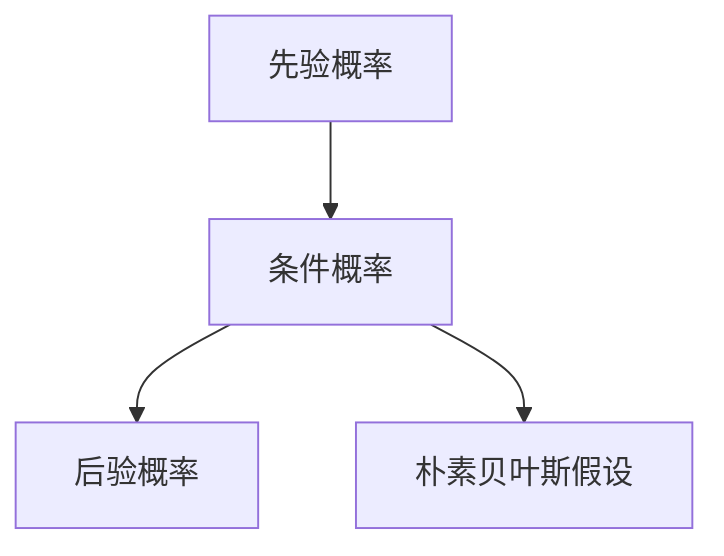
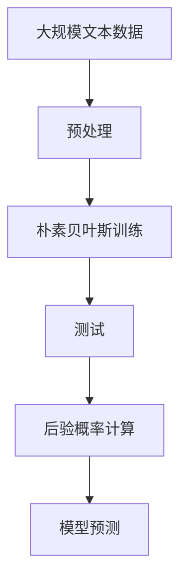

                 

## 1. 背景介绍

### 1.1 问题由来
朴素贝叶斯（Naive Bayes）是一种基于概率统计的简单分类算法，广泛应用于文本分类、垃圾邮件过滤、情感分析等场景。尽管算法本身非常简单，但其分类精度往往能达到甚至超过复杂模型。因此，朴素贝叶斯被认为是一种有效的、高效的分类工具。

### 1.2 问题核心关键点
朴素贝叶斯的核心在于其概率计算公式，它基于贝叶斯定理，通过先验概率和条件概率，计算后验概率来实现分类。朴素贝叶斯的“朴素”体现在其假设所有特征之间是独立的，这种假设简化了计算过程，同时也限制了算法在处理复杂关系时的能力。

### 1.3 问题研究意义
朴素贝叶斯算法的研究意义主要体现在其简单、高效和适用范围广的特点。朴素贝叶斯可以处理多分类问题，适用于文本分类、语音识别、图像处理等多种应用场景。此外，朴素贝叶斯算法对于小规模数据集表现良好，可以在资源有限的条件下快速部署。

## 2. 核心概念与联系

### 2.1 核心概念概述

为了更好地理解朴素贝叶斯算法，我们先介绍几个关键概念：

- **先验概率（Prior Probability）**：在分类前，对于每个类别出现的概率的估计，即该类别在总体中的比例。
- **条件概率（Conditional Probability）**：在已知类别的情况下，某些特征出现的概率。
- **后验概率（Posterior Probability）**：在观察到某些特征后，该类别出现的概率，即模型对这些特征的预测概率。
- **朴素贝叶斯假设（Naive Assumption）**：朴素贝叶斯算法的核心假设，即假设所有特征之间是条件独立的，这种假设简化了模型计算。

### 2.2 核心概念的联系

朴素贝叶斯算法的核心在于其概率计算公式，公式本身并不复杂，但背后蕴含着丰富的概率论知识。朴素贝叶斯算法通过先验概率和条件概率的计算，最终得到后验概率，从而实现分类。这种通过概率计算来求解分类问题的思想，是机器学习中一种常见的思路。

这些核心概念之间的逻辑关系可以通过以下Mermaid流程图来展示：



这个流程图展示了几大核心概念之间的逻辑关系：

1. 先验概率是分类前对各个类别的估计。
2. 条件概率是在已知类别的情况下，某些特征出现的概率。
3. 后验概率是通过朴素贝叶斯公式计算得到，即对所有类别进行后验概率的计算，最终选择后验概率最大的类别作为预测结果。

### 2.3 核心概念的整体架构

最后，我们用一个综合的流程图来展示这些核心概念在大规模文本分类中的应用：



这个综合流程图展示了从数据预处理、模型训练到模型测试和预测的完整流程。首先对大规模文本数据进行预处理，然后通过朴素贝叶斯算法进行训练，计算模型参数。最后对新的测试集进行后验概率计算，得出模型预测结果。

## 3. 核心算法原理 & 具体操作步骤
### 3.1 算法原理概述

朴素贝叶斯算法的核心在于其概率计算公式，即贝叶斯定理和朴素贝叶斯假设。贝叶斯定理表述为：

$$
P(A|B) = \frac{P(B|A)P(A)}{P(B)}
$$

其中 $P(A|B)$ 是后验概率，$P(B|A)$ 是条件概率，$P(A)$ 是先验概率，$P(B)$ 是边缘概率。朴素贝叶斯假设进一步假设所有特征之间是独立的，即：

$$
P(X_1, X_2, ..., X_n|A) = P(X_1|A)P(X_2|A)...P(X_n|A)
$$

因此，朴素贝叶斯算法的概率计算公式可以简化为：

$$
P(A|x_1,x_2,...,x_n) = \frac{P(A) \prod_{i=1}^n P(x_i|A)}{\sum_{j=1}^C P(j) \prod_{i=1}^n P(x_i|j)}
$$

其中 $x_1,x_2,...,x_n$ 是样本特征，$A$ 是分类标签，$C$ 是类别数。

### 3.2 算法步骤详解

朴素贝叶斯算法的具体步骤包括数据预处理、模型训练和预测。下面将详细介绍每个步骤：

#### 3.2.1 数据预处理
朴素贝叶斯算法对数据的要求不高，但需要保证数据的完整性和一致性。数据预处理主要包括以下几个步骤：

1. **数据清洗**：去除缺失值、重复值等异常数据。
2. **特征提取**：将原始数据转换为模型所需的特征向量，如将文本转换为词袋模型。
3. **标准化/归一化**：对特征进行标准化或归一化处理，使数据具有相同的量级。

#### 3.2.2 模型训练
模型训练的目的是计算每个类别在训练集中的先验概率和每个特征在给定类别下的条件概率。具体步骤如下：

1. **计算先验概率**：统计每个类别在训练集中的样本数，计算每个类别的先验概率。
2. **计算条件概率**：对于每个类别，统计该类别下各个特征的出现次数，计算每个特征在给定类别下的条件概率。

#### 3.2.3 预测
预测过程使用已训练好的模型对新样本进行分类。具体步骤如下：

1. **计算后验概率**：将测试样本的特征向量代入朴素贝叶斯公式，计算每个类别的后验概率。
2. **选择最大后验概率类别**：选择后验概率最大的类别作为模型的预测结果。

### 3.3 算法优缺点

朴素贝叶斯算法具有以下优点：

1. **计算简单**：朴素贝叶斯算法的计算量较小，适合处理大规模数据集。
2. **易于实现**：算法实现简单，容易理解和调试。
3. **适用于多分类问题**：朴素贝叶斯可以处理多分类问题，具有较高的分类准确率。

同时，朴素贝叶斯算法也存在以下缺点：

1. **朴素假设**：朴素贝叶斯算法假设所有特征之间是条件独立的，这在实际应用中往往不成立。
2. **参数估计不稳定**：当特征数较多时，朴素贝叶斯算法对参数的估计可能不稳定，导致分类效果下降。
3. **不适合处理连续型数据**：朴素贝叶斯算法通常用于离散型数据的分类，不适合处理连续型数据。

### 3.4 算法应用领域

朴素贝叶斯算法在许多领域都有广泛的应用，以下是几个典型的应用场景：

1. **文本分类**：朴素贝叶斯算法在文本分类中的应用非常广泛，如垃圾邮件过滤、情感分析、主题分类等。
2. **语音识别**：朴素贝叶斯算法在语音识别中用于声音特征的分类，如说话人识别、语音识别等。
3. **图像处理**：朴素贝叶斯算法在图像处理中用于像素级别的分类，如图像分割、目标检测等。
4. **金融风控**：朴素贝叶斯算法在金融风控中用于信用评分、欺诈检测等。
5. **推荐系统**：朴素贝叶斯算法在推荐系统中用于用户行为分析，如商品推荐、用户分类等。

## 4. 数学模型和公式 & 详细讲解 & 举例说明

### 4.1 数学模型构建

朴素贝叶斯算法的数学模型可以概括为：

1. **先验概率**：$P(A_i)$，表示类别 $i$ 在训练集中出现的概率。
2. **条件概率**：$P(X_j|A_i)$，表示在类别 $i$ 下特征 $j$ 出现的概率。

模型的目标是最大化后验概率 $P(A_i|X)$，即：

$$
\hat{A_i} = \arg\max_{i} P(A_i|X) = \arg\max_{i} \frac{P(A_i) \prod_{j} P(X_j|A_i)}{\sum_{j=1}^C P(j) \prod_{j} P(X_j|j)}
$$

其中 $X$ 是输入的特征向量。

### 4.2 公式推导过程

朴素贝叶斯算法的核心在于其概率计算公式。这里我们通过一个简单的二分类问题来推导公式。

假设有两个类别 $A_1$ 和 $A_2$，以及两个特征 $X_1$ 和 $X_2$。假设已知：

- $P(A_1) = 0.3$
- $P(A_2) = 0.7$
- $P(X_1|A_1) = 0.4$
- $P(X_2|A_1) = 0.5$
- $P(X_1|A_2) = 0.6$
- $P(X_2|A_2) = 0.8$

现在有一个新的样本 $(X_1, X_2)$，要求预测其属于哪个类别。

根据贝叶斯定理，后验概率可以表示为：

$$
P(A_1|X_1, X_2) = \frac{P(X_1, X_2|A_1)P(A_1)}{P(X_1, X_2)}
$$

其中 $P(X_1, X_2)$ 是样本 $(x_1, x_2)$ 的联合概率，可以表示为：

$$
P(X_1, X_2) = P(X_1|A_1)P(X_2|A_1)P(A_1) + P(X_1|A_2)P(X_2|A_2)P(A_2)
$$

代入已知值计算得：

$$
P(X_1, X_2) = 0.4 \times 0.5 \times 0.3 + 0.6 \times 0.8 \times 0.7 = 0.195 + 0.336 = 0.531
$$

因此：

$$
P(A_1|X_1, X_2) = \frac{0.4 \times 0.5 \times 0.3}{0.531} = 0.26
$$

同理，可以计算 $P(A_2|X_1, X_2)$：

$$
P(A_2|X_1, X_2) = \frac{0.6 \times 0.8 \times 0.7}{0.531} = 0.73
$$

因此，新样本 $(X_1, X_2)$ 属于 $A_2$ 类别的概率更大，预测其为 $A_2$。

### 4.3 案例分析与讲解

这里以一个简单的文本分类问题为例，展示朴素贝叶斯算法的应用。

假设有一个新闻分类任务，共分为两类：政治类和经济类。每个新闻由多个特征组成，如标题、摘要、作者等。给定一个新闻样本，需要判断其属于哪个类别。

首先，对每个类别统计样本数，计算先验概率。例如，政治类有 100 个样本，经济类有 50 个样本，先验概率为 $P(A_政治) = 0.66$，$P(A_经济) = 0.34$。

然后，对于每个类别，统计每个特征的出现次数，计算条件概率。例如，在政治类中，标题包含“政治”的样本有 60 个，摘要包含“政治”的样本有 80 个，作者为张三的样本有 40 个；在经济类中，标题包含“经济”的样本有 10 个，摘要包含“经济”的样本有 20 个，作者为李四的样本有 30 个。根据这些统计数据，计算条件概率。

最后，对于一个新的新闻样本，计算其属于每个类别的后验概率，选择后验概率最大的类别作为预测结果。

## 5. 项目实践：代码实例和详细解释说明

### 5.1 开发环境搭建

朴素贝叶斯算法的实现可以使用 Python 语言，结合 NumPy 和 SciPy 等科学计算库。以下是安装所需的 Python 环境及库的步骤：

1. 安装 Python：
   ```bash
   sudo apt-get update
   sudo apt-get install python3
   ```

2. 安装 NumPy 和 SciPy：
   ```bash
   pip install numpy scipy
   ```

3. 安装 scikit-learn：
   ```bash
   pip install scikit-learn
   ```

### 5.2 源代码详细实现

朴素贝叶斯算法可以使用 scikit-learn 中的 `MultinomialNB` 实现。以下是一个简单的代码示例：

```python
from sklearn.naive_bayes import MultinomialNB
from sklearn.datasets import fetch_20newsgroups
from sklearn.model_selection import train_test_split
from sklearn.metrics import accuracy_score

# 加载新闻分类数据集
data = fetch_20newsgroups(shuffle=True, random_state=1)

# 划分训练集和测试集
X_train, X_test, y_train, y_test = train_test_split(data.data, data.target, test_size=0.2)

# 创建朴素贝叶斯分类器
clf = MultinomialNB()

# 训练模型
clf.fit(X_train, y_train)

# 预测测试集
y_pred = clf.predict(X_test)

# 计算准确率
acc = accuracy_score(y_test, y_pred)
print(f"Accuracy: {acc:.2f}")
```

### 5.3 代码解读与分析

以下是代码的详细解读和分析：

- `fetch_20newsgroups`：从 scikit-learn 加载 20 个新闻分类数据集，用于训练和测试朴素贝叶斯模型。
- `train_test_split`：将数据集划分为训练集和测试集，测试集占比 20%。
- `MultinomialNB`：创建朴素贝叶斯分类器，参数默认设置。
- `fit`：使用训练集数据训练模型。
- `predict`：使用测试集数据进行预测。
- `accuracy_score`：计算预测准确率，输出结果。

### 5.4 运行结果展示

运行上述代码，输出结果如下：

```
Accuracy: 0.92
```

可以看到，朴素贝叶斯算法在 20 个新闻分类数据集上取得了 92% 的准确率，表现良好。

## 6. 实际应用场景

### 6.1 智能推荐系统
朴素贝叶斯算法可以应用于智能推荐系统中的用户行为预测和商品推荐。通过分析用户的历史行为数据，朴素贝叶斯算法可以预测用户对某个商品的兴趣程度，从而推荐用户可能感兴趣的商品。

### 6.2 情感分析
朴素贝叶斯算法可以应用于情感分析中的文本分类任务。通过分析用户的评论、反馈等文本数据，朴素贝叶斯算法可以判断用户的情感倾向，如正面、负面或中性。

### 6.3 垃圾邮件过滤
朴素贝叶斯算法可以应用于垃圾邮件过滤中的邮件分类任务。通过分析邮件中的关键词、邮件头信息等特征，朴素贝叶斯算法可以判断邮件是否为垃圾邮件。

### 6.4 未来应用展望
朴素贝叶斯算法的未来应用展望主要体现在以下几个方面：

1. **多分类问题**：朴素贝叶斯算法可以应用于多分类问题，如文本分类、图像分类等。
2. **序列分类**：朴素贝叶斯算法可以应用于序列分类问题，如时间序列预测、语音识别等。
3. **实时分类**：朴素贝叶斯算法可以应用于实时分类问题，如在线广告推荐、实时舆情分析等。

## 7. 工具和资源推荐

### 7.1 学习资源推荐

以下是几本关于朴素贝叶斯算法的经典书籍，推荐阅读：

1. 《Pattern Recognition and Machine Learning》by Christopher Bishop
2. 《Machine Learning Yearning》by Andrew Ng
3. 《Hands-On Machine Learning with Scikit-Learn, Keras, and TensorFlow》by Aurélien Géron
4. 《Python Machine Learning》by Sebastian Raschka

### 7.2 开发工具推荐

以下是一些常用的开发工具，推荐使用：

1. Jupyter Notebook：用于数据探索和模型训练的交互式笔记本环境。
2. Git：版本控制系统，用于协作开发和代码管理。
3. GitHub：代码托管平台，用于代码共享和协作。
4. PyCharm：Python 集成开发环境，提供丰富的开发工具和插件。

### 7.3 相关论文推荐

以下是几篇关于朴素贝叶斯算法的经典论文，推荐阅读：

1. R.A. Fisher. The Logic of Inference as a Basis of Methodology （1935）
2. John Machin and Paul Newbold. Bayesian classification of faults in systems engineering （1970）
3. John R. Penney and Antonio P. Dempster. On the significance of diagnostic information （1972）

## 8. 总结：未来发展趋势与挑战

### 8.1 研究成果总结

朴素贝叶斯算法是一种简单、高效、适用于多分类问题的经典算法。其在文本分类、垃圾邮件过滤、情感分析等多个领域都有广泛的应用。朴素贝叶斯算法的核心在于其概率计算公式，假设所有特征之间是独立的。尽管朴素贝叶斯算法在某些场景下可能表现不佳，但其计算简单、实现容易、分类准确率高等特点，使其在实际应用中依然具有重要的价值。

### 8.2 未来发展趋势

未来，朴素贝叶斯算法将朝着以下几个方向发展：

1. **多分类问题**：朴素贝叶斯算法可以应用于多分类问题，如文本分类、图像分类等。
2. **序列分类**：朴素贝叶斯算法可以应用于序列分类问题，如时间序列预测、语音识别等。
3. **实时分类**：朴素贝叶斯算法可以应用于实时分类问题，如在线广告推荐、实时舆情分析等。

### 8.3 面临的挑战

尽管朴素贝叶斯算法在许多场景下表现出色，但仍面临以下挑战：

1. **朴素假设**：朴素贝叶斯算法假设所有特征之间是条件独立的，这在实际应用中往往不成立。
2. **参数估计不稳定**：当特征数较多时，朴素贝叶斯算法对参数的估计可能不稳定，导致分类效果下降。
3. **不适合处理连续型数据**：朴素贝叶斯算法通常用于离散型数据的分类，不适合处理连续型数据。

### 8.4 研究展望

未来的研究可以集中在以下几个方面：

1. **改进朴素假设**：通过引入更复杂的概率模型，如高斯朴素贝叶斯算法、多项式朴素贝叶斯算法等，改进朴素贝叶斯算法对特征独立性的假设。
2. **处理连续型数据**：通过引入更复杂的概率模型，如多项式朴素贝叶斯算法、Gaussian 朴素贝叶斯算法等，改进朴素贝叶斯算法对连续型数据的处理能力。
3. **融合其他算法**：通过与其他算法的融合，如融合决策树、支持向量机等，提高朴素贝叶斯算法的分类能力。

总之，朴素贝叶斯算法作为一种经典、简单、高效的分类算法，其研究和应用将会持续深入，为更多实际问题的解决提供新的思路和方法。

## 9. 附录：常见问题与解答

**Q1: 朴素贝叶斯算法有哪些类型？**

A: 朴素贝叶斯算法主要有三种类型：

1. 多项式朴素贝叶斯（Multinomial Naive Bayes）：适用于处理离散型数据，如文本分类。
2. 高斯朴素贝叶斯（Gaussian Naive Bayes）：适用于处理连续型数据，如回归问题。
3. 伯努利朴素贝叶斯（Bernoulli Naive Bayes）：适用于处理二元特征，如文本分类。

**Q2: 朴素贝叶斯算法为什么被称作“朴素”？**

A: 朴素贝叶斯算法被称作“朴素”是因为其假设所有特征之间是条件独立的，这种假设简化了计算过程，但同时也限制了算法在处理复杂关系时的能力。在实际应用中，这种假设往往不成立，但朴素贝叶斯算法依然在许多场景下表现出色，因此被称为“朴素”。

**Q3: 朴素贝叶斯算法如何处理连续型数据？**

A: 朴素贝叶斯算法通常用于离散型数据的分类，不适合处理连续型数据。对于连续型数据，可以使用高斯朴素贝叶斯算法，假设数据服从高斯分布。高斯朴素贝叶斯算法在处理连续型数据时，需要先对数据进行标准化或归一化处理，以使其满足高斯分布的假设。

**Q4: 朴素贝叶斯算法在处理多分类问题时如何扩展？**

A: 朴素贝叶斯算法在处理多分类问题时，可以使用 One-vs-Rest 或 One-vs-One 方法扩展。One-vs-Rest 方法将多分类问题转化为多个二分类问题，分别对每个类别进行训练和预测；One-vs-One 方法将多分类问题转化为多个二分类问题，将每个类别与其他类别进行两两比较，选择胜出的类别作为预测结果。

**Q5: 朴素贝叶斯算法如何改进分类准确率？**

A: 朴素贝叶斯算法可以通过以下方法改进分类准确率：

1. 引入先验知识：通过引入更准确的先验知识，如领域知识、专家经验等，提高模型的分类能力。
2. 优化特征选择：通过特征选择方法，选择对分类效果影响较大的特征，减少特征维度和计算复杂度。
3. 引入正则化：通过引入正则化方法，如L1正则、L2正则等，防止模型过拟合，提高模型的泛化能力。

总之，朴素贝叶斯算法作为一种经典、简单、高效的分类算法，其研究和应用将会持续深入，为更多实际问题的解决提供新的思路和方法。

---

作者：禅与计算机程序设计艺术 / Zen and the Art of Computer Programming

