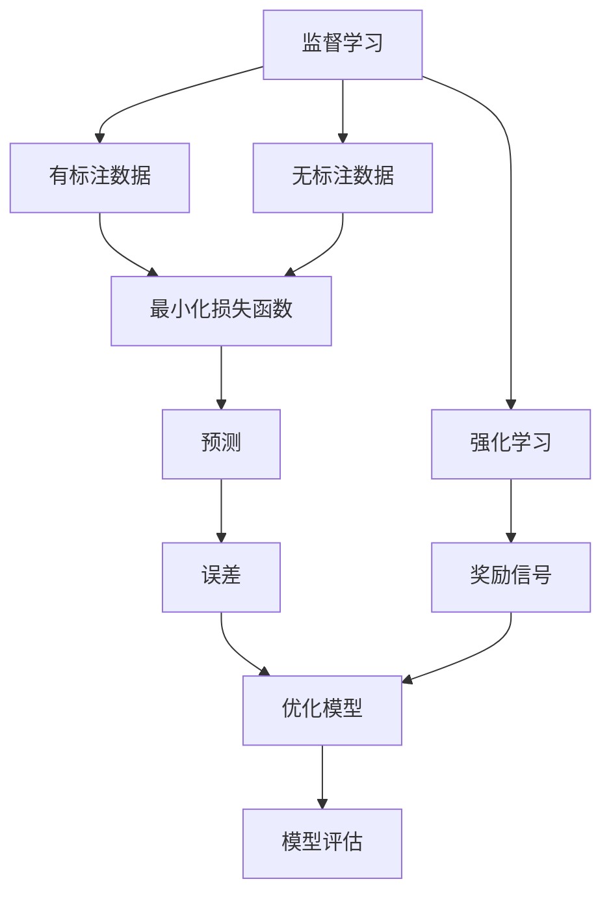
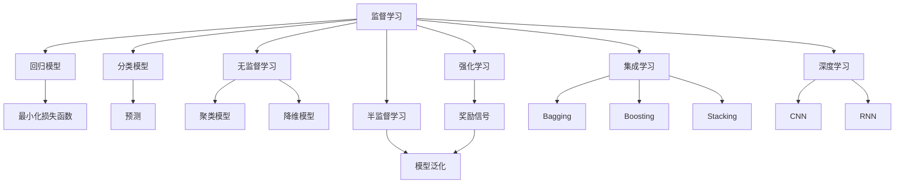
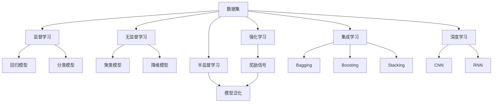
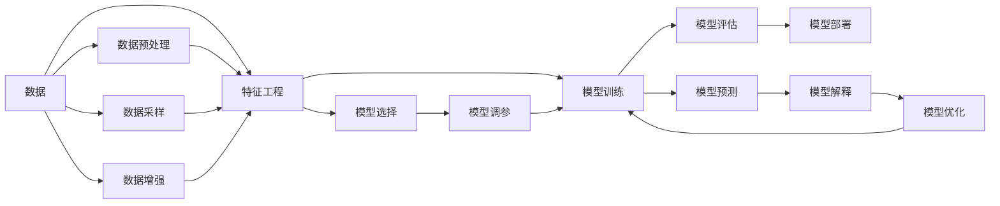
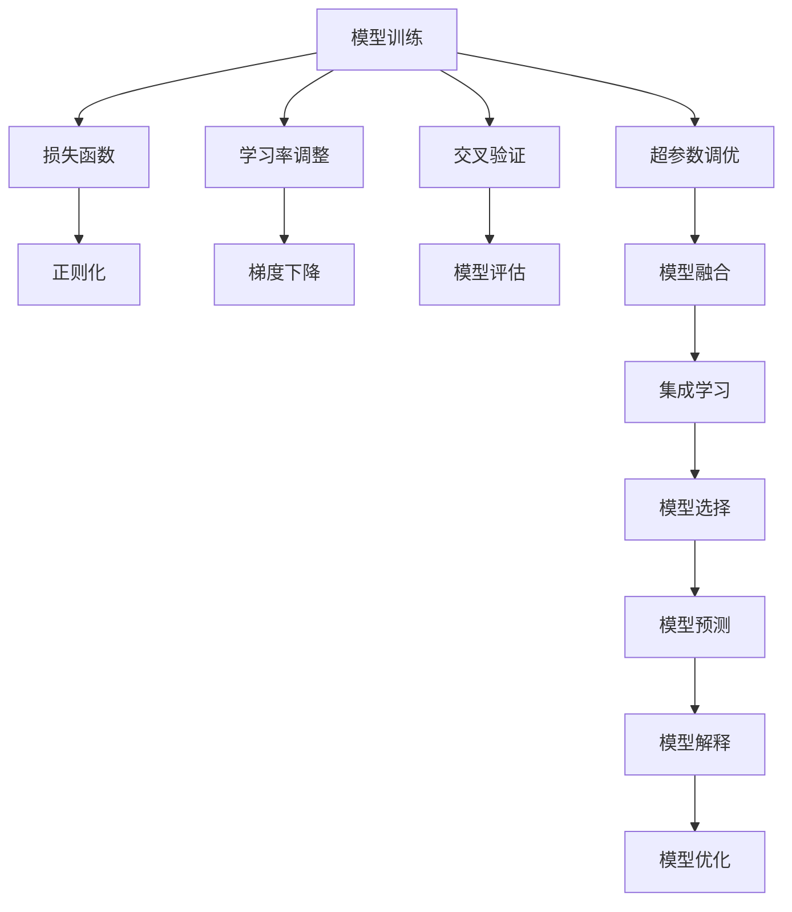
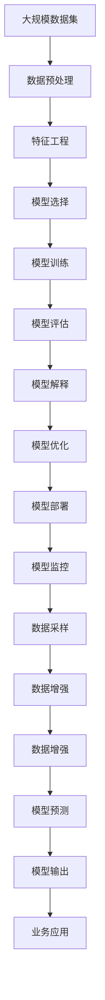

                 

# 机器学习算法原理与代码实战案例讲解

## 1. 背景介绍

### 1.1 问题由来
机器学习（Machine Learning，ML）作为人工智能（Artificial Intelligence，AI）的重要分支，自上世纪80年代以来发展迅猛。其以数据为中心，通过让机器自动学习数据的内在规律，实现对未知数据的预测和决策。机器学习广泛应用于推荐系统、图像识别、自然语言处理、医疗诊断、金融风控等多个领域，极大地推动了人类社会的进步。

然而，尽管机器学习在许多领域取得了显著成就，但如何高效、准确地构建和优化机器学习模型，仍然是摆在数据科学家和工程师面前的一大挑战。机器学习模型的构建，不仅需要扎实的理论知识，更需要具备良好的工程实践能力。针对这一问题，本文将以机器学习算法原理和代码实战案例讲解为切入点，系统阐述机器学习模型的构建和优化方法，并通过代码实战，展示机器学习算法在实际项目中的应用。

### 1.2 问题核心关键点
本文将重点介绍以下几个机器学习核心概念及其联系：

- 监督学习（Supervised Learning）：以标注数据为训练样本，通过模型预测，最小化损失函数实现对未知数据的预测。
- 无监督学习（Unsupervised Learning）：使用未标注数据，通过模型学习数据的内在规律。
- 半监督学习（Semi-supervised Learning）：结合少量标注数据和大量未标注数据进行训练，提升模型泛化能力。
- 强化学习（Reinforcement Learning，RL）：通过与环境交互，通过奖励信号优化决策策略。
- 集成学习（Ensemble Learning）：通过组合多个模型，提升模型准确度和泛化能力。
- 深度学习（Deep Learning）：以深度神经网络为核心，实现对复杂数据的高效建模和预测。

这些核心概念之间的逻辑关系可以通过以下Mermaid流程图来展示：

这个流程图展示机器学习各个核心概念之间的联系：

1. 监督学习主要使用有标注数据进行训练，通过最小化损失函数实现预测。
2. 无监督学习主要使用无标注数据，通过模型学习数据的内在规律。
3. 强化学习则通过与环境的交互，通过奖励信号优化决策策略。
4. 集成学习则是通过组合多个模型，提升预测准确度和泛化能力。
5. 深度学习使用深度神经网络对复杂数据进行高效建模。

这些概念构成了机器学习的基础，通过学习这些概念及其关系，可以更全面地理解机器学习的工作原理和优化方向。

## 2. 核心概念与联系

### 2.1 核心概念概述

为了更好地理解机器学习模型的构建和优化方法，本节将介绍几个密切相关的核心概念：

- 监督学习（Supervised Learning）：通过有标注数据，训练模型进行预测。监督学习模型主要包括回归模型和分类模型。
- 无监督学习（Unsupervised Learning）：通过无标注数据，训练模型学习数据的内在规律。无监督学习模型主要包括聚类模型和降维模型。
- 半监督学习（Semi-supervised Learning）：结合少量标注数据和大量未标注数据进行训练，提升模型泛化能力。
- 强化学习（Reinforcement Learning，RL）：通过与环境的交互，通过奖励信号优化决策策略。强化学习模型主要包括Q-learning和策略梯度方法。
- 集成学习（Ensemble Learning）：通过组合多个模型，提升模型准确度和泛化能力。集成学习方法包括Bagging、Boosting和Stacking。
- 深度学习（Deep Learning）：以深度神经网络为核心，实现对复杂数据的高效建模和预测。深度学习模型主要包括卷积神经网络（CNN）和循环神经网络（RNN）。

这些核心概念之间的逻辑关系可以通过以下Mermaid流程图来展示：

这个流程图展示机器学习各个核心概念之间的关系：

1. 监督学习主要使用有标注数据进行训练，通过最小化损失函数实现预测。
2. 无监督学习主要使用无标注数据，通过模型学习数据的内在规律。
3. 半监督学习则是结合少量标注数据和大量未标注数据进行训练，提升模型泛化能力。
4. 强化学习则通过与环境的交互，通过奖励信号优化决策策略。
5. 集成学习则是通过组合多个模型，提升预测准确度和泛化能力。
6. 深度学习使用深度神经网络对复杂数据进行高效建模。

这些核心概念共同构成了机器学习的基础框架，通过理解这些核心概念，我们可以更好地掌握机器学习的工作原理和优化方向。

### 2.2 概念间的关系

这些核心概念之间存在着紧密的联系，形成了机器学习模型的完整生态系统。下面我们通过几个Mermaid流程图来展示这些概念之间的关系。

#### 2.2.1 机器学习模型范式

这个流程图展示机器学习模型的基本范式：

1. 监督学习主要使用有标注数据进行训练，通过最小化损失函数实现预测。
2. 无监督学习主要使用无标注数据，通过模型学习数据的内在规律。
3. 半监督学习则是结合少量标注数据和大量未标注数据进行训练，提升模型泛化能力。
4. 强化学习则通过与环境的交互，通过奖励信号优化决策策略。
5. 集成学习则是通过组合多个模型，提升预测准确度和泛化能力。
6. 深度学习使用深度神经网络对复杂数据进行高效建模。

#### 2.2.2 机器学习模型的层次结构

这个流程图展示机器学习模型的层次结构：

1. 数据预处理：对原始数据进行清洗、归一化、分词等操作，为模型训练做准备。
2. 特征工程：根据模型需求，从原始数据中提取特征，提升模型的预测能力。
3. 模型选择：根据任务类型，选择合适的模型结构，如线性回归、支持向量机、神经网络等。
4. 模型训练：通过训练数据集，训练模型参数，最小化损失函数。
5. 模型评估：使用测试数据集，评估模型的预测能力和泛化能力。
6. 模型部署：将训练好的模型应用于实际场景，进行预测和推理。
7. 模型解释：通过可视化、调试等手段，解释模型的预测逻辑和行为。
8. 模型优化：根据评估结果，调整模型结构和参数，提升模型性能。

#### 2.2.3 机器学习模型的优化策略

这个流程图展示机器学习模型的优化策略：

1. 损失函数：定义模型预测与真实标签之间的差异，是模型训练的核心目标。
2. 正则化：防止模型过拟合，保持模型的泛化能力。
3. 学习率调整：通过调整学习率，控制模型参数的更新速度，避免震荡和收敛慢的问题。
4. 梯度下降：通过梯度信息更新模型参数，使得模型损失函数最小化。
5. 交叉验证：通过交叉验证评估模型性能，避免过拟合和欠拟合的问题。
6. 超参数调优：通过调整超参数，优化模型性能，如学习率、批次大小、正则化系数等。
7. 模型融合：通过集成多个模型，提升模型预测准确度和泛化能力。
8. 集成学习：通过组合多个模型，提升预测准确度和泛化能力。
9. 模型选择：根据任务类型，选择合适的模型结构，如线性回归、支持向量机、神经网络等。
10. 模型预测：通过训练好的模型，对新数据进行预测和推理。
11. 模型解释：通过可视化、调试等手段，解释模型的预测逻辑和行为。
12. 模型优化：根据评估结果，调整模型结构和参数，提升模型性能。

这些流程图展示了机器学习模型从数据预处理、特征工程、模型训练、模型评估、模型解释到模型优化的全过程，帮助我们系统理解机器学习模型的构建和优化方法。

### 2.3 核心概念的整体架构

最后，我们用一个综合的流程图来展示这些核心概念在大规模机器学习项目中的整体架构：

这个综合流程图展示了从数据预处理到模型部署的完整过程：

1. 数据预处理：对大规模数据集进行清洗、归一化、分词等操作，为模型训练做准备。
2. 特征工程：根据模型需求，从原始数据中提取特征，提升模型的预测能力。
3. 模型选择：根据任务类型，选择合适的模型结构，如线性回归、支持向量机、神经网络等。
4. 模型训练：通过训练数据集，训练模型参数，最小化损失函数。
5. 模型评估：使用测试数据集，评估模型的预测能力和泛化能力。
6. 模型解释：通过可视化、调试等手段，解释模型的预测逻辑和行为。
7. 模型优化：根据评估结果，调整模型结构和参数，提升模型性能。
8. 模型部署：将训练好的模型应用于实际场景，进行预测和推理。
9. 模型监控：实时监测模型性能，确保模型稳定运行。
10. 数据采样：从大规模数据集中随机抽取样本，进行模型训练和评估。
11. 数据增强：通过数据增强技术，丰富训练集的多样性，提升模型泛化能力。

通过这些流程图，我们可以更清晰地理解机器学习模型的构建和优化过程，为后续深入讨论具体的算法和实践方法奠定基础。

## 3. 核心算法原理 & 具体操作步骤
### 3.1 算法原理概述

本文将以监督学习中的线性回归模型为例，介绍机器学习算法的核心原理和具体操作步骤。

线性回归是一种常见的监督学习算法，用于建立输入特征和输出标签之间的线性关系。其核心思想是通过最小化预测值与真实标签之间的差异，找到最佳的线性拟合函数，从而实现对未知数据的预测。

线性回归的数学模型可以表示为：

$$ y = \beta_0 + \beta_1 x_1 + \beta_2 x_2 + \cdots + \beta_n x_n $$

其中 $y$ 为输出标签，$x_i$ 为输入特征，$\beta_i$ 为模型参数。

模型的损失函数可以定义为均方误差（Mean Squared Error，MSE）：

$$ L(\beta) = \frac{1}{2N} \sum_{i=1}^N (y_i - f(x_i; \beta))^2 $$

其中 $N$ 为样本数，$y_i$ 为真实标签，$f(x_i; \beta)$ 为模型预测值。

通过梯度下降等优化算法，最小化损失函数，可以得到最优参数 $\beta^*$。

### 3.2 算法步骤详解

下面是线性回归模型的具体操作步骤：

**Step 1: 准备数据集**

假设我们有一个训练集 $D=\{(x_i, y_i)\}_{i=1}^N$，其中 $x_i$ 为特征向量，$y_i$ 为标签。

**Step 2: 初始化模型参数**

选择一个合适的学习率 $\eta$ 和正则化系数 $\lambda$，对模型参数 $\beta$ 进行初始化。

**Step 3: 迭代更新参数**

通过梯度下降算法，更新模型参数 $\beta$：

$$ \beta \leftarrow \beta - \eta \nabla_{\beta}L(\beta) - \lambda \beta $$

其中 $\nabla_{\beta}L(\beta)$ 为损失函数对模型参数的梯度，可通过链式法则计算。

**Step 4: 计算预测值**

使用模型参数 $\beta$，计算预测值 $f(x_i; \beta)$：

$$ f(x_i; \beta) = \beta_0 + \beta_1 x_{1i} + \beta_2 x_{2i} + \cdots + \beta_n x_{ni} $$

**Step 5: 评估模型性能**

使用测试集 $D_{test}$，评估模型的预测性能，计算均方误差（MSE）等指标。

**Step 6: 输出预测结果**

对新输入数据进行预测，输出预测值 $y_{pred}$。

### 3.3 算法优缺点

线性回归模型的优点包括：

- 简单易懂：线性回归模型结构简单，易于理解和实现。
- 解释性强：通过解释模型参数，可以直观地了解模型的预测逻辑。
- 广泛应用：线性回归模型在回归任务中应用广泛，效果显著。

线性回归模型的缺点包括：

- 线性假设：线性回归模型假设输入特征与输出标签之间存在线性关系，难以处理非线性问题。
- 过拟合风险：当模型参数过多时，容易过拟合训练集。
- 鲁棒性不足：当输入特征存在噪声时，模型的预测性能可能下降。

### 3.4 算法应用领域

线性回归模型在实际应用中非常广泛，主要包括以下几个领域：

- 金融风控：通过回归模型预测贷款违约率、信用评分等。
- 医学诊断：通过回归模型预测患者康复概率、药物效果等。
- 推荐系统：通过回归模型预测用户对商品的评分。
- 交通预测：通过回归模型预测交通流量、车速等。
- 房地产评估：通过回归模型预测房价、租金等。

这些领域中的回归问题，都可以通过线性回归模型来解决，其高效、简单的特点使得线性回归成为数据科学家的首选。

## 4. 数学模型和公式 & 详细讲解 & 举例说明

### 4.1 数学模型构建

本节将使用数学语言对线性回归模型的构建和优化过程进行更加严格的刻画。

假设有一个包含 $N$ 个样本的训练集 $D=\{(x_i, y_i)\}_{i=1}^N$，其中 $x_i$ 为特征向量，$y_i$ 为标签。模型的目标是通过最小化损失函数，找到最优参数 $\beta$。

定义模型预测值 $f(x_i; \beta)$ 为：

$$ f(x_i; \beta) = \beta_0 + \beta_1 x_{1i} + \beta_2 x_{2i} + \cdots + \beta_n x_{ni} $$

其中 $x_{ij}$ 为输入特征 $x_i$ 的第 $j$ 个值。

模型的损失函数可以定义为均方误差（Mean Squared Error，MSE）：

$$ L(\beta) = \frac{1}{2N} \sum_{i=1}^N (y_i - f(x_i; \beta))^2 $$

其中 $N$ 为样本数，$y_i$ 为真实标签，$f(x_i; \beta)$ 为模型预测值。

### 4.2 公式推导过程

以下我们以线性回归模型为例，推导损失函数的梯度和更新公式。

假设模型参数 $\beta$ 包含 $k+1$ 个值，即 $\beta = [\beta_0, \beta_1, \cdots, \beta_k]$。

损失函数 $L(\beta)$ 对 $\beta$ 的梯度可以表示为：

$$ \nabla_{\beta}L(\beta) = \frac{1}{N} \sum_{i=1}^N -2(y_i - f(x_i; \beta)) \frac{\partial f(x_i; \beta)}{\partial \beta} $$

其中 $\frac{\partial f(x_i; \beta)}{\partial \beta}$ 为模型预测值对模型参数的偏导数，可以通过链式法则计算。

将上述公式展开，得到：

$$ \nabla_{\beta}L(\beta) = \frac{1}{N} \sum_{i=1}^N -2(y_i - \beta_0 - \beta_1 x_{1i} - \beta_2 x_{2i} - \cdots - \beta_k x_{ki}) [-1, x_{1i}, x_{2i}, \cdots, x_{ki}] $$

即：

$$ \nabla_{\beta}L(\beta) = \frac{1}{N} \begin{bmatrix} -2\sum_{i=1}^N (y_i - \beta_0 - \beta_1 x_{1i} - \beta_2 x_{2i} - \cdots - \beta_k x_{ki}) \\ -2\sum_{i=1}^N (y_i - \beta_0 - \beta_1 x_{1i} - \beta_2 x_{2i} - \cdots - \beta_k x_{ki}) x_{1i} \\ -2\sum_{i=1}^N (y_i - \beta_0 - \beta_1 x_{1i} - \beta_2 x_{2i} - \cdots - \beta_k x_{ki}) x_{2i} \\ \vdots \\ -2\sum_{i=1}^N (y_i - \beta_0 - \beta_1 x_{1i} - \beta_2 x_{2i} - \cdots - \beta_k x_{ki}) x_{ki} \end{bmatrix} $$

将其代入更新公式：

$$ \beta \leftarrow \beta - \eta \nabla_{\beta}L(\beta) - \lambda \beta $$

即：

$$ \beta \leftarrow \beta - \eta \frac{1}{N} \begin{bmatrix} -2\sum_{i=1}^N (y_i - \beta_0 - \beta_1 x_{1i} - \beta_2 x_{2i} - \cdots - \beta_k x_{ki}) \\ -2\sum_{i=1}^N (y_i - \beta_0 - \beta_1 x_{1i} - \beta_2 x_{2i} - \cdots - \beta_k x_{ki}) x_{1i} \\ -2\sum_{i=1}^N (y_i - \beta_0 - \beta_1 x_{1i} - \beta_2 x_{2i} - \cdots - \beta_k x_{ki}) x_{2i} \\ \vdots \\ -2\sum_{i=1}^N (y_i - \beta_0 - \beta_1 x_{1i} - \beta_2 x_{2i} - \cdots - \beta_k x_{ki}) x_{ki} \end{bmatrix} - \lambda \beta $$

最终得到：

$$ \beta \leftarrow \beta - \eta \frac{1}{N} \begin{bmatrix} 2\sum_{i=1}^N (y_i - \beta_0 - \beta_1 x_{1i} - \beta_2 x_{2i} - \cdots - \beta_k x_{ki}) \\ 2\sum_{i=1}^N (y_i - \beta_0 - \beta_1 x_{1i} - \beta_2 x_{2i} - \cdots - \beta_k x_{ki}) x_{1i} \\ 2\sum_{i=1}^N (y_i - \beta_0 - \beta_1 x_{1i} - \beta_2 x_{2i} - \cdots - \beta_k x_{ki}) x_{2i} \\ \vdots \\ 2\sum_{i=1}^N (y_i - \beta_0 - \beta_1 x_{1i} - \beta_2 x_{2i} - \cdots - \beta_k x_{ki}) x_{ki} \end{bmatrix} - \lambda \beta $$

通过上述公式，可以高效地更新模型参数，最小化损失函数，提升模型性能。

### 4.3 案例分析与讲解

以房价预测为例，展示线性回归模型在实际应用中的操作步骤：

假设我们有一个包含 $N$ 个样本的训练集 $D=\{(x_i, y_i)\}_{i=1}^N$，其中 $x_i$ 包含多个特征，如房龄、户型、面积等，$y_i$ 为房价。

定义模型预测值 $f(x_i; \beta)$ 为：

$$ f(x_i; \beta) = \beta_0 + \beta_1 x_{1i} + \beta_2 x_{2i} + \cdots + \beta_n x_{ni} $$

其中 $x_{ij}$ 为输入特征 $x_i$ 的第 $j$ 个值。

定义损失函数 $L(\beta)$ 为均方误差（MSE）：

$$ L(\beta) = \frac{1}{2N} \sum_{i=1}^N (y_i - f(x_i; \beta))^2 $$

其中 $N$ 为样本数，$y_i$ 为真实标签，$f(x_i; \beta)$ 为模型预测值。

通过梯度下降算法，更新模型参数 $\beta$：

$$ \beta \leftarrow \beta - \eta \frac{1}{N} \begin{bmatrix} 2\sum_{i=1}^N (y_i - \beta_0 - \beta_1 x_{1i} - \beta_2 x_{2i} - \cdots - \beta_k x_{ki}) \\ 2\sum_{i=1}^N (y_i - \beta_0 - \beta_1 x_{1i} - \beta_2 x_{2i} - \cdots - \beta_k x_{ki}) x_{1i} \\ 2\sum_{i=1}^N (y_i - \beta_0 - \beta_1 x_{1i} - \beta_2 x_{2i} - \cdots - \beta_k x_{ki}) x_{2i} \\ \vdots \\ 2\sum_{i=1}^N (y_i - \beta_0 - \beta_1 x_{1i} - \beta_2 x_{2i} - \cdots - \beta_k x_{ki}) x_{ki} \end{bmatrix} - \lambda \beta $$

最终得到更新后的模型参数 $\beta^*$，可以用来对新输入数据进行预测。

通过上述案例，可以看到，线性回归模型可以高效地解决实际问题，其简单易懂的数学模型和高效的计算过程，使得其成为数据科学家和工程师的首选。

## 5. 项目实践：代码实例和详细解释说明

### 5.1 开发环境搭建

在进行机器学习项目实践前，我们需要准备好开发环境。以下是使用Python进行Scikit-learn开发的环境配置流程：

1. 

