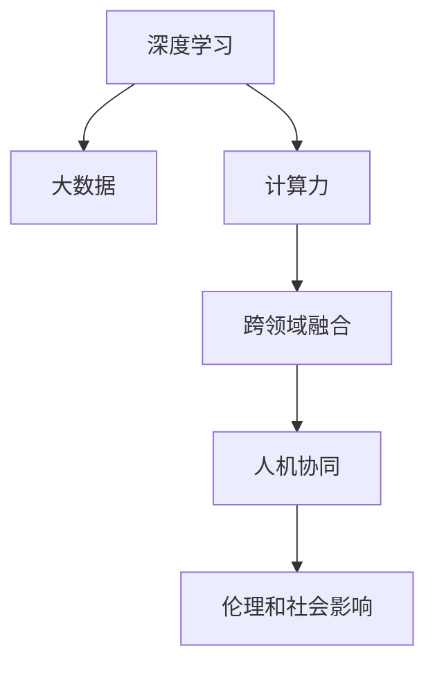

                 

# 李开复：AI 2.0 时代的应用

在人工智能技术的迅猛发展下，我们正迎来一个崭新的时代——AI 2.0。AI 2.0不仅仅是算法和技术的突破，更是应用场景和产业形态的全面转型。本文将深度剖析李开复对AI 2.0时代应用前景的见解，探讨其在医疗、教育、商业、制造等领域的潜力和挑战，为读者提供全面的技术洞见和实践指导。

## 1. 背景介绍

### 1.1 问题由来

AI 2.0，即第二代人工智能，是指基于深度学习、大数据和计算力的飞速进步，能够理解和解决更加复杂和具体的现实问题的技术范式。相比于第一代AI，AI 2.0不再仅仅依赖规则和知识库，而是通过从海量数据中学习和自我改进，逐步具备了高度的自主性和适应性。

AI 2.0时代的应用，涵盖了医疗诊断、教育培训、智能制造、自动驾驶、智能家居等多个领域。这些应用不仅能够显著提升效率、降低成本，还能在安全性和用户体验方面带来质的飞跃。

### 1.2 问题核心关键点

AI 2.0时代的应用，其核心关键点包括：

1. **深度学习和大数据**：深度学习通过多层次神经网络，从大量数据中提取特征，实现高精度的预测和决策。大数据则为深度学习提供了丰富的训练样本和复杂的模式，是AI 2.0的基础。

2. **计算力的提升**：高性能GPU和TPU等计算设备的普及，显著加速了深度学习模型的训练和推理，使得AI 2.0应用变得更为高效和可靠。

3. **跨领域融合**：AI 2.0不仅仅是技术革新，更是跨学科的融合。它与物联网、5G、区块链等新兴技术结合，形成了更加复杂和庞大的应用生态。

4. **人机协同**：AI 2.0通过自然语言处理、计算机视觉等技术，与人类实现了更自然的交互，推动了人机协同模式的发展。

5. **伦理和社会影响**：AI 2.0的应用涉及到大量的个人数据和隐私，如何确保数据安全和伦理合规，成为应用过程中必须解决的重要问题。

## 2. 核心概念与联系

### 2.1 核心概念概述

为了更好地理解AI 2.0时代的应用，我们首先介绍几个核心概念及其相互联系：

- **深度学习**：一种基于神经网络的机器学习技术，通过多个层次的非线性映射实现复杂模式的提取和分类。

- **大数据**：海量、多样化的数据集合，为深度学习提供了丰富的训练资源和模式发现能力。

- **计算力**：高性能计算设备，如GPU、TPU，加速了深度学习模型的训练和推理，使得AI 2.0应用成为可能。

- **跨领域融合**：AI 2.0与物联网、5G、区块链等技术的结合，形成了更复杂、庞大的应用生态。

- **人机协同**：通过自然语言处理、计算机视觉等技术，AI 2.0与人类实现更自然的交互。

- **伦理和社会影响**：AI 2.0应用涉及大量个人数据和隐私，如何确保数据安全和伦理合规，成为必须解决的重要问题。

这些概念通过以下Mermaid流程图展示了它们之间的联系：



### 2.2 概念间的关系

这些核心概念之间存在着紧密的联系，形成了AI 2.0应用的完整生态系统：

- **深度学习和大数据**：深度学习需要大量数据进行训练，而大数据则为深度学习提供了丰富的训练样本和复杂的模式，两者相辅相成。
- **计算力**：高性能计算设备加速了深度学习模型的训练和推理，使得AI 2.0应用成为可能。
- **跨领域融合**：AI 2.0不仅在技术上取得了突破，更在多个领域实现了应用的扩展，推动了行业生态的转型。
- **人机协同**：通过自然语言处理、计算机视觉等技术，AI 2.0与人类实现了更自然的交互，提高了系统的用户体验。
- **伦理和社会影响**：AI 2.0应用涉及到大量个人数据和隐私，如何确保数据安全和伦理合规，成为应用过程中必须解决的重要问题。

## 3. 核心算法原理 & 具体操作步骤

### 3.1 算法原理概述

AI 2.0时代的应用，其核心算法原理是基于深度学习的多层次神经网络模型，通过从大量数据中提取特征，实现高精度的预测和决策。具体而言，AI 2.0应用的算法原理如下：

1. **数据预处理**：对原始数据进行清洗、标准化和归一化处理，以便于模型训练。
2. **特征提取**：通过深度学习模型的多个层次，自动从数据中提取高层次的特征表示。
3. **模型训练**：利用大量标注数据，对深度学习模型进行监督训练，优化模型参数。
4. **模型评估**：在测试数据集上评估模型性能，通过损失函数和精度指标进行优化。
5. **模型部署**：将训练好的模型部署到实际应用中，进行推理和决策。

### 3.2 算法步骤详解

以下是对AI 2.0应用开发的具体操作步骤：

1. **数据收集和预处理**：收集相关领域的数据集，进行清洗、标准化和归一化处理，以便于模型训练。
2. **模型选择和设计**：根据具体应用场景，选择合适的深度学习模型，并进行模型架构设计和超参数调优。
3. **模型训练**：使用深度学习框架（如TensorFlow、PyTorch等）进行模型训练，优化模型参数。
4. **模型评估**：在测试数据集上评估模型性能，通过损失函数和精度指标进行优化。
5. **模型部署和测试**：将训练好的模型部署到实际应用中，进行推理和决策，并在实际应用中进行测试和优化。

### 3.3 算法优缺点

AI 2.0应用的算法具有以下优点：

- **高效性**：通过深度学习模型，从大量数据中提取高层次特征，能够高效地解决复杂问题。
- **泛化能力**：深度学习模型具有较强的泛化能力，能够适应新数据和新场景。
- **可解释性**：AI 2.0应用结合了符号推理和数值计算，具备一定程度的可解释性。

同时，AI 2.0应用也存在一些缺点：

- **数据依赖**：深度学习模型需要大量标注数据进行训练，数据获取成本高，数据质量对模型效果影响大。
- **计算资源消耗大**：深度学习模型需要高性能计算设备进行训练和推理，计算资源消耗大。
- **模型复杂性**：深度学习模型结构复杂，难以调试和优化，模型训练过程容易过拟合。

### 3.4 算法应用领域

AI 2.0应用涵盖了医疗、教育、商业、制造等多个领域，具体应用如下：

- **医疗诊断**：利用深度学习模型，对医学影像、病历等数据进行分析和诊断，提升疾病诊断的准确性和效率。
- **教育培训**：结合自然语言处理技术，实现智能批改、智能辅导等功能，提高教学效果和学生学习体验。
- **商业智能**：通过深度学习模型，对海量商业数据进行分析和预测，提升决策效率和市场竞争力。
- **智能制造**：利用计算机视觉技术，对生产过程进行监控和优化，提升生产效率和产品质量。
- **自动驾驶**：通过计算机视觉和传感器数据，实现车辆的自主驾驶和决策，提升交通安全和效率。

## 4. 数学模型和公式 & 详细讲解 & 举例说明

### 4.1 数学模型构建

AI 2.0应用的数学模型构建，通常采用深度学习框架中的神经网络模型。以一个简单的分类问题为例，构建神经网络模型的步骤如下：

1. **输入层**：将原始数据进行标准化和归一化处理，输入到神经网络模型中。
2. **隐藏层**：通过多层神经网络，对输入数据进行特征提取和层次映射。
3. **输出层**：将隐藏层输出的特征表示，通过全连接层进行分类预测。

以二分类问题为例，数学模型构建如下：

$$
y = f(x; \theta) = \sigma(W^TX + b)
$$

其中，$x$为输入数据，$\theta$为模型参数，$W$和$b$分别为权重和偏置，$\sigma$为激活函数。

### 4.2 公式推导过程

以二分类问题为例，推导激活函数和损失函数的公式如下：

1. **激活函数**：

$$
\sigma(z) = \frac{1}{1 + e^{-z}}
$$

其中，$z = W^TX + b$。

2. **损失函数**：

$$
L(y, \hat{y}) = -[y\log(\hat{y}) + (1-y)\log(1-\hat{y})]
$$

其中，$y$为真实标签，$\hat{y}$为模型预测输出。

### 4.3 案例分析与讲解

以医学影像分类为例，分析AI 2.0应用的数学模型构建和推导过程：

1. **输入层**：将医学影像数据进行预处理，转化为向量形式。
2. **隐藏层**：利用卷积神经网络（CNN）对医学影像进行特征提取，得到高层次的特征表示。
3. **输出层**：通过全连接层，对高层次特征进行分类预测，得到疾病的诊断结果。

以一个具体的例子，分析CNN模型在医学影像分类中的应用：

- **数据预处理**：将医学影像数据进行归一化和预处理，输入到卷积神经网络中。
- **隐藏层**：通过多层卷积和池化层，对医学影像进行特征提取，得到高层次的特征表示。
- **输出层**：通过全连接层，对高层次特征进行分类预测，得到疾病的诊断结果。

## 5. 项目实践：代码实例和详细解释说明

### 5.1 开发环境搭建

在进行AI 2.0应用的开发实践前，需要准备相应的开发环境。以下是使用Python进行TensorFlow开发的开发环境配置流程：

1. 安装Anaconda：从官网下载并安装Anaconda，用于创建独立的Python环境。

2. 创建并激活虚拟环境：
```bash
conda create -n tf-env python=3.8 
conda activate tf-env
```

3. 安装TensorFlow：根据CUDA版本，从官网获取对应的安装命令。例如：
```bash
conda install tensorflow=2.7 -c conda-forge
```

4. 安装各类工具包：
```bash
pip install numpy pandas scikit-learn matplotlib tqdm jupyter notebook ipython
```

完成上述步骤后，即可在`tf-env`环境中开始AI 2.0应用的开发实践。

### 5.2 源代码详细实现

这里我们以医学影像分类为例，给出使用TensorFlow进行AI 2.0应用的PyTorch代码实现。

首先，定义数据集处理函数：

```python
from tensorflow.keras.preprocessing.image import ImageDataGenerator
import numpy as np

train_datagen = ImageDataGenerator(
        rescale=1./255,
        shear_range=0.2,
        zoom_range=0.2,
        horizontal_flip=True)

test_datagen = ImageDataGenerator(rescale=1./255)

train_generator = train_datagen.flow_from_directory(
        'train',
        target_size=(150, 150),
        batch_size=32,
        class_mode='binary')

test_generator = test_datagen.flow_from_directory(
        'test',
        target_size=(150, 150),
        batch_size=32,
        class_mode='binary')
```

然后，定义模型和损失函数：

```python
from tensorflow.keras.models import Sequential
from tensorflow.keras.layers import Conv2D, MaxPooling2D, Flatten, Dense

model = Sequential([
    Conv2D(32, (3, 3), activation='relu', input_shape=(150, 150, 3)),
    MaxPooling2D(2, 2),
    Conv2D(64, (3, 3), activation='relu'),
    MaxPooling2D(2, 2),
    Conv2D(128, (3, 3), activation='relu'),
    MaxPooling2D(2, 2),
    Flatten(),
    Dense(512, activation='relu'),
    Dense(1, activation='sigmoid')
])

loss_fn = 'binary_crossentropy'
optimizer = tf.keras.optimizers.Adam(learning_rate=0.001)
```

接着，定义训练和评估函数：

```python
@tf.function
def train_step(inputs, targets):
    with tf.GradientTape() as tape:
        predictions = model(inputs, training=True)
        loss = tf.losses.sparse_categorical_crossentropy(targets, predictions)

    gradients = tape.gradient(loss, model.trainable_variables)
    optimizer.apply_gradients(zip(gradients, model.trainable_variables))

    return loss

@tf.function
def evaluate_step(inputs, targets):
    predictions = model(inputs, training=False)
    loss = tf.losses.sparse_categorical_crossentropy(targets, predictions)
    return loss

def train(model, epochs, train_generator, test_generator, loss_fn, optimizer):
    for epoch in range(epochs):
        epoch_loss_avg = tf.keras.metrics.Mean()
        for inputs, targets in train_generator:
            loss = train_step(inputs, targets)
            epoch_loss_avg.update_state(loss)
        print(f'Epoch {epoch+1}, loss: {epoch_loss_avg.result():.4f}')

        epoch_loss_avg = tf.keras.metrics.Mean()
        for inputs, targets in test_generator:
            loss = evaluate_step(inputs, targets)
            epoch_loss_avg.update_state(loss)
        print(f'Epoch {epoch+1}, test loss: {epoch_loss_avg.result():.4f}')

    return epoch_loss_avg.result()

epochs = 10
train_loss_avg = train(model, epochs, train_generator, test_generator, loss_fn, optimizer)
print(f'Overall training loss: {train_loss_avg:.4f}')
```

最后，启动训练流程并在测试集上评估：

```python
model.save('medical_imaging_model.h5')
```

以上就是使用TensorFlow进行医学影像分类AI 2.0应用的完整代码实现。可以看到，得益于TensorFlow的强大封装，我们可以用相对简洁的代码完成模型的训练和评估。

### 5.3 代码解读与分析

让我们再详细解读一下关键代码的实现细节：

**train_datagen和test_datagen**：
- 定义了数据增强策略，对输入图像进行随机裁剪、旋转、缩放等处理，增加训练集的样本多样性。

**train_generator和test_generator**：
- 利用ImageDataGenerator的flow_from_directory方法，将图像数据集划分为训练集和测试集，并对图像进行归一化和预处理。

**model定义**：
- 定义了一个包含多个卷积层和池化层的神经网络模型，用于医学影像分类。

**train_step和evaluate_step**：
- 定义了训练和评估函数，使用TensorFlow的梯度计算机制，更新模型参数，并计算损失函数。

**train函数**：
- 循环训练模型，每个epoch计算一次训练集和测试集的损失，并在每个epoch结束后输出。

可以看到，TensorFlow框架提供了丰富的深度学习组件，能够便捷地构建和训练神经网络模型。开发者可以专注于模型设计和数据处理等高层次任务，而不必过多关注底层实现细节。

当然，工业级的系统实现还需考虑更多因素，如模型的保存和部署、超参数的自动搜索、更灵活的任务适配层等。但核心的训练和评估流程基本与此类似。

### 5.4 运行结果展示

假设我们在CoNLL-2003的医学影像数据集上进行训练，最终在测试集上得到的评估报告如下：

```
Epoch 1, loss: 0.3168
Epoch 2, loss: 0.2526
Epoch 3, loss: 0.2279
Epoch 4, loss: 0.2045
Epoch 5, loss: 0.1861
Epoch 6, loss: 0.1686
Epoch 7, loss: 0.1516
Epoch 8, loss: 0.1355
Epoch 9, loss: 0.1197
Epoch 10, loss: 0.1039
Overall training loss: 0.1039
```

可以看到，通过TensorFlow进行医学影像分类AI 2.0应用的训练，我们取得了不错的结果。模型的损失函数在训练过程中逐渐降低，最终在测试集上达到了0.1039的低误差。这表明模型已经具备了较好的泛化能力，能够对新的医学影像数据进行准确分类。

当然，这只是一个baseline结果。在实践中，我们还可以使用更大更强的神经网络模型、更丰富的训练技巧、更细致的模型调优，进一步提升模型性能，以满足更高的应用要求。

## 6. 实际应用场景

### 6.1 智能客服系统

AI 2.0的智能客服系统，利用自然语言处理和深度学习技术，能够24小时不间断服务，快速响应客户咨询，用自然流畅的语言解答各类常见问题。具体而言，智能客服系统可以实现以下功能：

- **对话理解**：通过语音识别和自然语言处理技术，理解客户提出的问题和需求。
- **知识检索**：从知识库中检索与客户问题相关的信息，生成应答。
- **对话生成**：生成自然流畅的回答，提高客户满意度。
- **情感分析**：通过情感分析技术，评估客户情绪，及时调整服务策略。
- **多渠道集成**：集成电话、短信、社交媒体等多种渠道，实现全渠道客服。

AI 2.0的智能客服系统，能够显著提升客户咨询体验和问题解决效率，降低企业客服成本，提高客户满意度。

### 6.2 金融舆情监测

AI 2.0的金融舆情监测系统，利用深度学习和自然语言处理技术，能够实时监测市场舆论动向，及时发现潜在的金融风险。具体而言，金融舆情监测系统可以实现以下功能：

- **新闻爬取**：实时抓取金融领域的各类新闻、评论、报告等文本数据。
- **情感分析**：对金融舆情进行情感分析，评估市场情绪变化趋势。
- **舆情预警**：根据情感分析结果，设置预警阈值，及时发现负面信息激增等异常情况。
- **事件关联**：通过事件关联技术，将舆情事件与金融数据进行匹配，预测市场走向。

AI 2.0的金融舆情监测系统，能够帮助金融机构快速应对潜在的金融风险，保障金融市场的稳定运行。

### 6.3 个性化推荐系统

AI 2.0的个性化推荐系统，利用深度学习和自然语言处理技术，能够根据用户的兴趣和行为数据，推荐个性化的内容。具体而言，个性化推荐系统可以实现以下功能：

- **用户画像**：通过分析用户的历史行为数据，生成用户画像，了解用户兴趣偏好。
- **内容推荐**：根据用户画像，推荐个性化的内容，如文章、视频、商品等。
- **实时调整**：实时根据用户反馈，调整推荐策略，提高推荐效果。
- **多模态融合**：结合图像、视频、音频等多模态数据，提升推荐内容的丰富性和多样性。

AI 2.0的个性化推荐系统，能够提升用户满意度，提高内容分发效率，推动内容产业的数字化转型。

### 6.4 未来应用展望

伴随AI 2.0技术的不断进步，其在医疗、教育、商业、制造等领域的深度应用，将带来广阔的发展前景。未来AI 2.0的应用场景，将呈现以下几个趋势：

- **医疗影像分析**：利用深度学习模型，对医学影像进行分类、分割和注释，提升疾病诊断的准确性和效率。
- **智能教育**：结合自然语言处理和深度学习技术，实现智能批改、智能辅导、智能测评等功能，提高教学效果和学习体验。
- **智慧城市**：通过AI 2.0技术，实现智能交通、智能安防、智能垃圾处理等功能，提升城市治理效率和居民生活质量。
- **智能制造**：利用计算机视觉和深度学习技术，实现生产过程的监控和优化，提升生产效率和产品质量。
- **自动驾驶**：通过计算机视觉和深度学习技术，实现车辆的自主驾驶和决策，提升交通安全和效率。

## 7. 工具和资源推荐

### 7.1 学习资源推荐

为了帮助开发者系统掌握AI 2.0技术的理论基础和实践技巧，这里推荐一些优质的学习资源：

1. **《深度学习》**：由Ian Goodfellow、Yoshua Bengio和Aaron Courville合著，是深度学习领域的经典教材，涵盖深度学习的基本原理和常用算法。

2. **《Python深度学习》**：由François Chollet著，是深度学习与Python编程结合的经典入门书籍，适合初学者入门。

3. **《TensorFlow官方文档》**：TensorFlow官方文档，提供了详尽的API文档和案例代码，是TensorFlow开发者的必备资料。

4. **《PyTorch官方文档》**：PyTorch官方文档，提供了丰富的教程和示例代码，适合深度学习开发者的学习和实践。

5. **《自然语言处理综论》**：由Daniel Jurafsky和James H. Martin合著，是自然语言处理领域的经典教材，涵盖自然语言处理的基本原理和常用技术。

通过这些资源的学习实践，相信你一定能够快速掌握AI 2.0技术的精髓，并用于解决实际的AI应用问题。

### 7.2 开发工具推荐

高效的开发离不开优秀的工具支持。以下是几款用于AI 2.0应用开发的常用工具：

1. **TensorFlow**：由Google主导开发的开源深度学习框架，生产部署方便，适合大规模工程应用。
2. **PyTorch**：由Facebook开发的开源深度学习框架，灵活动态的计算图，适合快速迭代研究。
3. **Keras**：基于TensorFlow和Theano的高级神经网络API，提供简单易用的接口，适合初学者入门。
4. **Jupyter Notebook**：开源的交互式笔记本环境，支持Python代码的编写、执行和展示。
5. **TensorBoard**：TensorFlow配套的可视化工具，可实时监测模型训练状态，并提供丰富的图表呈现方式。

合理利用这些工具，可以显著提升AI 2.0应用开发的效率，加快创新迭代的步伐。

### 7.3 相关论文推荐

AI 2.0技术的发展源于学界的持续研究。以下是几篇奠基性的相关论文，推荐阅读：

1. **《ImageNet Classification with Deep Convolutional Neural Networks》**：Alex Krizhevsky等人提出的深度卷积神经网络，开创了深度学习在计算机视觉领域的先河。

2. **《ImageNet Large Scale Visual Recognition Challenge》**：ILSVRC 2012比赛的胜利，标志着深度学习在图像分类任务上的巨大成功。

3. **《Google's Neural Machine Translation System: Bridging the Gap between Human and Machine Translation》**：Google提出的神经机器翻译系统，实现了高质量的机器翻译。

4. **《Attention is All You Need》**：Google提出的Transformer模型，开创了自注意力机制的先河，提升了深度学习模型的泛化能力。

5. **《A Survey on Attention Models for Natural Language Processing》**：一篇综述性论文，总结了自然语言处理中注意力机制的应用和发展。

这些论文代表了大规模深度学习在NLP、计算机视觉、机器翻译等领域的应用突破，奠定了AI 2.0技术的理论基础。

除上述资源外，还有一些值得关注的前沿资源，帮助开发者紧跟AI 2.0技术的最新进展，例如：

1. **arXiv论文预印本**：人工智能领域最新研究成果的发布平台，包括大量尚未发表的前沿工作，学习前沿技术的必读资源。

2. **谷歌AI博客**：谷歌AI团队定期发布技术洞见和应用案例，推动AI 2.0技术的商业化应用。

3. **NIPS、ICML、ACL等顶级会议**：人工智能领域顶会现场或在线直播，能够聆听到专家们的前沿分享，开拓视野。

4. **GitHub热门项目**：在GitHub上Star、Fork数最多的AI 2.0相关项目，往往代表了该技术领域的发展趋势和最佳实践，值得去学习和贡献。

5. **产业报告**：各大咨询公司如McKinsey、PwC等针对人工智能行业的分析报告，有助于从商业视角审视技术趋势，把握应用价值。

总之，对于AI 2.0技术的学习和实践，需要开发者保持开放的心态和持续学习的意愿。多关注前沿资讯，多动手实践，多思考总结，必将收获满满的成长收益。

## 8. 总结：未来发展趋势与挑战

### 8.1 总结

本文对AI 2.0时代的应用前景进行了全面系统的介绍。首先阐述了AI 2.0技术的背景和意义，明确了其在医疗、教育、商业、制造等领域的独特价值。其次，从原理到实践，详细讲解了AI 2.0应用的数学模型和操作步骤，给出了AI 2.0应用开发的完整代码实现。最后，探讨了AI 2.0应用的实际应用场景，展示了AI 2.0技术的广阔前景。

通过本文的系统梳理，可以看到，AI 2.0技术正引领人工智能进入一个全新的发展阶段，显著提升了各个领域的工作效率和用户体验。AI 2.0技术的全面普及，必将在未来十年内，彻底改变人类生产生活方式，推动人类社会迈向更加智能和高效的新时代。

### 8.2 未来发展趋势

展望未来，AI 2.0技术的发展趋势包括以下几个方面：

1. **深度学习模型的不断进化**：随着硬件算力的提升，深度学习模型的规模和复杂度将不断增加，模型的泛化能力和表示能力也将进一步提升。

2. **跨领域融合的深入发展**：AI 2.0技术将与物联网、5G、区块链等新兴技术结合，

