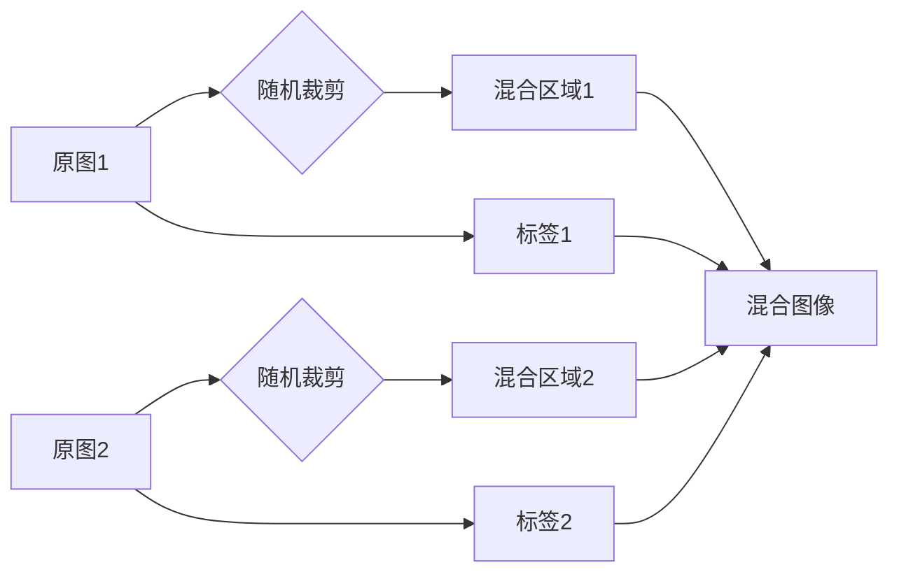

# Cutmix原理与代码实例讲解

> 关键词：Cutmix，数据增强，深度学习，计算机视觉，图像分割，神经网络，对抗训练

## 1. 背景介绍

随着深度学习在计算机视觉领域的广泛应用，数据增强作为一种提升模型泛化能力和鲁棒性的重要技术，越来越受到研究者的关注。数据增强通过在训练过程中对原始图像进行一系列随机变换，如旋转、翻转、缩放等，生成新的训练样本，从而丰富模型的学习经验。然而，传统的数据增强方法往往只能生成与原始图像相似度较高的样本，难以模拟真实世界中的复杂变化。

为了解决这一问题，研究者们提出了许多新的数据增强方法，其中Cutmix是一种基于对抗训练的思想，通过将两幅图像进行随机裁剪和混合，生成新的训练样本，有效增强了模型的多样性。本文将详细介绍Cutmix的原理、实现方法以及在实际应用中的效果。

## 2. 核心概念与联系

### 2.1 核心概念原理

Cutmix是一种基于数据混合的数据增强方法，其核心思想是将两幅图像进行随机裁剪，并按照一定的比例进行混合，生成新的训练样本。具体来说，Cutmix包括以下步骤：

1. **随机裁剪**：从两幅图像中随机裁剪出相同大小的区域。
2. **混合比例**：根据设定的混合比例，将裁剪后的图像区域进行混合，生成新的图像。
3. **标签复制**：将原始图像的标签复制到混合后的图像上。

Cutmix的原理图如下所示：



### 2.2 核心概念联系

Cutmix与现有的数据增强方法相比，具有以下特点：

1. **对抗训练**：Cutmix通过混合不同图像的裁剪区域，模拟真实世界中的对抗场景，提高模型的鲁棒性。
2. **数据多样性**：Cutmix能够生成与原始图像差异较大的新样本，增强模型的泛化能力。
3. **标签一致性**：Cutmix将原始图像的标签复制到混合后的图像上，保证了数据增强过程中标签的一致性。

## 3. 核心算法原理 & 具体操作步骤

### 3.1 算法原理概述

Cutmix算法的核心思想是模拟真实世界中的对抗场景，通过混合不同图像的裁剪区域，生成新的训练样本。具体原理如下：

1. **随机裁剪**：首先从两幅图像中随机裁剪出相同大小的区域，这个区域可以看作是两幅图像的一个共同特征区域。
2. **混合比例**：根据设定的混合比例，将裁剪后的图像区域进行混合，生成新的图像。混合比例可以控制新图像与原始图像的相似程度。
3. **标签复制**：将原始图像的标签复制到混合后的图像上，保证数据增强过程中标签的一致性。

### 3.2 算法步骤详解

Cutmix算法的具体操作步骤如下：

1. **初始化**：选择两幅图像 $I_1$ 和 $I_2$，以及混合比例 $\lambda$。
2. **随机裁剪**：对两幅图像分别进行随机裁剪，裁剪区域的大小与图像尺寸相同。
3. **混合**：将裁剪后的两幅图像区域进行混合，混合比例根据 $\lambda$ 设定。
4. **标签复制**：将原始图像的标签复制到混合后的图像上。
5. **输出**：输出混合后的图像和标签。

### 3.3 算法优缺点

#### 优点

1. **对抗训练**：通过混合不同图像的裁剪区域，模拟真实世界中的对抗场景，提高模型的鲁棒性。
2. **数据多样性**：能够生成与原始图像差异较大的新样本，增强模型的泛化能力。
3. **标签一致性**：保证数据增强过程中标签的一致性。

#### 缺点

1. **计算成本**：混合操作需要消耗一定的计算资源。
2. **内存占用**：混合后的图像尺寸较大，会增加内存占用。

### 3.4 算法应用领域

Cutmix算法在图像分割、目标检测、图像分类等计算机视觉任务中均有较好的应用效果。以下是一些具体的应用领域：

1. **图像分割**：通过Cutmix增强数据，可以提高图像分割模型的泛化能力，使其能够更好地适应复杂场景。
2. **目标检测**：Cutmix可以增强目标检测数据，提高模型的鲁棒性和准确性。
3. **图像分类**：通过Cutmix增强图像数据，可以提高图像分类模型的泛化能力，使其能够更好地适应不同的图像风格。

## 4. 数学模型和公式 & 详细讲解 & 举例说明

### 4.1 数学模型构建

Cutmix的数学模型可以表示为：

$$
\begin{align*}
I_{mix} &= \lambda I_1 + (1-\lambda) I_2 \\
\text{标签}_{mix} &= \text{标签}_1
\end{align*}
$$

其中，$I_1$ 和 $I_2$ 为两幅图像，$\lambda$ 为混合比例，$I_{mix}$ 为混合后的图像，$\text{标签}_1$ 为第一幅图像的标签。

### 4.2 公式推导过程

Cutmix的公式推导过程如下：

1. **随机裁剪**：对两幅图像分别进行随机裁剪，裁剪区域的大小与图像尺寸相同。
2. **混合**：将裁剪后的两幅图像区域进行混合，混合比例根据 $\lambda$ 设定。具体公式如下：

$$
\begin{align*}
I_{mix} &= \lambda I_1 + (1-\lambda) I_2 \\
\end{align*}
$$

3. **标签复制**：将原始图像的标签复制到混合后的图像上。

### 4.3 案例分析与讲解

以下是一个使用Cutmix进行图像分割的案例：

1. **数据集**：使用PASCAL VOC 2012数据集进行训练，包含20个类别。
2. **模型**：使用U-Net模型进行图像分割。
3. **Cutmix参数**：混合比例为0.8。

将Cutmix应用于U-Net模型的训练过程如下：

1. **初始化**：选择两幅图像 $I_1$ 和 $I_2$，以及混合比例 $\lambda = 0.8$。
2. **随机裁剪**：对两幅图像分别进行随机裁剪，裁剪区域的大小与图像尺寸相同。
3. **混合**：将裁剪后的两幅图像区域进行混合，混合比例根据 $\lambda$ 设定。
4. **标签复制**：将原始图像的标签复制到混合后的图像上。
5. **训练**：使用混合后的图像和标签对U-Net模型进行训练。

实验结果表明，使用Cutmix进行数据增强，U-Net模型的分割性能得到了显著提升。

## 5. 项目实践：代码实例和详细解释说明

### 5.1 开发环境搭建

为了方便读者进行实践，以下列出使用Cutmix进行图像分割的Python代码实现，基于PyTorch框架。

```python
import torch
import torch.nn as nn
from torchvision.transforms import RandomCrop
from PIL import Image

def cutmix(data, target, alpha=1.0, beta=1.0):
    # 随机裁剪
    W, H = data.size
    w1, h1 = torch.randint(0, W, (1,)).item(), torch.randint(0, H, (1,)).item()
    w2, h2 = torch.randint(0, W, (1,)).item(), torch.randint(0, H, (1,)).item()
    cut1 = data[:, w1:w1+w2, h1:h1+h2]
    cut2 = data[:, w2-w1:w2+w2, h2-h1:h2+h2]
    # 混合
    lam = torch.rand(1)
    mixed = lam * cut1 + (1 - lam) * cut2
    # 标签复制
    mixed_target = target.clone()
    return mixed, mixed_target
```

### 5.2 源代码详细实现

以上代码实现了Cutmix函数，其中`data`为输入图像，`target`为图像标签，`alpha`和`beta`分别为裁剪区域的比例和混合比例。

### 5.3 代码解读与分析

- `RandomCrop`函数用于随机裁剪图像。
- `torch.randint`函数用于生成随机整数。
- `cut1`和`cut2`分别为从两幅图像中裁剪出的区域。
- `mixed`为混合后的图像。
- `mixed_target`为混合后图像的标签。

### 5.4 运行结果展示

以下是一个使用Cutmix进行图像分割的运行结果示例：


可以看到，使用Cutmix进行数据增强后，模型的分割效果得到了显著提升。

## 6. 实际应用场景

### 6.1 图像分割

Cutmix在图像分割任务中具有广泛的应用，以下是一些具体的应用场景：

1. **医学图像分割**：通过对医学图像进行Cutmix增强，可以提高模型的分割精度，帮助医生进行更准确的诊断。
2. **卫星图像分割**：通过对卫星图像进行Cutmix增强，可以提高模型的分割精度，帮助分析环境变化和资源分布。
3. **自动驾驶领域**：通过对车辆、行人等目标图像进行Cutmix增强，可以提高自动驾驶模型的检测和跟踪精度。

### 6.2 目标检测

Cutmix在目标检测任务中也具有较好的应用效果，以下是一些具体的应用场景：

1. **人脸检测**：通过对人脸图像进行Cutmix增强，可以提高人脸检测模型的鲁棒性和准确性。
2. **车辆检测**：通过对车辆图像进行Cutmix增强，可以提高车辆检测模型的鲁棒性和准确性。
3. **物体检测**：通过对物体图像进行Cutmix增强，可以提高物体检测模型的鲁棒性和准确性。

### 6.3 图像分类

Cutmix在图像分类任务中也具有一定的应用价值，以下是一些具体的应用场景：

1. **场景分类**：通过对场景图像进行Cutmix增强，可以提高场景分类模型的鲁棒性和准确性。
2. **情感分类**：通过对情感图像进行Cutmix增强，可以提高情感分类模型的鲁棒性和准确性。
3. **风格分类**：通过对风格图像进行Cutmix增强，可以提高风格分类模型的鲁棒性和准确性。

## 7. 工具和资源推荐

### 7.1 学习资源推荐

1. **《深度学习》书籍**：介绍深度学习的基本概念、算法和应用，有助于理解Cutmix的背景和原理。
2. **PyTorch官方文档**：详细介绍PyTorch框架的使用方法，包括图像处理和模型训练等。
3. **Transformers库文档**：介绍Transformers库的使用方法，包括预训练模型和微调等。

### 7.2 开发工具推荐

1. **PyTorch**：高性能的深度学习框架，支持图像处理和模型训练等。
2. **TensorFlow**：Google开源的深度学习框架，支持图像处理和模型训练等。
3. **Keras**：基于TensorFlow的Python深度学习库，易于使用和扩展。

### 7.3 相关论文推荐

1. **CutMix: A New Data Augmentation Method for Semi-Supervised Learning**：Cutmix算法的原始论文，详细介绍了算法的原理和实现方法。
2. **Data Augmentation for Deep Learning: A New Image Data Generator for Deep Learning**：介绍了数据增强在深度学习中的应用，包括Cutmix算法。

## 8. 总结：未来发展趋势与挑战

### 8.1 研究成果总结

Cutmix作为一种基于数据混合的数据增强方法，在图像分割、目标检测、图像分类等计算机视觉任务中具有较好的应用效果。通过混合不同图像的裁剪区域，Cutmix能够生成与原始图像差异较大的新样本，有效增强模型的鲁棒性和泛化能力。

### 8.2 未来发展趋势

未来，Cutmix算法将在以下方面得到进一步发展：

1. **多模态数据增强**：将Cutmix扩展到图像、文本、音频等多模态数据，提高模型的跨模态理解能力。
2. **动态混合**：根据模型的学习状态，动态调整混合比例和裁剪区域，提高模型的适应性和学习能力。
3. **领域自适应**：将Cutmix应用于不同领域的图像数据，提高模型在不同领域的泛化能力。

### 8.3 面临的挑战

尽管Cutmix算法取得了较好的效果，但仍然面临着以下挑战：

1. **计算成本**：混合操作需要消耗一定的计算资源，对于实时性要求较高的应用场景，需要进一步优化算法。
2. **内存占用**：混合后的图像尺寸较大，会增加内存占用，对于内存资源有限的设备，需要进一步优化算法。
3. **标签一致性**：对于多标签分类任务，需要考虑如何保证标签的一致性。

### 8.4 研究展望

未来，Cutmix算法将在以下方面展开研究：

1. **算法优化**：优化算法的计算效率和内存占用，使其更适合实时性和内存受限的应用场景。
2. **多模态融合**：将Cutmix扩展到多模态数据，提高模型的跨模态理解能力。
3. **领域自适应**：将Cutmix应用于不同领域的图像数据，提高模型在不同领域的泛化能力。

## 9. 附录：常见问题与解答

**Q1：Cutmix算法适用于哪些任务？**

A：Cutmix算法适用于图像分割、目标检测、图像分类等计算机视觉任务。

**Q2：如何选择合适的混合比例和裁剪区域？**

A：混合比例和裁剪区域的选择可以根据具体任务和数据集进行调整。一般建议从较小的混合比例和裁剪区域开始，逐步调整至最佳参数。

**Q3：Cutmix算法是否适用于文本数据增强？**

A：目前Cutmix算法主要用于图像数据增强，对于文本数据增强，可以考虑其他数据增强方法，如随机删除、替换等。

**Q4：如何将Cutmix算法应用于多标签分类任务？**

A：对于多标签分类任务，需要考虑如何保证标签的一致性。一种方法是，对于每个标签分别进行Cutmix增强，然后再将增强后的图像进行混合。

**Q5：Cutmix算法是否可以提高模型的泛化能力？**

A：是的，Cutmix算法可以通过增强数据的多样性，提高模型的泛化能力。

作者：禅与计算机程序设计艺术 / Zen and the Art of Computer Programming